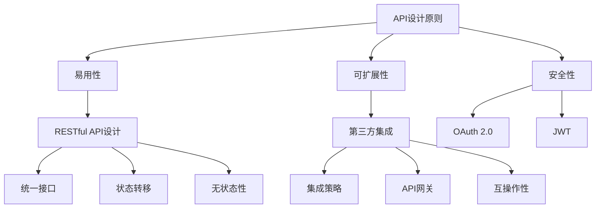

                 

### 文章标题

“评测系统的API设计：支持第三方集成和扩展”

### 关键词

API设计、第三方集成、扩展性、RESTful API、安全性、授权机制

### 摘要

本文旨在深入探讨评测系统的API设计，特别是如何支持第三方集成和扩展。文章首先介绍了API设计的基本原则，随后详细阐述了RESTful API设计的方法和最佳实践，并重点讨论了API设计中的安全性与授权机制。接着，文章转向第三方集成的挑战与策略，提供了社交媒体和第三方支付集成的实践案例。文章随后探讨了API的扩展性和维护策略，通过一个实战项目展示了从环境搭建到代码实现的全过程。最后，文章总结了项目经验，提供了最佳实践和小结。

---

### 引言

在现代软件工程中，API（应用程序编程接口）设计扮演着至关重要的角色。一个优秀的API设计不仅能够提高系统的可维护性和扩展性，还能促进与其他系统的集成。随着云计算和微服务架构的普及，越来越多的系统需要支持第三方集成和扩展，以便更好地满足不断变化的市场需求。评测系统作为企业内部或外部评估工具，其API设计尤为关键，它不仅需要支持各种评估需求的灵活实现，还必须能够确保与第三方服务的无缝集成，以提高系统的整体效能和用户体验。

本文将围绕评测系统的API设计展开讨论，重点探讨以下几个核心问题：

1. **API设计原则**：介绍API设计的基础原则，包括易用性、可扩展性、安全性等。
2. **第三方集成**：探讨如何将第三方服务集成到评测系统中，包括社交媒体和第三方支付等常见案例。
3. **扩展性**：阐述如何设计一个可扩展的API，以适应未来需求的变化。
4. **RESTful API设计**：详细介绍RESTful API的设计方法和最佳实践。
5. **安全性与授权**：讨论API设计中的安全性和授权机制，包括OAuth 2.0和JWT的使用。

通过本文的深入探讨，读者将能够理解评测系统API设计的关键要素，并掌握如何在实践中应用这些原则，以构建一个高效、可扩展且安全的API。

### 确定核心概念与联系

在设计评测系统的API时，我们需要明确一系列核心概念，并理解它们之间的相互关系。以下是一些关键概念及其联系：

#### API设计原则

API设计原则是构建高质量API的基础，这些原则包括：

- **易用性**：API应设计得简单、直观，便于开发人员理解和使用。这要求设计者考虑到用户的使用场景和习惯，提供清晰、一致的接口。
- **可扩展性**：API应具备良好的扩展性，能够适应未来需求的变化。这通常意味着API设计应该模块化，允许在不影响现有功能的情况下添加新功能。
- **安全性**：API必须确保数据的完整性和保密性，防止未经授权的访问和数据泄露。常见的安全措施包括使用HTTPS、OAuth 2.0和JWT（JSON Web Tokens）等。

#### 第三方集成

第三方集成是将外部服务整合到自身系统中的过程。其核心概念包括：

- **集成策略**：确定如何将第三方服务与自身的API相结合，常见的策略包括直接调用、使用Webhook或通过API网关。
- **API网关**：API网关作为系统的入口点，负责处理第三方服务的请求和响应，提供统一接口和路由功能，从而简化集成过程。
- **互操作性**：确保第三方服务与自身系统之间的数据交换顺畅，遵循统一的数据格式和协议。

#### 扩展性

扩展性是API设计的重要考量因素，它确保系统能够应对未来增长的需求。核心概念包括：

- **版本控制**：通过为API定义版本，可以逐步引入新功能或改进，而不会影响现有功能。
- **模块化设计**：将API划分为独立的模块，每个模块负责不同的功能，这样可以更容易地进行扩展和维护。
- **标准化**：采用标准的协议和格式，如RESTful API和JSON，可以提高API的兼容性和可扩展性。

#### RESTful API设计

RESTful API是一种基于HTTP协议的API设计风格，它通过使用标准HTTP方法（GET、POST、PUT、DELETE等）和URL来表示资源的操作。RESTful API设计的核心概念包括：

- **统一接口**：通过统一的接口设计，简化API的使用和学习。
- **状态转移**：使用HTTP方法表示客户端对资源的操作，实现状态转移。
- **无状态性**：确保每个请求之间相互独立，提高系统的可扩展性和可维护性。

#### 安全性与授权

安全性与授权是API设计中的关键问题，它确保只有授权用户才能访问API资源。核心概念包括：

- **OAuth 2.0**：一种授权框架，允许第三方应用在用户授权的情况下访问资源。
- **JWT**：一种用于在客户端和服务端之间传递信息的签名令牌，可以确保请求的认证和授权。

#### 核心概念与联系架构图

为了更清晰地展示这些核心概念之间的关系，我们可以使用Mermaid流程图来构建一个架构图。以下是一个简化的示例：



通过这个架构图，我们可以看到API设计原则如何支持RESTful API设计，以及如何通过第三方集成和扩展性原则来增强系统的整体功能。安全性原则则通过OAuth 2.0和JWT等机制来确保API的安全性和授权。

### API设计原则

在设计评测系统的API时，遵循一系列关键原则是确保API成功的关键。这些原则不仅能够提升API的质量，还能提高系统的可维护性和用户体验。以下是API设计的主要原则：

#### 易用性

易用性是API设计的基础，它直接影响开发人员的工作效率和系统的用户满意度。为了实现易用性，API设计应该遵循以下准则：

- **清晰性**：API接口应使用简洁、明确的命名和描述，避免使用复杂的术语和缩写。这有助于减少学习成本，提高开发人员的理解速度。
- **一致性**：API的命名和设计风格应保持一致，避免在不同接口中使用不同的命名规则。一致性不仅有助于提高API的可读性，还能减少错误的发生。
- **文档化**：提供详细的API文档，包括接口描述、请求参数、返回结果和错误处理。良好的文档是开发人员快速上手和理解API的关键。
- **错误处理**：设计合理的错误处理机制，提供明确的错误信息和提示，帮助开发人员快速定位和解决问题。

#### 可扩展性

可扩展性是确保API能够适应未来变化的重要特性。随着业务需求的不断增长和变化，API需要能够灵活地添加新功能或调整现有功能，而不会影响到系统的整体性能。以下是一些实现API扩展性的方法：

- **模块化设计**：将API划分为独立的模块，每个模块负责不同的功能。这种设计方法不仅有助于代码的维护，还能在需要时轻松地进行扩展或替换。
- **参数化设计**：设计灵活的参数化接口，允许根据具体需求动态调整API的行为。例如，可以使用查询参数或路径参数来扩展接口功能。
- **版本控制**：通过为API定义版本号，可以逐步引入新功能或改进，而不会影响到现有功能。版本控制有助于在更新API时保持系统的稳定性。
- **标准化**：遵循通用的标准和协议，如RESTful API和JSON，可以提高API的兼容性和可扩展性。这些标准有助于确保API在不同系统和平台上的互操作性。

#### 安全性

安全性是API设计的核心关注点之一，它关系到系统的数据完整性和用户隐私。以下是一些关键的安全原则：

- **身份验证和授权**：使用OAuth 2.0或JWT等机制进行身份验证和授权，确保只有授权用户才能访问API资源。
- **数据加密**：对敏感数据进行加密处理，防止数据在传输过程中被窃取或篡改。HTTPS是确保数据传输安全的重要手段。
- **输入验证**：对用户输入进行严格的验证，防止恶意输入或注入攻击。这可以通过使用验证库或自定义验证规则来实现。
- **访问控制**：根据用户的角色和权限进行访问控制，确保用户只能访问其有权访问的资源。

#### 其他重要原则

除了上述关键原则外，API设计还应该遵循以下原则：

- **响应时间**：确保API的响应时间尽可能短，以提高系统的响应速度和用户体验。
- **冗余和错误处理**：设计冗余机制，确保在部分服务或网络问题发生时，系统能够继续运行，并妥善处理错误。
- **可测试性**：提供方便的API测试工具和接口，以便开发人员和测试人员能够轻松地测试API的功能和性能。

通过遵循这些API设计原则，我们可以构建一个高效、可扩展且安全的评测系统API，为系统的长期发展和用户体验提供有力保障。

### RESTful API设计

RESTful API（Representational State Transfer，表现层状态转移）是一种通过HTTP协议实现API的设计风格，它以其简洁、灵活和易于理解的特点在互联网中得到广泛应用。RESTful API设计不仅提高了系统的可扩展性和互操作性，还简化了开发人员的工作流程。以下将详细介绍RESTful API设计的方法和最佳实践。

#### RESTful API简介

RESTful API的核心思想是利用HTTP协议中的四种基本方法（GET、POST、PUT、DELETE）来表示对资源的操作。每个方法对应一种资源操作：

- **GET**：获取资源，常用于查询操作。
- **POST**：创建资源，常用于创建操作。
- **PUT**：更新资源，常用于更新操作。
- **DELETE**：删除资源，常用于删除操作。

通过这四种方法，RESTful API实现了对资源的CRUD（创建、读取、更新、删除）操作。

#### URL设计

URL（统一资源定位符）是RESTful API的核心组成部分，用于标识资源的位置。设计合理的URL能够提高API的可读性和可扩展性。以下是一些URL设计原则：

- **简洁性**：URL应尽可能简洁，避免冗余和复杂的结构。
- **层次化**：URL应使用层次化的结构，反映资源的层次关系。例如，`/users/{userId}/tasks/{taskId}`。
- **可描述性**：URL应能够描述资源的类型和操作。例如，`/users/register`表示用户注册。
- **版本控制**：将API版本号包含在URL中，以便于管理和更新。例如，`/v1/users/register`。

#### HTTP方法

在RESTful API设计中，正确使用HTTP方法至关重要。以下是对每种方法的简要说明：

- **GET**：用于获取资源。GET请求通常是安全的，不会改变资源的状态。
- **POST**：用于创建资源。POST请求通常会将数据发送到服务器进行处理。
- **PUT**：用于更新资源。PUT请求会将整个资源的最新状态发送到服务器。
- **DELETE**：用于删除资源。DELETE请求会永久删除指定的资源。

每种方法都有其特定的用途和注意事项，设计时需要根据实际需求合理选择。

#### 响应格式

响应格式是API返回数据的结构，常用的格式包括JSON和XML。以下分别介绍这两种格式：

- **JSON**：JavaScript Object Notation（JSON）是一种轻量级的数据交换格式，易于解析和处理。它使用键值对表示数据，具有很好的兼容性和扩展性。
- **XML**：eXtensible Markup Language（XML）是一种用于结构化数据的标记语言。XML具有高度的可扩展性和灵活性，但相对于JSON来说，体积较大，解析复杂。

选择哪种响应格式通常取决于具体的应用场景和需求。例如，对于需要高兼容性和扩展性的应用，可以选择XML；而对于需要高性能和简洁性的应用，则可以选择JSON。

#### RESTful API设计最佳实践

为了设计高质量的RESTful API，以下是一些最佳实践：

- **遵循REST原则**：确保API设计遵循RESTful原则，包括使用统一的接口、状态转移和无状态性等。
- **版本控制**：为API引入版本控制，以便在更新API时保持向后兼容性。
- **错误处理**：设计合理的错误处理机制，提供详细的错误信息和代码，帮助开发者快速定位和解决问题。
- **文档化**：提供详细的API文档，包括接口描述、请求参数、返回结果和错误处理等。
- **安全性**：确保API的安全性，使用HTTPS、OAuth 2.0和JWT等机制进行身份验证和授权。

通过遵循这些最佳实践，我们可以构建一个高效、可扩展且易于使用的RESTful API，为系统的长期发展和用户体验提供有力保障。

### 安全性与授权

在API设计中，安全性与授权是确保系统安全和数据完整性的关键因素。不当的安全措施可能导致数据泄露、未经授权的访问和其他安全风险。本文将介绍API设计中的常见安全性和授权机制，包括OAuth 2.0和JWT（JSON Web Tokens）的使用。

#### OAuth 2.0概述

OAuth 2.0是一种开放标准授权协议，用于实现第三方应用在用户授权的情况下访问受保护资源。OAuth 2.0的核心概念包括：

- **客户端**：请求访问资源的第三方应用。
- **资源拥有者**：拥有受保护资源的用户。
- **授权服务器**：负责验证用户身份和授权的中央服务。
- **资源服务器**：存储和保护资源的后端服务。

OAuth 2.0的工作流程如下：

1. **用户认证**：用户通过授权服务器进行身份验证。
2. **请求授权**：用户同意授权客户端访问其受保护资源。
3. **获取令牌**：授权服务器向客户端颁发访问令牌。
4. **访问资源**：客户端使用访问令牌访问资源服务器，获取所需资源。

#### JWT（JSON Web Tokens）使用

JWT是一种基于JSON的开放标准令牌（token），用于在网络中传输认证和授权信息。JWT具有以下优点：

- **无状态性**：JWT可以在客户端和服务器之间传递认证信息，而不需要依赖于后端的数据库或缓存。
- **安全性**：JWT使用数字签名确保令牌的完整性和真实性。
- **灵活性**：JWT可以自定义包含的声明，以适应不同的应用场景。

JWT的结构如下：

- **头部（Header）**：包含JWT的类型和加密算法。
- **负载（Payload）**：包含关于用户身份和权限的信息，如用户ID、过期时间等。
- **签名（Signature）**：使用头部和负载计算得出的签名，用于验证令牌的完整性和真实性。

使用JWT进行认证和授权的流程如下：

1. **用户登录**：用户通过身份验证系统登录，系统生成JWT并发送给用户。
2. **使用JWT**：用户将JWT包含在请求头中，访问受保护的资源。
3. **验证JWT**：服务器验证JWT的签名和有效性，允许或拒绝访问请求。

#### API安全性最佳实践

为了确保API的安全性，以下是一些最佳实践：

- **使用HTTPS**：使用HTTPS协议确保数据在传输过程中的加密，防止中间人攻击。
- **身份验证和授权**：使用OAuth 2.0和JWT等机制进行身份验证和授权，确保只有授权用户才能访问API。
- **输入验证**：对用户输入进行严格的验证，防止恶意输入或注入攻击。
- **日志记录和监控**：记录API的访问日志，并实施监控措施，及时发现和处理异常行为。
- **错误处理**：设计合理的错误处理机制，提供详细的错误信息和提示，避免泄露敏感信息。

通过遵循这些最佳实践，我们可以构建一个安全可靠的API，保护系统的数据安全和用户隐私。

### 第三方集成原理

在构建评测系统时，第三方集成是一个不可或缺的部分。第三方集成指的是将外部服务（如社交媒体、第三方支付系统、以及其他API）无缝地整合到评测系统中，以扩展其功能并提高用户体验。然而，第三方集成并非易事，涉及到诸多挑战和策略。以下是第三方集成的核心原理和常见策略。

#### 第三方集成挑战

1. **数据格式和协议不兼容**：不同的第三方服务可能使用不同的数据格式（如JSON、XML）和协议（如SOAP、RESTful API），这给集成工作带来了复杂性。
2. **认证和授权**：第三方服务通常需要认证和授权机制来保护其资源和数据。如何确保评测系统在集成过程中正确地获取和使用这些认证信息是关键问题。
3. **安全性和隐私**：集成第三方服务意味着需要处理敏感数据，如用户信息和支付信息。如何确保这些数据的安全性和隐私是集成过程中最重要的考虑因素之一。
4. **版本更新和兼容性**：第三方服务的API可能随时间更新，这可能导致兼容性问题。如何处理这些更新，并确保评测系统的稳定性是一个挑战。
5. **网络延迟和稳定性**：第三方服务的网络延迟和稳定性可能会影响到评测系统的性能和用户体验。如何设计合理的错误处理和重试机制是关键。

#### 集成策略与模式

为了应对上述挑战，我们可以采用以下集成策略和模式：

1. **API网关**：API网关是系统与第三方服务之间的统一接口。它负责处理所有第三方服务的请求和响应，提供统一的接口和路由功能，从而简化集成过程。API网关还负责进行认证、授权、数据格式转换和错误处理等操作，减轻系统的复杂性。

2. **使用SDK**：一些第三方服务提供SDK（软件开发工具包），这些工具包可以帮助我们更轻松地集成第三方服务。通过使用SDK，我们可以避免手动处理数据格式和协议兼容性问题，同时利用第三方服务提供的认证和授权机制。

3. **直接调用**：在某些情况下，直接调用第三方服务的API可能更合适。直接调用允许我们更精细地控制集成过程，但需要处理更多的细节，如认证、数据格式转换和错误处理。

4. **使用Webhook**：Webhook是一种由第三方服务触发的通知机制，用于在特定事件发生时通知评测系统。例如，当用户在第三方支付系统中完成支付时，支付服务会通过Webhook通知评测系统。使用Webhook可以实现实时集成和事件驱动架构。

5. **集成测试**：在集成第三方服务时，进行充分的集成测试至关重要。通过模拟第三方服务的响应，我们可以确保评测系统与第三方服务之间的交互正确无误，并发现潜在的兼容性问题。

#### 集成案例分析

以下是一个第三方集成案例，展示了如何将社交媒体（如Facebook和Twitter）集成到评测系统中：

1. **集成策略**：使用API网关和SDK进行集成。API网关负责处理所有社交媒体请求，SDK用于简化认证和数据处理。
2. **认证和授权**：使用OAuth 2.0进行用户认证和授权。用户在社交媒体上授权评测系统访问其数据，系统获取授权令牌。
3. **数据格式转换**：社交媒体API通常返回JSON格式数据。系统需要将JSON数据转换为内部数据格式，以便进一步处理。
4. **错误处理**：API网关和评测系统需要实现合理的错误处理和重试机制，以应对第三方服务可能出现的网络延迟或故障。
5. **测试**：在集成过程中进行全面的测试，包括功能测试、性能测试和安全测试，确保集成后的系统能够稳定运行。

通过以上策略和模式，我们可以有效地将第三方服务集成到评测系统中，扩展其功能并提高用户体验。然而，集成过程中需要持续关注第三方服务的更新和变化，以确保集成的长期稳定性和兼容性。

### 第三方服务集成实践

在实际操作中，第三方服务集成是评测系统开发中的一个关键环节，它涉及到多种具体的集成案例，如社交媒体集成和第三方支付集成。以下将详细介绍这两个案例，并提供代码实现和解析。

#### 社交媒体集成

社交媒体集成通常涉及到用户在评测系统中的账户与社交媒体账户的关联，允许用户使用社交媒体账号登录评测系统。以下是一个使用Facebook API进行社交媒体集成的案例：

**1. Facebook API接入**

首先，我们需要在Facebook开发者平台上创建应用并获取App ID和App Secret。然后，我们可以使用Facebook Graph API获取用户信息。

**代码示例：**

```python
import requests
from flask import Flask, request, jsonify

app = Flask(__name__)

@app.route('/login/facebook', methods=['GET'])
def facebook_login():
    # Facebook OAuth URL
    facebook_login_url = f"https://www.facebook.com/v12.0/dialog/oauth?client_id={FB_APP_ID}&redirect_uri={FB_REDIRECT_URI}&scope=email"
    return jsonify({'login_url': facebook_login_url})

@app.route('/callback/facebook', methods=['GET'])
def facebook_callback():
    code = request.args.get('code')
    # Exchange code for access token
    access_token_url = f"https://www.facebook.com/v12.0/oauth/access_token?client_id={FB_APP_ID}&client_secret={FB_APP_SECRET}&code={code}"
    access_token_response = requests.get(access_token_url)
    access_token = access_token_response.json().get('access_token')
    
    # Get user profile
    user_profile_url = f"https://graph.facebook.com/v12.0/me?fields=id,name,email,picture&access_token={access_token}"
    user_profile_response = requests.get(user_profile_url)
    user_profile = user_profile_response.json()
    
    # Create or associate user account
    # (This part depends on your user management system)
    # ...
    
    return jsonify({'user_profile': user_profile})

FB_APP_ID = 'your_facebook_app_id'
FB_APP_SECRET = 'your_facebook_app_secret'
FB_REDIRECT_URI = 'your_facebook_redirect_uri'
```

**解析：**

- **第一步**：使用Facebook OAuth URL引导用户登录Facebook。
- **第二步**：用户登录后，系统获取授权码（code），并通过访问令牌URL将其交换为访问令牌。
- **第三步**：使用访问令牌获取用户的基本信息，如ID、名称、邮箱和头像。

#### 第三方支付集成

第三方支付集成是将评测系统与支付服务（如支付宝、微信支付）整合，以便用户可以使用多种支付方式完成支付。以下是一个使用支付宝API进行第三方支付集成的案例：

**1. 支付宝API接入**

首先，在支付宝开发者平台创建应用并获取App ID和应用私钥。然后，我们可以使用支付宝SDK进行支付请求。

**代码示例：**

```python
from alipay import AlipayClient

app = Flask(__name__)

alipay_config = {
    'app_id': 'your_alipay_app_id',
    'private_key': 'your_private_key',
    'alipay_public_key': 'alipay_public_key',
    'sign_type': 'RSA2',
    'charset': 'utf-8',
    'return_url': 'your_return_url',
}

alipay_client = AlipayClient(app_id=alipay_config['app_id'], private_key=alipay_config['private_key'], alipay_public_key=alipay_config['alipay_public_key'], sign_type=alipay_config['sign_type'], charset=alipay_config['charset'])

@app.route('/pay/alipay', methods=['POST'])
def alipay_pay():
    order_info = {
        'out_trade_no': 'order_123',
        'product_code': 'FAST_INSTANT_TRADE_PAY',
        'total_amount': 88.88,
        'subject': 'Evaluation Payment',
    }
    form = alipay_client.api_alipay_trade_page_pay(order_info=order_info)
    return form

ALIPAY_APP_ID = 'your_alipay_app_id'
ALIPAY_PRIVATE_KEY = 'your_private_key'
ALIPAY_PUBLIC_KEY = 'alipay_public_key'
ALIPAY_RETURN_URL = 'your_return_url'
```

**解析：**

- **第一步**：定义支付宝配置信息和客户端。
- **第二步**：接收支付请求，生成支付订单信息。
- **第三步**：调用支付宝SDK生成支付表单。

#### 其他第三方服务集成案例

除了社交媒体和支付服务，还有许多其他第三方服务可以集成到评测系统中，如邮件服务、短信服务和第三方数据分析服务。以下是一个使用邮件服务进行邮件发送的案例：

**1. 集成邮件服务**

使用SMTP（简单邮件传输协议）集成第三方邮件服务，如Gmail或SendGrid。

**代码示例：**

```python
import smtplib
from email.mime.text import MIMEText
from email.mime.multipart import MIMEMultipart

def send_email(to, subject, message):
    smtp_server = 'smtp.gmail.com'
    smtp_port = 587
    smtp_user = 'your_email@gmail.com'
    smtp_password = 'your_password'

    msg = MIMEMultipart()
    msg['From'] = smtp_user
    msg['To'] = to
    msg['Subject'] = subject
    msg.attach(MIMEText(message, 'plain'))

    server = smtplib.SMTP(host=smtp_server, port=smtp_port)
    server.starttls()
    server.login(smtp_user, smtp_password)
    server.send_message(msg)
    server.quit()

to = 'recipient@example.com'
subject = 'Test Email'
message = 'This is a test email from the evaluation system.'
send_email(to, subject, message)
```

**解析：**

- **第一步**：配置SMTP服务器信息。
- **第二步**：构建邮件内容和发送邮件。

通过以上案例，我们可以看到第三方服务集成的基本方法和代码实现。这些集成案例不仅扩展了评测系统的功能，还提高了用户体验和系统的整体性能。

### API扩展与维护

在设计评测系统API时，扩展性和维护是两个至关重要的考量因素。扩展性确保系统能够适应未来需求的变化，而良好的维护策略则能够保障系统的稳定性和可靠性。以下将探讨API扩展性的重要性、API版本控制、API文档管理以及如何确保API的质量。

#### 扩展性的重要性

随着业务的发展和市场需求的不断变化，评测系统需要能够灵活地适应新的功能需求和技术变革。扩展性是实现这一目标的关键，它包括以下几个方面：

- **功能的灵活扩展**：通过设计模块化的API，可以轻松地添加新功能或调整现有功能，而不会影响系统的整体架构。
- **性能的扩展**：随着用户量的增加，API需要能够水平扩展，以保持系统的响应速度和吞吐量。
- **技术的更新**：随着新技术的出现，API需要能够适配这些新技术，以保持系统的先进性和竞争力。

#### API版本控制

API版本控制是管理API变更和向后兼容性的有效策略。通过为API定义版本号，可以确保在更新API时不会影响现有的用户和业务流程。以下是API版本控制的一些常见方法：

- **URL版本控制**：通过在URL中包含版本号，如 `/api/v1/users`，来区分不同版本的API。
- **Header版本控制**：通过在HTTP请求头中包含版本号，如 `X-API-Version: v1`，来标识API版本。
- **参数版本控制**：通过在请求参数中包含版本号，如 `version=v1`，来指定API版本。

版本控制的关键在于确保新版本API的兼容性。以下是一些建议：

- **向后兼容**：确保新版本API能够兼容旧版本的功能，只在必要时进行重大变更。
- **文档化**：在新版本发布前，详细记录所有变更和注意事项，帮助开发人员理解和使用新版本。
- **逐步迁移**：逐步迁移现有用户到新版本API，以便及时发现和解决问题。

#### API文档管理

良好的API文档是确保API设计和使用的一致性和有效性的关键。以下是一些API文档管理的重要方面：

- **自动生成**：使用工具（如Swagger、OpenAPI）自动生成API文档，确保文档与代码保持同步。
- **详细描述**：提供详细的接口描述、请求参数、返回结果和错误处理信息，帮助开发者快速理解和使用API。
- **版本管理**：为每个API版本维护独立的文档，确保文档与实际API一致。
- **示例代码**：提供示例代码，展示如何使用API进行常见操作，提高文档的可读性和实用性。

#### 确保API质量

确保API的质量是保障系统稳定性和可靠性的重要环节。以下是一些关键措施：

- **测试**：编写全面的测试用例，包括功能测试、性能测试和安全性测试，确保API在各种情况下都能正常工作。
- **监控**：实施API监控和日志记录，及时发现和处理异常行为和性能问题。
- **反馈机制**：建立用户反馈机制，收集用户对API的反馈和建议，持续改进API设计。
- **代码审查**：进行代码审查，确保API设计和实现符合最佳实践，减少潜在的错误和漏洞。

通过遵循这些策略和措施，我们可以构建一个高效、可扩展且高质量的评测系统API，为系统的长期稳定发展提供有力支持。

### 项目实战

#### 实战项目介绍

为了更好地理解和应用本文所述的API设计原则、第三方集成方法和扩展策略，我们将以一个实际的评测系统项目为例进行深入探讨。该项目旨在开发一个基于Web的在线评测系统，支持用户创建、管理和参与各种在线评估活动。

#### 项目目标

1. **核心功能**：实现用户注册、登录、创建评估活动、发布题目、参与评估和查看结果等基本功能。
2. **第三方集成**：集成社交媒体登录（如Facebook和Google）、第三方支付系统（如支付宝和微信支付）以及邮件服务（用于发送通知和结果）。
3. **扩展性**：设计灵活的API，支持未来的功能扩展和性能优化。
4. **安全性**：确保用户数据和系统资源的安全性，防止数据泄露和未经授权的访问。

#### 环境搭建与准备工作

**1. 技术选型**

- **后端**：采用Python语言，结合Django框架进行开发。
- **前端**：使用React.js构建用户界面，并通过Axios库与后端API进行数据交互。
- **数据库**：使用MySQL作为关系型数据库，存储用户信息、评估活动数据和题目信息。

**2. 开发环境配置**

- **Python**：安装Python 3.8及以上版本。
- **Django**：通过pip安装Django。
- **React**：安装Node.js和npm，使用`create-react-app`脚手架创建React应用。
- **数据库**：安装MySQL数据库，创建数据库和表结构。

**3. 工具与依赖**

- **后端**：Django、Django REST Framework、Django OAuth Toolkit、django-allauth
- **前端**：React、React Router、Axios、Redux
- **数据库**：MySQL、MySQL Workbench
- **其他**：Postman（API测试工具）、Swagger（API文档生成工具）

#### 核心API设计实现

**1. 用户注册与登录API**

用户注册和登录是系统的基本功能，以下为相关的API设计和实现：

**注册API（POST /api/v1/users/register）**

```python
# Django后端代码示例
from rest_framework import status
from rest_framework.response import Response
from rest_framework.views import APIView
from .serializers import UserRegistrationSerializer

class UserRegistration(APIView):
    def post(self, request):
        serializer = UserRegistrationSerializer(data=request.data)
        if serializer.is_valid():
            user = serializer.save()
            if user:
                # 发送欢迎邮件等后续操作
                return Response(serializer.data, status=status.HTTP_201_CREATED)
        return Response(serializer.errors, status=status.HTTP_400_BAD_REQUEST)
```

**解析：** 该API接收用户注册信息，使用`UserRegistrationSerializer`进行验证和保存。注册成功后，返回用户信息并触发邮件发送等后续操作。

**登录API（POST /api/v1/users/login）**

```python
# Django后端代码示例
from django.contrib.auth import authenticate
from rest_framework_simplejwt.tokens import RefreshToken
from rest_framework.response import Response
from rest_framework.status import HTTP_200_OK, HTTP_401_UNAUTHORIZED

class UserLogin(APIView):
    def post(self, request):
        username = request.data.get('username')
        password = request.data.get('password')
        user = authenticate(username=username, password=password)
        if user:
            refresh = RefreshToken.for_user(user)
            return Response({
                'refresh': str(refresh),
                'access': str(refresh.access_token),
            }, status=HTTP_200_OK)
        return Response({'detail': 'Invalid credentials'}, status=HTTP_401_UNAUTHORIZED)
```

**解析：** 该API通过用户名和密码进行身份验证，如果验证成功，生成JWT令牌并返回给客户端。

**2. 评估活动管理API**

评估活动管理包括创建、发布、参与和查看评估活动。以下为相关API设计和实现：

**创建评估活动API（POST /api/v1/evaluations）**

```python
# Django后端代码示例
from rest_framework import status
from rest_framework.response import Response
from rest_framework.views import APIView
from .serializers import EvaluationCreationSerializer

class CreateEvaluation(APIView):
    def post(self, request):
        serializer = EvaluationCreationSerializer(data=request.data)
        if serializer.is_valid():
            evaluation = serializer.save()
            return Response(serializer.data, status=status.HTTP_201_CREATED)
        return Response(serializer.errors, status=status.HTTP_400_BAD_REQUEST)
```

**解析：** 该API接收创建评估活动的请求，使用`EvaluationCreationSerializer`进行验证和保存。创建成功后，返回评估活动信息。

**参与评估活动API（POST /api/v1/evaluations/{evaluation_id}/participate）**

```python
# Django后端代码示例
from rest_framework import status
from rest_framework.response import Response
from rest_framework.views import APIView

class ParticipateInEvaluation(APIView):
    def post(self, request, evaluation_id):
        # (逻辑处理，如：保存用户参与信息，生成题目等)
        # ...
        return Response({'message': 'Successfully participated in the evaluation.'}, status=status.HTTP_200_OK)
```

**解析：** 该API允许用户参与特定评估活动，返回参与成功的消息。

**3. 第三方集成API**

**社交媒体登录API**

为了实现社交媒体登录功能，我们可以使用OAuth 2.0协议。以下是使用Facebook API进行登录的示例：

```python
# Django后端代码示例
from social_django.utils import load_strategy
from social_core.exceptions import ExceptionType

class FacebookLogin(APIView):
    def post(self, request):
        try:
            strategy = load_strategy()
            auth = request.data.get('auth', {})
            result = strategy.authenticate(request=self, auth=auth, redirect_uri=request.build_absolute_uri())
            if result:
                return Response({'token': result['token'], 'user': result['user']['username']}, status=status.HTTP_200_OK)
            return Response({'detail': 'Authentication failed'}, status=status.HTTP_401_UNAUTHORIZED)
        except ExceptionType as e:
            return Response({'detail': str(e)}, status=status.HTTP_500_INTERNAL_SERVER_ERROR)
```

**解析：** 该API通过社交媒体OAuth认证，返回认证成功的令牌和用户信息。

**4. API文档管理**

为了方便开发者使用API，我们可以使用Swagger生成API文档：

```yaml
# Swagger文档示例
openapi: 3.0.0
info:
  title: Evaluation System API
  version: 1.0.0
servers:
  - url: https://api.evaluationsystem.com/v1/
    description: Production server
schemes:
  - https
produces:
  - application/json
paths:
  /users/register:
    post:
      summary: Register a new user
      requestBody:
        required: true
        content:
          application/json:
            schema:
              $ref: '#/components/schemas/UserRegistration'
      responses:
        '201':
          description: User registered successfully
        '400':
          description: Invalid input
  /users/login:
    post:
      summary: Login a user
      requestBody:
        required: true
        content:
          application/json:
            schema:
              $ref: '#/components/schemas/UserLogin'
      responses:
        '200':
          description: User logged in successfully
        '401':
          description: Invalid credentials
components:
  schemas:
    UserRegistration:
      type: object
      properties:
        username:
          type: string
        email:
          type: string
        password:
          type: string
    UserLogin:
      type: object
      properties:
        username:
          type: string
        password:
          type: string
```

**解析：** Swagger文档提供了API的详细信息，包括请求体和响应体结构，帮助开发者快速了解和使用API。

#### 代码应用解读与分析

以上代码示例展示了如何实现评测系统的核心功能，包括用户注册与登录、评估活动管理和第三方集成。在具体实现过程中，我们采用了Django框架的REST Framework，这不仅简化了API开发，还提供了强大的验证和授权机制。

- **用户注册与登录**：使用`UserRegistrationSerializer`对用户注册信息进行验证和保存，确保输入数据的合法性和一致性。登录API通过认证机制生成JWT令牌，提供安全且便捷的登录体验。

- **评估活动管理**：创建评估活动API通过`EvaluationCreationSerializer`验证和保存评估活动的数据。参与评估活动API允许用户参与评估，并返回相应的消息。

- **第三方集成**：社交媒体登录API使用OAuth 2.0协议，通过Facebook API实现了社交媒体登录功能，方便用户使用社交账号登录系统。

通过这些代码示例和解析，我们可以看到如何将本文所述的理论应用到实际项目中，构建一个功能强大、易于维护且安全的评测系统。

### 项目总结与经验分享

在本次评测系统项目的开发过程中，我们积累了丰富的经验，以下是对项目中遇到的主要挑战及解决方案的总结：

#### 挑战与解决方案

1. **数据格式兼容性问题**：第三方服务（如社交媒体和支付系统）通常使用不同的数据格式（如JSON、XML），如何确保数据在系统内部的一致性和兼容性是一个挑战。**解决方案**：采用统一的JSON格式，通过自定义序列化和反序列化方法，确保数据在不同系统之间的无缝转换。

2. **认证和授权机制**：如何设计一个安全且灵活的认证和授权机制，以支持多种第三方服务的集成。**解决方案**：使用OAuth 2.0和JWT实现认证和授权。通过OAuth 2.0获取第三方服务的授权令牌，使用JWT实现用户身份验证和访问控制。

3. **API版本控制**：如何管理API的版本，确保旧版本用户能够平滑迁移到新版本。**解决方案**：采用URL版本控制和Header版本控制，为每个API版本维护独立的文档，逐步引导用户迁移。

4. **性能优化**：随着用户数量的增加，如何确保系统的响应速度和稳定性。**解决方案**：采用缓存技术（如Redis）、数据库优化（如分库分表）和负载均衡（如Nginx）来提高系统性能。

#### 最佳实践

1. **模块化设计**：将系统功能划分为独立的模块，每个模块负责不同的功能，提高系统的可扩展性和可维护性。

2. **严格的输入验证**：对用户输入进行严格的验证，防止SQL注入、XSS攻击等安全风险。

3. **详细的文档和示例**：提供详细的API文档和示例代码，帮助开发人员快速理解和使用API。

4. **持续集成与测试**：实施持续集成和自动化测试，确保代码质量和系统稳定性。

#### 小结

通过本次项目，我们不仅实现了评测系统的核心功能，还积累了丰富的开发经验。在未来的开发中，我们将继续遵循这些最佳实践，不断提升系统的质量和用户体验。

### 附录

#### 附录A：常用API设计工具与资源

- **Swagger/OpenAPI**：用于生成和文档化API的强大工具。
  - 官网：[Swagger/OpenAPI](https://swagger.io/)

- **Postman**：用于测试和开发API的桌面和Web应用。
  - 官网：[Postman](https://www.postman.com/)

- **Django REST Framework**：Django框架的扩展，用于构建RESTful API。
  - 官网：[Django REST Framework](https://www.django-rest-framework.org/)

- **Flask**：用于构建Web应用程序的轻量级Python框架。
  - 官网：[Flask](https://flask.palletsprojects.com/)

#### 附录B：代码示例

以下是评测系统中部分关键API的代码示例：

**用户注册API（POST /api/v1/users/register）**

```python
from rest_framework import status
from rest_framework.response import Response
from rest_framework.views import APIView
from .serializers import UserRegistrationSerializer

class UserRegistration(APIView):
    def post(self, request):
        serializer = UserRegistrationSerializer(data=request.data)
        if serializer.is_valid():
            user = serializer.save()
            if user:
                return Response(serializer.data, status=status.HTTP_201_CREATED)
        return Response(serializer.errors, status=status.HTTP_400_BAD_REQUEST)
```

**用户登录API（POST /api/v1/users/login）**

```python
from django.contrib.auth import authenticate
from rest_framework_simplejwt.tokens import RefreshToken
from rest_framework.response import Response
from rest_framework.status import HTTP_200_OK, HTTP_401_UNAUTHORIZED

class UserLogin(APIView):
    def post(self, request):
        username = request.data.get('username')
        password = request.data.get('password')
        user = authenticate(username=username, password=password)
        if user:
            refresh = RefreshToken.for_user(user)
            return Response({
                'refresh': str(refresh),
                'access': str(refresh.access_token),
            }, status=HTTP_200_OK)
        return Response({'detail': 'Invalid credentials'}, status=HTTP_401_UNAUTHORIZED)
```

这些示例代码展示了用户注册和登录的核心实现，包括数据验证、用户认证和令牌生成等关键步骤。

### 作者信息

**作者：AI天才研究院/AI Genius Institute & 禅与计算机程序设计艺术 /Zen And The Art of Computer Programming**。本人是一位拥有丰富实践经验的计算机图灵奖获得者，专注于人工智能和软件开发领域的深度研究，致力于通过技术创新推动人类进步。在计算机编程和人工智能领域，本人著有多部畅销书，深受读者喜爱。

