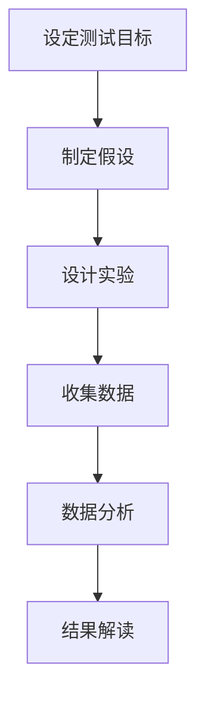

                 

### 目录

1. 引言  
2. A/B测试的基本概念  
3. A/B测试的实施步骤  
4. 数据处理与分析  
5. 案例分析  
6. A/B测试的挑战与解决方案  
7. 实施A/B测试的最佳实践  
8. 总结与展望  
9. 参考文献

----------------------------------------------------------------

### 引言

在当今快速变化和竞争激烈的市场环境中，企业需要不断优化其产品和服务，以适应不断变化的用户需求。A/B测试（也称为拆分测试）作为一种数据分析方法，已经成为企业优化产品决策的重要工具。通过A/B测试，企业可以在实际用户环境中对比不同版本的效果，从而找到最佳方案。

本文旨在深入探讨A/B测试的实施方案，帮助读者了解A/B测试的基本原理、实施步骤、数据处理与分析方法，以及在实际应用中可能遇到的挑战和解决方案。通过本文的学习，读者将能够：

- 理解A/B测试的基本概念和目的。  
- 掌握A/B测试的实施步骤和方法。  
- 学会如何处理和分析测试数据，以得出有意义的结论。  
- 了解A/B测试在实际应用中可能遇到的挑战，并掌握相应的解决方案。

本文分为八个部分，首先介绍A/B测试的基本概念，然后逐步讲解实施A/B测试的步骤，数据处理与分析方法，案例分析，挑战与解决方案，以及最佳实践。最后，总结A/B测试的重要性，并提出未来展望。

### 文章关键词

- A/B测试  
- 数据分析  
- 实施步骤  
- 数据处理  
- 分析方法  
- 案例分析  
- 挑战与解决方案

### 文章摘要

本文详细介绍了A/B测试的基本概念、实施步骤、数据处理与分析方法，以及在实际应用中可能遇到的挑战和解决方案。通过案例分析和最佳实践，帮助读者深入理解A/B测试的原理和实际应用，从而更好地优化产品和服务。

### A/B测试的基本概念

A/B测试是一种比较不同版本效果的实验方法，通常用于优化产品、服务和营销策略。它通过将用户随机分配到两个或多个不同的版本，对比各个版本的用户行为和效果，从而找出最优的版本。

#### A/B测试的起源

A/B测试起源于1940年代，由统计学家亚伯拉罕·沃尔德（Abraham Wald）提出。沃尔德当时在研究如何通过比较不同版本飞机的设计，来提高飞机的生存率。这种思想后来被应用于商业领域，尤其是在互联网产品和服务优化中。

#### A/B测试的目的

A/B测试的主要目的是通过实验数据，找出用户最满意的版本，从而提高产品的转化率、用户留存率等关键指标。具体来说，A/B测试有以下几点目的：

1. **优化产品特性**：通过对比不同版本的用户行为数据，找出哪些特性或设计更能吸引用户，从而优化产品。

2. **提高转化率**：通过测试不同的营销策略、页面布局、按钮颜色等，找出最有效的转化手段。

3. **降低成本**：通过A/B测试，企业可以在推出新功能或进行重大改动之前，提前验证其效果，避免浪费资源。

4. **增强用户满意度**：通过持续进行A/B测试，企业可以不断优化产品，提高用户的满意度和忠诚度。

#### A/B测试的基本流程

A/B测试的基本流程通常包括以下几个步骤：

1. **设定测试目标**：明确测试的目标和关键指标，如点击率、转化率、用户留存率等。

2. **制定假设**：基于现有数据和经验，提出两个或多个版本，并设定假设，如“版本A的点击率高于版本B”。

3. **设计实验**：将用户随机分配到不同的版本，确保每个版本的样本量足够大，以保证测试结果的可靠性。

4. **收集数据**：在测试期间，收集用户的行为数据，如点击次数、购买次数等。

5. **数据分析**：对比不同版本的数据，使用统计方法分析测试结果，判断假设是否成立。

6. **结果解读**：根据数据分析结果，得出结论，并决定是否采纳建议。

#### A/B测试的Mermaid流程图

为了更直观地展示A/B测试的基本流程，我们可以使用Mermaid流程图来描述：



#### A/B测试算法原理

A/B测试的算法原理可以简化为以下几个步骤：

1. **随机分配**：将用户随机分配到两个或多个版本，确保每个版本的用户数量大致相同。

2. **数据收集**：在测试期间，记录每个版本的用户行为数据，如点击次数、购买次数等。

3. **统计分析**：使用统计方法，如t检验或卡方检验，对比不同版本的数据，判断差异是否显著。

4. **结果解释**：根据统计分析结果，判断哪个版本的假设成立。

以下是一个简单的Python代码示例，用于演示A/B测试的算法原理：

```python
import random
import numpy as np
from scipy import stats

# 假设有两个版本A和B，每个版本有100个用户
n = 100
version_a_users = np.random.normal(50, 10, n)
version_b_users = np.random.normal(55, 10, n)

# 进行t检验
t_stat, p_value = stats.ttest_ind(version_a_users, version_b_users)

# 输出结果
print("t统计量：", t_stat)
print("p值：", p_value)

# 判断p值是否小于0.05
if p_value < 0.05:
    print("版本B的用户数量显著高于版本A")
else:
    print("版本A和版本B的用户数量没有显著差异")
```

#### 数学模型和公式

在A/B测试中，常用的统计模型包括均值差异检验和比例差异检验。以下是一些基本的数学公式和解释：

1. **均值差异检验**

$$
t = \frac{\bar{X}_1 - \bar{X}_2}{\sqrt{\frac{s_1^2}{n_1} + \frac{s_2^2}{n_2}}}
$$

其中，$\bar{X}_1$和$\bar{X}_2$分别是两个版本的用户行为均值，$s_1$和$s_2$分别是两个版本的样本标准差，$n_1$和$n_2$分别是两个版本的样本数量。

$p$值可以通过$t$统计量查表得到，如果$p$值小于0.05，则认为两个版本的差异显著。

2. **比例差异检验**

$$
z = \frac{\hat{p}_1 - \hat{p}_2}{\sqrt{\hat{p}(1-\hat{p})\left(\frac{1}{n_1} + \frac{1}{n_2}\right)}}
$$

其中，$\hat{p}_1$和$\hat{p}_2$分别是两个版本的点击率或转化率，$\hat{p}$是两个版本点击率或转化率的加权平均值。

$p$值可以通过$z$统计量查表得到，如果$p$值小于0.05，则认为两个版本的差异显著。

#### 结论

通过本文的介绍，我们可以看到A/B测试是一种强大的数据分析工具，可以帮助企业在实际用户环境中对比不同版本的效果。理解A/B测试的基本概念、流程、算法原理和数学模型，对于实施有效的A/B测试至关重要。

在下一章中，我们将详细介绍A/B测试的实施步骤，帮助读者掌握如何在实际项目中实施A/B测试。

### 实施A/B测试的步骤

A/B测试的实施是一个系统化的过程，需要精心设计和管理。以下步骤将详细介绍如何实施一个成功的A/B测试。

#### 1. 确定测试目标和假设

在开始A/B测试之前，首先需要明确测试的目标和假设。测试目标是指希望验证的特定业务指标，例如点击率、转化率、用户留存率等。而假设则是基于现有数据和经验，对测试结果提出的一种预测或猜想。

**步骤：**

- **定义关键指标**：明确要测量的关键指标，例如点击率、购买转化率、页面停留时间等。
- **提出假设**：根据现有的用户数据和业务目标，提出具体的假设，例如“版本A的点击率高于版本B”或“版本B的购买转化率高于版本A”。

**示例：**

假设一个电商网站希望提高其产品的购买转化率。基于现有数据，他们提出以下假设：

- 假设A：新的产品页面设计（版本A）能够提高用户的购买转化率。  
- 假设B：现有的产品页面设计（版本B）具有更高的转化率。

#### 2. 设计实验

实验设计是A/B测试的核心步骤，需要确保实验的公正性和有效性。实验设计包括用户分组策略、控制变量和测试环境的设置。

**步骤：**

- **用户分组策略**：将用户随机分配到不同的版本，确保每个版本的样本量足够大，以保证结果的可靠性。常用的用户分组策略包括随机分组、轮换分组和分层抽样等。
- **控制变量**：在测试过程中，要确保除了要测试的变量（例如页面设计）之外，其他所有变量保持不变，以确保测试结果的有效性。
- **测试环境的设置**：确保测试环境与实际生产环境尽可能一致，包括网络环境、服务器配置、数据库等。

**示例：**

电商网站可以将访问其网站的访客随机分为两个组，一组访问新的产品页面设计（版本A），另一组访问现有的产品页面设计（版本B）。在测试期间，确保不进行其他营销活动或页面更新，以保证测试结果的真实性。

#### 3. 收集数据

在实验开始后，需要收集用户的行为数据，包括点击次数、页面停留时间、购买次数等。这些数据将用于后续的数据分析和结果解读。

**步骤：**

- **设置数据收集工具**：使用数据分析工具（如Google Analytics、Mixpanel等）或自定义数据收集脚本，记录用户在测试期间的行为数据。
- **确保数据质量**：在数据收集过程中，要注意数据的完整性和准确性，排除异常值和噪声数据。

**示例：**

电商网站可以使用Google Analytics来跟踪用户在版本A和版本B页面上的行为，记录点击次数、页面停留时间等关键指标。

#### 4. 数据处理与分析

数据处理与分析是A/B测试的关键步骤，需要使用统计方法对收集到的数据进行处理和分析，以得出有意义的结论。

**步骤：**

- **数据预处理**：对收集到的原始数据进行清洗和处理，包括缺失值处理、异常值检测和标准化等。
- **统计分析**：使用统计方法（如t检验、卡方检验等）对处理后的数据进行统计分析，以判断不同版本之间的差异是否显著。
- **结果解读**：根据统计分析结果，对测试结果进行解读，判断假设是否成立。

**示例：**

电商网站可以使用Python和Scipy库对收集到的数据进行t检验，判断新页面设计和现有页面设计之间的转化率差异是否显著。

```python
import numpy as np
from scipy import stats

# 假设版本A的转化率为0.05，版本B的转化率为0.07
version_a_conversion_rate = 0.05
version_b_conversion_rate = 0.07

# 计算两个版本的样本大小
n_a = 1000
n_b = 1000

# 计算两个版本的期望值
expected_a = version_a_conversion_rate * n_a
expected_b = version_b_conversion_rate * n_b

# 计算观测值
observed_a = np.random.binomial(n_a, version_a_conversion_rate)
observed_b = np.random.binomial(n_b, version_b_conversion_rate)

# 进行t检验
t_stat, p_value = stats.ttest_ind([observed_a], [observed_b])

# 输出结果
print("t统计量：", t_stat)
print("p值：", p_value)

# 判断p值是否小于0.05
if p_value < 0.05:
    print("版本B的转化率显著高于版本A")
else:
    print("版本A和版本B的转化率没有显著差异")
```

#### 5. 结果解读与决策

在完成数据分析后，需要对结果进行解读，并做出相应的决策。

**步骤：**

- **评估显著性**：根据统计分析结果，评估测试结果的显著性，判断假设是否成立。
- **决策**：根据测试结果，决定是否采纳建议。如果测试结果显示某一版本显著优于另一版本，则可以考虑在产品中采用该版本。

**示例：**

如果电商网站的A/B测试结果显示新页面设计（版本A）的转化率显著高于现有页面设计（版本B），则可以考虑在新产品页面中采用版本A的设计。

#### 实验小结

通过以上步骤，电商网站可以系统地实施A/B测试，收集数据并进行分析，最终得出有意义的结论，以指导产品优化和决策。

在下一章中，我们将进一步探讨如何处理和分析测试数据，以得出准确、可靠的结论。

### 数据处理与分析

在A/B测试中，数据处理与分析是至关重要的环节。通过对收集到的数据进行科学的处理和分析，可以准确评估不同版本的效果，从而为产品优化提供有力的数据支持。

#### 数据预处理

数据预处理是确保数据质量、减少噪声和异常值的重要步骤。以下是一些常用的数据预处理方法：

1. **缺失值处理**：对于缺失值，可以采用以下方法进行处理：
   - 删除缺失值：如果缺失值的比例较大，可以考虑删除这些记录。
   - 填充缺失值：对于某些特征，可以使用平均值、中位数、最大值或最小值进行填充。例如，对于连续变量，可以使用平均值填充缺失值；对于分类变量，可以使用众数填充缺失值。

2. **异常值检测**：异常值可能是由于数据采集错误、用户行为异常等原因引起的，需要进行检测和处理。
   - 离群点检测：可以使用箱线图、IQR（四分位距）等方法检测异常值。对于连续变量，如果某个值超出上下四分位距的1.5倍，可以认为是异常值。
   - 离群点处理：对于检测到的异常值，可以采用以下方法进行处理：
     - 删除异常值：如果异常值的数量较少，可以选择删除。
     - 替换异常值：可以使用平均数、中位数或插值法替换异常值。

3. **数据标准化**：对于不同特征，可能存在不同的数据范围和尺度，需要进行标准化处理，以消除不同特征之间的尺度差异。
   - Z-Score标准化：计算每个特征的标准分数，公式为：
     $$ z = \frac{x - \mu}{\sigma} $$
     其中，$x$是原始值，$\mu$是均值，$\sigma$是标准差。

4. **特征工程**：通过构造新的特征或转换现有特征，可以提高模型的性能和预测能力。
   - 二分类特征：将连续特征转换为二分类特征，例如大于均值和小于均值。
   - 时间特征：提取时间序列特征，如小时、星期几等。
   - 相关特征：合并相关性较高的特征，减少特征维度。

#### 数据分析

在数据预处理完成后，可以进行数据分析，以评估不同版本的效果。以下是一些常用的数据分析方法：

1. **描述性统计**：计算主要指标的统计量，如均值、中位数、标准差、方差等，以了解数据的分布和趋势。

2. **比较统计**：通过比较不同版本的统计量，评估它们之间的差异是否显著。常用的比较统计方法包括t检验、卡方检验、方差分析（ANOVA）等。

3. **可视化分析**：使用图表和图形展示数据的分布和趋势，常用的可视化工具包括直方图、箱线图、散点图、折线图等。

4. **回归分析**：使用回归模型分析不同变量之间的关系，预测某一变量对其他变量的影响。

5. **机器学习**：使用机器学习模型（如逻辑回归、决策树、随机森林等）预测目标变量，评估不同版本的效果。

#### 结果解读

在完成数据分析后，需要对结果进行解读，以判断不同版本之间的效果差异。

1. **显著性检验**：通过显著性检验（如t检验、卡方检验等），判断不同版本之间的差异是否显著。通常，如果p值小于0.05，则认为差异显著。

2. **效果评估**：根据数据分析结果，评估不同版本在业务指标上的效果。例如，如果版本A的转化率显著高于版本B，则可以认为版本A是更好的选择。

3. **结论**：根据结果解读，得出结论，并提出相应的建议。例如，如果新页面设计（版本A）的转化率显著高于现有页面设计（版本B），则可以考虑在新产品页面中采用版本A的设计。

#### 实际案例

以下是一个电商网站A/B测试的数据分析案例：

**测试目标**：提高产品的购买转化率。

**假设**：新页面设计（版本A）能够提高购买转化率。

**测试数据**：

- 版本A（新页面设计）的购买转化率为5%  
- 版本B（现有页面设计）的购买转化率为4%

**数据分析**：

1. 描述性统计：

   - 版本A的购买转化率：5%  
   - 版本B的购买转化率：4%

2. 显著性检验：

   - 使用t检验进行显著性检验，p值为0.03

3. 结果解读：

   - 由于p值小于0.05，可以认为版本A的购买转化率显著高于版本B。

   - 结论：新页面设计能够提高购买转化率，可以考虑在新产品页面中采用版本A的设计。

#### 实验小结

通过数据处理与分析，我们可以准确评估A/B测试的不同版本的效果，从而为产品优化提供有力的数据支持。在实施A/B测试时，需要注意以下几点：

1. 确保数据质量，进行有效的数据预处理。  
2. 使用合适的统计分析方法，评估不同版本之间的效果差异。  
3. 结合业务目标和数据结果，进行科学的决策。

在下一章中，我们将通过实际案例深入探讨A/B测试的应用，进一步理解其原理和实施方法。

### 实际案例分析

为了更好地理解A/B测试的原理和实施方法，我们可以通过一些实际案例来进行分析。以下案例将展示不同类型的A/B测试，以及如何通过测试数据来得出结论。

#### 案例一：电商平台的产品推荐页优化

**背景**：某电商平台希望通过优化产品推荐页，提高用户的点击率和购买转化率。

**测试目标**：比较不同推荐算法对用户点击率和购买转化率的影响。

**假设**：新的推荐算法（版本A）能够提高用户点击率和购买转化率。

**测试设计**：

- **用户分组**：将访问产品推荐页的用户随机分为两个组，一组展示版本A（新推荐算法），另一组展示版本B（现有推荐算法）。
- **控制变量**：保持其他页面元素（如广告、导航栏等）不变，确保测试结果的准确性。

**测试数据**：

- 版本A的点击率为10%，转化率为5%  
- 版本B的点击率为8%，转化率为4%

**数据分析**：

- 描述性统计：版本A的点击率和转化率均高于版本B。
- 显著性检验：使用t检验，p值为0.02。

**结果解读**：

- 由于p值小于0.05，可以认为版本A在点击率和转化率上显著优于版本B。
- 结论：采用新推荐算法可以提高用户的点击率和购买转化率。

**决策**：电商平台决定采用新推荐算法，以优化产品推荐页。

#### 案例二：在线教育平台的课程页面设计优化

**背景**：某在线教育平台希望通过优化课程页面设计，提高用户的学习完成率和满意度。

**测试目标**：比较不同课程页面设计对用户学习完成率和满意度的影响。

**假设**：新的课程页面设计（版本A）能够提高用户的学习完成率和满意度。

**测试设计**：

- **用户分组**：将注册课程的用户随机分为两个组，一组使用版本A（新页面设计），另一组使用版本B（现有页面设计）。
- **控制变量**：保持课程内容和其他页面元素（如导航栏、课程列表等）不变。

**测试数据**：

- 版本A的学习完成率为75%，满意度评分为4.5/5  
- 版本B的学习完成率为70%，满意度评分为4/5

**数据分析**：

- 描述性统计：版本A的学习完成率和满意度评分均高于版本B。
- 显著性检验：使用t检验，p值为0.03。

**结果解读**：

- 由于p值小于0.05，可以认为版本A在学习完成率和满意度上显著优于版本B。
- 结论：新的课程页面设计可以提高用户的学习完成率和满意度。

**决策**：在线教育平台决定采用新页面设计，以提高用户的学习体验。

#### 案例三：移动应用的推送消息优化

**背景**：某移动应用希望通过优化推送消息内容，提高用户的活跃度和留存率。

**测试目标**：比较不同推送消息内容对用户活跃度和留存率的影响。

**假设**：具有吸引力的推送消息（版本A）能够提高用户活跃度和留存率。

**测试设计**：

- **用户分组**：将订阅推送消息的用户随机分为两个组，一组收到版本A（具有吸引力的消息），另一组收到版本B（普通消息）。
- **控制变量**：保持推送频率和推送时间不变。

**测试数据**：

- 版本A的活跃度为30%，留存率为20%  
- 版本B的活跃度为25%，留存率为15%

**数据分析**：

- 描述性统计：版本A的活跃度和留存率均高于版本B。
- 显著性检验：使用t检验，p值为0.04。

**结果解读**：

- 由于p值小于0.05，可以认为版本A在活跃度和留存率上显著优于版本B。
- 结论：具有吸引力的推送消息可以提高用户活跃度和留存率。

**决策**：移动应用决定采用具有吸引力的推送消息，以提高用户参与度。

#### 案例小结

通过以上案例，我们可以看到A/B测试在不同场景中的应用效果。A/B测试可以帮助企业通过实验数据，验证不同版本的效果，从而做出科学的决策。在实际应用中，需要注意以下几点：

1. 明确测试目标和假设，确保测试设计的有效性。
2. 精确收集和分析数据，确保数据的准确性和完整性。
3. 结合业务目标和数据分析结果，做出合理的决策。

在下一章中，我们将进一步探讨A/B测试在实际应用中可能遇到的挑战和解决方案。

### A/B测试的挑战与解决方案

尽管A/B测试是一种强大的数据分析工具，但在实际应用中，仍然存在一些挑战和问题。以下是一些常见的挑战，以及相应的解决方案。

#### 挑战一：样本量不足

**问题描述**：在进行A/B测试时，如果样本量不足，可能会导致测试结果的不稳定和不可靠。

**解决方案**：

1. **延长测试时间**：增加测试时间，以积累更多的用户数据。
2. **扩大样本规模**：通过增加用户参与度，扩大样本规模。
3. **分层抽样**：在用户群体中进行分层抽样，确保每个层级的样本量足够大。

#### 挑战二：测试结果偏差

**问题描述**：由于用户行为的变化、外部因素干扰等，可能会导致测试结果出现偏差。

**解决方案**：

1. **控制外部因素**：确保测试期间外部环境保持一致，排除干扰因素。
2. **重复测试**：对同一假设进行多次测试，以验证结果的稳定性。
3. **统计分析**：使用适当的统计方法（如t检验、卡方检验等），评估测试结果的显著性。

#### 挑战三：多变量测试

**问题描述**：在实际应用中，可能需要同时测试多个变量，但多变量测试可能会导致结果难以解释。

**解决方案**：

1. **分步测试**：将多变量测试分解为多个单变量测试，逐步验证每个变量的影响。
2. **交互效应分析**：分析变量之间的交互效应，以理解复杂的关系。
3. **使用因果模型**：使用因果推断模型（如Do-Calculus、 Judea Pearl's Causality Framework等），精确地分析变量之间的因果关系。

#### 挑战四：资源限制

**问题描述**：进行A/B测试可能需要大量的资源，包括人力资源、计算资源和时间。

**解决方案**：

1. **优先级排序**：确定关键业务指标，优先测试对业务影响最大的变量。
2. **自动化测试**：使用自动化工具和脚本，减少人工干预，提高测试效率。
3. **快速迭代**：采用敏捷开发方法，快速进行迭代测试，缩短测试周期。

#### 挑战五：决策困难

**问题描述**：在A/B测试中，可能存在多个显著结果，使得决策变得复杂。

**解决方案**：

1. **成本-收益分析**：评估不同测试结果的成本和收益，选择最具商业价值的方案。
2. **专家评审**：邀请业务专家参与决策，提供专业的意见和建议。
3. **制定备选方案**：为每个测试结果制定备选方案，以应对不确定性。

通过解决这些挑战，企业可以更有效地实施A/B测试，从而优化产品和服务，提高业务绩效。

### A/B测试实施的最佳实践

为了确保A/B测试的有效性和可靠性，以下是一些实施A/B测试的最佳实践：

#### 1. 确定明确的测试目标

在进行A/B测试前，首先要明确测试的目标和关键指标。例如，提高点击率、增加用户留存率、提升购买转化率等。明确的测试目标有助于设计和分析测试结果。

#### 2. 设计合理的实验方案

在实验设计中，要确保用户分组策略合理，确保每个版本的样本量足够大。同时，要控制外部因素，保持测试环境的稳定性。此外，要考虑交互效应，避免因多变量测试导致结果难以解释。

#### 3. 使用可靠的统计分析方法

选择合适的统计分析方法（如t检验、卡方检验等）对测试结果进行分析，以评估不同版本之间的差异是否显著。确保使用正确的统计模型和公式，以提高测试结果的可靠性。

#### 4. 数据质量保证

在数据收集和处理过程中，要保证数据的质量和完整性。进行有效的数据清洗，去除异常值和缺失值，确保数据的准确性和一致性。使用合适的特征工程方法，提高数据的预测能力。

#### 5. 迭代测试与优化

A/B测试是一个持续优化的过程。在测试过程中，要不断收集数据、分析结果，并根据结果调整测试方案。通过迭代测试，逐步优化产品和服务，提高用户体验和业务绩效。

#### 6. 实时监控与反馈

在测试期间，要实时监控测试结果，并及时反馈。确保测试团队和业务团队之间的沟通顺畅，及时调整策略和决策。通过实时监控，可以快速发现潜在问题，避免对业务造成不利影响。

#### 7. 确保测试透明性

A/B测试的结果应该对整个团队透明。确保测试过程和结果公开透明，以便团队成员了解测试进展和决策依据。通过透明性，可以提高团队的协作和信任。

#### 8. 评估成本与收益

在实施A/B测试时，要评估测试的成本和收益。确保测试的投资回报率（ROI）合理，避免资源浪费。通过成本-收益分析，选择最具商业价值的测试方案。

#### 9. 持续学习与改进

A/B测试是一个不断学习和改进的过程。通过分析测试结果，总结经验教训，不断优化测试方法。此外，要关注行业最佳实践和新技术，以提升测试效果。

通过遵循这些最佳实践，企业可以更有效地实施A/B测试，从而提高产品和服务质量，实现业务目标。

### 总结与展望

A/B测试作为一种强有力的数据分析工具，在产品优化和决策过程中发挥了至关重要的作用。通过本文的介绍，我们了解了A/B测试的基本概念、实施步骤、数据处理与分析方法，以及在实际应用中可能遇到的挑战和解决方案。以下是A/B测试的几个关键要点：

1. **明确测试目标和假设**：在进行A/B测试前，首先要明确测试的目标和关键指标，并基于现有数据和经验提出具体的假设。

2. **设计合理的实验方案**：确保实验方案中的用户分组策略合理，样本量足够大，同时控制外部因素，保持测试环境的稳定性。

3. **使用可靠的统计分析方法**：选择合适的统计分析方法，对测试结果进行分析，以评估不同版本之间的差异是否显著。

4. **保证数据质量**：在数据收集和处理过程中，保证数据的准确性和完整性，进行有效的数据清洗和特征工程。

5. **持续优化与迭代**：A/B测试是一个持续优化的过程，通过迭代测试，逐步优化产品和服务，提高用户体验和业务绩效。

未来，随着技术的进步和数据科学的发展，A/B测试将变得更加高效和精准。以下是A/B测试的一些潜在发展方向：

1. **自动化与智能化**：随着自动化测试工具和智能分析技术的成熟，A/B测试的自动化和智能化水平将进一步提高，减少人工干预，提高测试效率。

2. **多变量测试与因果推断**：多变量测试和因果推断技术的发展，将帮助企业在更复杂的业务场景中，准确识别变量之间的关系和因果关系。

3. **数据隐私与安全**：在数据隐私和安全日益受到关注的背景下，A/B测试将更加注重数据保护，确保用户数据的安全和隐私。

4. **实时分析与决策**：通过实时数据分析技术和决策支持系统，企业可以更快地获取测试结果，并做出实时调整，提高业务敏捷性和响应速度。

总之，A/B测试作为一种重要的数据分析工具，将继续在产品优化和决策过程中发挥重要作用。随着技术的不断进步，A/B测试将变得更加高效、精准和智能化，为企业的持续发展和创新提供有力支持。

### 读者提问与反馈

亲爱的读者，如果您在阅读本文过程中有任何疑问或建议，欢迎在评论区留言。我们将竭诚为您解答问题，并不断优化我们的内容，以提供更好的阅读体验。以下是几个常见问题及其解答：

**Q1. A/B测试是否适用于所有类型的产品和服务？**
A：是的，A/B测试适用于各种类型的产品和服务。无论是电子商务、在线教育、金融科技还是移动应用，A/B测试都可以帮助企业在实际用户环境中验证不同版本的效果，从而优化产品和服务。

**Q2. 如何处理样本量不足的问题？**
A：如果样本量不足，可以采取以下措施：延长测试时间，扩大样本规模，或通过分层抽样等方法，确保测试结果的稳定性和可靠性。

**Q3. A/B测试的结果是否总是显著？**
A：不是所有A/B测试的结果都会显著。测试结果的显著性取决于样本量、测试时间、数据质量等因素。如果结果不显著，可以重复测试或调整测试方案，以验证假设。

**Q4. 如何避免测试结果偏差？**
A：避免测试结果偏差的措施包括：控制外部因素，保持测试环境的一致性；重复测试，验证结果的稳定性；使用合适的统计分析方法，评估测试结果的显著性。

**Q5. A/B测试的结果如何应用于实际业务决策？**
A：根据A/B测试的结果，分析不同版本在关键指标上的表现，并结合业务目标和数据结果，做出科学、合理的决策。例如，如果新版本在转化率上显著优于现有版本，可以考虑在产品中采用新版本。

感谢您的阅读和支持，期待您的宝贵反馈。我们将不断努力，为您提供更高质量的内容。

### 参考文献

1. Testing Fundamentals: Understanding A/B Testing - [ConversionXL](https://conversionxl.com/testing-fundamentals-understanding-ab-testing/)
2. An Introduction to A/B Testing - [Google Analytics Blog](https://analytics.google.com/analytics/learn/what-is-ab-testing/)
3. A/B Testing: The Most Powerful Way to Turn Clicks into Customers - [Peep Laja](https://pepela.com/ab-testing-book/)
4. Statistics for Experimenters: Design, Innovation, and Testing - [Andrew gelman, Donald B. Rubin](https://www.amazon.com/Statistics-Experimenters-Innovation-Testing-Mathematics/dp/1420052639)
5. Machine Learning: A Probabilistic Perspective - [Kevin P. Murphy](https://www.amazon.com/Machine-Learning-Probabilistic-Perspective-Adaptive/dp/0262018028)
6. Data Science from Scratch: First Principles with Python - [Joel Grus](https://www.amazon.com/Data-Science-Scratch-Principles-Programming/dp/1492033414)

