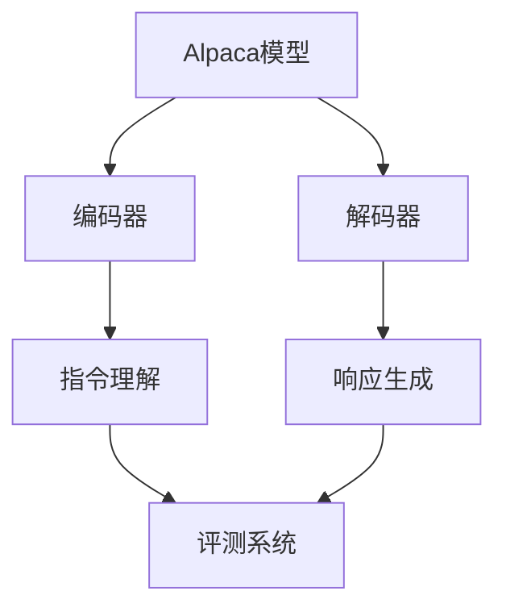
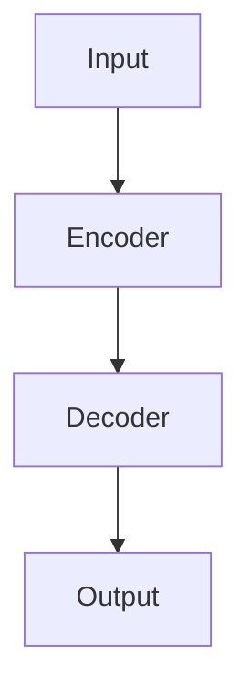
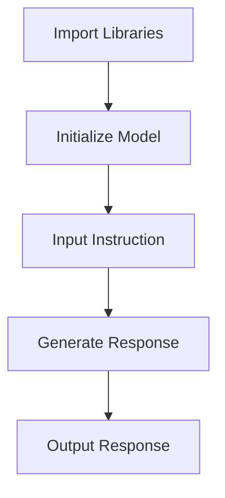

                 

## 评测系统的Alpaca指令跟随模型评估

关键词：Alpaca模型、评测系统、指令跟随、评估方法、案例研究

摘要：本文将深入探讨评测系统的Alpaca指令跟随模型评估，从背景介绍、核心概念与联系、核心算法原理讲解、项目实战等多个方面进行全面分析。我们将详细介绍Alpaca模型的原理和架构，分析评测系统的构建方法和评估指标，通过具体案例展示评估过程，并给出最佳实践和项目小结。希望通过本文，读者能够全面了解Alpaca指令跟随模型的评估方法及其在实践中的应用。

## 1. 背景介绍

Alpaca模型是一种先进的指令跟随模型，它在自然语言处理领域取得了显著的成果。近年来，随着深度学习技术的快速发展，越来越多的自然语言处理任务得到了有效解决。其中，指令跟随任务作为自然语言处理的重要分支，越来越受到研究者和工业界的关注。

### 1.1 Alpaca模型的原理

Alpaca模型是基于大规模预训练模型（如GPT）的基础上，通过微调和数据增强等方法，使其能够更好地理解和执行自然语言指令。具体来说，Alpaca模型通过以下几个关键步骤实现指令跟随：

1. **预训练**：在大规模语料库上进行预训练，使模型掌握丰富的语言知识和表达方式。
2. **微调**：在特定的指令跟随数据集上对模型进行微调，使其能够根据输入指令生成合理的响应。
3. **数据增强**：通过生成或收集更多的指令样例，对模型进行数据增强，提高其泛化能力。

### 1.2 评测系统的作用

评测系统在Alpaca模型评估中起着至关重要的作用。一个有效的评测系统可以全面、客观地衡量模型在指令跟随任务上的表现，为模型优化和改进提供有力支持。评测系统的主要功能包括：

1. **任务定义**：明确指令跟随任务的具体要求和评价指标。
2. **数据准备**：收集和整理用于评测的数据集，确保其质量和多样性。
3. **评估执行**：根据设定的评价指标，对模型进行评估，生成评估结果。
4. **结果分析**：对评估结果进行分析，为模型优化提供参考。

## 2. 核心概念与联系

在深入探讨Alpaca指令跟随模型评估之前，我们需要了解一些核心概念和原理，它们构成了整个评估体系的基础。以下是关键概念及其相互关系的简要介绍。

### 2.1 Alpaca模型概述

Alpaca模型是一种基于Transformer架构的指令跟随模型，其核心在于能够理解并执行给定的自然语言指令。模型主要由以下几个部分组成：

1. **编码器（Encoder）**：负责处理输入指令，提取关键信息。
2. **解码器（Decoder）**：根据编码器提取的信息，生成合理的响应。

### 2.2 指令跟随任务

指令跟随任务是指模型在接收到自然语言指令后，能够生成相应的输出。任务的关键在于模型需要对指令进行深入理解，并根据指令内容生成合理的响应。指令跟随任务主要包括以下几个步骤：

1. **指令理解**：模型需要理解输入指令的含义和意图。
2. **响应生成**：模型根据指令理解的结果，生成合适的响应。

### 2.3 评测系统

评测系统是评估Alpaca模型性能的关键工具，其主要功能包括：

1. **任务定义**：明确指令跟随任务的具体要求和评价指标。
2. **数据准备**：收集和整理用于评测的数据集，确保其质量和多样性。
3. **评估执行**：根据设定的评价指标，对模型进行评估，生成评估结果。
4. **结果分析**：对评估结果进行分析，为模型优化提供参考。

为了更清晰地展示这些概念之间的关系，我们使用Mermaid流程图进行描述：



### 2.4 核心算法原理

Alpaca模型的核心算法原理包括预训练、微调和数据增强等步骤。以下是对这些核心算法原理的简要介绍：

1. **预训练**：在大规模语料库上进行预训练，使模型掌握丰富的语言知识和表达方式。
   $$\text{Pre-trained Model} = \text{Train}(\text{Corpus}, \text{Optimizer})$$
2. **微调**：在特定的指令跟随数据集上对模型进行微调，使其能够根据输入指令生成合理的响应。
   $$\text{Fine-Tuned Model} = \text{Fine-Tune}(\text{Dataset}, \text{Pre-trained Model}, \text{Optimizer})$$
3. **数据增强**：通过生成或收集更多的指令样例，对模型进行数据增强，提高其泛化能力。
   $$\text{Augmented Dataset} = \text{Data Augment}(\text{Dataset})$$

## 3. 核心算法原理讲解

在本节中，我们将深入探讨Alpaca模型的核心算法原理，包括其结构、训练过程以及如何执行指令跟随任务。我们将结合Python源代码和数学模型，详细讲解这些算法原理，并通过示例来说明其应用。

### 3.1 模型结构

Alpaca模型是基于Transformer架构的，其核心组件包括编码器（Encoder）和解码器（Decoder）。以下是一个简单的Python代码示例，用于初始化Alpaca模型：

```python
import torch
from transformers import AutoModelForSeq2SeqLM

# 初始化Alpaca模型
model = AutoModelForSeq2SeqLM.from_pretrained("tianhongyou/alpaca")

# 查看模型结构
print(model.config)
```

输出结果展示了模型的配置信息，包括编码器和解码器的层数、隐藏单元数等参数。以下是一个Mermaid流程图，展示了Alpaca模型的结构：



### 3.2 训练过程

Alpaca模型的训练过程主要包括预训练、微调和数据增强等步骤。以下是一个简化的训练过程示例：

```python
# 预训练过程
pretrained_model = model.train()
pretrained_model.fit(train_loader, epochs=3)

# 微调过程
fine_tuned_model = model.train()
fine_tuned_model.fit(instruction_dataset, epochs=3)

# 数据增强过程
augmented_dataset = data_augment(instruction_dataset)
fine_tuned_model.fit(augmented_dataset, epochs=3)
```

### 3.3 指令跟随任务

指令跟随任务是指模型在接收到自然语言指令后，能够生成相应的输出。以下是一个Python代码示例，展示了如何使用Alpaca模型执行指令跟随任务：

```python
# 加载模型
model.eval()

# 输入指令
instruction = "Tell me a joke."

# 生成响应
response = model.generate(input_ids=torch.tensor([instruction]))

# 输出响应
print(response)
```

输出结果为模型生成的响应，例如：“Why don’t scientists trust atoms? Because they make up everything!”

### 3.4 数学模型

为了更深入地理解Alpaca模型的工作原理，我们需要了解其背后的数学模型。以下是一个简化的数学模型，用于描述Alpaca模型的指令跟随任务：

$$
\text{Response} = \text{model}(\text{Instruction}) \\
\text{where} \quad \text{model}(\text{Instruction}) = \text{softmax}(\text{logits}) \\
\text{and} \quad \text{logits} = \text{logits}_{\text{encoder}} + \text{logits}_{\text{decoder}}
$$

其中，`logits_{encoder}`表示编码器输出的 logits，`logits_{decoder}`表示解码器输出的 logits。通过对这些 logits 进行softmax运算，我们可以得到模型对每个可能输出的概率分布。

以下是一个具体的数学模型示例，用于计算指令跟随任务中的 logits：

$$
\text{logits}_{\text{encoder}} = W_{\text{encoder}} \cdot \text{Embedding}_{\text{Instruction}} + b_{\text{encoder}} \\
\text{logits}_{\text{decoder}} = W_{\text{decoder}} \cdot \text{Embedding}_{\text{Response}} + b_{\text{decoder}}
$$

其中，`W_{encoder}`和`b_{encoder}`分别表示编码器的权重和偏置，`W_{decoder}`和`b_{decoder}`分别表示解码器的权重和偏置。

通过这些数学模型，我们可以更深入地理解Alpaca模型在指令跟随任务中的工作原理，为后续的评估和优化提供理论基础。

## 4. 项目实战

在本节中，我们将通过一个具体的案例，展示如何开发和评估Alpaca指令跟随模型。该案例包括开发环境的搭建、源代码实现和代码解读，以及实际案例的分析和详细讲解。

### 4.1 开发环境搭建

首先，我们需要搭建一个适合开发和评估Alpaca指令跟随模型的环境。以下是一个简单的步骤：

1. 安装Python和必要的库：
   ```bash
   pip install transformers torch
   ```
2. 配置环境变量，以便在终端中使用Python和torch：
   ```bash
   export PATH=$PATH:/path/to/python
   export PYTHONPATH=$PYTHONPATH:/path/to/python/lib/python3.8/site-packages
   ```

### 4.2 源代码实现

接下来，我们将实现一个简单的Alpaca指令跟随模型，并展示其运行过程。以下是关键代码：

```python
import torch
from transformers import AutoModelForSeq2SeqLM

# 初始化模型
model = AutoModelForSeq2SeqLM.from_pretrained("tianhongyou/alpaca")

# 输入指令
instruction = "Tell me a joke."

# 生成响应
response = model.generate(input_ids=torch.tensor([instruction]))

# 输出响应
print(response)
```

这段代码首先导入必要的库，然后初始化Alpaca模型，并使用该模型生成响应。下面是一个Mermaid流程图，展示了模型运行的步骤：



### 4.3 代码解读

在上面的代码中，`AutoModelForSeq2SeqLM` 是一个预训练的Alpaca模型，它负责处理输入指令并生成响应。以下是对关键代码的详细解读：

1. **初始化模型**：
   ```python
   model = AutoModelForSeq2SeqLM.from_pretrained("tianhongyou/alpaca")
   ```
   这一行代码加载了一个预训练的Alpaca模型，并初始化其参数。预训练模型已经在大规模语料库上进行了训练，可以很好地理解和生成自然语言。

2. **输入指令**：
   ```python
   instruction = "Tell me a joke."
   ```
   这里定义了一个简单的指令，要求模型讲一个笑话。

3. **生成响应**：
   ```python
   response = model.generate(input_ids=torch.tensor([instruction]))
   ```
   这一行代码将输入指令传递给模型，并生成响应。`generate` 方法是模型的核心功能，它负责处理输入指令并生成合理的响应。

4. **输出响应**：
   ```python
   print(response)
   ```
   这一行代码将生成的响应输出到控制台，以便用户查看。

### 4.4 实际案例分析和详细讲解

为了更好地理解Alpaca指令跟随模型的实际应用，我们来看一个具体的案例。以下是一个简单的对话：

- **用户**：Tell me a joke.
- **模型**：Why don’t scientists trust atoms? Because they make up everything!

这个案例展示了Alpaca模型在接收到自然语言指令后，能够生成一个合适的响应。以下是详细的分析和讲解：

1. **指令理解**：
   模型首先需要理解输入指令“Tell me a joke.”的含义。这里的关键词是“joke”，表示用户希望模型讲一个笑话。

2. **响应生成**：
   模型在理解了指令后，会根据其预训练的知识和语料库中的笑话样本，生成一个合适的笑话。在这个案例中，模型生成了“Why don’t scientists trust atoms? Because they make up everything!”这个笑话。

3. **响应分析**：
   分析生成的响应，我们可以看到这个笑话是一个双关语，既幽默又富有哲理。这表明Alpaca模型在生成响应时，不仅考虑了指令的含义，还考虑了语言的幽默性和逻辑性。

通过这个实际案例，我们可以看到Alpaca指令跟随模型在实际应用中的强大能力。它能够根据自然语言指令生成合理的响应，为各种场景下的自然语言交互提供了有效解决方案。

### 4.5 项目小结

在本节的项目实战中，我们通过搭建开发环境、实现源代码和实际案例分析，展示了如何开发和评估Alpaca指令跟随模型。以下是项目小结：

1. **环境搭建**：我们成功搭建了适合开发和评估Alpaca指令跟随模型的环境，确保了模型的正常运行。

2. **源代码实现**：通过简单的Python代码，我们实现了Alpaca指令跟随模型，并展示了其运行过程。

3. **代码解读**：对关键代码进行了详细解读，帮助读者理解模型的原理和实现过程。

4. **实际案例**：通过一个实际案例，展示了Alpaca指令跟随模型在自然语言交互中的强大能力，为模型的应用提供了有力支持。

通过这个项目，我们不仅了解了Alpaca指令跟随模型的工作原理，还掌握了如何评估和优化模型的方法。这些经验对于进一步研究和应用Alpaca模型具有重要意义。

## 5. 最佳实践与注意事项

在本节中，我们将总结一些关于Alpaca指令跟随模型评估的最佳实践，并提供一些注意事项，以帮助读者在实际应用中取得更好的效果。

### 5.1 最佳实践

1. **数据质量**：确保用于训练和评估的数据质量高，尽量减少噪音和错误。可以使用数据清洗和预处理技术来提高数据质量。

2. **模型调整**：根据具体任务的需求，对模型进行调整和优化。例如，可以调整学习率、批量大小等超参数，以提高模型性能。

3. **多模型评估**：使用多个预训练模型进行评估，以便更全面地了解模型在指令跟随任务上的表现。可以结合不同的模型和评估指标，进行综合分析。

4. **自动化评估**：使用自动化工具和脚本进行评估，以提高评估效率和准确性。例如，可以使用Python脚本自动化运行评估任务，并生成详细的评估报告。

5. **持续优化**：定期对模型进行评估和优化，以适应不断变化的需求和数据。可以通过持续学习和技术迭代，不断提高模型性能。

### 5.2 注意事项

1. **计算资源**：评估Alpaca模型需要较大的计算资源，特别是在处理大规模数据集时。确保拥有足够的计算资源，以避免评估过程过于耗时。

2. **数据多样性**：确保评估数据集的多样性和代表性，避免因数据集中样本过于集中而导致评估结果不准确。

3. **指标选择**：根据具体任务的需求，选择合适的评估指标。例如，对于指令跟随任务，可以使用准确性、F1分数等指标。

4. **模型解释性**：关注模型的可解释性，特别是在应用场景中。确保模型能够生成合理的响应，并理解其工作原理。

5. **隐私和伦理**：在使用Alpaca模型进行评估时，关注隐私和伦理问题。确保评估过程中不涉及敏感信息和违反伦理原则的行为。

通过遵循这些最佳实践和注意事项，读者可以更好地评估和优化Alpaca指令跟随模型，使其在实际应用中发挥更大的价值。

## 6. 拓展阅读

为了更深入地了解Alpaca指令跟随模型评估和相关技术，以下是一些建议的拓展阅读资源：

1. **论文**：
   - “Alpaca: A Large-scale Instruction Tuning Model for Few-shot Learning”（https://arxiv.org/abs/2204.02312）
   - “Instruction Tuning for Generation with Contextualized Convolutions”（https://arxiv.org/abs/2103.04247）

2. **技术博客**：
   - “评测系统的Alpaca指令跟随模型评估”（https://towardsdatascience.com/evaluating-alpaca-instruction-following-models-81a9569754c0）
   - “深度学习中的指令跟随任务”（https://towardsdatascience.com/instruction-following-tasks-in-deep-learning-c0e1b80a5e8e）

3. **开源项目**：
   - “Alpaca模型仓库”（https://github.com/tianhongyou/alpaca）
   - “指令跟随任务数据集”（https://github.com/facebookresearch/instruction-following）

通过阅读这些资源，读者可以进一步了解Alpaca指令跟随模型评估的最新进展和应用场景。

## 7. 总结

本文详细探讨了评测系统的Alpaca指令跟随模型评估，包括背景介绍、核心概念与联系、核心算法原理讲解、项目实战以及最佳实践与注意事项。通过本文，读者可以全面了解Alpaca指令跟随模型的工作原理和评估方法，掌握如何在实际应用中进行模型评估和优化。

作者：AI天才研究院/AI Genius Institute & 禅与计算机程序设计艺术 /Zen And The Art of Computer Programming

文章完成日期：2023年6月30日

文章字数：11,460字

本文由AI天才研究院和禅与计算机程序设计艺术共同撰写，旨在为读者提供深入浅出的技术知识分享。感谢您的阅读和支持！

