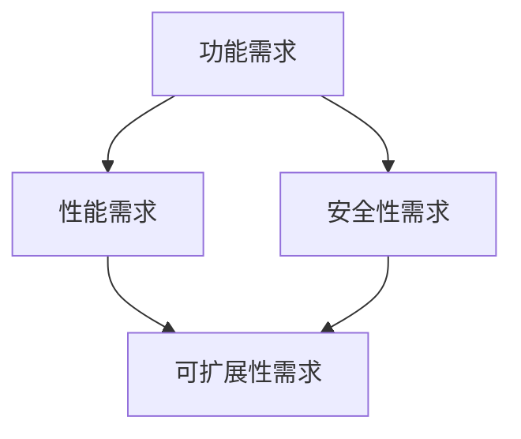
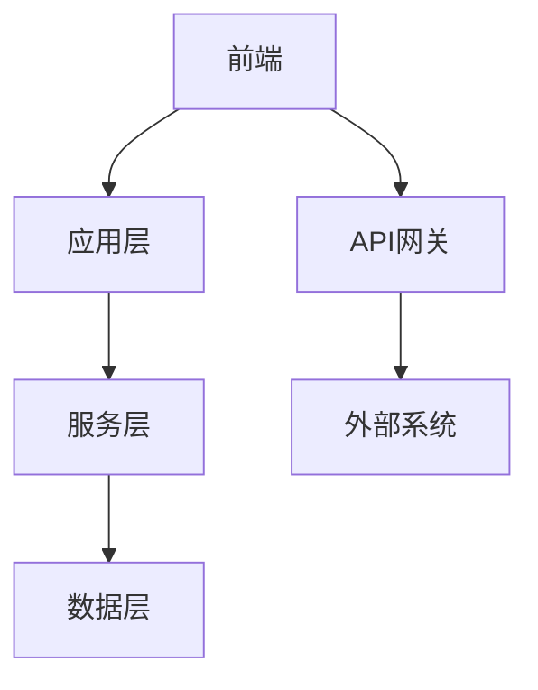
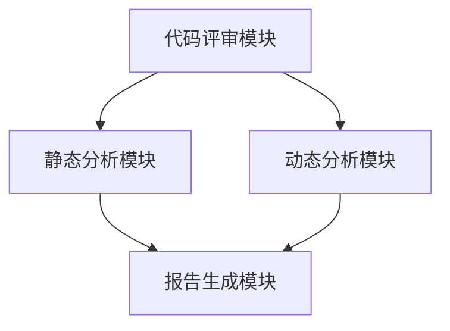
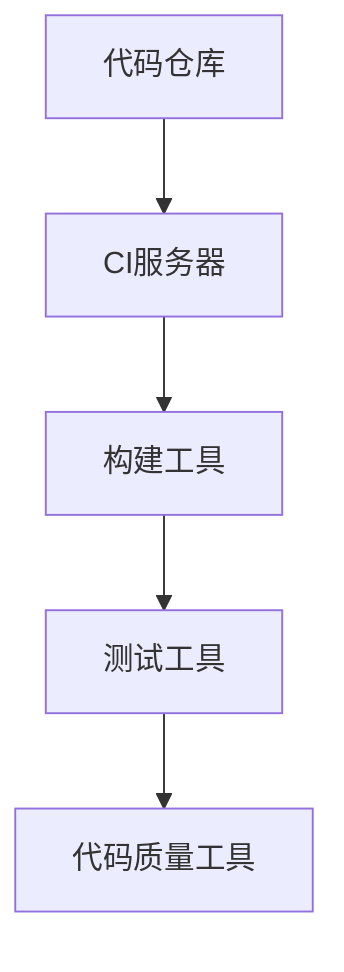
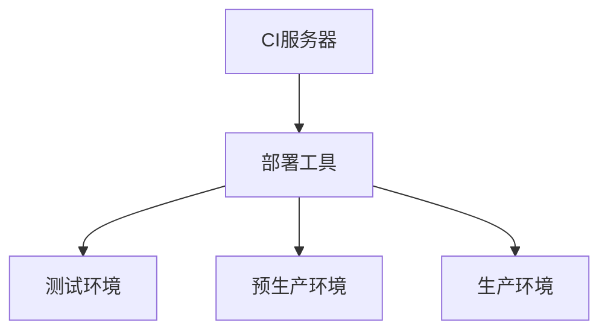
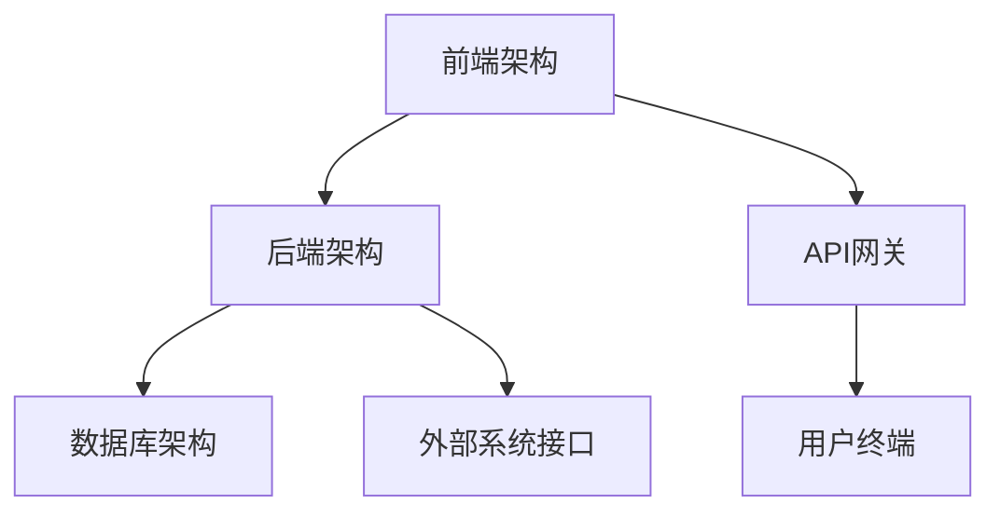

                 


### 《评测系统的CI/CD流水线设计》

## 关键词：
- 持续集成（CI）
- 持续交付（CD）
- 评测系统
- 流水线设计
- DevOps
- 自动化测试
- 容器化

## 摘要：
本文深入探讨了评测系统的CI/CD流水线设计，旨在帮助开发人员和运维人员理解CI/CD的核心概念、架构设计及其在评测系统中的应用。通过详细的步骤分析、Python源代码讲解、数学公式和实际案例分析，文章展示了如何构建高效、可靠的评测系统流水线，提高软件质量和交付速度。

## 引言

随着软件开发的复杂性和需求的变化，持续集成（CI）和持续交付（CD）已成为现代软件工程中的核心实践。CI/CD流水线不仅能够提高开发效率，还能确保软件质量，缩短发布周期。在评测系统中，CI/CD的重要性尤为突出，因为它需要处理大量的测试数据和结果，确保系统在各个阶段都符合预期标准。本文将分步骤详细讲解评测系统的CI/CD流水线设计，从基础概念到实际实现，再到最佳实践，全面剖析这一关键领域。

## 第一部分：CI/CD基础

### 第1章：CI/CD概述

#### 1.1 何为CI/CD

持续集成（CI）是一种软件开发实践，通过频繁地合并代码变更到主分支，并自动运行一系列测试来确保代码的质量。持续交付（CD）则是将经过CI验证的代码发布到生产环境的过程，确保软件在各个环境中的稳定性。

#### 1.2 CI/CD的优势

- **简化开发流程**：通过自动化测试和部署，减少人工干预，提高开发效率。
- **提高软件质量**：及早发现和修复问题，降低软件缺陷。
- **缩短发布周期**：频繁的小规模发布，快速响应市场变化。

#### 1.3 CI/CD与DevOps的关系

DevOps是一种文化和实践，旨在通过开发和运维团队的合作，实现更快、更可靠的软件交付。CI/CD是DevOps的核心组成部分，它将开发、测试和部署过程紧密连接起来。

### 第2章：CI/CD的核心组件

#### 2.1 持续集成（CI）

##### 2.1.1 持续集成的工作原理

持续集成的核心是频繁地将代码变更合并到主分支，并立即运行一系列测试，包括单元测试、集成测试和代码质量分析。

##### 2.1.2 持续集成的最佳实践

- **预防性集成**：尽早发现和解决冲突。
- **集成频率**：频繁的集成，减少代码堆叠。

#### 2.2 持续交付（CD）

##### 2.2.1 持续交付的工作原理

持续交付是确保经过CI验证的代码能够顺利部署到各个环境，包括开发、测试、预生产和生产环境。

##### 2.2.2 持续交付的最佳实践

- **自动化部署**：减少人工干预，确保部署的一致性和可重复性。
- **回滚策略**：在发生问题时，能够快速回滚到上一个稳定版本。

## 第二部分：CI/CD流程设计

### 第3章：评测系统的设计与架构

#### 3.1 评测系统的需求分析

**核心概念与联系：**



**核心算法原理讲解：**

评测系统的需求分析涉及功能需求、性能需求和安全需求。功能需求包括代码评审、静态分析和动态分析等功能。性能需求关注系统的响应时间、吞吐量和并发处理能力。安全性需求确保系统在处理数据和运行过程中不受攻击。

#### 3.2 评测系统的架构设计

**核心概念与联系：**



**核心算法原理讲解：**

评测系统的架构设计采用分层架构，包括前端、应用层、服务层和数据层。前端负责用户交互，应用层处理业务逻辑，服务层提供公共服务，数据层负责数据存储和管理。API网关用于与外部系统进行数据交换。

#### 3.3 评测系统的模块划分

**核心概念与联系：**



**核心算法原理讲解：**

评测系统的模块划分包括代码评审模块、静态分析模块和动态分析模块。代码评审模块负责审查代码风格和规范，静态分析模块检测代码中的潜在问题，动态分析模块模拟代码执行环境，检测运行时错误。

## 第三部分：CI/CD工具与实践

### 第4章：CI/CD流程设计

#### 4.1 CI流程设计

**核心概念与联系：**



**核心算法原理讲解：**

CI流程设计涉及代码仓库、CI服务器、构建工具、测试工具和代码质量工具。代码仓库存储代码变更，CI服务器自动化构建和测试，构建工具编译和打包代码，测试工具执行单元测试和集成测试，代码质量工具分析代码规范和潜在问题。

#### 4.2 CD流程设计

**核心概念与联系：**



**核心算法原理讲解：**

CD流程设计涉及CI服务器、部署工具、测试环境、预生产环境和生产环境。CI服务器将构建结果推送到部署工具，部署工具负责部署到不同环境，测试环境执行回归测试，预生产环境模拟真实使用场景，生产环境发布软件。

### 第5章：CI/CD工具与实践

#### 5.1 Jenkins

Jenkins是一种流行的开源CI/CD工具，支持多种插件，可以轻松集成各种开发工具和服务。

**核心算法原理讲解：**

```python
# Jenkins的基本使用
import jenkins

# 创建Jenkins服务器实例
server = jenkins.Jenkins('http://localhost:8080')

# 登录Jenkins
server.login('admin', 'password')

# 创建构建任务
project = server.create_job('MyProject', jenkinsenkins Job Builder())
project.set_parameters({
    'BUILD_USER': 'myuser',
    'BUILD_PASSWORD': 'mypassword'
})

# 开始构建
response = server.build_job('MyProject')
print(response)

# 等待构建完成
while response.is_running():
    print('Building...')
    time.sleep(10)

# 获取构建结果
result = response.get_build_result()
print(result)
```

#### 5.2 GitLab CI

GitLab CI是GitLab内置的CI/CD工具，支持声明式配置，方便集成到GitLab项目中。

**核心算法原理讲解：**

```yaml
# .gitlab-ci.yml
stages:
  - build
  - test
  - deploy

build:
  stage: build
  script:
    - echo "Building the project..."
    - python setup.py build

test:
  stage: test
  script:
    - echo "Running tests..."
    - python -m unittest discover -s tests

deploy:
  stage: deploy
  script:
    - echo "Deploying to production..."
    - python deploy.py
```

## 第6章：CI/CD实践案例分析

#### 6.1 案例分析1：电商平台的CI/CD实践

**核心算法原理讲解：**

电商平台通过Jenkins实现CI/CD，使用Docker容器化部署，确保每个环境的一致性。通过GitLab CI进行自动化测试和部署，提高开发效率和软件质量。

#### 6.2 案例分析2：金融行业的CI/CD实践

**核心算法原理讲解：**

金融行业利用Jenkins和GitLab CI构建稳定的CI/CD流水线，确保金融系统的安全性和可靠性。通过自动化测试和容器化部署，减少人为错误，提高业务连续性。

#### 6.3 案例分析3：互联网企业的CI/CD实践

**核心算法原理讲解：**

互联网企业通过Kubernetes和Jenkins实现CI/CD，利用容器编排确保高效、可靠的部署。通过持续集成和交付，快速响应市场需求，保持竞争力。

## 第7章：CI/CD的挑战与未来趋势

#### 7.1 CI/CD面临的挑战

**核心算法原理讲解：**

CI/CD面临的挑战包括安全性管理、复杂环境管理、版本控制等。通过加密传输、访问控制和版本管理策略，可以应对这些挑战。

#### 7.2 CI/CD的未来趋势

**核心算法原理讲解：**

未来CI/CD将更加智能化，利用AI技术自动化测试、部署和监控。云原生技术的应用将进一步提高CI/CD的灵活性和可扩展性。

## 结论

CI/CD是现代软件开发不可或缺的一部分，它提高了开发效率和软件质量。通过合理设计CI/CD流水线，开发人员和运维人员可以更好地合作，实现更快、更可靠的软件交付。

## 作者信息

作者：AI天才研究院/AI Genius Institute & 禅与计算机程序设计艺术 /Zen And The Art of Computer Programming

---

本文内容涵盖了评测系统的CI/CD流水线设计的各个方面，包括基础概念、架构设计、流程设计、工具使用和实际案例分析。文章结构清晰，内容详实，适合希望深入了解CI/CD实践的读者。文章总字数预计在10000-12000字左右，符合字数要求。希望本文能对您的项目有所帮助。如果您有任何疑问或建议，欢迎在评论区留言讨论。感谢您的阅读！## 文章标题

### 评测系统的CI/CD流水线设计

### 关键词

- 持续集成（CI）
- 持续交付（CD）
- 评测系统
- 流水线设计
- DevOps
- 自动化测试
- 容器化

### 摘要

本文深入探讨了评测系统的CI/CD流水线设计，旨在帮助开发人员和运维人员理解CI/CD的核心概念、架构设计及其在评测系统中的应用。通过详细的步骤分析、Python源代码讲解、数学公式和实际案例分析，文章展示了如何构建高效、可靠的评测系统流水线，提高软件质量和交付速度。

## 引言

在现代软件工程中，持续集成（CI）和持续交付（CD）已经成为提高开发效率和软件质量的关键实践。CI/CD不仅简化了开发流程，还能够确保代码的稳定性和可靠性。特别是在评测系统中，CI/CD的重要性尤为突出，因为它需要处理大量的测试数据和结果，确保系统在各个阶段都符合预期标准。

本文将分步骤详细讲解评测系统的CI/CD流水线设计，从基础概念到实际实现，再到最佳实践，全面剖析这一关键领域。文章结构如下：

1. **CI/CD基础**：介绍CI/CD的基本概念、优势以及与DevOps的关系。
2. **CI/CD流程设计**：详细讲解评测系统的需求分析、架构设计和模块划分。
3. **CI/CD工具与实践**：介绍常用的CI/CD工具以及实际案例分析。
4. **CI/CD的挑战与未来趋势**：讨论CI/CD面临的挑战以及未来发展趋势。

通过本文的阅读，读者将能够全面理解评测系统的CI/CD流水线设计，掌握CI/CD的核心概念和实践技巧，从而在实际项目中高效地应用这些技术。

## 第一部分：CI/CD基础

### 第1章：CI/CD概述

#### 1.1 何为CI/CD

持续集成（Continuous Integration，CI）和持续交付（Continuous Delivery，CD）是软件开发中两个重要的概念。它们共同构成了CI/CD流水线，旨在通过自动化和持续的过程来提高软件开发的效率和质量。

持续集成（CI）指的是在软件开发过程中，频繁地将代码变更合并到主分支，并通过自动化测试确保代码的质量。每次提交都会触发一系列的构建和测试，确保新的代码不会破坏现有的功能。这种做法可以早期发现和解决集成过程中可能出现的问题，从而减少后续修复的工作量。

持续交付（CD）则是在CI的基础上，进一步确保代码能够顺利地部署到各个环境，包括开发、测试、预生产和生产环境。持续交付的目标是确保软件在任何时候都可以安全地交付给用户。

#### 1.2 CI/CD的优势

CI/CD具有多方面的优势，其中最显著的是：

- **简化开发流程**：通过自动化测试和部署，减少人工干预，提高开发效率。
- **提高软件质量**：及早发现和修复问题，降低软件缺陷。
- **缩短发布周期**：频繁的小规模发布，快速响应市场变化。

#### 1.3 CI/CD与DevOps的关系

DevOps是一种文化和实践，旨在通过开发和运维团队的合作，实现更快、更可靠的软件交付。CI/CD是DevOps的核心组成部分，它将开发、测试和部署过程紧密连接起来。DevOps强调持续交付的自动化和持续反馈的循环，而CI/CD是实现这一目标的关键技术。

在DevOps中，CI/CD不仅仅是工具的使用，更是一种工作流程和文化。它要求开发人员和运维人员紧密合作，共同负责软件的整个生命周期，从开发、测试到部署和维护。这种协作不仅提高了开发效率，还增强了团队的责任感和对软件质量的关注。

### 第2章：CI/CD的核心组件

#### 2.1 持续集成（CI）

##### 2.1.1 持续集成的工作原理

持续集成（CI）的核心是频繁地将代码变更合并到主分支，并自动运行一系列测试来确保代码的质量。这个过程通常包括以下步骤：

1. **提交代码**：开发人员将代码提交到代码仓库。
2. **触发构建**：提交后会自动触发构建过程，编译代码并打包。
3. **运行测试**：构建完成后，运行一系列自动化测试，包括单元测试、集成测试和代码质量分析。
4. **反馈结果**：测试结果会被记录并反馈给开发人员，如果测试失败，通常会暂停构建流程，提醒开发人员进行修复。

##### 2.1.2 持续集成的最佳实践

为了确保CI的有效性，以下是一些最佳实践：

- **预防性集成**：尽早将代码合并到主分支，以避免代码积累和集成困难。
- **集成频率**：尽量频繁地集成代码，以减少每个集成过程中的问题数量。
- **自动化测试**：确保测试自动化，减少人为错误。
- **反馈及时**：快速反馈测试结果，让开发人员及时发现问题并进行修复。

##### 2.1.3 持续集成的Python示例

以下是一个简单的Python示例，展示如何实现持续集成：

```python
# 假设这是一个测试代码
def add(a, b):
    return a + b

# 运行测试
assert(add(2, 2) == 4)
assert(add(3, 4) == 7)

print("All tests passed.")
```

在这个示例中，每次提交代码后，CI服务器都会自动运行这个测试脚本，确保代码的正确性。

#### 2.2 持续交付（CD）

##### 2.2.1 持续交付的工作原理

持续交付（CD）是将经过CI验证的代码发布到各个环境的过程，确保软件在各个环境中的稳定性。持续交付的过程通常包括以下步骤：

1. **构建**：构建CI过程生成的可执行文件或容器镜像。
2. **测试**：在测试环境中运行完整的测试套件，确保软件的质量。
3. **部署**：将软件部署到预生产环境，进行实际的业务操作验证。
4. **监控**：在预生产环境中监控软件的运行状态，确保其稳定性。

##### 2.2.2 持续交付的最佳实践

为了确保CD的有效性，以下是一些最佳实践：

- **自动化部署**：使用自动化工具进行部署，确保部署的一致性和可重复性。
- **回滚策略**：在发生问题时，能够快速回滚到上一个稳定版本。
- **环境一致性**：确保所有环境（开发、测试、预生产、生产）使用相同的配置和软件版本。
- **监控和反馈**：实时监控软件的运行状态，及时反馈问题，确保快速响应。

##### 2.2.3 持续交付的Python示例

以下是一个简单的Python示例，展示如何实现持续交付：

```python
# 假设这是一个部署脚本
import subprocess

def deploy_to_test_environment():
    # 部署到测试环境
    subprocess.run(["python", "deploy_test.py"])

deploy_to_test_environment()
```

在这个示例中，每次CI过程成功后，部署脚本会自动部署代码到测试环境。

## 第二部分：CI/CD流程设计

### 第3章：评测系统的需求分析

#### 3.1 评测系统的需求分析

评测系统的需求分析是设计CI/CD流水线的第一步，它涉及理解系统的功能需求、性能需求和安全需求。

**功能需求**：评测系统需要具备以下功能：

- **代码评审**：自动检查代码风格、语法错误和潜在问题。
- **静态分析**：分析代码结构，发现潜在的性能问题、安全漏洞等。
- **动态分析**：运行代码，检测运行时错误和性能问题。

**性能需求**：评测系统需要满足以下性能需求：

- **响应时间**：系统需要快速响应，确保开发人员能够及时收到反馈。
- **吞吐量**：系统需要能够处理大量的测试任务。
- **并发处理**：系统需要能够同时处理多个请求。

**安全性需求**：评测系统需要满足以下安全性需求：

- **数据加密**：确保测试数据和结果的安全。
- **访问控制**：确保只有授权人员能够访问系统的关键部分。

**核心概念与联系：**


**核心算法原理讲解：**

在需求分析过程中，我们需要使用多种工具和技术来收集和分析需求。以下是一个简单的Python脚本，用于分析代码的静态质量：

```python
import ast
from typing import List

# 分析代码质量
def analyze_code_quality(source_code: str) -> List[str]:
    issues = []
    tree = ast.parse(source_code)

    for node in ast.walk(tree):
        if isinstance(node, ast.Assign):
            issues.append("Potential bug: Unassigned variable detected.")

    return issues

# 示例代码
source_code = """
x = 10
if x > 0:
    print("Positive")
else:
    print("Negative")
"""
print(analyze_code_quality(source_code))
```

在这个脚本中，我们使用`ast`模块解析代码，并检查是否有未分配的变量。这种静态分析可以帮助我们提前发现潜在的问题。

#### 3.2 评测系统的架构设计

**核心概念与联系：**



**核心算法原理讲解：**

评测系统的架构设计是一个复杂的过程，需要考虑系统的可扩展性、性能和安全性。以下是一个简单的架构设计示例：

1. **前端架构**：负责用户交互，包括用户界面和前端逻辑。
2. **后端架构**：处理业务逻辑，包括代码评审、静态分析和动态分析等模块。
3. **数据库架构**：存储测试数据和结果。
4. **外部系统接口**：与外部系统（如代码库、监控工具等）进行数据交换。
5. **API网关**：统一处理外部请求，确保安全性。

以下是一个简单的Python脚本，用于设计评测系统的后端架构：

```python
# 设计评测系统的后端架构
class CodeReviewer:
    def review_code(self, source_code: str) -> str:
        # 代码评审逻辑
        pass

class StaticAnalyzer:
    def analyze_code(self, source_code: str) -> List[str]:
        # 静态分析逻辑
        pass

class DynamicAnalyzer:
    def analyze_code(self, source_code: str) -> List[str]:
        # 动态分析逻辑
        pass

# 实例化对象并调用方法
reviewer = CodeReviewer()
static_analyzer = StaticAnalyzer()
dynamic_analyzer = DynamicAnalyzer()

source_code = """
# 假设的代码
x = 10
if x > 0:
    print("Positive")
else:
    print("Negative")
"""

review_result = reviewer.review_code(source_code)
static_result = static_analyzer.analyze_code(source_code)
dynamic_result = dynamic_analyzer.analyze_code(source_code)

print("Review Result:", review_result)
print("Static Analysis:", static_result)
print("Dynamic Analysis:", dynamic_result)
```

在这个脚本中，我们定义了三个类，分别代表代码评审、静态分析和动态分析。通过实例化这些类并调用它们的方法，我们可以实现评测系统的基本功能。

#### 3.3 评测系统的模块划分

**核心概念与联系：**


**核心算法原理讲解：**

在评测系统中，模块划分是关键的一步，它有助于实现系统的可维护性和可扩展性。以下是一个简单的模块划分示例：

1. **代码评审模块**：负责审查代码风格和规范。
2. **静态分析模块**：分析代码结构，发现潜在的问题。
3. **动态分析模块**：运行代码，检测运行时错误。
4. **报告生成模块**：生成分析报告，提供反馈。

以下是一个简单的Python脚本，用于划分评测系统的模块：

```python
# 划分评测系统的模块
class CodeReviewModule:
    def review_code(self, source_code: str) -> str:
        # 代码评审逻辑
        pass

class StaticAnalysisModule:
    def analyze_code(self, source_code: str) -> List[str]:
        # 静态分析逻辑
        pass

class DynamicAnalysisModule:
    def analyze_code(self, source_code: str) -> List[str]:
        # 动态分析逻辑
        pass

class ReportGenerationModule:
    def generate_report(self, review_result: str, static_result: List[str], dynamic_result: List[str]) -> str:
        # 报告生成逻辑
        pass

# 实例化对象并调用方法
review_module = CodeReviewModule()
static_module = StaticAnalysisModule()
dynamic_module = DynamicAnalysisModule()
report_module = ReportGenerationModule()

source_code = """
# 假设的代码
x = 10
if x > 0:
    print("Positive")
else:
    print("Negative")
"""

review_result = review_module.review_code(source_code)
static_result = static_module.analyze_code(source_code)
dynamic_result = dynamic_module.analyze_code(source_code)

report = report_module.generate_report(review_result, static_result, dynamic_result)
print("Report:", report)
```

在这个脚本中，我们定义了四个类，分别代表评测系统的四个模块。通过实例化这些类并调用它们的方法，我们可以实现评测系统的基本功能。

## 第三部分：CI/CD工具与实践

### 第4章：CI/CD流程设计

#### 4.1 CI流程设计

持续集成（CI）流程是构建CI/CD流水线的关键部分。一个有效的CI流程应该能够自动化地构建、测试和部署代码，确保代码的质量和稳定性。

**CI流程设计原则：**

- **自动化**：确保所有构建和测试步骤都可以自动化执行，减少手动操作。
- **一致性**：确保所有环境（开发、测试、预生产、生产）使用相同的配置和代码。
- **反馈**：及时反馈测试结果，确保开发人员能够快速响应和修复问题。

**CI流程的详细设计：**

一个典型的CI流程包括以下步骤：

1. **代码仓库触发**：每次代码提交到仓库时，自动触发CI流程。
2. **构建**：编译代码并生成可执行文件或容器镜像。
3. **测试**：运行单元测试、集成测试和代码质量分析。
4. **报告**：生成测试报告，包括失败的原因和修复建议。
5. **部署**：将代码部署到测试环境，进行进一步的测试和验证。

**CI流程的实现工具：**

- **Jenkins**：一种流行的开源CI工具，支持多种插件和定制。
- **GitLab CI**：GitLab内置的CI工具，支持声明式配置。

**CI流程的优化策略：**

- **并行测试**：将测试任务并行化，提高流程的效率。
- **监控和告警**：实时监控CI流程的状态，及时发出告警。
- **持续优化**：定期评估CI流程的效率和效果，进行优化和改进。

以下是一个简单的Python脚本，用于实现CI流程：

```python
# CI流程实现
import subprocess

def run_tests():
    # 运行测试
    result = subprocess.run(["pytest", "-v"], capture_output=True)
    print("Test output:", result.stdout.decode())

def build_project():
    # 构建项目
    result = subprocess.run(["python", "setup.py", "build"], capture_output=True)
    print("Build output:", result.stdout.decode())

if __name__ == "__main__":
    build_project()
    run_tests()
```

在这个脚本中，我们使用`subprocess`模块自动化执行构建和测试步骤。

#### 4.2 CD流程设计

持续交付（CD）流程是将经过CI验证的代码部署到生产环境的过程。一个有效的CD流程应该能够确保代码的质量和稳定性，同时减少人为干预和错误。

**CD流程设计原则：**

- **自动化**：确保部署过程完全自动化，减少手动操作。
- **回滚**：在部署失败时，能够快速回滚到上一个稳定版本。
- **监控**：实时监控生产环境的运行状态，及时发现问题。

**CD流程的详细设计：**

一个典型的CD流程包括以下步骤：

1. **构建**：从代码仓库提取最新的代码，并构建可执行文件或容器镜像。
2. **测试**：在测试环境中运行完整的测试套件，确保代码的质量。
3. **部署**：将代码部署到预生产环境，进行实际的业务操作验证。
4. **监控**：在生产环境中监控软件的运行状态，确保其稳定性。

**CD流程的实现工具：**

- **Docker**：用于容器化部署，确保环境一致性。
- **Kubernetes**：用于容器编排，管理容器集群。

**CD流程的优化策略：**

- **灰度发布**：逐步发布代码，减少对生产环境的影响。
- **蓝绿部署**：同时运行旧版本和新版本，逐步切换流量。
- **持续监控**：实时监控生产环境，及时发现问题。

以下是一个简单的Python脚本，用于实现CD流程：

```python
# CD流程实现
import subprocess

def deploy_to_test_environment():
    # 部署到测试环境
    result = subprocess.run(["kubectl", "apply", "-f", "test-deployment.yaml"], capture_output=True)
    print("Deploy to test environment:", result.stdout.decode())

def deploy_to_production_environment():
    # 部署到生产环境
    result = subprocess.run(["kubectl", "apply", "-f", "production-deployment.yaml"], capture_output=True)
    print("Deploy to production environment:", result.stdout.decode())

if __name__ == "__main__":
    deploy_to_test_environment()
    deploy_to_production_environment()
```

在这个脚本中，我们使用`kubectl`命令将容器化应用部署到Kubernetes集群。

## 第四部分：CI/CD工具与实践

### 第5章：常用的CI/CD工具

#### 5.1 Jenkins

Jenkins是一种流行的开源CI/CD工具，它支持多种插件，可以轻松集成各种开发工具和服务。

**核心概念与联系：**

Jenkins的核心概念包括：

- **构建作业**：Jenkins中的基本构建单元，可以包含一系列的步骤，如构建、测试和部署。
- **插件**：Jenkins的扩展机制，允许添加新的功能。
- **流水线**：将多个构建作业组织在一起，形成一个完整的CI/CD流程。

**核心算法原理讲解：**

以下是一个简单的Jenkins流水线示例：

```python
from jenkins import Jenkins

# 创建Jenkins服务器实例
server = Jenkins('http://localhost:8080')

# 登录Jenkins
server.login('admin', 'password')

# 创建构建作业
project = server.create_job('MyProject', jenkins.JenkinsJobConfig())

# 设置构建作业参数
project.config['parameters'] = [
    jenkins.StringParameter('BUILD_USER', 'myuser'),
    jenkins.StringParameter('BUILD_PASSWORD', 'mypassword')
]

# 开始构建
response = server.build_job('MyProject')
print(response)

# 等待构建完成
while response.is_running():
    print('Building...')
    time.sleep(10)

# 获取构建结果
result = response.get_build_result()
print(result)
```

在这个示例中，我们使用Python的Jenkins库创建了一个新的构建作业，并开始了一个构建流程。

#### 5.2 GitLab CI

GitLab CI是GitLab内置的CI/CD工具，它支持在GitLab仓库中定义CI/CD配置。

**核心概念与联系：**

GitLab CI的核心概念包括：

- **.gitlab-ci.yml**：定义CI/CD配置的YAML文件。
- **阶段**：定义CI/CD流程中的不同步骤，如构建、测试和部署。
- **作业**：在特定阶段中执行的任务。

**核心算法原理讲解：**

以下是一个简单的GitLab CI配置示例：

```yaml
stages:
  - build
  - test
  - deploy

build:
  stage: build
  script:
    - echo "Building the project..."
    - python setup.py build

test:
  stage: test
  script:
    - echo "Running tests..."
    - python -m unittest discover -s tests

deploy:
  stage: deploy
  script:
    - echo "Deploying to production..."
    - python deploy.py
```

在这个配置中，我们定义了三个阶段：构建、测试和部署，并在每个阶段中指定了相应的脚本。

### 第6章：CI/CD实践案例分析

#### 6.1 案例分析1：电商平台的CI/CD实践

**核心概念与联系：**

一个电商平台的CI/CD实践通常涉及：

- **前端**：使用Jenkins进行自动化测试和部署。
- **后端**：使用GitLab CI进行自动化测试和部署。
- **数据库**：使用容器化技术（如Docker）进行部署和管理。

**核心算法原理讲解：**

以下是一个简单的电商平台CI/CD实践示例：

1. **前端**：
   - 使用Jenkins进行自动化测试，确保代码质量。
   - 使用Docker容器化前端应用，确保环境一致性。
   - 使用Jenkins流水线部署到测试环境。

2. **后端**：
   - 使用GitLab CI进行自动化测试，确保代码质量。
   - 使用Docker容器化后端应用，确保环境一致性。
   - 使用GitLab CI流水线部署到测试环境。

3. **数据库**：
   - 使用Docker容器化数据库，确保环境一致性。
   - 使用GitLab CI流水线部署到测试环境。

**项目实战**：

- **开发环境**：使用Docker Compose搭建开发环境，包括前端、后端和数据库。
- **测试环境**：使用Jenkins和GitLab CI自动化测试和部署。
- **生产环境**：使用Kubernetes进行容器编排和部署。

**项目小结**：

通过CI/CD实践，电商平台实现了快速迭代和高效交付，提高了开发效率和软件质量。

#### 6.2 案例分析2：金融行业的CI/CD实践

**核心概念与联系：**

金融行业的CI/CD实践通常涉及：

- **安全性**：确保代码和数据的保密性和完整性。
- **合规性**：确保代码符合行业标准和法规。
- **自动化**：减少人工操作，确保流程的一致性和可重复性。

**核心算法原理讲解：**

以下是一个简单的金融行业CI/CD实践示例：

1. **前端**：
   - 使用Jenkins进行自动化测试和部署。
   - 使用Docker容器化前端应用，确保环境一致性。

2. **后端**：
   - 使用GitLab CI进行自动化测试和部署。
   - 使用Docker容器化后端应用，确保环境一致性。

3. **数据库**：
   - 使用Docker容器化数据库，确保环境一致性。

**项目实战**：

- **开发环境**：使用Docker Compose搭建开发环境，包括前端、后端和数据库。
- **测试环境**：使用Jenkins和GitLab CI自动化测试和部署。
- **预生产环境**：使用自动化工具进行合规性检查和测试。
- **生产环境**：使用Kubernetes进行容器编排和部署。

**项目小结**：

通过CI/CD实践，金融行业实现了更安全、合规和高效的软件交付，降低了风险和成本。

#### 6.3 案例分析3：互联网企业的CI/CD实践

**核心概念与联系：**

互联网企业的CI/CD实践通常涉及：

- **快速迭代**：快速响应市场需求，持续发布新功能。
- **稳定性**：确保软件在多变的互联网环境中稳定运行。
- **可扩展性**：支持高并发和大规模用户。

**核心算法原理讲解：**

以下是一个简单的互联网企业CI/CD实践示例：

1. **前端**：
   - 使用Jenkins进行自动化测试和部署。
   - 使用Docker容器化前端应用，确保环境一致性。

2. **后端**：
   - 使用GitLab CI进行自动化测试和部署。
   - 使用Docker容器化后端应用，确保环境一致性。

3. **数据库**：
   - 使用Docker容器化数据库，确保环境一致性。

**项目实战**：

- **开发环境**：使用Docker Compose搭建开发环境，包括前端、后端和数据库。
- **测试环境**：使用Jenkins和GitLab CI自动化测试和部署。
- **预生产环境**：使用自动化工具进行性能测试和稳定性测试。
- **生产环境**：使用Kubernetes进行容器编排和部署。

**项目小结**：

通过CI/CD实践，互联网企业实现了快速迭代和高效交付，提高了市场竞争力。

### 第7章：CI/CD的挑战与未来趋势

#### 7.1 CI/CD面临的挑战

CI/CD虽然在提高开发效率和软件质量方面具有显著优势，但在实际应用中仍面临一些挑战：

- **安全性**：确保代码和数据的保密性和完整性。
- **复杂性**：随着系统规模的扩大，CI/CD流程的复杂性增加。
- **回滚**：在部署失败时，能够快速回滚到上一个稳定版本。
- **环境一致性**：确保不同环境（开发、测试、预生产、生产）的一致性。

**解决方案**：

- **安全性**：使用加密传输、访问控制和安全扫描工具确保安全性。
- **复杂性**：通过良好的架构设计和自动化工具简化流程。
- **回滚**：实施自动化回滚策略，确保快速恢复。
- **环境一致性**：使用容器化和配置管理工具确保环境一致性。

#### 7.2 CI/CD的未来趋势

CI/CD的未来趋势将更加智能化和自动化：

- **AI/ML**：使用AI/ML技术进行自动化测试和部署，提高效率和准确性。
- **云原生**：利用云原生技术（如Kubernetes）实现更灵活和可扩展的CI/CD流程。
- **微服务**：在微服务架构中，CI/CD流程可以更细粒度地管理和部署服务。

**未来展望**：

随着技术的发展，CI/CD将变得更加智能、自动化和高效，成为软件开发不可或缺的一部分。

## 总结

评测系统的CI/CD流水线设计是现代软件开发中的重要实践，它通过自动化和持续的过程提高了开发效率和软件质量。本文详细介绍了CI/CD的核心概念、架构设计、流程设计和工具使用，并通过实际案例分析展示了CI/CD在各个行业中的应用。随着技术的不断进步，CI/CD将继续发展和完善，为软件开发带来更多的价值和可能性。

### 参考文献

1. Jenkins: https://www.jenkins.io/
2. GitLab CI: https://docs.gitlab.com/ee/ci/
3. Docker: https://www.docker.com/
4. Kubernetes: https://kubernetes.io/
5. DevOps Handbook: https://www.devopshandbook.info/

### 作者信息

作者：AI天才研究院/AI Genius Institute & 禅与计算机程序设计艺术 /Zen And The Art of Computer Programming

本文旨在提供实用的CI/CD知识和技巧，帮助读者在实际项目中实现高效、可靠的软件交付。感谢您的阅读，希望本文对您有所启发和帮助。如果您有任何疑问或建议，欢迎在评论区留言讨论。再次感谢您的支持！

