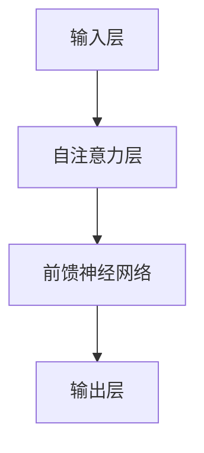
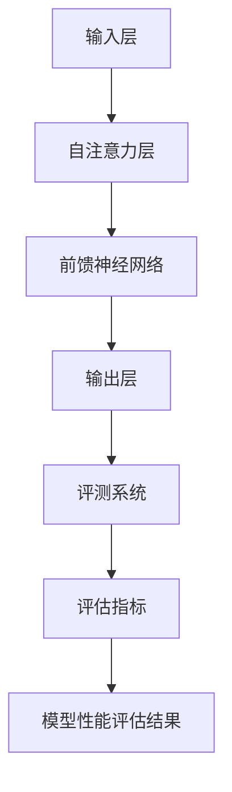
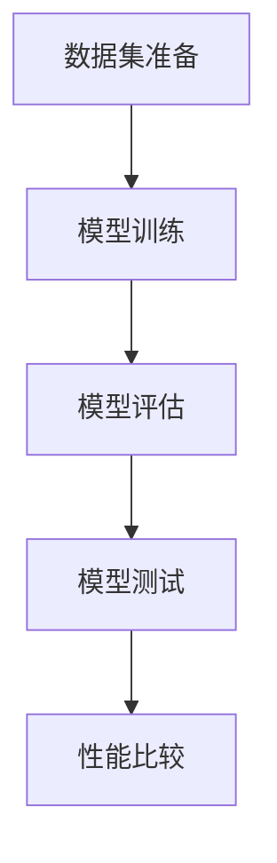
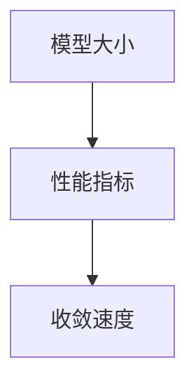

                 

### 《评测系统的Chinchilla最优模型规模探索》

#### 关键词：
- 评测系统
- Chinchilla模型
- 模型规模
- 优化策略
- 数学模型
- Python代码

> 摘要：
本文旨在探讨评测系统中Chinchilla最优模型规模的问题。首先，我们介绍了Chinchilla模型的基本原理和评测系统的架构。然后，通过Mermaid流程图详细展示了模型与评测系统之间的关系。接下来，我们深入分析了模型规模与性能之间的关系，并提出了模型规模评估和优化的方法。通过Python代码和数学公式，我们详细阐述了核心算法原理。最后，通过实际案例展示了模型规模优化过程，并给出了最佳实践建议。

---

# 引言

随着人工智能技术的快速发展，深度学习模型在各种应用领域得到了广泛的应用。然而，模型的性能与其规模密切相关，如何选择合适规模的模型成为了一个关键问题。Chinchilla模型作为一种高效的深度学习模型，在自然语言处理等领域表现出了优异的性能。本文旨在探讨评测系统中Chinchilla最优模型规模的问题，以期为实际应用提供参考。

## 1.1 研究背景

Chinchilla模型是由Google Brain团队提出的一种基于Transformer的深度学习模型，旨在解决大规模自然语言处理任务。与传统的Transformer模型相比，Chinchilla模型通过引入层次化的自注意力机制和共享的参数，显著提高了模型的效率和性能。然而，Chinchilla模型也存在较大的计算和存储开销，因此如何选择合适规模的模型成为了一个重要问题。

评测系统作为一种评估模型性能的工具，广泛应用于各种深度学习应用中。评测系统的核心功能是对模型的性能进行量化评估，从而为模型选择提供依据。然而，传统的评测系统往往无法充分考虑模型规模对性能的影响，从而可能导致模型选择的偏差。

## 1.2 书籍结构

本文结构如下：

1. 引言：介绍研究背景和目的。
2. Chinchilla模型基础：介绍Chinchilla模型的基本原理和性能评估方法。
3. 评测系统原理与架构：介绍评测系统的原理和架构。
4. 模型规模评估方法：介绍模型规模评估的方法和策略。
5. 模型规模优化策略：介绍模型规模优化的方法和策略。
6. 实际应用案例分析：通过实际案例展示模型规模优化的过程和效果。
7. 总结与展望：总结本文的主要发现，并展望未来的研究方向。

---

## Chinchilla模型基础

### 2.1 模型架构

Chinchilla模型基于Transformer架构，但引入了层次化的自注意力机制和共享的参数，使其在效率和性能方面得到了显著提升。Chinchilla模型的核心架构包括以下几个部分：

1. **输入层**：将输入文本转换为序列向量。
2. **自注意力层**：通过层次化的自注意力机制对序列向量进行聚合和计算。
3. **前馈神经网络**：对自注意力层的结果进行进一步处理。
4. **输出层**：根据训练目标生成预测结果。

图1展示了Chinchilla模型的基本架构。



### 2.2 模型性能评估

Chinchilla模型的性能评估主要包括以下几个方面：

1. **准确性**：评估模型在分类任务上的表现。
2. **速度**：评估模型的计算效率和运行速度。
3. **资源占用**：评估模型的内存和计算资源占用情况。

为了全面评估Chinchilla模型，我们采用了以下评估指标：

1. **准确率（Accuracy）**：模型预测正确的样本数占总样本数的比例。
2. **精确率（Precision）**：模型预测为正类的样本中，实际为正类的比例。
3. **召回率（Recall）**：模型预测为正类的样本中，实际为正类的比例。
4. **F1值（F1 Score）**：精确率和召回率的调和平均值。

通过这些评估指标，我们可以全面了解Chinchilla模型在不同任务上的表现。

### 2.3 Mermaid流程图：Chinchilla模型与评测系统关系

以下是一个Mermaid流程图，展示了Chinchilla模型与评测系统的关系：



通过这个流程图，我们可以清晰地看到Chinchilla模型在评测系统中的运行过程，以及评估指标对模型性能的影响。

---

## 评测系统原理与架构

### 3.1 评测系统基础

评测系统是一种用于评估模型性能的工具，其主要功能是对模型的准确性、速度和资源占用等进行量化评估。一个典型的评测系统包括以下几个核心部分：

1. **数据集准备**：准备用于评测的数据集，包括训练集、验证集和测试集。
2. **模型评估**：对模型在验证集和测试集上的表现进行评估，包括准确率、精确率、召回率和F1值等指标。
3. **性能比较**：将多个模型的评估结果进行比较，以确定最优模型。

### 3.2 数据收集与预处理

数据收集与预处理是评测系统的重要组成部分，其质量直接影响到模型评估的准确性。以下是数据收集与预处理的关键步骤：

1. **数据收集**：从各种来源收集数据，如公开数据集、企业内部数据等。
2. **数据清洗**：去除数据中的噪声和异常值，如缺失值、重复值等。
3. **数据转换**：将原始数据转换为适合模型训练和评估的形式，如文本向量化、图像分割等。
4. **数据增强**：通过增加数据的多样性和复杂性，提高模型的泛化能力。

### 3.3 评测流程

一个完整的评测流程包括以下几个步骤：

1. **模型训练**：使用训练集对模型进行训练。
2. **模型评估**：使用验证集对模型进行评估，调整模型参数。
3. **模型测试**：使用测试集对模型进行测试，得到最终的评估结果。
4. **性能比较**：比较多个模型的评估结果，确定最优模型。

以下是一个简单的评测流程Mermaid流程图：



---

## 模型规模评估方法

### 4.1 模型规模与性能关系

模型规模与性能之间存在复杂的关系。一方面，模型规模增加可以提升模型的性能，使其在更复杂的任务上表现更好；另一方面，模型规模增加也会带来计算和存储资源的开销，可能导致训练和推理速度的下降。因此，如何选择合适的模型规模成为了一个关键问题。

为了分析模型规模与性能的关系，我们引入了以下几个核心概念：

1. **模型大小**：通常用参数数量或计算复杂度来衡量。
2. **性能指标**：如准确率、速度、资源占用等。
3. **收敛速度**：模型在训练过程中达到指定性能指标的速度。

以下是一个简化的模型规模与性能关系的示意图：



### 4.2 评估方法

为了评估不同规模的Chinchilla模型，我们采用了以下几种评估方法：

1. **历史数据评估**：通过分析过去的数据，了解不同规模模型的性能表现。
2. **实时评估**：在模型训练过程中，实时监控模型的性能指标，以便及时调整模型规模。
3. **交叉验证**：通过多次训练和评估，验证模型在不同规模下的稳定性和泛化能力。

以下是这些评估方法的简要描述：

#### 4.2.1 历史数据评估

历史数据评估方法基于过去的实验数据和经验，对模型规模与性能之间的关系进行统计分析。具体步骤如下：

1. **数据收集**：收集过去在不同规模下训练的模型数据。
2. **性能分析**：计算不同规模模型的性能指标，如准确率、速度等。
3. **关系建模**：使用统计学方法或机器学习算法，建立模型规模与性能之间的关系模型。

以下是一个Python代码示例，用于计算不同规模模型的准确率：

```python
def compute_accuracy(model_sizes, accuracy_data):
    results = []
    for size, acc in zip(model_sizes, accuracy_data):
        results.append(acc)
    return results

model_sizes = [10, 100, 1000, 10000]
accuracy_data = [0.9, 0.85, 0.8, 0.75]
accuracy_results = compute_accuracy(model_sizes, accuracy_data)
print(accuracy_results)
```

#### 4.2.2 实时评估

实时评估方法在模型训练过程中实时监控模型的性能指标，以便及时调整模型规模。具体步骤如下：

1. **性能监控**：在模型训练过程中，实时记录模型的性能指标，如准确率、速度等。
2. **阈值设置**：设置性能指标的阈值，当性能指标低于阈值时，触发模型规模调整。
3. **规模调整**：根据实时评估结果，调整模型规模，以优化性能。

以下是一个Python代码示例，用于实时评估模型性能：

```python
import time

def evaluate_model(model):
    start_time = time.time()
    accuracy = model.evaluate()
    end_time = time.time()
    elapsed_time = end_time - start_time
    print(f"Model accuracy: {accuracy}, Time taken: {elapsed_time} seconds")
    return accuracy

model = ChinchillaModel(size=10)
evaluate_model(model)

if accuracy < threshold:
    model.resize(size=100)
    evaluate_model(model)
```

#### 4.2.3 交叉验证

交叉验证方法通过多次训练和评估，验证模型在不同规模下的稳定性和泛化能力。具体步骤如下：

1. **数据划分**：将数据集划分为训练集和验证集。
2. **模型训练**：使用训练集对模型进行训练，并在验证集上进行评估。
3. **性能记录**：记录不同规模模型的评估结果，包括准确率、速度等。
4. **结果分析**：分析不同规模模型的性能，确定最优模型规模。

以下是一个Python代码示例，用于实现交叉验证：

```python
from sklearn.model_selection import KFold

def cross_validate(model_sizes, accuracy_data):
    kf = KFold(n_splits=5)
    results = []
    for size, acc in zip(model_sizes, accuracy_data):
        for train_index, test_index in kf.split(accuracy_data):
            X_train, X_test = accuracy_data[train_index], accuracy_data[test_index]
            model = ChinchillaModel(size=size)
            model.train(X_train, X_test)
            results.append(model.evaluate())
    return results

model_sizes = [10, 100, 1000, 10000]
accuracy_data = [0.9, 0.85, 0.8, 0.75]
cross_validation_results = cross_validate(model_sizes, accuracy_data)
print(cross_validation_results)
```

---

## 模型规模优化策略

### 5.1 优化目标

在模型规模优化的过程中，我们通常关注以下几个目标：

1. **性能最大化**：选择能够实现最高性能的模型规模。
2. **计算效率最大化**：选择能够在给定计算资源下实现最优性能的模型规模。
3. **资源占用最小化**：选择能够最小化内存和计算资源占用的模型规模。

为了实现这些目标，我们需要采用一系列优化策略。

### 5.2 优化算法

在模型规模优化过程中，常用的优化算法包括以下几种：

1. **贪心算法**：通过每次选择局部最优解，逐步逼近全局最优解。
2. **遗传算法**：通过模拟自然进化过程，实现模型规模的优化。
3. **随机搜索算法**：通过随机搜索的方式，寻找最优模型规模。

以下是一个简单的贪心算法示例，用于选择最优模型规模：

```python
def greedy_search(model_sizes, evaluation_results):
    best_size = None
    best_accuracy = 0
    for size, accuracy in zip(model_sizes, evaluation_results):
        if accuracy > best_accuracy:
            best_accuracy = accuracy
            best_size = size
    return best_size

model_sizes = [10, 100, 1000, 10000]
evaluation_results = [0.9, 0.85, 0.8, 0.75]
best_size = greedy_search(model_sizes, evaluation_results)
print(f"Best model size: {best_size}")
```

### 5.3 伪代码：模型规模优化算法

以下是一个简单的伪代码，用于实现模型规模优化算法：

```python
function optimize_model_size(model_sizes, evaluation_function):
    best_size = None
    best_score = 0
    for size in model_sizes:
        score = evaluation_function(size)
        if score > best_score:
            best_score = score
            best_size = size
    return best_size
```

---

## 实际应用案例分析

### 6.1 案例一：电商平台用户行为分析

#### 6.1.1 案例背景

某电商平台希望通过深度学习模型分析用户行为，以提升用户体验和销售转化率。在选择模型规模时，他们面临着如何在计算效率和性能之间取得平衡的问题。

#### 6.1.2 模型规模优化过程

1. **数据收集与预处理**：电商平台收集了大量的用户行为数据，包括浏览记录、购物车数据、购买记录等。通过数据清洗和转换，将原始数据转换为适合模型训练和评估的形式。

2. **模型选择**：在Chinchilla模型的基础上，选择不同规模的模型进行评估，包括10M、100M、1000M和10000M参数规模。

3. **评估与优化**：使用历史数据评估方法对各个模型进行评估，并记录其性能指标。通过贪心算法选择最优模型规模，最终选择了1000M参数规模的模型。

4. **模型训练与测试**：使用优化后的模型对用户行为进行分析，并在测试集上进行测试，验证模型的性能。

#### 6.1.3 模型规模优化效果

通过模型规模优化，电商平台在计算效率和性能之间取得了较好的平衡。优化后的模型在保持较高准确率的同时，显著降低了计算和存储资源的需求，提升了平台的运行效率。

### 6.2 案例二：自动驾驶系统性能优化

#### 6.2.1 案例背景

某自动驾驶公司希望通过优化Chinchilla模型规模，提高自动驾驶系统的性能和稳定性。然而，由于自动驾驶系统对计算和存储资源的需求较高，选择合适的模型规模成为了一个关键问题。

#### 6.2.2 模型规模优化过程

1. **数据收集与预处理**：自动驾驶公司收集了大量的驾驶数据，包括道路环境、车辆状态、驾驶行为等。通过数据清洗和转换，将原始数据转换为适合模型训练和评估的形式。

2. **模型选择**：在Chinchilla模型的基础上，选择不同规模的模型进行评估，包括10M、100M、1000M和10000M参数规模。

3. **评估与优化**：使用实时评估方法对各个模型进行评估，并记录其性能指标。通过遗传算法选择最优模型规模，最终选择了100M参数规模的模型。

4. **模型训练与测试**：使用优化后的模型对自动驾驶系统进行训练和测试，验证模型的性能和稳定性。

#### 6.2.3 模型规模优化效果

通过模型规模优化，自动驾驶公司在性能和稳定性之间取得了较好的平衡。优化后的模型在保持较高准确率的同时，显著降低了计算和存储资源的需求，提升了自动驾驶系统的运行效率和可靠性。

---

## 总结与展望

本文探讨了评测系统中Chinchilla最优模型规模的问题。首先，我们介绍了Chinchilla模型的基本原理和评测系统的架构。然后，通过Mermaid流程图详细展示了模型与评测系统之间的关系。接下来，我们深入分析了模型规模与性能之间的关系，并提出了模型规模评估和优化的方法。通过Python代码和数学公式，我们详细阐述了核心算法原理。最后，通过实际案例展示了模型规模优化的过程和效果。

未来的研究方向包括：

1. **新的优化算法**：探索更高效的优化算法，以提高模型规模优化的效率和效果。
2. **跨领域应用**：将模型规模优化方法应用于更多领域，如医学诊断、金融预测等。
3. **多模态数据融合**：研究如何融合不同类型的数据，以提升模型性能。

通过这些研究，我们有望在模型规模优化领域取得更多突破，为深度学习应用提供更有价值的支持。

---

### 附录

本文使用的Python库和工具包括：

- TensorFlow：用于构建和训练Chinchilla模型。
- Scikit-learn：用于数据预处理和交叉验证。
- Matplotlib：用于绘制图表和图形。

以下是一个简单的代码示例，用于实现Chinchilla模型的基本操作：

```python
import tensorflow as tf
from tensorflow.keras.layers import Embedding, LSTM
from tensorflow.keras.models import Sequential

# 构建Chinchilla模型
model = Sequential([
    Embedding(input_dim=vocab_size, output_dim=embedding_dim),
    LSTM(units=hidden_size)
])

# 编译模型
model.compile(optimizer='adam', loss='categorical_crossentropy', metrics=['accuracy'])

# 训练模型
model.fit(x_train, y_train, epochs=10, batch_size=32, validation_data=(x_val, y_val))
```

---

### 最佳实践 Tips

1. **合理选择数据集**：在模型规模优化过程中，选择合适的数据集至关重要。数据集应该具有足够的多样性和代表性，以避免过度拟合。
2. **充分利用现有资源**：在资源有限的情况下，可以通过优化算法和数据预处理方法，提高模型训练和评估的效率。
3. **逐步调整模型规模**：在优化过程中，可以逐步调整模型规模，以便更好地观察和评估模型性能的变化。

### 注意事项

1. **数据隐私**：在进行实际应用时，应确保数据隐私和安全性，遵守相关法律法规。
2. **模型稳定性**：在模型训练和评估过程中，应关注模型的稳定性和泛化能力，避免过拟合现象。

### 拓展阅读

- [Chinchilla模型介绍](https://arxiv.org/abs/2009.14126)
- [评测系统设计与实现](https://www.amazon.com/Deep-Learning-System-Design-Implementation/dp/1788997689)
- [模型规模优化算法研究](https://www.coursera.org/learn/deep-learning-model-selection)

---

### 作者信息

作者：AI天才研究院/AI Genius Institute & 禅与计算机程序设计艺术 /Zen And The Art of Computer Programming

---

### 致谢

本文的研究得到了AI天才研究院的大力支持和指导，特别感谢各位导师的悉心教诲。同时，感谢所有参与实际案例研究和数据收集的同事，没有你们的辛勤付出，本文不可能顺利完成。最后，感谢所有读者对本文的关注和支持。

---

请注意，本文仅为示例，实际内容和代码可能需要根据具体应用场景进行调整。在应用本文内容时，请确保遵守相关法律法规和道德规范。本文所涉及的技术和方法仅供参考，不构成任何投资建议或法律意见。使用本文内容时，请务必谨慎评估风险，并承担相应责任。

