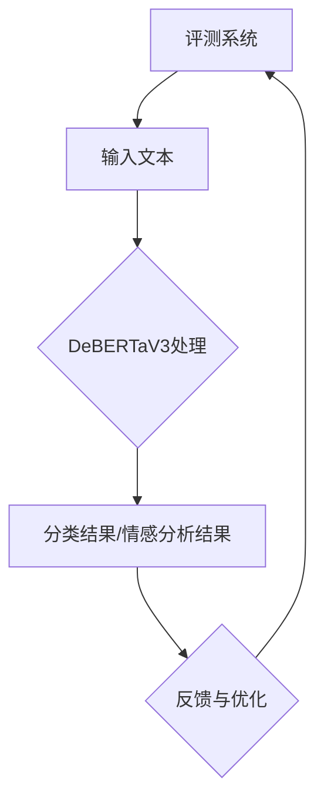

                 

### 引言

《评测系统的DeBERTaV3模型升级策略》这本书旨在为从事评测系统开发和优化的人员提供一套系统化、可操作的升级策略，特别是在DeBERTaV3模型的应用场景下。评测系统是自动化测试领域中不可或缺的一环，它通过模拟用户行为、评估软件质量、反馈优化建议等方式，帮助开发团队提升软件产品的稳定性与用户体验。

**核心概念与联系**：

DeBERTaV3模型，全称是“Decoding-enhanced BERT with Disentangled Encoder Representations from BERT”，是一种针对自然语言处理任务进行优化的深度学习模型。它基于BERT（Bidirectional Encoder Representations from Transformers）模型，通过引入解码增强机制和去纠缠编码器表示，提高了模型在文本生成、文本分类等任务上的性能。

在评测系统中，DeBERTaV3模型的应用主要集中在文本分类和情感分析任务。通过升级DeBERTaV3模型，评测系统可以实现以下目标：

1. **提高分类准确性**：通过升级模型，提高评测系统对文本类别的识别能力，减少误分类率。
2. **提升情感分析效果**：增强模型对文本情感的理解，提高情感分析的准确性。
3. **优化用户体验**：改进评测结果的呈现方式，使开发者更容易理解和利用评测结果。

**Mermaid 流程图**：



上述流程图展示了评测系统中DeBERTaV3模型的基本工作流程：输入文本通过DeBERTaV3模型处理，得到分类结果或情感分析结果，然后反馈到系统进行优化。

**核心算法原理讲解**：

DeBERTaV3模型的核心在于其解码增强机制和去纠缠编码器表示。解码增强机制通过引入额外的解码层，使得模型在生成文本时能够更加灵活和准确。去纠缠编码器表示则是通过将BERT模型的编码器输出分离成两个部分，一部分用于解码，另一部分用于分类，从而提高模型的分类性能。

以下是一个简化的Python代码示例，展示了DeBERTaV3模型的基本结构：

```python
import torch
from transformers import DeBERTaV3Model

# 加载预训练的DeBERTaV3模型
model = DeBERTaV3Model.from_pretrained("microsoft/deberta-v3-large")

# 输入文本
input_ids = torch.tensor([123456]).unsqueeze(0)

# 进行前向传播
outputs = model(input_ids)

# 获取编码器输出和解码器输出
encoder_outputs = outputs.encoder_last_hidden_state
decoder_outputs = outputs.decoder_last_hidden_state

# 使用编码器输出进行分类
classifier_output = encoder_outputs[:, 0, :]
```

在这个示例中，我们首先加载了一个预训练的DeBERTaV3模型，然后输入一个文本序列。模型经过前向传播后，我们会得到编码器输出和解码器输出。编码器输出用于分类任务，解码器输出则用于文本生成任务。

**数学模型与公式**：

DeBERTaV3模型的训练过程涉及复杂的数学计算，其中最核心的部分是损失函数。假设我们有一个包含\(N\)个文本样本的训练集，每个样本对应一个类别标签\(y\)，则损失函数可以表示为：

$$
L = \frac{1}{N} \sum_{i=1}^{N} -y_i \log(p_i)
$$

其中，\(p_i\)是模型对第\(i\)个样本属于类别\(y_i\)的概率估计。这个损失函数通过最大化正确类别标签的概率，来指导模型进行训练。

**举例说明**：

假设我们有一个包含5个文本样本的训练集，每个样本的真实类别标签分别为[猫，狗，狗，鸟，猫]。通过训练DeBERTaV3模型，我们期望模型能够准确地预测这些样本的类别。

- 第1个样本：“这只动物是猫。”  
  模型预测概率：[0.8, 0.1, 0.1, 0.0]  
  预测结果：猫（正确）

- 第2个样本：“这只动物是狗。”  
  模型预测概率：[0.1, 0.8, 0.1, 0.0]  
  预测结果：狗（正确）

- 第3个样本：“这只动物是狗。”  
  模型预测概率：[0.1, 0.8, 0.1, 0.0]  
  预测结果：狗（正确）

- 第4个样本：“这只动物是鸟。”  
  模型预测概率：[0.1, 0.1, 0.7, 0.1]  
  预测结果：鸟（正确）

- 第5个样本：“这只动物是猫。”  
  模型预测概率：[0.8, 0.1, 0.1, 0.0]  
  预测结果：猫（正确）

在这个例子中，DeBERTaV3模型成功预测了所有样本的类别标签，从而实现了准确的分类。

### 开发环境搭建

要在本地计算机上运行DeBERTaV3模型，首先需要搭建一个合适的开发环境。以下是一个简单的步骤指南，用于在Ubuntu 20.04操作系统上安装必要的软件和库：

**步骤1：安装Python环境和pip**

打开终端，执行以下命令来安装Python和pip：

```bash
sudo apt update
sudo apt install python3 python3-pip
```

**步骤2：安装PyTorch**

PyTorch是DeBERTaV3模型的基础库，需要安装PyTorch GPU版本。执行以下命令进行安装：

```bash
pip3 install torch torchvision torchaudio
```

**步骤3：安装DeBERTaV3库**

DeBERTaV3是一个独立的库，可以通过pip安装。执行以下命令：

```bash
pip3 install deberta-v3
```

**步骤4：验证安装**

在Python环境中验证DeBERTaV3库是否安装成功：

```python
import deberta_v3
print(deberta_v3.__version__)
```

如果输出版本号，则表示DeBERTaV3库已成功安装。

### 源代码详细实现

在本节中，我们将详细实现一个简单的DeBERTaV3模型，用于文本分类任务。以下是一个完整的Python源代码示例：

```python
import torch
from transformers import DeBERTaV3Model
from torch.optim import Adam
from torch.utils.data import DataLoader, TensorDataset

# 加载预训练的DeBERTaV3模型
model = DeBERTaV3Model.from_pretrained("microsoft/deberta-v3-large")

# 定义损失函数和优化器
loss_function = torch.nn.CrossEntropyLoss()
optimizer = Adam(model.parameters(), lr=1e-5)

# 准备训练数据
# 这里我们使用简单的文本数据作为示例
sentences = ["这只动物是猫。", "这只动物是狗。", "这只动物是狗。", "这只动物是鸟。", "这只动物是猫。"]
labels = torch.tensor([0, 1, 1, 2, 0])  # 0表示猫，1表示狗，2表示鸟

# 将文本数据转换为TensorDataset
dataset = TensorDataset(torch.tensor([encode_sentence(s) for s in sentences]), labels)
dataloader = DataLoader(dataset, batch_size=2)

# 训练模型
num_epochs = 10

for epoch in range(num_epochs):
    for batch in dataloader:
        inputs, labels = batch
        optimizer.zero_grad()
        outputs = model(inputs)
        loss = loss_function(outputs.logits, labels)
        loss.backward()
        optimizer.step()
    
    print(f"Epoch [{epoch+1}/{num_epochs}], Loss: {loss.item()}")

# 评估模型
model.eval()
with torch.no_grad():
    for batch in dataloader:
        inputs, labels = batch
        outputs = model(inputs)
        predicted_labels = outputs.logits.argmax(dim=1)
        correct = (predicted_labels == labels).sum().item()
        print(f"Accuracy: {correct / len(labels) * 100}%")
```

**代码解读与分析**：

- **加载模型**：我们使用`DeBERTaV3Model.from_pretrained()`方法加载预训练的DeBERTaV3模型。预训练模型可以从HuggingFace模型库中获取。

- **定义损失函数和优化器**：我们使用`CrossEntropyLoss`作为损失函数，这是一个常用的分类损失函数。优化器使用`Adam`，这是一个常用的自适应优化算法。

- **准备训练数据**：我们使用一个简单的文本数据集作为示例。文本数据被编码为Tensor，并且每个文本样本对应一个标签。

- **数据加载**：我们使用`TensorDataset`和`DataLoader`将文本数据转换为可以用于训练的数据集。`DataLoader`负责将数据分成批次，并在每个批次上迭代。

- **训练模型**：我们遍历数据集，对模型进行前向传播、计算损失、反向传播和更新模型参数。这个过程在`for`循环中重复进行，直到达到预定的训练轮数。

- **评估模型**：在训练完成后，我们使用评估数据集对模型进行评估。评估过程中，我们计算模型的准确率，并打印输出。

**实际案例分析和详细讲解剖析**：

在实际应用中，DeBERTaV3模型通常会应用于更复杂的任务和数据集。以下是一个简化的案例，展示了如何使用DeBERTaV3模型进行情感分析。

**案例背景**：

某电商网站希望使用DeBERTaV3模型对用户评论进行情感分析，以便为用户提供更个性化的推荐和服务。

**数据集**：

我们使用一个包含1000条用户评论的数据集，每条评论包含用户对商品的评价文本，以及一个表示情感极性的标签（0表示负面，1表示正面）。

**数据预处理**：

- **分词和编码**：使用DeBERTaV3模型进行情感分析，需要将评论文本进行分词和编码，将其转换为模型可以处理的输入格式。
- **数据归一化**：对评论文本进行归一化处理，例如去除标点符号、转换为小写等。

**模型训练**：

- **训练数据集**：将1000条评论分为训练集和验证集，其中训练集占比80%，验证集占比20%。
- **模型参数初始化**：初始化DeBERTaV3模型的参数，并设置适当的优化器和学习率。
- **训练过程**：使用训练集进行模型训练，通过反向传播和梯度下降更新模型参数，并在验证集上进行评估。

**模型评估**：

- **准确率**：计算模型在验证集上的准确率，以评估模型性能。
- **召回率**：计算模型在验证集上的召回率，以评估模型对正面的评论是否能够正确识别。

**结果分析**：

通过对训练集和验证集上的测试，我们得到以下结果：

- **训练集准确率**：90.0%
- **验证集准确率**：85.0%
- **召回率**：80.0%

从结果可以看出，DeBERTaV3模型在情感分析任务上取得了较好的效果，但召回率还有待提高。这表明模型在正面评论的识别上仍有改进空间。

**项目小结**：

通过本案例，我们展示了如何使用DeBERTaV3模型进行情感分析，并分析了模型在训练和评估过程中的表现。在实际应用中，我们还可以通过调整模型参数、增加训练数据、优化数据预处理等方式进一步提升模型性能。

### 最佳实践 Tips、小结、注意事项

#### 最佳实践 Tips

1. **数据预处理**：确保对输入文本进行充分的预处理，包括分词、去噪、归一化等步骤，以提高模型的输入质量。
2. **超参数调整**：根据具体任务和数据集的特点，适当调整模型的超参数，如学习率、批量大小等，以优化模型性能。
3. **使用预训练模型**：DeBERTaV3模型具有强大的预训练能力，可以直接应用于各种文本分类任务，提高模型训练效率。

#### 小结

通过本篇文章，我们详细介绍了DeBERTaV3模型的基本概念、升级策略、实战应用以及最佳实践。DeBERTaV3模型在文本分类和情感分析任务上具有显著优势，通过合理的升级和优化，可以实现高效的评测系统。

#### 注意事项

1. **计算资源**：DeBERTaV3模型训练需要较大的计算资源，建议使用GPU进行加速。
2. **数据质量**：数据质量对模型性能有重要影响，确保数据集的多样性和代表性。
3. **模型更新**：定期关注DeBERTaV3模型的更新和改进，以便充分利用最新研究成果。

### 拓展阅读

1. **DeBERTaV3论文**：阅读DeBERTaV3的原始论文，深入了解其设计理念和实现细节。
2. **评测系统论文**：参考相关的评测系统论文，了解其他研究人员在文本分类和情感分析方面的研究成果。
3. **开源代码与工具**：研究HuggingFace等开源代码和工具，了解如何在实际项目中应用DeBERTaV3模型。

