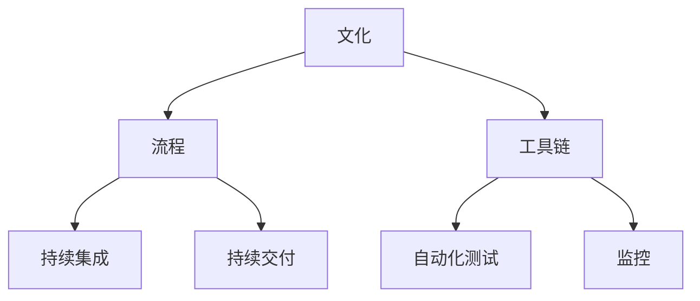

                 

## 《评测系统的DevOps最佳实践》

### 关键词：DevOps、评测系统、最佳实践、持续集成、持续交付、自动化测试、性能优化、监控

#### 摘要：

本文深入探讨了评测系统在DevOps环境下的最佳实践。首先，介绍了DevOps的基本概念及其与评测系统的关系。接着，详细阐述了评测系统的概念与架构，包括其核心组成部分和设计原则。随后，本文分章节讲解了DevOps的最佳实践，从持续集成、持续交付到自动化测试和持续监控。通过项目实战和案例分析，本文展示了如何在实际环境中应用这些最佳实践。最后，本文总结了全文内容，并对未来发展趋势进行了展望。

---

# 评测系统的DevOps最佳实践

在当今快速变化的IT行业中，DevOps已经成为推动软件交付和运维的关键力量。DevOps不仅是一种文化，更是一套流程和工具集，旨在通过协作和自动化提高软件交付的速度和质量。而评测系统作为确保软件质量的重要环节，在DevOps中扮演着至关重要的角色。本文将探讨评测系统在DevOps环境下的最佳实践，旨在为开发者和运维人员提供一套全面的指导方针。

## 1. 确定目标读者

本书的目标读者主要包括以下几类：

- **软件开发工程师**：负责编写代码并理解如何将DevOps实践应用到软件开发过程中。
- **运维工程师**：负责确保系统稳定运行，并了解如何通过DevOps提高系统的可维护性。
- **测试工程师**：负责对软件进行测试，确保其质量满足需求。
- **项目经理**：负责协调项目资源，确保项目按时交付。

通过本书，读者将了解如何将评测系统与DevOps相结合，实现高效的软件交付过程。本书旨在为读者提供一个从概念到实践的全面指南，帮助他们在实际工作中提高效率和成果。

## 2. 确定核心主题

本书的核心主题是“评测系统的DevOps最佳实践”，具体内容包括：

- DevOps的基础概念和原理。
- 评测系统的定义、组成部分和设计原则。
- DevOps在不同环节（持续集成、持续交付、自动化测试、持续监控）中的最佳实践。
- 实际项目中的案例分析和实战指导。

## 3. 构建书的逻辑结构

为了确保本书的连贯性和逻辑性，我们将书的结构分为以下几个部分：

### 第1章 引言与概述

介绍本书的目的、读者对象和主要主题。解释为什么评测系统在DevOps中至关重要。

### 第2章 DevOps基础

深入探讨DevOps的基本概念、原则和工具链，为后续章节的讨论打下基础。

### 第3章 评测系统的概念与架构

详细描述评测系统的定义、组成部分和设计原则，为实践应用做好准备。

### 第4章 DevOps最佳实践

分章节介绍DevOps的最佳实践，包括持续集成、持续交付、自动化测试和持续监控。

### 第5章 性能优化与监控

探讨如何优化评测系统的性能，并提供监控体系的构建和维护方法。

### 第6章 项目实战与案例分析

通过实际项目实战和案例分析，展示如何将DevOps最佳实践应用到评测系统中。

### 第7章 总结与展望

总结全文内容，并对评测系统在DevOps中的未来发展进行展望。

## 4. 细化每个章节的内容

### 第1章 引言与概述

- 1.1 书籍目的与读者定位
- 1.2 DevOps与评测系统的关系
- 1.3 评测系统在DevOps中的重要性

### 第2章 DevOps基础

- 2.1 DevOps核心概念
- 2.2 DevOps三大原则
- 2.3 DevOps工具链介绍

### 第3章 评测系统的概念与架构

- 3.1 评测系统的定义
- 3.2 评测系统的核心组成部分
- 3.3 评测系统的架构设计

### 第4章 DevOps最佳实践

- 4.1 持续集成（CI）最佳实践
- 4.2 持续交付（CD）最佳实践
- 4.3 自动化测试最佳实践
- 4.4 持续监控最佳实践

### 第5章 性能优化与监控

- 5.1 性能优化的策略与工具
- 5.2 监控体系的构建与维护
- 5.3 故障排除与性能调优

### 第6章 项目实战与案例分析

- 6.1 实战一：构建高效的CI/CD流程
- 6.2 实战二：优化评测系统的性能
- 6.3 案例分析：大型电商平台评测系统实践

### 第7章 总结与展望

- 7.1 全书回顾
- 7.2 DevOps最佳实践的未来发展
- 7.3 评测系统在DevOps中的发展趋势

## 5. 包含核心概念与联系

在每个章节中，我们将包含核心概念，并使用Mermaid流程图展示这些概念之间的联系。

### 第2章 DevOps基础

- **DevOps核心概念与联系**
  


### 第4章 DevOps最佳实践

- **持续集成（CI）、持续交付（CD）与自动化测试的联系**

```mermaid
graph TD
A[持续集成(CI)] --> B[持续交付(CD)]
A --> C[自动化测试]
B --> D[持续监控]
C --> D
```

## 6. 编写核心算法原理讲解

在每个相关的章节中，我们将使用Python源代码详细阐述核心算法原理，并结合数学模型和公式进行解释。

### 第4章 DevOps最佳实践

- **持续集成（CI）的核心算法**

```python
# 伪代码：CI流程
def CI_pipeline():
    code_changes = check_for_code_changes()
    if code_changes:
        build_new_version()
        run_tests()
        if test_passed:
            deploy_to_staging()
        else:
            raise_build_failure()

# 测试函数
def run_tests():
    pass率 = calculate_pass_rate()
    if pass率 >= 90:
        return True
    else:
        return False

# 计算通过率
def calculate_pass_rate():
    pass_count = count_passed_tests()
    total_count = count_total_tests()
    return (pass_count / total_count) * 100
```

- **性能监控中的置信区间计算**

$$
CI = \bar{x} \pm z_{\alpha/2} \cdot \frac{\sigma}{\sqrt{n}}
$$

其中，\(\bar{x}\) 是均值，\(z_{\alpha/2}\) 是标准正态分布的分位数，\(\sigma\) 是标准差，\(n\) 是样本大小。

## 7. 添加数学模型和数学公式

在每个涉及数学模型的章节中，我们将使用LaTeX格式书写数学公式，并进行详细解释。

### 第5章 性能优化与监控

- **性能监控中的置信区间计算**

$$
CI = \bar{x} \pm z_{\alpha/2} \cdot \frac{\sigma}{\sqrt{n}}
$$

其中，\(\bar{x}\) 是均值，\(z_{\alpha/2}\) 是标准正态分布的分位数，\(\sigma\) 是标准差，\(n\) 是样本大小。

## 8. 准备项目实战与案例分析

在每个核心章节后，我们将准备一个或多个项目实战和案例分析，以展示如何在实际环境中应用所学知识。

### 第6章 项目实战与案例分析

- **实战一：构建高效的CI/CD流程**
  - 开发环境搭建
  - 源代码详细实现
  - 代码解读与分析
  - 实际案例分析和详细讲解剖析
- **实战二：优化评测系统的性能**
  - 性能优化策略
  - 监控体系构建
  - 故障排除与性能调优

## 9. 编写总结与展望

在书的最后，我们将总结全文内容，并对评测系统在DevOps中的未来发展趋势进行展望。

### 第7章 总结与展望

- **全书回顾**
- **DevOps最佳实践的未来发展**
- **评测系统在DevOps中的发展趋势**

## 10. 确保目录大纲的完整性和简洁性

在编写目录大纲时，我们将确保内容的完整性，同时保持简洁性，避免不必要的重复和冗余。通过清晰的逻辑结构和详细的章节内容，确保读者能够系统地掌握评测系统在DevOps环境下的最佳实践。

# 《评测系统的DevOps最佳实践》目录大纲

## 第1章 引言与概述
### 1.1 书籍目的与读者定位
### 1.2 DevOps与评测系统的关系
### 1.3 评测系统在DevOps中的重要性

## 第2章 DevOps基础
### 2.1 DevOps核心概念
### 2.2 DevOps三大原则
### 2.3 DevOps工具链介绍

## 第3章 评测系统的概念与架构
### 3.1 评测系统的定义
### 3.2 评测系统的核心组成部分
### 3.3 评测系统的架构设计

## 第4章 DevOps最佳实践
### 4.1 持续集成（CI）最佳实践
### 4.2 持续交付（CD）最佳实践
### 4.3 自动化测试最佳实践
### 4.4 持续监控最佳实践

## 第5章 性能优化与监控
### 5.1 性能优化的策略与工具
### 5.2 监控体系的构建与维护
### 5.3 故障排除与性能调优

## 第6章 项目实战与案例分析
### 6.1 实战一：构建高效的CI/CD流程
### 6.2 实战二：优化评测系统的性能
### 6.3 案例分析：大型电商平台评测系统实践

## 第7章 总结与展望
### 7.1 全书回顾
### 7.2 DevOps最佳实践的未来发展
### 7.3 评测系统在DevOps中的发展趋势

## 附录
### 附录A：常用DevOps工具介绍
### 附录B：评测系统常见问题解答
### 附录C：参考文献与资源链接

通过上述详细的目录大纲，我们可以确保本书的内容全面且逻辑清晰，为读者提供一套系统的评测系统DevOps最佳实践指南。接下来，我们将逐步深入到每个章节的内容编写中，以实现这一目标。

