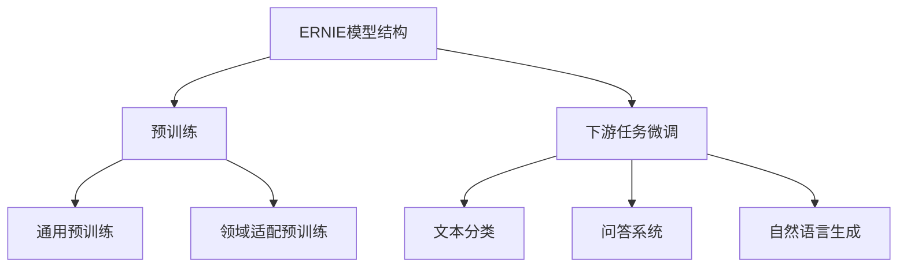

                 

### 撰写《评测系统的ERNIE知识增强模型集成》的技术博客文章

#### 目录大纲

# 评测系统的ERNIE知识增强模型集成

> 关键词：评测系统、ERNIE模型、知识增强模型、预训练、下游任务微调、算法原理、优化方法、应用案例、实战项目

> 摘要：本文将深入探讨评测系统中的ERNIE知识增强模型，包括其基本概念、结构、算法原理以及在不同领域中的应用。通过实际项目案例，我们将展示如何集成ERNIE模型以提升评测系统的性能。

---

## 基础篇：概念与原理

### 1. 评测系统概述

- **评测系统的定义**：介绍评测系统的基本概念和功能。
- **评测系统的分类**：分类和比较不同类型的评测系统。

### 2. ERNIE模型概述

- **ERNIE模型的背景**：介绍ERNIE模型的起源和发展历程。
- **ERNIE模型的特点**：阐述ERNIE模型在自然语言处理领域中的优势。

### 3. 知识增强模型原理

- **知识增强的概念**：知识增强模型的基本原理和作用。
- **知识融合机制**：如何将外部知识库融入模型训练过程。

## 技术篇：模型与算法

### 4. ERNIE模型结构

- **模型架构**：分析ERNIE模型的整体架构。
- **Mermaid流程图**：使用Mermaid绘制ERNIE模型结构的流程图。



### 5. ERNIE模型算法

- **算法原理**：详细讲解ERNIE模型的算法原理。
- **Python源代码**：提供ERNIE模型算法的实现代码示例。

```python
# ERNIE模型算法示例代码
class ERNIEModel(nn.Module):
    def __init__(self):
        super(ERNIEModel, self).__init__()
        # ... 初始化模型层 ...

    def forward(self, inputs):
        # ... 前向传播过程 ...
        return outputs
```

### 6. ERNIE模型优化

- **优化方法**：介绍常用的优化方法，如Adam优化器。
- **数学模型**：使用LaTeX格式展示优化算法的数学模型。

$$
\theta_{t+1} = \theta_t - \alpha \hat{m}_t / \sqrt{\hat{v}_t} + \epsilon
$$

## 应用篇：领域应用

### 7. ERNIE模型在文本评测中的应用

- **应用场景**：文本评测系统在实际中的应用。
- **案例分析**：具体案例分析ERNIE模型在文本评测中的应用效果。

### 8. ERNIE模型在语音评测中的应用

- **应用场景**：语音评测系统在实际中的应用。
- **案例分析**：具体案例分析ERNIE模型在语音评测中的应用效果。

### 9. ERNIE模型在图像评测中的应用

- **应用场景**：图像评测系统在实际中的应用。
- **案例分析**：具体案例分析ERNIE模型在图像评测中的应用效果。

## 实战篇：项目实践

### 10. 实战项目一：文本评测系统开发

- **项目背景**：介绍文本评测系统的开发背景和目标。
- **开发环境搭建**：详细描述开发所需的工具和环境配置。
- **源代码实现**：展示文本评测系统的核心代码实现。
- **代码解读**：对关键代码进行详细解读和分析。

```python
# 文本评测系统核心代码实现
class TextEvaluationSystem(nn.Module):
    def __init__(self):
        super(TextEvaluationSystem, self).__init__()
        # ... 初始化模型层 ...

    def evaluate(self, text):
        # ... 评测过程 ...
        return evaluation_result
```

- **实际案例分析**：通过实际案例展示文本评测系统的应用效果。
- **项目小结**：总结项目经验和教训，提出最佳实践建议。

### 11. 实战项目二：语音评测系统开发

- **项目背景**：介绍语音评测系统的开发背景和目标。
- **开发环境搭建**：详细描述开发所需的工具和环境配置。
- **源代码实现**：展示语音评测系统的核心代码实现。
- **代码解读**：对关键代码进行详细解读和分析。

```python
# 语音评测系统核心代码实现
class VoiceEvaluationSystem(nn.Module):
    def __init__(self):
        super(VoiceEvaluationSystem, self).__init__()
        # ... 初始化模型层 ...

    def evaluate(self, audio):
        # ... 评测过程 ...
        return evaluation_result
```

- **实际案例分析**：通过实际案例展示语音评测系统的应用效果。
- **项目小结**：总结项目经验和教训，提出最佳实践建议。

### 12. 实战项目三：图像评测系统开发

- **项目背景**：介绍图像评测系统的开发背景和目标。
- **开发环境搭建**：详细描述开发所需的工具和环境配置。
- **源代码实现**：展示图像评测系统的核心代码实现。
- **代码解读**：对关键代码进行详细解读和分析。

```python
# 图像评测系统核心代码实现
class ImageEvaluationSystem(nn.Module):
    def __init__(self):
        super(ImageEvaluationSystem, self).__init__()
        # ... 初始化模型层 ...

    def evaluate(self, image):
        # ... 评测过程 ...
        return evaluation_result
```

- **实际案例分析**：通过实际案例展示图像评测系统的应用效果。
- **项目小结**：总结项目经验和教训，提出最佳实践建议。

## 结语

- **总结**：回顾文章的主要内容和亮点。
- **拓展阅读**：推荐进一步阅读的相关资源。

---

### 作者信息

作者：AI天才研究院/AI Genius Institute & 禅与计算机程序设计艺术 /Zen And The Art of Computer Programming

---

**注意**：文章中的代码、公式和图表仅为示例，实际项目可能需要根据具体情况进行调整。文章内容应确保准确、详尽，并遵循技术博客写作的最佳实践。

