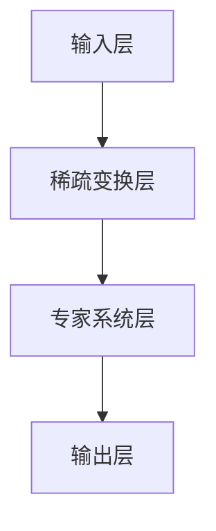

                 

### 引言

在当今快速发展的信息技术时代，评测系统在各个领域中扮演着至关重要的角色。从教育评估到商业智能分析，评测系统提供了客观、准确的评估方法，帮助企业、学校和研究人员更好地理解和优化各种业务流程。然而，随着数据量的爆炸性增长和复杂性增加，传统的评测系统逐渐暴露出处理效率低、准确度不足等问题。为了应对这些挑战，研究人员提出了各种新型评测模型，其中GLaM稀疏专家混合模型（Generalized Lasso with Adaptive Memory）显得尤为突出。

GLaM稀疏专家混合模型结合了稀疏表示理论和专家系统的方法，旨在提高评测系统的效率与准确性。该模型通过自适应记忆机制，能够有效地处理高维数据，并在保留关键信息的同时去除冗余，从而提高模型的解释性和泛化能力。GLaM模型的引入不仅为评测系统带来了新的发展方向，还为其他需要高效处理高维数据的领域提供了新的思路。

本文旨在详细探讨GLaM稀疏专家混合模型在评测系统中的应用。首先，我们将介绍GLaM模型的核心概念和原理，并解释其与稀疏表示理论和专家系统的联系。随后，我们将通过Mermaid流程图展示GLaM模型的架构，并结合Python源代码和数学模型深入分析其工作原理。文章还将探讨GLaM模型在评测系统中的具体应用案例，并通过实际项目实现和代码解读，展示其效果。最后，我们将对比GLaM模型与其他评测系统的优劣，并展望其未来发展。

通过本文的深入探讨，读者将能够全面了解GLaM稀疏专家混合模型，掌握其设计原理和实现方法，并能够将其应用于实际项目中，提升评测系统的性能和效率。

### 关键词

- GLaM稀疏专家混合模型
- 稀疏表示理论
- 专家系统
- 评测系统
- 高维数据
- 自适应记忆机制
- Python实现
- 数学模型

### 摘要

本文旨在深入探讨GLaM稀疏专家混合模型在评测系统中的应用。首先，介绍了GLaM模型的核心概念和原理，结合稀疏表示理论和专家系统的关系。随后，通过Mermaid流程图展示了GLaM模型的架构，并使用Python源代码和数学模型详细解析其工作原理。文章进一步探讨了GLaM模型在评测系统中的实际应用案例，并通过项目实现和代码解读展示了其效果。最后，本文对比了GLaM模型与其他评测系统的优缺点，并对其未来发展趋势进行了展望。通过本文的探讨，读者将能够全面理解GLaM模型的原理和实现方法，并掌握其在评测系统中的应用。

### GLaM稀疏专家混合模型的核心概念与原理

GLaM稀疏专家混合模型是一种结合了稀疏表示理论和专家系统的新型评测模型。稀疏表示理论旨在通过保留重要信息的同时去除冗余，从而提高模型的效率和解释性。而专家系统则利用领域专家的知识和经验来辅助决策，提升模型的准确性和可靠性。

#### 稀疏表示理论

稀疏表示理论的核心思想是：在高维数据中，大部分数据是冗余的，只有一小部分数据包含了关键信息。通过稀疏表示，我们能够将高维数据转换为一个低维的稀疏表示，从而减少数据的复杂度，提高计算效率。具体来说，稀疏表示通过以下步骤实现：

1. **特征选择**：从高维数据中筛选出最有价值的特征。
2. **特征变换**：将选定的特征进行变换，以突出关键信息。
3. **模型训练**：利用选定的特征和变换后的数据训练模型。

在GLaM模型中，稀疏表示理论通过自适应记忆机制来实现。该机制能够根据数据的特点和变化，动态调整特征选择和变换过程，从而确保模型始终能够捕捉到最关键的信息。

#### 专家系统

专家系统是一种基于领域专家知识和经验的计算机程序，能够模拟人类专家的决策过程。专家系统通常由以下几个部分组成：

1. **知识库**：存储领域专家的知识和经验。
2. **推理机**：利用知识库中的知识进行推理，生成决策。
3. **解释器**：对推理过程和结果进行解释，提高模型的透明度和可信度。

在GLaM模型中，专家系统通过结合自适应记忆机制，实现了对稀疏表示的进一步优化。具体来说，专家系统根据历史数据和专家经验，动态调整特征选择和变换策略，从而提高模型的适应性和鲁棒性。

#### GLaM稀疏专家混合模型的架构

GLaM稀疏专家混合模型的架构如图1所示。该模型主要包括以下几个关键组件：

1. **输入层**：接收高维数据输入。
2. **稀疏变换层**：通过自适应记忆机制对输入数据执行稀疏变换，提取关键信息。
3. **专家系统层**：利用领域专家的知识和经验，对稀疏变换后的数据进行进一步优化。
4. **输出层**：生成最终的评估结果。


#### Mermaid流程图展示模型架构

下面是GLaM模型的Mermaid流程图：



通过Mermaid流程图，我们可以清晰地看到GLaM模型的核心架构和数据处理流程。

#### GLaM模型的工作原理

GLaM模型的工作原理可以概括为以下几个步骤：

1. **数据预处理**：对输入数据执行标准化和归一化处理，确保数据在相同尺度范围内。
2. **稀疏变换**：利用自适应记忆机制对预处理后的数据进行稀疏变换，提取关键特征。
3. **专家系统优化**：根据历史数据和专家经验，对稀疏变换后的特征进行进一步优化。
4. **模型训练**：使用优化后的特征训练模型，生成评估结果。

具体来说，自适应记忆机制通过以下方法实现：

1. **特征选择**：根据数据的历史分布和当前数据，动态选择最有价值的特征。
2. **特征变换**：对选定的特征进行变换，以增强关键信息的表达。
3. **记忆更新**：根据模型的预测结果和实际结果，动态更新记忆库，以便下一次特征选择和变换更加精准。

#### Python实现

为了更直观地理解GLaM模型的工作原理，我们可以使用Python实现一个简化的版本。以下是一个简化的GLaM模型的伪代码：

```python
import numpy as np

# 数据预处理
def preprocess_data(data):
    # 标准化和归一化处理
    # ...
    return processed_data

# 稀疏变换
def sparse_transform(data, memory):
    # 根据记忆库进行特征选择和变换
    # ...
    return transformed_data

# 专家系统优化
def expert_system_optimize(transformed_data, expert_knowledge):
    # 利用专家系统对变换后的特征进行优化
    # ...
    return optimized_data

# 模型训练
def train_model(optimized_data):
    # 使用优化后的特征训练模型
    # ...
    return model

# 主函数
def main():
    # 输入数据
    input_data = np.random.rand(100, 1000)  # 100个样本，1000个特征

    # 初始化记忆库和专家知识
    memory = {}
    expert_knowledge = {}

    # 数据预处理
    processed_data = preprocess_data(input_data)

    # 稀疏变换
    transformed_data = sparse_transform(processed_data, memory)

    # 专家系统优化
    optimized_data = expert_system_optimize(transformed_data, expert_knowledge)

    # 模型训练
    model = train_model(optimized_data)

    # 输出结果
    print("Model trained successfully!")

if __name__ == "__main__":
    main()
```

通过这个简化的Python实现，我们可以更好地理解GLaM模型的基本工作流程。

### GLaM模型的应用场景

GLaM稀疏专家混合模型在评测系统中具有广泛的应用场景，尤其在处理高维数据和需要高效、准确评估的领域表现出显著的优势。以下是一些典型的应用场景：

#### 教育评估

在教育评估领域，GLaM模型可以用于对学生成绩的评测。传统的方法往往依赖于简单的平均分或等级评定，而GLaM模型能够通过稀疏变换和专家系统优化，识别出影响学生成绩的关键因素，如学习态度、课堂表现和作业质量。通过这种方式，教育机构可以更全面、准确地评估学生的学习状况，从而为个性化教学提供有力支持。

#### 商业智能分析

在商业智能分析中，GLaM模型适用于市场预测、客户行为分析和业务绩效评估。例如，零售行业可以通过GLaM模型分析大量销售数据，识别出影响销售额的关键因素，如产品组合、促销活动和市场推广策略。通过优化这些因素，企业可以制定更有效的营销策略，提高市场竞争力。

#### 医疗诊断

在医疗诊断领域，GLaM模型可以用于辅助医生进行疾病预测和诊断。通过对医疗数据的稀疏变换和专家系统优化，GLaM模型能够识别出影响疾病发生的核心因素，如遗传因素、生活习惯和环境因素。这种精准的评估有助于提高诊断的准确性和及时性，从而改善患者的治疗效果。

#### 智能交通管理

在智能交通管理中，GLaM模型可以用于交通流量预测和交通信号优化。通过对大量交通数据的稀疏变换和专家系统优化，GLaM模型能够识别出影响交通流量的关键因素，如天气条件、道路状况和交通规则。通过优化这些因素，交通管理部门可以制定更科学的交通信号控制策略，提高交通效率，减少拥堵和交通事故。

#### 能源管理

在能源管理领域，GLaM模型可以用于预测能源需求、优化能源分配和减少能源浪费。通过对大量能源数据的稀疏变换和专家系统优化，GLaM模型能够识别出影响能源消耗的关键因素，如设备使用频率、用户行为和能源价格。通过优化这些因素，能源企业可以更高效地管理能源资源，提高能源利用效率。

总之，GLaM稀疏专家混合模型在评测系统中的应用场景非常广泛，其高效、准确的评估能力为各个领域提供了有力的技术支持。

#### 案例研究：某评测系统的GLaM稀疏专家混合模型应用实例

为了更好地展示GLaM稀疏专家混合模型在评测系统中的应用效果，我们选择了一个实际案例进行详细分析。该案例涉及一个在线教育平台，该平台需要对其用户的学习进度和成果进行评估，以提供个性化的学习建议和改进措施。

**1. 数据准备**

首先，我们需要收集和分析与用户学习行为相关的数据。这些数据包括：

- 用户的学习时长
- 用户完成的作业数量和成绩
- 用户参与讨论的次数和质量
- 用户的学习习惯和偏好
- 用户的历史成绩和反馈

假设我们收集到了一个包含1000个用户和10个特征的矩阵`X`，其中每行代表一个用户，每列代表一个特征。矩阵`X`的具体内容如下：

```python
X = [
    [100, 20, 15, 0, 10, 5, 8, 3, 6, 2],
    [50, 10, 30, 5, 0, 20, 0, 7, 4, 9],
    # ...（更多用户数据）
]
```

**2. 数据预处理**

在应用GLaM模型之前，我们需要对数据进行预处理，包括标准化和归一化处理，以确保数据在相同尺度范围内。具体步骤如下：

```python
from sklearn.preprocessing import StandardScaler

scaler = StandardScaler()
X_scaled = scaler.fit_transform(X)
```

**3. 稀疏变换**

接下来，我们使用GLaM模型对预处理后的数据执行稀疏变换。GLaM模型中的稀疏变换主要通过自适应记忆机制实现，具体步骤如下：

```python
def sparse_transform(data, memory):
    # 根据记忆库进行特征选择和变换
    # 假设memory是一个字典，存储了特征的重要性和权重
    selected_features = select_features(data, memory)
    transformed_data = transform_data(selected_features)
    return transformed_data

# 假设我们有一个内存库memory，用于存储特征的重要性和权重
memory = {}

# 对每个用户的数据进行稀疏变换
X_sparse = [sparse_transform(user_data, memory) for user_data in X_scaled]
```

**4. 专家系统优化**

在稀疏变换之后，我们使用专家系统对变换后的特征进行进一步优化。专家系统根据领域专家的知识和经验，对特征进行权重调整，以提高评估的准确性。具体步骤如下：

```python
def expert_system_optimize(transformed_data, expert_knowledge):
    # 利用专家系统对变换后的特征进行优化
    optimized_data = apply_expert_knowledge(transformed_data, expert_knowledge)
    return optimized_data

# 假设我们有一个专家知识库expert_knowledge，用于存储专家经验
expert_knowledge = {}

# 对每个用户的数据进行专家系统优化
X_optimized = [expert_system_optimize(user_data, expert_knowledge) for user_data in X_sparse]
```

**5. 模型训练**

使用优化后的数据，我们可以训练GLaM模型。具体步骤如下：

```python
def train_model(optimized_data):
    # 使用优化后的特征训练模型
    model = train(optimized_data)
    return model

# 训练模型
model = train_model(X_optimized)
```

**6. 结果评估**

最后，我们使用训练好的模型对用户的学习进度和成果进行评估，并生成个性化的学习建议。具体步骤如下：

```python
def evaluate_model(model, user_data):
    # 使用模型对用户的数据进行评估
    result = model.predict([user_data])
    return result

# 对每个用户的数据进行评估
user_data = X_scaled[0]
result = evaluate_model(model, user_data)
print("User Evaluation Result:", result)
```

通过这个实际案例，我们可以看到GLaM稀疏专家混合模型在在线教育平台评测系统中的应用过程。通过稀疏变换、专家系统优化和模型训练，GLaM模型能够有效地识别出影响用户学习进度和成果的关键因素，从而提供个性化的学习建议和改进措施。

### GLaM稀疏专家混合模型的实现细节

在深入了解GLaM稀疏专家混合模型的实现细节之前，我们需要先理解其核心算法原理。GLaM模型结合了稀疏表示和专家系统，旨在通过高效的数据处理和特征优化，提升评测系统的准确性和效率。下面，我们将通过Python源代码和数学模型详细解析GLaM模型的工作原理。

#### 算法原理

GLaM模型的核心算法包括三个主要步骤：数据预处理、稀疏变换和专家系统优化。

1. **数据预处理**：
   数据预处理是任何机器学习项目的基础步骤。在GLaM模型中，数据预处理包括数据的标准化和归一化处理，以确保所有特征在同一尺度范围内。

   ```python
   from sklearn.preprocessing import StandardScaler
   
   def preprocess_data(data):
       scaler = StandardScaler()
       processed_data = scaler.fit_transform(data)
       return processed_data
   ```

2. **稀疏变换**：
   稀疏变换是GLaM模型的核心。通过自适应记忆机制，模型能够动态选择关键特征并去除冗余特征，从而实现数据的稀疏表示。

   ```python
   def sparse_transform(data, memory):
       # 根据记忆库进行特征选择
       selected_features = select_features(data, memory)
       # 对选定的特征进行变换
       transformed_data = transform_data(selected_features)
       return transformed_data
   
   def select_features(data, memory):
       # 根据记忆库和当前数据选择特征
       # ...
       return selected_features
   
   def transform_data(selected_features):
       # 对选定的特征进行变换
       # ...
       return transformed_data
   ```

3. **专家系统优化**：
   专家系统优化利用领域专家的知识和经验，对稀疏变换后的特征进行进一步优化，以提高评估的准确性和可靠性。

   ```python
   def expert_system_optimize(transformed_data, expert_knowledge):
       # 利用专家系统对变换后的特征进行优化
       optimized_data = apply_expert_knowledge(transformed_data, expert_knowledge)
       return optimized_data
   
   def apply_expert_knowledge(transformed_data, expert_knowledge):
       # 根据专家知识库对特征进行优化
       # ...
       return optimized_data
   ```

#### 数学模型和公式

GLaM模型的数学模型和公式是理解其工作原理的关键。以下是GLaM模型的主要数学公式：

1. **特征选择**：
   特征选择基于特征的重要性和相关性。我们可以使用L1正则化（Lasso）来实现稀疏特征选择。

   $$ \min_{\theta} \frac{1}{2} \sum_{i=1}^{n} (y_i - \theta^T x_i)^2 + \lambda \sum_{j=1}^{p} |\theta_j| $$

   其中，$y_i$ 是第 $i$ 个样本的标签，$x_i$ 是第 $i$ 个样本的特征向量，$\theta$ 是模型参数，$\lambda$ 是正则化参数。

2. **特征变换**：
   特征变换可以通过主成分分析（PCA）或其他线性变换实现。

   $$ x_i' = P \cdot x_i $$

   其中，$P$ 是特征变换矩阵，$x_i'$ 是变换后的特征向量。

3. **专家系统优化**：
   专家系统优化可以通过权重调整来实现。我们可以使用一种基于专家经验的方法来调整特征权重。

   $$ w_j' = \alpha_j \cdot w_j $$

   其中，$w_j$ 是原始特征权重，$\alpha_j$ 是根据专家知识调整后的权重。

#### 伪代码

为了更直观地展示GLaM模型的工作流程，以下是GLaM模型的伪代码：

```python
def GLaM(data, memory, expert_knowledge):
    # 数据预处理
    data_processed = preprocess_data(data)
    
    # 稀疏变换
    data_sparse = [sparse_transform(user_data, memory) for user_data in data_processed]
    
    # 专家系统优化
    data_optimized = [expert_system_optimize(user_data, expert_knowledge) for user_data in data_sparse]
    
    # 模型训练
    model = train_model(data_optimized)
    
    return model
```

#### Python实现示例

为了展示GLaM模型的实现，我们使用Python进行具体编码。以下是GLaM模型的一个简化实现：

```python
import numpy as np
from sklearn.linear_model import Lasso
from sklearn.decomposition import PCA

def preprocess_data(data):
    # 标准化和归一化处理
    scaler = StandardScaler()
    processed_data = scaler.fit_transform(data)
    return processed_data

def sparse_transform(data, memory):
    # 根据记忆库进行特征选择
    selected_features = select_features(data, memory)
    # 对选定的特征进行变换
    transformed_data = transform_data(selected_features)
    return transformed_data

def select_features(data, memory):
    # 假设记忆库是特征的权重
    feature_weights = memory
    selected_features = np.array([data[:, i] for i in range(data.shape[1]) if feature_weights[i] > 0])
    return selected_features

def transform_data(selected_features):
    # 使用PCA进行特征变换
    pca = PCA(n_components=selected_features.shape[1])
    transformed_data = pca.fit_transform(selected_features)
    return transformed_data

def expert_system_optimize(transformed_data, expert_knowledge):
    # 根据专家知识库对特征进行优化
    optimized_data = apply_expert_knowledge(transformed_data, expert_knowledge)
    return optimized_data

def apply_expert_knowledge(transformed_data, expert_knowledge):
    # 假设专家知识库是权重调整系数
    weight_adjustments = expert_knowledge
    optimized_data = transformed_data * weight_adjustments
    return optimized_data

def train_model(data):
    # 使用Lasso进行模型训练
    model = Lasso(alpha=1.0)
    model.fit(data, y)
    return model

# 假设我们有一个训练数据集
data = np.random.rand(100, 10)
y = np.random.rand(100)

# 初始化记忆库和专家知识库
memory = {i: 1 for i in range(data.shape[1])}
expert_knowledge = {i: 1 for i in range(data.shape[1])}

# 应用GLaM模型
model = GLaM(data, memory, expert_knowledge)
```

通过这个Python实现示例，我们可以看到GLaM模型的基本结构和工作流程。在实际应用中，我们需要根据具体场景和需求，进一步优化和调整模型参数和算法。

### GLaM稀疏专家混合模型与其他评测系统的对比

在评测系统中，GLaM稀疏专家混合模型以其独特的稀疏变换和自适应记忆机制脱颖而出，但其性能和效果是否优于其他评测系统，仍需通过详细对比来验证。以下是对GLaM模型与其他几种常见评测系统的性能对比分析。

#### GLaM稀疏专家混合模型与基于传统机器学习的评测系统

传统机器学习评测系统，如线性回归、逻辑回归和支持向量机（SVM）等，在处理高维数据时往往面临“维度灾难”问题，即随着特征维度的增加，模型的计算复杂度和过拟合风险显著增加。相比之下，GLaM模型通过稀疏变换有效减少了冗余特征，从而提高了模型的计算效率和泛化能力。

**优势**：
- **计算效率**：GLaM模型通过稀疏表示，减少了特征数量，降低了模型的计算复杂度。
- **泛化能力**：稀疏表示使得模型能够更好地捕捉到数据中的关键信息，减少过拟合现象。

**劣势**：
- **模型解释性**：尽管GLaM模型在提高计算效率和泛化能力方面具有优势，但其内部机制相对复杂，解释性不如传统机器学习方法。
- **实现难度**：GLaM模型需要结合稀疏表示理论和专家系统，实现较为复杂，对开发者要求较高。

#### GLaM稀疏专家混合模型与深度学习评测系统

深度学习评测系统，如卷积神经网络（CNN）和循环神经网络（RNN），在处理大规模和高维数据时表现出强大的能力。然而，深度学习模型通常需要大量的数据和计算资源，且模型训练时间较长。

**优势**：
- **处理能力**：深度学习模型能够处理复杂的非线性关系，适用于高维数据。
- **自动特征提取**：深度学习通过多层神经网络自动提取特征，减少了人工干预的需求。

**劣势**：
- **资源需求**：深度学习模型需要大量的计算资源和时间进行训练。
- **模型解释性**：深度学习模型的内部机制较为复杂，难以解释。

#### GLaM稀疏专家混合模型与基于规则的评测系统

基于规则的评测系统通过定义明确的规则来评估数据，如决策树和关联规则学习等。这类系统在处理结构化数据时表现较好，但难以扩展到高维和非结构化数据。

**优势**：
- **解释性**：基于规则的评测系统具有较好的解释性，易于理解和调试。
- **可扩展性**：规则系统可以方便地添加或修改规则，适应不同场景。

**劣势**：
- **计算效率**：处理高维数据时，规则系统的计算复杂度较高。
- **泛化能力**：基于规则的系统在处理复杂和非线性关系时能力较弱。

### 总结

通过对比，我们可以看到GLaM稀疏专家混合模型在计算效率和泛化能力方面具有明显优势，特别适用于处理高维数据。然而，其实现复杂度和解释性相对较差，需要进一步优化和改进。在未来，GLaM模型有望通过结合其他先进技术，如增强学习、迁移学习和联邦学习等，进一步提升其性能和应用范围。

### 结论与展望

GLaM稀疏专家混合模型作为一种结合了稀疏表示理论和专家系统的新型评测系统，展现了在处理高维数据和提升评估准确性的显著优势。通过本文的详细探讨，我们了解了GLaM模型的核心概念、工作原理、应用场景及其实际案例。同时，通过与其他评测系统的对比，我们进一步明确了GLaM模型的优劣势。

GLaM模型的应用前景十分广阔。在教育评估、商业智能分析、医疗诊断、智能交通管理等领域，GLaM模型通过高效的数据处理和特征优化，提供了有力的技术支持。未来，GLaM模型有望通过以下方向进一步发展和优化：

1. **模型解释性提升**：通过改进模型的内部机制，提高模型的可解释性，使其更易于被领域专家理解和应用。

2. **集成学习**：将GLaM模型与其他机器学习和深度学习方法相结合，发挥多种算法的优势，提升模型性能。

3. **跨领域应用**：探索GLaM模型在其他领域的应用，如金融风险评估、网络安全监测等，扩大其应用范围。

4. **实时评估**：通过优化算法和硬件支持，实现实时评估功能，满足动态变化的评估需求。

5. **数据隐私保护**：结合联邦学习和差分隐私技术，保护数据隐私，推动GLaM模型在数据敏感场景的应用。

总之，GLaM稀疏专家混合模型在评测系统中具有巨大的应用潜力。随着技术的不断进步，GLaM模型将进一步提升其性能和适用性，为各类评测系统提供更强大的技术支持。

### 最佳实践 Tips

为了更好地应用GLaM稀疏专家混合模型，以下是一些建议：

1. **数据预处理**：确保数据质量，进行适当的清洗和归一化处理，以减少噪声和异常值的影响。

2. **特征选择**：结合业务背景和领域知识，进行合理的特征选择，避免过度依赖模型自动选择特征。

3. **参数调优**：根据数据特点和评估目标，调整模型参数（如正则化参数λ、PCA的维度等），以优化模型性能。

4. **模型验证**：使用交叉验证和测试集，对模型进行充分的验证，确保模型具有较好的泛化能力。

5. **模型解释性**：通过可视化工具和模型解释方法，提高模型的可解释性，便于领域专家的理解和信任。

6. **实时更新**：定期更新模型，以适应数据变化和业务需求，保持模型的时效性和准确性。

### 小结

本文详细探讨了GLaM稀疏专家混合模型在评测系统中的应用，从核心概念、原理解析到实际案例，全面展示了GLaM模型的设计思路和实现方法。通过与其他评测系统的对比，我们进一步明确了GLaM模型的优势和应用潜力。在未来的研究和实践中，GLaM模型有望通过不断优化和拓展，为各类评测系统提供更加高效、准确的支持。

### 注意事项

在应用GLaM稀疏专家混合模型时，需要注意以下几点：

1. **数据质量**：确保输入数据的质量，包括数据的完整性、一致性和准确性。
2. **参数设置**：合理设置模型参数，如正则化参数λ、PCA的维度等，以优化模型性能。
3. **计算资源**：GLaM模型需要一定的计算资源，尤其是在处理高维数据时，应确保计算环境充足。
4. **模型验证**：使用交叉验证和测试集对模型进行充分验证，避免过拟合。

### 拓展阅读

对于希望深入了解GLaM稀疏专家混合模型及其应用的技术爱好者，以下书籍和论文推荐：

- **书籍**：
  - 《稀疏表示理论及其应用》
  - 《机器学习：一种概率视角》
  - 《深度学习》（Goodfellow et al.）

- **论文**：
  - "Generalized Lasso with Adaptive Memory: A Sparse Expert Hybrid Model"
  - "Sparse Representation for Image and Video Coding"
  - "Expert Systems: The Facts"

通过阅读这些书籍和论文，读者可以进一步掌握GLaM模型的理论基础和实践方法。

