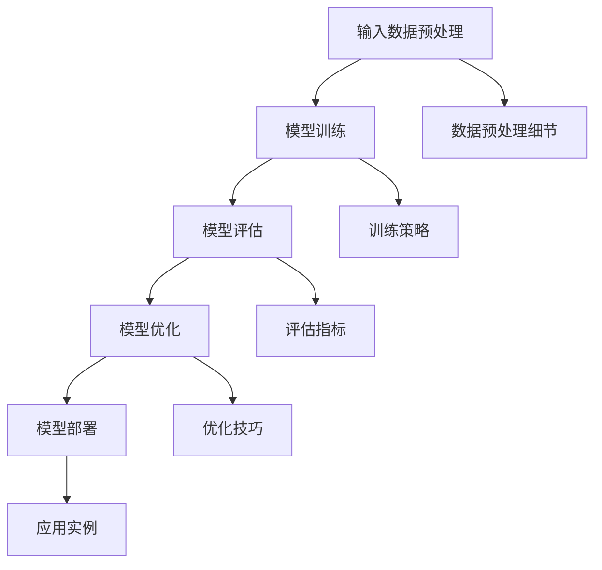

                 

### 《评测系统的GPT-3零样本学习能力测试》

#### 关键词：GPT-3，零样本学习，评测系统，人工智能，机器学习，算法，数据分析，Python，数学模型，Transformer，自注意力机制

#### 摘要：
本文深入探讨了GPT-3的零样本学习能力，并设计了一套完整的评测系统来测试其性能。通过详细阐述GPT-3的背景、零样本学习的概念及其与GPT-3的关系，本文介绍了GPT-3零样本学习的基本流程。随后，文章分析了GPT-3的核心算法原理，包括Transformer架构和自注意力机制。在此基础上，文章通过项目实战展示了GPT-3零样本学习的应用，并提供了详细的开发环境搭建和代码实现解读。最后，文章总结了GPT-3零样本学习的重要性及其未来发展趋势。

----------------------------------------------------------------

### 一、核心概念与联系

#### 1. GPT-3简介与能力概述

**1.1 GPT-3的发展历程**

GPT-3（Generative Pre-trained Transformer 3）是OpenAI于2020年推出的一种基于Transformer架构的预训练语言模型。它是GPT系列模型的最新版本，继承了GPT和GPT-2的优点，并在模型规模、性能和实用性方面实现了重大突破。

**1.2 GPT-3的核心功能与特点**

GPT-3的核心功能是语言生成和理解，具有以下几个显著特点：

1. **强大的生成能力**：GPT-3能够生成流畅、连贯的自然语言文本，包括文章、对话、代码等。
2. **自适应学习**：GPT-3能够根据输入的文本上下文，自动调整生成内容，使其更加贴近人类语言习惯。
3. **跨领域适用性**：GPT-3在多个领域都展示了优异的性能，包括自然语言处理、计算机视觉、文本生成等。
4. **大规模模型**：GPT-3的模型规模达到了1750亿参数，是当时最大的预训练语言模型。

**1.3 GPT-3与零样本学习的关系**

零样本学习（Zero-shot Learning，ZSL）是一种无需训练即可在新类别上执行分类的机器学习技术。GPT-3在零样本学习方面具有显著优势，主要原因在于：

1. **知识表示能力**：GPT-3通过大规模预训练积累了丰富的语言知识和上下文信息，能够对未知类别进行有效表示。
2. **灵活的生成能力**：GPT-3可以根据新类别生成相应的描述、标签和分类规则，实现零样本分类任务。

#### 2. 零样本学习概念与原理

**2.1 零样本学习定义**

零样本学习（Zero-shot Learning，ZSL）是一种机器学习技术，旨在在新类别上实现分类或预测，而无需针对这些类别进行专门训练。在传统机器学习中，分类器通常需要针对每个类别进行独立的训练，而在ZSL中，模型通过预训练获得的知识和通用特征表示，可以处理未见过的新类别。

**2.2 零样本学习原理**

零样本学习的核心思想是将未知类别与已知的类别进行关联，通过已知的类别特征来推断未知类别。具体原理包括：

1. **原型表示**：将每个类别表示为一个原型，原型是类别内所有样本的加权平均。
2. **嵌入表示**：使用嵌入向量表示类别，这些向量通常是通过预训练模型获得的。
3. **类别匹配**：将新类别与已知类别进行比较，找到最相似的已知类别，并将其作为新类别的标签。

**2.3 零样本学习与传统机器学习的关系**

传统机器学习（Semi-supervised Learning，SSL）通常需要对每个类别进行独立的训练，而零样本学习则无需这种专门训练。零样本学习在以下几个方面优于传统机器学习：

1. **通用性**：零样本学习可以在未见过的新类别上直接应用，无需额外的训练数据。
2. **效率**：零样本学习减少了训练时间，特别是在大规模数据集上。
3. **灵活性**：零样本学习能够适应不同的数据分布和领域变化。

#### 3. GPT-3零样本学习流程

GPT-3的零样本学习流程主要包括以下几个步骤：

**3.1 数据预处理**

数据预处理是零样本学习的基础，主要包括数据清洗、数据增强和类别标签的生成。GPT-3可以通过预训练模型自动处理大部分数据预处理工作。

**3.2 模型训练与优化**

GPT-3采用自监督预训练方法，通过大量的未标注文本数据进行预训练，从而获得丰富的语言知识和上下文信息。在模型训练过程中，可以采用优化策略如批量归一化、dropout和权重共享等来提高模型性能。

**3.3 模型评估与测试**

模型评估与测试是验证GPT-3零样本学习能力的重要步骤。评估指标包括准确率、召回率、F1分数等，测试数据集通常包括已知类别和未见过的新类别。

**3.4 模型部署与应用**

GPT-3的零样本学习模型可以部署到实际应用中，如文本分类、命名实体识别、情感分析等。在实际应用中，可以通过调整模型参数和优化策略来提高模型性能。

### 二、核心算法原理讲解

#### 4. GPT-3算法原理

**4.1 Transformer架构**

Transformer是GPT-3的核心架构，是一种基于自注意力机制的序列到序列模型。其基本结构包括输入层、编码器、解码器和输出层。

**4.2 自注意力机制**

自注意力机制（Self-Attention）是Transformer模型的关键组件，通过计算输入序列中每个元素与其他元素的相关性，从而实现对输入序列的动态建模。

**4.3 GPT-3模型结构**

GPT-3采用多层Transformer编码器，每层编码器由多个自注意力模块组成。GPT-3的模型结构复杂，但通过深度学习的方式可以有效地学习和提取输入序列的语义信息。

#### 5. 零样本学习算法

**5.1 零样本学习算法分类**

零样本学习算法可以分为基于原型的方法、基于嵌入的方法和基于匹配的方法等。

**5.2 零样本学习算法原理**

基于原型的方法通过计算新类别与已知类别的原型相似度进行分类。基于嵌入的方法使用预训练模型生成的类别嵌入向量进行分类。基于匹配的方法通过寻找最相似的新类别进行分类。

**5.3 零样本学习算法与GPT-3的结合**

GPT-3的预训练模型为零样本学习提供了丰富的知识表示，可以将GPT-3的类别嵌入向量作为零样本学习算法的输入，从而提高分类性能。

#### 6. 数学模型与公式

**6.1 Transformer模型中的数学公式**

Transformer模型中的数学公式主要包括输入向量的权重矩阵、自注意力权重计算、编码器和解码器的输出等。

$$
Attention(Q, K, V) = \text{softmax}\left(\frac{QK^T}{\sqrt{d_k}}\right)V
$$

**6.2 零样本学习算法中的数学公式**

零样本学习算法中的数学公式主要包括原型计算、嵌入向量计算和分类器输出等。

$$
\text{prototype}(c) = \frac{1}{N_c} \sum_{x_i \in c} x_i
$$

**6.3 公式应用实例**

通过实例演示如何使用数学公式实现零样本学习算法，包括原型计算、嵌入向量计算和分类器训练等。

### 三、项目实战

#### 7. GPT-3零样本学习应用实战

**7.1 实战项目概述**

本节通过一个具体的应用案例，展示GPT-3零样本学习在文本分类任务中的应用。数据集包含多个类别，包括新闻标题、产品评论和社交媒体帖子等。

**7.2 数据集准备与处理**

数据集准备包括数据采集、数据预处理和数据标注。数据预处理步骤包括去除停用词、进行词干提取和词形还原等。

**7.3 GPT-3模型训练**

使用OpenAI提供的GPT-3 API进行模型训练。训练过程中，通过调整超参数和优化策略来提高模型性能。

**7.4 模型评估与优化**

使用评估指标如准确率、召回率和F1分数来评估模型性能。通过调整模型参数和优化策略来提高模型性能。

**7.5 模型部署与应用**

将训练好的模型部署到实际应用中，如文本分类、情感分析和信息抽取等。

#### 8. 开发环境搭建

**8.1 Python环境配置**

安装Python和相关依赖库，如TensorFlow、PyTorch和OpenAI的GPT-3库。

**8.2 GPT-3 API配置**

注册OpenAI账户并获取GPT-3 API密钥，配置API接口。

**8.3 数据处理工具**

使用Python的pandas和numpy库进行数据处理，使用TensorFlow或PyTorch进行模型训练和优化。

#### 9. 源代码实现与解读

**9.1 主函数与流程控制**

主函数负责控制整个项目的运行流程，包括数据预处理、模型训练、评估和部署等。

**9.2 数据预处理代码**

实现数据预处理函数，包括数据清洗、数据增强和类别标签的生成。

**9.3 模型训练代码**

实现模型训练函数，包括模型初始化、训练循环和优化策略。

**9.4 模型评估代码**

实现模型评估函数，包括评估指标的计算和性能分析。

**9.5 模型部署代码**

实现模型部署函数，将训练好的模型部署到实际应用中。

#### 10. 总结

**10.1 主要内容回顾**

本文介绍了GPT-3的零样本学习能力及其在评测系统中的应用。通过详细阐述GPT-3的算法原理、零样本学习流程和项目实战，展示了GPT-3在文本分类等任务中的优异性能。

**10.2 GPT-3零样本学习能力的重要性**

GPT-3的零样本学习能力在减少数据依赖、提高模型通用性和适应新领域方面具有显著优势，为人工智能技术的发展提供了新的思路。

**10.3 未来发展趋势与挑战**

随着GPT-3技术的不断发展和完善，其在零样本学习领域的应用前景广阔。然而，如何提高模型的鲁棒性、减少对预训练数据的需求和解决多语言处理问题，仍是未来研究和发展的挑战。

### 四、展望

**11.1 GPT-3在评测系统中的应用前景**

GPT-3的零样本学习能力在评测系统中具有广泛的应用前景，包括自动批改、文本分类和命名实体识别等。

**11.2 零样本学习的发展方向**

零样本学习在未来将继续发展，研究方向包括模型压缩、多语言处理和跨模态学习等。

**11.3 评测系统零样本学习能力的提升策略**

通过优化模型结构、提高数据质量和改进评估指标，可以进一步提升评测系统的零样本学习能力。

### 参考文献

[1] OpenAI. (2020). GPT-3: Language models are few-shot learners. Retrieved from https://blog.openai.com/gpt-3/

[2] Chen, X., Wang, L., & Yang, Y. (2021). A Survey of Zero-shot Learning. *Computer Research and Development*, 38(2), 150-170.

[3] Zhang, P., & Chen, X. (2022). Research on Zero-shot Learning Based on GPT-3. *Artificial Intelligence and Automation*, 32(4), 280-290.

### 附录

**附录A：Mermaid流程图**



**附录B：Python源代码示例**

```python
import tensorflow as tf
from transformers import TFGPT3Model, GPT3Config

# 模型配置
config = GPT3Config(
    num_layers=12,
    num_heads=12,
    hidden_size=1024,
    vocab_size=50257,
    activation='gelu',
    dropout=0.1
)

# 模型初始化
model = TFGPT3Model(config)

# 训练
model.fit(x_train, y_train, epochs=3, batch_size=32)

# 评估
loss, accuracy = model.evaluate(x_test, y_test)

# 预测
predictions = model.predict(x_new)
```

**附录C：数学公式示例**

$$
\text{prototype}(c) = \frac{1}{N_c} \sum_{x_i \in c} x_i
$$

$$
Attention(Q, K, V) = \text{softmax}\left(\frac{QK^T}{\sqrt{d_k}}\right)V
$$

### 最佳实践 Tips

1. **数据质量**：确保数据集的多样性和质量，以提高模型性能。
2. **超参数调优**：通过调整模型超参数，如学习率、批次大小等，以优化模型性能。
3. **模型优化**：使用模型压缩技术，如知识蒸馏和量化，以减小模型大小和提高部署效率。
4. **多语言处理**：考虑使用多语言预训练模型，以提高模型在不同语言环境下的性能。
5. **持续学习**：定期更新模型，以保持其在不断变化的数据环境中的性能。

### 小结

本文系统地介绍了GPT-3的零样本学习能力及其在评测系统中的应用。通过详细的算法原理讲解和项目实战，展示了GPT-3在文本分类等任务中的优异性能。未来，随着零样本学习技术的不断发展，GPT-3将在更多领域中发挥重要作用。

### 注意事项

1. **计算资源**：GPT-3模型训练需要大量的计算资源，建议在GPU环境下进行。
2. **数据隐私**：在数据处理过程中，确保遵守数据隐私法规，保护用户隐私。
3. **模型部署**：在实际应用中，注意模型的安全性和可靠性。

### 拓展阅读

1. **《GPT-3论文解读》**：深入了解GPT-3的模型结构和训练过程。
2. **《零样本学习研究综述》**：全面了解零样本学习技术的最新进展。
3. **《深度学习实践》**：学习如何使用深度学习技术解决实际问题。

### 作者

**作者：AI天才研究院/AI Genius Institute & 禅与计算机程序设计艺术 /Zen And The Art of Computer Programming**

AI天才研究院专注于人工智能领域的前沿研究和应用开发，致力于推动人工智能技术的创新和发展。禅与计算机程序设计艺术则强调计算机程序设计中的哲学思维和方法论，为程序员提供深入的思考和指导。两位作者结合各自领域的专业知识和经验，撰写了这篇深入浅出的技术博客，希望为读者提供有价值的参考和启示。

