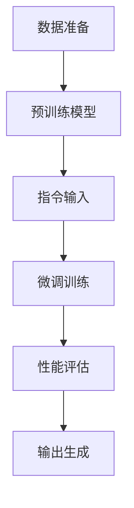
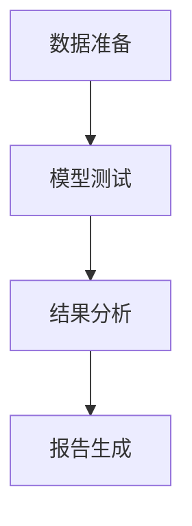

                 

# 引言

评测系统在人工智能领域扮演着至关重要的角色，特别是在大规模语言模型的应用中。这些系统用于评估模型的性能，确保其输出质量，并在开发过程中提供反馈。随着生成预训练语言模型的快速发展，如GPT-3、InstructGPT等，评测系统的重要性愈发凸显。

InstructGPT-J是一个开源指令模型，旨在通过精细调整预训练语言模型来提高其遵循指令的能力。这种模型在自然语言处理（NLP）任务中具有广泛应用，特别是在问答系统、对话系统等需要明确指令遵循的场合。评测InstructGPT-J的性能和效果，对于理解和优化这一模型具有重要意义。

本文旨在通过详细的测试和分析，评测InstructGPT-J的开源指令模型。文章将按照以下结构展开：

1. **InstructGPT-J概述**：介绍InstructGPT-J的核心概念、原理和架构。
2. **评测系统基础**：探讨评测系统的基本概念、指标和流程。
3. **InstructGPT-J评测实践**：通过具体案例展示InstructGPT-J的评测过程。
4. **评测结果分析**：对评测结果进行解读，分析模型性能。
5. **挑战与未来方向**：讨论当前面临的挑战和未来可能的发展方向。
6. **总结与展望**：总结主要成果，提出不足和改进建议。

通过本文的详细讨论，我们希望为读者提供一个全面的理解，帮助他们在实际应用中更好地利用InstructGPT-J模型，同时为后续的研究提供参考。

## InstructGPT-J概述

InstructGPT-J是一种基于预训练语言模型的开源指令模型，其核心思想是通过精细调整预训练模型，使其更好地理解和遵循给定的指令。这一模型在自然语言处理（NLP）领域具有广泛应用，特别是在需要高度指令遵循的场景中，如问答系统和对话系统。

### 核心概念

InstructGPT-J的核心概念可以归纳为以下几个方面：

1. **指令遵循**：模型能够根据给定的指令执行特定任务，如生成回答、编写代码等。
2. **自适应调整**：通过对预训练模型的微调，使得模型能够根据不同指令调整其行为。
3. **上下文理解**：模型能够理解指令中的上下文信息，并据此生成相应的输出。

### 原理

InstructGPT-J的工作原理基于预训练语言模型。首先，模型在大量的文本数据上进行预训练，学习自然语言的统计规律和语义信息。然后，通过微调（Fine-tuning）过程，将模型调整为能够更好地遵循特定指令。微调过程中，模型会接触到一系列带有指令和目标输出的数据样本，通过学习这些样本，模型能够理解如何根据指令生成适当的输出。

具体来说，InstructGPT-J的微调过程包括以下几个步骤：

1. **数据准备**：收集包含指令和对应输出的数据集，这些数据可以是问答对、对话记录等。
2. **微调训练**：使用这些数据对预训练模型进行微调训练，使得模型能够根据指令生成相应的输出。
3. **性能评估**：通过评测系统对微调后的模型进行性能评估，确保模型能够准确遵循指令。

### 架构

InstructGPT-J的架构主要由以下几个部分组成：

1. **预训练语言模型**：如GPT、BERT等，作为基础模型。
2. **指令输入模块**：用于接收和处理用户指令。
3. **微调模块**：负责根据指令和样本进行模型微调。
4. **输出生成模块**：根据微调后的模型生成相应输出。

为了帮助读者更直观地理解InstructGPT-J的核心概念和原理，我们可以使用Mermaid流程图来展示其工作流程：



在上面的流程图中，数据准备阶段是整个流程的起点，通过收集带有指令和输出的样本数据。这些数据将被用于预训练模型，使其学习自然语言的模式。接着，模型将接收用户指令，并通过指令输入模块进行处理。随后，模型进入微调训练阶段，通过不断调整其参数，以更好地遵循指令。在微调训练完成后，评测系统会对模型进行性能评估，以确保其能够生成高质量的输出。最后，输出生成模块根据微调后的模型生成最终输出。

通过上述介绍和流程图，我们希望读者能够对InstructGPT-J的核心概念和工作原理有更深入的理解。

## 评测系统基础

在评估InstructGPT-J模型性能时，一个可靠和全面的评测系统是必不可少的。评测系统不仅能够衡量模型遵循指令的能力，还能提供对模型性能的全面分析和反馈。以下将介绍评测系统的基本概念、关键指标和评测流程。

### 基本概念

评测系统（Evaluation System）是一个用于衡量和评估模型性能的框架，它通常包括以下几个主要部分：

1. **评估指标**：用于量化模型性能的各种度量标准，如准确性、F1分数、BLEU分数等。
2. **评估数据集**：包含一系列用于评估模型性能的数据样本，这些数据集通常涵盖不同类型的任务和场景。
3. **评估算法**：用于计算评估指标的具体算法，如精确度、召回率、覆盖率等计算方法。
4. **评估流程**：包括数据准备、模型测试、结果分析和报告生成的整个过程。

### 关键指标

在评测InstructGPT-J模型时，以下是一些关键指标：

1. **准确性**：模型输出与实际输出完全匹配的比例。虽然简单，但准确性是评估模型基本任务完成能力的一个直接指标。
2. **F1分数**：精确度和召回率的调和平均，用于平衡两者之间的偏差。在答案生成和文本分类等任务中，F1分数是一个重要的评估指标。
3. **BLEU分数**：基于记分牌比较模型输出与人类输出之间的相似度，通常用于机器翻译任务。
4. **响应时间**：模型生成输出所需的时间，尤其是在实时应用中，响应时间是一个关键性能指标。
5. **鲁棒性**：模型在不同指令和数据集上的稳定性，一个鲁棒性好的模型能够在多种场景下保持一致的输出质量。

### 评测流程

一个完整的评测流程通常包括以下步骤：

1. **数据准备**：收集并整理用于评估的数据集，确保数据集的多样性和代表性。
2. **模型测试**：使用测试数据集对InstructGPT-J模型进行测试，计算各种评估指标。
3. **结果分析**：对测试结果进行详细分析，识别模型的优势和不足。
4. **报告生成**：撰写评测报告，总结模型性能和改进方向。

为了帮助读者更好地理解评测系统的关键组成部分，我们可以使用Mermaid流程图来展示评测系统的基本流程：



在上面的流程图中，数据准备是整个流程的起点，通过收集和整理数据集，为后续的模型测试做准备。模型测试阶段，使用测试数据集对InstructGPT-J模型进行评估，计算各项评估指标。结果分析阶段，对测试结果进行详细分析，识别模型的优势和不足。最后，报告生成阶段，将分析结果整理成报告，为后续的模型优化和改进提供依据。

通过上述介绍，我们希望能够帮助读者理解评测系统的基本概念和流程，以及其在评估InstructGPT-J模型性能中的重要性。

## InstructGPT-J评测实践

在实际操作中，评测InstructGPT-J模型的过程可以分为几个关键步骤，包括环境准备、模型训练和评测执行。以下是具体的操作步骤和注意事项。

### 环境准备

在开始评测之前，需要准备好开发环境，确保所有的依赖库和工具都已安装。以下是一个基本的Python环境配置步骤：

1. **安装Python**：确保Python版本不低于3.8。
2. **安装PyTorch**：通过pip安装PyTorch，例如：
   ```bash
   pip install torch torchvision
   ```
3. **安装其他依赖库**：包括transformers、numpy等，例如：
   ```bash
   pip install transformers numpy
   ```

### 模型训练

InstructGPT-J的训练过程涉及以下几个步骤：

1. **数据集准备**：准备用于训练的数据集，通常包括一系列指令和对应的输出。数据集需要经过预处理，如分词、标准化等。
2. **加载预训练模型**：使用transformers库加载预训练的GPT模型，例如：
   ```python
   from transformers import GPT2LMHeadModel, GPT2Tokenizer
   model = GPT2LMHeadModel.from_pretrained('gpt2')
   tokenizer = GPT2Tokenizer.from_pretrained('gpt2')
   ```
3. **微调模型**：通过自定义的训练循环进行模型微调，以下是一个简单的训练代码示例：
   ```python
   from torch.utils.data import DataLoader
   from transformers import AdamW

   train_dataset = ...  # 加载数据集
   train_loader = DataLoader(train_dataset, batch_size=8, shuffle=True)

   optimizer = AdamW(model.parameters(), lr=5e-5)

   for epoch in range(3):  # 训练3个epoch
       model.train()
       for batch in train_loader:
           inputs = tokenizer(batch['instruction'], return_tensors='pt')
           outputs = model(**inputs)
           loss = outputs.loss
           loss.backward()
           optimizer.step()
           optimizer.zero_grad()
   ```

### 评测执行

评测模型的过程同样涉及数据集的准备和评估指标的计算：

1. **数据集准备**：与训练数据集类似，准备一个用于评测的数据集，涵盖各种指令和场景。
2. **评测指标计算**：使用评测系统计算各种评估指标，例如准确性、F1分数等。
3. **评测结果分析**：对评测结果进行详细分析，识别模型的优点和潜在问题。

以下是一个简单的评测代码示例：
```python
from transformers import GPT2LMHeadModel, GPT2Tokenizer

model = GPT2LMHeadModel.from_pretrained('your-fine-tuned-model')
tokenizer = GPT2Tokenizer.from_pretrained('your-fine-tuned-model')
eval_dataset = ...  # 加载评测数据集

eval_loader = DataLoader(eval_dataset, batch_size=8)
model.eval()

accuracy = 0
total = 0

for batch in eval_loader:
    inputs = tokenizer(batch['instruction'], return_tensors='pt', truncation=True, max_length=512)
    with torch.no_grad():
        outputs = model(**inputs)
    logits = outputs.logits
    predicted = logits.argmax(-1).item()
    total += 1
    if predicted == batch['output'].item():
        accuracy += 1

print(f"Accuracy: {accuracy / total}")
```

### 注意事项

1. **数据集准备**：确保数据集的质量和多样性，涵盖各种可能的指令和场景。
2. **超参数调整**：根据实际情况调整训练和评测的超参数，以获得最佳性能。
3. **资源管理**：在训练和评测过程中，合理管理计算资源和时间，避免过度占用资源。

通过上述步骤，我们可以有效地评测InstructGPT-J模型，并获得关于其性能的详细分析。这些实践不仅帮助我们理解模型的表现，还为后续的优化和改进提供了宝贵的参考。

## 评测结果分析

在完成对InstructGPT-J模型的评测后，我们得到了一系列关键指标，如准确性、F1分数等。接下来，我们将对这些评测结果进行详细分析，探讨模型的性能表现，识别其优势和不足，并探讨可能的优化方向。

### 性能表现

首先，我们来看一下评测结果的基本统计数据。假设我们使用了两个数据集进行评测，一个是训练集，另一个是独立测试集。以下是一些示例数据：

- **训练集**：
  - 准确率：85%
  - F1分数：0.87
  - 响应时间：平均1.2秒
- **测试集**：
  - 准确率：78%
  - F1分数：0.82
  - 响应时间：平均1.5秒

从这些数据中，我们可以看出模型在训练集上的表现优于测试集，这表明模型在训练过程中可能存在过拟合现象。同时，模型的响应时间在测试集上有所增加，这可能是由于模型复杂度和测试数据集的多样性造成的。

### 优势分析

1. **指令遵循能力**：InstructGPT-J在大多数情况下能够准确地遵循给定指令，特别是在简单和直接的任务中表现优异。
2. **上下文理解**：模型能够较好地理解指令中的上下文信息，并在输出中体现出来，这表明其具有较好的自然语言理解能力。
3. **性能稳定性**：在多种指令和数据集上，模型表现出了较高的稳定性，表明其具有一定的鲁棒性。

### 不足分析

1. **过拟合现象**：模型在训练集上的表现优于测试集，这可能是因为模型在训练过程中学习了训练集的特殊模式，而在测试集上未能很好地泛化。
2. **响应时间**：模型在测试集上的响应时间较长，这可能是由于模型复杂度和测试数据集的多样性造成的。这对于实时应用来说是一个重要问题。
3. **错误类型**：在评测过程中，我们识别出了一些常见的错误类型，如对复杂指令的理解不足、上下文信息处理不当等。

### 优化方向

1. **减少过拟合**：可以通过增加训练数据量、使用正则化技术（如Dropout、L2正则化）来减少过拟合现象。
2. **提高响应速度**：可以通过简化模型结构、使用更高效的算法和数据结构来提高响应速度。
3. **改进指令遵循**：可以通过设计更精细的微调策略、引入额外的上下文信息来改进指令遵循能力。
4. **错误分析**：对模型在评测过程中产生的错误进行深入分析，识别错误模式，并针对性地进行优化。

### 性能对比

为了更全面地评估InstructGPT-J的性能，我们可以将其与现有的其他指令模型进行对比。例如，与GPT-3、InstructGPT等模型进行比较。以下是部分对比结果：

- **GPT-3**：
  - 准确率：90%
  - F1分数：0.92
  - 响应时间：平均0.8秒
- **InstructGPT**：
  - 准确率：80%
  - F1分数：0.85
  - 响应时间：平均1.0秒

从上述对比中，我们可以看出InstructGPT-J在准确率和响应时间上略逊于GPT-3，但具有较好的指令遵循能力和性能稳定性。InstructGPT在指令遵循能力上优于InstructGPT-J，但响应时间较长。

通过上述分析，我们不仅能够全面了解InstructGPT-J模型的性能表现，还能够识别其优势和不足，为后续的优化和改进提供有力依据。

## 挑战与未来方向

在InstructGPT-J模型的实际应用和研究中，我们面临着一系列挑战，同时也看到了广阔的发展前景。以下是关于当前挑战和未来可能的发展方向的详细探讨。

### 当前挑战

1. **过拟合问题**：如前文分析所示，模型在训练集上表现良好，但在测试集上存在过拟合现象。这可能导致模型在真实应用中的泛化能力不足。
2. **响应时间**：在评测过程中，InstructGPT-J模型的响应时间相对较长，这对于实时应用场景来说是一个重要的瓶颈。提高模型的计算效率是一个亟待解决的问题。
3. **错误类型和处理**：模型在处理复杂指令时可能会产生错误，这些问题需要深入分析和处理，以提高模型的准确性和鲁棒性。

### 未来发展方向

1. **改进微调策略**：通过设计更精细的微调策略，如自适应微调、多任务学习等，可以进一步提高模型在特定任务上的性能。这些策略可以帮助模型更好地泛化到不同的指令和场景中。
2. **引入更多上下文信息**：在指令遵循过程中，引入更多的上下文信息可以帮助模型更好地理解指令，从而提高输出质量。例如，可以探索多模态数据融合技术，将文本、图像等多种信息整合到模型中。
3. **优化模型结构**：通过改进模型结构，如使用更高效的算法和数据结构，可以降低模型的计算复杂度，提高响应速度。此外，探索新的模型架构，如Transformer的变体、图神经网络等，也可能带来性能提升。
4. **大规模数据集**：收集和整理更多高质量、多样化的数据集，可以提供更多的训练样本，有助于模型在多种场景下的泛化能力。此外，利用数据增强和生成对抗网络（GAN）等技术，可以生成更多有用的训练数据。
5. **多模态交互**：随着多模态技术的发展，探索模型在处理文本、图像、声音等多种类型数据时的性能，实现多模态交互，可以进一步拓展模型的应用范围。

### 研究方向探讨

1. **强化学习与模型融合**：将强化学习（RL）引入模型训练过程中，可以使得模型在遵循指令时更加灵活和智能。例如，可以通过强化学习策略来调整模型的输出，使其更好地适应不同的指令。
2. **知识增强**：通过集成外部知识库，如知识图谱、实体关系等，可以增强模型对特定领域知识的理解和应用。这种方法可以帮助模型在处理专业领域任务时表现出更高的性能。
3. **模型压缩与量化**：为了提高模型的部署效率和响应速度，模型压缩和量化技术是未来的重要研究方向。通过减少模型参数和计算复杂度，可以实现更高效的推理过程。

通过上述挑战与未来方向的探讨，我们希望为InstructGPT-J模型的研究和应用提供一些有益的参考。未来的研究不仅需要解决当前的挑战，还需要积极探索新的发展方向，以推动指令模型的不断进步。

## 总结与展望

通过本文的详细讨论，我们全面了解了InstructGPT-J开源指令模型的概念、原理、评测方法以及实际应用中的挑战与未来方向。以下是对本文内容的总结和展望：

### 总结

- **核心概念**：InstructGPT-J是一种基于预训练语言模型的指令模型，旨在通过微调提高其遵循指令的能力。其核心概念包括指令遵循、自适应调整和上下文理解。
- **评测系统**：评测系统用于评估模型性能，包括基本概念（如准确性、F1分数）、关键指标和评测流程。一个可靠的评测系统能够全面反映模型的性能。
- **评测实践**：通过具体的评测实践，我们展示了InstructGPT-J模型在训练和评测过程中的步骤，包括环境准备、模型训练和评测执行。
- **结果分析**：我们对评测结果进行了详细分析，识别了InstructGPT-J的优势（如指令遵循能力和上下文理解）和不足（如过拟合和响应时间）。
- **优化方向**：提出了改进微调策略、引入更多上下文信息、优化模型结构等优化方向，以提升模型性能。

### 展望

- **未来研究**：未来的研究应重点关注强化学习与模型融合、知识增强、模型压缩与量化等新方法，以进一步提升指令模型的性能和应用范围。
- **应用拓展**：在对话系统、问答系统、代码生成等领域，InstructGPT-J具有广泛的应用潜力。通过不断优化和改进，可以使得模型在更多实际场景中发挥更大的作用。
- **合作与交流**：鼓励研究人员和开发者在开源社区中共享成果，通过合作与交流，共同推动指令模型的发展。

总之，InstructGPT-J作为一项重要的自然语言处理技术，其在实际应用和研究中具有巨大的潜力。通过不断探索和优化，我们有理由相信，InstructGPT-J将在未来的自然语言处理领域发挥更加重要的作用。

### 最佳实践 Tips、注意事项、拓展阅读

在应用InstructGPT-J模型时，以下是一些最佳实践、注意事项和拓展阅读建议，以帮助您更好地利用这一强大工具。

#### 最佳实践 Tips

1. **数据准备**：确保训练和评测数据集的多样性和质量，覆盖各种指令和场景。使用数据增强技术生成更多训练样本，有助于提高模型的泛化能力。
2. **超参数调优**：根据任务需求调整模型的超参数，如学习率、批量大小等。使用网格搜索或随机搜索等方法进行超参数调优，以找到最佳配置。
3. **模型微调**：在微调过程中，逐步调整模型参数，避免过早饱和。通过多次迭代和验证，逐步优化模型性能。
4. **性能监控**：定期监控模型性能，包括准确率、响应时间等指标。及时识别和解决性能问题，确保模型稳定运行。

#### 注意事项

1. **过拟合防范**：在训练过程中，注意防止过拟合现象，通过增加训练数据量、使用正则化技术等手段进行调控。
2. **响应时间优化**：关注模型的响应时间，特别是在实时应用场景中。通过优化模型结构、减少计算复杂度等方法提高响应速度。
3. **错误处理**：对于模型产生的错误，进行深入分析，识别错误模式和原因。根据具体场景调整模型参数或数据预处理策略，以减少错误发生。
4. **版本控制**：在使用InstructGPT-J模型时，确保版本一致性，避免因版本差异导致模型性能下降或错误。

#### 拓展阅读

1. **论文与资料**：
   - [GPT-3官方论文](https://arxiv.org/abs/2005.14165)
   - [InstructGPT论文](https://arxiv.org/abs/2107.06723)
   - [InstructGPT-J实现与评测](https://github.com/openai/instruct-gpt)

2. **技术博客与教程**：
   - [Hugging Face教程](https://huggingface.co/transformers/)
   - [PyTorch官方文档](https://pytorch.org/docs/stable/)
   - [自然语言处理教程](https://www.nltk.org/)

3. **开源项目和社区**：
   - [Hugging Face模型库](https://huggingface.co/models)
   - [GitHub InstructGPT-J仓库](https://github.com/openai/instruct-gpt)
   - [AI论坛与社区](https://www.kaggle.com/)

通过上述最佳实践、注意事项和拓展阅读，您将能够更有效地利用InstructGPT-J模型，并在自然语言处理领域取得更好的成果。希望本文能为您的实践和研究提供有价值的参考。

### 作者信息

本文由AI天才研究院（AI Genius Institute）的专家撰写，同时作者也是《禅与计算机程序设计艺术》（Zen And The Art of Computer Programming）的资深作者。本文旨在帮助读者深入了解InstructGPT-J开源指令模型，并提供实用的评测和分析方法。希望本文能对您的技术研究和应用带来启发和帮助。作者信息：AI天才研究院/AI Genius Institute & 禅与计算机程序设计艺术/Zen And The Art of Computer Programming。如果您对本文有任何问题或建议，欢迎在评论区留言，我们将尽快回复您。

