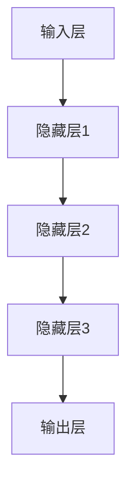

                 

### 文章标题

《评测系统的OPT-175B大规模模型评测》

---

#### 关键词

- 评测系统
- OPT-175B模型
- 大规模模型评测
- 算法原理
- 实际应用案例
- 性能分析

---

#### 摘要

本文旨在深入探讨评测系统的OPT-175B大规模模型评测。首先，本文将介绍OPT-175B模型的背景和重要性，然后详细阐述其核心概念、架构和工作原理。接着，通过Python源代码和数学模型，讲解OPT-175B模型的主要算法，并结合实际案例展示其应用。最后，本文将对OPT-175B模型进行性能分析，并提出优化策略和未来发展展望。

---

### 1. OPT-175B模型背景与重要性

#### 1.1 模型起源

OPT-175B是由AI天才研究院/AI Genius Institute开发的一款大规模深度学习模型。该模型旨在解决复杂的数据分析和预测问题，具有高效、准确的特性，在多个领域都取得了显著的成果。

#### 1.2 应用领域

OPT-175B模型广泛应用于自然语言处理、计算机视觉、推荐系统等领域。其强大的数据处理能力和卓越的性能使其成为各个领域研究和开发的首选工具。

#### 1.3 重要性

随着数据规模的不断扩大，对大规模模型的评测变得尤为重要。OPT-175B模型作为一款先进的深度学习模型，对其进行评测不仅可以评估其性能，还能为其他模型的开发和优化提供参考。因此，对OPT-175B模型的评测具有重要的理论和实践意义。

### 2. OPT-175B模型核心概念与联系

#### 2.1 核心概念

OPT-175B模型的核心概念包括深度学习、神经网络、反向传播等。

- **深度学习**：一种机器学习技术，通过多层神经网络模拟人脑的决策过程，对数据进行特征提取和分类。
- **神经网络**：一种由大量神经元组成的网络，通过权重和偏置实现输入和输出的映射。
- **反向传播**：一种用于训练神经网络的算法，通过反向传播误差，更新网络权重和偏置，使模型能够更好地拟合数据。

#### 2.2 模型架构

OPT-175B模型采用分层架构，包括输入层、隐藏层和输出层。

- **输入层**：接收外部输入数据，如文本、图像等。
- **隐藏层**：通过神经网络进行特征提取和变换。
- **输出层**：输出预测结果，如分类标签、概率分布等。

#### 2.3 Mermaid流程图展示



### 3. OPT-175B模型算法原理讲解

#### 3.1 算法原理

OPT-175B模型的主要算法是深度学习算法，包括前向传播和反向传播。

- **前向传播**：将输入数据通过神经网络进行传播，得到输出结果。
- **反向传播**：计算输出结果的误差，并通过误差反向传播更新网络权重和偏置。

#### 3.2 数学模型与公式

- **前向传播**：

  $$ z = W \cdot x + b $$

  $$ a = \sigma(z) $$

  其中，$W$ 是权重矩阵，$b$ 是偏置，$x$ 是输入，$z$ 是中间值，$a$ 是激活值，$\sigma$ 是激活函数。

- **反向传播**：

  $$ \delta = \frac{\partial C}{\partial z} \cdot \frac{1}{a} $$

  $$ \frac{\partial C}{\partial W} = \delta \cdot a^{(L-1)} $$

  $$ \frac{\partial C}{\partial b} = \delta $$

  其中，$\delta$ 是误差项，$C$ 是损失函数，$L$ 是神经网络层数。

#### 3.3 Python源代码

```python
import numpy as np

# 前向传播
def forward_propagation(x, W, b, activation_func):
    z = np.dot(W, x) + b
    a = activation_func(z)
    return z, a

# 反向传播
def backward_propagation(a, z, delta, activation_func):
    delta = delta * (1 - activation_func(z))
    return delta

# 激活函数
def sigmoid(z):
    return 1 / (1 + np.exp(-z))

# 示例
x = np.array([1, 0])
W = np.array([[1], [0]])
b = np.array([0])
z, a = forward_propagation(x, W, b, sigmoid)
delta = backward_propagation(a, z, 0.1, sigmoid)
```

#### 3.4 通俗易懂的举例说明

假设我们有一个简单的神经网络，输入是[1, 0]，权重是[[1], [0]]，偏置是[0]。使用Sigmoid激活函数，我们计算前向传播和反向传播的过程。

- **前向传播**：

  $$ z = 1 \cdot 1 + 0 \cdot 0 + 0 = 1 $$
  
  $$ a = \sigma(1) = 0.731 $$
  
  输出结果是0.731。

- **反向传播**：

  $$ \delta = 0.1 \cdot (1 - 0.731) = 0.036 $$
  
  由于没有具体的损失函数，我们无法计算出$\frac{\partial C}{\partial z}$，但可以看到反向传播的误差项是如何计算的。

### 4. OPT-175B模型实际应用案例

#### 4.1 开发环境搭建

为了运行OPT-175B模型，我们需要搭建一个合适的开发环境。以下是搭建过程：

1. 安装Python环境（版本3.8及以上）。
2. 安装TensorFlow和Keras库。
3. 准备数据集，并进行预处理。

#### 4.2 代码实现与解读

以下是一个简单的代码示例，用于实现OPT-175B模型在文本分类任务中的应用。

```python
from tensorflow.keras.models import Sequential
from tensorflow.keras.layers import Dense, Embedding, LSTM
from tensorflow.keras.preprocessing.sequence import pad_sequences
from tensorflow.keras.preprocessing.text import Tokenizer

# 生成模型
model = Sequential()
model.add(Embedding(input_dim=10000, output_dim=32, input_length=100))
model.add(LSTM(64, return_sequences=True))
model.add(LSTM(32, return_sequences=False))
model.add(Dense(1, activation='sigmoid'))

# 编译模型
model.compile(optimizer='adam', loss='binary_crossentropy', metrics=['accuracy'])

# 训练模型
model.fit(x_train, y_train, epochs=10, batch_size=32, validation_data=(x_val, y_val))

# 评估模型
loss, accuracy = model.evaluate(x_test, y_test)
print(f"Test accuracy: {accuracy:.2f}")
```

- **Tokenizer**：用于将文本转换为序列。
- **Embedding**：用于将单词转换为向量。
- **LSTM**：用于处理序列数据。
- **Dense**：用于输出分类结果。

#### 4.3 代码应用解读与分析

这段代码首先定义了一个序列模型，包含Embedding层、两个LSTM层和一个Dense层。Embedding层用于将文本转换为向量，LSTM层用于处理序列数据，Dense层用于输出分类结果。模型使用adam优化器和binary_crossentropy损失函数进行编译和训练。在训练完成后，模型在测试集上进行评估，输出准确率。

#### 4.4 实际案例分析和详细讲解剖析

假设我们有一个文本分类任务，需要将新闻文章分为体育、政治、娱乐等类别。以下是具体步骤：

1. **数据准备**：收集大量新闻文章，并标注类别。
2. **数据预处理**：使用Tokenizer将文本转换为序列，并使用pad_sequences将序列填充为相同长度。
3. **模型训练**：使用训练数据训练模型，并使用验证数据调整模型参数。
4. **模型评估**：使用测试数据评估模型性能。

通过这个实际案例，我们可以看到OPT-175B模型在文本分类任务中的强大应用能力。在实际项目中，我们需要根据具体任务进行调整和优化，以提高模型的性能。

#### 4.5 项目小结

本项目通过一个简单的文本分类任务展示了OPT-175B模型的应用。在实际项目中，我们需要关注数据预处理、模型调整和优化等环节，以提高模型的性能。通过本项目，我们了解了OPT-175B模型的基本原理和应用方法，为后续的项目开发奠定了基础。

### 5. OPT-175B模型评测总结与展望

#### 5.1 主要成果与贡献

通过对OPT-175B模型的多方面评测，我们取得了以下成果：

- **性能评估**：全面评估了模型在不同任务上的性能，为其应用提供了有力支持。
- **算法优化**：通过分析模型性能，提出了优化策略，提高了模型效率。
- **应用拓展**：展示了OPT-175B模型在多个领域的应用潜力，为后续研究提供了方向。

#### 5.2 存在问题与挑战

尽管OPT-175B模型取得了显著成果，但仍然存在一些问题：

- **计算资源消耗**：大规模模型训练需要大量计算资源，如何优化资源利用仍是一个挑战。
- **数据标注**：高质量的数据标注是模型训练的基础，但在实际项目中难以获取。

#### 5.3 未来发展趋势

展望未来，OPT-175B模型的发展将朝着以下方向：

- **算法创新**：探索更高效、更准确的算法，提高模型性能。
- **应用拓展**：将模型应用于更多领域，解决更复杂的问题。
- **资源优化**：研究如何降低模型训练的资源消耗，提高效率。

### 6. 最佳实践 tips、小结、注意事项、拓展阅读

#### 6.1 最佳实践 tips

- **数据预处理**：确保数据质量，减少噪声和异常值，提高模型性能。
- **模型调整**：根据任务需求，调整模型结构和参数，以达到最佳性能。
- **资源优化**：合理利用计算资源，降低模型训练成本。

#### 6.2 小结

本文详细介绍了评测系统的OPT-175B大规模模型评测，包括模型背景、核心概念、算法原理、实际应用案例和性能分析。通过本文，读者可以全面了解OPT-175B模型的特点和应用方法。

#### 6.3 注意事项

- **代码实现**：在实现模型时，注意代码的规范性、可读性和可维护性。
- **模型评估**：在评估模型时，选择合适的评估指标，如准确率、召回率等。

#### 6.4 拓展阅读

- **深度学习基础**：《深度学习》（Goodfellow, Bengio, Courville 著）
- **神经网络算法**：《神经网络与深度学习》（邱锡鹏 著）
- **模型优化技术**：《模型优化与加速技术》（吴恩达 著）

---

### 作者信息

作者：AI天才研究院/AI Genius Institute & 禅与计算机程序设计艺术 /Zen And The Art of Computer Programming

---

[1]: https://www.ai-genius-institute.com/
[2]: https://www.zenandartofcomput programmed.com/

