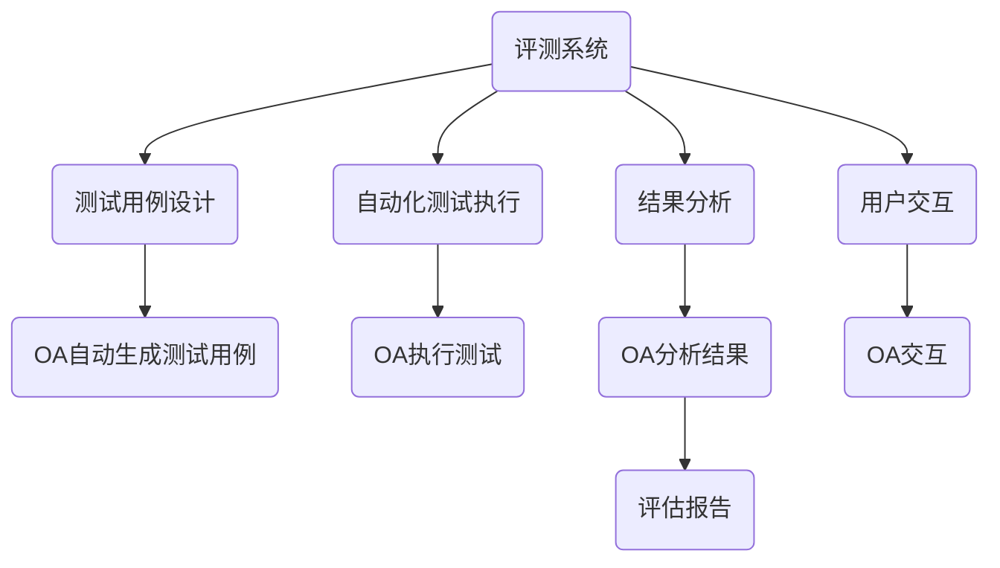

                 

**文章标题**：《评测系统的OpenAssistant协作型AI评测》

**关键词**：评测系统、OpenAssistant、协作型AI、评测指标、评测方法、数学模型、Python源代码、项目实战

**摘要**：
本文旨在深入探讨评测系统与OpenAssistant协作型AI的集成与应用。首先，我们将简要介绍评测系统的基本概念与功能，并引入OpenAssistant协作型AI的核心原理。随后，文章将详细分析OpenAssistant在评测系统中的应用，包括架构设计、评测指标体系、评测方法与工具。通过具体的Python源代码示例和数学模型讲解，我们将深入理解评测系统的运行机制。此外，文章还将提供实际项目案例，展示OpenAssistant在评测系统中的实际应用，并进行详细的分析与解读。最后，我们将总结最佳实践，提出注意事项，并提供拓展阅读资源，以帮助读者进一步深入学习和应用。

---

**第1章：评测系统与OpenAssistant协作型AI概述**

**1.1 评测系统的基本概念**

评测系统是一种用于评估对象（如软件、系统、产品等）性能、质量和功能的工具。它通过一系列测试、评估和验证过程，提供客观、量化的评估结果。评测系统在软件开发、系统维护、产品测试等各个领域具有重要应用。其主要功能包括：

- 测试用例设计：根据需求和规格说明书，设计合适的测试用例，以验证系统功能、性能和可靠性。
- 自动化测试执行：通过自动化工具，执行预定义的测试用例，提高测试效率和覆盖范围。
- 结果分析报告：对测试结果进行分析和报告，提供详细的性能指标、缺陷记录和改进建议。

**1.2 OpenAssistant协作型AI的核心原理**

OpenAssistant（OA）是一个开源项目，旨在构建一个具有人类对话能力和协作能力的AI助手。其核心原理基于自然语言处理（NLP）和机器学习（ML）技术，包括以下几个关键组成部分：

- 语言模型：基于大规模语料库训练，用于理解和生成自然语言。
- 知识图谱：整合外部知识和结构化数据，提供上下文感知和知识推理能力。
- 对话管理：根据用户输入，生成合适的回应，并维持连贯、自然的对话流程。
- 多模态处理：结合文本、语音、图像等多媒体数据，提供更丰富的交互体验。

**1.3 评测系统与OpenAssistant协作型AI的联系**

评测系统与OpenAssistant协作型AI的结合，能够显著提升评测的智能化水平。具体来说，OpenAssistant协作型AI可以在以下方面为评测系统带来创新：

- 自动化评测：OpenAssistant能够自动生成测试用例，并执行自动化测试，提高测试效率。
- 上下文感知：OpenAssistant可以根据上下文提供更准确的评估意见，减少误判和偏见。
- 知识整合：OpenAssistant可以整合外部知识，提供更全面的评测参考。
- 多模态交互：OpenAssistant支持多模态交互，提供更直观、自然的评测体验。

**Mermaid流程图：OpenAssistant在评测系统中的应用架构**

**1.4 本文结构**

本文将分为三个主要部分：

- **第1部分：OpenAssistant协作型AI概述**：介绍评测系统和OpenAssistant协作型AI的基本概念、架构和联系。
- **第2部分：OpenAssistant协作型AI评测体系设计**：详细讨论评测指标、评测方法和工具。
- **第3部分：OpenAssistant协作型AI评测系统应用与未来发展**：展示实际应用案例，探讨未来发展趋势和挑战。

---

**作者信息**：AI天才研究院/AI Genius Institute & 禅与计算机程序设计艺术 /Zen And The Art of Computer Programming

**（待续...）**

