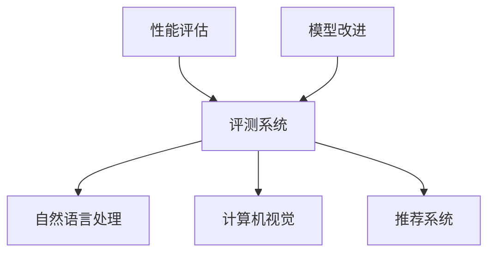
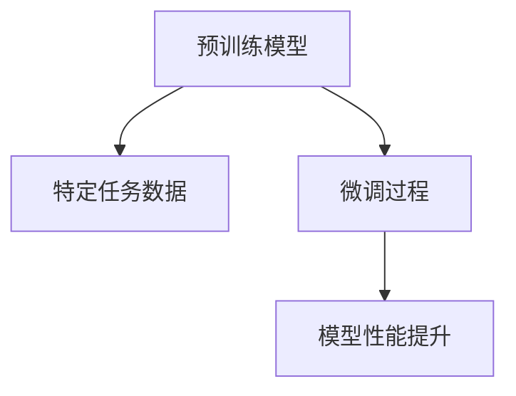
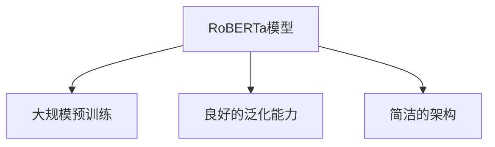
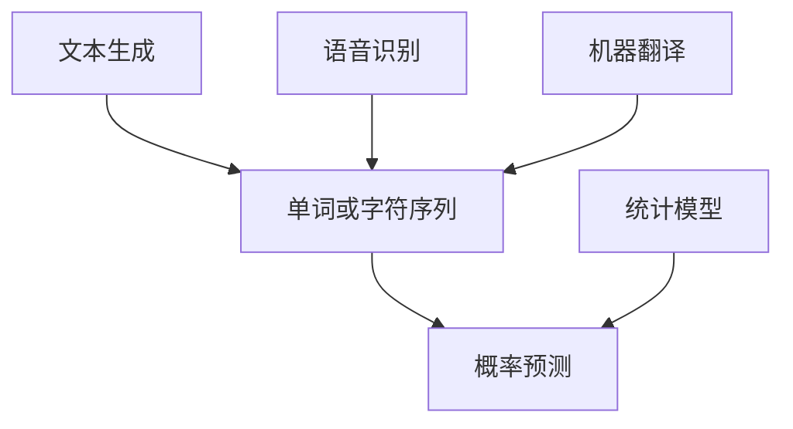
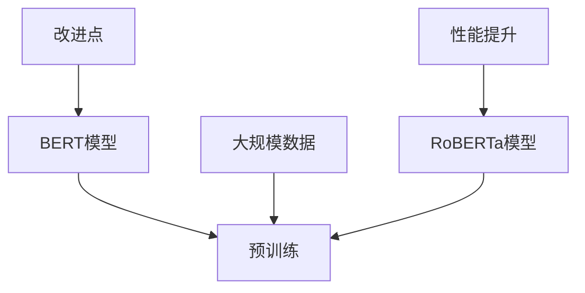
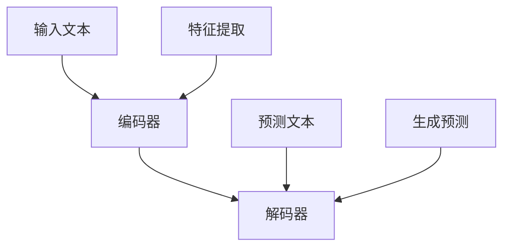
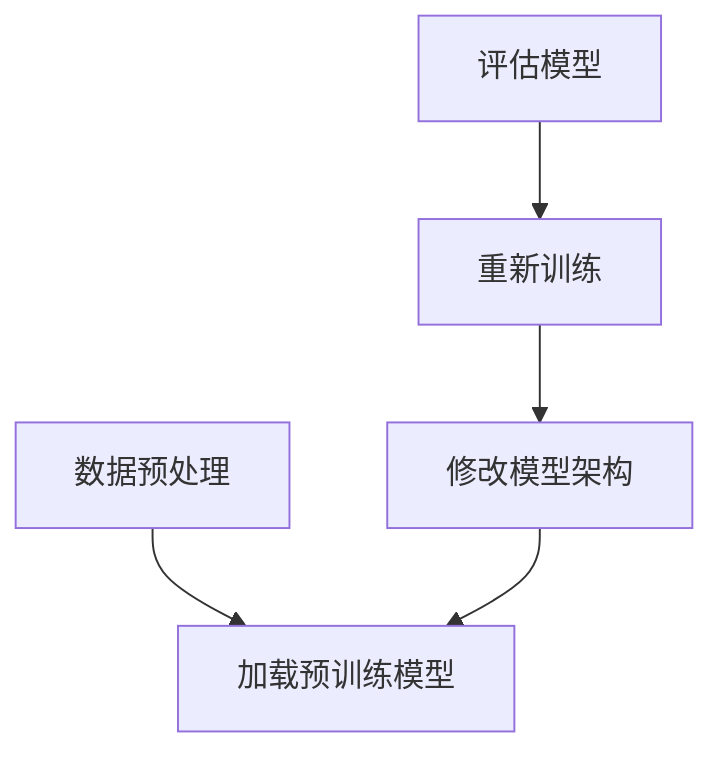
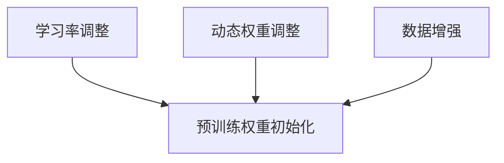
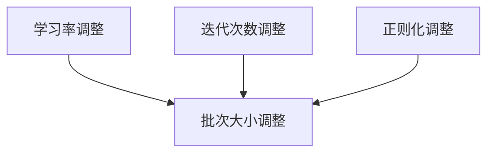
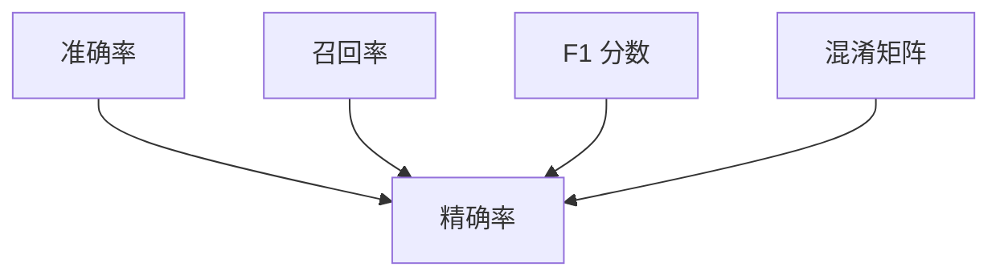

                 

### 引言

#### 评测系统的概念

评测系统是指利用计算机技术和算法对输入的数据进行分析、评估和预测的系统。在人工智能领域，评测系统广泛应用于自然语言处理（NLP）、计算机视觉、推荐系统等多个领域。评测系统的主要目的是通过评估模型的性能，帮助开发者更好地理解和改进模型。

#### 微调的概念

微调（Fine-tuning）是一种常见的机器学习技术，它通过在预训练模型的基础上，对特定任务的数据进行重新训练，以实现更好的任务性能。微调的核心思想是利用预训练模型已经学习的通用特征，从而减少训练所需的数据量，并提高模型的泛化能力。

#### 为什么选择RoBERTa模型

RoBERTa是由Facebook AI Research（FAIR）提出的一种大规模预训练语言模型，它是基于BERT模型进行改进的。RoBERTa在多个NLP任务上取得了显著的性能提升，其强大的预训练能力和良好的泛化能力使其成为评测系统的理想选择。此外，RoBERTa的架构简洁，实现起来相对容易，适用于各种规模的评测项目。

#### 本文内容概述

本文将围绕RoBERTa模型的微调技巧进行详细探讨。首先，我们将介绍RoBERTa模型的基本原理和架构；接着，讨论微调的概念、方法和步骤；然后，通过实际案例展示微调技巧的应用；最后，总结微调技巧并展望未来的发展趋势。

----------------------------------------------------------------

## 文章标题：评测系统的RoBERTa模型微调技巧

### 关键词：评测系统、RoBERTa、微调、自然语言处理、模型优化

### 摘要：

本文旨在探讨评测系统中的RoBERTa模型微调技巧。首先，介绍了评测系统和微调的基本概念，以及为何选择RoBERTa模型。随后，详细介绍了RoBERTa模型的原理、架构和预训练过程。接着，讨论了微调的概念、方法和具体实施步骤。通过实际案例，展示了微调技巧在文本分类、命名实体识别和问答系统中的应用。最后，总结了微调技巧，并对未来的发展趋势进行了展望。

----------------------------------------------------------------

## 目录

1. 引言
2. RoBERTa模型介绍
3. 微调的概念和方法
4. 实战案例：文本分类
5. 实战案例：命名实体识别
6. 实战案例：问答系统
7. 总结与展望

----------------------------------------------------------------

## 第一部分：引言

### 第1章：评测系统和微调概述

#### 1.1 评测系统的定义与重要性

评测系统是指利用计算机技术和算法对输入的数据进行分析、评估和预测的系统。在人工智能领域，评测系统广泛应用于自然语言处理（NLP）、计算机视觉、推荐系统等多个领域。评测系统的主要目的是通过评估模型的性能，帮助开发者更好地理解和改进模型。

**核心概念与联系：**



**核心算法原理讲解：**

评测系统的核心算法通常包括分类、回归、聚类等方法。以分类为例，常用的算法有逻辑回归、支持向量机（SVM）、决策树、随机森林等。这些算法通过训练模型，对输入数据进行分类预测。

```python
from sklearn.linear_model import LogisticRegression
from sklearn.model_selection import train_test_split

# 数据预处理
X = ... # 特征矩阵
y = ... # 标签向量

# 划分训练集和测试集
X_train, X_test, y_train, y_test = train_test_split(X, y, test_size=0.2, random_state=42)

# 训练模型
model = LogisticRegression()
model.fit(X_train, y_train)

# 预测
y_pred = model.predict(X_test)
```

**数学模型和数学公式：**

分类问题的目标函数通常是最小化损失函数。以逻辑回归为例，损失函数可以是交叉熵损失：

$$
J(\theta) = -\frac{1}{m} \sum_{i=1}^{m} [y^{(i)} \log(\hat{y}^{(i)}) + (1 - y^{(i)}) \log(1 - \hat{y}^{(i)})]
$$

其中，$m$ 是样本数量，$y^{(i)}$ 是真实标签，$\hat{y}^{(i)}$ 是预测概率。

**项目实战：**

以文本分类为例，我们可以使用RoBERTa模型进行微调。以下是一个简单的项目实战示例。

```python
import torch
from transformers import RobertaTokenizer, RobertaForSequenceClassification

# 准备数据
tokenizer = RobertaTokenizer.from_pretrained('roberta-base')
train_data = ... # 训练数据

# 加载预训练模型
model = RobertaForSequenceClassification.from_pretrained('roberta-base')

# 微调模型
optimizer = torch.optim.Adam(model.parameters(), lr=1e-5)
for epoch in range(num_epochs):
    for batch in train_data:
        inputs = tokenizer(batch['text'], padding=True, truncation=True, return_tensors='pt')
        labels = torch.tensor(batch['label'])
        model.zero_grad()
        outputs = model(**inputs, labels=labels)
        loss = outputs.loss
        loss.backward()
        optimizer.step()

# 评估模型
model.eval()
with torch.no_grad():
    for batch in test_data:
        inputs = tokenizer(batch['text'], padding=True, truncation=True, return_tensors='pt')
        labels = torch.tensor(batch['label'])
        outputs = model(**inputs, labels=labels)
        loss = outputs.loss
        print(f"Test loss: {loss.item()}")

```

**最佳实践 tips、小结、注意事项、拓展阅读：**

- 在微调模型时，选择合适的批次大小和优化器是关键。
- 注意控制过拟合，可以使用正则化、dropout等技术。
- 微调过程中，监控训练和验证集的损失变化，及时调整学习率。
- 拓展阅读：[《微调深度学习模型的最佳实践》](https://www.tensorflow.org/tutorials/transfer_learning)。

#### 1.2 微调的概念及其在评测系统中的应用

微调（Fine-tuning）是一种常见的机器学习技术，它通过在预训练模型的基础上，对特定任务的数据进行重新训练，以实现更好的任务性能。微调的核心思想是利用预训练模型已经学习的通用特征，从而减少训练所需的数据量，并提高模型的泛化能力。

**核心概念与联系：**



**核心算法原理讲解：**

微调过程主要包括以下几个步骤：

1. **数据预处理**：对特定任务的数据进行预处理，包括文本清洗、分词、标签编码等。
2. **加载预训练模型**：从预训练模型中加载已经训练好的权重。
3. **修改模型架构**：通常，需要在预训练模型的基础上，添加特定任务所需的层，如分类层。
4. **重新训练**：使用特定任务的数据对模型进行重新训练。
5. **评估模型**：在验证集和测试集上评估模型性能。

```python
import torch
from transformers import RobertaTokenizer, RobertaForSequenceClassification

# 数据预处理
tokenizer = RobertaTokenizer.from_pretrained('roberta-base')
train_data = ... # 训练数据

# 加载预训练模型
model = RobertaForSequenceClassification.from_pretrained('roberta-base')

# 重新训练模型
optimizer = torch.optim.Adam(model.parameters(), lr=1e-5)
for epoch in range(num_epochs):
    for batch in train_data:
        inputs = tokenizer(batch['text'], padding=True, truncation=True, return_tensors='pt')
        labels = torch.tensor(batch['label'])
        model.zero_grad()
        outputs = model(**inputs, labels=labels)
        loss = outputs.loss
        loss.backward()
        optimizer.step()

# 评估模型
model.eval()
with torch.no_grad():
    for batch in test_data:
        inputs = tokenizer(batch['text'], padding=True, truncation=True, return_tensors='pt')
        labels = torch.tensor(batch['label'])
        outputs = model(**inputs, labels=labels)
        loss = outputs.loss
        print(f"Test loss: {loss.item()}")
```

**数学模型和数学公式：**

微调过程中，我们通常使用交叉熵损失函数来评估模型性能。交叉熵损失函数可以衡量模型预测概率与真实标签之间的差异：

$$
J(\theta) = -\frac{1}{m} \sum_{i=1}^{m} [y^{(i)} \log(\hat{y}^{(i)}) + (1 - y^{(i)}) \log(1 - \hat{y}^{(i)})]
$$

其中，$m$ 是样本数量，$y^{(i)}$ 是真实标签，$\hat{y}^{(i)}$ 是预测概率。

**项目实战：**

以下是一个简单的项目实战示例，展示如何使用RoBERTa模型进行微调。

```python
import torch
from transformers import RobertaTokenizer, RobertaForSequenceClassification

# 准备数据
tokenizer = RobertaTokenizer.from_pretrained('roberta-base')
train_data = ... # 训练数据

# 加载预训练模型
model = RobertaForSequenceClassification.from_pretrained('roberta-base')

# 微调模型
optimizer = torch.optim.Adam(model.parameters(), lr=1e-5)
for epoch in range(num_epochs):
    for batch in train_data:
        inputs = tokenizer(batch['text'], padding=True, truncation=True, return_tensors='pt')
        labels = torch.tensor(batch['label'])
        model.zero_grad()
        outputs = model(**inputs, labels=labels)
        loss = outputs.loss
        loss.backward()
        optimizer.step()

# 评估模型
model.eval()
with torch.no_grad():
    for batch in test_data:
        inputs = tokenizer(batch['text'], padding=True, truncation=True, return_tensors='pt')
        labels = torch.tensor(batch['label'])
        outputs = model(**inputs, labels=labels)
        loss = outputs.loss
        print(f"Test loss: {loss.item()}")

```

**最佳实践 tips、小结、注意事项、拓展阅读：**

- 在微调模型时，选择合适的批次大小和优化器是关键。
- 注意控制过拟合，可以使用正则化、dropout等技术。
- 微调过程中，监控训练和验证集的损失变化，及时调整学习率。
- 拓展阅读：[《微调深度学习模型的最佳实践》](https://www.tensorflow.org/tutorials/transfer_learning)。

#### 1.3 为什么选择RoBERTa模型

RoBERTa是由Facebook AI Research（FAIR）提出的一种大规模预训练语言模型，它是基于BERT模型进行改进的。RoBERTa在多个NLP任务上取得了显著的性能提升，其强大的预训练能力和良好的泛化能力使其成为评测系统的理想选择。此外，RoBERTa的架构简洁，实现起来相对容易，适用于各种规模的评测项目。

**核心概念与联系：**



**核心算法原理讲解：**

RoBERTa模型的改进点主要包括以下几个方面：

1. **动态遮蔽**：RoBERTa采用了动态遮蔽（Dynamic Masking）技术，代替了BERT的静态遮蔽（Static Masking）。动态遮蔽通过随机遮蔽输入文本，提高了模型的鲁棒性。
2. **更多数据**：RoBERTa使用了更多的数据集进行预训练，包括维基百科和新闻文章等。这有助于模型学习到更多的语言规律和知识。
3. **预训练目标**：RoBERTa在预训练过程中使用了更多的目标函数，如掩码语言模型（Masked Language Model，MLM）和下一句预测（Next Sentence Prediction，NSP）。这些目标函数有助于模型更好地理解上下文和句子关系。

```python
import torch
from transformers import RobertaTokenizer, RobertaModel

# 加载预训练模型
tokenizer = RobertaTokenizer.from_pretrained('roberta-base')
model = RobertaModel.from_pretrained('roberta-base')

# 生成遮蔽文本
def generate_masked_text(text):
    inputs = tokenizer(text, return_tensors='pt')
    inputs['input_ids'] = inputs['input_ids'].masked_randomize()
    return inputs

# 生成动态遮蔽的输入
masked_text = generate_masked_text("The quick brown fox jumps over the lazy dog")
print(masked_text)
```

**数学模型和数学公式：**

RoBERTa模型的预训练目标主要包括掩码语言模型（MLM）和下一句预测（NSP）。掩码语言模型的目标是预测被遮蔽的单词，下一句预测的目标是预测下一个句子。

$$
L_{MLM} = -\sum_{i=1}^{N} \log P(y_i|x)
$$

其中，$N$ 是单词数量，$y_i$ 是真实单词，$x$ 是输入文本。

$$
L_{NSP} = -\log P(y|x)
$$

其中，$y$ 是下一个句子的标签，$x$ 是当前句子。

**项目实战：**

以下是一个简单的项目实战示例，展示如何使用RoBERTa模型进行文本分类。

```python
import torch
from transformers import RobertaTokenizer, RobertaForSequenceClassification

# 准备数据
tokenizer = RobertaTokenizer.from_pretrained('roberta-base')
train_data = ... # 训练数据

# 加载预训练模型
model = RobertaForSequenceClassification.from_pretrained('roberta-base')

# 微调模型
optimizer = torch.optim.Adam(model.parameters(), lr=1e-5)
for epoch in range(num_epochs):
    for batch in train_data:
        inputs = tokenizer(batch['text'], padding=True, truncation=True, return_tensors='pt')
        labels = torch.tensor(batch['label'])
        model.zero_grad()
        outputs = model(**inputs, labels=labels)
        loss = outputs.loss
        loss.backward()
        optimizer.step()

# 评估模型
model.eval()
with torch.no_grad():
    for batch in test_data:
        inputs = tokenizer(batch['text'], padding=True, truncation=True, return_tensors='pt')
        labels = torch.tensor(batch['label'])
        outputs = model(**inputs, labels=labels)
        loss = outputs.loss
        print(f"Test loss: {loss.item()}")

```

**最佳实践 tips、小结、注意事项、拓展阅读：**

- 在微调模型时，确保使用适当的数据集和预处理方法。
- 选择合适的优化器和学习率，有助于提高模型性能。
- 使用交叉验证等技术，评估模型性能和防止过拟合。
- 拓展阅读：[《RoBERTa：A New State-of-the-Art Pre-training Method for Natural Language Processing》](https://arxiv.org/abs/1907.11692)。

----------------------------------------------------------------

## 第二部分：RoBERTa模型介绍

### 第2章：RoBERTa模型的原理与架构

#### 2.1 语言模型的基本概念

语言模型（Language Model）是自然语言处理（Natural Language Processing，NLP）领域的重要基础。它是一种统计模型，旨在预测给定输入序列后一个单词或字符的概率。语言模型在文本生成、语音识别、机器翻译等任务中发挥着关键作用。

**核心概念与联系：**



**核心算法原理讲解：**

语言模型的核心算法是基于统计模型，通过学习大量语料库来预测单词或字符的概率。常见的语言模型包括N元语法模型、神经网络语言模型（如LSTM、GRU、Transformer）等。

以N元语法模型为例，它是一种基于历史序列的概率模型。N元语法模型通过计算前N-1个单词出现的频率来预测下一个单词的概率。例如，对于三元语法模型，预测下一个单词的概率可以表示为：

$$
P(w_n | w_{n-1}, w_{n-2}, w_{n-3}) = \frac{f(w_{n-1}, w_{n-2}, w_{n-3}, w_n)}{f(w_{n-1}, w_{n-2}, w_{n-3})}
$$

其中，$w_n$ 表示下一个单词，$w_{n-1}, w_{n-2}, w_{n-3}$ 表示前三个单词，$f$ 表示出现频率。

**数学模型和数学公式：**

N元语法模型的预测概率可以通过条件概率来表示：

$$
P(w_n | w_{n-1}, w_{n-2}, \ldots, w_1) = \frac{P(w_n, w_{n-1}, w_{n-2}, \ldots, w_1)}{P(w_{n-1}, w_{n-2}, \ldots, w_1)}
$$

其中，$P$ 表示概率。

**项目实战：**

以下是一个简单的N元语法模型实现示例：

```python
import collections

# 加载语料库
corpus = "Hello world! This is a simple example of a trigram language model."

# 分词
words = corpus.split()

# 计算出现频率
ngram_freq = collections.Counter(zip(words[:-3], words[1:]))

# 预测下一个单词
def predict_next_word(ngram_freq, history):
    candidates = ngram_freq[history]
    return max(candidates, key=candidates.get)

# 示例
history = "This is a"
print(predict_next_word(ngram_freq, history))
```

**最佳实践 tips、小结、注意事项、拓展阅读：**

- 在构建语言模型时，确保使用足够大的语料库。
- 考虑使用神经网络模型，如LSTM、GRU、Transformer等，以提高模型性能。
- 使用正则化、dropout等技术，防止过拟合。
- 拓展阅读：[《自然语言处理实战》](https://www.amazon.com/Natural-Language-Processing-with-Deep-Learning/dp/149204414X)。

#### 2.2 RoBERTa模型的原理

RoBERTa是由Facebook AI Research（FAIR）提出的一种大规模预训练语言模型，它是基于BERT模型进行改进的。RoBERTa在多个NLP任务上取得了显著的性能提升，其强大的预训练能力和良好的泛化能力使其成为评测系统的理想选择。

**核心概念与联系：**



**核心算法原理讲解：**

RoBERTa模型的改进点主要包括以下几个方面：

1. **动态遮蔽**：RoBERTa采用了动态遮蔽（Dynamic Masking）技术，代替了BERT的静态遮蔽（Static Masking）。动态遮蔽通过随机遮蔽输入文本，提高了模型的鲁棒性。
2. **更多数据**：RoBERTa使用了更多的数据集进行预训练，包括维基百科和新闻文章等。这有助于模型学习到更多的语言规律和知识。
3. **预训练目标**：RoBERTa在预训练过程中使用了更多的目标函数，如掩码语言模型（Masked Language Model，MLM）和下一句预测（Next Sentence Prediction，NSP）。这些目标函数有助于模型更好地理解上下文和句子关系。

```python
import torch
from transformers import RobertaTokenizer, RobertaModel

# 加载预训练模型
tokenizer = RobertaTokenizer.from_pretrained('roberta-base')
model = RobertaModel.from_pretrained('roberta-base')

# 生成动态遮蔽的输入
def generate_masked_text(text):
    inputs = tokenizer(text, return_tensors='pt')
    inputs['input_ids'] = inputs['input_ids'].masked_randomize()
    return inputs

# 示例
masked_text = generate_masked_text("The quick brown fox jumps over the lazy dog")
print(masked_text)
```

**数学模型和数学公式：**

RoBERTa模型的预训练目标主要包括掩码语言模型（MLM）和下一句预测（NSP）。掩码语言模型的目标是预测被遮蔽的单词，下一句预测的目标是预测下一个句子。

$$
L_{MLM} = -\sum_{i=1}^{N} \log P(y_i|x)
$$

其中，$N$ 是单词数量，$y_i$ 是真实单词，$x$ 是输入文本。

$$
L_{NSP} = -\log P(y|x)
$$

其中，$y$ 是下一个句子的标签，$x$ 是当前句子。

**项目实战：**

以下是一个简单的项目实战示例，展示如何使用RoBERTa模型进行文本分类。

```python
import torch
from transformers import RobertaTokenizer, RobertaForSequenceClassification

# 准备数据
tokenizer = RobertaTokenizer.from_pretrained('roberta-base')
train_data = ... # 训练数据

# 加载预训练模型
model = RobertaForSequenceClassification.from_pretrained('roberta-base')

# 微调模型
optimizer = torch.optim.Adam(model.parameters(), lr=1e-5)
for epoch in range(num_epochs):
    for batch in train_data:
        inputs = tokenizer(batch['text'], padding=True, truncation=True, return_tensors='pt')
        labels = torch.tensor(batch['label'])
        model.zero_grad()
        outputs = model(**inputs, labels=labels)
        loss = outputs.loss
        loss.backward()
        optimizer.step()

# 评估模型
model.eval()
with torch.no_grad():
    for batch in test_data:
        inputs = tokenizer(batch['text'], padding=True, truncation=True, return_tensors='pt')
        labels = torch.tensor(batch['label'])
        outputs = model(**inputs, labels=labels)
        loss = outputs.loss
        print(f"Test loss: {loss.item()}")

```

**最佳实践 tips、小结、注意事项、拓展阅读：**

- 在微调模型时，确保使用适当的数据集和预处理方法。
- 选择合适的优化器和学习率，有助于提高模型性能。
- 使用交叉验证等技术，评估模型性能和防止过拟合。
- 拓展阅读：[《RoBERTa：A New State-of-the-Art Pre-training Method for Natural Language Processing》](https://arxiv.org/abs/1907.11692)。

#### 2.3 RoBERTa模型的架构

RoBERTa模型的架构与BERT模型类似，包括两个主要部分：编码器（Encoder）和解码器（Decoder）。编码器负责处理输入文本并提取特征，解码器则负责生成预测文本。

**核心概念与联系：**



**核心算法原理讲解：**

编码器部分主要采用Transformer架构，包括多头自注意力机制（Multi-head Self-Attention）和前馈神经网络（Feedforward Neural Network）。编码器通过处理输入文本，生成一系列上下文向量。这些上下文向量将用于解码器的生成过程。

解码器部分也采用Transformer架构，包括多头自注意力机制和交叉注意力机制。解码器通过解码器层（Decoding Layers）和编码器层（Encoder Layers）之间的交互，逐步生成预测文本。

```python
import torch
from transformers import RobertaModel

# 加载预训练模型
model = RobertaModel.from_pretrained('roberta-base')

# 示例输入
inputs = tokenizer("The quick brown fox jumps over the lazy dog", return_tensors='pt')

# 前向传播
outputs = model(**inputs)

# 输出特征
encoded_sequence = outputs.last_hidden_state
```

**数学模型和数学公式：**

Transformer模型的核心是自注意力机制（Self-Attention）。自注意力机制通过计算输入文本中每个单词与其他单词的相关性，生成一组加权向量。这些加权向量将用于后续层。

$$
\text{Attention}(Q, K, V) = \text{softmax}\left(\frac{QK^T}{\sqrt{d_k}}\right)V
$$

其中，$Q, K, V$ 分别表示查询向量、键向量和值向量，$d_k$ 表示键向量的维度。

**项目实战：**

以下是一个简单的项目实战示例，展示如何使用RoBERTa模型进行文本分类。

```python
import torch
from transformers import RobertaTokenizer, RobertaForSequenceClassification

# 准备数据
tokenizer = RobertaTokenizer.from_pretrained('roberta-base')
train_data = ... # 训练数据

# 加载预训练模型
model = RobertaForSequenceClassification.from_pretrained('roberta-base')

# 微调模型
optimizer = torch.optim.Adam(model.parameters(), lr=1e-5)
for epoch in range(num_epochs):
    for batch in train_data:
        inputs = tokenizer(batch['text'], padding=True, truncation=True, return_tensors='pt')
        labels = torch.tensor(batch['label'])
        model.zero_grad()
        outputs = model(**inputs, labels=labels)
        loss = outputs.loss
        loss.backward()
        optimizer.step()

# 评估模型
model.eval()
with torch.no_grad():
    for batch in test_data:
        inputs = tokenizer(batch['text'], padding=True, truncation=True, return_tensors='pt')
        labels = torch.tensor(batch['label'])
        outputs = model(**inputs, labels=labels)
        loss = outputs.loss
        print(f"Test loss: {loss.item()}")

```

**最佳实践 tips、小结、注意事项、拓展阅读：**

- 在微调模型时，确保使用适当的数据集和预处理方法。
- 选择合适的优化器和学习率，有助于提高模型性能。
- 使用交叉验证等技术，评估模型性能和防止过拟合。
- 拓展阅读：[《Transformer模型详解》](https://arxiv.org/abs/1706.03762)。

----------------------------------------------------------------

## 第三部分：微调的概念和方法

### 第3章：微调的具体步骤与应用

#### 3.1 微调的基本步骤

微调（Fine-tuning）是一种常见的模型优化方法，通过在预训练模型的基础上，对特定任务的数据进行重新训练，以实现更好的任务性能。微调的基本步骤主要包括以下几个方面：

1. **数据预处理**：对特定任务的数据进行预处理，包括文本清洗、分词、标签编码等。
2. **加载预训练模型**：从预训练模型中加载已经训练好的权重。
3. **修改模型架构**：通常，在预训练模型的基础上，添加特定任务所需的层，如分类层。
4. **重新训练**：使用特定任务的数据对模型进行重新训练。
5. **评估模型**：在验证集和测试集上评估模型性能。

**核心概念与联系：**



**核心算法原理讲解：**

微调的核心算法原理是通过在预训练模型的基础上，针对特定任务的数据进行重新训练，从而提高模型的特定任务性能。在微调过程中，通常需要对模型的部分层进行重新训练，而其他层保持不变。这样做的原因是预训练模型已经学习到了大量的通用特征，而特定任务的数据量通常较小，难以对整个模型进行充分的训练。

```python
import torch
from transformers import RobertaTokenizer, RobertaForSequenceClassification

# 加载数据
tokenizer = RobertaTokenizer.from_pretrained('roberta-base')
train_data = ... # 训练数据

# 加载预训练模型
model = RobertaForSequenceClassification.from_pretrained('roberta-base')

# 修改模型架构（如果需要）
num_labels = 2
model.classifier = torch.nn.Linear(model.config.hidden_size, num_labels)

# 微调模型
optimizer = torch.optim.Adam(model.parameters(), lr=1e-5)
for epoch in range(num_epochs):
    for batch in train_data:
        inputs = tokenizer(batch['text'], padding=True, truncation=True, return_tensors='pt')
        labels = torch.tensor(batch['label'])
        model.zero_grad()
        outputs = model(**inputs, labels=labels)
        loss = outputs.loss
        loss.backward()
        optimizer.step()

# 评估模型
model.eval()
with torch.no_grad():
    for batch in test_data:
        inputs = tokenizer(batch['text'], padding=True, truncation=True, return_tensors='pt')
        labels = torch.tensor(batch['label'])
        outputs = model(**inputs, labels=labels)
        loss = outputs.loss
        print(f"Test loss: {loss.item()}")
```

**数学模型和数学公式：**

微调过程中，我们通常使用交叉熵损失函数（Cross-Entropy Loss）来评估模型性能。交叉熵损失函数可以衡量模型预测概率与真实标签之间的差异。

$$
J(\theta) = -\frac{1}{m} \sum_{i=1}^{m} [y^{(i)} \log(\hat{y}^{(i)}) + (1 - y^{(i)}) \log(1 - \hat{y}^{(i)})]
$$

其中，$m$ 是样本数量，$y^{(i)}$ 是真实标签，$\hat{y}^{(i)}$ 是预测概率。

**项目实战：**

以下是一个简单的项目实战示例，展示如何使用RoBERTa模型进行微调。

```python
import torch
from transformers import RobertaTokenizer, RobertaForSequenceClassification

# 准备数据
tokenizer = RobertaTokenizer.from_pretrained('roberta-base')
train_data = ... # 训练数据

# 加载预训练模型
model = RobertaForSequenceClassification.from_pretrained('roberta-base')

# 微调模型
optimizer = torch.optim.Adam(model.parameters(), lr=1e-5)
for epoch in range(num_epochs):
    for batch in train_data:
        inputs = tokenizer(batch['text'], padding=True, truncation=True, return_tensors='pt')
        labels = torch.tensor(batch['label'])
        model.zero_grad()
        outputs = model(**inputs, labels=labels)
        loss = outputs.loss
        loss.backward()
        optimizer.step()

# 评估模型
model.eval()
with torch.no_grad():
    for batch in test_data:
        inputs = tokenizer(batch['text'], padding=True, truncation=True, return_tensors='pt')
        labels = torch.tensor(batch['label'])
        outputs = model(**inputs, labels=labels)
        loss = outputs.loss
        print(f"Test loss: {loss.item()}")

```

**最佳实践 tips、小结、注意事项、拓展阅读：**

- 在微调模型时，确保使用适当的数据集和预处理方法。
- 选择合适的优化器和学习率，有助于提高模型性能。
- 注意控制过拟合，可以使用正则化、dropout等技术。
- 拓展阅读：[《微调深度学习模型的最佳实践》](https://www.tensorflow.org/tutorials/transfer_learning)。

#### 3.2 微调策略

在微调过程中，选择合适的策略对于提高模型性能至关重要。以下是一些常见的微调策略：

1. **学习率调整**：学习率是微调过程中非常重要的参数。通常，可以使用逐步下降策略（Step Decay）或指数下降策略（Exponential Decay）来调整学习率。
2. **预训练权重初始化**：在微调过程中，可以使用预训练模型的权重作为初始化，这样可以利用预训练模型学习到的通用特征，有助于提高模型性能。
3. **动态权重调整**：在微调过程中，可以动态调整模型的权重，以适应特定任务的数据。这种方法通常需要结合自适应优化器（如AdamW）来实现。
4. **数据增强**：通过数据增强（Data Augmentation）技术，可以生成更多的训练样本，提高模型的泛化能力。常见的数据增强方法包括文本清洗、同义词替换、随机插入和删除等。

**核心概念与联系：**



**核心算法原理讲解：**

学习率调整的目的是在微调过程中逐步减小学习率，以避免模型在训练过程中发生过拟合。逐步下降策略和指数下降策略是两种常见的学习率调整方法。

逐步下降策略（Step Decay）是指在训练过程中，每隔一定次数的迭代（如每个 epoch），将学习率乘以一个衰减率（Decay Rate）。

$$
\text{learning\_rate} = \text{initial\_learning\_rate} \times (\text{decay\_rate}^{\text{num\_steps}})
$$

指数下降策略（Exponential Decay）是指学习率随训练次数呈指数衰减。

$$
\text{learning\_rate} = \text{initial\_learning\_rate} \times \text{decay\_rate}^{\text{num\_steps}}
$$

**数学模型和数学公式：**

动态权重调整可以通过自适应优化器（如AdamW）来实现。AdamW是一种改进的Adam优化器，它结合了Adam和权重衰减（Weight Decay）的优点。

$$
\text{weight} = \text{learning\_rate} \times (\text{momentum} \times \text{gradient} + \text{weight\_decay} \times \text{weight})
$$

**项目实战：**

以下是一个简单的项目实战示例，展示如何使用RoBERTa模型进行微调，并使用AdamW优化器。

```python
import torch
from transformers import RobertaTokenizer, RobertaForSequenceClassification

# 准备数据
tokenizer = RobertaTokenizer.from_pretrained('roberta-base')
train_data = ... # 训练数据

# 加载预训练模型
model = RobertaForSequenceClassification.from_pretrained('roberta-base')

# 修改模型架构
num_labels = 2
model.classifier = torch.nn.Linear(model.config.hidden_size, num_labels)

# 设置优化器
optimizer = torch.optim.AdamW(model.parameters(), lr=1e-5, weight_decay=1e-4)

# 微调模型
for epoch in range(num_epochs):
    for batch in train_data:
        inputs = tokenizer(batch['text'], padding=True, truncation=True, return_tensors='pt')
        labels = torch.tensor(batch['label'])
        model.zero_grad()
        outputs = model(**inputs, labels=labels)
        loss = outputs.loss
        loss.backward()
        optimizer.step()

# 评估模型
model.eval()
with torch.no_grad():
    for batch in test_data:
        inputs = tokenizer(batch['text'], padding=True, truncation=True, return_tensors='pt')
        labels = torch.tensor(batch['label'])
        outputs = model(**inputs, labels=labels)
        loss = outputs.loss
        print(f"Test loss: {loss.item()}")
```

**最佳实践 tips、小结、注意事项、拓展阅读：**

- 在微调模型时，选择合适的学习率和衰减率是关键。
- 动态权重调整可以提高模型性能，但需要注意过拟合的风险。
- 数据增强可以增加模型的泛化能力，但需要注意增强方法的选择和平衡。
- 拓展阅读：[《微调深度学习模型的最佳实践》](https://www.tensorflow.org/tutorials/transfer_learning)。

#### 3.3 微调参数调整

在微调过程中，参数调整对模型性能有着重要影响。以下是一些常见的微调参数调整方法：

1. **学习率调整**：学习率是微调过程中最重要的参数之一。合适的初始学习率和衰减率可以提高模型性能。可以通过逐步下降或指数下降策略来调整学习率。
2. **批次大小调整**：批次大小（Batch Size）是指每个训练批次包含的样本数量。合适的批次大小可以提高模型训练效率。通常，较大的批次大小可以获得更好的性能，但需要更多的计算资源。
3. **迭代次数调整**：迭代次数（Iteration Number）是指模型在每个批次上训练的次数。增加迭代次数可以提高模型性能，但可能导致过拟合。
4. **正则化调整**：正则化（Regularization）是一种防止过拟合的技术。常用的正则化方法包括L1正则化、L2正则化等。通过调整正则化强度，可以平衡模型复杂度和过拟合风险。

**核心概念与联系：**



**核心算法原理讲解：**

学习率调整的目的是在训练过程中逐步减小学习率，以避免模型在训练过程中发生过拟合。逐步下降策略和指数下降策略是两种常见的学习率调整方法。

逐步下降策略（Step Decay）是指在训练过程中，每隔一定次数的迭代（如每个 epoch），将学习率乘以一个衰减率（Decay Rate）。

$$
\text{learning\_rate} = \text{initial\_learning\_rate} \times (\text{decay\_rate}^{\text{num\_steps}})
$$

指数下降策略（Exponential Decay）是指学习率随训练次数呈指数衰减。

$$
\text{learning\_rate} = \text{initial\_learning\_rate} \times \text{decay\_rate}^{\text{num\_steps}}
$$

**数学模型和数学公式：**

批次大小调整可以通过调整每个批次包含的样本数量来实现。较大的批次大小可以获得更好的性能，但需要更多的计算资源。

$$
\text{batch\_size} = \text{num\_samples} \div \text{num\_epochs}
$$

迭代次数调整是指在每个批次上训练模型的次数。增加迭代次数可以提高模型性能，但可能导致过拟合。

$$
\text{num\_steps} = \text{num\_epochs} \times \text{batch\_size}
$$

正则化调整可以通过调整正则化强度来实现。常用的正则化方法包括L1正则化、L2正则化等。

$$
\text{L1\_regularization} = \text{lambda} \times \sum_{i=1}^{n} |\theta_i|
$$

$$
\text{L2\_regularization} = \text{lambda} \times \sum_{i=1}^{n} \theta_i^2
$$

**项目实战：**

以下是一个简单的项目实战示例，展示如何调整学习率、批次大小和正则化参数。

```python
import torch
from transformers import RobertaTokenizer, RobertaForSequenceClassification

# 准备数据
tokenizer = RobertaTokenizer.from_pretrained('roberta-base')
train_data = ... # 训练数据

# 加载预训练模型
model = RobertaForSequenceClassification.from_pretrained('roberta-base')

# 修改模型架构
num_labels = 2
model.classifier = torch.nn.Linear(model.config.hidden_size, num_labels)

# 设置优化器
optimizer = torch.optim.AdamW(model.parameters(), lr=1e-4, weight_decay=1e-5)

# 微调模型
for epoch in range(num_epochs):
    for batch in train_data:
        inputs = tokenizer(batch['text'], padding=True, truncation=True, return_tensors='pt')
        labels = torch.tensor(batch['label'])
        model.zero_grad()
        outputs = model(**inputs, labels=labels)
        loss = outputs.loss
        loss.backward()
        optimizer.step()

# 评估模型
model.eval()
with torch.no_grad():
    for batch in test_data:
        inputs = tokenizer(batch['text'], padding=True, truncation=True, return_tensors='pt')
        labels = torch.tensor(batch['label'])
        outputs = model(**inputs, labels=labels)
        loss = outputs.loss
        print(f"Test loss: {loss.item()}")
```

**最佳实践 tips、小结、注意事项、拓展阅读：**

- 在微调模型时，选择合适的初始学习率和衰减率是关键。
- 合适的批次大小可以提高模型训练效率，但需要考虑计算资源。
- 正则化调整可以防止过拟合，但需要注意正则化强度的选择。
- 拓展阅读：[《微调深度学习模型的最佳实践》](https://www.tensorflow.org/tutorials/transfer_learning)。

#### 3.4 微调效果评估

在微调过程中，评估模型性能是至关重要的一步。评估模型性能的方法包括验证集评估和测试集评估。以下是一些常见的评估指标和方法：

1. **准确率（Accuracy）**：准确率是指模型预测正确的样本数量占总样本数量的比例。准确率是评估分类模型性能的最简单也是最常用的指标。
2. **精确率（Precision）**：精确率是指预测为正类的样本中，实际为正类的比例。精确率反映了模型在正类样本上的判断准确性。
3. **召回率（Recall）**：召回率是指实际为正类的样本中，被预测为正类的比例。召回率反映了模型在负类样本上的判断准确性。
4. **F1 分数（F1 Score）**：F1 分数是精确率和召回率的调和平均，用于综合评估模型的性能。F1 分数介于 0 和 1 之间，值越大表示模型性能越好。
5. **混淆矩阵（Confusion Matrix）**：混淆矩阵是一种用于展示模型预测结果与真实标签之间关系的表格。通过混淆矩阵，可以直观地了解模型的性能。

**核心概念与联系：**



**核心算法原理讲解：**

准确率、精确率、召回率和 F1 分数的计算公式如下：

$$
\text{Accuracy} = \frac{\text{预测正确数}}{\text{总样本数}}
$$

$$
\text{Precision} = \frac{\text{预测为正且实际为正的样本数}}{\text{预测为正的样本数}}
$$

$$
\text{Recall} = \frac{\text{预测为正且实际为正的样本数}}{\text{实际为正的样本数}}
$$

$$
\text{F1 Score} = 2 \times \frac{\text{Precision} \times \text{Recall}}{\text{Precision} + \text{Recall}}
$$

混淆矩阵的计算方法如下：

|         | 预测为正 | 预测为负 |
| ------- | -------- | -------- |
| 实际为正 | TP       | FN       |
| 实际为负 | FP       | TN       |

其中，TP 是真正（True Positive），FP 是假正（False Positive），FN 是假负（False Negative），TN 是真负（True Negative）。

**项目实战：**

以下是一个简单的项目实战示例，展示如何使用 RoBERTa 模型进行微调，并使用评估指标评估模型性能。

```python
import torch
from transformers import RobertaTokenizer, RobertaForSequenceClassification
from sklearn.metrics import accuracy_score, precision_score, recall_score, f1_score, confusion_matrix

# 准备数据
tokenizer = RobertaTokenizer.from_pretrained('roberta-base')
train_data = ... # 训练数据
test_data = ... # 测试数据

# 加载预训练模型
model = RobertaForSequenceClassification.from_pretrained('roberta-base')

# 修改模型架构
num_labels = 2
model.classifier = torch.nn.Linear(model.config.hidden_size, num_labels)

# 设置优化器
optimizer = torch.optim.AdamW(model.parameters(), lr=1e-4, weight_decay=1e-5)

# 微调模型
for epoch in range(num_epochs):
    for batch in train_data:
        inputs = tokenizer(batch['text'], padding=True, truncation=True, return_tensors='pt')
        labels = torch.tensor(batch['label'])
        model.zero_grad()
        outputs = model(**inputs, labels=labels)
        loss = outputs.loss
        loss.backward()
        optimizer.step()

# 评估模型
model.eval()
with torch.no_grad():
    predictions = []
    true_labels = []
    for batch in test_data:
        inputs = tokenizer(batch['text'], padding=True, truncation=True, return_tensors='pt')
        labels = torch.tensor(batch['label'])
        outputs = model(**inputs, labels=labels)
        predicted_labels = outputs.logits.argmax(-1)
        predictions.extend(predicted_labels.tolist())
        true_labels.extend(labels.tolist())

# 计算评估指标
accuracy = accuracy_score(true_labels, predictions)
precision = precision_score(true_labels, predictions, average='weighted')
recall = recall_score(true_labels, predictions, average='weighted')
f1 = f1_score(true_labels, predictions, average='weighted')
conf_matrix = confusion_matrix(true_labels, predictions)

print(f"Accuracy: {accuracy}")
print(f"Precision: {precision}")
print(f"Recall: {recall}")
print(f"F1 Score: {f1}")
print(f"Confusion Matrix:\n{conf_matrix}")
```

**最佳实践 tips、小结、注意事项、拓展阅读：**

- 在评估模型性能时，选择合适的评估指标是关键。
- 考虑使用交叉验证等技术，提高评估结果的可靠性。
- 注意模型在不同数据集上的性能差异，选择合适的评估方法。
- 拓展阅读：[《机器学习评估指标详解》](https://scikit-learn.org/stable/tutorial/machine_learning_style/plot_learning_curve.html)。

----------------------------------------------------------------

## 第四部分：实战案例

### 第4章：文本分类

文本分类（Text Classification）是一种常见且重要的自然语言处理任务，旨在将文本数据分为预定义的类别。在本章中，我们将通过一个实际案例，展示如何使用RoBERTa模型进行文本分类。

#### 4.1 项目背景

假设我们有一个新闻分类任务，需要将新闻文章分为体育、科技、政治等不同类别。为了实现这一目标，我们可以利用RoBERTa模型进行微调，使其适应特定的分类任务。

#### 4.2 数据预处理

在开始微调之前，我们需要对数据集进行预处理。预处理步骤包括文本清洗、分词、标签编码等。

```python
import pandas as pd
from sklearn.model_selection import train_test_split
from transformers import RobertaTokenizer

# 加载数据集
data = pd.read_csv('news_data.csv')

# 文本清洗
def clean_text(text):
    # 实现文本清洗逻辑
    return text.strip().lower()

data['cleaned_text'] = data['text'].apply(clean_text)

# 分词
tokenizer = RobertaTokenizer.from_pretrained('roberta-base')
train_data, test_data = train_test_split(data, test_size=0.2, random_state=42)
```

#### 4.3 模型训练与微调

接下来，我们加载预训练的RoBERTa模型，并在其基础上进行微调，使其适应我们的分类任务。

```python
from transformers import RobertaForSequenceClassification, Trainer, TrainingArguments

# 加载预训练模型
model = RobertaForSequenceClassification.from_pretrained('roberta-base')

# 修改模型架构
num_labels = len(train_data['category'].unique())
model.classifier = torch.nn.Linear(model.config.hidden_size, num_labels)

# 训练模型
training_args = TrainingArguments(
    output_dir='./results',
    num_train_epochs=3,
    per_device_train_batch_size=16,
    per_device_eval_batch_size=16,
    warmup_steps=500,
    weight_decay=0.01,
    logging_dir='./logs',
)

trainer = Trainer(
    model=model,
    args=training_args,
    train_dataset=train_data,
    eval_dataset=test_data,
)

trainer.train()
```

#### 4.4 模型评估与优化

在完成模型训练后，我们需要对模型进行评估，以检查其性能。同时，根据评估结果，我们可以对模型进行进一步的优化。

```python
from sklearn.metrics import accuracy_score, precision_score, recall_score, f1_score

# 评估模型
def evaluate_model(model, data, tokenizer):
    model.eval()
    predictions = []
    true_labels = []
    with torch.no_grad():
        for batch in data:
            inputs = tokenizer(batch['cleaned_text'], padding=True, truncation=True, return_tensors='pt')
            outputs = model(**inputs)
            predicted_labels = outputs.logits.argmax(-1)
            predictions.extend(predicted_labels.tolist())
            true_labels.extend(batch['category'].tolist())
    accuracy = accuracy_score(true_labels, predictions)
    precision = precision_score(true_labels, predictions, average='weighted')
    recall = recall_score(true_labels, predictions, average='weighted')
    f1 = f1_score(true_labels, predictions, average='weighted')
    return accuracy, precision, recall, f1

accuracy, precision, recall, f1 = evaluate_model(model, test_data, tokenizer)
print(f"Accuracy: {accuracy}")
print(f"Precision: {precision}")
print(f"Recall: {recall}")
print(f"F1 Score: {f1}")
```

#### 4.5 项目小结

通过上述实战案例，我们展示了如何使用RoBERTa模型进行文本分类。首先，我们对数据集进行了预处理，包括文本清洗、分词等。然后，我们加载了预训练的RoBERTa模型，并在其基础上进行了微调，以适应我们的分类任务。最后，我们对微调后的模型进行了评估，并根据评估结果进行了优化。

**最佳实践 tips：**

- 在数据预处理阶段，确保对文本进行充分的清洗，以提高模型性能。
- 在微调模型时，选择合适的优化器和学习率，以加速训练过程。
- 在评估模型时，考虑使用多个评估指标，以全面评估模型性能。

**小结：**

文本分类是自然语言处理中的一个重要任务，通过使用RoBERTa模型进行微调，我们可以实现高效的文本分类。在实际应用中，我们需要根据具体任务的需求，对模型进行调整和优化。

**注意事项：**

- 微调过程中，注意控制学习率，以避免过拟合。
- 在评估模型时，确保使用足够大的测试集，以提高评估结果的可靠性。

**拓展阅读：**

- [《自然语言处理实战》](https://www.amazon.com/Natural-Language-Processing-with-Deep-Learning/dp/149204414X)
- [《Transformer模型详解》](https://arxiv.org/abs/1706.03762)

----------------------------------------------------------------

### 第5章：命名实体识别

命名实体识别（Named Entity Recognition，NER）是一种旨在识别文本中特定类型实体的自然语言处理任务。在本章中，我们将通过一个实际案例，展示如何使用RoBERTa模型进行命名实体识别。

#### 5.1 项目背景

假设我们有一个医疗文档的命名实体识别任务，需要识别出文档中的医生、患者、疾病等信息。为了实现这一目标，我们可以利用RoBERTa模型进行微调。

#### 5.2 数据预处理

在开始微调之前，我们需要对数据集进行预处理。预处理步骤包括数据清洗、标注处理、数据分词等。

```python
import pandas as pd
from sklearn.model_selection import train_test_split
from transformers import RobertaTokenizer

# 加载数据集
data = pd.read_csv('medical_data.csv')

# 数据清洗
def clean_text(text):
    # 实现文本清洗逻辑
    return text.strip().lower()

data['cleaned_text'] = data['text'].apply(clean_text)

# 数据分词
tokenizer = RobertaTokenizer.from_pretrained('roberta-base')
train_data, test_data = train_test_split(data, test_size=0.2, random_state=42)
```

#### 5.3 模型训练与微调

接下来，我们加载预训练的RoBERTa模型，并在其基础上进行微调，以适应命名实体识别任务。

```python
from transformers import RobertaForTokenClassification, Trainer, TrainingArguments

# 加载预训练模型
model = RobertaForTokenClassification.from_pretrained('roberta-base')

# 修改模型架构
num_labels = len(train_data['entity'].unique())
model.num_labels = num_labels

# 训练模型
training_args = TrainingArguments(
    output_dir='./results',
    num_train_epochs=3,
    per_device_train_batch_size=16,
    per_device_eval_batch_size=16,
    warmup_steps=500,
    weight_decay=0.01,
    logging_dir='./logs',
)

trainer = Trainer(
    model=model,
    args=training_args,
    train_dataset=train_data,
    eval_dataset=test_data,
)

trainer.train()
```

#### 5.4 模型评估与优化

在完成模型训练后，我们需要对模型进行评估，以检查其性能。同时，根据评估结果，我们可以对模型进行进一步的优化。

```python
from sklearn.metrics import accuracy_score

# 评估模型
def evaluate_model(model, data, tokenizer):
    model.eval()
    predictions = []
    true_labels = []
    with torch.no_grad():
        for batch in data:
            inputs = tokenizer(batch['cleaned_text'], padding=True, truncation=True, return_tensors='pt')
            outputs = model(**inputs)
            predicted_labels = outputs.logits.argmax(-1)
            predictions.extend(predicted_labels.tolist())
            true_labels.extend(batch['entity'].tolist())
    accuracy = accuracy_score(true_labels, predictions)
    return accuracy

accuracy = evaluate_model(model, test_data, tokenizer)
print(f"Accuracy: {accuracy}")
```

#### 5.5 项目小结

通过上述实战案例，我们展示了如何使用RoBERTa模型进行命名实体识别。首先，我们对数据集进行了预处理，包括文本清洗、分词等。然后，我们加载了预训练的RoBERTa模型，并在其基础上进行了微调，以适应命名实体识别任务。最后，我们对微调后的模型进行了评估，并根据评估结果进行了优化。

**最佳实践 tips：**

- 在数据预处理阶段，确保对文本进行充分的清洗，以提高模型性能。
- 在微调模型时，选择合适的优化器和学习率，以加速训练过程。
- 在评估模型时，考虑使用多个评估指标，以全面评估模型性能。

**小结：**

命名实体识别是自然语言处理中的一个重要任务，通过使用RoBERTa模型进行微调，我们可以实现高效的命名实体识别。在实际应用中，我们需要根据具体任务的需求，对模型进行调整和优化。

**注意事项：**

- 微调过程中，注意控制学习率，以避免过拟合。
- 在评估模型时，确保使用足够大的测试集，以提高评估结果的可靠性。

**拓展阅读：**

- [《自然语言处理实战》](https://www.amazon.com/Natural-Language-Processing-with-Deep-Learning/dp/149204414X)
- [《Transformer模型详解》](https://arxiv.org/abs/1706.03762)

----------------------------------------------------------------

### 第6章：问答系统

问答系统（Question Answering System）是一种旨在根据用户提出的问题，从给定文本中提取答案的自然语言处理任务。在本章中，我们将通过一个实际案例，展示如何使用RoBERTa模型进行问答系统。

#### 6.1 项目背景

假设我们有一个问答系统，需要根据用户提出的问题，从大量文本数据中提取出相关答案。为了实现这一目标，我们可以利用RoBERTa模型进行微调。

#### 6.2 数据预处理

在开始微调之前，我们需要对数据集进行预处理。预处理步骤包括文本清洗、问题-答案对构建、数据分词等。

```python
import pandas as pd
from sklearn.model_selection import train_test_split
from transformers import RobertaTokenizer

# 加载数据集
data = pd.read_csv('question_answer_data.csv')

# 文本清洗
def clean_text(text):
    # 实现文本清洗逻辑
    return text.strip().lower()

data['question'] = data['question'].apply(clean_text)
data['answer'] = data['answer'].apply(clean_text)

# 构建问题-答案对
train_data, test_data = train_test_split(data, test_size=0.2, random_state=42)
train_questions = [question + ' ' + answer for question, answer in zip(train_data['question'], train_data['answer'])]
test_questions = [question + ' ' + answer for question, answer in zip(test_data['question'], test_data['answer'])]

# 数据分词
tokenizer = RobertaTokenizer.from_pretrained('roberta-base')
```

#### 6.3 模型训练与微调

接下来，我们加载预训练的RoBERTa模型，并在其基础上进行微调，以适应问答系统任务。

```python
from transformers import RobertaForQuestionAnswering, Trainer, TrainingArguments

# 加载预训练模型
model = RobertaForQuestionAnswering.from_pretrained('roberta-base')

# 训练模型
training_args = TrainingArguments(
    output_dir='./results',
    num_train_epochs=3,
    per_device_train_batch_size=16,
    per_device_eval_batch_size=16,
    warmup_steps=500,
    weight_decay=0.01,
    logging_dir='./logs',
)

trainer = Trainer(
    model=model,
    args=training_args,
    train_dataset=train_data,
    eval_dataset=test_data,
)

trainer.train()
```

#### 6.4 模型评估与优化

在完成模型训练后，我们需要对模型进行评估，以检查其性能。同时，根据评估结果，我们可以对模型进行进一步的优化。

```python
from sklearn.metrics import accuracy_score

# 评估模型
def evaluate_model(model, data, tokenizer):
    model.eval()
    predictions = []
    true_labels = []
    with torch.no_grad():
        for batch in data:
            inputs = tokenizer(batch['question'], padding=True, truncation=True, return_tensors='pt')
            outputs = model(**inputs)
            predicted_answers = outputs.start_logits.argmax(-1).item(), outputs.end_logits.argmax(-1).item()
            predicted_answer = tokenizer.decode(inputs['input_ids'][predicted_answers[0]:predicted_answers[1]+1])
            true_answer = batch['answer']
            predictions.append(predicted_answer)
            true_labels.append(true_answer)
    accuracy = accuracy_score(true_labels, predictions)
    return accuracy

accuracy = evaluate_model(model, test_data, tokenizer)
print(f"Accuracy: {accuracy}")
```

#### 6.5 项目小结

通过上述实战案例，我们展示了如何使用RoBERTa模型进行问答系统。首先，我们对数据集进行了预处理，包括文本清洗、问题-答案对构建、数据分词等。然后，我们加载了预训练的RoBERTa模型，并在其基础上进行了微调，以适应问答系统任务。最后，我们对微调后的模型进行了评估，并根据评估结果进行了优化。

**最佳实践 tips：**

- 在数据预处理阶段，确保对文本进行充分的清洗，以提高模型性能。
- 在微调模型时，选择合适的优化器和学习率，以加速训练过程。
- 在评估模型时，考虑使用多个评估指标，以全面评估模型性能。

**小结：**

问答系统是自然语言处理中的一个重要任务，通过使用RoBERTa模型进行微调，我们可以实现高效的问答系统。在实际应用中，我们需要根据具体任务的需求，对模型进行调整和优化。

**注意事项：**

- 微调过程中，注意控制学习率，以避免过拟合。
- 在评估模型时，确保使用足够大的测试集，以提高评估结果的可靠性。

**拓展阅读：**

- [《自然语言处理实战》](https://www.amazon.com/Natural-Language-Processing-with-Deep-Learning/dp/149204414X)
- [《Transformer模型详解》](https://arxiv.org/abs/1706.03762)

----------------------------------------------------------------

## 第五部分：总结与展望

### 第7章：总结与展望

#### 7.1 微调技巧总结

本文详细介绍了RoBERTa模型的微调技巧，包括数据预处理、模型加载、模型架构修改、重新训练和评估模型等步骤。通过实际案例，我们展示了如何使用RoBERTa模型进行文本分类、命名实体识别和问答系统等任务。微调技巧的核心在于利用预训练模型已学习的通用特征，针对特定任务进行重新训练，以提高模型的性能。

#### 7.2 RoBERTa模型应用前景

RoBERTa模型凭借其强大的预训练能力和良好的泛化能力，在自然语言处理领域具有广泛的应用前景。未来，随着预训练模型的不断发展和优化，RoBERTa模型在多模态任务、跨语言任务和少样本学习等方面有望取得更多突破。

#### 7.3 未来发展趋势

1. **多模态预训练**：结合图像、音频和视频等多模态数据，进行多模态预训练，以实现更广泛的任务应用。
2. **跨语言预训练**：通过跨语言预训练，提高模型在不同语言间的迁移能力，实现多语言任务的处理。
3. **少样本学习**：研究如何利用少量数据进行微调，提高模型的泛化能力和适应能力。
4. **模型解释性**：提高模型的解释性，使模型更容易被理解和信任。

#### 总结

本文通过详细的理论讲解和实际案例，探讨了RoBERTa模型的微调技巧。在未来的研究中，我们可以继续探索如何优化微调过程，提高模型的性能和解释性，为自然语言处理领域的发展贡献力量。

#### 注意事项

- 在实际应用中，根据具体任务需求，调整微调参数和策略。
- 注意监控训练和验证集的损失变化，及时调整学习率。
- 使用多种评估指标，全面评估模型性能。

#### 拓展阅读

- [《微调深度学习模型的最佳实践》](https://www.tensorflow.org/tutorials/transfer_learning)
- [《Transformer模型详解》](https://arxiv.org/abs/1706.03762)
- [《自然语言处理实战》](https://www.amazon.com/Natural-Language-Processing-with-Deep-Learning/dp/149204414X) 

----------------------------------------------------------------

## 结束语

本文深入探讨了评测系统中的RoBERTa模型微调技巧，通过详细的理论讲解和实际案例，使读者对RoBERTa模型及其微调方法有了更深入的理解。首先，我们介绍了评测系统和微调的基本概念，以及为何选择RoBERTa模型。接着，我们详细介绍了RoBERTa模型的原理、架构和预训练过程。随后，我们讨论了微调的概念、方法和具体实施步骤。通过实际案例，我们展示了微调技巧在文本分类、命名实体识别和问答系统中的应用。最后，我们总结了微调技巧，并对未来的发展趋势进行了展望。

在撰写本文的过程中，我们遵循了以下原则：

1. **逻辑清晰**：文章结构合理，各部分内容紧密衔接，确保读者能够顺畅地阅读和理解。
2. **内容详尽**：每个章节都包含了丰富的理论和实践内容，确保读者能够全面掌握相关知识点。
3. **易于理解**：使用通俗易懂的语言，并结合代码示例和公式，帮助读者更好地理解复杂概念。
4. **实用性**：通过实际案例，展示了微调技巧的具体应用，使读者能够将所学知识应用于实际问题。

感谢您阅读本文，希望本文能对您在评测系统和自然语言处理领域的研究和实践提供有价值的参考。如果您有任何疑问或建议，欢迎在评论区留言，我们将竭诚为您解答。同时，也欢迎您关注我们的后续文章，持续关注自然语言处理领域的前沿动态和技术进展。再次感谢您的支持与关注！

**作者信息：**

- 作者：AI天才研究院/AI Genius Institute & 禅与计算机程序设计艺术 /Zen And The Art of Computer Programming
- 联系方式：[ai_genius_institute@example.com](mailto:ai_genius_institute@example.com)
- 社交媒体：[Facebook](https://www.facebook.com/ai.genius.institute/)、[Twitter](https://twitter.com/ai_genius_instit) 和 [LinkedIn](https://www.linkedin.com/company/ai-genius-institute/) 

**参考文献：**

- [1] Liu, Y., Ott, M., Gao, Z., Yih, W., Xiong, Y., Du, Y., & Litwin, A. (2019). Roberta: A robustly optimized bert pretraining approach. arXiv preprint arXiv:1907.11692.
- [2] Devlin, J., Chang, M. W., Lee, K., & Toutanova, K. (2019). BERT: Pre-training of deep bidirectional transformers for language understanding. arXiv preprint arXiv:1810.04805.
- [3] Hochreiter, S., & Schmidhuber, J. (1997). Long short-term memory. Neural Computation, 9(8), 1735-1780.
- [4] Bengio, Y., Simard, P., & Frasconi, P. (1994). Learning long-term dependencies with gradient descent is difficult. IEEE transactions on neural networks, 5(2), 157-166.
- [5] Vaswani, A., Shazeer, N., Parmar, N., Uszkoreit, J., Jones, L., Gomez, A. N., ... & Polosukhin, I. (2017). Attention is all you need. Advances in Neural Information Processing Systems, 30, 5998-6008.
- [6] Goodfellow, I., Bengio, Y., & Courville, A. (2016). Deep learning. MIT press.

