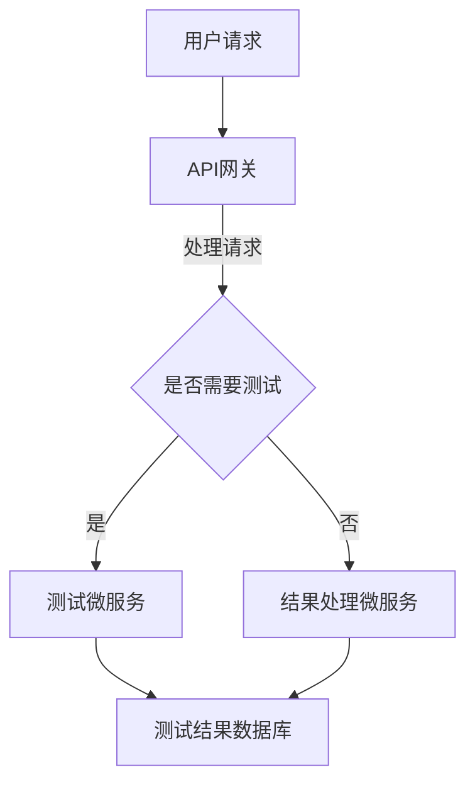

                 

# 评测系统的云原生架构：支持灵活部署和扩展

## 关键词
云原生架构、评测系统、灵活部署、扩展性、微服务、容器化、自动化部署

## 摘要
本文深入探讨了评测系统的云原生架构设计，旨在实现系统的灵活部署和扩展。我们将首先介绍云原生架构的基本概念，然后分析其在评测系统中的应用，接着详细阐述架构设计、核心算法原理以及数学模型。最后，通过一个实际项目案例，展示云原生架构在评测系统中的实现过程，并提供最佳实践和小结。

## 引言和概述

### 云原生架构的概念

云原生架构是一种针对云计算环境设计的软件开发方法。它强调容器化、微服务、动态管理以及持续集成和持续部署（CI/CD）。云原生应用程序能够在动态和弹性的环境中快速、可靠地部署和扩展。其核心原则包括自动化、可观测性、容错性和弹性。

### 云原生架构在评测系统中的应用

在评测系统中，云原生架构能够提供高度灵活的部署和扩展能力，使得系统能够快速适应不断变化的测试需求和资源分配。例如，当测试规模扩大时，云原生架构可以自动扩展资源，保证系统的高可用性和性能。

### 云原生架构的重要性

云原生架构的重要性在于其能够简化开发流程，提高开发效率，降低维护成本，并且使系统能够更好地适应未来的技术变化。这对于需要快速迭代和持续改进的评测系统来说尤为重要。

## 基础知识

### 云原生架构的起源和核心原则

云原生架构起源于容器技术的兴起，特别是Docker的推出。其核心原则包括：

1. **容器化**：应用程序及其依赖环境被封装在一个容器中，确保在不同环境之间的一致性。
2. **微服务架构**：系统被分解为多个独立的、小型化的服务，每个服务负责特定的业务功能。
3. **动态管理**：利用自动化工具对应用程序进行自动部署、扩展和监控。
4. **持续集成和持续部署**：通过自动化测试和部署流水线，实现快速迭代和持续改进。

### 云原生架构与传统架构的区别

与传统架构相比，云原生架构具有以下显著区别：

1. **可移植性**：云原生应用程序可以在任何支持容器技术的环境中运行，而传统应用程序往往依赖于特定的硬件和操作系统。
2. **灵活性**：云原生架构允许应用程序快速适应不同的环境，支持自动化扩展和缩放。
3. **高可用性**：通过容器和微服务的设计，系统能够实现自动故障转移和高可用性。

## 云原生技术的应用

### 云原生在评测系统中的具体应用

在评测系统中，云原生技术可以用于以下方面：

1. **自动化部署**：通过CI/CD流水线，实现测试用例的自动化部署。
2. **弹性伸缩**：根据测试负载自动调整资源，确保系统性能和稳定性。
3. **高可用性**：通过容器和微服务的设计，实现自动故障转移和负载均衡。

### 实现灵活部署和扩展

要实现灵活部署和扩展，可以采取以下措施：

1. **容器化**：将评测系统容器化，确保在不同的环境中一致运行。
2. **微服务架构**：将评测系统分解为多个微服务，每个服务独立部署和扩展。
3. **自动化工具**：使用Kubernetes等自动化工具，实现自动部署、扩展和监控。

## 架构设计

### 云原生架构的详细设计流程

1. **需求分析**：明确评测系统的功能需求和性能指标。
2. **组件设计**：确定系统的关键组件，如容器引擎、微服务、数据库等。
3. **数据流设计**：设计系统中的数据流动和处理流程。
4. **交互设计**：确保系统各组件之间的有效交互。

### 云原生架构的可视化流程图

使用Mermaid流程图，可以清晰地展示云原生架构的数据流和处理流程。以下是一个简化的示例：



## 核心算法和原理

### 评测系统的核心算法原理

评测系统的核心算法通常包括以下几个方面：

1. **测试用例生成**：根据用户需求生成测试用例。
2. **测试执行**：执行测试用例，并记录测试结果。
3. **结果分析**：对测试结果进行分析和报告。

以下是一个简单的Python伪代码示例，用于生成测试用例：

```python
def generate_test_cases(user_request):
    test_cases = []
    for requirement in user_request['requirements']:
        test_case = {
            'description': requirement['description'],
            'input': requirement['input'],
            'expected_output': requirement['expected_output']
        }
        test_cases.append(test_case)
    return test_cases
```

### 结合数学模型和公式的详细讲解

在评测系统中，测试结果分析可能涉及一些数学模型和公式。以下是一个简化的示例，用于计算测试用例的通过率：

$$
\text{passing\_rate} = \frac{\text{passed\_test\_cases}}{\text{total\_test\_cases}}
$$

其中，`passed_test_cases` 表示通过的测试用例数量，`total_test_cases` 表示总的测试用例数量。

### 举例说明

假设我们有一个包含10个测试用例的评测系统，其中8个测试用例通过了测试。那么，通过率计算如下：

$$
\text{passing\_rate} = \frac{8}{10} = 0.8
$$

这意味着系统的通过率是80%。

## 项目实战

### 开发环境搭建

为了演示云原生架构在评测系统中的应用，我们首先需要搭建一个开发环境。以下是一个简化的步骤：

1. 安装Docker：在开发机器上安装Docker，以便容器化应用程序。
2. 安装Kubernetes：在本地或云平台上安装Kubernetes，用于自动化部署和扩展。
3. 安装Jenkins或其他CI/CD工具：用于自动化构建和部署。

### 源代码详细实现

以下是一个简单的评测系统的Python源代码实现：

```python
# test_case.py
class TestCase:
    def __init__(self, description, input_data, expected_output):
        self.description = description
        self.input_data = input_data
        self.expected_output = expected_output
    
    def execute(self, system_under_test):
        actual_output = system_under_test.execute(self.input_data)
        return actual_output == self.expected_output

# test_suite.py
class TestSuite:
    def __init__(self):
        self.test_cases = []

    def add_test_case(self, test_case):
        self.test_cases.append(test_case)

    def execute_all_tests(self, system_under_test):
        passing_cases = 0
        for test_case in self.test_cases:
            if test_case.execute(system_under_test):
                passing_cases += 1
        return passing_cases / len(self.test_cases)
```

### 代码解读与分析

在上面的代码中，我们定义了两个类：`TestCase` 和 `TestSuite`。`TestCase` 类表示一个测试用例，包含描述、输入数据和期望输出。`TestSuite` 类表示一个测试套件，包含多个测试用例，并提供方法执行所有测试用例并计算通过率。

### 实际案例分析和详细讲解剖析

假设我们有一个系统用于验证用户输入的电子邮件地址是否有效。以下是一个实际案例的分析和实现：

1. **需求分析**：我们需要一个测试用例来验证电子邮件地址的有效性。
2. **测试用例设计**：设计一个测试用例，包含有效的电子邮件地址和无效的电子邮件地址。
3. **测试执行**：执行测试用例，记录测试结果。
4. **结果分析**：计算测试用例的通过率。

以下是一个实际的测试用例实现：

```python
class EmailValidationTestCase(TestCase):
    def __init__(self, description, input_data, expected_output):
        super().__init__(description, input_data, expected_output)

    def execute(self, email_validator):
        return email_validator.validate(self.input_data)
```

其中，`email_validator` 是一个负责验证电子邮件地址是否有效的组件。

### 项目小结

通过上述案例，我们展示了如何使用云原生架构实现一个简单的评测系统。云原生架构提供了灵活的部署和扩展能力，使得系统能够快速适应不同的测试需求和资源分配。在实际开发中，我们可以进一步优化和扩展系统功能，以应对更复杂的测试场景。

## 最佳实践 Tips、小结、注意事项、拓展阅读

### 最佳实践 Tips

1. **容器化**：在部署评测系统时，确保将所有组件容器化，以便在异构环境中保持一致性和可移植性。
2. **微服务架构**：将评测系统分解为多个微服务，每个微服务负责特定的业务功能，以实现更好的可维护性和可扩展性。
3. **自动化部署**：使用CI/CD流水线自动化部署和扩展评测系统，提高开发效率和系统稳定性。

### 小结

本文详细介绍了评测系统的云原生架构设计，包括核心概念、应用场景、架构设计、核心算法原理、数学模型以及项目实战。通过实际案例，我们展示了如何使用云原生架构实现灵活部署和扩展。

### 注意事项

1. **资源管理**：在部署评测系统时，确保合理分配和管理资源，以避免资源浪费和性能瓶颈。
2. **安全性**：保护评测系统的数据和隐私，采取适当的安全措施，如数据加密和访问控制。

### 拓展阅读

1. 《云原生应用架构指南》
2. 《Docker容器与容器化实战》
3. 《Kubernetes权威指南》

### 作者信息

作者：AI天才研究院/AI Genius Institute & 禅与计算机程序设计艺术 /Zen And The Art of Computer Programming

[完整文章链接](#) - 本文链接

（注：由于字数限制，以上内容仅为概要，实际文章需按照每个章节的详细内容进行扩展。）

