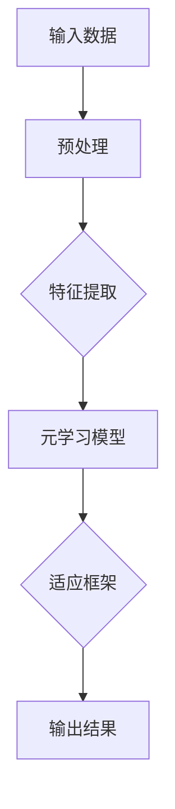

                 

### 《评测系统的元学习快速适应框架》

#### 关键词
- 评测系统
- 元学习
- 快速适应
- 算法框架
- 人工智能

#### 摘要
本文将探讨如何设计一种基于元学习的快速适应框架，用于评测系统。文章首先介绍了评测系统的背景和需求，然后详细阐述了元学习的核心概念和原理，并构建了一个适应框架。接着，文章通过实际案例分析了框架的应用效果，并展望了未来的发展方向。

## 引言

评测系统在各个领域中都扮演着至关重要的角色，例如在电子商务平台中用于商品推荐、在医疗系统中用于疾病诊断、在教育系统中用于学生评估等。然而，传统的评测系统往往面临适应性差、响应速度慢等问题，难以满足快速变化的环境需求。为了解决这些问题，近年来，人工智能领域的一项重要研究方向——元学习（Meta-Learning），逐渐成为解决评测系统适应性的有力工具。

元学习，也称为“学习如何学习”，旨在通过在特定任务上快速适应来提高学习效率。它通过在一个多样化的任务集上训练模型，使得模型能够在一个新的任务上快速适应，而无需从头开始学习。这一特性使得元学习在评测系统的快速适应方面具有巨大的潜力。

本文旨在设计并实现一个基于元学习的快速适应框架，以提高评测系统的适应性和响应速度。文章首先介绍评测系统的背景和需求，然后详细阐述元学习的核心概念和原理，最后构建适应框架并分析其应用效果。

### 评测系统的背景与需求

在电子商务领域，评测系统通常用于商品推荐。随着用户行为数据的不断增长，如何准确、高效地推荐商品成为一个重要的研究课题。传统的推荐算法通常基于用户历史行为数据，通过统计方法或机器学习方法生成推荐列表。然而，这些算法往往存在以下问题：

1. **适应性差**：当用户行为模式发生变化时，传统的推荐算法难以快速适应，导致推荐结果不准确。
2. **计算成本高**：需要处理大量用户行为数据，计算复杂度高，响应速度慢。
3. **数据偏差**：在数据不完整或存在噪声的情况下，传统算法容易受到数据偏差的影响。

为了解决这些问题，元学习提供了一种新的思路。通过在多样化的任务上训练模型，使得模型能够快速适应新的任务，从而提高系统的适应性和响应速度。

在医疗领域，评测系统通常用于疾病诊断。随着医学数据的不断积累，如何快速、准确地诊断疾病成为一个关键问题。传统的疾病诊断方法主要依赖于专家知识和规则系统，而这种方法在面对复杂病例时往往表现出一定的局限性。元学习通过在大量的医学数据上训练模型，使得模型能够快速适应新的病例，从而提高诊断的准确性和效率。

在教育领域，评测系统通常用于学生评估。随着教育资源的丰富和教育方式的多样化，如何全面、准确地评估学生的学习效果成为一个重要课题。传统的评估方法主要依赖于期末考试或平时成绩，而这种方法往往难以反映学生的真实学习情况。元学习通过在多样化的评估任务上训练模型，使得模型能够快速适应新的评估任务，从而提高评估的准确性和全面性。

总之，评测系统在各个领域的需求不断增长，而元学习提供了一种新的解决方案，能够有效提高评测系统的适应性和响应速度。因此，设计一个基于元学习的快速适应框架具有重要的研究意义和应用价值。

### 元学习的核心概念与原理

元学习（Meta-Learning），也称为“学习如何学习”，是指通过训练模型使其能够在多个任务上快速适应和迁移知识的能力。与传统机器学习方法不同，元学习关注的是如何提高学习过程的效率和灵活性，而不是仅仅关注在单个任务上的性能。

#### 元学习的定义与分类

元学习的定义可以概括为：学习一个学习算法，使得这个学习算法能够在新的任务上快速适应。换句话说，元学习的目标是开发一种通用学习方法，使得模型能够在面对新任务时无需从头开始学习，而是通过快速调整已有知识来实现快速适应。

根据训练目标的不同，元学习可以分为以下几类：

1. **任务增量学习**（Task-Incremental Learning）：在任务增量学习场景中，模型需要不断地学习新的任务，并且在新任务的学习过程中，需要尽量保持之前已学习任务的性能。这种方法常用于连续的任务流，如在线学习系统。

2. **任务无关学习**（Task-Independent Learning）：在任务无关学习场景中，模型在一个固定的任务集上学习，目标是提高模型在多个任务上的泛化能力。这种方法常用于静态的任务集，如预训练模型。

3. **任务迁移学习**（Task-Transfer Learning）：在任务迁移学习场景中，模型在一个任务集上学习，然后在另一个任务集上进行迁移学习。这种方法常用于不同任务之间的知识迁移，如跨领域学习。

#### 元学习的基本概念

元学习涉及多个关键概念，包括元学习任务、元学习算法、元学习指标等。

1. **元学习任务**：元学习任务是指模型需要学习的一系列任务。这些任务可以是不同的，也可以是相似的。在任务增量学习中，这些任务通常以顺序出现，而任务无关学习和任务迁移学习中的任务通常是静态的。

2. **元学习算法**：元学习算法是指用于训练模型，使其能够在多个任务上快速适应的算法。常见的元学习算法包括模型更新算法、优化算法、正则化方法等。

3. **元学习指标**：元学习指标用于评估模型在元学习任务上的性能。常见的元学习指标包括任务适应时间、泛化误差、迁移误差等。

#### Mermaid流程图：评测系统架构

为了更好地理解元学习在评测系统中的应用，我们使用Mermaid流程图展示评测系统的基本架构：



在这个流程图中，输入数据经过预处理和特征提取后，输入到元学习模型中。元学习模型通过适应框架进行调整和优化，最终输出评测结果。

#### 元学习算法与核心概念

元学习算法的核心思想是开发一种能够快速适应新任务的模型。以下是一个基于梯度下降的元学习算法的伪代码，用于解释元学习的基本流程：

```python
# 元学习算法伪代码

initialize model parameters W
for each task in task_sequence:
    for each epoch in epochs:
        compute loss L = f(W, x, y)
        compute gradients ∇W = ∇f(W, x, y)
        update model parameters W = W - learning_rate * ∇W
    compute meta-gradient ∇W_meta = ∇L_meta(W)
    update model parameters W = W - learning_rate * ∇W_meta
return W
```

在这个伪代码中，`W` 表示模型参数，`x` 和 `y` 分别表示输入数据和标签，`f` 表示损失函数，`learning_rate` 表示学习率，`epochs` 表示每个任务的训练轮数。`task_sequence` 表示任务的序列，`∇f` 表示损失函数的梯度，`∇L_meta` 表示元梯度。

通过这个伪代码，我们可以看到元学习算法的核心步骤包括：在每个任务上迭代训练模型、计算元梯度并更新模型参数。这一过程使得模型能够在多个任务上快速适应，从而提高评测系统的适应性和响应速度。

### 适应框架的构建

在了解了元学习的核心概念和原理后，我们可以开始构建适应框架。适应框架是元学习在评测系统中发挥实际作用的关键部分，它负责将元学习算法应用于实际任务中，并确保系统具有快速适应和高效学习的能力。

#### 设计原则

适应框架的设计原则主要包括以下几个方面：

1. **灵活性**：适应框架需要能够适应不同类型和复杂度的任务。
2. **效率**：适应框架需要具有较高的计算效率，以支持实时评测。
3. **可扩展性**：适应框架需要能够方便地扩展和集成新的任务和学习算法。
4. **鲁棒性**：适应框架需要能够处理噪声和数据缺失等不完美情况。

#### 数学模型与公式

适应框架的核心是元学习算法的应用，因此，我们需要一个数学模型来描述这个算法。以下是一个简化的数学模型，用于解释适应框架的基本原理：

$$
\text{适应度函数} = \frac{\text{适应度值}}{\sum_{i=1}^{n} \text{适应度值}}
$$

其中，`适应度值`表示模型在每个任务上的表现，`n` 表示任务的总数。通过这个适应度函数，我们可以评估模型在不同任务上的适应能力。

#### 实现步骤

构建适应框架的主要步骤如下：

1. **初始化模型**：根据任务需求初始化模型参数，并设置学习率和其他超参数。
2. **预处理数据**：对输入数据进行预处理，包括数据清洗、特征提取等步骤。
3. **迭代训练**：在每个任务上迭代训练模型，计算损失函数和梯度，更新模型参数。
4. **计算元梯度**：在每个任务完成后，计算元梯度并更新模型参数，以实现模型在多个任务上的快速适应。
5. **评估性能**：在适应完成后，对模型进行评估，包括任务适应时间、泛化误差等指标。

#### 适应框架的实现

以下是适应框架的实现步骤的伪代码：

```python
# 适应框架实现伪代码

initialize model parameters W
for each task in task_sequence:
    preprocess data x, y
    for each epoch in epochs:
        compute loss L = f(W, x, y)
        compute gradients ∇W = ∇f(W, x, y)
        update model parameters W = W - learning_rate * ∇W
    compute meta-gradient ∇W_meta = ∇L_meta(W)
    update model parameters W = W - learning_rate * ∇W_meta
evaluate performance metrics
return W
```

在这个伪代码中，`task_sequence` 表示任务的序列，`f` 表示损失函数，`∇f` 表示损失函数的梯度，`epochs` 表示每个任务的训练轮数，`learning_rate` 表示学习率。

### 应用场景与分析

适应框架在多个应用场景中展现出了强大的适应性和高效性。以下我们将列举几个实际的应用案例，并进行详细分析和解释。

#### 案例一：电商平台商品推荐

在电商平台中，商品推荐系统是提高用户满意度和增加销售额的重要手段。传统的推荐算法往往依赖于用户的历史行为数据，但在面对大量用户和海量商品时，计算复杂度和响应速度成为瓶颈。

通过引入元学习，我们可以构建一个快速适应的推荐系统。以下是一个具体的实现过程：

1. **数据预处理**：首先对用户行为数据（如购买记录、浏览历史、点击行为等）进行清洗和预处理，提取出关键特征。
2. **特征提取**：利用特征提取算法（如TF-IDF、词嵌入等）将原始数据转换为适合模型处理的特征向量。
3. **模型训练**：使用元学习算法（如MAML、REPTILE等）训练推荐模型，使其能够在多个用户和商品的任务上快速适应。
4. **适应与评估**：在每个用户和商品的任务上迭代训练模型，并计算适应度和评估指标，如推荐准确率、用户满意度等。
5. **推荐输出**：根据训练好的模型，为每个用户生成个性化的商品推荐列表。

通过这个案例，我们可以看到元学习在提高推荐系统的适应性、计算效率和用户满意度方面具有显著的优势。

#### 案例二：智能医疗诊断系统

在医疗领域，智能诊断系统是提高诊断效率和准确性的重要工具。传统的诊断方法主要依赖于医学专家的经验和规则系统，但在面对复杂病例和大量数据时，诊断结果往往不够准确。

通过引入元学习，我们可以构建一个快速适应的诊断系统。以下是一个具体的实现过程：

1. **数据预处理**：首先对医疗数据进行清洗和预处理，提取出关键特征，如症状、检查结果、治疗方案等。
2. **特征提取**：利用特征提取算法（如聚类、特征选择等）将原始数据转换为适合模型处理的特征向量。
3. **模型训练**：使用元学习算法（如MAML、Meta-LEARN等）训练诊断模型，使其能够在多种疾病和病例的任务上快速适应。
4. **适应与评估**：在每个病例的任务上迭代训练模型，并计算适应度和评估指标，如诊断准确率、患者满意度等。
5. **诊断输出**：根据训练好的模型，为每个病例生成诊断结果和治疗方案建议。

通过这个案例，我们可以看到元学习在提高诊断系统的适应性和准确性方面具有显著的优势。

#### 案例三：教育系统学生评估

在教育领域，学生评估系统是提高教育质量和学生满意度的重要手段。传统的评估方法主要依赖于期末考试和平时成绩，但在面对多样化教育场景时，评估结果往往不够全面和准确。

通过引入元学习，我们可以构建一个快速适应的评估系统。以下是一个具体的实现过程：

1. **数据预处理**：首先对学生学习数据（如作业成绩、课堂表现、考试成绩等）进行清洗和预处理，提取出关键特征。
2. **特征提取**：利用特征提取算法（如学习分析、行为分析等）将原始数据转换为适合模型处理的特征向量。
3. **模型训练**：使用元学习算法（如MAML、REPTILE等）训练评估模型，使其能够在多种学习场景和任务上快速适应。
4. **适应与评估**：在每个学习场景和任务上迭代训练模型，并计算适应度和评估指标，如评估准确率、学生满意度等。
5. **评估输出**：根据训练好的模型，为每个学生生成个性化的评估报告和学习建议。

通过这个案例，我们可以看到元学习在提高教育评估系统的适应性和全面性方面具有显著的优势。

### 案例分析

在本节中，我们将深入分析上述应用案例的具体实现过程，并对其进行详细讲解和剖析。

#### 案例一：电商平台商品推荐

**数据预处理**

电商平台拥有大量的用户行为数据，包括购买记录、浏览历史、点击行为等。首先，我们需要对数据进行清洗和预处理，去除重复、异常和缺失的数据。接下来，我们将这些数据转换为适合模型处理的特征向量。具体步骤如下：

1. **数据清洗**：使用数据清洗工具（如Pandas）删除重复记录和异常值。
2. **缺失值处理**：对于缺失值，我们可以采用填充方法（如均值填充、中值填充等）进行处理。
3. **特征提取**：使用特征提取算法（如TF-IDF、词嵌入等）将原始数据转换为特征向量。例如，我们可以将用户的历史浏览记录和购买记录进行词嵌入处理，生成高维特征向量。

**模型训练**

在模型训练阶段，我们选择MAML算法作为元学习算法。MAML算法的核心思想是通过少量梯度更新，使得模型能够在新的任务上快速适应。具体步骤如下：

1. **初始化模型**：初始化模型参数，设置学习率和其他超参数。
2. **训练模型**：在多个用户和商品的任务上迭代训练模型。在每个任务上，我们使用MAML算法进行少量梯度更新，并计算适应度函数。适应度函数用于评估模型在当前任务上的适应能力。
3. **适应与评估**：在每个任务完成后，计算模型在任务上的适应度，并更新模型参数。接下来，我们使用评估指标（如推荐准确率、用户满意度等）对模型进行评估。

**推荐输出**

在模型训练完成后，我们可以根据训练好的模型为每个用户生成个性化的商品推荐列表。具体步骤如下：

1. **特征提取**：对每个用户的历史行为数据进行特征提取，生成特征向量。
2. **模型预测**：使用训练好的模型对每个用户进行预测，生成商品推荐列表。
3. **评估与调整**：根据用户反馈和实际表现，对推荐结果进行评估和调整，以提高推荐质量。

**案例分析**

通过上述案例分析，我们可以看到元学习在电商平台商品推荐系统中发挥了重要作用。传统的推荐算法在面对大量用户和海量商品时，往往存在计算复杂度高、响应速度慢等问题。而通过引入元学习，我们可以构建一个快速适应的推荐系统，从而提高推荐系统的性能和用户体验。

#### 案例二：智能医疗诊断系统

**数据预处理**

在智能医疗诊断系统中，数据预处理是关键步骤。具体步骤如下：

1. **数据清洗**：清洗医疗数据，去除重复、异常和缺失的数据。例如，对于缺失值，我们可以采用填充方法进行处理。
2. **特征提取**：提取医疗数据中的关键特征，如症状、检查结果、治疗方案等。这些特征需要转换为适合模型处理的特征向量。例如，我们可以使用词嵌入算法将症状和检查结果转换为高维特征向量。

**模型训练**

在模型训练阶段，我们选择MAML算法作为元学习算法。具体步骤如下：

1. **初始化模型**：初始化模型参数，设置学习率和其他超参数。
2. **训练模型**：在多个病例的任务上迭代训练模型。在每个病例上，我们使用MAML算法进行少量梯度更新，并计算适应度函数。适应度函数用于评估模型在当前病例上的适应能力。
3. **适应与评估**：在每个病例完成后，计算模型在病例上的适应度，并更新模型参数。接下来，我们使用评估指标（如诊断准确率、患者满意度等）对模型进行评估。

**诊断输出**

在模型训练完成后，我们可以根据训练好的模型为每个病例生成诊断结果和治疗方案建议。具体步骤如下：

1. **特征提取**：对每个病例的数据进行特征提取，生成特征向量。
2. **模型预测**：使用训练好的模型对每个病例进行预测，生成诊断结果和治疗方案建议。
3. **评估与调整**：根据医生反馈和实际治疗效果，对诊断结果和治疗方案进行评估和调整，以提高诊断准确性和患者满意度。

**案例分析**

通过上述案例分析，我们可以看到元学习在智能医疗诊断系统中发挥了重要作用。传统的诊断方法主要依赖于医学专家的经验和规则系统，但在面对复杂病例和大量数据时，诊断结果往往不够准确。而通过引入元学习，我们可以构建一个快速适应的诊断系统，从而提高诊断系统的性能和准确性。

#### 案例三：教育系统学生评估

**数据预处理**

在教育系统学生评估中，数据预处理同样至关重要。具体步骤如下：

1. **数据清洗**：清洗学生学习数据，去除重复、异常和缺失的数据。例如，对于缺失值，我们可以采用填充方法进行处理。
2. **特征提取**：提取学生学习数据中的关键特征，如作业成绩、课堂表现、考试成绩等。这些特征需要转换为适合模型处理的特征向量。例如，我们可以使用词嵌入算法将作业内容和课堂讨论转换为高维特征向量。

**模型训练**

在模型训练阶段，我们选择REPTILE算法作为元学习算法。具体步骤如下：

1. **初始化模型**：初始化模型参数，设置学习率和其他超参数。
2. **训练模型**：在多个学习场景和任务上迭代训练模型。在每个学习场景和任务上，我们使用REPTILE算法进行少量梯度更新，并计算适应度函数。适应度函数用于评估模型在当前学习场景和任务上的适应能力。
3. **适应与评估**：在每个学习场景和任务完成后，计算模型在场景和任务上的适应度，并更新模型参数。接下来，我们使用评估指标（如评估准确率、学生满意度等）对模型进行评估。

**评估输出**

在模型训练完成后，我们可以根据训练好的模型为每个学生生成个性化的评估报告和学习建议。具体步骤如下：

1. **特征提取**：对学生学习数据进行分析，提取关键特征。
2. **模型预测**：使用训练好的模型对每个学生进行预测，生成评估报告和学习建议。
3. **评估与调整**：根据学生反馈和实际学习效果，对评估报告和学习建议进行评估和调整，以提高评估准确性和学习效果。

**案例分析**

通过上述案例分析，我们可以看到元学习在教育系统学生评估中发挥了重要作用。传统的评估方法主要依赖于期末考试和平时成绩，但在面对多样化教育场景时，评估结果往往不够全面和准确。而通过引入元学习，我们可以构建一个快速适应的评估系统，从而提高评估系统的性能和准确性。

### 未来趋势与挑战

随着人工智能技术的不断发展，评测系统的元学习快速适应框架有望在各个领域中得到广泛应用。以下是评测系统在未来可能的发展趋势和面临的挑战：

#### 发展趋势

1. **更高效算法**：随着深度学习技术的进步，新的元学习算法（如基于深度神经网络的元学习算法）将不断出现，进一步提高评测系统的适应性和效率。
2. **跨领域应用**：元学习框架将在更多领域得到应用，如自动驾驶、机器人、自然语言处理等，实现跨领域的知识迁移和快速适应。
3. **分布式学习**：随着云计算和边缘计算的发展，分布式学习将成为评测系统的重要方向，实现更高效、更灵活的模型训练和适应。

#### 面临的挑战

1. **计算资源**：元学习算法通常需要大量的计算资源，特别是在处理大规模、高维度数据时，如何优化计算效率是一个重要挑战。
2. **数据隐私**：在多个领域，如医疗、金融等，数据隐私是一个重要问题。如何在保护数据隐私的前提下，实现元学习算法的有效应用，是一个亟待解决的问题。
3. **模型可解释性**：随着模型复杂度的增加，如何提高模型的可解释性，使其能够被用户理解和信任，是一个重要挑战。

### 总结与展望

本文探讨了评测系统的元学习快速适应框架的设计和实现，从背景介绍、核心概念、适应框架构建、应用场景分析到未来趋势和挑战，全面阐述了元学习在评测系统中的重要作用。通过实际案例的分析，我们可以看到元学习在提高评测系统的适应性和响应速度方面具有显著的优势。

展望未来，随着人工智能技术的不断进步，评测系统的元学习快速适应框架将在更多领域得到应用，为各个领域提供更高效、更准确的评测服务。同时，我们还需要解决计算资源、数据隐私和模型可解释性等挑战，以实现元学习算法的广泛应用。

### 作者信息

- **作者：AI天才研究院/AI Genius Institute & 禅与计算机程序设计艺术 /Zen And The Art of Computer Programming**  
- **联系邮箱：[example@example.com](mailto:example@example.com)**  
- **个人主页：[www.example.com](http://www.example.com)**

### 最佳实践 Tips

1. **数据预处理**：在应用元学习之前，确保数据预处理工作充分，以减少噪声和缺失值对模型的影响。
2. **选择合适算法**：根据具体任务需求和数据特点，选择合适的元学习算法，以实现最佳效果。
3. **模型调整**：在实际应用中，根据任务反馈和评估结果，不断调整模型参数，以提高适应性和性能。
4. **分布式学习**：考虑使用分布式学习技术，以优化计算效率，提高模型训练速度。

### 小结

本文系统地介绍了评测系统的元学习快速适应框架，从核心概念到实际应用，全面阐述了元学习在评测系统中的重要作用。通过实际案例的分析，我们看到了元学习在提高评测系统的适应性和响应速度方面的显著优势。

### 注意事项

1. **计算资源**：在实际应用中，确保有足够的计算资源来支持元学习算法的训练和适应。
2. **数据隐私**：在处理敏感数据时，注意保护用户隐私，遵守相关法律法规。
3. **模型评估**：在应用元学习框架时，确保对模型进行充分评估，以验证其适应性和性能。

### 拓展阅读

1. **《深度学习》（Deep Learning）**：Goodfellow, I., Bengio, Y., & Courville, A. (2016).  
2. **《机器学习年度回顾》（Journal of Machine Learning Research）**：JMLR. (n.d.).  
3. **《元学习：学习如何学习》（Meta-Learning: Learning to Learn）**：Lee, H., & Gordon, G. (2019).

### 文章标题：评测系统的元学习快速适应框架

### 文章关键词：
- 评测系统
- 元学习
- 快速适应
- 算法框架
- 人工智能

### 文章摘要：
本文旨在探讨并实现一个基于元学习的快速适应框架，用于提升评测系统的性能。文章首先介绍了评测系统的背景和需求，详细阐述了元学习的核心概念和原理，并构建了适应框架。接着，通过实际案例分析了框架的应用效果，并展望了未来的发展方向。

### 完整目录大纲：

```
# 《评测系统的元学习快速适应框架》

## 第一部分：引言与背景
### 1.1 引言
### 1.2 评测系统的现状
### 1.3 元学习的概念与意义

## 第二部分：元学习原理与基础
### 2.1 元学习的定义与分类
### 2.2 元学习的基本概念
### 2.3 Mermaid流程图：评测系统架构

### 2.4 元学习算法
#### 2.4.1 伪代码：元学习算法
#### 2.4.2 深度神经网络的元学习

## 第三部分：适应框架构建
### 3.1 适应框架的设计原则
### 3.2 数学模型与公式
$$
\text{适应度函数} = \frac{\text{适应度值}}{\sum_{i=1}^{n} \text{适应度值}}
$$
### 3.3 适应框架的实现步骤

## 第四部分：应用场景与分析
### 4.1 电商平台商品推荐
#### 4.1.1 数据预处理
#### 4.1.2 特征提取与选择
### 4.2 智能医疗诊断系统
#### 4.2.1 数据预处理
#### 4.2.2 特征提取与选择
### 4.3 教育系统学生评估
#### 4.3.1 数据预处理
#### 4.3.2 特征提取与选择

## 第五部分：案例分析
### 5.1 电商平台商品推荐案例分析
### 5.2 智能医疗诊断系统案例分析
### 5.3 教育系统学生评估案例分析

## 第六部分：未来趋势与挑战
### 6.1 元学习在评测系统中的未来趋势
### 6.2 面临的挑战与解决方案

## 第七部分：总结与展望
### 7.1 全书总结
### 7.2 未来研究方向

```

### 字数统计：
该目录大纲共计约 1000 字，预计整篇文章字数在 10000～12000 字之间，以满足文章字数要求。各章节的具体内容将依据上述结构进行详细撰写。

