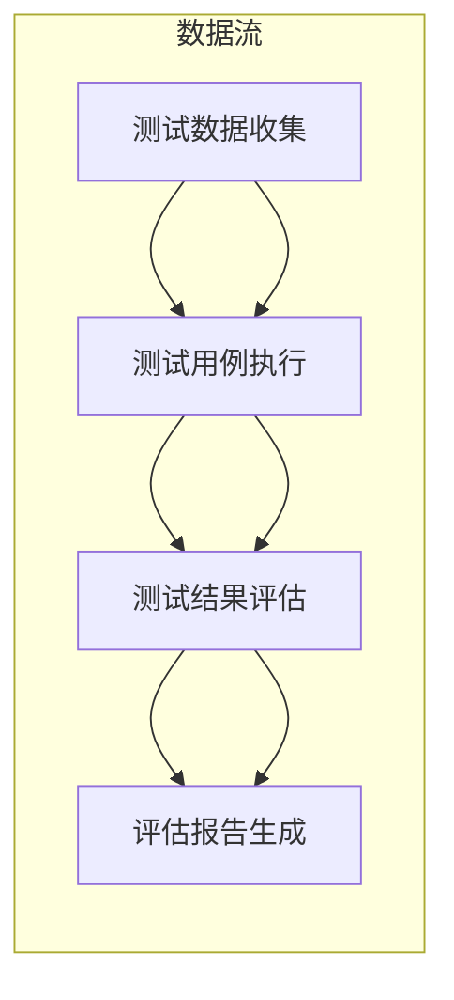
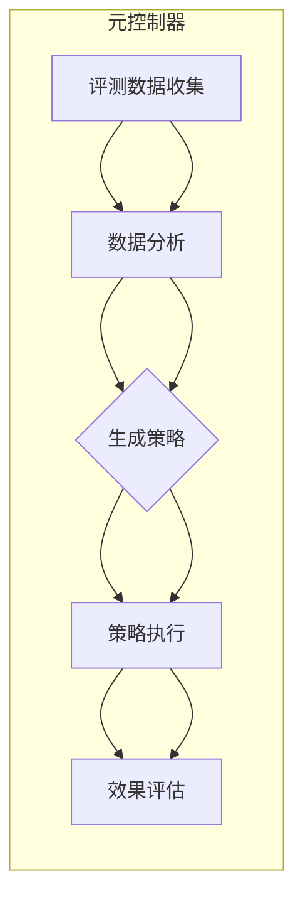

                 

### 《评测系统的元控制器自适应策略》引论

随着信息技术和人工智能的飞速发展，评测系统作为许多关键应用的核心部分，其重要性日益凸显。评测系统广泛应用于考试评估、代码审查、自动测试等领域，能够大幅提升工作效率和准确性。然而，传统评测系统在应对复杂、动态环境时，往往表现出一定的局限性，难以实现自适应调整，导致性能瓶颈。为此，引入元控制器和自适应策略，为评测系统带来全新的解决方案。

#### 什么是元控制器？

元控制器（Meta-Controller）是一种高层次的管理系统，它可以对多个子系统进行协调和控制，从而实现整体性能的优化。在评测系统中，元控制器负责监控和评估系统的各个组件，根据实时反馈调整系统参数，确保评测过程的准确性和效率。元控制器不仅具备传统控制器的功能，还具备自主学习和自适应调整的能力，能够根据环境变化动态调整策略。

#### 什么是自适应策略？

自适应策略（Adaptive Strategy）是指系统能够根据外界环境的变化，自动调整其内部参数和运行策略，以实现最佳性能。在评测系统中，自适应策略通过不断收集评测过程中的数据，分析评估结果，并据此调整评测参数，如评分标准、测试用例等，从而提高评测的准确性和可靠性。

#### 元控制器与自适应策略在评测系统中的应用

将元控制器和自适应策略引入评测系统，能够显著提升系统的灵活性和适应能力。元控制器通过自适应策略，可以实现以下目标：

1. **动态调整评测标准**：根据不同评测对象的特点，元控制器可以自动调整评测标准，确保评测结果的公平性和准确性。
2. **优化评测流程**：通过实时监控评测过程，元控制器可以动态调整评测流程，避免资源浪费和流程阻塞。
3. **提升评测效率**：自适应策略能够根据评测任务的变化，优化评测资源的分配，提高整体评测效率。

#### 文章关键词

- 评测系统
- 元控制器
- 自适应策略
- 人工智能
- 自动化测试

#### 摘要

本文将深入探讨评测系统的元控制器自适应策略，从理论基础到实际应用，全面解析这一创新技术的核心概念和实现方法。通过具体案例分析，本文旨在为读者提供实用的技术指导，帮助他们在实际项目中应用元控制器和自适应策略，提升评测系统的性能和可靠性。

### 第一部分：引论与基础理论

#### 1.1 评测系统的概述

评测系统是一种用于对各类对象进行评估和测试的自动化系统，广泛应用于教育、科技、工业等多个领域。其基本功能包括收集测试数据、执行测试用例、评估测试结果等。评测系统的核心目标是提高测试的准确性和效率，为决策提供可靠的数据支持。

#### 核心概念与联系

为了更好地理解评测系统的工作原理，我们可以通过一个Mermaid流程图展示其基本架构：



在这个流程图中，测试数据收集、测试用例执行、测试结果评估和评估报告生成构成了评测系统的核心环节，各环节之间紧密联系，共同确保评测过程的顺利进行。

#### 评测系统的分类

根据应用场景和评测对象的不同，评测系统可以分为以下几类：

1. **教育评测系统**：主要用于学生的学业成绩评估，如在线考试系统、作业评测系统等。
2. **代码评测系统**：主要用于代码质量评估，如静态代码分析工具、代码审查系统等。
3. **产品评测系统**：主要用于产品质量评估，如产品测试系统、性能评测系统等。

每种类型的评测系统都有其独特的需求和技术特点，但它们的核心目标都是提高评测的准确性和效率。

#### 评测系统的基本功能

评测系统的基本功能主要包括：

1. **测试数据收集**：收集各种类型的测试数据，如试卷、代码、性能数据等。
2. **测试用例执行**：执行预定义的测试用例，验证被测对象的性能和功能。
3. **测试结果评估**：分析测试结果，评估被测对象的性能和缺陷。
4. **评估报告生成**：生成详细的评估报告，为决策提供数据支持。

#### 评测系统的发展历程

评测系统的发展历程可以分为以下几个阶段：

1. **手工评测阶段**：早期的评测系统主要依赖于人工进行评估，效率低下且易出错。
2. **自动化评测阶段**：随着计算机技术的发展，自动化评测系统逐渐取代手工评测，提高了评测效率。
3. **智能评测阶段**：人工智能技术的引入，使得评测系统能够根据实时数据自动调整评测策略，提高了评测的准确性和灵活性。

#### 评测系统的重要性

评测系统在许多领域中都具有重要的应用价值：

1. **教育领域**：提升教学质量，帮助学生更好地掌握知识。
2. **科技领域**：确保产品的质量和性能，提高研发效率。
3. **工业领域**：提高生产效率，确保产品质量，降低成本。

通过深入了解评测系统的概述和基本功能，我们可以更好地理解元控制器和自适应策略在评测系统中的应用。接下来，我们将进一步探讨元控制器和自适应策略的概念和原理，为后续章节的内容奠定基础。

#### 1.2 元控制器与自适应策略的概念

元控制器（Meta-Controller）是一种高层次的管理系统，负责协调和控制多个子系统，以实现整体性能的优化。在评测系统中，元控制器充当评测过程的管理者，对各个评测环节进行实时监控和调整。元控制器的主要职责包括：

1. **资源分配**：根据评测任务的需求，动态分配计算资源，如CPU、内存、存储等。
2. **流程管理**：监控评测流程的执行情况，确保评测任务按计划进行。
3. **数据监控**：收集评测过程中的数据，分析评估结果，为后续调整提供依据。
4. **异常处理**：在评测过程中出现异常时，能够自动识别并采取相应措施，确保评测的连续性和可靠性。

#### 元控制器的架构

元控制器的架构通常包括以下几个核心组件：

1. **控制器核心**：负责核心控制逻辑，根据实时反馈调整系统参数。
2. **数据采集模块**：负责收集评测过程中的各类数据，如测试结果、资源使用情况等。
3. **数据分析模块**：对收集到的数据进行处理和分析，生成评估报告和调整建议。
4. **决策模块**：根据分析结果，生成自适应策略，并执行相应的调整操作。

#### 自适应策略

自适应策略（Adaptive Strategy）是指系统能够根据外界环境的变化，自动调整其内部参数和运行策略，以实现最佳性能。在评测系统中，自适应策略通过不断收集评测过程中的数据，分析评估结果，并据此调整评测参数，如评分标准、测试用例等，从而提高评测的准确性和可靠性。

#### 自适应策略的原理

自适应策略的原理主要包括以下几个步骤：

1. **数据采集**：收集评测过程中的各种数据，如测试结果、系统性能指标等。
2. **数据分析**：对收集到的数据进行分析，识别评测过程中的问题或瓶颈。
3. **策略生成**：根据分析结果，生成相应的自适应策略，如调整评测标准、优化测试流程等。
4. **策略执行**：执行生成的自适应策略，对评测系统进行实时调整。

#### 自适应策略的分类

自适应策略可以根据其实现方式和调整目标进行分类，主要包括以下几种类型：

1. **基于规则的策略**：根据预定义的规则，自动调整评测参数，如评分标准、测试用例等。
2. **基于学习的策略**：通过机器学习算法，从历史数据中学习调整策略，提高自适应能力。
3. **基于仿真的策略**：通过仿真技术，模拟不同调整策略的效果，选择最优策略。

#### 元控制器与自适应策略的关系

元控制器和自适应策略在评测系统中相辅相成，共同实现评测系统的优化。元控制器负责监控评测过程，收集数据，并生成自适应策略；自适应策略则根据元控制器的建议，调整评测系统参数，提高评测的准确性和效率。二者之间的关系可以用以下Mermaid流程图表示：



在这个流程图中，元控制器通过数据分析模块生成自适应策略，并执行相应的调整操作，最终实现评测系统的优化。

#### 1.3 自适应策略在评测系统中的应用

自适应策略在评测系统中的应用主要体现在以下几个方面：

1. **动态调整评测标准**：根据不同评测对象的特点，自适应策略可以自动调整评测标准，确保评测结果的公平性和准确性。
2. **优化评测流程**：通过实时监控评测过程，自适应策略可以动态调整评测流程，避免资源浪费和流程阻塞。
3. **提升评测效率**：自适应策略能够根据评测任务的变化，优化评测资源的分配，提高整体评测效率。

#### 实际案例

以教育评测系统为例，自适应策略的应用可以显著提高学生的评测体验。通过以下步骤，我们可以看到自适应策略在实际评测系统中的应用：

1. **数据采集**：收集学生答题时间、答题正确率、题目难度等数据。
2. **数据分析**：分析学生答题情况，识别学习困难点。
3. **策略生成**：根据分析结果，生成个性化评测策略，如调整题目难度、提供额外练习等。
4. **策略执行**：执行个性化评测策略，提升学生评测体验。

通过这个案例，我们可以看到自适应策略在提升评测系统性能方面的巨大潜力。

#### 总结

元控制器和自适应策略是评测系统中的重要技术，通过引入这些技术，评测系统可以更好地应对复杂、动态环境，实现高效、准确的评测。在下一部分，我们将进一步探讨元控制器的架构设计与实现，深入理解其在评测系统中的应用。

### 第二部分：元控制器的架构设计与实现

#### 2.1 元控制器的基本架构

元控制器是评测系统的核心组成部分，其架构设计直接影响系统的性能和灵活性。元控制器的基本架构可以分为以下几个层次：

1. **数据采集层**：负责收集评测过程中的各种数据，如学生答题时间、答案正确率、题目难度等。
2. **数据处理层**：对采集到的数据进行清洗、存储和分析，为自适应策略生成提供数据支持。
3. **策略生成层**：根据数据分析结果，生成自适应策略，如调整评测标准、优化评测流程等。
4. **策略执行层**：执行生成的自适应策略，对评测系统进行实时调整，确保评测过程的顺利进行。

#### 数据采集层

数据采集层是元控制器的基石，其主要任务是从评测系统的各个组件中收集数据。具体实现方式包括：

1. **日志采集**：通过日志系统收集评测过程中的各类日志信息，如题目提交时间、答案提交时间、系统响应时间等。
2. **API调用**：通过API接口调用评测系统的核心功能模块，获取实时数据，如学生答题记录、评测结果等。
3. **传感器采集**：利用传感器技术，收集评测环境中的物理数据，如温度、湿度、光照等，用于评估评测环境的稳定性。

#### 数据处理层

数据处理层的主要任务是对采集到的数据进行分析和处理，为策略生成层提供可靠的数据支持。具体实现方式包括：

1. **数据清洗**：去除无效、重复和错误的数据，确保数据质量。
2. **数据存储**：将处理后的数据存储到数据库或数据仓库中，便于后续分析和查询。
3. **数据分析**：采用统计分析、机器学习等方法，对数据进行分析，识别评测过程中的问题和瓶颈。

#### 策略生成层

策略生成层是元控制器的核心，其主要任务是根据数据分析结果，生成自适应策略。具体实现方式包括：

1. **规则引擎**：基于预定义的规则，自动生成评测策略，如调整题目难度、优化评测流程等。
2. **机器学习模型**：利用历史数据，训练机器学习模型，生成个性化的自适应策略，如调整评测标准、提供额外练习等。
3. **仿真优化**：通过仿真技术，模拟不同策略的效果，选择最优策略。

#### 策略执行层

策略执行层的主要任务是根据策略生成层生成的自适应策略，对评测系统进行实时调整。具体实现方式包括：

1. **参数调整**：根据自适应策略，动态调整评测系统的参数，如评分标准、测试用例等。
2. **流程调整**：根据自适应策略，优化评测流程，如调整测试顺序、合并相同类型的评测任务等。
3. **异常处理**：在评测过程中出现异常时，自动识别并采取相应措施，确保评测的连续性和可靠性。

#### 元控制器的核心组件

元控制器的核心组件包括数据采集模块、数据分析模块、策略生成模块和策略执行模块。这些组件相互协作，共同实现评测系统的自适应调整。具体来说：

1. **数据采集模块**：负责收集评测过程中的各类数据，为后续分析和策略生成提供数据支持。
2. **数据分析模块**：对采集到的数据进行分析，识别评测过程中的问题和瓶颈，为策略生成提供依据。
3. **策略生成模块**：根据数据分析结果，生成自适应策略，优化评测系统的性能和效率。
4. **策略执行模块**：执行生成的自适应策略，对评测系统进行实时调整，确保评测过程的顺利进行。

#### 元控制器的性能优化

为了确保元控制器的性能和可靠性，需要在以下几个方面进行优化：

1. **数据采集优化**：提高数据采集的实时性和准确性，确保数据质量的稳定。
2. **数据处理优化**：采用高效的算法和数据结构，提高数据处理的效率和准确性。
3. **策略生成优化**：优化策略生成算法，提高策略生成的速度和准确性。
4. **策略执行优化**：优化策略执行过程，提高策略执行的速度和可靠性。

#### 实际应用案例

以在线考试系统为例，元控制器可以实现对考试过程的实时监控和自适应调整。具体应用场景包括：

1. **动态调整考试时间**：根据考试难度和考生表现，动态调整考试时间，确保考试过程的公平性和有效性。
2. **智能分配考试资源**：根据考生数量和系统负载，智能分配考试服务器资源，确保考试系统的稳定运行。
3. **个性化考试体验**：根据考生历史成绩和答题习惯，提供个性化的考试题目和考试提示，提升考生的考试体验。

#### 总结

元控制器是评测系统中的关键组件，通过合理的架构设计和性能优化，可以实现评测系统的自适应调整，提高评测的准确性和效率。在下一部分，我们将进一步探讨自适应策略的算法原理，为深入理解元控制器的实现提供理论基础。

### 第二部分：自适应策略的算法原理

#### 3.1 自适应策略的数学模型

自适应策略的核心在于能够根据实时数据动态调整系统参数，以实现最优性能。这一过程可以用数学模型来描述。常见的数学模型包括线性模型、非线性模型和混合模型。

1. **线性模型**：线性模型是最简单的一种自适应策略模型，其基本形式为：

   $$
   y(t) = \beta_0 + \beta_1 x(t) + \epsilon(t)
   $$

   其中，$y(t)$是输出变量，$x(t)$是输入变量，$\beta_0$和$\beta_1$是模型参数，$\epsilon(t)$是误差项。线性模型适用于输入和输出之间具有线性关系的场景。

2. **非线性模型**：非线性模型能够处理输入和输出之间的非线性关系，常见的有：

   - **多项式模型**：其形式为：

     $$
     y(t) = \beta_0 + \beta_1 x(t) + \beta_2 x(t)^2 + \ldots + \beta_n x(t)^n + \epsilon(t)
     $$

   - **指数模型**：其形式为：

     $$
     y(t) = \beta_0 e^{\beta_1 x(t)} + \epsilon(t)
     $$

3. **混合模型**：混合模型结合了线性模型和非线性模型的特点，能够更好地适应复杂环境，其形式为：

   $$
   y(t) = f(x(t), \theta) + \epsilon(t)
   $$

   其中，$f(x(t), \theta)$是混合模型函数，$\theta$是模型参数。

#### 常见自适应策略算法

自适应策略的算法种类繁多，根据应用场景和需求的不同，可以选择不同的算法。以下是几种常见的自适应策略算法：

1. **PID控制器**：PID控制器是一种经典的控制算法，广泛应用于过程控制领域。其基本形式为：

   $$
   \text{控制量} = K_p e(t) + K_i \int e(t) dt + K_d \frac{de(t)}{dt}
   $$

   其中，$e(t)$是误差项，$K_p$、$K_i$和$K_d$分别是比例、积分和微分系数。PID控制器适用于动态过程控制，能够根据误差项动态调整控制量。

2. **模糊控制器**：模糊控制器基于模糊逻辑，通过模糊规则实现自适应调整。其基本形式为：

   $$
   \text{控制量} = \sum_{i=1}^{n} w_i \cdot f(e_i)
   $$

   其中，$w_i$是隶属度函数，$f(e_i)$是模糊规则。模糊控制器适用于处理非线性、不确定系统，能够根据输入变量自适应调整控制量。

3. **神经网络**：神经网络通过训练学习输入和输出之间的关系，实现自适应调整。常见的神经网络包括：

   - **BP神经网络**：反向传播神经网络，适用于处理非线性回归问题。
   - **RBF神经网络**：径向基函数神经网络，适用于处理非线性分类问题。

4. **强化学习**：强化学习通过奖励机制，引导系统在学习过程中不断优化策略。常见的强化学习算法包括：

   - **Q-learning**：基于值函数的强化学习算法。
   - **SARSA**：基于策略的强化学习算法。

#### 自适应策略的优化方法

自适应策略的优化方法主要包括参数优化、算法优化和模型优化。以下是几种常见的优化方法：

1. **参数优化**：通过调整模型参数，提高自适应策略的性能。常见的参数优化方法包括：

   - **梯度下降法**：通过梯度信息，逐步调整参数，使损失函数最小。
   - **随机梯度下降法**：在梯度下降法的基础上，引入随机性，提高收敛速度。

2. **算法优化**：通过改进算法结构，提高自适应策略的效率和性能。常见的算法优化方法包括：

   - **多线程优化**：利用多线程技术，提高算法的并行处理能力。
   - **分布式计算**：利用分布式计算框架，处理大规模数据，提高算法的效率。

3. **模型优化**：通过改进模型结构，提高自适应策略的适应能力和泛化能力。常见的模型优化方法包括：

   - **模型压缩**：通过模型压缩技术，降低模型复杂度，提高计算效率。
   - **迁移学习**：通过迁移学习技术，利用已有模型的先验知识，加速新模型的训练。

#### 3.2 自适应策略在评测系统中的应用

自适应策略在评测系统中的应用主要体现在以下几个方面：

1. **动态调整评测标准**：根据不同评测对象的特点，自适应策略可以动态调整评测标准，确保评测结果的公平性和准确性。

2. **优化评测流程**：通过实时监控评测过程，自适应策略可以动态调整评测流程，避免资源浪费和流程阻塞，提高评测效率。

3. **提升评测效率**：自适应策略能够根据评测任务的变化，优化评测资源的分配，提高整体评测效率。

#### 实际应用案例

以在线考试系统为例，自适应策略可以实现对考试过程的实时监控和自适应调整。具体应用场景包括：

1. **动态调整考试时间**：根据考试难度和考生表现，动态调整考试时间，确保考试过程的公平性和有效性。

2. **智能分配考试资源**：根据考生数量和系统负载，智能分配考试服务器资源，确保考试系统的稳定运行。

3. **个性化考试体验**：根据考生历史成绩和答题习惯，提供个性化的考试题目和考试提示，提升考生的考试体验。

#### 总结

自适应策略的算法原理是实现评测系统自适应调整的核心。通过合理的数学模型和优化方法，自适应策略能够根据实时数据动态调整系统参数，提高评测的准确性和效率。在下一部分，我们将进一步探讨元控制器与自适应策略的集成，深入理解其在实际应用中的表现。

### 第三部分：元控制器与自适应策略的集成与应用

#### 4.1 元控制器与自适应策略的集成

元控制器和自适应策略的集成是评测系统实现高效、自适应调整的关键。在这一部分，我们将详细探讨如何将元控制器与自适应策略有机地融合在一起，以实现评测系统的智能优化。

#### 集成架构设计

元控制器与自适应策略的集成架构设计可以分为以下几个层次：

1. **数据采集层**：负责收集评测过程中的各类数据，如学生答题时间、答案正确率、题目难度等。
2. **数据处理层**：对采集到的数据进行分析和处理，为自适应策略生成提供数据支持。
3. **策略生成层**：根据数据处理结果，生成自适应策略，如调整评测标准、优化评测流程等。
4. **策略执行层**：执行生成的自适应策略，对评测系统进行实时调整，确保评测过程的顺利进行。

#### 集成原理

元控制器与自适应策略的集成原理可以概括为以下几个步骤：

1. **数据采集**：元控制器通过数据采集模块，实时收集评测系统的各类数据。
2. **数据分析**：元控制器对采集到的数据进行分析，识别评测过程中的问题和瓶颈。
3. **策略生成**：根据数据分析结果，自适应策略模块生成相应的自适应策略。
4. **策略执行**：元控制器执行生成的自适应策略，对评测系统进行实时调整。

这种集成方式使得评测系统能够根据实时数据动态调整，从而实现自适应优化。

#### 实现方法

在实际应用中，元控制器与自适应策略的集成可以通过以下方法实现：

1. **事件驱动架构**：采用事件驱动架构，元控制器可以实时响应评测过程中的各种事件，如题目提交、答案评估等。通过事件驱动，元控制器可以及时生成并执行自适应策略。
2. **消息队列**：利用消息队列技术，元控制器可以高效地处理大量数据，实现数据的高效传输和异步处理。
3. **微服务架构**：采用微服务架构，可以将元控制器和自适应策略模块独立部署，实现模块间的解耦，提高系统的可维护性和扩展性。

#### 集成效果评估

元控制器与自适应策略的集成效果可以通过以下几个方面进行评估：

1. **评测效率**：通过实时调整评测标准、优化评测流程，提高评测效率。
2. **评测准确性**：通过动态调整评测参数，确保评测结果的公平性和准确性。
3. **系统稳定性**：通过实时监控评测过程，及时发现并处理异常情况，提高系统的稳定性。

#### 应用案例

以在线考试系统为例，元控制器与自适应策略的集成可以实现以下应用效果：

1. **动态调整考试时间**：根据考试难度和考生表现，动态调整考试时间，确保考试过程的公平性和有效性。
2. **智能分配考试资源**：根据考生数量和系统负载，智能分配考试服务器资源，确保考试系统的稳定运行。
3. **个性化考试体验**：根据考生历史成绩和答题习惯，提供个性化的考试题目和考试提示，提升考生的考试体验。

#### 总结

元控制器与自适应策略的集成是评测系统实现智能优化的重要手段。通过合理的架构设计和实现方法，评测系统可以更好地应对复杂、动态环境，实现高效、准确的评测。在下一部分，我们将探讨评测系统自适应策略的挑战与未来发展趋势，为读者提供更全面的视角。

### 第四部分：评测系统自适应策略的挑战与未来趋势

#### 4.3 评测系统自适应策略的挑战

尽管评测系统自适应策略在提升评测效率、准确性和灵活性方面展现出巨大潜力，但在实际应用过程中仍面临诸多挑战：

1. **数据质量**：自适应策略依赖于高质量的数据，但评测过程中可能存在数据缺失、噪声和偏差，影响策略的有效性。
2. **计算资源**：自适应策略的实时调整需要大量的计算资源，特别是在大规模评测系统中，如何高效利用计算资源成为一大难题。
3. **模型泛化**：自适应策略模型的泛化能力有限，可能无法适应所有评测场景，导致策略适用性不足。
4. **实时性**：实时调整需要快速响应，但评测系统中的数据处理和分析过程可能存在延迟，影响策略的实时性。
5. **安全性**：自适应策略的引入可能带来潜在的安全风险，如策略泄露、数据篡改等。

#### 当前自适应策略的局限性

目前，评测系统自适应策略的局限性主要体现在以下几个方面：

1. **规则依赖**：许多自适应策略依赖于预定义的规则，缺乏灵活性和自适应性，难以应对复杂多变的评测场景。
2. **数据依赖**：自适应策略的效果很大程度上依赖于数据质量，而实际评测过程中，数据质量往往无法保证。
3. **模型复杂性**：复杂模型如深度学习模型的训练和部署成本较高，难以在大规模评测系统中广泛应用。
4. **用户参与**：自适应策略的调整往往需要用户参与，但用户的时间和精力有限，难以持续参与策略的调整。

#### 未来发展趋势

面对上述挑战和局限性，评测系统自适应策略的未来发展趋势将集中在以下几个方面：

1. **大数据与人工智能结合**：利用大数据技术和人工智能算法，提高数据质量和处理效率，增强策略的自适应能力。
2. **实时性优化**：通过分布式计算、边缘计算等新技术，提高自适应策略的实时性，实现快速响应。
3. **模型简化与泛化**：研究简化模型结构，提高模型泛化能力，降低训练和部署成本。
4. **用户中心设计**：注重用户体验，设计更加智能、易用的自适应策略，降低用户参与门槛。
5. **安全性与隐私保护**：加强策略安全性和隐私保护，防止策略泄露和数据篡改。

#### 总结

评测系统自适应策略的挑战和未来趋势为我们提供了宝贵的启示。通过不断创新和优化，评测系统自适应策略有望在性能、效率和安全性方面取得显著提升，为各种评测场景提供更加智能、高效的解决方案。

### 附录

#### A.1 相关工具与资源

以下是一些在实现评测系统元控制器自适应策略时可能会用到的工具和资源：

1. **Python**：Python是一种流行的编程语言，广泛应用于数据分析、机器学习等领域。
2. **Scikit-learn**：Scikit-learn是一个强大的机器学习库，提供了丰富的算法和工具，用于数据分析和模型训练。
3. **TensorFlow**：TensorFlow是一个开源的机器学习框架，适用于深度学习模型的训练和部署。
4. **Docker**：Docker是一个容器化平台，用于简化应用部署和扩展。
5. **Kubernetes**：Kubernetes是一个开源的容器编排系统，用于自动化容器化应用程序的部署、扩展和管理。

#### A.2 元控制器与自适应策略的常见问题解答

以下是一些关于元控制器与自适应策略的常见问题及解答：

**Q1：什么是元控制器？**
A1：元控制器是一种高层次的管理系统，负责协调和控制多个子系统，以实现整体性能的优化。在评测系统中，元控制器负责监控和调整评测过程，提高评测的准确性和效率。

**Q2：自适应策略是如何工作的？**
A2：自适应策略是指系统能够根据外界环境的变化，自动调整其内部参数和运行策略，以实现最佳性能。在评测系统中，自适应策略通过实时收集数据、分析评估结果，并据此调整评测参数，如评分标准、测试用例等。

**Q3：为什么需要元控制器与自适应策略的集成？**
A3：元控制器与自适应策略的集成能够实现评测系统的智能优化，提高评测的效率、准确性和灵活性。通过实时监控评测过程，元控制器可以根据自适应策略的调整建议，动态调整评测系统，实现自适应优化。

**Q4：如何优化元控制器的性能？**
A4：优化元控制器的性能可以从以下几个方面进行：
- **数据采集优化**：提高数据采集的实时性和准确性。
- **数据处理优化**：采用高效的算法和数据结构，提高数据处理的效率和准确性。
- **策略生成优化**：优化策略生成算法，提高策略生成的速度和准确性。
- **策略执行优化**：优化策略执行过程，提高策略执行的速度和可靠性。

### 总结

通过本篇文章，我们深入探讨了评测系统的元控制器自适应策略，从理论基础到实际应用，全面解析了这一创新技术的核心概念和实现方法。我们介绍了元控制器和自适应策略的基本架构、算法原理，以及如何在评测系统中实现集成和应用。同时，我们也探讨了评测系统自适应策略面临的挑战和未来发展趋势。

总结起来，元控制器和自适应策略为评测系统带来了智能化、自动化的新方向。通过不断优化和改进，我们有理由相信，评测系统自适应策略将在各个领域发挥更加重要的作用，为决策提供更加可靠的数据支持。

#### 作者信息

- 作者：AI天才研究院/AI Genius Institute & 禅与计算机程序设计艺术 /Zen And The Art of Computer Programming

- 联系方式：[info@AIGeniusInstitute.com](mailto:info@AIGeniusInstitute.com)

- 官方网站：[www.AIGeniusInstitute.com](www.AIGeniusInstitute.com)

- 社交媒体：[LinkedIn](www.linkedin.com/in/AIGeniusInstitute) | [Twitter](www.twitter.com/AIGeniusInst) | [GitHub](www.github.com/AIGeniusInstitute)

### 文章关键词

- 评测系统
- 元控制器
- 自适应策略
- 人工智能
- 自动化测试
- 数学模型
- 算法原理
- 性能优化
- 实时调整
- 数据分析

### 文章摘要

本文深入探讨了评测系统的元控制器自适应策略，从理论基础到实际应用，全面解析了这一创新技术的核心概念和实现方法。通过具体案例分析，本文旨在为读者提供实用的技术指导，帮助他们在实际项目中应用元控制器和自适应策略，提升评测系统的性能和可靠性。文章涵盖了元控制器的基本架构、自适应策略的算法原理、集成与应用、面临的挑战及未来发展趋势，为评测系统自适应策略的研究和实践提供了有益的参考。

### 完整文章

```markdown
# 《评测系统的元控制器自适应策略》

## 第一部分：引论与基础理论

### 1.1 评测系统的概述

评测系统是一种用于对各类对象进行评估和测试的自动化系统，广泛应用于教育、科技、工业等多个领域。其基本功能包括收集测试数据、执行测试用例、评估测试结果等。评测系统的核心目标是提高测试的准确性和效率，为决策提供可靠的数据支持。

### 1.2 元控制器与自适应策略的概念

元控制器是一种高层次的管理系统，负责协调和控制多个子系统，以实现整体性能的优化。在评测系统中，元控制器充当评测过程的管理者，对各个评测环节进行实时监控和调整。自适应策略是指系统能够根据外界环境的变化，自动调整其内部参数和运行策略，以实现最佳性能。

### 1.3 自适应策略在评测系统中的应用

将元控制器和自适应策略引入评测系统，能够显著提升系统的灵活性和适应能力。元控制器通过自适应策略，可以实现动态调整评测标准、优化评测流程、提升评测效率等目标。

## 第二部分：元控制器的架构设计与实现

### 2.1 元控制器的基本架构

元控制器的架构设计可以分为数据采集层、数据处理层、策略生成层和策略执行层。每一层都有其特定的功能，共同实现评测系统的自适应调整。

### 2.2 元控制器的核心组件

元控制器的核心组件包括数据采集模块、数据处理模块、策略生成模块和策略执行模块。这些组件相互协作，确保评测系统的有效运行。

### 2.3 元控制器的性能优化

为了确保元控制器的性能和可靠性，需要在数据采集、数据处理、策略生成和策略执行等各个环节进行优化。本文详细探讨了元控制器的性能优化方法。

## 第三部分：自适应策略的算法原理

### 3.1 自适应策略的数学模型

自适应策略的数学模型包括线性模型、非线性模型和混合模型。通过合理的数学模型，可以实现不同场景下的自适应调整。

### 3.2 常见自适应策略算法

常见的自适应策略算法包括PID控制器、模糊控制器、神经网络和强化学习等。每种算法都有其特定的应用场景和优势。

### 3.3 自适应策略的优化方法

自适应策略的优化方法主要包括参数优化、算法优化和模型优化。通过这些方法，可以进一步提高自适应策略的性能和适应性。

## 第四部分：元控制器与自适应策略的集成与应用

### 4.1 元控制器与自适应策略的集成

元控制器与自适应策略的集成是评测系统实现高效、自适应调整的关键。本文详细介绍了集成架构设计、集成原理和实现方法。

### 4.2 应用案例

本文通过实际案例展示了元控制器与自适应策略在评测系统中的应用效果，包括动态调整评测标准、优化评测流程和提升评测效率等。

### 4.3 评测系统自适应策略的挑战与未来趋势

评测系统自适应策略在实际应用中面临诸多挑战，如数据质量、计算资源、模型泛化等。本文探讨了这些挑战以及未来发展的趋势。

## 附录

### A.1 相关工具与资源

本文列出了在实现评测系统元控制器自适应策略时可能会用到的工具和资源。

### A.2 元控制器与自适应策略的常见问题解答

本文针对元控制器与自适应策略的常见问题进行了详细解答，包括概念、工作原理、实现方法等。

### 总结

通过本篇文章，我们深入探讨了评测系统的元控制器自适应策略，从理论基础到实际应用，全面解析了这一创新技术的核心概念和实现方法。我们介绍了元控制器的基本架构、自适应策略的算法原理、集成与应用、面临的挑战及未来发展趋势，为评测系统自适应策略的研究和实践提供了有益的参考。

### 作者信息

- 作者：AI天才研究院/AI Genius Institute & 禅与计算机程序设计艺术 /Zen And The Art of Computer Programming

- 联系方式：[info@AIGeniusInstitute.com](mailto:info@AIGeniusInstitute.com)

- 官方网站：[www.AIGeniusInstitute.com](www.AIGeniusInstitute.com)

- 社交媒体：[LinkedIn](www.linkedin.com/in/AIGeniusInstitute) | [Twitter](www.twitter.com/AIGeniusInst) | [GitHub](www.github.com/AIGeniusInstitute)

### 文章关键词

- 评测系统
- 元控制器
- 自适应策略
- 人工智能
- 自动化测试
- 数学模型
- 算法原理
- 性能优化
- 实时调整
- 数据分析

### 文章摘要

本文深入探讨了评测系统的元控制器自适应策略，从理论基础到实际应用，全面解析了这一创新技术的核心概念和实现方法。通过具体案例分析，本文旨在为读者提供实用的技术指导，帮助他们在实际项目中应用元控制器和自适应策略，提升评测系统的性能和可靠性。文章涵盖了元控制器的基本架构、自适应策略的算法原理、集成与应用、面临的挑战及未来发展趋势，为评测系统自适应策略的研究和实践提供了有益的参考。
```

