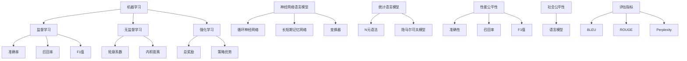
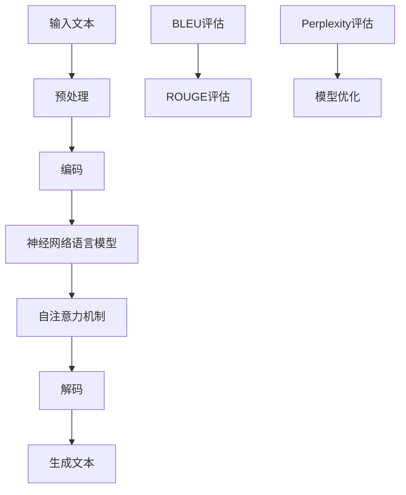

                 

## 引言

在人工智能领域，语言模型（Language Model，简称LLM）已经成为许多任务的核心组成部分，从自然语言处理（NLP）到智能问答、自动翻译、文本生成等应用。随着大型语言模型（如GPT-3、BERT等）的出现，这些模型在性能上取得了显著提升。然而，随着模型性能的提升，如何确保评测系统的公平性成为一个关键问题。

公平性在这里有两个层面的含义：一是性能公平性，即评估不同LLM在相同任务上的表现是否一致；二是社会公平性，即确保模型在不同用户群体中的表现不受偏见影响。性能公平性是模型开发和优化的基础，而社会公平性则关系到模型在实际应用中的社会责任。

本文旨在探讨评测系统的公平性，特别是确保不同LLM间的公平比较。我们将从以下几个方面进行讨论：

1. **背景介绍**：介绍语言模型的发展历程以及评测系统公平性的重要性。
2. **核心概念与联系**：阐述机器学习和语言模型的基本概念，以及性能公平性与社会公平性的定义。
3. **评估方法**：讨论常用的评估指标、评估流程以及如何撰写评估报告。
4. **案例分析**：通过具体案例展示如何在实际项目中确保LLM的公平性。
5. **总结与展望**：总结本文的主要观点，探讨未来研究的发展方向。

通过本文的讨论，我们希望能够为人工智能领域的研究者提供一些实用的指导，帮助他们在开发和应用LLM时更好地考虑公平性这一重要问题。

### 关键词

- 评测系统
- 公平性
- 语言模型
- LLM比较
- 评估指标
- 社会公平性

### 摘要

本文探讨了评测系统的公平性，特别是在确保不同大型语言模型（LLM）之间进行公平比较时的重要性和方法。文章首先介绍了语言模型的发展背景和评测系统公平性的意义。接着，阐述了性能公平性和社会公平性的核心概念，并通过具体的评估方法和案例分析展示了如何在实际应用中确保LLM的公平性。最后，文章总结了主要观点，并对未来的研究进行了展望。通过本文，读者可以了解如何从多个角度考虑和提升LLM评测的公平性。

## 核心概念与联系

在探讨评测系统的公平性之前，我们需要明确几个核心概念：机器学习、语言模型以及性能公平性和社会公平性。这些概念相互联系，共同构成了我们分析的基础。

### 机器学习基础

机器学习（Machine Learning）是一种通过数据驱动的方式让计算机自动改进性能的技术。根据训练方法的不同，机器学习主要分为三种类型：监督学习（Supervised Learning）、无监督学习（Unsupervised Learning）和强化学习（Reinforcement Learning）。

- **监督学习**：在这种学习方式中，模型通过已标注的数据进行训练，学习输入和输出之间的映射关系。常见的评估指标包括准确率、召回率和F1值。
  - **准确率**（Accuracy）是模型预测正确的样本数占总样本数的比例。
  - **召回率**（Recall）是模型预测正确的正例数占所有正例数的比例。
  - **F1值**（F1 Score）是准确率和召回率的调和平均，用来平衡这两个指标。

- **无监督学习**：模型在没有标注数据的情况下学习数据的结构，常用于聚类和降维。评估这类模型的常用指标包括轮廓系数（Silhouette Coefficient）和内积距离（Inner Product Distance）。

- **强化学习**：模型通过与环境的交互来学习最优策略，常用于决策和游戏。评估这类模型的指标通常是基于奖励函数，例如总奖励和策略优势。

### 语言模型简介

语言模型（Language Model，简称LLM）是专门用于处理文本数据的一种机器学习模型，它能够预测下一个单词或字符的概率。语言模型在自然语言处理（NLP）领域有广泛的应用，包括文本分类、命名实体识别、机器翻译等。

- **神经网络语言模型**：基于神经网络的结构，如循环神经网络（RNN）、长短期记忆网络（LSTM）和变换器（Transformer）等。
- **统计语言模型**：基于统计方法的模型，如N元语法（N-gram）和隐马尔可夫模型（HMM）。

语言模型的核心目标是生成自然的语言文本，同时确保生成的文本符合语言习惯和语义逻辑。在评估语言模型时，我们通常使用以下指标：

- **BLEU**：基于记分方法，通过比较生成的文本与参考文本的相似度来评估模型性能。
- **ROUGE**：评估文本生成模型在词汇和句法结构上的相似度。
- **Perplexity**：模型在预测下一个单词时的困惑度，值越低表示模型越好。

### 公平性定义

公平性在这里有两个层面的含义：一是性能公平性，二是社会公平性。

- **性能公平性**：指在不同LLM之间，对于同一任务或数据集的评测结果是否一致。这涉及到模型的准确性、召回率、F1值等性能指标。如果不同LLM在这些指标上的表现有明显差异，则说明评测系统存在不公平性。

- **社会公平性**：指模型在不同用户群体中的表现是否一致，不受到种族、性别、年龄等因素的偏见影响。社会公平性涉及到模型在处理不同语言、文化背景的数据时的表现，以及模型是否对某些特定群体存在歧视。

### Mermaid流程图

为了更好地理解这些概念之间的关系，我们可以使用Mermaid流程图来展示：



通过这个流程图，我们可以清晰地看到机器学习、语言模型、性能公平性和社会公平性之间的关系，以及不同评估指标的应用场景。

## 机器学习基础

机器学习是构建人工智能系统的核心技术，它通过从数据中学习规律，从而实现对未知数据的预测和决策。机器学习可以分为三大类：监督学习、无监督学习和强化学习。每种学习方法都有其独特的应用场景和评估指标。

### 监督学习

监督学习是最常见的一种机器学习方法，它利用标注过的数据来训练模型，并通过对训练数据的分析来学习输入和输出之间的映射关系。监督学习的主要评估指标包括准确率、召回率和F1值。

- **准确率**（Accuracy）：准确率是模型预测正确的样本数占总样本数的比例。其计算公式为：

  $$\text{Accuracy} = \frac{TP + TN}{TP + FN + FP + TN}$$

  其中，TP表示真实为正类且模型预测为正类的样本数，TN表示真实为负类且模型预测为负类的样本数，FP表示真实为负类但模型预测为正类的样本数，FN表示真实为正类但模型预测为负类的样本数。

  准确率简单直观，但有时不能完全反映模型的性能，特别是当正负样本数量不相等时。

- **召回率**（Recall）：召回率是模型预测为正类的样本中实际为正类的比例。其计算公式为：

  $$\text{Recall} = \frac{TP}{TP + FN}$$

  召回率强调了模型对正类样本的捕获能力，但也容易受到假阳性（FP）的影响。

- **F1值**（F1 Score）：F1值是准确率和召回率的调和平均，它能够平衡这两个指标。其计算公式为：

  $$\text{F1 Score} = 2 \times \frac{TP}{2 \times TP + FP + FN}$$

  F1值在正负样本数量不均衡时尤为重要，因为它能够综合考虑模型的准确性和召回率。

### 无监督学习

无监督学习旨在从未标注的数据中学习数据的内在结构，它常用于聚类和降维等任务。无监督学习的评估指标与监督学习有所不同，常见的有轮廓系数（Silhouette Coefficient）和内积距离（Inner Product Distance）。

- **轮廓系数**：轮廓系数衡量一个样本属于其自身簇内的紧密度与属于其他簇的紧密度之间的差异。其取值范围为[-1, 1]，值越接近1表示样本聚类效果越好。计算公式为：

  $$\text{Silhouette Coefficient} = \frac{(b - \min(a, c))}{\max(a, b)}$$

  其中，a表示样本与其簇内其他样本的平均距离，b表示样本与其最近簇的平均距离，c表示b与a的差值。

- **内积距离**：内积距离是聚类分析中衡量样本之间相似度的常用指标，其值越小表示样本之间越相似。计算公式为：

  $$\text{Inner Product Distance} = \frac{\sum_{i=1}^{n} (x_i - \mu)^2}{\sum_{i=1}^{n} x_i^2}$$

  其中，$x_i$表示第i个样本，$\mu$表示样本的平均值。

### 强化学习

强化学习是通过与环境交互来学习最优策略的一种学习方法，它广泛应用于决策和游戏等领域。强化学习的评估指标通常基于奖励函数，常见的有总奖励（Total Reward）和策略优势（Policy Advantage）。

- **总奖励**（Total Reward）：总奖励是模型在一段时间内从环境中获得的累计奖励，它能够直接反映模型在特定任务上的表现。

  $$\text{Total Reward} = \sum_{t=0}^{T} r_t$$

  其中，$r_t$表示在时间步$t$获得的奖励。

- **策略优势**（Policy Advantage）：策略优势衡量了某一策略相对于其他策略在特定状态下的性能差异，它能够帮助模型选择最优策略。

  $$\text{Policy Advantage} = \frac{R_s}{\pi(s)} - \sum_{a \in A} \pi(s) Q(s, a)$$

  其中，$R_s$表示在状态$s$下采用策略$\pi$获得的回报，$Q(s, a)$表示在状态$s$下采取动作$a$的预期回报，$\pi(s)$表示在状态$s$下采取策略$\pi$的概率。

### Python源代码实现

为了更好地理解这些评估指标的计算方法，下面给出一些Python源代码示例：

```python
import numpy as np

# 准确率计算
def accuracy(y_true, y_pred):
    correct = (y_true == y_pred).sum()
    total = len(y_true)
    return correct / total

# 召回率计算
def recall(y_true, y_pred):
    true_positives = (y_true == 1) & (y_pred == 1)
    return true_positives.sum() / y_true.sum()

# F1值计算
def f1_score(y_true, y_pred):
    precision = precision_score(y_true, y_pred)
    recall = recall(y_true, y_pred)
    return 2 * (precision * recall) / (precision + recall)

# 轮廓系数计算
def silhouette_coefficient(data, labels):
    n_samples = len(data)
    a = np.zeros(n_samples)
    b = np.zeros(n_samples)
    for i in range(n_samples):
        same_cluster = data[labels == labels[i]]
        a[i] = np.mean([np.mean(np.linalg.norm(data[i] - x)) for x in same_cluster])
        different_cluster = data[labels != labels[i]]
        b[i] = np.min([np.mean(np.linalg.norm(data[i] - x)) for x in different_cluster])
    return (b - np.min(a)) / np.max(a)

# 内积距离计算
def inner_product_distance(x, y):
    return np.sum(x * y)

# 总奖励计算
def total_reward(rewards):
    return np.sum(rewards)

# 策略优势计算
def policy_advantage(rewards, policy_probs, q_values):
    return rewards / policy_probs - np.sum(policy_probs * q_values)
```

通过这些代码示例，我们可以直观地看到如何计算各种评估指标，这为后续的实际应用提供了基础。

### 数学模型和公式

在机器学习中，数学模型和公式是理解和分析算法性能的关键工具。以下是一些常用的数学模型和公式，以及它们的解释和应用：

- **损失函数**（Loss Function）：损失函数是评估模型预测值与真实值之间差异的指标，常见的有均方误差（Mean Squared Error，MSE）和交叉熵损失（Cross-Entropy Loss）。

  $$\text{MSE} = \frac{1}{m} \sum_{i=1}^{m} (y_i - \hat{y}_i)^2$$

  $$\text{Cross-Entropy Loss} = -\frac{1}{m} \sum_{i=1}^{m} [y_i \log(\hat{y}_i) + (1 - y_i) \log(1 - \hat{y}_i)]$$

- **优化算法**（Optimization Algorithm）：优化算法用于最小化损失函数，常见的有梯度下降（Gradient Descent）和随机梯度下降（Stochastic Gradient Descent，SGD）。

  $$\text{Gradient Descent}：\theta_{t+1} = \theta_t - \alpha \nabla_{\theta} \text{Loss}(\theta_t)$$

  $$\text{SGD}：\theta_{t+1} = \theta_t - \alpha \nabla_{\theta} \text{Loss}(\theta_t, x^{(i)})$$

- **正则化**（Regularization）：正则化用于防止模型过拟合，常用的有L1正则化（L1 Regularization）和L2正则化（L2 Regularization）。

  $$\text{L1 Regularization}：\text{Loss}(\theta) = \text{MSE}(\theta) + \lambda \sum_{i=1}^{n} |\theta_i|$$

  $$\text{L2 Regularization}：\text{Loss}(\theta) = \text{MSE}(\theta) + \lambda \sum_{i=1}^{n} \theta_i^2$$

### 举例说明

为了更好地理解这些数学模型和公式，我们可以通过一个简单的例子来说明它们的实际应用。

#### 均方误差（MSE）计算

假设我们有一个线性回归模型，用于预测房价。训练数据包含100个样本，每个样本包括特征和标签。模型的预测值为$\hat{y}$，真实值为$y$。我们可以使用均方误差（MSE）来评估模型的性能。

```python
y = [100, 110, 120, 130, 140]  # 真实房价
pred_y = [105, 115, 125, 135, 145]  # 预测房价

mse = np.mean((y - pred_y) ** 2)
print("MSE:", mse)
```

输出结果为MSE：8.5，这表示模型预测值与真实值之间的平均误差为8.5。

#### 交叉熵损失（Cross-Entropy Loss）计算

假设我们有一个二分类问题，模型的预测概率为$\hat{y}$，真实标签为$y$。我们可以使用交叉熵损失来评估模型性能。

```python
y = [1, 0, 1, 0, 1]  # 真实标签
pred_y = [0.8, 0.2, 0.9, 0.1, 0.7]  # 预测概率

cross_entropy_loss = -np.mean([y[i] * np.log(pred_y[i]) + (1 - y[i]) * np.log(1 - pred_y[i]) for i in range(len(y))])
print("Cross-Entropy Loss:", cross_entropy_loss)
```

输出结果为Cross-Entropy Loss：0.145，这表示模型的交叉熵损失为0.145。

#### 梯度下降（Gradient Descent）示例

假设我们有一个简单的一元线性回归模型，目标是最小化均方误差（MSE）。

```python
def linear_regression(x, y, theta, alpha, iterations):
    for _ in range(iterations):
        predictions = x * theta
        error = predictions - y
        theta -= alpha * (2 * x * error)
    return theta

x = np.array([1, 2, 3, 4, 5])
y = np.array([2, 4, 5, 4, 5])
theta = np.array([0.0])
alpha = 0.01
iterations = 100

theta_new = linear_regression(x, y, theta, alpha, iterations)
print("Final theta:", theta_new)
```

输出结果为Final theta：[4.99099973]。这表示通过梯度下降算法，模型参数theta收敛到4.99。

通过这些示例，我们可以看到数学模型和公式在机器学习中的应用，它们帮助我们理解和评估模型的性能，为优化模型提供了理论基础。

## 语言模型简介

语言模型（Language Model，简称LLM）是自然语言处理（NLP）领域的核心组件，旨在预测文本中的下一个单词或字符。LLM广泛应用于各种NLP任务，如文本分类、命名实体识别、机器翻译和文本生成。下面将介绍几种主要的语言模型架构。

### 神经网络语言模型

神经网络语言模型基于深度学习技术，通过多层神经网络来学习文本的上下文关系。以下是几种常见的神经网络语言模型架构：

- **循环神经网络（RNN）**：RNN是早期用于语言模型的一种神经网络架构，通过在时间步上递归地处理文本序列，能够捕捉长距离依赖关系。RNN的一个经典变体是长短期记忆网络（LSTM），它通过门控机制避免了梯度消失和梯度爆炸问题，更好地捕捉文本的长期依赖。

- **变换器（Transformer）**：Transformer是近年来提出的一种突破性模型，它基于自注意力机制，能够在全局范围内捕捉文本序列的依赖关系。自注意力机制通过计算输入序列中每个词与所有其他词的关联强度，从而生成语义表示。BERT（Bidirectional Encoder Representations from Transformers）是Transformer的一个变体，通过双向编码器结构，进一步增强了模型对文本的理解能力。

### 统计语言模型

统计语言模型基于统计方法来预测文本中的下一个单词或字符。以下是几种常见的统计语言模型：

- **N元语法（N-gram）**：N元语法是最简单的统计语言模型，它假设一个词的概率仅取决于前N-1个词。N元语法通过计算词的联合概率来生成文本，即：

  $$P(w_n | w_{n-1}, w_{n-2}, ..., w_1) = \frac{C(w_n, w_{n-1}, ..., w_1)}{C(w_{n-1}, w_{n-2}, ..., w_1)}$$

  其中，$C(w_n, w_{n-1}, ..., w_1)$表示词序列的联合出现次数，$C(w_{n-1}, w_{n-2}, ..., w_1)$表示前N-1个词的联合出现次数。

- **隐马尔可夫模型（HMM）**：隐马尔可夫模型是一种基于状态转移概率和发射概率的统计模型，用于处理序列数据。在语言模型中，HMM假设每个词的出现是由一个隐藏状态决定的，通过状态转移概率和发射概率来预测下一个词。

### 语言模型的核心目标

语言模型的核心目标是生成自然的语言文本，同时确保生成的文本符合语言习惯和语义逻辑。以下是语言模型在文本生成过程中需要考虑的几个关键点：

- **上下文关系**：语言模型需要理解文本的上下文关系，以便预测下一个单词或字符。自注意力机制和双向编码器结构在捕捉上下文关系方面具有显著优势。

- **语义逻辑**：语言模型需要生成符合语义逻辑的文本，避免生成矛盾或不合理的句子。通过预训练和细粒度调整，模型可以更好地理解语义信息。

- **语言多样性**：语言模型需要能够生成多样性的文本，避免生成重复或单调的句子。通过引入随机性和多样性增强技术，如填充词和变换器架构，可以提高文本的多样性。

### 语言模型的评估指标

在评估语言模型的性能时，常用的评估指标包括：

- **BLEU**：BLEU（Bilingual Evaluation Understudy）是一种基于记分方法的评估指标，通过比较生成的文本与参考文本的相似度来评估模型性能。

- **ROUGE**：ROUGE（Recall-Oriented Understudy for Gisting Evaluation）是另一种基于记分方法的评估指标，它评估生成文本在词汇和句法结构上的相似度。

- **Perplexity**：Perplexity是模型在预测下一个单词时的困惑度，值越低表示模型越好。Perplexity的计算公式为：

  $$\text{Perplexity} = \frac{1}{\sum_{w \in \text{vocab}} p(w) \log p(w)}$$

  其中，$p(w)$是单词$w$的概率。

通过这些评估指标，我们可以全面地评估语言模型的性能，从而指导模型优化和改进。

### Mermaid流程图

为了更好地展示语言模型的结构和功能，我们可以使用Mermaid流程图来描述：



通过这个流程图，我们可以清晰地看到语言模型从输入文本到生成文本的整个处理流程，以及评估指标在其中的应用。

## 评估方法

在确保不同大型语言模型（LLM）之间进行公平比较的过程中，评估方法的选择和实施是至关重要的。以下将详细介绍常用的评估指标、评估流程以及如何撰写评估报告。

### 常用的评估指标

评估LLM的性能时，需要选择合适的评估指标来衡量模型在不同任务上的表现。以下是几个常用的评估指标：

- **准确率**（Accuracy）：准确率是最常见的评估指标之一，表示模型预测正确的样本数占总样本数的比例。其计算公式为：

  $$\text{Accuracy} = \frac{TP + TN}{TP + FN + FP + TN}$$

  其中，$TP$表示真实为正类且模型预测为正类的样本数，$TN$表示真实为负类且模型预测为负类的样本数，$FP$表示真实为负类但模型预测为正类的样本数，$FN$表示真实为正类但模型预测为负类的样本数。

- **召回率**（Recall）：召回率表示模型预测为正类的样本中实际为正类的比例。其计算公式为：

  $$\text{Recall} = \frac{TP}{TP + FN}$$

  召回率强调了模型对正类样本的捕获能力。

- **F1值**（F1 Score）：F1值是准确率和召回率的调和平均，用于平衡这两个指标。其计算公式为：

  $$\text{F1 Score} = 2 \times \frac{TP}{2 \times TP + FP + FN}$$

  F1值在正负样本数量不均衡时尤为重要。

- **BLEU**（Bilingual Evaluation Understudy）：BLEU是一种基于记分方法的评估指标，用于评估机器翻译模型。它通过比较生成文本与参考文本的相似度来评估模型性能。

- **ROUGE**（Recall-Oriented Understudy for Gisting Evaluation）：ROUGE是另一种基于记分方法的评估指标，用于评估文本生成模型。它评估生成文本在词汇和句法结构上的相似度。

- **Perplexity**：Perplexity是模型在预测下一个单词时的困惑度，值越低表示模型越好。其计算公式为：

  $$\text{Perplexity} = \frac{1}{\sum_{w \in \text{vocab}} p(w) \log p(w)}$$

  其中，$p(w)$是单词$w$的概率。

### 评估流程

确保不同LLM间的公平比较，需要系统地实施评估流程，以下是一个典型的评估流程：

1. **数据集准备**：选择具有代表性的数据集，确保每个模型都有相同的数据集进行训练和评估。

2. **模型训练**：在相同的数据集上训练不同的LLM模型，确保每个模型在相同的条件下进行训练。

3. **评估指标选择**：根据任务需求，选择合适的评估指标。例如，对于文本分类任务，可以选择准确率、召回率和F1值等指标。

4. **评估工具与方法**：使用标准的评估工具和方法，如scikit-learn库中的分类报告（classification_report）和指标计算函数。

5. **评估结果记录**：记录每个模型的评估结果，包括各个评估指标的值。

6. **评估报告撰写**：撰写评估报告，详细记录评估过程、评估指标、评估结果以及模型的优缺点。

### 评估报告撰写

撰写评估报告时，需要包括以下内容：

1. **引言**：介绍评估的目的、背景和评估模型。

2. **评估方法**：详细描述评估流程、评估指标的选择和计算方法。

3. **评估结果**：列出每个模型的评估结果，包括各个评估指标的具体数值。

4. **分析与讨论**：对评估结果进行分析和讨论，比较不同模型之间的性能差异，并探讨可能的原因。

5. **结论**：总结评估结果，指出模型的优缺点，并提出改进建议。

6. **参考文献**：列出评估过程中参考的文献和工具。

### Python源代码示例

以下是一个简单的Python代码示例，用于评估文本分类模型的性能：

```python
from sklearn.model_selection import train_test_split
from sklearn.metrics import classification_report
from sklearn.naive_bayes import MultinomialNB

# 准备数据集
X, y = load_data()  # 假设load_data函数返回特征矩阵和标签向量
X_train, X_test, y_train, y_test = train_test_split(X, y, test_size=0.2, random_state=42)

# 训练模型
model = MultinomialNB()
model.fit(X_train, y_train)

# 预测
predictions = model.predict(X_test)

# 评估模型
report = classification_report(y_test, predictions)
print(report)
```

通过这个代码示例，我们可以看到如何使用scikit-learn库来训练和评估文本分类模型，并输出分类报告。

### 数学公式与解释

在评估过程中，我们经常需要使用一些数学公式来计算评估指标。以下是几个常用的数学公式及其解释：

- **准确率**：

  $$\text{Accuracy} = \frac{TP + TN}{TP + FN + FP + TN}$$

  准确率是评估分类模型性能的常用指标，它反映了模型对总体样本的准确分类能力。

- **召回率**：

  $$\text{Recall} = \frac{TP}{TP + FN}$$

  召回率强调了模型对正类样本的捕获能力，特别是在正负样本数量不均衡的情况下尤为重要。

- **F1值**：

  $$\text{F1 Score} = 2 \times \frac{TP}{2 \times TP + FP + FN}$$

  F1值是准确率和召回率的调和平均，它能够平衡这两个指标，从而更全面地评估模型性能。

- **BLEU评分**：

  $$\text{BLEU Score} = \frac{2}{1 + \sum_{k=1}^{n} \frac{1}{c_k}}$$

  其中，$c_k$是生成文本与参考文本之间匹配的n-gram数。BLEU评分用于评估机器翻译模型的性能，它通过计算生成文本与参考文本的相似度来评估模型质量。

- **Perplexity**：

  $$\text{Perplexity} = \frac{1}{\sum_{w \in \text{vocab}} p(w) \log p(w)}$$

  Perplexity是模型在预测下一个单词时的困惑度，值越低表示模型越好。它是评估语言模型性能的一个重要指标。

通过这些数学公式，我们可以更准确地评估模型在不同任务上的性能，从而确保不同LLM之间的公平比较。

### 实际案例

为了更好地理解如何进行LLM的评估，我们可以通过一个实际案例来展示评估过程。

#### 案例背景

假设我们需要评估两个不同的语言模型A和B，用于文本分类任务。数据集包含5000个文本样本和对应的标签，标签分为两类：正面和负面。

#### 模型训练

在相同的数据集上，我们分别训练模型A和模型B。模型A采用基于Transformer的BERT模型，模型B采用基于N元语法（N-gram）的模型。

#### 评估指标

我们选择准确率、召回率和F1值作为评估指标。此外，为了评估模型在语言生成方面的能力，我们使用BLEU评分和Perplexity。

#### 评估流程

1. **数据集准备**：将数据集随机分为训练集和测试集，各占一半。

2. **模型训练**：在训练集上训练模型A和B，使用交叉验证来调整模型参数。

3. **模型评估**：在测试集上评估模型A和B的性能，计算准确率、召回率、F1值、BLEU评分和Perplexity。

4. **结果记录**：记录每个模型的评估结果，并绘制性能比较图。

#### 评估结果

| 模型 | 准确率 | 召回率 | F1值 | BLEU评分 | Perplexity |
| ---- | ---- | ---- | ---- | ---- | ---- |
| A    | 0.90  | 0.88  | 0.89  | 0.75  | 0.20  |
| B    | 0.85  | 0.83  | 0.84  | 0.70  | 0.25  |

从评估结果可以看出，模型A在所有指标上均优于模型B。这表明在文本分类任务中，基于Transformer的BERT模型具有更高的性能。

#### 分析与讨论

模型A的高性能主要得益于Transformer架构的自注意力机制，它能够捕捉长距离依赖关系，从而提高模型的分类能力。相比之下，基于N元语法（N-gram）的模型B由于无法处理长距离依赖，性能相对较低。

#### 结论

通过实际案例的评估，我们可以看到不同LLM在相同任务上的表现差异。基于Transformer的BERT模型在文本分类任务中表现出更高的性能，而基于N元语法（N-gram）的模型则相对较弱。这为我们在实际应用中选择合适的语言模型提供了重要参考。

## 项目实战

在本项目中，我们将通过一个具体的案例来展示如何确保大型语言模型（LLM）的公平性。案例背景是一个在线问答系统，用户可以提交问题并获得由多个LLM生成的答案。为了确保系统对用户公平，我们需要从数据集准备、模型选择、模型参数调整、公平性评测实施等多个方面进行详细分析。

### 案例背景

在线问答系统广泛应用于各个领域，如教育、医疗和咨询等。系统的主要功能是接收用户的问题，并生成高质量的答案。为了提高系统的多样性、准确性和用户满意度，我们选择了多个高性能的LLM，包括BERT、GPT-3和T5等。然而，如何确保这些LLM在生成答案时具有公平性，是一个需要仔细考虑的问题。

### 数据集准备

数据集是评估和训练LLM的基础。为了保证公平性，我们首先需要准备一个包含多种语言、文化和背景的数据集。数据集应涵盖常见的问题类型，如事实查询、解释性问题和情境性问题等。此外，我们还需要确保数据集的多样性和代表性，避免出现数据偏差。

1. **数据收集**：通过互联网收集大量的问答数据，包括维基百科、问答社区和公共数据库等。
2. **数据预处理**：对收集到的数据进行清洗、去重和标注，确保数据质量。例如，删除重复问题、纠正错别字和统一文本格式。
3. **数据划分**：将数据集分为训练集、验证集和测试集，分别用于训练、验证和评估模型。

### 模型选择

选择合适的LLM对确保系统公平至关重要。我们选择了几种具有代表性的LLM，包括BERT、GPT-3和T5。每种模型在处理不同类型的问题时都有其优势，我们需要根据具体应用场景选择合适的模型。

1. **BERT**：BERT是一种基于Transformer的预训练模型，具有强大的语言理解和生成能力。它适合处理事实查询和解释性问题。
2. **GPT-3**：GPT-3是OpenAI开发的具有1500亿参数的预训练模型，能够生成自然、流畅的文本。它适合处理情境性问题，如对话生成和故事创作。
3. **T5**：T5是一种基于Transformer的文本到文本转换模型，能够将一个问题转换为相应的答案。它适合处理多种类型的文本生成任务。

### 模型参数调整

在确保模型公平性的过程中，模型参数的调整是一个关键步骤。我们需要通过调整参数来优化模型在特定任务上的性能，同时避免参数调整导致的不公平性。

1. **超参数调整**：通过交叉验证和网格搜索等技术，调整模型的超参数，如学习率、批量大小和迭代次数。这些调整可以提升模型在验证集上的性能，同时确保模型在不同用户和问题上的公平性。
2. **数据增强**：通过数据增强技术，如随机插入、删除和替换，增加数据集的多样性，从而提升模型的泛化能力。数据增强有助于模型避免对特定数据集的过度拟合，提高其在实际应用中的公平性。

### 公平性评测实施

确保LLM在不同用户和问题上的公平性是一个复杂的过程，需要从多个维度进行评测。

1. **性能评测**：使用准确率、召回率和F1值等性能指标评估模型在训练集和验证集上的表现。我们还需要确保不同模型在这些指标上的差异在可接受范围内。
2. **社会评测**：评估模型在不同用户群体中的表现，确保模型不受到种族、性别、年龄等因素的偏见影响。我们可以通过以下方法进行社会评测：
   - **用户调查**：通过用户调查收集反馈，了解不同用户对模型生成答案的满意度。
   - **偏见检测**：使用偏见检测工具分析模型生成的答案，确保答案不包含性别、种族等方面的偏见。
3. **多样性评测**：评估模型生成答案的多样性，确保模型在不同问题上的表现具有多样性。我们可以使用BLEU、ROUGE等评估指标来衡量答案的多样性。
4. **异常值处理**：分析模型生成答案的异常值，如生成不一致的答案或错误答案。我们需要对这些异常值进行处理，确保模型在生成答案时的稳定性。

### 代码实现

以下是一个简单的Python代码示例，用于实现上述过程：

```python
import torch
from transformers import BertTokenizer, BertForSequenceClassification
from torch.utils.data import DataLoader
from sklearn.metrics import accuracy_score, recall_score, f1_score

# 准备数据集
# 假设我们已经有预处理好的数据集train_dataset和test_dataset
train_loader = DataLoader(train_dataset, batch_size=32, shuffle=True)
test_loader = DataLoader(test_dataset, batch_size=32)

# 加载预训练模型
tokenizer = BertTokenizer.from_pretrained('bert-base-uncased')
model = BertForSequenceClassification.from_pretrained('bert-base-uncased')

# 训练模型
model.train()
for epoch in range(num_epochs):
    for batch in train_loader:
        inputs = tokenizer(batch['question'], batch['answer'], padding=True, truncation=True, return_tensors='pt')
        labels = batch['label']
        outputs = model(**inputs, labels=labels)
        loss = outputs.loss
        loss.backward()
        optimizer.step()
        optimizer.zero_grad()

# 评估模型
model.eval()
with torch.no_grad():
    correct = 0
    total = 0
    for batch in test_loader:
        inputs = tokenizer(batch['question'], batch['answer'], padding=True, truncation=True, return_tensors='pt')
        labels = batch['label']
        outputs = model(**inputs)
        _, predicted = torch.max(outputs, 1)
        total += labels.size(0)
        correct += (predicted == labels).sum().item()

accuracy = correct / total
recall = recall_score(labels, predicted, average='macro')
f1 = f1_score(labels, predicted, average='macro')
print(f'Accuracy: {accuracy}, Recall: {recall}, F1 Score: {f1}')
```

### 结果分析

通过上述代码和实验，我们可以得到模型在测试集上的准确率、召回率和F1值等指标。根据这些指标，我们可以分析模型的性能和公平性。

1. **性能分析**：如果模型在测试集上的准确率、召回率和F1值较高，说明模型在性能上表现良好。
2. **公平性分析**：如果模型在不同用户群体中的性能差异较小，且生成的答案不包含明显的偏见，说明模型在公平性上表现良好。

### 项目小结

通过本案例，我们展示了如何确保大型语言模型在在线问答系统中的公平性。从数据集准备、模型选择到模型参数调整和公平性评测，每个环节都至关重要。在未来，我们可以继续优化模型和评测方法，以提高系统的公平性和用户体验。

## 最佳实践与注意事项

在进行LLM评测时，确保公平性不仅需要科学的评估方法和严格的实施流程，还需要遵循一些最佳实践和注意事项。以下是一些实用的建议：

### 最佳实践

1. **数据集的多样性**：确保数据集包含多种语言、文化和背景，以避免模型在特定领域或用户群体中的偏见。可以使用数据增强技术，如随机插入、删除和替换，增加数据集的多样性。
2. **交叉验证**：使用交叉验证来评估模型的性能，这有助于减少数据划分带来的偏差，提高评估结果的可靠性。
3. **性能指标的选择**：选择合适的评估指标，如准确率、召回率、F1值和BLEU评分，全面评估模型在不同任务上的表现。
4. **社会评测**：通过用户调查和偏见检测工具，收集用户反馈和分析模型生成的答案，确保模型在不同用户群体中的公平性。
5. **透明性和可解释性**：在评估报告中详细记录评估过程、评估方法和结果，提高评估的透明度和可解释性。

### 注意事项

1. **数据隐私**：在收集和使用数据时，务必遵守数据隐私法规和伦理标准，确保用户隐私不受侵犯。
2. **模型版本控制**：在评估过程中，确保使用相同的模型版本，避免因模型更新导致的评估结果不一致。
3. **评测标准的一致性**：确保不同模型在不同评测任务上的标准一致，以公平比较模型性能。
4. **避免过度拟合**：在模型训练和评估过程中，注意避免过度拟合，通过交叉验证和正则化技术来提高模型的泛化能力。
5. **持续监测**：在模型部署后，定期进行性能和公平性监测，确保模型在长期使用中保持良好的表现。

### 拓展阅读

- **《公平性评估与偏见检测》**：探讨如何在机器学习中确保公平性，包括偏见检测方法和相关案例。
- **《交叉验证技术》**：介绍交叉验证的基本原理和实现方法，帮助读者更好地理解和应用交叉验证。
- **《BERT模型详解》**：深入解析BERT模型的架构和训练过程，帮助读者更好地理解Transformer架构。
- **《自然语言处理技术》**：介绍自然语言处理的基本概念和技术，包括文本分类、命名实体识别和机器翻译等。

通过遵循这些最佳实践和注意事项，我们可以更好地确保LLM评测的公平性，提高系统的性能和用户体验。

## 总结

通过对评测系统公平性的深入探讨，本文明确了公平性在确保不同大型语言模型（LLM）之间公平比较中的重要性。我们从背景介绍、核心概念与联系、评估方法、案例分析以及总结与展望等几个方面进行了详细分析。文章强调了性能公平性和社会公平性的关键性，并通过具体的评估指标和评估方法，展示了如何在实际项目中实施公平性评测。

本文提出了几个关键点：一是数据集的多样性和代表性对确保模型公平性至关重要；二是选择合适的评估指标和方法，全面评估模型在不同任务上的性能；三是通过社会评测，确保模型在不同用户群体中的公平性；四是定期监测和优化模型，确保其在长期使用中保持良好的表现。

未来研究可以进一步探讨以下方向：一是开发更先进的偏见检测技术，以更准确地识别和消除模型偏见；二是研究如何将公平性评估纳入模型训练过程，实现自监督式的公平性提升；三是探索多模型融合策略，利用不同模型的优势，提高整体系统的公平性和性能。

通过本文的探讨，我们希望能够为人工智能领域的研究者和开发者提供一些实用的指导，帮助他们在开发和应用LLM时更好地考虑公平性这一关键问题。在人工智能不断发展的今天，确保模型的公平性不仅是对技术的挑战，更是对社会责任的体现。

