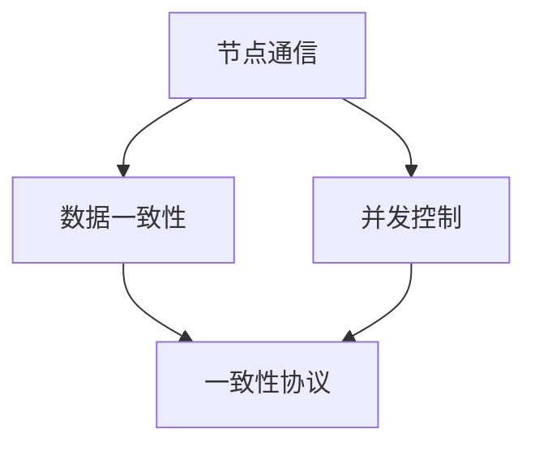

                 

# 《评测系统的分布式架构：支持大规模并行评测的设计》

## 关键词
- 分布式架构
- 并行评测
- 负载均衡
- 容错机制
- 数据一致性
- 性能优化

## 摘要
本文深入探讨了评测系统的分布式架构设计，特别是如何支持大规模并行评测。我们将从分布式系统的基础知识开始，逐步讲解并行评测的原理、分布式架构中的关键技术，以及实际案例研究。通过详细的算法讲解、Python源代码示例和数学模型，本文旨在为读者提供一个清晰、结构化的学习路径，帮助他们理解和设计高效、可靠的评测系统。

## 引言

在当今大数据时代，评测系统面临着日益增长的挑战。随着数据量的急剧增加，传统的集中式评测系统已经难以满足处理需求。分布式架构作为一种解决方案，能够有效地支持大规模并行评测，提高系统的性能和可靠性。本文将系统地介绍分布式架构在评测系统中的应用，帮助读者了解如何设计高效、可靠的分布式评测系统。

### 分布式系统概述

分布式系统是指由多个节点组成的系统，这些节点通过网络相互连接，共同完成一个任务。与集中式系统相比，分布式系统具有以下特点：

- **扩展性**：分布式系统可以根据需求动态地添加或移除节点，从而实现水平扩展。
- **容错性**：当一个节点发生故障时，其他节点可以接管其任务，确保系统的高可用性。
- **并发性**：多个节点可以同时处理多个任务，提高了系统的并发处理能力。

### 并行评测的概念

并行评测是指多个评测任务同时执行，以提高整体评测效率。在分布式架构中，并行评测可以通过以下方式实现：

- **任务拆分**：将一个大任务拆分为多个小任务，分配给不同的节点执行。
- **数据并行**：将数据集拆分为多个子集，每个节点分别处理其对应的数据子集。
- **流水线并行**：将评测任务分解为多个阶段，每个阶段可以在不同的节点上并行执行。

### 核心概念与联系

分布式架构中的核心概念包括节点通信、数据一致性和并发控制。这些概念之间的关系可以通过以下 Mermaid 流程图来表示：



- **节点通信**：节点之间通过网络进行通信，传输数据和控制信息。
- **数据一致性**：保证多个节点上的数据保持一致，常用的协议有 Paxos 和 Raft。
- **并发控制**：管理多个节点之间的并发访问，常用的机制有锁和事务。

### 核心算法原理讲解

并行评测的核心算法通常包括并行数据流处理和并行算法设计原则。以下是一个简单的并行数据流处理算法的 Python 源代码示例，结合数学模型和公式进行详细讲解。

```python
# 并行数据流处理算法示例
def parallel_data_processing(data_chunks, num_workers):
    # 数据分片
    chunks_per_worker = len(data_chunks) // num_workers
    results = []

    # 数据并行处理
    for i in range(num_workers):
        worker_data = data_chunks[i * chunks_per_worker:(i + 1) * chunks_per_worker]
        result = process_data_chunk(worker_data)
        results.append(result)

    # 合并结果
    final_result = merge_results(results)
    return final_result

# 数据处理函数示例
def process_data_chunk(chunk):
    # 假设数据处理是一个计算量大的函数
    result = sum(chunk)  # 示例：计算数据之和
    return result

# 合并结果函数示例
def merge_results(results):
    return sum(results)

# 数学模型和公式
# 假设数据分片数量为 n，每个数据分片的大小为 m，则总数据处理时间为 T：
# T = n * (m * P + M)
# 其中 P 是单个数据处理时间，M 是结果合并时间。
```

在这个示例中，`parallel_data_processing` 函数将数据集拆分为多个子集，每个子集分配给一个工作节点处理。处理完成后，使用 `merge_results` 函数将所有结果合并。数学模型和公式描述了数据处理时间与数据分片数量、每个数据分片大小以及结果合并时间的关系。

### 项目实战

为了更好地理解分布式架构在并行评测中的应用，我们将探讨一个实际项目案例：一个在线编程评测系统。以下是一个项目实战的详细步骤：

#### 1. 开发环境搭建

- 选择合适的编程语言和开发工具，如 Python 和 IntelliJ IDEA。
- 安装分布式计算框架，如 Apache Spark。

#### 2. 源代码实现

- 设计分布式评测系统的架构，包括任务分发、数据存储、结果处理等模块。
- 实现并行数据流处理算法，包括数据分片、任务分配和结果合并。

#### 3. 代码解读与分析

- 详细解读关键代码段，如数据分片逻辑和结果合并逻辑。
- 分析并行评测系统的性能瓶颈和优化策略。

#### 4. 实际案例分析和详细讲解剖析

- 分析一个具体的评测任务，如代码性能评测。
- 讲解如何使用分布式架构实现并行评测，并分析评测结果。

#### 5. 项目小结

- 总结项目中的成功经验和挑战。
- 提出改进建议和最佳实践。

### 最佳实践 Tips、小结、注意事项、拓展阅读

- **最佳实践 Tips**：
  - 优化数据分片策略，提高并行处理效率。
  - 设计容错机制，确保评测系统的高可用性。
  - 定期进行系统性能评估和优化。

- **小结**：
  - 分布式架构在并行评测中具有显著的优势。
  - 合理的设计和优化可以提高评测系统的性能和可靠性。

- **注意事项**：
  - 考虑网络延迟和带宽对分布式架构的影响。
  - 确保数据一致性，避免数据冲突。

- **拓展阅读**：
  - 《大规模分布式存储系统设计与实践》
  - 《分布式系统原理与范型》
  - 《并行算法设计与分析》

通过本文的讲解，读者可以深入了解分布式架构在并行评测中的应用，学会如何设计和优化高效的评测系统。希望本文能为读者提供有价值的参考和指导。

## 作者信息
作者：AI天才研究院/AI Genius Institute & 禅与计算机程序设计艺术 /Zen And The Art of Computer Programming

