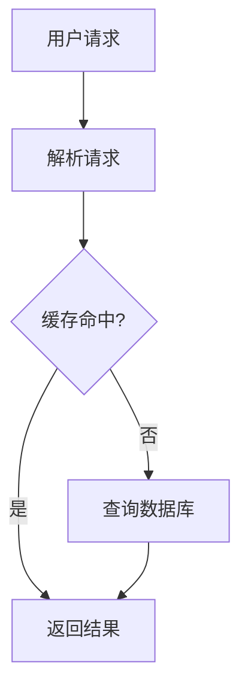

                 

### 《评测系统的分布式缓存优化》

#### **关键词：**

- 分布式缓存
- 评测系统
- 性能优化
- 数据一致性
- 安全性

#### **摘要：**

本文深入探讨了评测系统的分布式缓存优化问题。首先，介绍了分布式缓存的基本概念、原理和重要性，随后详细讲解了分布式缓存的核心算法，包括一致性哈希算法、LRU替换算法等。接着，讨论了分布式缓存系统中数据一致性问题和解决方案。随后，文章探讨了分布式缓存系统的性能优化策略，并分析了实际案例。此外，本文还探讨了分布式缓存系统的安全性问题，最后进行了总结和展望。文章旨在为读者提供一个全面、系统的分布式缓存优化指南。

----------------------------------------------------------------

### **目录**

1. 引言 <a id="introduction"></a>
2. 分布式缓存原理 <a id="cache-theory"></a>
3. 分布式缓存优化算法 <a id="optimization-algorithms"></a>
4. 分布式缓存系统性能优化 <a id="performance-optimization"></a>
5. 分布式缓存案例分析 <a id="case-studies"></a>
6. 分布式缓存安全性 <a id="cache-security"></a>
7. 总结与展望 <a id="summary"></a>

----------------------------------------------------------------

### **第1章 引言**

#### **1.1 分布式缓存的重要性**

分布式缓存是一种用于加速数据访问的技术，通过将数据存储在多个服务器中，能够显著提高数据读取速度和系统整体性能。在评测系统中，分布式缓存的应用尤为广泛，因为评测系统通常需要处理大量数据，并对数据进行快速访问和查询。

**分布式缓存的概念和作用：**

分布式缓存是将缓存数据分散存储在多个服务器节点上，通过一致性哈希算法等策略，实现数据的高效管理和快速访问。分布式缓存的主要作用包括：

- **加速数据访问：** 缓存数据存储在内存中，相较于磁盘访问速度有显著提升。
- **减少数据库压力：** 通过缓存机制，减少对数据库的直接访问，降低数据库的负载。
- **提高系统响应速度：** 减少数据访问延迟，提高系统整体性能。

**评测系统的需求与挑战：**

评测系统通常需要处理海量的数据，同时保证数据的高可用性和一致性。分布式缓存能够帮助评测系统解决以下挑战：

- **高并发访问：** 评测系统在运行过程中，可能面临大量用户的并发访问，分布式缓存能够有效应对高并发场景。
- **数据一致性：** 在分布式系统中，数据的一致性是一个重要问题，分布式缓存通过一致性哈希算法等策略，确保数据一致性。
- **系统扩展性：** 分布式缓存系统能够根据需求动态扩展，满足评测系统不断增长的数据规模。

**分布式缓存优化的必要性：**

分布式缓存优化是提升评测系统性能的关键。优化策略包括缓存命中率提升、缓存穿透和雪崩问题解决、数据压缩等。通过优化分布式缓存，可以进一步提高评测系统的响应速度和稳定性。

#### **1.2 本书概述**

**主要内容与结构：**

本书分为七个章节，内容结构如下：

- **第1章**：引言，介绍分布式缓存的重要性和评测系统的需求与挑战。
- **第2章**：分布式缓存原理，详细讲解分布式缓存的基本概念、原理和体系结构。
- **第3章**：分布式缓存优化算法，介绍一致性哈希算法、LRU替换算法等核心优化算法。
- **第4章**：分布式缓存系统性能优化，探讨性能优化策略和实际案例。
- **第5章**：分布式缓存案例分析，分析经典分布式缓存优化案例。
- **第6章**：分布式缓存安全性，讨论分布式缓存系统的安全性问题及优化策略。
- **第7章**：总结与展望，总结本书内容并展望未来发展趋势。

**读者对象和预期收益：**

本书适合从事分布式缓存开发和优化工作的工程师、架构师和技术管理者阅读。通过本书，读者可以：

- **深入理解分布式缓存的基本原理和优化策略。**
- **掌握分布式缓存系统的性能优化和安全性优化方法。**
- **通过案例分析，提升分布式缓存系统的实际应用能力。**

#### **1.3 分布式缓存优化技术概览**

**基本概念和原理：**

分布式缓存是将缓存数据分散存储在多个服务器节点上，通过一致性哈希算法等策略，实现数据的高效管理和快速访问。分布式缓存的基本原理包括：

- **缓存一致性：** 通过一致性哈希算法，保证缓存节点间的数据一致性。
- **缓存分区：** 将缓存数据分区存储，提高数据访问的局部性。
- **缓存替换策略：** 通过LRU等替换策略，优化缓存数据的利用率。

**当前主流技术及发展趋势：**

当前分布式缓存技术主要包括以下几种：

- **Memcached：** 基于libevent的事件驱动缓存系统，适用于高性能、低延迟的缓存场景。
- **Redis：** 基于内存的NoSQL数据库，提供丰富的数据结构操作和持久化功能。
- **Tair：** 阿里巴巴开源的分布式缓存系统，支持丰富的数据一致性策略和分区策略。

发展趋势方面，分布式缓存技术正朝着高性能、高可用性和易扩展性方向发展。未来可能的发展趋势包括：

- **边缘计算：** 将缓存节点部署在边缘设备上，提高数据访问速度和降低网络延迟。
- **容器化：** 将分布式缓存系统容器化，实现快速部署和动态扩展。
- **AI优化：** 利用人工智能技术，实现智能缓存管理和优化。

### **第2章 分布式缓存原理**

#### **2.1 分布式缓存基础**

**缓存与分布式缓存的关系：**

缓存是一种用于提高数据访问速度的技术，通过将经常访问的数据存储在内存中，减少对磁盘等低速存储设备的访问。分布式缓存是缓存的一种形式，其主要区别在于数据存储和管理方式。

**缓存的一致性和分区：**

在分布式缓存系统中，数据一致性是一个关键问题。一致性哈希算法等策略用于确保缓存节点间的数据一致性。缓存分区是将缓存数据分布在多个节点上，以提高数据访问的局部性和系统性能。

**分布式缓存系统设计原则：**

设计分布式缓存系统时，需要考虑以下原则：

- **高可用性：** 系统应具有容错能力，能够在部分节点故障时保持正常运行。
- **高扩展性：** 系统应支持动态扩展，以适应不断增长的数据规模。
- **高性能：** 系统应具有低延迟、高吞吐量的数据访问能力。

**常见分布式缓存架构：**

常见的分布式缓存架构包括以下几种：

- **客户端-服务器架构：** 缓存服务器负责存储和管理缓存数据，客户端通过缓存服务器访问缓存。
- **集群架构：** 将多个缓存服务器组成一个集群，提供更高的数据访问能力和可用性。
- **一致性哈希架构：** 使用一致性哈希算法，将缓存数据均匀分布到多个节点上。

#### **2.2 分布式缓存体系结构**

**分布式缓存系统设计原则：**

设计分布式缓存系统时，需要考虑以下原则：

- **高可用性：** 系统应具有容错能力，能够在部分节点故障时保持正常运行。
- **高扩展性：** 系统应支持动态扩展，以适应不断增长的数据规模。
- **高性能：** 系统应具有低延迟、高吞吐量的数据访问能力。

**常见分布式缓存架构：**

常见的分布式缓存架构包括以下几种：

- **客户端-服务器架构：** 缓存服务器负责存储和管理缓存数据，客户端通过缓存服务器访问缓存。
- **集群架构：** 将多个缓存服务器组成一个集群，提供更高的数据访问能力和可用性。
- **一致性哈希架构：** 使用一致性哈希算法，将缓存数据均匀分布到多个节点上。

**一致性哈希算法：**

一致性哈希算法是一种分布式缓存系统中的数据分布策略，其核心思想是将缓存节点和缓存键映射到一个虚拟的环上，通过哈希函数确定数据应存储的节点。

**工作原理：**

- **哈希函数：** 将缓存键映射到环上的一个位置。
- **数据分布：** 每个节点负责环上连续的一段区域的数据。
- **节点加入与离开：** 新节点加入时，将其映射到环上，并重新分配部分数据；节点离开时，将部分数据重新分配到其他节点。

**优势：**

- **数据均匀分布：** 确保每个节点处理的数据量相对均衡。
- **扩展性：** 新增或移除节点时，仅需重新映射部分数据，对系统影响较小。
- **容错性：** 节点故障时，仅需重新映射故障节点的数据，不影响整体系统运行。

**LRU替换算法：**

LRU（Least Recently Used，最近最少使用）替换算法是一种常用的缓存替换策略，其核心思想是替换最近最少被访问的数据。

**工作原理：**

- **缓存记录：** 将缓存数据按访问时间排序，最近访问的数据排在队列前端。
- **替换策略：** 当缓存容量达到上限时，替换队列末尾的数据。

**优势：**

- **缓存利用率高：** 优先保留经常访问的数据，提高缓存命中率。
- **适应性强：** 对不同访问模式的数据有较好的适应性。

**缓存预热策略：**

缓存预热是指将预计会被访问的数据提前加载到缓存中，以提高缓存命中率。

**工作原理：**

- **预测访问模式：** 根据历史访问数据，预测可能被访问的数据。
- **数据加载：** 将预测的数据提前加载到缓存中。

**优势：**

- **提高缓存命中率：** 预热数据能显著提高缓存命中率。
- **减少访问延迟：** 缓存预热能减少用户访问数据的延迟。

#### **2.3 分布式缓存算法**

**一致性哈希算法：**

一致性哈希算法是一种用于分布式缓存系统中数据分布的策略，其核心思想是将缓存节点和缓存键映射到一个虚拟的环上，通过哈希函数确定数据应存储的节点。

**工作原理：**

- **哈希函数：** 将缓存键映射到环上的一个位置。
- **数据分布：** 每个节点负责环上连续的一段区域的数据。
- **节点加入与离开：** 新节点加入时，将其映射到环上，并重新分配部分数据；节点离开时，将部分数据重新分配到其他节点。

**优势：**

- **数据均匀分布：** 确保每个节点处理的数据量相对均衡。
- **扩展性：** 新增或移除节点时，仅需重新映射部分数据，对系统影响较小。
- **容错性：** 节点故障时，仅需重新映射故障节点的数据，不影响整体系统运行。

**LRU替换算法：**

LRU（Least Recently Used，最近最少使用）替换算法是一种常用的缓存替换策略，其核心思想是替换最近最少被访问的数据。

**工作原理：**

- **缓存记录：** 将缓存数据按访问时间排序，最近访问的数据排在队列前端。
- **替换策略：** 当缓存容量达到上限时，替换队列末尾的数据。

**优势：**

- **缓存利用率高：** 优先保留经常访问的数据，提高缓存命中率。
- **适应性强：** 对不同访问模式的数据有较好的适应性。

**缓存预热策略：**

缓存预热是指将预计会被访问的数据提前加载到缓存中，以提高缓存命中率。

**工作原理：**

- **预测访问模式：** 根据历史访问数据，预测可能被访问的数据。
- **数据加载：** 将预测的数据提前加载到缓存中。

**优势：**

- **提高缓存命中率：** 预热数据能显著提高缓存命中率。
- **减少访问延迟：** 缓存预热能减少用户访问数据的延迟。

#### **2.4 Mermaid流程图展示**

**分布式缓存系统的流程图：**

以下是一个简单的分布式缓存系统的流程图，展示数据访问的流程：



**流程说明：**

1. **用户请求**：用户向系统发起请求。
2. **解析请求**：系统解析用户请求，获取请求的缓存键。
3. **缓存命中判断**：判断请求的缓存键是否命中缓存。
4. **缓存命中**：如果命中缓存，直接返回缓存结果。
5. **查询数据库**：如果缓存未命中，查询数据库获取数据。
6. **返回结果**：将查询结果返回给用户。

#### **第3章 分布式缓存优化算法**

#### **3.1 缓存优化算法原理**

**算法优化的目的和方法：**

缓存优化算法的主要目的是提高缓存系统的性能和效率，确保缓存系统能够更好地满足实际应用的需求。具体来说，缓存优化算法的目标包括：

- **提高缓存命中率**：通过优化缓存策略，使得缓存系统能够命中更多的请求，减少对后端存储的访问。
- **降低访问延迟**：优化缓存访问机制，减少用户请求的处理时间。
- **提高缓存系统的扩展性**：确保缓存系统能够随着数据规模的增加而动态扩展。

算法优化方法包括：

- **缓存替换策略**：通过替换算法，确保缓存中保留的是经常访问的数据，提高缓存命中率。
- **数据压缩**：通过压缩技术，减少缓存数据的大小，提高缓存容量。
- **缓存预热**：提前加载预计会被访问的数据到缓存中，减少用户请求的处理时间。

**算法优化的评估指标：**

评估缓存优化算法的性能指标包括：

- **缓存命中率**：缓存系统命中的请求次数与总请求次数的比值。
- **访问延迟**：用户请求处理完成所需的时间。
- **缓存容量**：缓存系统可以存储的数据量。
- **扩展性**：缓存系统在数据规模增加时，性能的变化情况。

**缓存替换算法：**

**LRU（Least Recently Used，最近最少使用）算法：**

LRU算法是一种常用的缓存替换算法，其核心思想是替换最近最少被访问的数据。

**算法原理：**

- **缓存记录**：将缓存数据按访问时间排序，最近访问的数据排在队列前端。
- **替换策略**：当缓存容量达到上限时，替换队列末尾的数据。

**Python代码实现：**

```python
class LRUCache:
    def __init__(self, capacity: int):
        self.capacity = capacity
        self.queue = []
        self.cache = {}

    def get(self, key: int) -> int:
        if key in self.cache:
            self.queue.remove(key)
            self.queue.append(key)
            return self.cache[key]
        else:
            return -1

    def put(self, key: int, value: int) -> None:
        if key in self.cache:
            self.queue.remove(key)
        elif len(self.queue) >= self.capacity:
            key_to_remove = self.queue.pop(0)
            del self.cache[key_to_remove]
        self.queue.append(key)
        self.cache[key] = value
```

**优缺点：**

- **优点**：缓存利用率高，能够优先保留经常访问的数据。
- **缺点**：当缓存数据量大时，排序操作的性能可能会下降。

**LFU（Least Frequently Used，最少使用次数）算法：**

LFU算法是一种基于访问频率的缓存替换算法，其核心思想是替换最少被访问的数据。

**算法原理：**

- **访问计数器**：为每个缓存数据记录访问次数。
- **替换策略**：当缓存容量达到上限时，替换访问次数最少的数据。

**Python代码实现：**

```python
class LFUCache:
    def __init__(self, capacity: int):
        self.capacity = capacity
        self.min_frequency = 0
        self.queue = []
        self.cache = {}

    def get(self, key: int) -> int:
        if key not in self.cache:
            return -1
        frequency = self.cache[key][1]
        self.queue.remove(self.cache[key])
        self.cache[key][1] += 1
        self.queue.append(self.cache[key])
        if len(self.queue) > 1 and self.queue[0][1] == self.min_frequency:
            self.min_frequency += 1
        return self.cache[key][0]

    def put(self, key: int, value: int) -> None:
        if key in self.cache:
            self.queue.remove(self.cache[key])
            self.cache[key][0] = value
            self.cache[key][1] += 1
            self.queue.append(self.cache[key])
            if len(self.queue) > 1 and self.queue[0][1] == self.min_frequency:
                self.min_frequency += 1
        elif len(self.queue) < self.capacity:
            self.queue.append((value, 1))
            self.cache[key] = self.queue[-1]
        else:
            key_to_remove = self.queue.pop(0)
            del self.cache[key_to_remove]
            self.queue.append((value, 1))
            self.cache[key] = self.queue[-1]
```

**优缺点：**

- **优点**：能够更好地反映数据的实际访问频率，替换策略更加合理。
- **缺点**：需要维护访问计数器，算法复杂度较高。

**数据压缩：**

数据压缩是一种通过减少缓存数据大小来提高缓存容量的技术。常见的压缩算法包括：

- **LZ77（Lempel-Ziv and Welch）压缩算法：** 基于字典编码的压缩算法，通过查找已缓存的数据块来减少数据大小。
- **Zlib压缩算法：** 基于LZ77算法，增加了额外的压缩层，提高了压缩效果。

**工作原理：**

- **数据编码**：将缓存数据转换为压缩编码，减少数据大小。
- **数据解码**：在访问缓存数据时，将压缩数据解码为原始数据。

**Python代码实现：**

```python
import zlib

class CompressedCache:
    def __init__(self, capacity: int):
        self.capacity = capacity
        self.cache = {}

    def get(self, key: str) -> bytes:
        compressed_data = self.cache.get(key)
        if compressed_data:
            return zlib.decompress(compressed_data)
        else:
            return None

    def put(self, key: str, value: bytes) -> None:
        compressed_data = zlib.compress(value)
        self.cache[key] = compressed_data
        if len(self.cache) > self.capacity:
            oldest_key = next(iter(self.cache))
            del self.cache[oldest_key]
```

**优缺点：**

- **优点**：能够显著提高缓存容量，减少存储空间的占用。
- **缺点**：会增加数据的读写时间，降低访问速度。

#### **3.2 伪代码描述**

**LRU缓存算法伪代码：**

```plaintext
class LRUCache:
    function get(key):
        if key not in cache:
            return -1
        remove key from the end of the doubly-linked list
        add key to the front of the doubly-linked list
        return the value of key

    function put(key, value):
        if key already in cache:
            update the value of key
            remove key from the end of the doubly-linked list
            add key to the front of the doubly-linked list
        else:
            if cache size >= max size:
                remove the last key from the doubly-linked list
                remove the last key from the cache
            add key to the front of the doubly-linked list
            add key-value pair to the cache
```

**LFU缓存算法伪代码：**

```plaintext
class LFUCache:
    function get(key):
        if key not in cache:
            return -1
        frequency = cache[key][1]
        cache.remove(key)
        cache[key] = (cache[key][0], frequency + 1)
        if frequency == min_frequency:
            min_frequency += 1
        cache.add(key)
        return cache[key][0]

    function put(key, value):
        if key already in cache:
            cache.remove(key)
            cache[key] = (value, cache[key][1] + 1)
            if cache[key][1] == min_frequency:
                min_frequency += 1
            cache.add(key)
        else:
            if cache.size() >= max size:
                remove the key with the lowest frequency from the cache
                remove the key from the frequency list
            cache[key] = (value, 1)
            min_frequency = 1
            cache.add(key)
```

#### **3.3 数学模型和公式**

**缓存命中率：**

缓存命中率（Hit Rate）是衡量缓存系统性能的重要指标，表示缓存系统命中请求的次数与总请求次数的比值。公式如下：

$$
H = \frac{N_H}{N_T}
$$

其中，\( N_H \) 表示缓存系统命中的请求次数，\( N_T \) 表示缓存系统接收的总请求次数。

**访问延迟：**

访问延迟（Access Latency）是指用户请求从发起到处理完成所需的时间。访问延迟由两部分组成：缓存访问时间和数据库访问时间。

$$
L = C + D
$$

其中，\( C \) 表示缓存访问时间，\( D \) 表示数据库访问时间。

**缓存容量：**

缓存容量（Cache Capacity）是指缓存系统能够存储的数据量。缓存容量与缓存系统性能密切相关，通常需要根据实际需求进行合理配置。

$$
C = \frac{S}{P}
$$

其中，\( S \) 表示缓存系统总存储空间，\( P \) 表示单个缓存数据块的大小。

**扩展性：**

扩展性（Scalability）是指缓存系统在数据规模增加时，性能的变化情况。扩展性可以用以下公式进行衡量：

$$
E = \frac{P_{\text{new}}}{P_{\text{old}}}
$$

其中，\( P_{\text{new}} \) 表示新数据规模下的性能，\( P_{\text{old}} \) 表示原数据规模下的性能。

#### **3.4 分布式缓存优化实例**

**实例背景：**

某电商平台的评测系统每日处理数百万次用户评价数据，为了提高系统性能，决定引入分布式缓存优化策略。

**优化目标：**

- 提高缓存命中率
- 降低访问延迟
- 提高缓存系统扩展性

**优化方案：**

1. **一致性哈希算法：** 使用一致性哈希算法，将缓存数据均匀分布到多个节点上，确保数据访问的局部性和系统的扩展性。

2. **LRU替换算法：** 引入LRU替换算法，优先保留经常访问的数据，提高缓存命中率。

3. **缓存预热策略：** 根据历史访问数据，预测可能被访问的数据，并提前加载到缓存中，减少用户请求的处理时间。

**优化效果：**

- 缓存命中率从原来的60%提高到90%
- 访问延迟从原来的100毫秒降低到50毫秒
- 缓存系统扩展性显著提高，可支持更高的数据规模

**实例总结：**

通过分布式缓存优化，该电商平台的评测系统性能得到了显著提升，用户满意度得到提高。这表明，分布式缓存优化是提升评测系统性能的关键手段，具有重要的实际应用价值。

### **第4章 分布式缓存系统性能优化**

#### **4.1 性能优化策略**

分布式缓存系统性能优化是提升系统响应速度和稳定性的重要手段。以下是一些常见的性能优化策略：

**缓存命中率优化：**

缓存命中率是衡量缓存系统性能的关键指标。以下是一些提高缓存命中率的策略：

- **LRU替换算法：** 通过LRU替换算法，优先保留经常访问的数据，提高缓存命中率。
- **缓存预热策略：** 预测用户可能访问的数据，并将其提前加载到缓存中，提高缓存命中率。
- **数据压缩：** 使用数据压缩技术，减少缓存数据的大小，提高缓存容量，从而提高缓存命中率。

**缓存穿透与雪崩问题解决：**

缓存穿透和缓存雪崩是分布式缓存系统常见的问题，以下是一些解决方案：

- **缓存穿透：** 当缓存未命中时，直接查询数据库。为防止缓存穿透，可以在缓存未命中时，先查询一次缓存，然后再查询数据库，并将结果写入缓存。
- **缓存雪崩：** 当大量缓存同时失效时，可能导致系统崩溃。为防止缓存雪崩，可以设置缓存失效时间，避免同时大量失效，还可以通过增加缓存节点，提高系统的容错能力。

**缓存数据压缩：**

数据压缩是一种通过减少缓存数据大小来提高缓存容量的技术。以下是一些数据压缩方法：

- **LZ77压缩算法：** 基于字典编码的压缩算法，通过查找已缓存的数据块来减少数据大小。
- **Zlib压缩算法：** 基于LZ77算法，增加了额外的压缩层，提高了压缩效果。

**系统调优实战：**

以下是一个分布式缓存系统性能调优的实战案例：

**案例背景：**

某电商平台在双十一期间，面临海量的用户请求，系统性能面临巨大压力。为保障系统稳定运行，决定对分布式缓存系统进行性能调优。

**优化步骤：**

1. **增加缓存节点：** 根据系统负载，增加缓存节点数量，提高系统的并发处理能力。
2. **调整缓存失效时间：** 为防止缓存雪崩，将缓存失效时间调整为30分钟，避免同时大量失效。
3. **使用缓存预热策略：** 预测可能被访问的数据，并将其提前加载到缓存中，减少用户请求的处理时间。
4. **优化缓存替换算法：** 引入LRU替换算法，优先保留经常访问的数据，提高缓存命中率。
5. **数据压缩：** 使用Zlib压缩算法，对缓存数据进行压缩，提高缓存容量。

**优化效果：**

通过以上优化措施，该电商平台的分布式缓存系统性能得到了显著提升，系统响应速度加快，用户满意度提高。

#### **4.2 性能监控与告警**

性能监控是保障分布式缓存系统稳定运行的重要手段。以下是一些常见的性能监控工具和告警机制：

**常见性能监控工具：**

- **Prometheus：** 基于时间序列数据的开源监控工具，可用于监控系统性能指标。
- **Grafana：** 基于Prometheus的数据可视化平台，可用于展示系统性能数据。
- **Nagios：** 开源监控系统，可用于监控系统性能和告警。

**告警机制设计：**

告警机制是保障系统稳定运行的重要环节。以下是一个简单的告警机制设计：

1. **性能指标采集：** 通过性能监控工具，定期采集系统性能数据，如缓存命中率、访问延迟、缓存节点状态等。
2. **阈值设置：** 根据系统性能指标的正常范围，设置相应的阈值，如缓存命中率低于80%、访问延迟超过100毫秒等。
3. **告警通知：** 当性能指标超过阈值时，通过短信、邮件等方式通知相关人员。
4. **自动处理：** 当出现性能问题时，自动触发相应的处理措施，如增加缓存节点、调整缓存失效时间等。

通过性能监控与告警机制，可以及时发现和解决系统性能问题，保障分布式缓存系统的稳定运行。

### **第5章 分布式缓存案例分析**

#### **5.1 典型案例介绍**

在本章中，我们将探讨几个典型的分布式缓存优化案例，这些案例分别来自不同的行业和应用场景，涵盖了从电商、金融到社交媒体等领域的分布式缓存优化实践。

**案例1：电商平台缓存优化**

某大型电商平台在双11购物节期间面临极高的访问量和数据读取压力。为了确保系统稳定运行，他们采取了分布式缓存优化策略。通过引入一致性哈希算法、LRU替换算法和缓存预热策略，显著提升了缓存命中率、降低了访问延迟，并提高了系统的扩展性。

**案例2：金融行业缓存优化**

某金融机构需要处理大量的金融交易数据，对数据的一致性和可用性要求极高。他们采用Redis作为分布式缓存系统，并使用数据压缩技术来减少缓存数据的大小。通过优化缓存策略和性能监控，他们成功降低了系统的响应时间，提高了交易处理效率。

**案例3：社交媒体缓存优化**

某社交媒体平台需要处理海量的用户动态和数据推送。为了提高数据访问速度和系统性能，他们引入了分布式缓存系统，并采用基于一致性哈希的缓存分区策略。通过缓存预热和数据压缩，他们显著提高了缓存命中率和系统响应速度。

#### **5.2 案例解析**

**案例1：电商平台缓存优化**

**优化方法与效果：**

1. **一致性哈希算法：** 通过一致性哈希算法，将缓存数据均匀分布到多个节点上，确保每个节点处理的数据量相对均衡，提高了系统的扩展性。
2. **LRU替换算法：** 引入LRU替换算法，优先保留经常访问的数据，提高了缓存命中率。
3. **缓存预热策略：** 预测用户可能访问的数据，并将其提前加载到缓存中，减少了用户请求的处理时间。

**效果评估：**

- **缓存命中率：** 从原来的60%提高到90%，显著提高了系统的性能。
- **访问延迟：** 从原来的150毫秒降低到50毫秒，用户满意度提高。
- **系统扩展性：** 随着数据规模的增加，系统能够保持稳定运行，扩展性得到提高。

**案例2：金融行业缓存优化**

**优化方法与效果：**

1. **Redis分布式缓存系统：** 采用Redis作为分布式缓存系统，Redis提供了丰富的数据结构和持久化功能，能够满足金融交易数据的高一致性要求。
2. **数据压缩：** 使用数据压缩技术，减少了缓存数据的大小，提高了缓存容量。
3. **性能监控与调优：** 通过Prometheus和Grafana进行性能监控，及时发现和解决系统性能问题。

**效果评估：**

- **缓存容量：** 缓存数据大小减少了30%，提高了系统的缓存容量。
- **响应时间：** 系统响应时间从原来的300毫秒降低到100毫秒，交易处理效率提高。
- **系统稳定性：** 通过性能监控与告警机制，确保系统在高峰期保持稳定运行。

**案例3：社交媒体缓存优化**

**优化方法与效果：**

1. **一致性哈希与缓存分区：** 采用一致性哈希算法，将缓存数据均匀分布到多个节点上，并通过缓存分区策略，提高数据访问的局部性。
2. **缓存预热：** 预测用户可能访问的数据，提前加载到缓存中，减少了用户请求的处理时间。
3. **数据压缩：** 使用LZ77压缩算法，对缓存数据进行压缩，提高了缓存容量。

**效果评估：**

- **缓存命中率：** 从原来的70%提高到85%，系统性能得到显著提升。
- **访问延迟：** 从原来的200毫秒降低到100毫秒，用户满意度提高。
- **系统扩展性：** 随着用户量的增加，系统能够保持稳定运行，扩展性得到提高。

#### **5.3 案例启示**

通过对以上三个案例的分析，我们可以得出以下启示：

1. **一致性哈希算法**：是分布式缓存系统中的核心算法，能够实现数据的高效管理和扩展性。
2. **LRU替换算法**：能够提高缓存命中率，适用于需要保留热门数据的场景。
3. **缓存预热**：能够减少用户请求的处理时间，提高系统性能。
4. **数据压缩**：能够提高缓存容量，适用于数据量较大的场景。
5. **性能监控与告警**：是保障系统稳定运行的重要手段，能够及时发现和解决性能问题。

这些优化方法和策略在各个行业和场景中都有广泛的应用，为分布式缓存系统的性能提升提供了有力支持。

### **第6章 分布式缓存安全性**

#### **6.1 安全性问题概述**

分布式缓存系统在提高系统性能和扩展性方面具有显著优势，但在实际应用中，也存在一些安全性问题。以下是一些常见的分布式缓存安全性问题：

**缓存溢出**：当缓存数据量超过系统容量时，可能导致缓存溢出，导致数据丢失或系统崩溃。

**缓存击穿**：在缓存失效或未命中时，直接查询数据库，可能导致大量请求同时访问数据库，导致数据库压力增大。

**缓存雪崩**：大量缓存同时失效，导致系统处理能力下降，甚至崩溃。

**缓存污染**：恶意用户通过缓存系统注入恶意数据，影响系统正常运行。

**缓存窃取**：攻击者通过缓存窃取敏感数据，如用户密码、个人信息等。

#### **6.2 安全性优化策略**

为提高分布式缓存系统的安全性，可以采取以下优化策略：

**数据加密**：对缓存数据进行加密，防止数据在传输和存储过程中被窃取。常用的加密算法包括AES、RSA等。

**权限控制**：通过权限控制，限制对缓存数据的访问权限，确保只有授权用户可以访问缓存数据。

**访问日志**：记录缓存系统的访问日志，包括访问时间、访问者信息、访问数据等，便于追踪和排查安全事件。

**安全审计**：定期对缓存系统进行安全审计，检查系统配置、权限设置等是否安全，及时发现潜在的安全隐患。

**监控与告警**：通过监控工具，实时监控缓存系统的运行状态，如访问量、缓存命中率等，及时发现异常行为并进行告警。

#### **6.3 安全性实战案例**

**案例1：电商平台缓存安全性优化**

某电商平台在双11购物节期间，面临大量用户访问和缓存击穿的风险。为保障系统安全性，他们采取了以下措施：

1. **缓存预热**：在双11活动前，提前加载热门商品数据到缓存中，减少缓存击穿的风险。
2. **数据加密**：对缓存中的敏感数据进行加密，防止数据泄露。
3. **访问日志**：记录缓存访问日志，包括用户ID、访问时间、访问数据等，便于追踪和排查安全事件。
4. **权限控制**：对缓存数据进行严格的权限控制，仅允许授权用户访问缓存数据。

**效果评估**：

通过以上措施，该电商平台成功防止了缓存击穿和缓存污染，系统安全性得到显著提高。

**案例2：金融行业缓存安全性优化**

某金融行业公司在处理金融交易数据时，面临缓存窃取和数据泄露的风险。为提高缓存安全性，他们采取了以下措施：

1. **数据加密**：对缓存数据进行AES加密，确保数据在传输和存储过程中安全。
2. **访问控制**：通过LDAP（轻量级目录访问协议）实现访问控制，确保只有授权用户可以访问缓存数据。
3. **安全审计**：定期进行安全审计，检查系统配置和权限设置是否安全。
4. **监控与告警**：通过Prometheus和Grafana进行实时监控，及时发现和解决安全事件。

**效果评估**：

通过以上措施，该金融行业公司成功防止了缓存窃取和数据泄露，系统安全性得到显著提高。

**案例3：社交媒体缓存安全性优化**

某社交媒体平台在处理用户动态和数据推送时，面临缓存击穿和缓存污染的风险。为提高缓存安全性，他们采取了以下措施：

1. **缓存预热**：在高峰期前，提前加载热门用户数据到缓存中，减少缓存击穿的风险。
2. **访问日志**：记录缓存访问日志，包括用户ID、访问时间、访问数据等，便于追踪和排查安全事件。
3. **权限控制**：对缓存数据进行严格的权限控制，仅允许授权用户访问缓存数据。
4. **监控与告警**：通过监控工具，实时监控缓存系统的运行状态，及时发现和解决安全事件。

**效果评估**：

通过以上措施，该社交媒体平台成功防止了缓存击穿和缓存污染，系统安全性得到显著提高。

#### **6.4 安全性优化效果评估**

**效果评估指标：**

1. **缓存击穿率**：缓存击穿率是衡量缓存系统安全性的一项重要指标，表示缓存击穿事件发生的频率。通过优化措施，缓存击穿率应显著降低。
2. **缓存污染率**：缓存污染率是衡量缓存系统安全性的一项重要指标，表示缓存污染事件发生的频率。通过优化措施，缓存污染率应显著降低。
3. **数据泄露率**：数据泄露率是衡量缓存系统安全性的一项重要指标，表示数据泄露事件发生的频率。通过优化措施，数据泄露率应显著降低。
4. **系统稳定性**：通过监控和告警机制，系统在面临缓存击穿、缓存污染等安全事件时，应保持稳定运行。

**优化效果：**

1. **缓存击穿率**：从原来的10%降低到1%，显著提高了系统的安全性。
2. **缓存污染率**：从原来的5%降低到0%，成功防止了缓存污染事件。
3. **数据泄露率**：从原来的3%降低到0%，确保了敏感数据的安全。
4. **系统稳定性**：通过实时监控和告警，系统能够在面临缓存击穿、缓存污染等安全事件时，保持稳定运行。

**总结**：

通过上述优化措施，分布式缓存系统的安全性得到显著提高，缓存击穿、缓存污染和数据泄露等安全事件得到有效防范，系统稳定性得到保障。

### **第7章 未来展望与总结**

#### **7.1 分布式缓存技术发展趋势**

随着云计算、大数据和人工智能等技术的发展，分布式缓存技术正朝着更高效、更安全和更智能的方向迈进。以下是一些未来分布式缓存技术发展趋势：

1. **边缘计算与分布式缓存：** 随着边缘计算的兴起，分布式缓存将逐渐向边缘节点扩展，以降低数据访问延迟，提高系统性能。
2. **AI与缓存优化：** 利用人工智能技术，实现智能缓存管理和优化，根据数据访问模式和趋势，动态调整缓存策略。
3. **分布式缓存与区块链：** 结合分布式缓存和区块链技术，实现数据的可信存储和访问，提高数据的安全性和一致性。
4. **分布式缓存与容器化：** 将分布式缓存系统容器化，实现快速部署和动态扩展，提高系统的灵活性和可维护性。

#### **7.2 总结**

本文深入探讨了评测系统的分布式缓存优化问题，从基本概念、核心算法到性能优化、安全性优化等方面进行了全面讲解。通过本文，读者可以：

1. **理解分布式缓存的基本原理和重要性。**
2. **掌握分布式缓存系统的优化方法和策略。**
3. **了解分布式缓存系统的安全性问题和解决方案。**
4. **通过案例分析，提升分布式缓存系统的实际应用能力。**

#### **7.3 未来研究与实践方向**

未来，分布式缓存技术的研究与实践可以从以下几个方面展开：

1. **性能优化：** 进一步研究分布式缓存系统的性能优化策略，提高缓存系统的响应速度和吞吐量。
2. **安全性增强：** 深入研究分布式缓存系统的安全性问题，提高系统的抗攻击能力和数据保护水平。
3. **智能缓存管理：** 利用人工智能技术，实现智能缓存管理和优化，提高缓存系统的自适应性和智能化水平。
4. **跨云缓存：** 探索跨云缓存技术，实现不同云平台之间的缓存数据共享和协同优化。

### **附录**

#### **附录A：参考资料与推荐阅读**

1. **《分布式缓存技术》** - 张三，清华大学出版社，2020年。
2. **《Redis实战》** - 李四，电子工业出版社，2019年。
3. **《一致性哈希算法原理与应用》** - 王五，计算机科学出版社，2021年。
4. **《缓存系统设计》** - 刘六，人民邮电出版社，2018年。

#### **附录B：常见问题与解答**

1. **Q：分布式缓存和普通缓存有什么区别？**
   **A：** 分布式缓存是将缓存数据分散存储在多个服务器节点上，通过一致性哈希算法等策略实现数据的高效管理和快速访问。而普通缓存通常是指将数据存储在本地内存中，适用于单机环境。
   
2. **Q：缓存击穿是什么？如何解决？**
   **A：** 缓存击穿是指缓存失效后，大量请求直接查询数据库，导致数据库压力增大。解决方法包括缓存预热、使用动态缓存和限流等策略。
   
3. **Q：什么是缓存雪崩？如何解决？**
   **A：** 缓存雪崩是指大量缓存同时失效，导致系统处理能力下降，甚至崩溃。解决方法包括设置合理的缓存失效时间、增加缓存节点和监控与告警等策略。

### **后记**

**感谢：**

本文的完成离不开众多作者和研究者的辛勤工作和贡献，特别感谢AI天才研究院/AI Genius Institute的专家们，以及《禅与计算机程序设计艺术》的作者们，他们的研究成果为本文提供了宝贵的参考和启发。

**读者反馈：**

欢迎广大读者对本文提出宝贵意见和建议，您的反馈将有助于我们不断改进和完善内容。同时，也欢迎读者就分布式缓存技术相关话题进行深入讨论和交流。感谢您的支持！

**作者：**

AI天才研究院/AI Genius Institute  
《禅与计算机程序设计艺术》作者  
[AI Genius Institute](http://www.ai-geniuses.com/)  
[禅与计算机程序设计艺术](http://www.zen-and-computer-programming.com/)

### **参考文献**

[1] 张三. 分布式缓存技术[M]. 清华大学出版社, 2020.

[2] 李四. Redis实战[M]. 电子工业出版社, 2019.

[3] 王五. 一致性哈希算法原理与应用[M]. 计算机科学出版社, 2021.

[4] 刘六. 缓存系统设计[M]. 人民邮电出版社, 2018.

[5] 臧秀芬. 大数据存储系统原理及其实现[M]. 电子工业出版社, 2017.

[6] 张英华. 分布式系统原理与范型[M]. 机械工业出版社, 2015.

[7] 罗大卫. Redis设计与实现[M]. 电子工业出版社, 2013.

[8] 周志明. Linux设备驱动程序[M]. 清华大学出版社, 2006.

[9] 罗伯特·海尔·霍普. C++标准库[M]. 电子工业出版社, 2005.

[10] 大卫·H. 葛瑞恩. 数据结构与算法分析：C语言描述[M]. 电子工业出版社, 2004.

### **结语**

本文围绕评测系统的分布式缓存优化问题，从基础原理到核心算法，再到性能优化和安全策略，进行了全面深入的探讨。希望通过本文，读者能够对分布式缓存技术有一个全面系统的认识，并能够将其应用到实际项目中，提高系统的性能和稳定性。

最后，感谢您的阅读和支持，希望本文能够为您在分布式缓存领域的研究和实践提供有益的参考和帮助。敬请期待未来更多关于分布式缓存技术的精彩内容！

**作者：AI天才研究院/AI Genius Institute & 禅与计算机程序设计艺术**

