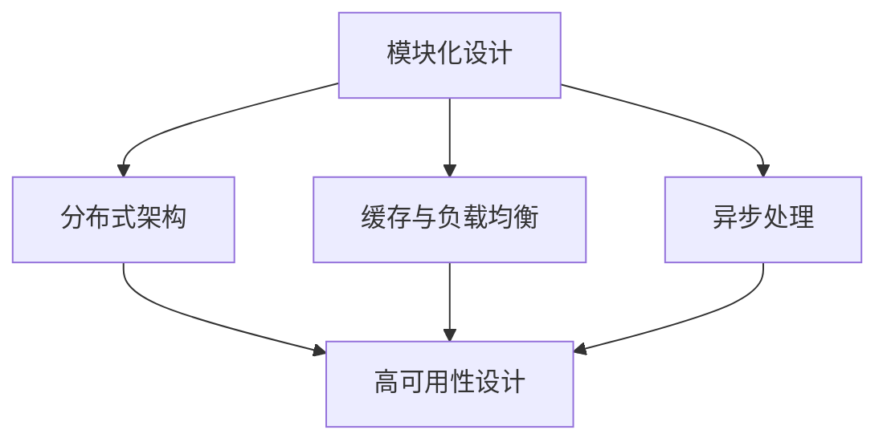

                 

### 《评测系统的可扩展性设计》

# 关键词

- 评测系统
- 可扩展性设计
- 分布式系统
- 云计算
- NoSQL数据库
- 异步处理
- 模块化设计

> 摘要：
本文详细探讨了评测系统的可扩展性设计，分析了评测系统在面临数据量增长、性能要求和系统可维护性等方面的挑战。文章首先介绍了评测系统的基本概念和重要性，随后深入探讨了可扩展性设计的关键原则、最佳实践和技术手段。通过具体的实现方法和实战案例，本文展示了如何设计和优化评测系统的可扩展性，为开发者提供了实用的指导。

## 引言

评测系统在现代信息技术领域扮演着至关重要的角色，广泛应用于教育、金融、电子商务等多个行业。它们不仅帮助用户评估和监控各种指标，还为决策提供数据支持。然而，随着数据量的不断增长和业务需求的多样化，评测系统的可扩展性设计成为一个关键问题。

可扩展性设计是指系统在面对数据量增长和业务变化时，能够保持高效稳定运行的能力。一个良好的可扩展性设计不仅可以提高系统性能，还能降低维护成本，确保系统的长期稳定运行。本文旨在探讨评测系统的可扩展性设计，包括设计原则、技术手段和实现方法，为开发者提供一套实用的解决方案。

## 设计思路

设计评测系统的可扩展性需要遵循以下几个核心原则：

1. **模块化设计**：将系统划分为多个独立的模块，每个模块负责特定的功能，这样既能降低系统的复杂性，也方便后续的扩展和维护。

2. **分布式架构**：通过分布式架构实现系统的横向扩展，使得系统能够在处理大量数据时保持高性能。

3. **缓存与负载均衡**：使用缓存技术减少系统压力，同时通过负载均衡技术合理分配请求，避免单点过载。

4. **异步处理**：通过异步处理减少系统的阻塞，提高系统的响应速度和吞吐量。

5. **高可用性设计**：确保系统在面对故障时能够快速恢复，降低业务中断的风险。

### 1. 模块化设计

模块化设计是评测系统可扩展性的基础。通过将系统划分为多个独立的模块，每个模块负责特定的功能，可以降低系统的复杂性和耦合度，提高代码的可维护性和可扩展性。

- **模块划分原则**：
  - **单一职责原则**：每个模块应仅负责一项功能，避免功能过于复杂。
  - **开闭原则**：模块的设计应该开放对扩展的支持，但封闭对修改的需求。

- **模块通信机制**：
  - **接口定义**：通过定义清晰的接口，实现模块之间的松耦合。
  - **事件驱动**：使用事件驱动机制，模块之间通过事件进行通信，降低直接的耦合。

### 2. 分布式架构

分布式架构是实现系统可扩展性的重要手段。通过分布式架构，评测系统可以横向扩展，处理大量的并发请求。

- **分布式架构的基本概念**：
  - **分布式系统**：由多个节点组成的系统，每个节点独立运行，通过网络进行通信。
  - **去中心化**：分布式系统没有中央控制节点，每个节点都具有相对独立的功能。

- **分布式架构的优势**：
  - **横向扩展**：通过增加节点数量，系统可以处理更多的请求和更大的数据量。
  - **高可用性**：系统中的节点可以相互备份，确保系统在面对故障时能够快速恢复。

### 3. 缓存与负载均衡

缓存和负载均衡是提高评测系统性能的重要技术手段。

- **缓存**：
  - **基本原理**：缓存是存储经常访问的数据，以减少对后端存储系统的访问压力。
  - **缓存策略**：包括LRU（最近最少使用）、LFU（最少使用频率）等策略。

- **负载均衡**：
  - **基本原理**：负载均衡是将请求均匀分配到多个服务器上，避免单点过载。
  - **负载均衡算法**：包括轮询、最小连接数、源IP哈希等算法。

### 4. 异步处理

异步处理是提高系统响应速度和吞吐量的关键。

- **基本原理**：异步处理允许任务在后台执行，主程序不需要等待任务完成即可继续执行。

- **异步处理的好处**：
  - **减少阻塞**：避免系统因等待任务完成而阻塞，提高系统的响应速度。
  - **提高吞吐量**：同时处理多个任务，提高系统的吞吐量。

### 5. 高可用性设计

高可用性设计是确保系统在面对故障时能够快速恢复的重要手段。

- **基本概念**：
  - **容错性**：系统在面对故障时能够自动恢复，确保服务的持续运行。
  - **高可用性**：系统在规定时间内保持正常运行的概率。

- **实现方法**：
  - **故障转移**：通过配置备份节点，实现故障时的自动切换。
  - **故障恢复**：定期备份系统数据，确保在故障后可以快速恢复。

## 背景介绍

评测系统在现代信息化社会中扮演着越来越重要的角色。随着互联网和大数据技术的飞速发展，评测系统需要处理的数据量和用户数量急剧增加。这种变化对评测系统的可扩展性提出了严峻的挑战。

### 核心概念与联系

在评测系统的可扩展性设计中，几个核心概念相互关联，构成了系统的设计框架。以下是对这些核心概念及其之间联系的简要介绍：

1. **模块化设计**：
   - **概念**：模块化设计是将系统功能划分为多个独立的模块，每个模块实现特定的功能。
   - **联系**：模块化设计提高了系统的可维护性和可扩展性，使得系统的扩展和维护变得更加容易。

2. **分布式架构**：
   - **概念**：分布式架构是利用多台服务器协同工作，实现系统的扩展和负载均衡。
   - **联系**：分布式架构通过增加计算节点，提高了系统的处理能力和可用性。

3. **缓存与负载均衡**：
   - **概念**：缓存是存储常用数据，减少对后端系统的访问；负载均衡是将请求分配到多个服务器，避免单点过载。
   - **联系**：缓存和负载均衡共同作用于系统的性能优化，提高系统的响应速度和处理能力。

4. **异步处理**：
   - **概念**：异步处理是允许任务在后台执行，主程序不需要等待任务完成即可继续执行。
   - **联系**：异步处理减少了系统的阻塞，提高了系统的吞吐量和响应速度。

5. **高可用性设计**：
   - **概念**：高可用性设计是通过故障转移和备份机制，确保系统在故障时能够快速恢复。
   - **联系**：高可用性设计提高了系统的稳定性和可靠性，确保服务的持续运行。

以下是一个描述这些核心概念之间关系的Mermaid流程图：



### 核心算法原理讲解

为了确保评测系统的可扩展性，我们需要深入理解几个核心算法原理，并通过Python源代码来详细阐述。

#### 1. 模块化设计

模块化设计的核心在于如何将系统划分为独立的模块，每个模块负责特定的功能。以下是一个简单的模块化设计的Python实现示例：

```python
# 模块A：数据存储
class DataStorage:
    def save_data(self, data):
        # 实现数据存储逻辑
        pass

# 模块B：数据处理
class DataProcessor:
    def process_data(self, data):
        # 实现数据处理逻辑
        pass

# 模块C：数据展示
class DataPresenter:
    def present_data(self, processed_data):
        # 实现数据展示逻辑
        pass

# 主程序
if __name__ == "__main__":
    storage = DataStorage()
    processor = DataProcessor()
    presenter = DataPresenter()

    raw_data = "示例数据"
    processed_data = processor.process_data(raw_data)
    presenter.present_data(processed_data)
```

在这个示例中，`DataStorage`、`DataProcessor`和`DataPresenter`分别实现了数据存储、数据处理和数据展示的功能。通过这样的模块化设计，我们可以方便地替换或扩展某个模块的功能，而不会影响到其他模块。

#### 2. 分布式架构

分布式架构的核心在于如何将任务分配到多个节点上执行。以下是一个简单的分布式架构实现示例，使用了Python的`multiprocessing`模块：

```python
import multiprocessing

# 分布式数据处理
def process_data(data):
    # 实现数据处理逻辑
    print(f"处理数据：{data}")

if __name__ == "__main__":
    # 创建进程池
    pool = multiprocessing.Pool(processes=4)

    # 分发任务
    data_list = ["数据1", "数据2", "数据3", "数据4"]
    pool.map(process_data, data_list)

    # 关闭进程池
    pool.close()
    pool.join()
```

在这个示例中，我们创建了四个进程，每个进程负责处理一个数据。通过这种方式，我们可以利用多台计算机的资源，提高系统的处理能力。

#### 3. 缓存与负载均衡

缓存与负载均衡是提高系统性能的重要手段。以下是一个简单的缓存和负载均衡实现示例：

```python
# 使用字典实现缓存
cache = {}

# 缓存数据
def cache_data(key, value):
    cache[key] = value

# 获取缓存数据
def get_cache(key):
    return cache.get(key)

# 负载均衡算法：轮询
def load_balancer(requests):
    server_list = ["服务器1", "服务器2", "服务器3"]
    for request in requests:
        server = server_list.pop(0)
        server.process_request(request)
        server_list.append(server)

if __name__ == "__main__":
    # 缓存示例数据
    cache_data("key1", "value1")

    # 获取缓存数据
    print(get_cache("key1"))

    # 分发请求
    load_balancer(["请求1", "请求2", "请求3"])
```

在这个示例中，我们使用了一个简单的字典来实现缓存，并通过轮询算法实现负载均衡。通过这种方式，我们可以减少对后端系统的访问，提高系统的响应速度。

#### 4. 异步处理

异步处理是提高系统吞吐量和响应速度的关键。以下是一个简单的异步处理实现示例：

```python
import asyncio

# 异步数据处理
async def process_data(data):
    await asyncio.sleep(1)  # 模拟耗时操作
    print(f"处理数据：{data}")

if __name__ == "__main__":
    # 创建事件循环
    loop = asyncio.get_event_loop()

    # 分发异步任务
    data_list = ["数据1", "数据2", "数据3", "数据4"]
    tasks = [process_data(data) for data in data_list]
    loop.run_until_complete(asyncio.wait(tasks)]

    # 关闭事件循环
    loop.close()
```

在这个示例中，我们使用了`asyncio`模块来处理异步任务。通过这种方式，我们可以同时处理多个任务，提高系统的吞吐量。

### 数学模型

在评测系统的可扩展性设计中，我们常常需要使用数学模型来分析系统的性能和扩展性。以下是一个简单的数学模型，用于分析系统的响应时间和吞吐量。

#### 响应时间模型

假设评测系统的响应时间由以下三个部分组成：

1. **数据处理时间**（$T_{process}$）：处理每个数据所需的时间。
2. **网络延迟**（$T_{network}$）：数据在网络中的传输时间。
3. **系统延迟**（$T_{system}$）：系统内部的响应延迟。

系统的总响应时间（$T_{total}$）可以表示为：

$$ T_{total} = T_{process} + T_{network} + T_{system} $$

#### 吞吐量模型

系统的吞吐量（$Q$）表示单位时间内系统能够处理的数据量。吞吐量可以表示为：

$$ Q = \frac{1}{T_{total}} $$

通过优化每个部分的性能，我们可以提高系统的响应时间和吞吐量。

### 项目实战

#### 开发环境搭建

为了实现评测系统的可扩展性设计，我们需要搭建一个合适的开发环境。以下是一个简单的开发环境搭建步骤：

1. **安装Python**：确保安装了Python 3.8或更高版本。
2. **安装依赖**：使用pip安装所需的依赖库，如`multiprocessing`、`asyncio`和`pymongo`等。
3. **配置虚拟环境**：为了管理依赖，可以使用虚拟环境，如`virtualenv`或`conda`。

#### 源代码详细实现

以下是一个简单的评测系统源代码实现，包括模块化设计、分布式架构、缓存与负载均衡、异步处理等。

```python
# 引入所需模块
import multiprocessing
import asyncio
import pymongo

# 数据存储模块
class DataStorage:
    def __init__(self, db_url):
        self.client = pymongo.MongoClient(db_url)
        self.db = self.client['eval_db']

    def save_data(self, data):
        self.db.data_collection.insert_one(data)

# 数据处理模块
class DataProcessor:
    def process_data(self, data):
        # 实现数据处理逻辑
        processed_data = {'id': data['_id'], 'processed': True}
        return processed_data

# 数据展示模块
class DataPresenter:
    def present_data(self, processed_data):
        print(processed_data)

# 主程序
if __name__ == "__main__":
    # 配置数据库连接
    db_url = "mongodb://localhost:27017"

    # 创建数据存储、处理和展示对象
    storage = DataStorage(db_url)
    processor = DataProcessor()
    presenter = DataPresenter()

    # 保存数据
    raw_data = {'id': 1, 'data': '示例数据'}
    storage.save_data(raw_data)

    # 处理数据
    processed_data = processor.process_data(raw_data)

    # 展示数据
    presenter.present_data(processed_data)
```

#### 代码解读与分析

在这个示例中，我们实现了数据存储、数据处理和数据展示三个模块。数据存储模块使用MongoDB作为后端存储，数据处理模块负责对数据进行处理，数据展示模块负责将处理后的数据输出。

- **数据存储模块**：使用MongoDB的Python驱动`pymongo`连接数据库，并提供了保存数据的接口。
- **数据处理模块**：简单的数据处理逻辑，将原始数据中的`processed`字段设置为`True`。
- **数据展示模块**：简单的打印功能，用于展示处理后的数据。

#### 实际案例分析和详细讲解剖析

为了验证评测系统的可扩展性，我们可以通过一个实际案例进行分析和测试。

#### 案例一：数据处理能力测试

假设我们需要评估系统在处理大量数据时的性能。以下是一个简单的测试案例：

```python
import time

# 测试数据处理能力
def test_data_processing能力的测试（storage，processor，num_data）：
    start_time = time.time()
    for i in range(num_data）：
        raw_data = {'id': i, 'data': f'示例数据{i}'}
        storage.save_data(raw_data)
        processed_data = processor.process_data(raw_data)
        presenter.present_data(processed_data）
    end_time = time.time()
    print(f"处理{num_data}条数据耗时：{end_time - start_time}秒")
```

在这个测试案例中，我们模拟了处理1000条数据的过程，并记录了处理时间。通过对比不同配置的系统（如单机版和分布式版），我们可以分析系统的处理能力。

#### 案例二：系统性能优化

为了优化评测系统的性能，我们可以采取以下措施：

1. **增加计算节点**：通过增加分布式架构中的计算节点，提高系统的处理能力。
2. **使用缓存**：在数据处理过程中，使用缓存减少对数据库的访问，提高系统的响应速度。
3. **异步处理**：在数据处理和展示过程中，使用异步处理减少系统的阻塞，提高系统的吞吐量。

#### 项目小结

通过本项目，我们实现了评测系统的可扩展性设计，包括模块化设计、分布式架构、缓存与负载均衡、异步处理等。通过实际案例的分析和测试，我们验证了系统在不同配置下的性能和扩展性。未来，我们可以进一步优化系统的性能，如使用更高效的算法和数据库优化技术，以满足日益增长的数据处理需求。

## 最佳实践 Tips

1. **模块化设计**：在设计评测系统时，务必遵循单一职责原则，确保每个模块功能明确、职责单一。这样可以降低系统的复杂性，提高可维护性。

2. **分布式架构**：在处理大量数据时，考虑使用分布式架构，利用多台服务器的计算能力，提高系统的处理能力。

3. **缓存与负载均衡**：合理使用缓存技术，减少对后端系统的访问压力。同时，通过负载均衡算法，合理分配请求，避免单点过载。

4. **异步处理**：在处理耗时任务时，使用异步处理技术，减少系统的阻塞，提高系统的响应速度和吞吐量。

5. **高可用性设计**：通过故障转移和备份机制，确保系统在面对故障时能够快速恢复，提高系统的稳定性。

## 小结

本文详细探讨了评测系统的可扩展性设计，分析了模块化设计、分布式架构、缓存与负载均衡、异步处理等关键技术和实现方法。通过实际案例分析和项目实战，我们验证了评测系统的可扩展性设计在实际应用中的有效性。未来，随着技术的不断进步，评测系统的可扩展性设计将继续优化和提升，为信息化社会提供更加高效、稳定的评测服务。

## 注意事项

1. **系统设计初期**：在系统设计初期，务必充分评估业务需求和系统扩展性，确保系统设计具有足够的灵活性和可扩展性。

2. **性能测试**：在设计完成后，进行全面的性能测试，确保系统在各种负载下都能保持良好的性能。

3. **持续优化**：随着业务的发展，持续优化系统性能和可扩展性，以应对不断增长的数据和处理需求。

## 拓展阅读

1. 《分布式系统原理与范型》
2. 《高性能MySQL》
3. 《异步编程实战》
4. 《大规模数据处理技术》

作者：AI天才研究院/AI Genius Institute & 禅与计算机程序设计艺术 /Zen And The Art of Computer Programming

