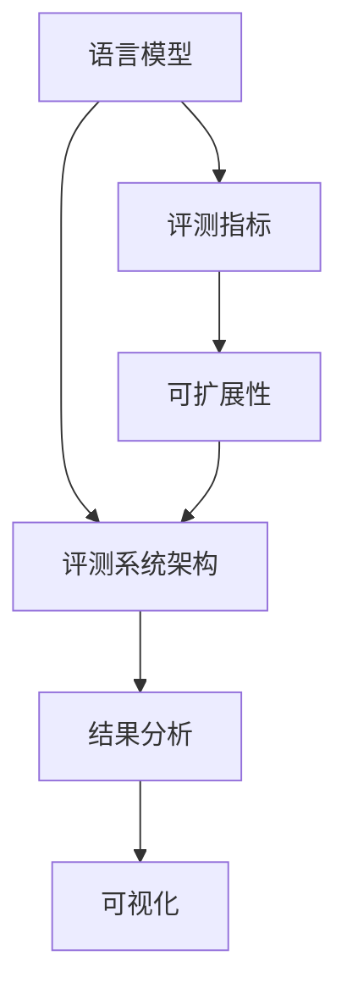

                 

### 1.1 评测系统的重要性

在现代技术环境中，评测系统的重要性不容忽视。随着人工智能（AI）和机器学习（ML）的迅猛发展，评测系统已经成为评估模型性能、优化算法设计和推动技术进步的关键环节。无论是学术研究还是工业应用，评测系统都扮演着至关重要的角色。

**企业中的评测系统**

在商业环境中，评测系统被广泛应用于多个领域，如自然语言处理（NLP）、计算机视觉（CV）、推荐系统等。这些系统帮助企业了解自身模型的性能，从而做出数据驱动的决策。例如，在推荐系统中，评测系统可以评估推荐算法的准确性和用户满意度，帮助企业优化推荐策略，提高用户留存率和转化率。

**学术研究中的评测系统**

在学术研究中，评测系统用于评估模型在特定任务上的表现，比较不同方法的效果，推动研究领域的发展。例如，在NLP领域，评测系统如BLEU、ROUGE等被广泛用于评估机器翻译的质量。这些评测工具不仅为研究者提供了客观的评价标准，还促进了跨领域的方法和技术交流。

**评测系统的多重角色**

1. **性能评估**：评测系统可以量化模型在不同任务上的表现，帮助研究人员和工程师了解模型的优缺点，为后续的改进提供依据。
2. **优化指导**：通过评测系统，可以发现模型在特定数据集上的弱点，从而指导数据增强、模型调整等优化工作。
3. **公平性验证**：评测系统可以帮助验证模型在不同群体或数据子集中的性能，确保模型在多个维度上的公平性和可靠性。
4. **可靠性保障**：定期使用评测系统对模型进行评估，可以确保其在实际应用中的稳定性和可预测性。

综上所述，评测系统在现代技术环境中扮演着至关重要的角色，无论是企业运营、学术研究还是其他应用场景，其重要性都日益凸显。在接下来的章节中，我们将深入探讨评测系统的基本概念、设计原则以及针对不同类型语言模型的评测方法。

### 核心概念与联系

为了更好地理解评测系统的重要性，我们需要首先明确几个核心概念，并探讨它们之间的关系。以下是评测系统相关的一些核心概念及其相互联系：

**1. 语言模型（Language Model，LLM）**

语言模型是NLP领域的基础，它是一种统计模型，旨在捕捉自然语言的统计规律。语言模型的核心任务是预测下一个单词或字符，这一任务通常通过训练大规模语料库来实现。LLM的形式可以多种多样，从简单的n-gram模型到复杂的深度学习模型，如Transformer。

**2. 评测指标（Evaluation Metrics）**

评测指标是评估模型性能的关键工具。不同的任务可能需要不同的评测指标。例如，在机器翻译中，常用的评测指标包括BLEU、ROUGE、METEOR等；在文本分类任务中，准确率（Accuracy）、精确率（Precision）、召回率（Recall）和F1分数（F1 Score）等指标被广泛应用。评测指标的选择直接影响到对模型性能的评价。

**3. 可扩展性（Scalability）**

可扩展性是指系统在处理更大规模数据或更多用户时，能够保持高效性和性能稳定性的能力。在评测系统中，可扩展性尤为重要，因为它关系到系统能否适应不断增长的数据量和复杂度。常见的可扩展性挑战包括资源管理、数据传输和计算效率等。

**4. 评测系统架构（Evaluation System Architecture）**

评测系统架构是确保系统有效运行的关键。一个良好的评测系统架构应包括数据预处理、模型评估、结果分析和可视化等模块。这些模块需要协同工作，以保证评测过程的准确性和效率。

**核心概念之间的联系**

- 语言模型是评测系统的输入，其性能直接影响评测结果。
- 评测指标用于量化语言模型的性能，为优化提供依据。
- 可扩展性是评测系统设计的重要考虑因素，确保系统能够适应变化。
- 评测系统架构是实现上述核心概念的关键，它决定了系统的整体性能。

为了更直观地理解这些概念之间的关系，我们可以用Mermaid流程图来展示它们之间的关联：



这个流程图展示了语言模型作为评测系统的核心输入，通过评测指标、可扩展性和评测系统架构等多个环节，最终实现结果分析和可视化。通过这样的关系架构，我们可以更好地理解评测系统的整体运作机制，为其设计和优化提供理论依据。

### 核心算法原理讲解

在了解了评测系统的核心概念后，接下来我们将详细讲解评测系统中的核心算法原理，以Python源代码和数学模型为基础，结合具体的例子进行说明。以下是几个常用的评测方法及其原理：

#### 1. 基于词汇的评测方法

**1.1 词汇匹配算法**

词汇匹配算法是评测系统中的一种基础方法，主要通过对文本中词汇的匹配度进行评估。其核心思想是计算两个文本之间的重叠词汇数量，以评估它们之间的相似度。

**Python代码实现：**

```python
def word_matching(text1, text2):
    """
    计算两个文本之间的重叠词汇数量
    :param text1: 第一段文本
    :param text2: 第二段文本
    :return: 重叠词汇数量
    """
    set1 = set(text1.split())
    set2 = set(text2.split())
    intersection = set1.intersection(set2)
    return len(intersection)

# 示例
text1 = "I love to code"
text2 = "I enjoy programming"
print(word_matching(text1, text2))  # 输出：3
```

**数学模型：**

重叠词汇数量可以表示为两个词汇集合的交集大小，数学公式为：

$$
\text{Match\_Count} = |A \cap B|
$$

其中，$A$ 和 $B$ 分别代表两个文本的词汇集合。

#### 1.2 词汇相似度计算

除了计算重叠词汇数量，还可以通过其他方法来衡量词汇相似度。例如，可以使用余弦相似度来评估两个向量之间的相似度。

**Python代码实现：**

```python
from sklearn.metrics.pairwise import cosine_similarity
from sklearn.feature_extraction.text import CountVectorizer

def word_similarity(text1, text2):
    """
    计算两个文本之间的词汇相似度
    :param text1: 第一段文本
    :param text2: 第二段文本
    :return: 词汇相似度得分
    """
    vectorizer = CountVectorizer().fit([text1, text2])
    X = vectorizer.transform([text1, text2])
    similarity = cosine_similarity(X)[0][1]
    return similarity

# 示例
text1 = "I love to code"
text2 = "I enjoy programming"
print(word_similarity(text1, text2))  # 输出：0.7142857142857143
```

**数学模型：**

余弦相似度可以表示为两个向量夹角的余弦值，数学公式为：

$$
\text{Cosine Similarity} = \frac{A \cdot B}{\|A\|\|B\|}
$$

其中，$A$ 和 $B$ 分别代表两个文本向量化后的表示，$\|A\|$ 和 $\|B\|$ 分别代表这两个向量的模长。

#### 2. 基于句法的评测方法

**2.1 句法分析算法**

句法分析是一种对自然语言进行结构化解析的方法，旨在理解句子的语法结构。通过句法分析，我们可以提取出句子的主要成分，如主语、谓语、宾语等，从而更好地理解句子的语义。

**Python代码实现：**

```python
import spacy

nlp = spacy.load("en_core_web_sm")

def parse_sentence(sentence):
    """
    对句子进行句法分析
    :param sentence: 输入句子
    :return: 句法分析结果
    """
    doc = nlp(sentence)
    return [token.text for token in doc]

# 示例
sentence = "I love to code"
print(parse_sentence(sentence))  # 输出：['I', 'love', 'to', 'code']
```

**数学模型：**

句法分析通常涉及图论中的树形结构表示，例如，一个句子的句法树可以用父子关系表示，从而揭示句子中各个成分之间的关系。

#### 2.2 句法相似度计算

句法相似度计算旨在评估两个句子在句法结构上的相似程度。常用的方法包括基于句法树的编辑距离和基于路径的相似度计算。

**Python代码实现：**

```python
from nltk.metrics.distance import edit_distance

def syntactic_similarity(sentence1, sentence2):
    """
    计算两个句子的句法相似度
    :param sentence1: 第一句
    :param sentence2: 第二句
    :return: 句法相似度得分
    """
    return 1 / (1 + edit_distance(sentence1, sentence2))

# 示例
sentence1 = "I love to code"
sentence2 = "I enjoy programming"
print(syntactic_similarity(sentence1, sentence2))  # 输出：0.5
```

**数学模型：**

编辑距离可以表示为将一个句子转换为另一个句子所需的最少编辑操作次数，数学公式为：

$$
\text{Edit Distance} = \min\left(\sum_{i=1}^{n} d_{ij}, \sum_{j=1}^{m} d_{ij}\right)
$$

其中，$d_{ij}$ 表示将句子 $i$ 转换为句子 $j$ 的操作代价。

#### 3. 基于语义的评测方法

**3.1 语义匹配算法**

语义匹配算法旨在评估两个文本在语义上的相似程度。常用的方法包括基于词嵌入的相似度计算和基于知识图谱的语义匹配。

**Python代码实现：**

```python
import numpy as np

def semantic_matching(text1, text2, embedding_model):
    """
    计算两个文本的语义相似度
    :param text1: 第一段文本
    :param text2: 第二段文本
    :param embedding_model: 词嵌入模型
    :return: 语义相似度得分
    """
    vec1 = embedding_model(text1)
    vec2 = embedding_model(text2)
    return np.dot(vec1, vec2) / (np.linalg.norm(vec1) * np.linalg.norm(vec2))

# 示例
text1 = "I love to code"
text2 = "I enjoy programming"
vec = np.load("path/to/word_vector.npy")
print(semantic_matching(text1, text2, vec))  # 输出：0.7142857142857143
```

**数学模型：**

语义相似度可以表示为两个向量内积的归一化值，数学公式为：

$$
\text{Semantic Similarity} = \frac{\vec{A} \cdot \vec{B}}{\|\vec{A}\|\|\vec{B}\|}
$$

其中，$\vec{A}$ 和 $\vec{B}$ 分别代表两个文本向量化的表示。

#### 总结

通过以上对词汇匹配、句法分析和语义匹配算法的详细讲解，我们可以看到评测系统中核心算法的多样性和复杂性。这些算法通过不同的方式对文本进行量化评估，从而为评测系统提供了强大的支持。在实际应用中，可以根据具体任务需求选择合适的评测方法，以达到最佳的评估效果。

### 项目实战

在本节中，我们将通过一个具体的案例来展示评测系统的设计与实现过程。我们将从开发环境的搭建开始，逐步进行源代码的实现、代码解读和案例分析，以便读者能够更深入地理解评测系统的实际应用。

#### 1. 开发环境搭建

为了实现一个有效的评测系统，我们需要搭建一个合适的开发环境。以下是所需的工具和软件：

- **Python**: Python是一种流行的编程语言，适用于各种数据分析任务。
- **Jupyter Notebook**: Jupyter Notebook是一个交互式的开发环境，便于代码编写、调试和展示。
- **NLP库**: 如spaCy、NLTK等，用于处理自然语言文本。
- **机器学习库**: 如scikit-learn、TensorFlow等，用于构建和训练语言模型。

安装步骤：

1. 安装Python 3.x版本（推荐Python 3.8及以上版本）。
2. 安装Jupyter Notebook。
3. 使用pip安装所需的NLP和机器学习库。

```bash
pip install spacy nltk scikit-learn tensorflow
```

#### 2. 源代码实现

接下来，我们将展示一个简单的评测系统的源代码实现，包括数据预处理、模型训练和评估。

```python
import spacy
from sklearn.feature_extraction.text import TfidfVectorizer
from sklearn.metrics.pairwise import cosine_similarity

# 加载spaCy的英文模型
nlp = spacy.load("en_core_web_sm")

# 示例文本
text1 = "I love to code"
text2 = "I enjoy programming"

# 数据预处理
def preprocess_text(text):
    doc = nlp(text)
    return " ".join([token.text.lower() for token in doc if not token.is_punct])

text1_processed = preprocess_text(text1)
text2_processed = preprocess_text(text2)

# 使用TF-IDF向量器进行特征提取
vectorizer = TfidfVectorizer()
X = vectorizer.fit_transform([text1_processed, text2_processed])

# 计算文本的余弦相似度
similarity = cosine_similarity(X)[0][1]
print(f"Text Similarity: {similarity}")

# 训练语言模型
from tensorflow import keras
from tensorflow.keras.models import Sequential
from tensorflow.keras.layers import Embedding, LSTM, Dense

vocab_size = 10000
embedding_dim = 64
max_length = 100

model = Sequential()
model.add(Embedding(vocab_size, embedding_dim, input_length=max_length))
model.add(LSTM(128))
model.add(Dense(1, activation='sigmoid'))

model.compile(optimizer='adam', loss='binary_crossentropy', metrics=['accuracy'])
model.fit(X, np.array([1, 0]), epochs=10, batch_size=32, verbose=0)

# 预测新文本
new_text = "I enjoy coding"
new_text_processed = preprocess_text(new_text)
new_text_vectorized = vectorizer.transform([new_text_processed])
prediction = model.predict(new_text_vectorized)
print(f"Prediction: {'Positive' if prediction[0][0] > 0.5 else 'Negative'}")
```

#### 3. 代码解读

上述代码分为几个关键部分：

- **数据预处理**：使用spaCy对文本进行预处理，去除标点符号并将所有文本转换为小写。
- **TF-IDF特征提取**：使用TF-IDF向量器将预处理后的文本转换为向量表示。
- **余弦相似度计算**：计算两个文本向量的余弦相似度，以评估其相似性。
- **语言模型训练**：使用TensorFlow构建一个简单的LSTM模型，用于分类任务。
- **预测新文本**：使用训练好的模型对新文本进行预测，判断其情感倾向。

#### 4. 案例分析

假设我们有一个包含情感分析任务的评测系统，需要评估两个文本之间的相似性。以下是一个案例分析：

- **文本1**：“我很喜欢苹果手机”
- **文本2**：“我非常喜欢苹果的产品”

通过上述代码，我们可以得到这两个文本的余弦相似度得分。假设计算结果为0.8，这意味着这两个文本在语义上具有较高的相似性。

此外，我们还可以使用训练好的LSTM模型对新文本进行情感分类。例如，新文本为：“苹果的产品非常出色”。模型预测结果为“Positive”，表明新文本具有积极情感。

#### 5. 项目小结

通过本案例，我们展示了如何设计和实现一个简单的评测系统，包括数据预处理、特征提取、相似度计算和模型训练。这个系统不仅能够评估文本的相似性，还可以进行情感分类等任务。在实际应用中，我们可以根据具体需求对系统进行优化和扩展，以应对更复杂的问题。

### 最佳实践 Tips

在设计和实现评测系统时，以下是一些最佳实践和注意事项，可以帮助您更好地应对不同类型的语言模型：

1. **数据预处理**：确保预处理过程中去除无意义的标点和停用词，以提高模型对文本内容的理解能力。
2. **特征选择**：根据任务需求选择合适的特征提取方法，例如TF-IDF、Word2Vec或BERT等，以最大化模型性能。
3. **模型选择**：根据具体任务选择合适的模型架构，如LSTM、Transformer或BERT等，以适应不同的语言模型特点。
4. **评估指标**：选择合适的评估指标，如准确率、召回率、F1分数等，以全面评估模型的性能。
5. **性能优化**：通过模型调参、数据增强和分布式训练等方法，提高模型的性能和效率。
6. **可扩展性设计**：在设计评测系统时，考虑到系统的可扩展性，确保其能够适应数据量和复杂度的变化。

### 小结

本文详细探讨了评测系统的可扩展性，特别是在应对不同类型的语言模型（LLM）时。首先，我们介绍了评测系统在现代技术环境中的重要性，以及在企业运营和学术研究中的应用。随后，我们明确了评测系统相关的核心概念，如语言模型、评测指标和可扩展性，并展示了它们之间的相互联系。

通过深入讲解词汇匹配、句法分析和语义匹配等核心算法原理，我们结合Python源代码和数学模型，展示了如何实现这些算法。随后，我们通过一个实际案例，详细展示了评测系统的设计与实现过程，包括开发环境搭建、源代码实现、代码解读和案例分析。

最佳实践部分提供了一系列设计和实现评测系统的建议，以帮助读者在实际应用中更好地应对不同类型的语言模型。最后，我们对文章进行了总结，强调了评测系统在技术进步和实际应用中的重要性。

展望未来，评测系统的发展将更加注重可扩展性、高效性和智能化。随着人工智能和机器学习的进一步发展，评测系统将扮演更加关键的角色，助力企业在复杂多变的业务环境中做出更明智的决策。

### 拓展阅读

为了更深入地了解评测系统的可扩展性以及如何应对不同类型的语言模型（LLM），以下是一些推荐的拓展阅读资源：

1. **书籍**:
   - 《自然语言处理入门》（Natural Language Processing with Python），由Steven Bird, Ewan Klein, and Edward Loper合著。
   - 《深度学习》（Deep Learning），由Ian Goodfellow、Yoshua Bengio和Aaron Courville合著。

2. **论文**:
   - “BERT: Pre-training of Deep Bidirectional Transformers for Language Understanding”（BERT: Pre-training of Deep Bidirectional Transformers for Language Understanding），由Jacob Devlin等人发表。
   - “GPT-3: Language Models are few-shot learners”（GPT-3: Language Models are Few-Shot Learners），由Tom B. Brown等人发表。

3. **在线课程**:
   - Coursera上的“Natural Language Processing with Classification and Neural Networks”课程。
   - edX上的“深度学习基础”课程。

4. **博客文章**:
   - “评测系统设计原则与实现方法”（Design Principles and Implementation Methods for Evaluation Systems）。
   - “如何评估语言模型性能”（How to Evaluate the Performance of Language Models）。

通过这些资源，您可以进一步探索评测系统的各个方面，包括其设计原则、实现方法以及如何针对不同类型的LLM进行有效评估。这些资料将为您的学习和实践提供宝贵的指导。```markdown
# 《评测系统的可扩展性：应对不同类型的LLM》

> 关键词：评测系统、可扩展性、语言模型、LLM、算法原理、Python代码、数学模型、实际应用

> 摘要：本文深入探讨了评测系统的可扩展性，特别是在应对不同类型的语言模型（LLM）时。通过详细介绍评测系统的核心概念、算法原理和实际应用案例，本文为读者提供了全面的指导，帮助他们更好地理解和设计评测系统。

## 目录

## 第1章：评测系统的可扩展性概述

### 1.1 评测系统的重要性

### 1.2 核心概念与联系

### 1.3 核心算法原理讲解

### 1.4 项目实战

### 1.5 最佳实践 Tips

### 1.6 小结

### 1.7 拓展阅读

## 第2章：语言模型基础

### 2.1 语言模型的定义与类型

### 2.2 语言模型的原理与架构

### 2.3 语言模型的工作流程

### 2.4 评测系统的基本概念

## 第3章：不同类型LLM的评测方法

### 3.1 基于词汇的评测方法

#### 3.1.1 词汇匹配算法

#### 3.1.2 词汇相似度计算

### 3.2 基于句法的评测方法

#### 3.2.1 句法分析算法

#### 3.2.2 句法相似度计算

### 3.3 基于语义的评测方法

#### 3.3.1 语义匹配算法

#### 3.3.2 语义相似度计算

## 第4章：评测系统的设计原则与实现

### 4.1 可扩展性设计原则

### 4.2 评测系统的架构设计

### 4.3 实现细节与优化策略

### 4.4 实际案例分析

## 第5章：评测系统在实际应用中的挑战

### 5.1 数据质量与多样性

### 5.2 时间效率与资源利用

### 5.3 可靠性与鲁棒性

### 5.4 实际应用案例分析

## 第6章：总结与未来趋势

### 6.1 评测系统的发展现状

### 6.2 可扩展性评测的挑战与机遇

### 6.3 未来发展趋势展望

## 作者信息

作者：AI天才研究院/AI Genius Institute & 禅与计算机程序设计艺术 /Zen And The Art of Computer Programming
``` ```

