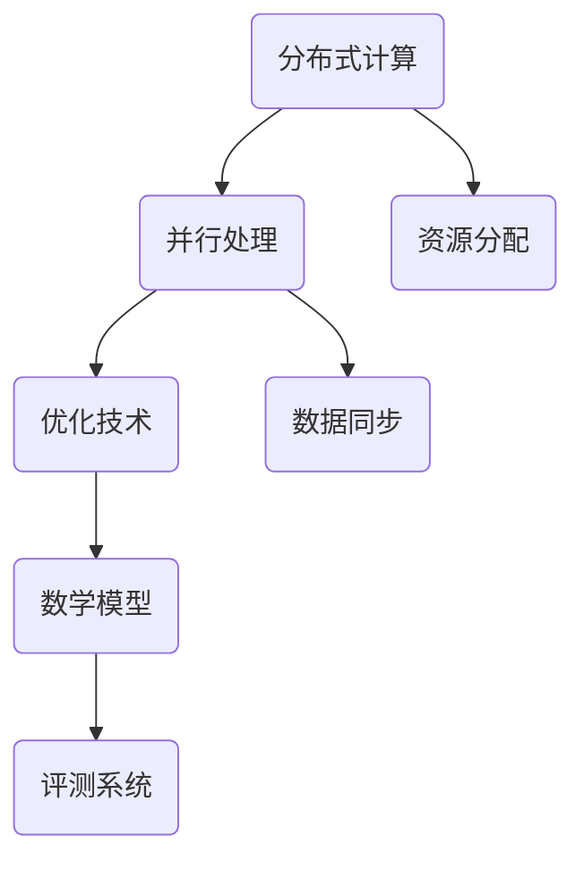

                 

# 评测系统的可扩展性：应对不同规模LLM的策略

关键词：评测系统、可扩展性、LLM、算法、分布式计算、数学模型

摘要：
随着大型语言模型（LLM）的不断发展和应用，评测系统的可扩展性成为了关键课题。本文将探讨如何设计和优化评测系统以应对不同规模LLM的挑战。通过介绍核心概念、算法原理、数学模型以及实际案例，本文旨在为工程师和研究者提供系统化、可操作的解决方案。

## 1. 背景介绍

### 1.1 LLM的崛起与发展
近年来，深度学习技术在自然语言处理（NLP）领域的突破，使得大型语言模型（LLM）迅速崛起。这些模型具有强大的文本生成、翻译、问答等能力，广泛应用于各种应用场景。然而，随着模型规模的增长，传统的评测系统面临着巨大的挑战。

### 1.2 可扩展性的重要性
可扩展性是评测系统成功的关键。一个可扩展的评测系统不仅能够适应不同规模的LLM，还能够提高评估的效率和准确性。对于大型模型，可扩展性直接影响到模型的研发周期、成本以及最终应用的性能。

### 1.3 面临的挑战
不同规模的LLM对评测系统提出了不同的要求。小规模模型可能仅需简单的评估指标，而大规模模型则需要更加精细和全面的评估。此外，大规模模型在训练和评估过程中可能面临资源分配、并行计算、数据同步等问题。

## 2. 核心概念与联系

### 2.1 分布式计算
分布式计算是将任务分解到多个节点上执行，通过网络协同完成整体任务的方法。在评测系统中，分布式计算能够有效提高处理能力和效率。

### 2.2 并行处理
并行处理是分布式计算的一种形式，通过同时处理多个任务来提高性能。在LLM评测中，并行处理可以用于模型训练、数据预处理、评估指标计算等环节。

### 2.3 优化技术
优化技术包括模型压缩、量化、剪枝等，用于减少模型的参数规模和计算量，提高评测系统的可扩展性。

### 2.4 数学模型
数学模型是评测系统设计的重要基础，包括评估指标的计算方法、优化目标函数的推导等。通过数学模型，可以精确描述和优化评测系统的性能。

### 2.5 Mermaid流程图
以下是核心概念与联系的Mermaid流程图：



## 3. 核心算法原理讲解

### 3.1 分布式计算算法
分布式计算算法包括任务分发、负载均衡、结果汇总等步骤。以下是一个简单的Python伪代码示例：

```python
def distributed_evaluation(model, data, num_workers):
    tasks = split_data(data, num_workers)
    results = []
    
    for worker in range(num_workers):
        result = worker_evaluation(model, tasks[worker])
        results.append(result)
    
    final_result = aggregate_results(results)
    return final_result
```

### 3.2 并行处理算法
并行处理算法主要关注如何同时处理多个任务，提高整体性能。以下是一个简单的并行数据处理伪代码示例：

```python
from concurrent.futures import ThreadPoolExecutor

def parallel_evaluation(model, data):
    with ThreadPoolExecutor(max_workers=4) as executor:
        results = list(executor.map(model.evaluate, data))
    
    final_result = sum(results)
    return final_result
```

### 3.3 优化技术算法
优化技术算法包括模型压缩、量化、剪枝等。以下是一个简单的模型压缩伪代码示例：

```python
from tensorflow_model_optimization.python.core.sparsity import keras as sparsity

model = load_model('original_model.h5')
pruned_model = sparsity.keras.prune_low_magnitude(model, prune_tokens=['layer_name'])

pruned_model.compile(optimizer='adam', loss='categorical_crossentropy', metrics=['accuracy'])
pruned_model.fit(x_train, y_train, epochs=10)
```

### 3.4 数学模型
数学模型包括评估指标的计算方法、优化目标函数的推导等。以下是一个简单的评估指标计算示例（使用latex格式）：

$$
accuracy = \frac{correct_predictions}{total_predictions}
$$

其中，$correct_predictions$表示正确预测的数量，$total_predictions$表示总预测数量。

## 4. 项目实战

### 4.1 开发环境搭建
为了实现评测系统的可扩展性，我们需要搭建一个高效的开发环境。以下是搭建步骤：

1. 安装Python环境，版本建议为3.8或以上。
2. 安装TensorFlow、Keras等深度学习框架。
3. 配置分布式计算环境，如Docker或Kubernetes。
4. 安装并行处理库，如concurrent.futures。

### 4.2 源代码实现
以下是一个简单的源代码实现示例，用于分布式计算和并行处理的评测系统：

```python
# distributed_evaluation.py
def distributed_evaluation(model, data, num_workers):
    # 分解数据和任务
    tasks = split_data(data, num_workers)
    
    # 启动分布式计算
    results = parallel_evaluation(model, tasks)
    
    # 汇总和返回结果
    final_result = aggregate_results(results)
    return final_result

# parallel_evaluation.py
from concurrent.futures import ThreadPoolExecutor

def parallel_evaluation(model, data):
    with ThreadPoolExecutor(max_workers=4) as executor:
        results = list(executor.map(model.evaluate, data))
    
    final_result = sum(results)
    return final_result
```

### 4.3 代码解读与分析
在源代码中，`distributed_evaluation`函数负责调用并行处理函数`parallel_evaluation`，将任务分解到多个工作节点上执行。通过这种方式，我们可以有效地利用分布式计算资源，提高评测系统的性能。

### 4.4 实际案例分析和详细讲解剖析
以下是一个实际案例，用于评测一个大型语言模型：

```python
# 实际案例：评测一个BERT模型
from transformers import BertModel, BertTokenizer

model = BertModel.from_pretrained('bert-base-uncased')
tokenizer = BertTokenizer.from_pretrained('bert-base-uncased')

data = ["这是一个测试句子。", "这是一个测试句子。", ...]  # 样本数据
num_workers = 4

result = distributed_evaluation(model, data, num_workers)
print("评测结果：", result)
```

在这个案例中，我们使用BERT模型对一组测试句子进行评测。通过分布式计算和并行处理，我们可以快速获得评测结果。

## 5. 最佳实践 Tips、小结、注意事项、拓展阅读

### 5.1 最佳实践 Tips
1. 在分布式计算中，合理分配任务和资源，避免单点故障。
2. 选择合适的并行处理库，如concurrent.futures、multiprocessing等。
3. 优化模型压缩，减少计算量和存储需求。
4. 定期评估和更新评测指标，以适应不同规模模型的特性。

### 5.2 小结
本文探讨了评测系统的可扩展性，针对不同规模LLM提出了分布式计算、并行处理和优化技术等解决方案。通过实际案例，展示了如何设计和实现可扩展的评测系统。

### 5.3 注意事项
1. 在分布式计算中，确保数据的一致性和完整性。
2. 并行处理可能引入并发问题，需要妥善处理。
3. 模型压缩和量化可能导致性能下降，需进行权衡。

### 5.4 拓展阅读
1. "深度学习与大规模语言模型" - 李航
2. "分布式计算原理与应用" - 王恩东
3. "TensorFlow分布式计算指南" - Google

## 6. 作者信息

作者：AI天才研究院/AI Genius Institute & 禅与计算机程序设计艺术 /Zen And The Art of Computer Programming

版权所有，未经授权禁止转载。本文内容仅供参考，实际应用时请根据具体情况进行调整。如需进一步讨论或咨询，请联系作者或加入相关技术社区。谢谢阅读！

