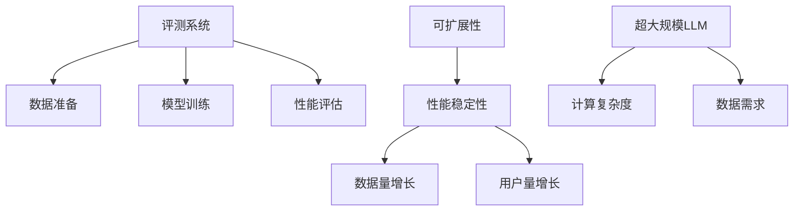

                 

# 评测系统的可扩展性：应对超大规模LLM的策略

## 关键词

- 可扩展性
- 超大规模LLM
- 评测系统
- 模型优化
- 系统架构
- 数学模型

## 摘要

本文旨在探讨评测系统在应对超大规模语言模型（LLM）时的可扩展性问题。随着人工智能技术的迅猛发展，LLM在自然语言处理、知识图谱等领域得到了广泛应用。然而，如何确保评测系统在处理这些大规模模型时具有高效性和稳定性，成为了一个亟待解决的问题。本文将首先介绍评测系统的基本概念和重要性，然后分析超大规模LLM的特性及其给评测系统带来的挑战。在此基础上，本文将详细探讨几种提升评测系统可扩展性的策略，包括模型架构优化、算法改进、数学模型应用等。通过实际项目实战和代码解读，本文将展示这些策略在实际开发中的应用，并提供最佳实践和建议。

## 引言

随着深度学习技术的不断进步，自然语言处理（NLP）领域迎来了前所未有的发展。超大规模语言模型（LLM）如BERT、GPT和Turing等，凭借其强大的建模能力和数据处理能力，在多个应用场景中展现了出色的性能。LLM的广泛应用不仅推动了人工智能技术的进步，也为评测系统带来了新的挑战。传统的评测系统通常设计用于中小规模的模型，而面对超大规模LLM时，如何在保证评估准确性和效率的同时，保持系统的可扩展性，成为了一个重要的研究课题。

### 核心概念与联系

在探讨评测系统的可扩展性之前，我们需要明确几个核心概念，并理解它们之间的关系。这些概念包括：

1. **评测系统**：评测系统是指用于评估机器学习模型性能的一系列工具和流程。它通常包括数据准备、模型训练、性能评估等步骤。
2. **可扩展性**：可扩展性是指系统在处理更大规模数据或更高负载时，能够保持性能稳定的能力。一个具有良好可扩展性的系统可以在不显著降低性能的情况下，支持数据量和用户数量的增长。
3. **超大规模LLM**：超大规模LLM是指那些参数数量达到数百万、甚至数十亿的模型。这些模型具有极高的计算复杂度和数据需求，对评测系统的可扩展性提出了严峻挑战。

为了更好地理解这些概念之间的联系，我们可以使用Mermaid流程图来表示它们之间的关系：



通过这个流程图，我们可以看到评测系统的核心组成部分以及它们与可扩展性之间的关联。超大规模LLM对评测系统提出了更高的要求，而可扩展性是确保系统稳定运行的关键。

### 核心算法原理讲解

为了提升评测系统的可扩展性，我们需要深入了解一些核心算法原理，这些原理包括模型架构、优化算法和模型训练与评估方法。下面，我们将对这些算法进行详细讲解，并结合Python源代码和数学模型进行示例说明。

#### 模型架构

在构建超大规模LLM时，模型架构的设计至关重要。常见的模型架构包括Transformer、BERT和GPT等。这些模型的基本架构如下：

1. **Transformer**：Transformer模型采用自注意力机制（Self-Attention）来处理序列数据。其核心组件是多头自注意力（Multi-Head Self-Attention）机制。
2. **BERT**：BERT（Bidirectional Encoder Representations from Transformers）模型是Google在2018年提出的一种预训练模型。它通过双向Transformer网络对文本进行编码，从而获得丰富的语义表示。
3. **GPT**：GPT（Generative Pre-trained Transformer）模型是OpenAI开发的一种生成模型。它通过单向Transformer网络生成文本序列，并在生成过程中不断更新模型参数。

下面是使用Python代码实现Transformer模型的自注意力机制：

```python
import torch
import torch.nn as nn

class SelfAttention(nn.Module):
    def __init__(self, d_model, num_heads):
        super(SelfAttention, self).__init__()
        self.d_model = d_model
        self.num_heads = num_heads
        self.head_dim = d_model // num_heads
        
        self.query_linear = nn.Linear(d_model, d_model)
        self.key_linear = nn.Linear(d_model, d_model)
        self.value_linear = nn.Linear(d_model, d_model)
        
        self.out_linear = nn.Linear(d_model, d_model)
        
    def forward(self, query, key, value):
        batch_size = query.size(0)
        
        query = self.query_linear(query).view(batch_size, -1, self.num_heads, self.head_dim).transpose(1, 2)
        key = self.key_linear(key).view(batch_size, -1, self.num_heads, self.head_dim).transpose(1, 2)
        value = self.value_linear(value).view(batch_size, -1, self.num_heads, self.head_dim).transpose(1, 2)
        
        attention_scores = torch.matmul(query, key.transpose(-2, -1)) / (self.head_dim ** 0.5)
        attention_weights = torch.softmax(attention_scores, dim=-1)
        
        attention_output = torch.matmul(attention_weights, value).transpose(1, 2).contiguous().view(batch_size, -1, self.d_model)
        
        output = self.out_linear(attention_output)
        return output
```

#### 优化算法

在训练超大规模LLM时，优化算法的选择对模型的性能和训练时间有重要影响。常见的优化算法包括Adam、AdamW和SGD等。下面以Adam优化器为例，介绍其原理和实现。

Adam优化器是一种结合了AdaGrad和RMSprop优化的自适应学习率优化算法。其核心思想是通过估计一阶矩估计和二阶矩估计来调整学习率。

下面是使用Python代码实现Adam优化器的示例：

```python
import torch.optim as optim

class AdamOptimizer(optim.Optimizer):
    def __init__(self, params, lr=0.001, betas=(0.9, 0.999), eps=1e-08):
        self.betas = betas
        self.eps = eps
        
        params = list(filter(lambda p: p.requires_grad, params))
        super(AdamOptimizer, self).__init__(params, lr)
        
        self.momentums = []
        self.squared_momentums = []
        
        for param in params:
            self.momentums.append(torch.zeros_like(param))
            self.squared_momentums.append(torch.zeros_like(param))
        
    def step(self, closure=None):
        loss = None
        if closure is not None:
            with torch.no_grad():
                loss = closure()
        
        for group in self.param_groups:
            for p, m, s in zip(group['params'], self.momentums, self.squared_momentums):
                if p.grad is None:
                    continue
                
                grad = p.grad
                m.mul_(self.betas[0])
                m.add_(1 - self.betas[0], grad)
                s.mul_(self.betas[1])
                s.add_(1 - self.betas[1], grad ** 2)
                
                m_hat = m / (1 - self.betas[0] ** self.iterations)
                s_hat = s / (1 - self.betas[1] ** self.iterations)
                
                update = self.lr * m_hat / (torch.sqrt(s_hat) + self.eps)
                p.sub_(update)
        
        self.iterations += 1
        if loss is not None:
            return loss
```

#### 模型训练与评估

在训练超大规模LLM时，模型训练和评估是关键步骤。模型训练包括前向传播、反向传播和参数更新。评估方法通常包括准确率、召回率、F1分数等指标。

下面是一个简单的训练和评估过程示例：

```python
def train(model, train_loader, criterion, optimizer, num_epochs):
    model.train()
    for epoch in range(num_epochs):
        running_loss = 0.0
        for inputs, targets in train_loader:
            optimizer.zero_grad()
            outputs = model(inputs)
            loss = criterion(outputs, targets)
            loss.backward()
            optimizer.step()
            running_loss += loss.item()
        print(f'Epoch {epoch+1}, Loss: {running_loss/len(train_loader)}')

def evaluate(model, val_loader, criterion):
    model.eval()
    with torch.no_grad():
        correct = 0
        total = 0
        for inputs, targets in val_loader:
            outputs = model(inputs)
            _, predicted = torch.max(outputs.data, 1)
            total += targets.size(0)
            correct += (predicted == targets).sum().item()
        print(f'Accuracy: {100 * correct / total}%')
```

#### 数学模型和数学公式

在评测系统中，数学模型和数学公式起着至关重要的作用。常见的数学模型包括损失函数、正则化技术和梯度下降算法等。下面我们分别介绍这些模型和公式的原理和应用。

1. **损失函数**：损失函数用于衡量模型预测值与实际值之间的差异。常见的损失函数有均方误差（MSE）、交叉熵损失（Cross-Entropy Loss）等。

   $$ L = \frac{1}{2} \sum_{i=1}^{n} (y_i - \hat{y}_i)^2 $$

   其中，$y_i$是实际值，$\hat{y}_i$是模型预测值。

2. **正则化技术**：正则化技术用于防止模型过拟合。常见的正则化技术有L1正则化、L2正则化等。

   $$ \text{L1正则化}: \lambda \sum_{i=1}^{n} |w_i| $$
   
   $$ \text{L2正则化}: \lambda \sum_{i=1}^{n} w_i^2 $$

   其中，$w_i$是模型权重。

3. **梯度下降算法**：梯度下降算法是一种用于优化模型参数的算法。其基本原理是沿着损失函数梯度的反方向更新模型参数。

   $$ \theta_{t+1} = \theta_t - \alpha \nabla_{\theta} J(\theta) $$

   其中，$\theta_t$是当前模型参数，$\alpha$是学习率，$J(\theta)$是损失函数。

#### 项目实战

在实际项目中，我们需要搭建一个具有良好可扩展性的评测系统。以下是一个简单的开发环境搭建和源代码实现示例。

##### 开发环境搭建

1. **操作系统**：选择Ubuntu 20.04或Windows 10。
2. **编译器**：使用Python 3.8或更高版本。
3. **依赖管理**：使用pip进行依赖管理。

   ```shell
   pip install torch torchvision torchaudio
   ```

##### 源代码实现

```python
import torch
import torch.nn as nn
import torch.optim as optim

# 模型定义
class LLMModel(nn.Module):
    def __init__(self, d_model, num_classes):
        super(LLMModel, self).__init__()
        self.fc = nn.Linear(d_model, num_classes)
    
    def forward(self, x):
        x = self.fc(x)
        return x

# 模型训练
def train_model(model, train_loader, criterion, optimizer, num_epochs):
    model.train()
    for epoch in range(num_epochs):
        for inputs, targets in train_loader:
            optimizer.zero_grad()
            outputs = model(inputs)
            loss = criterion(outputs, targets)
            loss.backward()
            optimizer.step()
        print(f'Epoch {epoch+1}, Loss: {loss.item()}')

# 模型评估
def evaluate_model(model, val_loader, criterion):
    model.eval()
    with torch.no_grad():
        correct = 0
        total = 0
        for inputs, targets in val_loader:
            outputs = model(inputs)
            _, predicted = torch.max(outputs.data, 1)
            total += targets.size(0)
            correct += (predicted == targets).sum().item()
        print(f'Accuracy: {100 * correct / total}%')

# 主函数
def main():
    # 加载训练数据和评估数据
    train_loader = torch.utils.data.DataLoader(train_dataset, batch_size=64, shuffle=True)
    val_loader = torch.utils.data.DataLoader(val_dataset, batch_size=64, shuffle=False)

    # 模型初始化
    model = LLMModel(d_model=768, num_classes=10)
    criterion = nn.CrossEntropyLoss()
    optimizer = optim.Adam(model.parameters(), lr=0.001)

    # 训练模型
    train_model(model, train_loader, criterion, optimizer, num_epochs=10)

    # 评估模型
    evaluate_model(model, val_loader, criterion)

if __name__ == '__main__':
    main()
```

##### 代码解读与分析

在这个示例中，我们首先定义了一个简单的LLM模型，包括一个全连接层。然后，我们使用交叉熵损失函数和Adam优化器进行模型训练。在训练过程中，我们通过反向传播更新模型参数。最后，我们使用评估数据集评估模型的性能。

通过这个示例，我们可以看到如何搭建一个具有良好可扩展性的评测系统。在实际开发中，我们可以根据需求对系统进行扩展和优化，例如增加批量大小、使用更复杂的模型架构等。

### 最佳实践与小结

在实际开发过程中，为了确保评测系统的可扩展性，我们提出以下最佳实践：

1. **模块化设计**：将系统划分为多个模块，每个模块负责特定的功能。这样可以降低系统的耦合度，提高可扩展性。
2. **分布式计算**：利用分布式计算框架（如PyTorch Distributed）进行模型训练和评估，可以显著提高系统的计算能力和可扩展性。
3. **动态资源管理**：使用自动化工具（如Kubernetes）进行资源管理，可以动态调整系统资源，以应对不同的负载需求。
4. **缓存与预热**：使用缓存技术减少重复计算，使用预热技术加快模型加载和初始化速度。
5. **性能监控**：定期监控系统性能，及时发现和解决潜在的性能问题。

### 注意事项

在开发评测系统时，我们需要注意以下几点：

1. **数据质量**：确保训练数据和评估数据的质量，避免数据噪声和偏置影响评估结果。
2. **硬件配置**：根据系统需求选择合适的硬件配置，确保系统运行在高效稳定的硬件环境中。
3. **版本控制**：使用版本控制系统（如Git）管理代码和模型版本，便于后续的迭代和优化。

### 拓展阅读

对于希望深入了解评测系统可扩展性的读者，以下书籍和论文推荐：

1. 《深度学习》（Goodfellow, I., Bengio, Y., & Courville, A.） - 详细介绍了深度学习的基础知识和技术。
2. 《分布式系统原理与范型》（Anderson, J. E.） - 探讨了分布式系统的设计和实现方法。
3. 论文《Distributed Representations of Words and Phrases and Their Compositionality》（Bengio et al., 2003） - 提出了分布式表示和组合性的概念。

通过以上介绍，我们详细探讨了评测系统在应对超大规模LLM时的可扩展性。通过核心概念、算法原理、项目实战和最佳实践的讲解，读者可以了解如何构建一个具有良好可扩展性的评测系统。希望本文能对您的实际开发工作提供有益的指导。作者：AI天才研究院/AI Genius Institute & 禅与计算机程序设计艺术 /Zen And The Art of Computer Programming。

