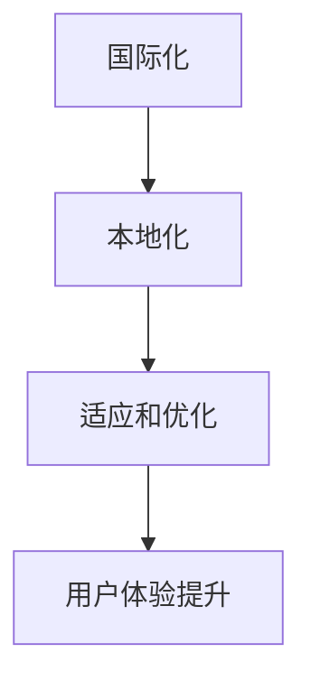
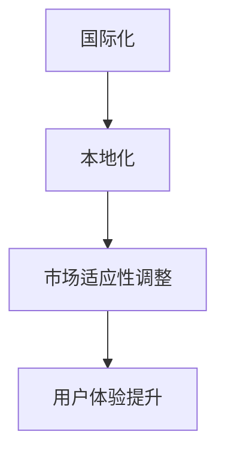
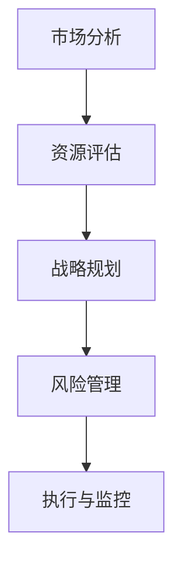
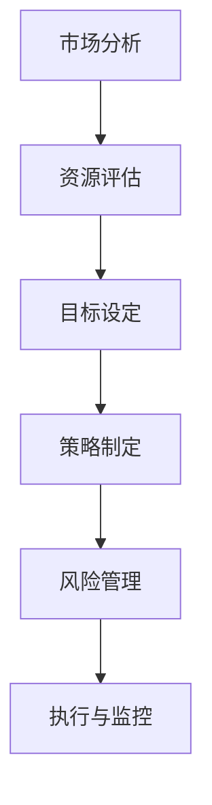

                 

### 引言与背景

在现代信息化和全球化的背景下，评测系统的国际化与本地化支持变得越来越重要。评测系统作为对各种应用程序、系统和服务进行性能测试和质量评估的重要工具，其国际化与本地化支持不仅有助于扩大市场影响力，提升用户体验，还能有效降低运营成本。本文将围绕评测系统的国际化与本地化支持，详细探讨其核心概念、技术实现、策略制定以及实际应用。

首先，我们需要明确评测系统的基本概念。评测系统是一种用于评估各种系统性能、功能和用户体验的软件工具。它通过模拟真实用户操作、执行特定任务和测量性能指标，来对系统进行全面的测试和评估。评测系统的国际化与本地化支持，即是在设计评测系统时，考虑到不同国家和地区的语言、文化、法律法规和技术标准的差异，确保系统在不同环境下能够顺畅运行，同时保持一致的评估标准和用户体验。

#### 国际化与本地化的定义

国际化（Internationalization）是指设计软件产品时，使其能够适应不同国家和地区的语言、文化、法律法规和技术标准的过程。简而言之，国际化旨在使软件产品在未进行任何特定本地化操作的情况下，能够在多种语言和环境中运行。

本地化（Localization）则是在国际化基础上，针对特定国家和地区，对软件产品进行适应和优化的过程。本地化包括翻译界面、调整文化差异、优化用户体验等具体操作，以确保软件产品在特定市场上能够达到最佳效果。

#### 核心概念与联系

国际化与本地化之间存在紧密的联系，但它们的目的和实施方法有所不同。国际化是本地化的基础，而本地化则是国际化的具体实现。两者之间的关系可以用以下Mermaid流程图来表示：



- **国际化**：关注于软件产品在跨语言、跨文化环境中的基础性准备，包括代码的可移植性、资源的国际化存储等。
- **本地化**：关注于在特定市场中，针对用户习惯和文化差异进行的调整和优化，如语言翻译、文化适应性调整等。

通过上述关系图，我们可以清晰地看到国际化与本地化之间的紧密关联，以及它们在整个评测系统开发过程中的重要性。

#### 评测系统的重要性

评测系统在国际化与本地化过程中扮演着关键角色。一方面，它能够帮助开发团队在不同语言和文化背景下，对系统进行全面的性能测试和功能验证，确保系统能够稳定运行。另一方面，评测系统还可以为本地化提供重要的参考依据，帮助团队了解不同市场用户的反馈和需求，从而进行针对性的优化。

#### 国际化与本地化的挑战

在国际化与本地化过程中，开发团队可能面临以下挑战：

1. **语言差异**：不同语言之间的语法、词汇和表达方式可能存在巨大差异，这需要开发团队对软件界面进行细致的翻译和调整。
2. **文化差异**：不同文化背景下的用户行为、习惯和偏好可能有所不同，这需要开发团队对用户界面和交互设计进行本地化优化。
3. **技术标准**：不同国家和地区可能采用不同的技术标准，如字符编码、数据格式等，这需要开发团队进行相应的调整和兼容。
4. **法律法规**：不同国家有不同的法律法规，如隐私保护、数据存储等，这需要开发团队在系统设计和实现过程中进行合规性审查。

#### 不同语言、文化背景对评测系统设计的影响

不同语言和文化背景对评测系统设计有着显著的影响。例如：

- **语言翻译**：不同语言之间的语法和表达方式可能存在差异，这需要开发团队在界面设计和用户交互方面进行细致的翻译和调整。例如，一些按钮标签、提示信息和错误信息可能需要在不同语言中保持一致性，以确保用户体验。
- **文化适应性**：不同文化背景下的用户行为和习惯可能有所不同，这需要开发团队对用户界面和交互设计进行本地化优化。例如，在某些文化中，用户可能更倾向于使用手势进行操作，而不是键盘输入。
- **技术兼容性**：不同国家和地区可能采用不同的技术标准，如字符编码、数据格式等。这需要开发团队在系统设计和实现过程中进行相应的调整和兼容，以确保系统能在不同环境中正常运行。

综上所述，评测系统的国际化与本地化支持是一个复杂而重要的任务。通过深入了解国际化与本地化的定义、核心概念和挑战，开发团队可以更好地应对不同市场和技术环境的需求，确保评测系统在全球范围内的稳定运行和良好用户体验。在接下来的章节中，我们将详细探讨国际化与本地化策略的制定、技术实现以及实际应用，以帮助读者更深入地了解这一领域。

---

关键词：评测系统、国际化、本地化、语言差异、文化适应性、技术兼容性

摘要：本文围绕评测系统的国际化与本地化支持展开，探讨了其核心概念、定义、关系和挑战。通过分析不同语言和文化背景对评测系统设计的影响，本文旨在为开发团队提供一套完整的国际化与本地化策略，以实现全球范围内的系统稳定性和良好用户体验。

---

本文标题：**评测系统的国际化与本地化支持**

关键词：评测系统、国际化、本地化、语言差异、文化适应性、技术兼容性

摘要：本文深入探讨了评测系统在国际化与本地化支持方面的核心概念、技术实现和策略制定。通过分析语言、文化差异及技术标准，本文为开发团队提供了全面的国际化与本地化方案，旨在提升系统在全球范围内的稳定性和用户体验。

---

# 目录大纲设计思路

为了设计出《评测系统的国际化与本地化支持》这本书的完整目录大纲，我们将遵循以下步骤：

1. **确定核心概念与联系**：首先，明确书籍的核心概念，如评测系统的国际化与本地化支持，这些概念之间的联系，以及它们在整个书籍中的重要性。

2. **框架结构构建**：基于核心概念，构建书籍的基本框架，确保每个章节都紧密围绕核心主题展开。

3. **细化章节内容**：为每个章节细化内容，确保涵盖所有关键点，如核心概念、算法原理、数学模型、项目实战等。

4. **创建Mermaid流程图**：为了更直观地展示核心概念原理和架构，设计相应的Mermaid流程图。

5. **编写伪代码**：对于核心算法，使用伪代码来详细阐述其原理。

6. **插入数学公式与举例说明**：在章节中插入相关的数学公式，并配合举例说明，以便读者更好地理解。

7. **代码解读与分析**：提供项目实战的代码实际案例和详细解释说明。

8. **优化与调整**：根据内容的逻辑性和完整性，对目录大纲进行优化与调整。

现在，我们将开始根据这些步骤设计《评测系统的国际化与本地化支持》的目录大纲。

### 第1章：评测系统的国际化与本地化概述

#### 核心概念与联系

本章将介绍评测系统的国际化与本地化的基本概念，包括国际化、本地化以及它们在评测系统开发中的重要性。通过Mermaid流程图，我们将直观地展示国际化与本地化之间的联系。

#### 评测系统的重要性

在本节中，我们将探讨评测系统在国际化与本地化过程中的关键作用。评测系统能够帮助开发团队在不同语言和文化背景下对系统进行全面的性能测试和功能验证，从而确保系统的稳定性和用户体验。

#### 国际化与本地化的挑战

本节将分析在国际化与本地化过程中可能遇到的挑战，如语言差异、文化差异、技术标准和法律法规等。通过具体案例分析，我们将展示这些挑战如何影响评测系统的设计和实现。

#### 不同语言、文化背景对评测系统设计的影响

本章将深入探讨不同语言和文化背景对评测系统设计的影响，包括界面设计、用户交互、技术实现等方面。我们将通过具体例子来说明这些影响以及相应的解决方案。

### 第2章：国际化与本地化的技术基础

#### 国际化与本地化的基础概念

在本章中，我们将详细介绍国际化与本地化的基础概念，包括国际化、本地化的定义、目标、方法和工具等。我们将使用Mermaid流程图来展示国际化与本地化的基本流程和关键步骤。

#### 国际化与本地化的工具与资源

本节将介绍常用的国际化与本地化工具和资源，如翻译工具、本地化平台、国际化库和框架等。我们将讨论这些工具在评测系统开发中的应用和优势。

### 第3章：国际化策略制定

#### 国际化战略的重要性

本章将探讨国际化战略在评测系统开发中的重要性。我们将分析国际化战略对企业市场扩张、品牌认知和用户满意度的积极影响。

#### 国际化战略的制定流程

在本节中，我们将详细阐述国际化战略的制定流程，包括市场分析、目标市场选择、资源分配和风险管理等。我们将使用Mermaid流程图来展示国际化战略的制定过程。

### 第4章：多语言支持

#### 多语言支持的技术实现

本章将介绍为评测系统添加多语言支持的技术方法，包括国际化存储、多语言界面设计和语言切换机制等。我们将使用伪代码来详细阐述这些技术的实现原理。

#### 多语言测试与验证

本节将讨论如何确保多语言支持的准确性和一致性。我们将介绍多语言测试与验证的方法，包括翻译质量评估、用户反馈收集和测试案例设计等。

### 第5章：国际化用户研究

#### 国际化用户研究的重要性

本章将探讨国际化用户研究在评测系统开发中的重要性。我们将分析用户研究如何帮助企业了解不同市场用户的偏好和需求，从而优化系统设计和功能。

#### 国际化用户研究的实施方法

在本节中，我们将详细描述国际化用户研究的实施方法，包括用户访谈、问卷调查、用户行为分析等。我们将通过具体案例来说明这些方法的实际应用和效果。

### 第6章：本地化策略制定

#### 本地化策略的重要性

本章将探讨本地化策略在评测系统本地化支持中的重要性。我们将分析本地化策略如何影响系统的市场适应性、用户体验和用户满意度。

#### 本地化策略的制定流程

在本节中，我们将详细阐述本地化策略的制定流程，包括市场分析、目标市场选择、资源分配和风险管理等。我们将使用Mermaid流程图来展示本地化策略的制定过程。

### 第7章：本地化用户研究

#### 本地化用户研究的重要性

本章将探讨本地化用户研究在评测系统本地化支持中的重要性。我们将分析用户研究如何帮助团队了解目标市场用户的习惯、偏好和需求，从而优化系统的本地化效果。

#### 本地化用户研究的实施方法

在本节中，我们将详细描述本地化用户研究的实施方法，包括用户访谈、问卷调查、本地化测试等。我们将通过具体案例来说明这些方法的实际应用和效果。

### 第8章：本地化技术与实现

#### 本地化技术概述

本章将介绍常见的本地化技术，包括文本翻译、界面本地化、文化适应性和技术兼容性等。我们将使用伪代码来详细阐述这些技术的实现原理。

#### 本地化测试与验证

本节将讨论如何确保本地化效果的准确性和一致性。我们将介绍本地化测试与验证的方法，包括本地化测试工具、测试流程和用户反馈收集等。

### 第9章：国际化与本地化的综合应用

#### 项目背景

本章将通过一个实际项目案例，介绍评测系统的国际化与本地化支持的综合应用。我们将详细描述项目目标、实施过程和成果评估。

#### 项目实施过程

本节将详细描述项目的实施过程，包括国际化与本地化策略的制定、多语言支持的实施、用户研究的开展以及本地化技术与实现等。

### 结论

本章将对全文内容进行总结，重申评测系统的国际化与本地化支持的重要性，并给出一些最佳实践建议，以帮助开发团队在实际项目中更好地应用这些策略。

通过以上详细的目录大纲设计思路，我们可以确保《评测系统的国际化与本地化支持》这本书的内容丰富、逻辑清晰，能够为读者提供实用的指导和建议。

### 完整目录大纲

#### 第一部分：引言与背景

##### 第1章：评测系统的国际化与本地化概述

- **核心概念与联系**
  - 国际化与本地化的定义
  - 国际化与本地化的关系架构（Mermaid流程图）

- **评测系统的重要性**
  - 评测系统在国际化与本地化中的作用

- **国际化与本地化的挑战**
  - 语言差异、文化差异、技术标准和法律法规等挑战

- **不同语言、文化背景对评测系统设计的影响**
  - 界面设计、用户交互、技术实现等方面的具体影响

##### 第2章：国际化与本地化的技术基础

- **国际化与本地化的基础概念**
  - 国际化和本地化的定义、目标和方法

- **国际化与本地化的工具与资源**
  - 常用的国际化与本地化工具和资源

##### 第二部分：评测系统的国际化支持

##### 第3章：国际化策略制定

- **国际化战略的重要性**
  - 国际化战略在评测系统开发中的重要性

- **国际化战略的制定流程**
  - 国际化战略的制定过程（Mermaid流程图）

##### 第4章：多语言支持

- **多语言支持的技术实现**
  - 国际化存储、多语言界面设计、语言切换机制等（伪代码）

- **多语言测试与验证**
  - 翻译质量评估、用户反馈收集和测试案例设计等

##### 第5章：国际化用户研究

- **国际化用户研究的重要性**
  - 国际化用户研究在评测系统开发中的重要性

- **国际化用户研究的实施方法**
  - 用户访谈、问卷调查、用户行为分析等

##### 第三部分：评测系统的本地化支持

##### 第6章：本地化策略制定

- **本地化策略的重要性**
  - 本地化策略在评测系统本地化支持中的重要性

- **本地化策略的制定流程**
  - 本地化策略的制定过程（Mermaid流程图）

##### 第7章：本地化用户研究

- **本地化用户研究的重要性**
  - 本地化用户研究在评测系统本地化支持中的重要性

- **本地化用户研究的实施方法**
  - 用户访谈、问卷调查、本地化测试等

##### 第8章：本地化技术与实现

- **本地化技术概述**
  - 文本翻译、界面本地化、文化适应性和技术兼容性等（伪代码）

- **本地化测试与验证**
  - 本地化测试工具、测试流程和用户反馈收集等

##### 第四部分：国际化与本地化的综合应用

##### 第9章：国际化与本地化的项目实战

- **项目背景**
  - 实际项目的介绍和目标

- **项目实施过程**
  - 国际化与本地化策略的制定、多语言支持的实施、用户研究的开展以及本地化技术与实现等

##### 结论

- **评测系统的国际化与本地化支持总结**
  - 国际化与本地化支持的重要性
  - 最佳实践建议

通过以上详细的目录大纲，我们可以确保本书内容全面、逻辑清晰，为读者提供实用的指导和深入的理解。

### 第一部分：引言与背景

#### 第1章：评测系统的国际化与本地化概述

##### 1.1 核心概念与联系

在国际化和本地化的大背景下，评测系统的国际化与本地化支持显得尤为重要。为了更清晰地理解这一主题，我们首先需要明确国际化与本地化的核心概念及其相互联系。

国际化（Internationalization）是指设计软件产品时，使其能够适应不同国家和地区的语言、文化、法律法规和技术标准的过程。简而言之，国际化关注的是软件产品的基础性准备，以便在不同语言和文化环境中运行。

本地化（Localization）则是在国际化基础上，针对特定国家和地区，对软件产品进行适应和优化的过程。本地化包括翻译界面、调整文化差异、优化用户体验等具体操作，以确保软件产品在特定市场上能够达到最佳效果。

国际化和本地化之间存在紧密的联系，但它们的侧重点不同。国际化是本地化的基础，而本地化是国际化的具体实现。国际化确保软件产品具备跨语言、跨文化的适应性，而本地化则在此基础上，对产品进行个性化的调整和优化。

为了更好地展示国际化与本地化的关系，我们可以使用Mermaid流程图来直观地表示这一过程：


- **国际化（A）**：指为软件产品提供基础性支持，使其能够适应多种语言和文化环境。
- **本地化（B）**：在国际化基础上，对软件产品进行个性化调整和优化，以满足特定市场的需求。
- **适应和优化（C）**：本地化的核心目标，通过调整界面、优化用户体验等手段，提升软件产品在特定市场中的表现。
- **用户体验提升（D）**：本地化后的最终目标，通过优化用户体验，提高用户满意度和市场竞争力。

通过上述Mermaid流程图，我们可以清晰地看到国际化与本地化之间的相互关系及其在整个评测系统开发过程中的重要性。国际化为评测系统提供了跨语言、跨文化的适应性，而本地化则在此基础上，通过具体的实施手段，如翻译、界面优化、文化适应等，提升了系统的用户体验和市场适应性。

##### 1.2 评测系统的重要性

评测系统是一种用于评估各种系统性能、功能和用户体验的软件工具。它通过模拟真实用户操作、执行特定任务和测量性能指标，来对系统进行全面的测试和评估。评测系统在国际化与本地化过程中扮演着至关重要的角色，主要体现在以下几个方面：

1. **性能测试与质量保证**：评测系统能够在不同语言和文化背景下，对系统性能进行全面测试，确保系统在各种环境下都能够稳定运行。通过性能测试，开发团队能够及时发现和解决潜在问题，提升系统的质量。

2. **用户体验评估**：评测系统可以帮助团队在不同市场环境下，评估用户体验。通过模拟不同语言和文化背景下的用户操作，评测系统可以收集用户反馈，为系统优化提供重要依据。

3. **市场适应性分析**：评测系统可以评估系统在不同市场环境下的适应性和竞争力。通过对比不同市场的评测结果，开发团队能够了解系统的市场表现，制定相应的优化策略。

4. **国际化与本地化支持**：评测系统在国际化与本地化过程中，能够为开发团队提供全面的支持。通过评测系统的测试和评估，团队可以了解系统在不同语言和文化背景下的表现，针对性地进行优化和调整。

##### 1.3 国际化与本地化的挑战

在国际化与本地化过程中，开发团队可能会面临一系列挑战，这些挑战主要体现在以下几个方面：

1. **语言差异**：不同语言之间的语法、词汇和表达方式可能存在显著差异。这需要开发团队在界面设计和用户交互方面进行细致的翻译和调整，以确保系统能够在不同语言中正常运行。

2. **文化差异**：不同文化背景下的用户行为、习惯和偏好可能有所不同。这需要开发团队对用户界面和交互设计进行本地化优化，以适应不同市场的用户需求。

3. **技术标准**：不同国家和地区可能采用不同的技术标准，如字符编码、数据格式等。这需要开发团队进行相应的调整和兼容，以确保系统能在不同环境中正常运行。

4. **法律法规**：不同国家有不同的法律法规，如隐私保护、数据存储等。这需要开发团队在系统设计和实现过程中进行合规性审查，以确保系统的合法性和安全性。

为了更好地应对这些挑战，开发团队需要采取一系列策略，如语言翻译、文化适应性调整、技术标准兼容和法律法规合规等。通过这些策略，开发团队能够确保评测系统在不同市场环境中的稳定运行和良好用户体验。

##### 1.4 不同语言、文化背景对评测系统设计的影响

不同语言和文化背景对评测系统的设计有着显著的影响。这些影响主要体现在以下几个方面：

1. **界面设计**：不同语言和文化背景下的用户界面设计需要考虑到字符编码、字体选择、颜色搭配等因素。例如，某些语言可能需要特殊的字符编码，而某些文化背景下的用户可能更喜欢使用特定的颜色和字体。

2. **用户交互**：不同文化背景下的用户交互习惯和偏好可能有所不同。例如，某些文化背景下的用户可能更喜欢使用手势进行操作，而某些文化背景下的用户可能更喜欢使用键盘进行输入。

3. **技术实现**：不同技术标准对评测系统的实现方式产生影响。例如，某些地区可能需要特定的数据格式或字符编码，而某些地区可能需要特定的性能指标。

4. **文化适应性**：评测系统需要考虑到不同文化背景下的用户习惯和偏好，进行相应的优化和调整。例如，在特定的文化背景下，用户可能更关注系统的可靠性、安全性和易用性。

为了应对这些影响，开发团队需要深入了解不同语言和文化背景下的用户需求和行为习惯，并进行相应的调整和优化。通过这些调整和优化，评测系统可以更好地满足不同市场用户的需求，提升用户体验和市场竞争力。

综上所述，评测系统的国际化与本地化支持是一个复杂而重要的任务。通过明确国际化与本地化的核心概念、分析评测系统的重要性以及了解国际化与本地化过程中可能遇到的挑战，开发团队可以更好地应对不同市场环境的需求，确保评测系统在全球范围内的稳定运行和良好用户体验。在接下来的章节中，我们将进一步探讨国际化与本地化的策略制定、技术实现和实际应用，为开发团队提供更加详细的指导。

### 第2章：国际化与本地化的技术基础

#### 2.1 国际化与本地化的基础概念

国际化（Internationalization）与本地化（Localization）是现代软件工程中不可或缺的两个概念，它们共同构成了软件产品在全球市场中的适应性策略。在这一节中，我们将详细探讨国际化与本地化的基础概念，包括它们的定义、目标、方法和工具。

##### 2.1.1 国际化的定义与目标

国际化是指在设计软件产品的过程中，确保产品能够适应多种语言、文化和地区的需求，从而为全球化市场做好准备。国际化的主要目标是使软件产品在未进行任何特定本地化操作的情况下，具备跨语言和跨文化的运行能力。

- **定义**：国际化是使软件产品能够适应不同语言和文化背景的过程，包括但不限于代码的可移植性、国际化存储和资源管理等。
- **目标**：国际化的核心目标是确保软件产品在未进行本地化修改的情况下，可以在多种语言和地区环境中运行。

国际化过程中，开发团队需要关注以下几个方面：

1. **代码国际化**：编写可移植的代码，使其能够适应不同编程环境。
2. **资源国际化**：使用国际化资源包，如语言文件，以便在运行时根据用户语言进行动态切换。
3. **用户界面国际化**：设计可适应不同语言的用户界面，确保文本和元素在多语言环境中的正确显示。

##### 2.1.2 本地化的定义与目标

本地化则是在国际化基础上，对软件产品进行特定国家和地区的适应性调整。本地化的主要目标是使软件产品在特定市场中达到最佳效果，包括语言翻译、文化适应和技术兼容性优化。

- **定义**：本地化是指将国际化后的软件产品，根据特定市场的语言、文化和技术需求进行调整，使其在目标市场中达到最佳效果。
- **目标**：本地化的核心目标是提高软件产品在特定市场中的用户体验和竞争力。

本地化过程中，开发团队需要关注以下几个方面：

1. **语言翻译**：将软件产品的用户界面、文档和说明翻译成目标市场的语言。
2. **文化适应**：根据目标市场的文化特点，调整用户界面和交互设计，以适应不同文化背景下的用户习惯。
3. **技术兼容性**：确保软件产品在不同操作系统、浏览器和硬件平台上正常运行。

##### 2.1.3 国际化与本地化的关系

国际化与本地化之间存在紧密的联系，但它们的目的和方法有所不同。国际化是本地化的基础，而本地化则是国际化的具体实现。国际化关注于软件产品的跨语言和跨文化适应性，而本地化则关注于在特定市场中的优化和适应。

为了更好地理解国际化与本地化的关系，我们可以使用以下Mermaid流程图进行展示：



- **国际化（A）**：提供跨语言和跨文化的运行基础，确保软件产品在全球范围内的基础适应性。
- **本地化（B）**：在国际化基础上，针对特定市场进行适应性调整，提高软件产品的市场表现。
- **市场适应性调整（C）**：通过翻译、文化适应和技术优化，确保软件产品在目标市场中的最佳效果。
- **用户体验提升（D）**：本地化后的最终目标，通过优化用户体验，提高用户满意度和市场竞争力。

##### 2.1.4 国际化和本地化的方法

1. **国际化方法**：

- **代码国际化**：编写可移植的代码，使用国际化框架和库，如Java的`ResourceBundle`、Python的`gettext`等，确保代码在不同环境中能够正常运行。
- **资源国际化**：使用国际化资源文件，如`.properties`或`.json`文件，存储不同语言和地区的资源，以便在运行时动态切换。
- **用户界面国际化**：设计支持多语言显示的用户界面，使用标签和属性管理文本内容，以便在不同语言中正确显示。

2. **本地化方法**：

- **语言翻译**：使用专业翻译服务或机器翻译工具，将用户界面、文档和说明翻译成目标市场的语言。
- **文化适应**：调整用户界面和交互设计，以适应不同文化背景下的用户习惯。例如，调整颜色、按钮布局和文本方向等。
- **技术兼容性**：测试和调整软件产品在不同操作系统、浏览器和硬件平台上的表现，确保其正常运行。

##### 2.1.5 国际化和本地化的工具与资源

为了实现国际化与本地化，开发团队可以使用一系列工具和资源，这些工具和资源包括：

1. **国际化库与框架**：

- **Java**：`ResourceBundle`、`Internationalization` API
- **Python**：`gettext`、`Babel`
- **JavaScript**：`i18next`、`react-i18next`

2. **本地化工具**：

- **翻译工具**：如Google翻译、百度翻译、专业翻译服务
- **本地化平台**：如crowdin、Transifex、本地化管理平台
- **测试工具**：如Selenium、Cypress、UIAutomator

通过使用这些工具和资源，开发团队能够高效地实现软件产品的国际化与本地化，确保产品在不同市场中的稳定运行和良好用户体验。

综上所述，国际化与本地化是软件产品全球化过程中不可或缺的两个步骤。通过理解它们的基础概念、方法和工具，开发团队能够为软件产品在全球范围内的成功奠定坚实的基础。在接下来的章节中，我们将深入探讨国际化与本地化的具体策略和实施方法，为开发团队提供更加详细的指导。

### 第3章：国际化策略制定

#### 3.1 国际化战略的重要性

国际化战略在评测系统开发中扮演着至关重要的角色。它不仅有助于企业拓展国际市场，提升品牌知名度，还能有效降低运营成本，提高整体竞争力。以下是国际化战略在评测系统开发中的重要意义：

1. **市场扩张**：通过制定国际化战略，企业可以将其产品和服务推向全球市场，扩大市场份额，实现业务增长。

2. **品牌认知**：国际化战略有助于提高品牌在国际市场的认知度和影响力，增强品牌竞争力。

3. **用户体验**：良好的国际化战略能够确保评测系统在不同语言和文化背景下，提供一致且优化的用户体验，提升用户满意度和忠诚度。

4. **成本控制**：通过合理的国际化策略，企业可以在全球范围内选择成本效益较高的开发和运维资源，从而降低运营成本。

5. **风险管理**：国际化战略有助于企业识别和应对不同市场的法律法规、文化差异和技术标准等风险，确保产品的合规性和稳定性。

#### 3.2 国际化战略的制定流程

制定国际化战略是一个复杂而系统的过程，需要从多个方面进行全面考虑。以下是一个典型的国际化战略制定流程：

1. **市场分析**：

   - **目标市场选择**：根据企业资源、产品特性、市场潜力等因素，确定目标市场。
   - **市场调研**：收集和分析目标市场的文化、经济、法律、技术等环境信息。
   - **竞争分析**：了解目标市场的竞争对手、市场份额和竞争优势。

2. **资源评估**：

   - **人力资源**：评估企业现有国际化团队的能力和经验，确定是否需要招聘或培训新员工。
   - **财务资源**：确定国际化所需的资金预算，包括翻译、测试、市场推广等费用。
   - **技术资源**：评估现有技术的国际化支持能力，确定是否需要升级或引入新的技术。

3. **战略规划**：

   - **目标设定**：明确国际化战略的目标，如市场份额、品牌知名度、用户满意度等。
   - **战略路径**：制定实现国际化目标的阶段性计划和具体行动方案。
   - **资源配置**：根据目标设定和路径规划，合理分配人力资源、财务资源和时间资源。

4. **风险管理**：

   - **风险评估**：识别国际化过程中可能面临的风险，如市场变化、技术挑战、法律法规合规等。
   - **风险应对**：制定相应的风险应对策略，如风险规避、风险减轻、风险转移等。

5. **执行与监控**：

   - **执行计划**：根据战略规划，制定详细的执行计划，确保各项任务按时完成。
   - **监控与调整**：建立监控机制，定期评估国际化战略的执行情况，根据反馈进行调整和优化。

#### 3.3 国际化战略的制定过程

为了更好地理解国际化战略的制定过程，我们可以使用Mermaid流程图进行展示：



- **市场分析（A）**：通过市场调研和竞争分析，确定目标市场，为国际化战略的制定提供依据。
- **资源评估（B）**：评估企业现有资源和需求，为战略规划提供支持。
- **战略规划（C）**：制定国际化目标、路径和资源配置，确保战略的科学性和可行性。
- **风险管理（D）**：识别和应对国际化过程中的各种风险，确保战略的安全实施。
- **执行与监控（E）**：执行战略计划，并持续监控和调整，确保战略目标的实现。

通过上述流程，企业可以系统地制定和实施国际化战略，从而在全球市场中取得成功。在接下来的章节中，我们将进一步探讨评测系统国际化过程中的具体实施方法和技术细节。

### 第4章：多语言支持

#### 4.1 多语言支持的技术实现

在评测系统开发过程中，多语言支持是国际化的重要组成部分。实现多语言支持需要考虑多个方面，包括资源存储、界面显示、语言切换等。以下是一些实现多语言支持的技术方法：

##### 4.1.1 国际化存储

国际化存储是将不同语言的资源文件存储在不同的文件夹中，以便在运行时根据用户语言进行加载。常见的国际化存储方法包括：

- **文件存储**：将不同语言的文本资源存储在独立的文本文件中，如`.properties`、`.json`或`.xml`文件。
- **数据库存储**：将国际化资源存储在数据库中，如MySQL、PostgreSQL等，根据用户语言进行查询和显示。

以下是一个使用Python编写的国际化资源存储示例：

```python
# 使用Python的gettext库进行国际化存储

# en.properties
message=Hello, World!

# fr.properties
message=Bonjour le monde!

# es.properties
message=¡Hola, mundo!

# main.py
import gettext
import locale

# 设置当前语言环境
locale.setlocale(locale.LC_ALL, 'en_US.UTF-8')

# 加载国际化资源
gettext.install('myapp', localedir='locales', languages=['en', 'fr', 'es'])

# 输出消息
print(_('Hello, World!'))
```

##### 4.1.2 多语言界面设计

多语言界面设计是在用户界面中展示不同语言的文本和元素。为了实现多语言界面设计，需要考虑以下几个方面：

- **文本标签**：为文本标签添加国际化属性，如`lang`属性，指定文本的语言。
- **布局调整**：根据不同语言的特点，调整界面布局，以适应不同语言的显示需求。例如，某些语言可能需要调整文本方向、按钮布局等。

以下是一个HTML和CSS示例，展示如何实现多语言界面设计：

```html
<!-- index.html -->
<!DOCTYPE html>
<html lang="en">
<head>
    <meta charset="UTF-8">
    <title>Multi-language Interface</title>
    <link rel="stylesheet" href="styles.css">
</head>
<body>
    <h1>Welcome to Our Website</h1>
    <button id="button">Click Me</button>
    <script src="script.js"></script>
</body>
</html>
```

```css
/* styles.css */
body {
    font-family: Arial, sans-serif;
}

.button {
    background-color: blue;
    color: white;
    padding: 10px 20px;
    border: none;
    border-radius: 5px;
    cursor: pointer;
}

/* Arabic language layout */
[dir="ar"] body {
    direction: rtl;
    text-align: right;
}

[dir="ar"] .button {
    background-color: red;
    color: black;
    padding: 10px 20px;
    border: 1px solid black;
    border-radius: 5px;
}
```

##### 4.1.3 语言切换机制

语言切换机制是允许用户在多个语言之间切换的功能。为了实现语言切换，需要提供简单的用户界面和相应的代码逻辑。以下是一个使用JavaScript实现语言切换的示例：

```html
<!-- index.html -->
<!DOCTYPE html>
<html lang="en">
<head>
    <meta charset="UTF-8">
    <title>Language Switcher</title>
    <script src="script.js"></script>
</head>
<body>
    <h1>Language Switcher</h1>
    <button id="en">English</button>
    <button id="fr">Français</button>
    <button id="es">Español</button>
    <p id="greeting"></p>
</body>
</html>
```

```javascript
// script.js
const languageMap = {
    'en': 'English',
    'fr': 'Français',
    'es': 'Español'
};

function setLanguage(lang) {
    document.documentElement.lang = lang;
    const greeting = document.getElementById('greeting');
    greeting.textContent = `Hello, ${languageMap[lang]}!`;
}

document.getElementById('en').addEventListener('click', () => setLanguage('en'));
document.getElementById('fr').addEventListener('click', () => setLanguage('fr'));
document.getElementById('es').addEventListener('click', () => setLanguage('es'));
```

通过上述示例，我们可以看到如何实现多语言支持的关键技术。这些技术包括国际化存储、多语言界面设计和语言切换机制。在实际开发过程中，开发团队可以根据项目需求，选择合适的技术方法，确保评测系统在全球范围内的稳定运行和良好用户体验。

### 4.2 多语言测试与验证

在实现多语言支持后，确保不同语言版本的一致性和准确性至关重要。为此，需要进行多语言测试与验证。以下是一些建议的方法和工具，以帮助开发团队确保多语言支持的准确性和一致性。

#### 4.2.1 翻译质量评估

翻译质量直接影响用户体验。为了确保翻译的准确性，需要使用专业的翻译工具和评估方法。以下是一些常用的翻译质量评估方法：

1. **翻译记忆库（TM）**：翻译记忆库是存储已翻译文本的数据库，可以用于新文本的翻译。通过比较源文本和翻译文本，评估翻译的一致性和准确性。

2. **机器翻译评估工具**：使用机器翻译评估工具，如Google翻译质量评估工具（MTQA），可以对翻译结果进行自动化评估。这些工具通常基于BLEU、NIST等评分标准，评估翻译的流畅性和准确性。

3. **人工审核**：尽管机器翻译评估工具提供了一定的参考，但最终翻译质量仍需要专业翻译人员进行人工审核。通过人工审核，可以识别机器翻译中存在的错误和模糊性，确保翻译的准确性和一致性。

#### 4.2.2 文本一致性和风格检查

除了确保翻译的准确性，还需要检查不同语言版本之间的一致性和风格。以下是一些建议的方法：

1. **文本对比工具**：使用文本对比工具，如Diffchecker或Text Comparison Tool，比较不同语言版本之间的文本差异。这些工具可以帮助开发团队发现潜在的翻译错误和风格不一致问题。

2. **风格指南**：制定并遵循统一的风格指南，以确保不同语言版本之间的文本风格一致。风格指南可以包括文本格式、术语使用、标点符号等方面的规定。

3. **自动化测试**：编写自动化测试脚本，对多语言版本进行一致性检查。自动化测试可以帮助开发团队快速发现和修复潜在问题，提高测试效率。

#### 4.2.3 用户反馈收集

用户反馈是评估多语言支持效果的重要依据。通过收集用户反馈，开发团队可以了解用户在实际使用过程中遇到的问题和需求，从而进行针对性的优化。以下是一些建议的方法：

1. **用户访谈**：与用户进行面对面或在线访谈，了解他们对多语言版本的评价和使用体验。用户访谈可以帮助开发团队获取详细的用户反馈和需求。

2. **问卷调查**：通过在线问卷调查，收集用户对多语言版本的评价和建议。问卷调查可以覆盖大量用户，提供广泛的反馈数据。

3. **用户论坛和社交媒体**：在用户论坛和社交媒体平台上，建立反馈渠道，鼓励用户分享他们的使用体验和问题。这有助于开发团队快速获取用户反馈，并及时解决问题。

#### 4.2.4 测试案例设计

为了确保多语言支持的准确性和一致性，需要设计一系列测试案例。以下是一些测试案例设计建议：

1. **功能测试**：针对不同语言版本的功能，设计相应的测试用例，验证功能的一致性和准确性。例如，测试按钮标签、文本显示和功能响应等。

2. **界面测试**：检查不同语言版本的界面设计是否一致，包括文本对齐、布局和图像显示等。界面测试可以帮助发现界面设计中的错误和问题。

3. **兼容性测试**：在不同操作系统、浏览器和设备上，测试多语言版本的兼容性。确保多语言版本在不同环境中能够正常运行。

4. **性能测试**：评估不同语言版本的性能，包括响应时间、加载时间和内存占用等。性能测试可以帮助开发团队优化多语言版本的性能。

通过上述方法和工具，开发团队可以确保评测系统的多语言支持准确性和一致性，提供优质的用户体验。在国际化与本地化过程中，多语言测试与验证是不可或缺的一环，有助于开发团队及时发现和解决问题，确保评测系统在全球范围内的稳定运行和良好用户体验。

### 第5章：国际化用户研究

#### 5.1 国际化用户研究的重要性

在国际化和本地化过程中，用户研究起着至关重要的作用。国际化用户研究旨在了解不同市场和文化背景下用户的偏好、行为和需求，从而为系统设计和功能优化提供科学依据。以下是国际化用户研究的重要性：

1. **用户需求分析**：通过用户研究，可以深入了解不同市场用户的实际需求和期望，为系统功能设计和优化提供指导。

2. **用户体验优化**：用户研究可以帮助开发团队发现和解决用户在系统使用过程中遇到的问题，优化用户体验，提升用户满意度。

3. **市场适应性**：通过分析不同市场的用户行为和偏好，开发团队能够更好地调整系统设计，以适应不同市场的文化和技术环境。

4. **产品改进**：用户反馈是产品改进的重要依据。通过用户研究，可以收集到宝贵的用户建议和意见，为产品的持续改进提供方向。

#### 5.2 国际化用户研究的实施方法

为了有效开展国际化用户研究，开发团队需要采用一系列科学的方法和工具。以下是一些常用的国际化用户研究实施方法：

1. **用户访谈**

   用户访谈是一种深入了解用户需求和偏好的有效方法。通过面对面或在线访谈，开发团队可以直接与用户交流，获取详细的用户反馈。

   - **访谈准备**：确定访谈目的、访谈对象和访谈问题，确保访谈内容具有针对性和有效性。
   - **访谈过程**：记录用户的回答和反馈，注意观察用户的行为和情绪，以便更好地理解用户的真实需求。
   - **访谈总结**：整理访谈记录，提取关键信息和用户痛点，为后续的系统设计和优化提供依据。

2. **问卷调查**

   问卷调查是一种适用于大规模用户群体的研究方法。通过在线问卷或纸质问卷，开发团队可以收集大量用户的反馈和数据。

   - **问卷设计**：设计简洁明了、具有针对性的问卷，确保问题具有逻辑性和连贯性。
   - **问卷分发**：通过电子邮件、社交媒体或用户论坛等方式，将问卷分发到目标用户群体。
   - **数据收集与分析**：收集问卷数据，进行统计分析，提取用户需求和偏好的关键信息。

3. **用户行为分析**

   用户行为分析是通过观察和分析用户在使用系统过程中的行为和互动，了解用户需求和偏好。以下是一些用户行为分析的方法：

   - **日志分析**：分析用户操作日志，了解用户在系统中的行为轨迹和操作频率。
   - **热图分析**：通过热图工具，观察用户在界面上的点击和停留区域，了解用户的兴趣点和难点。
   - **用户测试**：邀请目标用户参与实际系统的测试，观察用户在测试过程中的操作和反馈，发现潜在的问题和改进点。

4. **用户反馈平台**

   建立用户反馈平台，鼓励用户在系统使用过程中提交问题和建议，是一种实时获取用户反馈的有效方法。以下是一些建议：

   - **反馈入口**：在系统中设置方便用户提交反馈的入口，如反馈按钮、在线聊天等。
   - **反馈处理**：建立反馈处理流程，及时回应用户的问题和建议，提高用户满意度。
   - **反馈分析**：定期分析用户反馈数据，提取用户需求和痛点的关键信息，为系统优化提供依据。

通过上述方法，开发团队可以全面了解不同市场用户的实际需求和偏好，为系统设计和功能优化提供有力的支持。在国际化用户研究中，开发团队需要注重用户反馈的收集和分析，持续改进系统，提升用户体验和市场竞争力。

### 第6章：本地化策略制定

#### 6.1 本地化策略的重要性

本地化策略在评测系统的开发与推广中具有至关重要的意义。一个成功的本地化策略不仅能提升用户体验，还能增强产品的市场竞争力，具体体现在以下几个方面：

1. **市场适应性**：本地化策略确保评测系统在特定市场环境中能够满足用户的实际需求，从而提升产品的市场适应性。

2. **用户体验优化**：通过本地化策略，开发团队能够针对不同文化背景下的用户习惯和偏好，优化系统界面和交互设计，提升用户体验。

3. **品牌认知度**：本地化策略有助于增强品牌在国际市场的认知度和影响力，从而扩大市场份额。

4. **降低运营成本**：通过合理配置本地化资源，开发团队能够在保证产品质量的前提下，降低开发和运营成本。

5. **风险管理**：本地化策略有助于识别和规避不同市场中的法律法规、文化差异和技术标准等风险，确保产品的合规性和稳定性。

#### 6.2 本地化策略的制定流程

制定本地化策略是一个复杂而系统的过程，需要从多个方面进行综合考虑。以下是一个典型的本地化策略制定流程：

1. **市场分析**：

   - **目标市场选择**：根据企业的资源、产品特性、市场潜力等因素，确定目标市场。
   - **市场调研**：收集和分析目标市场的文化、经济、法律、技术等环境信息。
   - **竞争分析**：了解目标市场的竞争对手、市场份额和竞争优势。

2. **资源评估**：

   - **人力资源**：评估企业现有国际化团队的能力和经验，确定是否需要招聘或培训新员工。
   - **财务资源**：确定本地化所需的资金预算，包括翻译、测试、市场推广等费用。
   - **技术资源**：评估现有技术的本地化支持能力，确定是否需要升级或引入新的技术。

3. **目标设定**：

   - **本地化目标**：明确本地化的具体目标，如市场份额、品牌知名度、用户满意度等。
   - **阶段性目标**：制定实现本地化目标的阶段性计划，如时间表、里程碑等。

4. **策略制定**：

   - **本地化方案**：根据市场分析和资源评估，制定具体的本地化方案，包括语言翻译、文化适应、技术优化等。
   - **资源分配**：合理分配人力资源、财务资源和时间资源，确保本地化策略的有效实施。

5. **风险管理**：

   - **风险评估**：识别本地化过程中可能面临的风险，如市场变化、技术挑战、法律法规合规等。
   - **风险应对**：制定相应的风险应对策略，如风险规避、风险减轻、风险转移等。

6. **执行与监控**：

   - **执行计划**：根据本地化策略，制定详细的执行计划，确保各项任务按时完成。
   - **监控与调整**：建立监控机制，定期评估本地化策略的执行情况，根据反馈进行调整和优化。

#### 6.3 本地化策略的制定过程

为了更好地理解本地化策略的制定过程，我们可以使用以下Mermaid流程图进行展示：



- **市场分析（A）**：通过市场调研和竞争分析，确定目标市场，为本地化策略的制定提供依据。
- **资源评估（B）**：评估企业现有资源和需求，为策略制定提供支持。
- **目标设定（C）**：明确本地化的具体目标和阶段性计划。
- **策略制定（D）**：制定具体的本地化方案，包括语言翻译、文化适应、技术优化等。
- **风险管理（E）**：识别和应对本地化过程中的各种风险。
- **执行与监控（F）**：执行本地化策略，并持续监控和调整，确保策略目标的实现。

通过上述流程，企业可以系统地制定和实施本地化策略，从而在特定市场中取得成功。在接下来的章节中，我们将进一步探讨评测系统本地化过程中的具体实施方法和技术细节。

### 第7章：本地化用户研究

#### 7.1 本地化用户研究的重要性

本地化用户研究在评测系统的开发和推广过程中起着至关重要的作用。它旨在了解不同市场和文化背景下用户的实际需求和偏好，从而为系统的本地化提供科学依据。以下是本地化用户研究的重要性：

1. **需求分析**：本地化用户研究可以帮助开发团队深入了解目标市场的用户需求，为系统的功能设计和优化提供指导。

2. **用户体验优化**：通过本地化用户研究，开发团队能够发现用户在实际使用过程中遇到的问题和不满，从而进行有针对性的优化，提升用户体验。

3. **市场适应性**：本地化用户研究有助于开发团队更好地了解目标市场的文化背景和用户习惯，调整系统设计，以适应不同市场的需求。

4. **产品改进**：本地化用户研究可以收集用户对系统的反馈和建议，为产品的持续改进提供方向。

5. **风险管理**：通过本地化用户研究，开发团队可以识别和应对目标市场中可能遇到的风险，如法律法规、文化差异等。

#### 7.2 本地化用户研究的实施方法

为了有效开展本地化用户研究，开发团队需要采用一系列科学的方法和工具。以下是一些常用的本地化用户研究实施方法：

1. **用户访谈**

   用户访谈是一种深入了解用户需求和偏好的有效方法。通过面对面或在线访谈，开发团队可以直接与用户交流，获取详细的用户反馈。

   - **访谈准备**：确定访谈目的、访谈对象和访谈问题，确保访谈内容具有针对性和有效性。
   - **访谈过程**：记录用户的回答和反馈，注意观察用户的行为和情绪，以便更好地理解用户的真实需求。
   - **访谈总结**：整理访谈记录，提取关键信息和用户痛点，为后续的系统设计和优化提供依据。

2. **问卷调查**

   问卷调查是一种适用于大规模用户群体的研究方法。通过在线问卷或纸质问卷，开发团队可以收集大量用户的反馈和数据。

   - **问卷设计**：设计简洁明了、具有针对性的问卷，确保问题具有逻辑性和连贯性。
   - **问卷分发**：通过电子邮件、社交媒体或用户论坛等方式，将问卷分发到目标用户群体。
   - **数据收集与分析**：收集问卷数据，进行统计分析，提取用户需求和偏好的关键信息。

3. **用户行为分析**

   用户行为分析是通过观察和分析用户在使用系统过程中的行为和互动，了解用户需求和偏好。以下是一些用户行为分析的方法：

   - **日志分析**：分析用户操作日志，了解用户在系统中的行为轨迹和操作频率。
   - **热图分析**：通过热图工具，观察用户在界面上的点击和停留区域，了解用户的兴趣点和难点。
   - **用户测试**：邀请目标用户参与实际系统的测试，观察用户在测试过程中的操作和反馈，发现潜在的问题和改进点。

4. **用户反馈平台**

   建立用户反馈平台，鼓励用户在系统使用过程中提交问题和建议，是一种实时获取用户反馈的有效方法。以下是一些建议：

   - **反馈入口**：在系统中设置方便用户提交反馈的入口，如反馈按钮、在线聊天等。
   - **反馈处理**：建立反馈处理流程，及时回应用户的问题和建议，提高用户满意度。
   - **反馈分析**：定期分析用户反馈数据，提取用户需求和痛点的关键信息，为系统优化提供依据。

通过上述方法，开发团队可以全面了解不同市场用户的实际需求和偏好，为系统设计和功能优化提供有力的支持。在本地化用户研究中，开发团队需要注重用户反馈的收集和分析，持续改进系统，提升用户体验和市场竞争力。

### 第8章：本地化技术与实现

#### 8.1 本地化技术概述

本地化技术是确保评测系统在不同国家和地区环境中运行的关键。本地化技术涵盖了多个方面，包括文本翻译、界面本地化、文化适应性和技术兼容性等。以下是对这些本地化技术的基本概述：

##### 8.1.1 文本翻译

文本翻译是将软件中的文本从一种语言翻译成另一种语言。为了实现高质量翻译，开发团队通常使用以下几种方法：

1. **机器翻译**：利用机器学习算法和大规模语言模型，实现自动翻译。常见的机器翻译工具有Google翻译、百度翻译等。
2. **专业翻译**：聘请专业翻译人员进行手动翻译。专业翻译可以提供更准确、更自然的翻译结果，但成本较高。
3. **混合翻译**：结合机器翻译和专业翻译，先使用机器翻译生成初步翻译结果，然后由专业翻译人员进行修改和校对。

为了在评测系统中实现文本翻译，可以使用以下技术：

- **国际化框架**：如Java的`ResourceBundle`、Python的`gettext`等，用于管理多语言资源文件。
- **翻译记忆库（TM）**：存储已翻译的文本片段，提高翻译效率和一致性。

以下是一个Python代码示例，展示了如何使用`gettext`进行文本翻译：

```python
# 使用gettext进行文本翻译
import gettext

# 设置语言环境
locale.setlocale(locale.LC_ALL, 'es_ES.UTF-8')

# 加载翻译资源
gettext.install('myapp', localedir='locales', languages=['en', 'es'])

# 输出翻译后的文本
print(_('Welcome to our application!'))
```

##### 8.1.2 界面本地化

界面本地化是指调整软件界面，使其适应不同语言和文化。界面本地化包括文本布局、图标和图像的调整。以下是一些界面本地化的技术：

1. **布局调整**：根据不同语言的特性调整文本布局，如调整文本方向（从左到右或从右到左）和文本对齐方式。
2. **资源文件**：使用国际化框架管理界面资源，如按钮标签、菜单项和提示信息等。
3. **图像适配**：调整图标和图像的大小和位置，以适应不同语言的文本长度和界面布局。

以下是一个HTML和CSS示例，展示了如何实现界面本地化：

```html
<!-- index.html -->
<!DOCTYPE html>
<html lang="en">
<head>
    <meta charset="UTF-8">
    <title>Localization Example</title>
    <link rel="stylesheet" href="styles.css">
</head>
<body>
    <h1>Welcome</h1>
    <p>Hello, World!</p>
    <button id="submit">Submit</button>
    <script src="script.js"></script>
</body>
</html>
```

```css
/* styles.css */
body {
    font-family: Arial, sans-serif;
}

/* English layout */
[dir="en"] body {
    direction: ltr;
    text-align: left;
}

/* Arabic layout */
[dir="ar"] body {
    direction: rtl;
    text-align: right;
}
```

##### 8.1.3 文化适应性

文化适应性是指调整软件界面和功能，以适应不同文化背景下的用户习惯和偏好。以下是一些实现文化适应性的技术：

1. **图标和符号**：根据目标市场的文化习惯，替换图标和符号，以避免误解或不适。
2. **日期和时间格式**：根据不同市场的日期和时间格式，调整界面上的日期和时间显示。
3. **节假日和习惯**：在系统功能中考虑不同市场的节假日和特殊习惯，如支付方式、送货时间等。

##### 8.1.4 技术兼容性

技术兼容性是指确保软件在不同操作系统、浏览器和设备上能够正常运行。以下是一些实现技术兼容性的技术：

1. **跨平台框架**：使用跨平台框架，如React Native、Flutter等，构建适用于多种操作系统的应用。
2. **响应式设计**：采用响应式设计方法，确保界面在不同屏幕尺寸和分辨率下能够良好显示。
3. **浏览器兼容性测试**：使用浏览器兼容性测试工具，如BrowserStack、Selenium等，测试软件在不同浏览器上的表现。

通过上述本地化技术，开发团队可以确保评测系统在不同国家和地区环境中能够提供一致且优质的用户体验。

#### 8.2 本地化测试与验证

为了确保本地化效果，开发团队需要进行全面的本地化测试与验证。以下是一些建议的本地化测试方法和工具：

##### 8.2.1 功能测试

功能测试旨在验证本地化后的软件功能是否正常工作。以下是一些功能测试的方法：

1. **自动化测试**：编写自动化测试脚本，自动化测试本地化后的功能。自动化测试可以提高测试效率和覆盖率。
2. **手动测试**：人工测试本地化后的功能，确保所有功能在目标市场中能够正常运行。

##### 8.2.2 用户界面测试

用户界面测试旨在验证本地化后的用户界面是否一致且美观。以下是一些用户界面测试的方法：

1. **视觉测试**：通过视觉测试工具，如SikuliX、Puppeteer等，验证界面元素的位置、颜色和样式是否符合预期。
2. **交互测试**：测试本地化后的用户界面，确保所有交互元素（按钮、链接、文本框等）都能正常工作。

##### 8.2.3 用户体验测试

用户体验测试旨在评估本地化后的软件是否能够满足目标市场用户的需求和期望。以下是一些用户体验测试的方法：

1. **用户测试**：邀请目标市场的用户参与实际系统的测试，观察他们在使用过程中的操作和反馈，发现潜在的问题和改进点。
2. **可用性测试**：评估软件的易用性和用户体验，确保用户能够轻松地完成关键任务。

##### 8.2.4 测试工具与平台

以下是一些常用的本地化测试工具和平台：

1. **BrowserStack**：用于浏览器兼容性测试，测试软件在不同浏览器和操作系统上的表现。
2. **Selenium**：用于自动化测试，编写测试脚本，自动化测试本地化后的功能。
3. **Applitools**：用于视觉测试，验证界面元素的位置、颜色和样式是否符合预期。
4. **UserTesting**：用于用户体验测试，邀请真实用户参与测试，获取他们的反馈和建议。

通过上述本地化测试与验证方法，开发团队可以确保评测系统在不同国家和地区环境中提供一致且优质的用户体验。

### 第9章：国际化与本地化的项目实战

#### 9.1 项目背景

为了更好地展示国际化与本地化在评测系统中的应用，我们将通过一个实际项目案例进行详细分析。该项目涉及一个全球性的电商平台，旨在为用户提供全球商品购买和销售服务。随着业务的全球化扩展，电商平台需要确保其评测系统能够在不同国家和地区环境中提供一致且优质的用户体验。

#### 9.2 项目目标

项目的目标主要包括：

1. **国际化支持**：确保电商平台评测系统在多种语言和文化背景下能够正常运行。
2. **本地化优化**：针对目标市场进行本地化调整，以提升用户体验和市场适应性。
3. **功能测试与验证**：确保评测系统的功能在不同市场环境中能够正常工作，并提供高质量的测试结果。

#### 9.3 项目实施过程

##### 9.3.1 市场分析与资源评估

项目开始前，团队首先进行了详细的市场分析，确定了目标市场，包括北美、欧洲和亚洲等地区。通过对目标市场的文化、经济、法律法规和技术环境进行调研，团队评估了所需的国际化与本地化资源，包括翻译团队、测试团队和本地化工具等。

##### 9.3.2 国际化策略制定

根据市场分析结果，团队制定了国际化策略，包括：

1. **语言翻译**：选择专业的翻译团队，将用户界面、文档和说明翻译成目标市场的语言。
2. **资源国际化**：使用国际化框架，如Java的`ResourceBundle`，将文本资源存储在不同的语言文件中。
3. **用户界面国际化**：设计支持多语言显示的用户界面，使用标签和属性管理文本内容，以便在不同语言中正确显示。

##### 9.3.3 多语言支持与界面本地化

在国际化策略指导下，团队实现了多语言支持和界面本地化：

1. **多语言界面设计**：使用HTML和CSS，设计支持多语言显示的用户界面。通过定义不同的样式文件，根据用户选择的语言调整文本方向和布局。
2. **语言切换机制**：实现简单的语言切换机制，允许用户在系统内切换语言，并提供实时翻译功能。
3. **文化适应性调整**：根据不同市场的文化习惯，调整界面上的图标、符号和日期时间格式。

##### 9.3.4 本地化策略制定

团队制定了本地化策略，包括：

1. **文化适应**：根据目标市场的文化特点，调整用户界面和交互设计，以适应不同文化背景下的用户习惯。
2. **技术兼容性**：确保评测系统在不同操作系统、浏览器和设备上能够正常运行，进行跨平台兼容性测试。
3. **法律法规合规**：审查目标市场的法律法规，确保评测系统在数据存储、隐私保护等方面符合当地法律要求。

##### 9.3.5 本地化用户研究与测试

为了确保本地化效果，团队进行了以下工作：

1. **用户访谈与问卷调查**：邀请目标市场的用户进行面对面或在线访谈，收集用户对评测系统的反馈和建议。同时，通过问卷调查收集用户需求和偏好。
2. **用户行为分析**：分析用户在系统中的行为轨迹，使用热图工具观察用户的点击和停留区域，了解用户的兴趣点和难点。
3. **功能测试与用户体验测试**：编写自动化测试脚本，对评测系统的功能进行自动化测试。同时，邀请真实用户参与实际系统的测试，评估用户体验。

##### 9.3.6 项目成果评估

通过上述实施过程，项目团队取得了以下成果：

1. **多语言支持**：电商平台评测系统成功支持了英语、法语、西班牙语、中文等多种语言，用户可以方便地在不同语言间切换。
2. **界面本地化**：用户界面根据不同市场的文化特点进行了本地化调整，提供了更好的用户体验。
3. **功能测试与验证**：评测系统在不同市场环境中能够正常运行，并通过了功能测试和用户体验测试，确保了系统的高质量和稳定性。

#### 9.4 项目小结

通过这个实际项目案例，我们可以看到国际化与本地化在评测系统开发中的重要性。合理的国际化与本地化策略能够显著提升系统的市场适应性和用户体验，帮助企业成功拓展全球市场。在未来的项目中，开发团队应继续关注国际化与本地化的最佳实践，不断优化系统设计和功能，以满足不同市场用户的需求。

### 结论

通过本文的详细探讨，我们深入了解了评测系统的国际化与本地化支持。从定义、策略制定到技术实现，再到项目实战，我们系统地阐述了评测系统在不同语言和文化环境中的重要性，以及如何通过合理的策略和技术手段实现国际化与本地化。

#### 评测系统的国际化与本地化支持的重要性

评测系统的国际化与本地化支持不仅有助于企业拓展国际市场，提高品牌知名度，还能有效降低运营成本，提升用户体验和市场竞争力。国际化确保评测系统具备跨语言、跨文化的适应性，而本地化则在此基础上，针对特定市场进行优化，提供一致且优质的用户体验。

#### 最佳实践建议

1. **市场调研**：在国际化与本地化前，进行充分的市场调研，了解目标市场的文化、经济、法律法规和技术环境，为策略制定提供依据。
2. **资源评估**：评估企业现有资源和需求，合理配置人力资源、财务资源和时间资源，确保国际化与本地化的顺利实施。
3. **国际化框架**：使用国际化框架和工具，如`gettext`、`i18next`等，管理多语言资源和界面显示，提高开发效率。
4. **本地化工具**：利用专业翻译工具和本地化平台，确保翻译质量，提高本地化效果。
5. **用户研究**：通过用户访谈、问卷调查和用户行为分析，了解用户需求和偏好，持续优化系统设计和功能。
6. **测试与验证**：进行全面的功能测试、用户界面测试和用户体验测试，确保国际化与本地化的准确性和一致性。

#### 注意事项

1. **语言翻译**：确保翻译的准确性和一致性，避免误解和用户不满。
2. **文化适应性**：根据不同市场的文化习惯，调整用户界面和交互设计，以提升用户体验。
3. **技术兼容性**：确保评测系统在不同操作系统、浏览器和设备上能够正常运行。
4. **法律法规合规**：遵循目标市场的法律法规，确保评测系统的合法性和安全性。

#### 拓展阅读

1. **《国际化与本地化：Web应用的最佳实践》**：介绍Web应用的国际化与本地化策略和技术实现。
2. **《用户体验要素》**：详细探讨用户体验设计的原则和方法，有助于优化评测系统的用户体验。
3. **《Selenium自动化测试指南》**：介绍如何使用Selenium进行自动化测试，确保评测系统的功能完整性。

通过本文的探讨，我们希望读者能够深入了解评测系统的国际化与本地化支持，并在实际项目中运用这些策略和技术，实现全球范围内的系统稳定性和良好用户体验。

