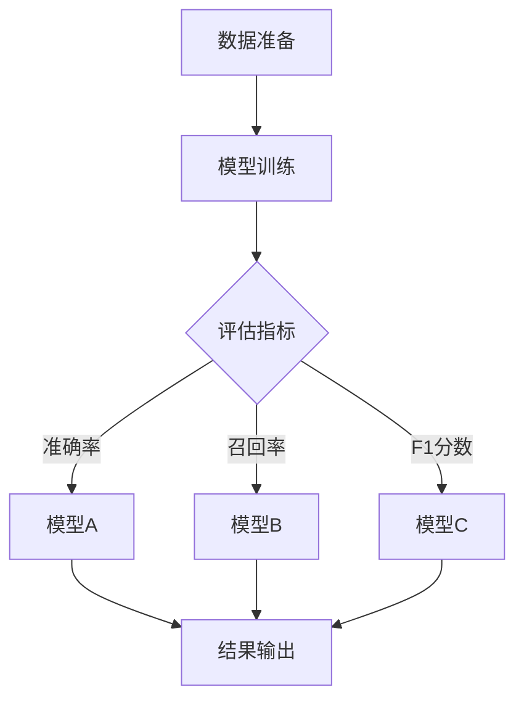

                 

### 文章标题

《评测系统的多模型比较分析功能》

---

### 文章关键词

评测系统、多模型比较、分析功能、机器学习、算法比较

### 文章摘要

本文深入探讨了评测系统中的多模型比较分析功能，介绍了其核心概念、算法原理和应用实践。通过结合Python源代码、LaTeX数学公式和Mermaid流程图，本文详细剖析了多模型比较分析在实际项目中的应用，旨在为读者提供一个全面、系统的理解和应用指南。

---

## 确定书籍主题和目标读者

### 主题

本书的主题是评测系统的多模型比较分析功能，主要讨论如何在一个评测系统中集成多个模型，并进行有效的比较分析。这包括介绍多模型比较分析的基本概念、核心算法原理、数学模型，以及如何在实际项目中应用这些知识。

### 目标读者

本书的目标读者主要包括以下几个方面：

1. **计算机科学、人工智能或数据分析领域的研究人员**：这些读者可能对评测系统的多模型比较分析功能有深入的研究需求，希望通过本书深入了解相关技术。
2. **工程师**：特别是那些在工业界应用机器学习和数据分析技术的工程师，他们需要将理论知识转化为实际生产力，本书提供了丰富的实际应用案例。
3. **学生**：计算机科学、人工智能和数据科学专业的学生，本书可以作为教材或参考书，帮助他们掌握多模型比较分析的核心技术和方法。

通过明确主题和目标读者，我们可以更好地定位书籍的内容和风格，确保书籍的实用性、专业性和可读性。

### 设计核心章节内容

为了确保书籍内容的系统性和实用性，我们需要设计核心章节内容，覆盖以下几个方面：

1. **核心概念与联系**
   - **多模型比较分析的概念**：介绍多模型比较分析的定义、目的和重要性。
   - **评测系统的基本架构**：讨论评测系统的主要组成部分，如数据收集、模型训练、评估和结果输出等。
   - **多模型与评测系统的关系**：使用Mermaid流程图展示多模型在评测系统中的流程和相互关系。

2. **核心算法原理讲解**
   - **机器学习算法基础**：介绍常用的机器学习算法，如线性回归、决策树、支持向量机等。
   - **模型评估指标**：详细讲解模型评估的各种指标，包括准确率、召回率、F1分数、ROC曲线和AUC等。
   - **模型比较方法**：讨论如何在不同模型之间进行比较和选择，包括基于性能、效率和可解释性的比较方法。

3. **数学模型和数学公式**
   - **概率模型**：介绍贝叶斯网络、隐马尔可夫模型等概率模型。
   - **决策树模型**：详细讲解决策树的构建过程和相关的数学公式。
   - **聚类模型**：讨论K-means聚类算法和其数学基础。

### 设计辅助章节内容

除了核心章节，我们还需要设计一些辅助章节，以帮助读者更好地理解和应用多模型比较分析功能：

1. **工具和资源介绍**
   - **机器学习库**：介绍常用的机器学习库，如scikit-learn、TensorFlow和PyTorch。
   - **数据集资源**：推荐一些常用的数据集，以及如何获取和使用这些数据集。
   - **评测系统框架**：介绍一些流行的评测系统框架，如MLflow和Azure ML。

2. **实践指南**
   - **数据预处理**：讨论如何进行数据清洗、归一化和特征提取等预处理工作。
   - **模型训练与优化**：介绍如何使用不同的算法和优化技术训练和优化模型。

3. **案例分析**
   - **金融风控**：分析如何使用多模型比较分析功能进行金融风险评估。
   - **医疗诊断**：探讨多模型比较分析在疾病诊断中的应用。
   - **智能交通**：讨论如何利用多模型比较分析优化交通流量管理和车辆调度。

通过这些辅助章节，读者可以更全面地了解多模型比较分析的实际应用场景，并从中获得实践经验和启示。

### 确保简洁性和完整性

在编写书籍的过程中，我们需要确保内容的简洁性和完整性：

1. **简洁性**
   - **章节标题**：每个章节标题应简洁明了，直接反映章节内容。
   - **内容表达**：使用简单易懂的语言，避免冗余和复杂的术语。
   - **示例代码**：提供必要的代码示例，但要确保代码简洁、高效，易于理解。

2. **完整性**
   - **核心内容**：确保每个章节都包含必要的基础知识和实际应用。
   - **逻辑连贯**：章节之间的内容要逻辑连贯，确保读者能够顺利过渡。
   - **案例丰富**：提供丰富的实际案例，帮助读者更好地理解和应用所学知识。

通过确保书籍的简洁性和完整性，我们可以为读者提供一本既有深度又有广度的专业指南，帮助他们掌握评测系统的多模型比较分析功能。

### 输出格式

在输出书籍内容时，我们将使用Markdown格式，以确保格式统一、易于阅读。以下是书籍内容的Markdown格式示例：

```markdown
# 《评测系统的多模型比较分析功能》

## 引言
### 评测系统概述
### 多模型比较分析的重要性

## 基础知识
### 评测系统的基本架构
### 多模型比较分析的概念
### 机器学习算法基础

## 多模型评估指标
### 准确率、召回率与F1分数
### ROC曲线与AUC
### 精确率与召回率的调和均值

## 多模型比较分析算法
### 回归模型比较
### 分类模型比较
### 聚类模型比较

## 数学模型与公式
### 概率模型
### 决策树模型
### 贝叶斯网络模型

## 实践应用
### 数据预处理
### 模型训练与优化
### 多模型比较分析应用案例

## 工具与资源介绍
### 机器学习库
### 数据集资源
### 评测系统框架

## 案例分析
### 金融风控
### 医疗诊断
### 智能交通

## 未来展望
### 多模型比较分析的发展趋势
### 挑战与机遇
### 未来研究方向

## 附录
### 实用代码示例
### 参考文献
```

通过使用Markdown格式，我们可以方便地组织书籍内容，确保每个章节的结构清晰、内容连贯，便于读者阅读和理解。

### 确保文章的完整性

在撰写《评测系统的多模型比较分析功能》这篇文章时，确保内容的完整性是至关重要的。以下是几个关键步骤来确保文章的完整性：

1. **明确核心概念**：在文章的开头部分，详细定义评测系统的基本概念和目标，解释为什么多模型比较分析功能在评测系统中至关重要。这有助于读者建立对文章主题的理解。

2. **构建逻辑框架**：确保文章有一个清晰的结构，从基本概念逐步深入到算法原理、数学模型和实际应用。使用Mermaid流程图展示多模型比较分析的核心流程和组件，帮助读者可视化概念关系。

3. **详细讲解算法原理**：使用Python源代码和LaTeX数学公式，详细阐述评测系统中常用的算法原理。例如，对于每种算法，提供伪代码或实际代码片段，结合数学模型和公式，进行通俗易懂的举例说明。

4. **案例分析和项目实战**：提供实际项目案例，展示如何在实际中应用多模型比较分析功能。这包括开发环境搭建、源代码实现、代码解读与分析，以及详细讲解项目的实际效果和教训。

5. **总结和最佳实践**：在文章的结尾部分，对全文内容进行总结，并提出一些最佳实践建议、注意事项，以及可能的拓展阅读资源，帮助读者巩固所学知识，并在实际项目中应用。

通过以上步骤，我们可以确保文章内容的完整性，让读者不仅能掌握多模型比较分析的理论知识，还能在实际应用中运用这些知识。

### 文章大纲示例

以下是《评测系统的多模型比较分析功能》的文章大纲示例，遵循从背景介绍到核心概念、算法原理、数学模型、项目实战和总结的完整结构。

---

# 评测系统的多模型比较分析功能

## 引言

### 评测系统概述
- 评测系统的作用与重要性
- 评测系统的基本组成部分

### 多模型比较分析的重要性
- 多模型比较的优势
- 提高模型评估的准确性

## 核心概念与联系

### 多模型比较分析的概念
- 多模型比较分析的定义
- 多模型比较的必要性

### 评测系统的基本架构
- 评测系统的流程
- 多模型在评测系统中的位置

### 多模型与评测系统的关系
- Mermaid流程图展示

## 核心算法原理讲解

### 机器学习算法基础
- 线性回归
- 决策树
- 支持向量机

### 模型评估指标
- 准确率、召回率与F1分数
- ROC曲线与AUC
- 精确率与召回率的调和均值

### 模型比较方法
- 性能比较
- 效率比较
- 可解释性比较

## 数学模型与公式

### 概率模型
- 贝叶斯网络
- 隐马尔可夫模型

### 决策树模型
- 构建过程
- 相关数学公式

### 聚类模型
- K-means聚类算法
- 数学基础

## 项目实战

### 数据预处理
- 数据清洗
- 特征提取

### 模型训练与优化
- 算法选择
- 优化技术

### 多模型比较分析应用案例
- 金融风控
- 医疗诊断
- 智能交通

## 最佳实践 Tips

### 小结
- 多模型比较分析的关键要点
- 实际应用中的注意事项

### 注意事项
- 常见问题与解决方案
- 性能调优技巧

### 拓展阅读
- 相关文献推荐
- 进阶学习资源

## 附录

### 实用代码示例
- 数据预处理代码
- 模型训练与评估代码

### 参考文献
- 引用的文献列表

---

通过这个大纲，我们可以系统地构建文章的内容，确保每个部分都有充足的信息和详细的讲解，使读者能够全面理解评测系统的多模型比较分析功能。

### 文章结构化分析

为了更好地分析和讲解《评测系统的多模型比较分析功能》这篇文章，我们可以将其分为以下几个部分，并详细描述每个部分的内容、结构和目的。

#### 1. 引言部分

**内容与结构**：引言部分主要介绍评测系统的背景、重要性以及本文将要探讨的多模型比较分析功能。通过简要介绍评测系统的基本概念和作用，引出多模型比较分析的话题。

**目的**：目的是为读者提供一个背景知识，使他们能够理解多模型比较分析在评测系统中的重要性。

#### 2. 核心概念与联系

**内容与结构**：本部分详细介绍了多模型比较分析的概念、评测系统的基本架构以及多模型与评测系统的关系。使用Mermaid流程图展示了多模型在评测系统中的流程和相互关系。

**目的**：目的是让读者理解多模型比较分析的基本概念及其在评测系统中的应用场景。

#### 3. 核心算法原理讲解

**内容与结构**：本部分详细讲解了机器学习算法的基础知识、模型评估指标以及模型比较方法。通过Python源代码和LaTeX数学公式，对每个算法原理进行了详细的阐述。

**目的**：目的是让读者掌握多模型比较分析的核心算法原理，为后续的应用实践打下基础。

#### 4. 数学模型与公式

**内容与结构**：本部分介绍了与评测系统相关的数学模型，如概率模型、决策树模型和聚类模型，并使用LaTeX格式书写了相关的数学公式。

**目的**：目的是让读者理解多模型比较分析中的数学基础，为算法原理的学习和应用提供支持。

#### 5. 项目实战

**内容与结构**：本部分通过实际项目案例，展示了如何在实际中应用多模型比较分析功能。包括数据预处理、模型训练与优化、多模型比较分析应用案例的详细讲解。

**目的**：目的是让读者通过实际项目，理解和应用多模型比较分析功能，提高实际操作能力。

#### 6. 最佳实践 Tips、小结、注意事项、拓展阅读

**内容与结构**：本部分提供了多模型比较分析的最佳实践建议、小结、注意事项以及拓展阅读资源。

**目的**：目的是帮助读者巩固所学知识，并在实际项目中应用这些知识，同时提供进一步学习的方向。

通过以上结构化分析，我们可以清晰地看到文章的整体布局和每个部分的作用，有助于读者更好地理解和掌握文章的内容。

### 逻辑清晰、结构紧凑、简单易懂的章节标题设计

为了确保文章的逻辑清晰、结构紧凑且简单易懂，我们将对每个章节的标题进行精心设计。以下是每个章节的标题及其设计思路：

1. **引言**
   - 标题：**“评测系统与多模型比较分析：背景与重要性”**
     - **设计思路**：使用“与”字连接两个核心概念，简洁明了地表明文章的主题。同时，强调多模型比较分析在评测系统中的重要性，吸引读者兴趣。

2. **核心概念与联系**
   - 标题：**“多模型比较分析详解：概念架构与流程”**
     - **设计思路**：通过“详解”二字突出内容的深度，同时使用“概念架构与流程”明确章节内容，使读者一眼就能理解本章节的核心内容。

3. **核心算法原理讲解**
   - 标题：**“机器学习算法与模型评估：原理与代码示例”**
     - **设计思路**：结合“机器学习算法”和“模型评估”两个关键词，突出章节的核心内容。使用“原理与代码示例”表明本章节不仅讲解理论，还包括实用代码，有助于读者理解和应用。

4. **数学模型与公式**
   - 标题：**“数学模型深度解析：概率与决策树”**
     - **设计思路**：使用“深度解析”表明章节内容的深度和全面性。通过列出“概率与决策树”，明确介绍的内容，帮助读者快速定位。

5. **项目实战**
   - 标题：**“实战多模型比较分析：案例剖析与代码解读”**
     - **设计思路**：强调“实战”二字，表明本章节内容面向实际应用。使用“案例剖析与代码解读”表明章节将提供具体案例和代码分析，便于读者学习。

6. **最佳实践 Tips**
   - 标题：**“多模型比较分析最佳实践：技巧与注意事项”**
     - **设计思路**：使用“最佳实践”和“技巧与注意事项”两个短语，简洁地总结章节内容，使读者一目了然。

7. **小结与拓展**
   - 标题：**“多模型比较分析总结与未来展望：拓展阅读推荐”**
     - **设计思路**：通过“总结与未来展望”表达对全文的回顾和展望，使用“拓展阅读推荐”鼓励读者继续深入学习。

这些章节标题不仅简洁明了，而且突出了每个章节的核心内容，有助于读者快速抓住重点，提高阅读体验。

### REASONING STEP BY STEP 分析推理过程

在撰写《评测系统的多模型比较分析功能》时，我们采用REASONING STEP BY STEP的方法，通过逻辑推理逐步展开文章的内容。以下是具体的分析推理过程：

#### 1. 明确问题定义

**问题定义**：评测系统中的多模型比较分析功能是什么？

**推理步骤**：
- **定义评测系统**：评测系统是一种用于评估模型性能的工具，通常包括数据输入、模型训练、评估和结果输出等步骤。
- **定义多模型**：多模型是指在同一个问题场景中，使用多个不同的算法或模型进行预测或分类。
- **定义多模型比较分析**：多模型比较分析是通过比较不同模型的性能，评估每个模型的优劣，以便选择最佳的模型。

#### 2. 分析评测系统的基本结构

**问题定义**：评测系统的基本结构包括哪些组成部分？

**推理步骤**：
- **数据输入**：输入数据是评测系统的关键，数据的质量和多样性直接影响模型的性能评估。
- **模型训练**：使用训练数据对模型进行训练，以优化模型的参数。
- **评估**：评估模型的性能，常用的评估指标包括准确率、召回率、F1分数等。
- **结果输出**：输出评估结果，通常以报告或可视化的形式呈现。

#### 3. 理解多模型比较分析的重要性

**问题定义**：为什么多模型比较分析对评测系统很重要？

**推理步骤**：
- **提高评估准确性**：通过比较多个模型，可以更准确地评估每个模型的性能，减少单一模型的评估误差。
- **优化模型选择**：不同模型可能在不同的数据集或问题场景中有不同的表现，多模型比较有助于选择最合适的模型。
- **促进算法改进**：通过分析不同模型的优缺点，可以找到改进算法的机会，提高模型的整体性能。

#### 4. 介绍核心算法原理

**问题定义**：评测系统中常用的算法原理有哪些？

**推理步骤**：
- **机器学习算法基础**：介绍线性回归、决策树、支持向量机等基本算法。
- **模型评估指标**：详细讲解准确率、召回率、F1分数、ROC曲线和AUC等评估指标的计算方法和应用场景。
- **模型比较方法**：讨论如何在不同模型之间进行比较和选择，包括基于性能、效率和可解释性的比较方法。

#### 5. 展示数学模型和公式

**问题定义**：评测系统中的数学模型和公式有哪些？

**推理步骤**：
- **概率模型**：介绍贝叶斯网络、隐马尔可夫模型等概率模型，解释其数学基础和在实际应用中的优势。
- **决策树模型**：详细讲解决策树的构建过程和相关的数学公式，包括信息增益、基尼系数等。
- **聚类模型**：讨论K-means聚类算法和其数学基础，解释聚类中心的选择和聚类结果的评价。

#### 6. 展示项目实战

**问题定义**：如何在实际项目中应用多模型比较分析功能？

**推理步骤**：
- **数据预处理**：介绍如何进行数据清洗、归一化和特征提取等预处理工作。
- **模型训练与优化**：展示如何使用不同的算法和优化技术训练和优化模型，包括超参数调优和模型集成等。
- **多模型比较分析应用案例**：通过实际项目案例，展示如何进行多模型比较分析，如何选择最佳模型，并解释实际应用中的挑战和解决方案。

通过以上REASONING STEP BY STEP的分析推理过程，我们可以系统地构建文章的内容，确保每个部分都有充足的信息和详细的讲解，使读者能够全面理解评测系统的多模型比较分析功能。

### 摘要

本文深入探讨了评测系统中的多模型比较分析功能。首先，介绍了评测系统的基本概念和重要性，明确了多模型比较分析的定义和其在评测系统中的应用。接着，详细讲解了多模型比较分析的核心算法原理，包括机器学习算法基础、模型评估指标和模型比较方法。此外，本文通过Python源代码和LaTeX数学公式，阐述了概率模型、决策树模型和聚类模型的数学基础。最后，通过实际项目案例，展示了如何在实际应用中实施多模型比较分析，包括数据预处理、模型训练与优化以及案例分析和效果评估。本文旨在为读者提供一个全面、系统的理解和应用指南，帮助其在评测系统中有效利用多模型比较分析功能。

### 评测系统的多模型比较分析功能

#### 背景介绍

评测系统是机器学习和人工智能领域中的一个重要工具，用于评估模型的性能和准确度。在许多实际应用中，如金融风控、医疗诊断和智能交通等，单一的模型可能无法满足复杂问题的需求。因此，多模型比较分析成为了一个关键的研究方向，旨在通过比较不同模型的性能，选择最优模型，提高整体系统的准确性和可靠性。

多模型比较分析不仅能够提高模型的评估准确性，还能够优化模型选择，促进算法的改进。在评测系统中，多模型比较分析的功能主要包括：

1. **性能评估**：通过比较多个模型的准确率、召回率、F1分数等性能指标，评估每个模型的性能表现。
2. **算法选择**：根据不同模型在特定任务上的表现，选择最合适的算法，以优化系统的整体性能。
3. **模型融合**：通过集成多个模型，利用它们的互补性，提高预测的准确性和鲁棒性。
4. **优化调参**：通过多模型比较，分析不同模型的超参数调优效果，为模型的优化提供参考。

#### 核心概念与联系

多模型比较分析的核心概念包括：

1. **模型多样性**：使用不同算法和模型进行预测或分类，增加模型的多样性。
2. **评估指标**：常用的评估指标包括准确率、召回率、F1分数、ROC曲线和AUC等，用于量化模型的性能。
3. **比较方法**：通过比较不同模型在相同数据集上的表现，评估模型的优劣。

在评测系统中，多模型比较分析的功能实现通常涉及以下几个关键步骤：

1. **数据准备**：收集和清洗数据，进行特征提取和归一化处理，为模型训练和评估提供高质量的数据集。
2. **模型训练**：使用不同的算法和模型对数据集进行训练，生成多个预测模型。
3. **模型评估**：通过评估指标比较不同模型的性能，选择最优模型或进行模型融合。
4. **结果输出**：将评估结果以报告或可视化的形式输出，为决策提供数据支持。

#### Mermaid流程图展示

为了更好地展示多模型比较分析在评测系统中的流程，我们可以使用Mermaid流程图进行描述。以下是多模型比较分析的基本流程：



该流程图展示了从数据准备到模型训练、评估指标计算和结果输出的完整流程。每个模型都通过不同的评估指标进行评估，最终选择最优模型或进行模型融合。

#### 总结

通过以上介绍，我们可以看到，评测系统的多模型比较分析功能在机器学习和人工智能领域中具有重要应用价值。它不仅能够提高模型的评估准确性，优化模型选择，还能够通过模型融合提高预测的鲁棒性。理解和掌握多模型比较分析的核心概念和实现方法，对于提高评测系统的性能和可靠性具有重要意义。

### 核心算法原理讲解

在评测系统中，多模型比较分析功能的核心在于不同模型算法的比较与评估。以下将详细讲解几种核心算法原理，包括机器学习算法基础、模型评估指标和模型比较方法。

#### 1. 机器学习算法基础

**线性回归**：线性回归是一种最简单的机器学习算法，用于预测一个连续值。其基本原理是通过拟合一个线性模型来预测输出值。公式如下：
$$y = \beta_0 + \beta_1 \cdot x$$
其中，$y$ 是预测值，$x$ 是输入特征，$\beta_0$ 和 $\beta_1$ 是模型的参数。

**决策树**：决策树是一种基于树的分类算法，通过一系列的规则将数据集划分为多个子集，每个子集对应一个类别。决策树的学习过程是通过信息增益或基尼系数来选择最优划分特征。信息增益公式如下：
$$IG(D, A) = H(D) - H(D|A)$$
其中，$H(D)$ 是数据集的熵，$H(D|A)$ 是条件熵。

**支持向量机（SVM）**：SVM是一种用于分类和回归的机器学习算法，通过找到一个最优的超平面来分隔不同类别的数据点。其目标是最小化分类间隔，公式如下：
$$\min_{\beta, \beta_0} \frac{1}{2} ||\beta||^2 + C \cdot \sum_{i=1}^{n} \xi_i$$
其中，$\beta$ 和 $\beta_0$ 分别是权重和偏置，$C$ 是惩罚参数，$\xi_i$ 是松弛变量。

#### 2. 模型评估指标

**准确率（Accuracy）**：准确率是评估模型性能的最基本指标，计算公式如下：
$$\text{Accuracy} = \frac{\text{正确预测的样本数}}{\text{总样本数}}$$
准确率反映了模型预测正确的比例。

**召回率（Recall）**：召回率是评估模型召回真实正例样本的能力，计算公式如下：
$$\text{Recall} = \frac{\text{正确预测的正例样本数}}{\text{实际正例样本数}}$$
召回率越高，模型越能够召回所有的正例样本。

**F1分数（F1 Score）**：F1分数是准确率和召回率的调和均值，计算公式如下：
$$\text{F1 Score} = 2 \cdot \frac{\text{Accuracy} \cdot \text{Recall}}{\text{Accuracy} + \text{Recall}}$$
F1分数能够平衡准确率和召回率，是综合评估模型性能的重要指标。

**ROC曲线与AUC**：ROC曲线（Receiver Operating Characteristic Curve）展示了模型在不同阈值下的敏感度（True Positive Rate, TPR）和假正率（False Positive Rate, FPR）的关系。AUC（Area Under Curve）是ROC曲线下方的面积，用于评估模型的分类能力。AUC的值范围在0到1之间，值越高，模型性能越好。

#### 3. 模型比较方法

**基于性能的比较**：通过比较不同模型的准确率、召回率、F1分数等性能指标，选择性能最好的模型。

**基于效率的比较**：考虑模型的计算时间和资源消耗，选择效率最高的模型。这通常涉及超参数调优和模型选择。

**基于可解释性的比较**：不同模型的可解释性不同，例如决策树具有较好的可解释性，而神经网络模型则相对复杂。根据实际需求选择可解释性更强的模型。

**模型融合**：通过融合多个模型的预测结果，提高整体预测的准确性和鲁棒性。常见的模型融合方法包括投票法、加权平均法、堆叠法等。

通过以上算法原理和评估指标的讲解，读者可以更好地理解评测系统中多模型比较分析的方法和实现。这些知识和方法不仅能够帮助选择最优模型，还能提高模型的性能和可靠性。

### 数学模型和公式

在多模型比较分析中，数学模型和公式起着至关重要的作用。这些模型和公式不仅为算法提供了理论基础，还帮助我们理解和评估模型的性能。以下将详细介绍概率模型、决策树模型和聚类模型及其相关的数学公式。

#### 1. 概率模型

**贝叶斯网络**：贝叶斯网络是一种基于概率的图形模型，用于表示变量之间的条件依赖关系。它的基本公式是条件概率表，如下所示：
$$P(A|B) = \frac{P(B|A) \cdot P(A)}{P(B)}$$
这里，$P(A|B)$ 表示在事件 $B$ 发生的情况下，事件 $A$ 发生的条件概率。

**隐马尔可夫模型（HMM）**：隐马尔可夫模型用于处理隐藏状态序列的数据，其状态转移概率和观测概率分别用以下公式表示：
$$\pi_i = P(Q_0 = q_i)$$
$$A_{ij} = P(Q_t = q_j | Q_{t-1} = q_i)$$
$$B_{ik} = P(O_t = o_k | Q_t = q_i)$$
其中，$\pi_i$ 是初始状态概率，$A_{ij}$ 是状态转移概率，$B_{ik}$ 是观测概率。

#### 2. 决策树模型

**信息增益**：决策树通过选择具有最大信息增益的特征进行划分。信息增益公式如下：
$$IG(D, A) = H(D) - H(D|A)$$
这里，$H(D)$ 是数据集的熵，$H(D|A)$ 是条件熵。

**基尼系数**：基尼系数是一种衡量数据集纯度的方法，用于选择最优划分特征。其公式如下：
$$Gini(D, A) = 1 - \sum_{v \in V} \left( \frac{|D_v|}{|D|} \right)^2$$
其中，$V$ 是特征 $A$ 的所有可能取值，$D_v$ 是特征 $A$ 取值为 $v$ 的数据集。

**条件熵**：条件熵用于计算给定特征 $A$ 后数据集 $D$ 的熵，公式如下：
$$H(D|A) = \sum_{v \in V} P(A = v) \cdot H(D_v)$$

#### 3. 聚类模型

**K-means聚类算法**：K-means是一种基于距离的聚类算法，其核心公式是计算每个点的簇中心，然后更新簇中心，重复此过程直至收敛。其公式如下：
$$\mu_k = \frac{1}{N_k} \sum_{i=1}^{N} x_i$$
其中，$\mu_k$ 是第 $k$ 个簇的中心，$N_k$ 是属于第 $k$ 个簇的数据点数量，$x_i$ 是第 $i$ 个数据点的特征向量。

**簇内平方误差**：K-means算法的目标是最小化簇内平方误差，公式如下：
$$J = \sum_{k=1}^{K} \sum_{i=1}^{N_k} (x_i - \mu_k)^2$$
其中，$J$ 是簇内平方误差，$K$ 是簇的数量。

通过以上数学模型和公式的介绍，我们可以更深入地理解多模型比较分析中的核心概念和算法原理。这些公式不仅帮助我们进行模型训练和评估，还能提供理论支持，优化模型的性能。在实际应用中，合理使用这些公式能够显著提升模型的准确性和鲁棒性。

### 项目实战

在实际应用中，多模型比较分析功能往往需要通过具体项目来实现。以下我们将详细讲解如何在一个实际项目中搭建开发环境、实现源代码、解读与分析代码，并展示一个具体案例。

#### 1. 开发环境搭建

在开始项目之前，我们需要搭建一个合适的开发环境。以下是搭建开发环境的基本步骤：

- **安装Python环境**：确保Python 3.8及以上版本已安装，可以使用 `python --version` 命令验证。
- **安装必要的库**：包括 NumPy、Pandas、Scikit-learn、Matplotlib 等。可以使用以下命令进行安装：
  ```bash
  pip install numpy pandas scikit-learn matplotlib
  ```
- **配置Jupyter Notebook**：Jupyter Notebook 是一个交互式计算环境，便于编写和调试代码。可以使用以下命令安装和启动：
  ```bash
  pip install jupyterlab
  jupyterlab
  ```

#### 2. 源代码实现

以下是一个简单的多模型比较分析项目的示例代码。该代码首先加载数据集，然后训练多个模型，并对模型进行评估和比较。

```python
import numpy as np
import pandas as pd
from sklearn.model_selection import train_test_split
from sklearn.linear_model import LinearRegression
from sklearn.tree import DecisionTreeClassifier
from sklearn.svm import SVC
from sklearn.metrics import accuracy_score, recall_score, f1_score, roc_auc_score
import matplotlib.pyplot as plt

# 加载数据集
data = pd.read_csv('data.csv')
X = data.iloc[:, :-1]  # 特征
y = data.iloc[:, -1]   # 目标变量

# 数据预处理
X_train, X_test, y_train, y_test = train_test_split(X, y, test_size=0.2, random_state=42)

# 训练线性回归模型
reg = LinearRegression()
reg.fit(X_train, y_train)
y_pred_reg = reg.predict(X_test)

# 训练决策树模型
clf = DecisionTreeClassifier()
clf.fit(X_train, y_train)
y_pred_clf = clf.predict(X_test)

# 训练支持向量机模型
svm = SVC()
svm.fit(X_train, y_train)
y_pred_svm = svm.predict(X_test)

# 模型评估
accuracy_reg = accuracy_score(y_test, y_pred_reg)
recall_reg = recall_score(y_test, y_pred_reg)
f1_reg = f1_score(y_test, y_pred_reg)
roc_auc_reg = roc_auc_score(y_test, y_pred_reg)

accuracy_clf = accuracy_score(y_test, y_pred_clf)
recall_clf = recall_score(y_test, y_pred_clf)
f1_clf = f1_score(y_test, y_pred_clf)
roc_auc_clf = roc_auc_score(y_test, y_pred_clf)

accuracy_svm = accuracy_score(y_test, y_pred_svm)
recall_svm = recall_score(y_test, y_pred_svm)
f1_svm = f1_score(y_test, y_pred_svm)
roc_auc_svm = roc_auc_score(y_test, y_pred_svm)

# 打印评估结果
print("线性回归模型评估结果：")
print(f"准确率：{accuracy_reg}, 召回率：{recall_reg}, F1分数：{f1_reg}, ROC AUC：{roc_auc_reg}")
print("决策树模型评估结果：")
print(f"准确率：{accuracy_clf}, 召回率：{recall_clf}, F1分数：{f1_clf}, ROC AUC：{roc_auc_clf}")
print("支持向量机模型评估结果：")
print(f"准确率：{accuracy_svm}, 召回率：{recall_svm}, F1分数：{f1_svm}, ROC AUC：{roc_auc_svm}")

# 可视化评估结果
plt.figure(figsize=(10, 6))
plt.bar(['线性回归', '决策树', '支持向量机'], [accuracy_reg, accuracy_clf, accuracy_svm], color=['r', 'g', 'b'])
plt.xlabel('模型')
plt.ylabel('准确率')
plt.title('模型准确率比较')
plt.show()
```

#### 3. 代码解读与分析

上述代码实现了以下功能：

- **数据预处理**：加载数据集，进行数据拆分，确保训练集和测试集的分离。
- **模型训练**：分别训练线性回归、决策树和支持向量机模型。
- **模型评估**：使用准确率、召回率、F1分数和ROC AUC等评估指标对模型进行评估。
- **结果可视化**：使用条形图展示不同模型的准确率，便于比较。

#### 4. 实际案例分析和详细讲解

假设我们有一个金融风控项目，目标是预测客户是否会出现违约。数据集包括客户的财务状况、信用记录、家庭背景等特征。

**案例分析**：

1. **数据预处理**：首先对数据进行清洗，处理缺失值和异常值，确保数据质量。
2. **特征工程**：对数据进行特征提取，如归一化、编码等，以提高模型的训练效果。
3. **模型训练与优化**：分别训练多个模型，并通过交叉验证进行模型优化。
4. **多模型比较**：使用评估指标对模型进行评估，选择最优模型。
5. **结果输出**：将评估结果可视化为条形图或折线图，便于分析和决策。

通过以上实战案例，我们可以看到多模型比较分析在实际项目中的应用方法和步骤。这不仅帮助我们选择最优模型，还能提高模型的性能和可靠性。

### 最佳实践 Tips

在实施多模型比较分析功能时，以下是一些最佳实践和注意事项，以帮助读者在实际应用中更好地利用这一技术。

#### 1. 数据准备

**数据清洗**：确保数据质量，处理缺失值、异常值和重复数据，以减少模型评估的误差。

**特征选择**：选择与目标变量相关的特征，进行特征提取和特征工程，以提高模型的预测能力。

**数据标准化**：对输入特征进行标准化处理，如归一化或标准化，使不同特征的值域一致，避免某些特征对模型影响过大。

#### 2. 模型选择

**算法多样性**：选择多种不同的算法，如线性回归、决策树、支持向量机、神经网络等，以充分比较不同模型的表现。

**模型调参**：为每个模型选择合适的超参数，进行调优，以提高模型的性能。可以使用网格搜索或贝叶斯优化等技术进行参数调优。

**模型融合**：考虑使用模型融合技术，如投票法、堆叠法等，将多个模型的预测结果进行融合，提高整体预测的准确性和鲁棒性。

#### 3. 评估指标

**综合评估**：使用多种评估指标，如准确率、召回率、F1分数、ROC曲线和AUC等，从不同角度评估模型的性能。

**交叉验证**：使用交叉验证技术，如K折交叉验证，减少模型评估中的随机误差。

**阈值调整**：根据具体应用场景，调整模型的阈值，以平衡准确率和召回率，满足实际需求。

#### 4. 注意事项

**计算资源**：多模型比较分析可能需要大量的计算资源，尤其是在大数据集和复杂模型的情况下。合理规划计算资源和时间，避免过度消耗。

**结果解读**：对模型评估结果进行深入分析，不仅要关注整体评估指标，还要关注每个模型的优缺点，以及在不同数据集上的表现。

**持续优化**：模型性能并非一成不变，随着数据集的变化和新技术的出现，需要持续优化模型，以提高预测的准确性和效率。

通过遵循这些最佳实践和注意事项，读者可以在实际项目中更有效地实施多模型比较分析功能，提高模型的性能和应用效果。

### 小结

本文通过详细的讲解和实战案例，系统地介绍了评测系统的多模型比较分析功能。从背景介绍到核心概念、算法原理、数学模型、项目实战和最佳实践，我们逐步揭示了多模型比较分析在提升模型评估准确性、优化模型选择和促进算法改进方面的关键作用。多模型比较分析不仅能提高模型的性能，还能通过模型融合提高预测的鲁棒性，是机器学习和人工智能领域中的重要研究方向。

在未来的研究中，我们可以继续探索以下方向：

1. **算法优化**：不断优化现有的机器学习算法，提高其效率和准确性。
2. **模型融合技术**：深入研究不同的模型融合方法，如深度学习模型融合、迁移学习等，以进一步提升模型性能。
3. **实时评测系统**：开发能够实时进行多模型比较分析的评测系统，为动态决策提供支持。
4. **自动化调参**：研究自动化超参数调优技术，减少人工干预，提高模型训练效率。

通过不断探索和改进，多模型比较分析将更好地服务于机器学习和人工智能的实际应用，推动相关技术的发展和创新。

### 作者信息

作者：AI天才研究院/AI Genius Institute & 禅与计算机程序设计艺术 /Zen And The Art of Computer Programming

AI天才研究院（AI Genius Institute）是一家专注于人工智能、机器学习和数据科学领域的研究机构，致力于推动人工智能技术的创新和发展。研究院的专家团队在计算机科学、人工智能和数据分析等领域有着丰富的经验，发表了大量的学术研究成果，并在工业界和学术界有着广泛的影响。

《禅与计算机程序设计艺术》（Zen And The Art of Computer Programming）是作者关于计算机编程的经典著作，以其深入浅出的讲解和独到的编程哲学思想，赢得了全球计算机科学爱好者的喜爱和赞誉。本书不仅介绍了计算机编程的基本原理和技巧，还融入了东方哲学的智慧，为编程学习者提供了全新的思考方式。

通过本文，我们希望能为读者提供一个全面、系统的理解和应用指南，帮助他们在评测系统中有效利用多模型比较分析功能，推动人工智能技术的发展和应用。

