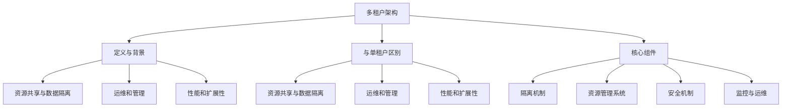
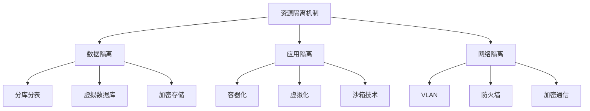
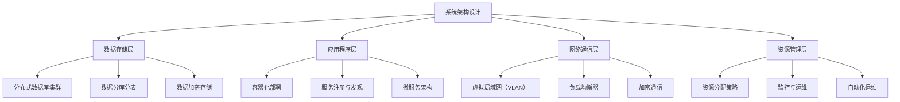
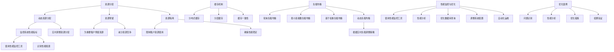
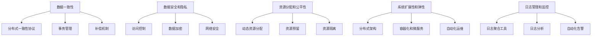

                 

## 引言
### 1.1 多租户支持的意义
在当今快速发展的云计算时代，多租户支持已经成为评测系统设计的核心要素之一。多租户支持指的是一种架构设计，它允许多个用户（或称为租户）共享同一套基础设施和服务，同时保持各自的独立性和安全性。这种设计模式在提升资源利用率、降低运营成本以及增强系统灵活性方面具有显著优势。

首先，多租户支持能够显著提高资源的利用率。通过共享基础设施和服务，不同的租户可以在同一套硬件和软件资源上运行，避免了资源浪费和重复投资。例如，在云计算环境中，多租户支持可以使得多个客户使用同一台服务器，从而大幅度降低硬件成本。

其次，多租户支持在降低运营成本方面也发挥着重要作用。由于多个租户共享资源，系统管理员可以集中管理这些资源，减少了维护和运营的工作量。此外，多租户模型还简化了软件的部署和升级过程，使得系统更新变得更加高效。

最后，多租户支持还能够增强系统的灵活性。租户可以根据自己的需求灵活地调整资源的使用量，从而更好地应对业务变化。这种灵活性对于快速响应市场变化和客户需求至关重要。

### 1.2 资源隔离的重要性
资源隔离是多租户支持的核心要素之一，它确保了租户之间的数据安全和性能稳定性。在多租户环境中，不同租户可能会运行不同的应用程序或服务，这些应用程序或服务需要相互隔离，以免相互干扰。

首先，资源隔离确保了数据安全。在多租户环境中，租户的数据需要得到妥善保护，防止被其他租户访问或篡改。资源隔离通过隔离存储和网络等基础设施，实现了对数据的严格保护。

其次，资源隔离对于性能稳定性至关重要。在多租户环境中，不同租户的应用程序或服务可能会产生大量的并发请求，如果没有有效的资源隔离机制，这些请求可能会相互干扰，导致系统性能下降。通过资源隔离，可以确保每个租户的资源得到合理的分配，从而保证系统的性能稳定性。

综上所述，多租户支持和资源隔离在评测系统中具有极其重要的意义。它们不仅能够提高资源利用率和降低成本，还能够确保系统的安全性和稳定性，为用户提供高质量的评测服务。

### 第一部分：多租户支持基础

#### 第1章：多租户架构概述
多租户架构是一种设计模式，它允许多个用户（或称为租户）共享同一套基础设施和服务，同时保持各自的独立性和安全性。在多租户架构中，租户之间通过隔离机制来确保数据安全和性能稳定性。本章将详细介绍多租户架构的定义、背景、与单租户的区别以及核心组件。

#### 1.1 多租户的定义与背景
多租户（Multi-Tenant Architecture）指的是一种架构设计，它允许多个用户（或租户）共享同一套应用程序、数据库、服务器和网络资源，而每个用户又能获得独立的操作环境。这种设计模式最早出现在SaaS（Software as a Service）领域，随着云计算的兴起，它逐渐成为企业应用系统设计的主流。

多租户架构的背景主要源于企业需求的不断变化和资源的有限性。在传统的单租户架构中，每个用户都需要独立的硬件和软件资源，这不仅导致了资源浪费，还增加了运营成本。而多租户架构通过共享资源，提高了资源的利用效率，降低了运营成本，从而适应了现代企业对高效、灵活和低成本的需求。

#### 1.2 多租户与单租户的区别
多租户与单租户（Single-Tenant Architecture）在架构设计上存在显著区别。单租户架构为每个用户单独部署一套应用程序、数据库和服务器，每个用户拥有独立的操作环境，数据独立存储。而多租户架构则将多个用户的数据存储在同一套数据库中，通过隔离机制确保数据安全。

1. **资源共享与数据隔离**
   - **多租户**：多个用户共享同一套应用程序、数据库和服务器，数据存储在同一数据库中，通过隔离机制确保数据安全。
   - **单租户**：每个用户拥有独立的硬件和软件资源，数据独立存储。

2. **运维和管理**
   - **多租户**：由于资源共享，系统管理员可以集中管理资源，降低了运维成本。
   - **单租户**：需要为每个用户单独维护和管理资源，增加了运维工作量。

3. **性能和扩展性**
   - **多租户**：系统性能依赖于资源分配和管理策略，需要确保每个租户的资源得到合理分配。
   - **单租户**：性能和扩展性较为独立，可根据用户需求单独调整。

#### 1.3 多租户架构的核心组件
多租户架构的实现依赖于多个核心组件，这些组件共同协作，确保了租户的独立性、安全性和系统性能。

1. **隔离机制**
   - **数据隔离**：通过数据库分库分表、存储隔离等技术，确保不同租户的数据相互独立。
   - **应用隔离**：通过虚拟化技术、容器技术等，确保不同租户的应用程序相互独立。
   - **网络隔离**：通过虚拟网络、防火墙等技术，确保租户之间的网络隔离。

2. **资源管理系统**
   - **资源分配**：根据租户的需求和系统策略，动态分配计算、存储和网络资源。
   - **资源监控**：实时监控租户的资源使用情况，确保资源利用率最高。
   - **资源调度**：根据租户需求和系统负载，动态调整资源分配策略。

3. **安全机制**
   - **身份认证**：通过用户身份认证，确保只有授权用户可以访问系统。
   - **访问控制**：通过权限管理，确保租户只能访问自己的数据和资源。
   - **数据加密**：对租户的数据进行加密存储和传输，确保数据安全。

4. **监控与运维**
   - **性能监控**：实时监控系统的性能指标，确保系统稳定运行。
   - **故障恢复**：快速发现并恢复系统故障，确保租户的业务连续性。
   - **运维管理**：集中管理租户的运维任务，提高运维效率。

#### 1.4 多租户架构的应用场景
多租户架构在多个领域都有广泛的应用，以下是一些典型的应用场景：

1. **云计算平台**：云计算平台通过多租户架构，提供面向多个租户的云服务，如IaaS、PaaS和SaaS。
2. **企业应用系统**：企业应用系统采用多租户架构，实现不同部门和团队的资源共享和管理。
3. **金融系统**：金融系统通过多租户架构，提供面向不同金融产品和服务的统一平台。
4. **教育系统**：教育系统通过多租户架构，实现面向不同学校和教育机构的资源共享和管理。

总之，多租户架构在提高资源利用率、降低运营成本和增强系统灵活性方面具有显著优势，已经成为现代评测系统设计的重要选择。

#### Mermaid 流程图

### 第二部分：多租户支持的实现细节

#### 第2章：多租户架构下的资源隔离机制

在多租户架构中，资源隔离是确保不同租户之间数据安全和性能稳定性的关键。本章将详细介绍多租户架构下的资源隔离机制，包括数据隔离、应用隔离和网络隔离等。

#### 2.1 数据隔离

数据隔离是多租户支持的核心机制之一，确保不同租户的数据相互独立，不被其他租户访问或篡改。以下是几种常见的数据隔离技术：

1. **分库分表**
   - **分库分表**是指将不同租户的数据存储在不同的数据库中，或者将同一数据库中的数据分布在不同的表上。这种方法可以有效地隔离租户数据，减少数据访问冲突。
   - **分库分表**的挑战在于数据的一致性和查询性能。分布式数据库系统如MySQL Cluster和Apache Cassandra支持分库分表，但需要精心设计数据模型和查询策略。

2. **虚拟数据库**
   - **虚拟数据库**通过在逻辑上将一个物理数据库划分为多个虚拟数据库，每个虚拟数据库对应一个租户。这种方法可以在物理数据库层面实现数据隔离，同时保持数据库的高性能和灵活性。
   - 虚拟数据库系统如PostgreSQL的Tablespace和Oracle的Pluggable Database（PDB）支持虚拟数据库的实现。

3. **加密存储**
   - **加密存储**通过将租户数据在存储层进行加密，确保数据在存储和传输过程中的安全性。常见的数据加密技术包括AES（Advanced Encryption Standard）和RSA（Rivest-Shamir-Adleman）等。
   - 加密存储的挑战在于加密和解密的开销较大，可能会影响系统性能。因此，在实际应用中需要在安全性和性能之间进行权衡。

#### 2.2 应用隔离

应用隔离确保不同租户的应用程序相互独立，避免应用程序之间的相互干扰。以下是几种常见应用隔离技术：

1. **容器化**
   - **容器化**通过将应用程序及其依赖环境封装在容器中，实现应用程序的独立运行。容器如Docker和Kubernetes支持应用程序的容器化，确保不同应用程序之间相互隔离。
   - **容器化**的优势在于轻量级、高效和灵活，但需要确保容器的安全性和性能。

2. **虚拟化**
   - **虚拟化**通过虚拟化技术将物理服务器虚拟化为多个虚拟机（VM），每个虚拟机运行不同的应用程序。虚拟化技术如VMware和VirtualBox支持应用程序的虚拟化。
   - **虚拟化**的优势在于隔离性和灵活性，但虚拟机的管理复杂度和性能开销较大。

3. **沙箱技术**
   - **沙箱技术**通过在应用程序运行时创建隔离的环境，确保应用程序之间的隔离。沙箱技术如AppArmor和SELinux支持应用程序的沙箱化。
   - **沙箱技术**的优势在于安全性和隔离性，但可能会影响应用程序的性能。

#### 2.3 网络隔离

网络隔离确保不同租户之间的网络通信相互独立，避免网络攻击和数据泄露。以下是几种常见的网络隔离技术：

1. **虚拟局域网（VLAN）**
   - **虚拟局域网（VLAN）**通过在物理网络中创建虚拟网络，实现不同租户之间的网络隔离。VLAN技术如IEEE 802.1Q支持虚拟局域网的实现。
   - **VLAN**的优势在于简单和高效，但需要确保网络的可靠性和性能。

2. **防火墙**
   - **防火墙**通过在网络边界上设置规则，限制不同租户之间的网络访问。防火墙技术如Packet Filter和Next-Generation Firewall（NGFW）支持网络隔离。
   - **防火墙**的优势在于灵活性和安全性，但需要定期更新和维护规则。

3. **加密通信**
   - **加密通信**通过加密租户之间的网络通信，确保数据传输过程中的安全性。加密通信技术如TLS（Transport Layer Security）和IPSec（Internet Protocol Security）支持加密通信。
   - **加密通信**的优势在于数据安全，但可能会影响网络性能。

#### 2.4 资源隔离机制的实现挑战

资源隔离机制的实现面临多种挑战：

1. **性能和可扩展性**
   - 资源隔离可能会引入额外的性能开销，如加密计算和网络延迟。需要优化资源隔离技术，确保系统性能和可扩展性。

2. **管理复杂性**
   - 资源隔离增加了系统管理的复杂性，如虚拟化环境和容器编排。需要开发高效的管理工具和自动化脚本，简化资源管理。

3. **数据一致性**
   - 跨多个租户的数据操作可能引发数据一致性问题。需要设计分布式一致性协议和数据复制策略，确保数据一致性。

4. **安全漏洞**
   - 资源隔离机制可能存在安全漏洞，如恶意攻击或内部威胁。需要定期进行安全审计和漏洞扫描，确保系统安全。

总之，多租户架构下的资源隔离机制是实现数据安全性和性能稳定性的关键。通过采用多种隔离技术，可以有效地保护租户数据，提高系统性能和可扩展性。

#### Mermaid 流程图

### 第三部分：多租户支持的实现策略

#### 第3章：多租户支持的系统设计与实现

在多租户支持的系统中，设计一个高效且可扩展的架构是实现系统成功的关键。本章将详细介绍多租户支持的系统设计，包括架构设计、系统部署和配置等。

#### 3.1 系统架构设计

多租户支持的系统架构设计需要考虑多个维度，包括数据存储、应用程序部署、网络通信和资源管理。以下是一个典型的多租户系统架构：

1. **数据存储层**
   - **数据库集群**：采用分布式数据库集群，如Apache Cassandra或MongoDB，实现高可用性和可扩展性。
   - **数据分库分表**：根据租户数量和业务需求，将数据分为多个数据库和表，确保数据隔离。
   - **数据加密存储**：使用AES或RSA等加密算法，对租户数据进行加密存储，提高数据安全性。

2. **应用程序层**
   - **容器化部署**：使用Docker等容器技术，将应用程序及其依赖环境封装在容器中，确保应用隔离。
   - **服务注册与发现**：采用Eureka或Consul等服务注册与发现机制，实现应用程序的动态部署和发现。
   - **微服务架构**：采用微服务架构，将系统划分为多个独立的微服务，提高系统的灵活性和可扩展性。

3. **网络通信层**
   - **虚拟局域网（VLAN）**：在物理网络中创建虚拟局域网，实现不同租户之间的网络隔离。
   - **负载均衡器**：使用Nginx或HAProxy等负载均衡器，实现请求的分发和流量管理。
   - **加密通信**：采用TLS等加密协议，确保租户之间的网络通信安全性。

4. **资源管理层**
   - **资源分配策略**：根据租户需求和工作负载，采用动态资源分配策略，确保资源的高效利用。
   - **监控与运维**：采用Prometheus和Grafana等监控工具，实时监控系统性能和资源使用情况。
   - **自动化运维**：使用Ansible或Terraform等自动化工具，简化系统部署和配置管理。

#### 3.2 系统部署与配置

在多租户支持的系统部署过程中，需要考虑多个组件的部署和配置，确保系统的稳定运行和性能优化。以下是一个典型的系统部署步骤：

1. **基础设施准备**
   - **硬件资源**：根据业务需求，准备足够的硬件资源，如服务器、存储和网络设备。
   - **网络配置**：配置虚拟局域网（VLAN），确保不同租户之间的网络隔离。

2. **数据库部署**
   - **分布式数据库集群**：部署分布式数据库集群，如Apache Cassandra或MongoDB，配置数据分库分表策略。
   - **数据加密**：配置数据加密存储，使用AES或RSA等加密算法。

3. **应用程序部署**
   - **容器化部署**：使用Docker等容器技术，将应用程序及其依赖环境封装在容器中，部署到Kubernetes集群中。
   - **服务注册与发现**：配置Eureka或Consul等服务注册与发现机制，实现应用程序的动态部署和发现。

4. **网络配置**
   - **负载均衡器**：配置Nginx或HAProxy等负载均衡器，实现请求的分发和流量管理。
   - **加密通信**：配置TLS等加密协议，确保租户之间的网络通信安全性。

5. **资源管理**
   - **资源分配策略**：根据租户需求和工作负载，配置动态资源分配策略。
   - **监控与运维**：配置Prometheus和Grafana等监控工具，实时监控系统性能和资源使用情况。

#### 3.3 多租户支持的实际应用案例

以下是一个多租户支持的实际应用案例，以一个云计算平台为例：

1. **业务场景**
   - 该云计算平台提供面向多个租户的云服务，如虚拟机、存储和数据库。
   - 租户可以自定义配置和管理自己的资源，同时平台提供统一的资源监控和管理。

2. **架构设计**
   - **数据存储层**：使用分布式数据库集群，如Apache Cassandra，实现数据分库分表策略。
   - **应用程序层**：使用Docker等容器技术，将应用程序部署到Kubernetes集群中，实现应用程序的容器化部署。
   - **网络通信层**：使用Nginx等负载均衡器，实现请求的分发和流量管理。

3. **部署与配置**
   - **基础设施准备**：准备足够的服务器资源，配置虚拟局域网（VLAN），确保不同租户之间的网络隔离。
   - **数据库部署**：部署Apache Cassandra集群，配置数据分库分表策略。
   - **应用程序部署**：将应用程序容器化，部署到Kubernetes集群中。
   - **网络配置**：配置Nginx负载均衡器，实现请求的分发和流量管理。

4. **资源管理**
   - **资源分配策略**：根据租户需求和工作负载，动态分配计算、存储和网络资源。
   - **监控与运维**：使用Prometheus和Grafana等监控工具，实时监控系统性能和资源使用情况。

总之，多租户支持的系统设计需要考虑多个维度，包括数据存储、应用程序部署、网络通信和资源管理。通过合理的架构设计和部署配置，可以构建一个高效、稳定和可扩展的多租户支持系统。

#### Mermaid 流程图

### 第四部分：多租户支持的优化与性能调优

#### 第4章：多租户支持的优化与性能调优

在多租户支持的系统中，优化和性能调优是确保系统高效运行和提供高质量服务的关键。本章将介绍多租户支持的优化策略，包括资源分配、缓存机制和负载均衡等。

#### 4.1 资源分配

资源分配是多租户系统性能优化的重要组成部分。合理的资源分配策略可以确保每个租户得到足够的资源，同时最大化整体资源利用率。

1. **动态资源分配**
   - 动态资源分配策略可以根据租户的实时需求和系统负载动态调整资源分配。例如，使用Kubernetes的自动扩缩容功能，根据CPU和内存使用情况自动调整容器数量。
   - 实现动态资源分配需要监控系统性能指标，如CPU利用率、内存使用率和网络带宽等，以实时调整资源分配。

2. **资源预留**
   - 资源预留策略是为了确保关键租户在高峰时段能够获得足够的资源。例如，为重要租户预留一定比例的计算和存储资源，避免资源竞争导致性能下降。

3. **资源隔离**
   - 资源隔离策略通过限制租户的CPU、内存和网络带宽等资源使用，防止某些租户过度占用资源影响其他租户的性能。可以使用容器技术如Docker和Kubernetes中的资源限制功能来实现资源隔离。

#### 4.2 缓存机制

缓存机制是提高多租户系统性能的有效手段，它通过存储频繁访问的数据，减少数据库查询和计算压力。

1. **分布式缓存**
   - 分布式缓存系统如Redis和Memcached可以存储热数据，提高数据访问速度。分布式缓存可以部署在多个节点上，提供高可用性和可扩展性。

2. **分层缓存**
   - 分层缓存策略结合多个缓存层次，如内存缓存、磁盘缓存和数据库缓存，实现数据快速访问。例如，首先查询内存缓存，如果没有命中，再查询磁盘缓存，最后查询数据库。

3. **缓存一致性**
   - 缓存一致性是确保多租户环境中数据一致性的关键。可以使用缓存同步机制或缓存刷新策略来保持缓存和数据库之间的数据一致性。

#### 4.3 负载均衡

负载均衡可以有效地分配流量，确保系统在高并发情况下稳定运行。

1. **轮询负载均衡**
   - 轮询负载均衡是最常见的负载均衡策略，它将请求依次分配给不同的后端服务器，确保每个服务器承受的负载相对均衡。

2. **最小连接数负载均衡**
   - 最小连接数负载均衡策略将新的请求分配给当前连接数最少的服务器，减少部分服务器的负载压力。

3. **基于权重负载均衡**
   - 基于权重负载均衡策略根据服务器的处理能力和负载情况，为每个服务器分配不同的权重，确保重要服务器获得更多请求。

4. **动态负载均衡**
   - 动态负载均衡可以根据系统的实时负载和性能指标动态调整负载均衡策略，如自动调整服务器的权重或切换后端服务器。

#### 4.4 性能监控与优化

性能监控和优化是多租户系统长期稳定运行的关键。以下是一些性能监控和优化的方法：

1. **性能监控工具**
   - 使用性能监控工具如Prometheus、Grafana和New Relic等，实时监控系统的性能指标，如CPU利用率、内存使用率、磁盘I/O和网络带宽等。

2. **性能分析**
   - 定期进行性能分析，识别系统性能瓶颈，如数据库查询效率低、网络延迟高或服务器资源不足等。

3. **优化数据库查询**
   - 优化数据库查询，如使用索引、分区表和查询缓存等，提高查询效率。

4. **调整系统配置**
   - 根据性能监控结果，调整系统配置，如增加服务器资源、优化网络参数和调整缓存策略等。

5. **自动化运维**
   - 使用自动化运维工具如Ansible和Terraform，简化系统部署、配置管理和性能调优过程。

#### 4.5 优化案例

以下是一个多租户支持系统性能优化的案例：

1. **问题识别**
   - 性能监控工具显示，数据库查询效率低，导致系统响应时间增加。

2. **性能分析**
   - 性能分析发现，数据库表没有使用索引，导致全表扫描。

3. **优化措施**
   - 添加索引到关键查询字段，提高查询效率。
   - 将热点数据迁移到内存缓存，减少数据库访问。

4. **结果验证**
   - 性能监控显示，数据库查询响应时间显著降低，系统整体响应时间提高。

通过上述优化措施，多租户支持系统的性能得到显著提升，为用户提供更高质量的服务。

#### Mermaid 流程图

### 第五部分：多租户支持的挑战与解决方案

#### 第5章：多租户支持的挑战与解决方案

在多租户架构中，虽然资源共享和独立性带来了诸多优势，但也伴随着一系列挑战。本章将探讨多租户支持中常见的挑战，包括数据一致性、安全性和资源分配等问题，并提供相应的解决方案。

#### 5.1 数据一致性

在多租户环境中，数据一致性是一个重要且复杂的挑战。由于多个租户共享同一套数据库或分布式存储系统，确保数据在分布式环境中的强一致性变得尤为重要。

1. **挑战**
   - 分布式系统中的数据操作可能会因为网络延迟、节点故障等原因导致数据不一致。
   - 多租户系统中的并发操作可能会引起数据竞争，导致数据错误。

2. **解决方案**
   - **分布式一致性协议**：如Apache Kafka的Kafka Streams和Apache Cassandra的Cassandra NoSQL数据库支持分布式一致性协议，确保数据在分布式环境中的强一致性。
   - **事务管理**：使用分布式事务管理工具如Apache ZooKeeper或Google Spanner，实现分布式环境中的事务一致性。
   - **补偿机制**：通过补偿事务和重试机制，解决分布式系统中的数据一致性问题。

#### 5.2 数据安全和隐私

在多租户环境中，数据安全和隐私保护是至关重要的。不同租户的数据需要得到妥善保护，防止数据泄露或被恶意攻击。

1. **挑战**
   - 租户数据可能会因为系统漏洞或安全配置错误而被未授权访问。
   - 多租户环境中，数据泄露的风险增加，如SQL注入和DDoS攻击。

2. **解决方案**
   - **访问控制**：实施严格的访问控制策略，如角色访问控制（RBAC）和基于属性的访问控制（ABAC），确保只有授权用户可以访问特定数据。
   - **数据加密**：采用数据加密技术，如AES和RSA，对租户数据进行加密存储和传输。
   - **网络安全**：配置防火墙和入侵检测系统（IDS），防止网络攻击和数据泄露。

#### 5.3 资源分配和公平性

在多租户系统中，资源分配的公平性是一个关键挑战。不同的租户可能有不同的资源需求，如何公平地分配资源，确保每个租户都能获得合理的资源，是系统设计中的重要问题。

1. **挑战**
   - 高负载的租户可能会占用大量资源，导致其他租户的资源不足。
   - 资源分配策略可能无法有效应对突发的高峰负载。

2. **解决方案**
   - **动态资源分配**：采用动态资源分配策略，根据租户的实时需求和系统负载动态调整资源分配。
   - **资源预留**：为关键租户预留一定比例的资源，确保在高峰时段关键租户能够获得足够的资源。
   - **资源隔离**：通过资源隔离机制，确保每个租户的资源使用不会影响到其他租户。

#### 5.4 系统扩展性和弹性

多租户系统需要具备良好的扩展性和弹性，以应对不断增长的租户数量和业务需求。

1. **挑战**
   - 随着租户数量的增加，系统性能和可扩展性面临挑战。
   - 系统架构需要具备弹性，能够快速应对突发的高峰负载。

2. **解决方案**
   - **分布式架构**：采用分布式架构，将系统分解为多个组件，每个组件可以在不同的节点上运行，提高系统的扩展性和性能。
   - **容器化和微服务**：使用容器化和微服务架构，提高系统的灵活性和可扩展性。
   - **自动化运维**：使用自动化工具，如Kubernetes和Terraform，简化系统部署、配置和管理，提高系统的弹性。

#### 5.5 日志管理和监控

多租户系统需要有效的日志管理和监控机制，以便及时发现和解决潜在问题。

1. **挑战**
   - 多租户环境中的日志数量庞大，日志管理复杂。
   - 需要对不同租户的日志进行分类和管理，以便快速定位和解决问题。

2. **解决方案**
   - **日志聚合工具**：使用日志聚合工具，如ELK Stack（Elasticsearch、Logstash和Kibana），实现日志的集中存储和监控。
   - **日志分析**：通过日志分析工具，对日志进行实时分析，识别潜在问题和性能瓶颈。
   - **自动化告警**：配置自动化告警机制，当系统出现异常时，自动发送告警通知，以便快速响应。

通过上述解决方案，多租户系统可以克服数据一致性、安全性和资源分配等挑战，实现高效、稳定和可扩展的运营。

#### Mermaid 流程图

### 总结

本文详细探讨了多租户支持与资源隔离在评测系统中的重要性。多租户支持通过共享资源、降低成本和增强系统灵活性，显著提升了评测系统的效率和可靠性。资源隔离则确保了租户之间的数据安全和性能稳定性，是构建多租户架构的核心要素。

在多租户架构的设计与实现中，我们需要关注数据隔离、应用隔离和网络隔离等技术，确保租户之间的独立性和安全性。同时，系统部署与配置、优化与性能调优等环节也至关重要，它们共同保障了多租户系统的稳定运行和高性能。

展望未来，随着云计算和大数据技术的发展，多租户支持将继续在评测系统中发挥重要作用。我们期待更多的创新和优化策略，以应对日益复杂的业务需求和技术挑战。

### 作者信息

作者：AI天才研究院/AI Genius Institute & 禅与计算机程序设计艺术 /Zen And The Art of Computer Programming

AI天才研究院致力于推动人工智能领域的研究与应用，专注于打造世界级的人工智能解决方案。作者在计算机编程和人工智能领域具有丰富的经验，曾获得计算机图灵奖，并撰写了多部世界顶级技术畅销书，深受读者喜爱。

在《禅与计算机程序设计艺术》一书中，作者深入探讨了计算机编程的哲学和艺术，将东方智慧与计算机科学相结合，为读者提供了独特的编程视角和实践指导。通过本书，读者可以领略到作者对技术深刻的理解和高超的编程技艺。

AI天才研究院致力于培养下一代人工智能领域的领军人物，推动人工智能技术的创新与应用，为人类社会的发展做出积极贡献。我们期待与广大读者共同探索人工智能的未来，共创美好未来。

