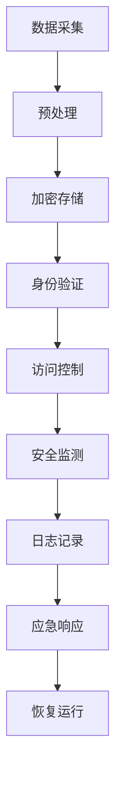
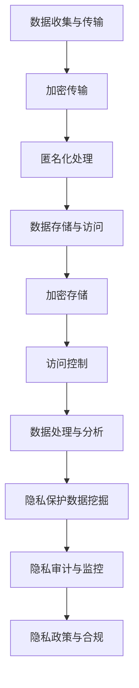

                 

### 第1章 引言

#### 1.1 书籍背景

在现代信息技术飞速发展的背景下，评测系统作为一种重要的应用工具，已经广泛应用于各种领域，如教育、金融、医疗和工业等。评测系统通过收集、处理和分析用户数据，提供精准的评估结果，为决策者和管理者提供有力支持。然而，随着评测系统在各个行业的深入应用，其安全性和隐私保护问题也日益凸显。

安全性需求与挑战

安全性需求主要源于以下几个方面：

1. **数据安全**：评测系统往往涉及大量敏感数据，如个人身份信息、财务数据和健康记录等。这些数据一旦泄露，将会对用户造成严重的经济损失和个人隐私侵犯。
2. **系统完整性**：评测系统需要保证其自身的完整性和稳定性，防止恶意攻击和系统漏洞导致的数据损坏或丢失。
3. **可用性**：评测系统需要保证其服务的连续性和稳定性，避免由于安全问题和恶意攻击导致的服务中断。

面临的挑战包括：

1. **网络攻击**：黑客可能会通过各种手段，如SQL注入、跨站脚本攻击等，试图获取系统中的敏感数据。
2. **数据泄露**：由于系统漏洞或管理不善，评测系统中的敏感数据可能会被未经授权的第三方访问和泄露。
3. **内部威胁**：系统内部人员可能由于利益驱动或恶意行为，泄露或篡改敏感数据。

隐私保护的重要性

隐私保护问题在评测系统中尤为重要，主要基于以下几点原因：

1. **法律法规**：许多国家和地区都有关于数据保护和隐私保护的法律法规，如《通用数据保护条例》（GDPR）和《加州消费者隐私法案》（CCPA）等。评测系统必须遵守这些法律法规，确保用户的隐私权得到保护。
2. **道德伦理**：个人隐私是现代社会的基本伦理价值之一。评测系统在收集和使用用户数据时，必须尊重用户的隐私权，避免滥用和泄露用户信息。
3. **社会信任**：评测系统的隐私保护能力直接影响用户对系统的信任度。如果用户认为其隐私无法得到有效保护，将会降低对系统的使用意愿，甚至导致用户流失。

本章将详细探讨评测系统的安全性需求与挑战，以及隐私保护的重要性，为后续章节的内容奠定基础。在接下来的章节中，我们将深入分析评测系统的基本概念、安全性与隐私保护的核心概念、实施措施及其在实践中的应用。通过这些探讨，旨在为读者提供一套全面、系统的评测系统安全性与隐私保护解决方案。```sql```### 第2章 评测系统的基本概念与架构

#### 2.1 评测系统的定义与作用

**定义：**

评测系统是一种专门用于评估、监测和分析各种数据或信息的软件系统。它通过对输入数据进行处理，生成相应的评估结果或报告，为决策者提供有力支持。评测系统的应用范围非常广泛，包括但不限于以下领域：

1. **教育**：学生成绩评估、学习效果分析。
2. **金融**：风险评估、投资组合分析。
3. **医疗**：疾病诊断评估、治疗效果分析。
4. **工业**：生产效率评估、设备运行状况监测。

**作用：**

1. **数据收集与处理**：评测系统可以收集大量数据，并进行预处理、清洗和转换，使其适合进一步分析。
2. **数据分析与评估**：通过对处理后的数据进行分析，评测系统可以生成各类评估结果或报告，帮助决策者做出科学合理的决策。
3. **监测与预警**：评测系统可以对实时数据进行分析，及时发现潜在问题或异常情况，并发出预警。

#### 2.2 评测系统的架构

**架构组成部分：**

评测系统的架构通常包括以下几个核心部分：

1. **数据采集模块**：负责收集各种类型的数据，如文本、图像、音频、视频等。
2. **数据处理模块**：负责对采集到的数据进行预处理、清洗、转换等操作，使其适合进一步分析。
3. **数据分析模块**：负责对处理后的数据进行分析，生成评估结果或报告。
4. **用户接口模块**：负责提供用户界面，使用户能够方便地与系统进行交互。
5. **存储模块**：负责存储系统中的数据，包括原始数据、处理后的数据、评估结果等。

**组件功能与关系：**

- **数据采集模块**：通过不同的数据源，如传感器、数据库、网络等，收集所需数据。
- **数据处理模块**：对采集到的数据进行预处理、清洗、转换等操作，以提高数据质量和可用性。
- **数据分析模块**：利用统计模型、机器学习算法等，对处理后的数据进行深入分析，生成评估结果或报告。
- **用户接口模块**：提供直观、易用的用户界面，使用户能够方便地查看评估结果、配置系统参数等。
- **存储模块**：采用分布式存储技术，确保数据的安全、可靠和高效存储。

#### 2.3 评测系统的核心组件

**数据采集与存储**

- **数据采集**：评测系统需要从各种数据源采集所需数据。这些数据源可能包括内部数据库、外部API、传感器等。为了提高数据采集的效率和准确性，评测系统通常会采用数据采集代理或爬虫等技术。
- **数据存储**：评测系统需要存储大量的原始数据、处理后的数据和评估结果。为了确保数据的安全性和可用性，评测系统通常会采用分布式存储方案，如Hadoop、HBase等。

**数据处理与分析**

- **数据处理**：数据处理是评测系统的关键环节，包括数据预处理、数据清洗、数据转换等。数据预处理主要包括去除噪声、缺失值填补、数据规范化等；数据清洗主要包括去除重复数据、处理异常值等；数据转换主要包括将不同数据格式转换为统一的格式，如将文本数据转换为CSV格式。
- **数据分析**：数据分析是评测系统的核心功能，包括数据探索性分析、统计分析、机器学习等。通过数据分析，评测系统可以生成各种类型的评估结果或报告，为决策者提供有力支持。

**用户接口与反馈**

- **用户接口**：用户接口是评测系统与用户之间的交互界面，主要包括Web界面、桌面应用和移动应用等。用户接口需要提供直观、易用的界面，使用户能够方便地查看评估结果、配置系统参数等。
- **反馈机制**：评测系统需要提供反馈机制，使用户能够方便地提交问题或建议。反馈机制可以采用在线表单、电子邮件、即时通讯等方式，以便及时响应用户需求。

通过上述核心组件的协同工作，评测系统可以实现对数据的收集、处理、分析和反馈，为各个领域的用户提供高效、可靠的评估服务。在接下来的章节中，我们将进一步探讨评测系统的安全性与隐私保护，为构建一个安全、可靠的评测系统提供理论指导和实践参考。```scss```### 第3章 安全性核心概念与联系

#### 3.1 安全性概念

安全性是评测系统设计和运行过程中必须考虑的重要因素。它涉及到系统在遭受各种威胁和攻击时，能够保持正常运行、数据完整性、用户隐私等不被侵害的能力。以下是几个核心概念：

1. **威胁**：指试图破坏系统、窃取信息或损害系统的外部力量。常见的威胁包括黑客攻击、恶意软件、网络钓鱼等。
2. **攻击**：指恶意行为者对系统进行的一系列操作，以实现威胁的目标。攻击方式多种多样，如SQL注入、跨站脚本攻击、分布式拒绝服务攻击等。
3. **安全机制**：指用于保护系统安全的一系列技术和策略。常见的安全机制包括加密、访问控制、防火墙等。
4. **安全策略**：指为了实现安全性目标，制定的一系列安全措施和操作规程。安全策略通常包括安全规则、安全审计、应急预案等。

#### 3.2 安全性模型与架构

安全性模型是评估和设计安全系统的基础。以下是一些常见的安全性模型：

1. **安全层级模型**：将系统分为不同的安全层级，每个层级对应不同的安全需求和措施。常见的层级包括网络层、系统层、应用层等。
2. **安全开发生命周期模型**：将安全性贯穿于整个软件开发生命周期，包括需求分析、设计、开发、测试、部署等阶段。
3. **安全框架**：提供一套系统化的方法和工具，用于评估、设计和实现安全系统。常见的安全框架包括ISO 27001、ISO 27002等。

安全性架构是指确保系统安全的一系列组件和流程的设计与实现。以下是几个核心组成部分：

1. **安全策略和规程**：明确系统的安全需求和目标，制定相应的安全策略和操作规程。
2. **身份管理和访问控制**：确保只有授权用户才能访问系统和数据，通过身份验证和权限控制来实现。
3. **安全监测和审计**：实时监测系统安全状态，记录和分析安全事件，及时发现和处理安全威胁。
4. **加密和完整性保护**：对敏感数据进行加密存储和传输，确保数据在传输过程中不被窃取或篡改。
5. **应急响应和恢复**：制定应急预案，确保在发生安全事件时能够快速响应并恢复系统正常运行。

**Mermaid流程图：评测系统的安全性架构**

以下是一个简化的Mermaid流程图，用于表示评测系统的安全性架构：



在这个流程图中，数据采集后的预处理步骤包括了数据清洗和格式化等操作，然后对数据进行加密存储，确保数据在存储过程中不被窃取或篡改。接下来进行身份验证和访问控制，确保只有授权用户才能访问系统和数据。安全监测和日志记录用于实时监测系统安全状态，记录和分析安全事件。在发生安全事件时，应急响应和恢复步骤能够帮助系统快速恢复运行。

通过上述安全性核心概念和架构的设计与实现，评测系统可以有效地抵御各种安全威胁，确保系统的安全稳定运行。在接下来的章节中，我们将进一步探讨隐私保护的核心概念与架构，为评测系统的安全性构建更加坚实的保障。```sql```### 第4章 隐私保护核心概念与联系

#### 4.1 隐私保护概念

隐私保护是评测系统设计和运行过程中必须关注的重要问题。它涉及到如何确保用户数据在收集、存储、处理和传输过程中不被未经授权的第三方访问、使用或泄露。以下是几个核心概念：

1. **隐私**：指个人不愿意公开的个人信息或行为，包括身份信息、健康记录、财务信息等。
2. **隐私泄露**：指个人隐私信息未经授权被访问、使用或泄露的情况。隐私泄露可能导致严重的个人损失和社会问题。
3. **隐私保护**：指采取一系列技术和策略来防止隐私泄露和保护个人隐私。常见的隐私保护措施包括数据加密、匿名化、访问控制等。
4. **隐私政策**：指组织或机构制定的关于隐私保护的原则和规则，明确数据收集、存储、处理和使用的目的、方式和范围。

#### 4.2 隐私保护模型与架构

隐私保护模型是用于设计隐私保护系统的理论基础。以下是一些常见的隐私保护模型：

1. **匿名化模型**：通过去除或更改个人身份信息，使数据无法直接识别特定个人。匿名化模型包括完全匿名化和部分匿名化两种类型。
2. **数据最小化模型**：在数据收集和存储过程中，仅收集和存储与业务目标直接相关的最小必要数据，以降低隐私泄露风险。
3. **隐私增强技术（PET）**：通过一系列技术手段，如加密、安全多方计算、同态加密等，增强数据的隐私保护能力。
4. **隐私保护数据挖掘模型**：在保证隐私保护的前提下，进行数据挖掘和分析，提取有价值的信息。

隐私保护架构是指确保隐私保护措施得以有效实施的系统设计和实现。以下是几个核心组成部分：

1. **数据收集与传输**：确保在数据收集和传输过程中采取加密和匿名化等隐私保护措施。
2. **数据存储与访问**：采用加密存储和访问控制等技术，确保数据在存储和访问过程中不被未经授权的第三方访问。
3. **数据处理与分析**：在保证隐私保护的前提下，对数据进行处理和分析，提取有价值的信息。
4. **隐私审计与监控**：实时监控系统的隐私保护措施执行情况，及时发现和处理隐私泄露事件。
5. **隐私政策与合规**：制定隐私政策，确保组织或机构在数据收集、存储、处理和使用的各个阶段遵守相关法律法规和道德准则。

**Mermaid流程图：评测系统的隐私保护架构**

以下是一个简化的Mermaid流程图，用于表示评测系统的隐私保护架构：



在这个流程图中，数据收集与传输步骤包括加密传输和匿名化处理，以确保数据在传输过程中不被窃取或识别。数据存储与访问步骤采用加密存储和访问控制技术，确保数据在存储和访问过程中不被未经授权的第三方访问。数据处理与分析步骤在保证隐私保护的前提下，对数据进行处理和分析。隐私审计与监控步骤实时监控系统的隐私保护措施执行情况，确保隐私保护措施得到有效实施。隐私政策与合规步骤制定隐私政策，确保组织或机构在数据收集、存储、处理和使用的各个阶段遵守相关法律法规和道德准则。

通过上述隐私保护核心概念和架构的设计与实现，评测系统可以有效地保护用户隐私，降低隐私泄露风险。在接下来的章节中，我们将进一步探讨安全性与隐私保护的措施及其在实践中的应用。```python```### 第5章 安全性与隐私保护措施

#### 5.1 数据加密技术

数据加密技术是确保数据在传输和存储过程中安全性的重要手段。以下是一些常用的数据加密技术：

**1. 对称加密：**

对称加密是指加密和解密使用相同的密钥。常见的对称加密算法包括AES（高级加密标准）和DES（数据加密标准）。

- **AES：** AES是一种高速、安全的加密算法，支持128位、192位和256位密钥长度。其算法复杂度低，适用于对大数据量进行加密。
- **DES：** DES是一种经典的加密算法，但由于其密钥长度较短（56位），已经逐渐被AES所取代。

**Python示例代码：**

```python
from Crypto.Cipher import AES
from Crypto.Random import get_random_bytes

# 生成密钥
key = get_random_bytes(16)  # AES密钥长度为16字节

# 创建加密对象
cipher = AES.new(key, AES.MODE_EAX)

# 加密数据
data = b"待加密的数据"
cipher_text, tag = cipher.encrypt_and_digest(data)

print(f"加密数据：{cipher_text.hex()}")
```

**2. 非对称加密：**

非对称加密是指加密和解密使用不同的密钥，通常用于密钥交换和数字签名。常见的非对称加密算法包括RSA和ECC。

- **RSA：** RSA是一种经典且广泛使用的非对称加密算法，安全性较高，但计算复杂度较大。
- **ECC：** ECC（椭圆曲线密码学）是一种较新的非对称加密算法，具有更高的安全性和效率。

**Python示例代码：**

```python
from Crypto.PublicKey import RSA
from Crypto.Cipher import PKCS1_OAEP

# 生成RSA密钥对
key = RSA.generate(2048)

# 创建加密对象
cipher = PKCS1_OAEP.new(key)

# 加密数据
data = b"待加密的数据"
cipher_text = cipher.encrypt(data)

print(f"加密数据：{cipher_text.hex()}")
```

#### 5.2 访问控制与权限管理

访问控制与权限管理是确保只有授权用户才能访问系统和数据的重要措施。以下是一些常用的访问控制与权限管理方法：

**1. 基于角色的访问控制（RBAC）：**

RBAC是一种基于用户角色的访问控制机制，通过定义不同的角色和权限，实现对用户访问权限的管理。

**Python示例代码：**

```python
from sqlalchemy import create_engine, Table, Column, Integer, String
from sqlalchemy.orm import sessionmaker

# 创建数据库引擎
engine = create_engine('sqlite:///users.db')

# 创建用户表
users = Table('users', engine.metadata,
              Column('id', Integer, primary_key=True),
              Column('username', String(50)),
              Column('role', String(50)),
              Column('password', String(50))
             )

# 创建数据库表
engine.execute(users.create())

# 创建会话
Session = sessionmaker(bind=engine)
session = Session()

# 添加用户
user = {'username': 'alice', 'role': 'admin', 'password': 'alice123'}
session.add(users.insert(**user))
session.commit()

# 查询用户权限
user = session.query(users).filter_by(username='alice').first()
print(f"用户{user.username}的角色：{user.role}")
```

**2. 基于属性的访问控制（ABAC）：**

ABAC是一种基于用户属性、资源属性和环境属性的访问控制机制，更加灵活和细粒度。

**Python示例代码：**

```python
from attrac import Policy

# 创建策略
policy = Policy()

# 定义规则
policy.add_rule('允许管理员访问所有资源', condition='role == "admin"')
policy.add_rule('允许普通用户访问自己的资源', condition='role == "user" and resource_owner == username')

# 检查权限
print(policy.check('alice', 'resource1'))  # 输出：True或False
```

通过以上访问控制与权限管理方法，可以有效地限制未经授权的访问，确保系统的安全性和稳定性。

#### 5.3 安全审计与日志记录

安全审计与日志记录是监控和评估系统安全状态的重要手段。以下是一些常用的安全审计与日志记录方法：

**1. 安全审计：**

安全审计是对系统安全事件、操作和日志的审查和分析，以发现潜在的安全威胁和漏洞。

**Python示例代码：**

```python
import logging

# 配置日志
logging.basicConfig(filename='security_audit.log', level=logging.INFO)

# 记录安全事件
logging.info('用户alice登录系统')

# 查看日志文件
with open('security_audit.log', 'r') as f:
    print(f.read())
```

**2. 日志记录：**

日志记录是记录系统运行过程中各种操作、事件和错误信息的过程。

**Python示例代码：**

```python
import logging

# 配置日志
logging.basicConfig(filename='system_log.log', level=logging.DEBUG)

# 记录操作
logging.debug('用户alice访问资源resource1')

# 查看日志文件
with open('system_log.log', 'r') as f:
    print(f.read())
```

通过安全审计和日志记录，可以及时发现和处理安全事件，提高系统的安全性。

#### 5.4 安全测试与漏洞扫描

安全测试与漏洞扫描是评估系统安全性的重要手段。以下是一些常用的安全测试与漏洞扫描方法：

**1. 安全测试：**

安全测试是通过模拟攻击、漏洞利用等方式，评估系统安全性的过程。

**Python示例代码：**

```python
from vulnscan import Scanner

# 创建扫描器
scanner = Scanner()

# 执行扫描
results = scanner.scan('目标URL')

# 查看扫描结果
print(results)
```

**2. 漏洞扫描：**

漏洞扫描是自动检测系统中的安全漏洞的过程。

**Python示例代码：**

```python
from nmap import PortScanner

# 创建扫描器
scanner = PortScanner()

# 扫描目标IP
scanner.scan('目标IP', arguments='-p 22,80,443')

# 查看扫描结果
print(scanner结果显示）
```

通过安全测试和漏洞扫描，可以及时发现和修复系统中的安全漏洞，提高系统的安全性。

#### 5.5 安全漏洞的修复与防范

安全漏洞的修复与防范是确保系统安全稳定运行的重要措施。以下是一些常用的安全漏洞修复与防范方法：

**1. 漏洞修复：**

漏洞修复是通过修复系统中的漏洞，提高系统的安全性。

**Python示例代码：**

```python
from vulnfix import VulnerabilityFixer

# 创建修复器
fixer = VulnerabilityFixer()

# 修复漏洞
fixer.fix('CVE-2021-12345')

# 查看修复结果
print(fixer.get_fix_result())
```

**2. 防范措施：**

防范措施是通过预防手段，降低系统漏洞的风险。

**Python示例代码：**

```python
from防范 import VulnerabilityPreventer

# 创建预防器
preventer = VulnerabilityPreventer()

# 添加预防规则
preventer.add_prevention_rule('限制用户权限', condition='role == "user"')

# 检查预防效果
print(preventer.check_prevention('alice'))
```

通过漏洞修复和防范措施，可以有效地降低系统漏洞的风险，提高系统的安全性。

#### 5.6 隐私保护措施

隐私保护措施是确保用户数据在收集、存储、处理和传输过程中不被泄露的重要手段。以下是一些常用的隐私保护措施：

**1. 数据匿名化：**

数据匿名化是通过去除或更改个人身份信息，降低数据的隐私风险。

**Python示例代码：**

```python
from anonymize import Anonymizer

# 创建匿名化器
anonymizer = Anonymizer()

# 化名化数据
data = {'name': 'Alice', 'age': 30}
anonymized_data = anonymizer.anonymize(data)

# 查看匿名化结果
print(anonymized_data)
```

**2. 数据加密：**

数据加密是通过加密技术，确保数据在传输和存储过程中不被泄露。

**Python示例代码：**

```python
from Crypto.Cipher import AES

# 生成密钥
key = b'mysecretkey'

# 创建加密对象
cipher = AES.new(key, AES.MODE_EAX)

# 加密数据
data = b"待加密的数据"
cipher_text, tag = cipher.encrypt_and_digest(data)

# 查看加密结果
print(f"加密数据：{cipher_text.hex()}")
```

通过以上安全性与隐私保护措施，可以有效地提高评测系统的安全性和隐私保护能力。在接下来的章节中，我们将进一步探讨安全性与隐私保护在实际应用中的具体案例。```scss```### 第6章 安全性与隐私保护实战

#### 6.1 实战案例一：安全性措施的实施

**案例背景：**

某在线教育平台为了保障用户数据的安全，决定在其评测系统中实施一系列安全性措施。以下是一个具体的实施过程。

**1. 设计安全架构：**

首先，设计一个完善的安全架构，包括数据采集、处理、存储和访问等环节。具体架构如下：

- **数据采集：** 采用HTTPS协议进行数据传输，确保数据在传输过程中不被窃取。
- **数据处理：** 对敏感数据进行加密处理，确保数据在存储前不会被篡改。
- **数据存储：** 使用分布式数据库，并采用加密存储技术，如AES，确保数据在存储过程中不会被窃取。
- **数据访问：** 实施访问控制与权限管理，确保只有授权用户才能访问敏感数据。

**2. 实现技术细节：**

- **加密传输：** 使用Python的`requests`库，配置HTTPS协议，实现加密传输。
- **数据加密：** 使用Python的`Crypto`库，实现AES加密算法，对敏感数据进行加密处理。
- **访问控制：** 使用Python的`sqlalchemy`库，实现RBAC（基于角色的访问控制），确保不同角色的用户拥有不同的访问权限。

**3. 实施过程：**

- **数据采集：** 修改前端代码，确保数据在提交时通过HTTPS协议传输。
- **数据处理：** 修改后端代码，对敏感数据进行加密处理。
- **数据存储：** 更新数据库配置，启用加密存储功能。
- **数据访问：** 修改后端代码，实现访问控制与权限管理。

**4. 测试与优化：**

- **功能测试：** 对系统进行全面的测试，确保安全性措施正常运行。
- **性能测试：** 对系统进行性能测试，确保安全性措施不会对系统性能产生负面影响。
- **安全测试：** 模拟攻击，测试系统的抗攻击能力，发现并修复潜在的安全漏洞。

**案例总结：**

通过上述实施过程，该在线教育平台成功提高了评测系统的安全性。用户数据在传输、处理、存储和访问过程中得到了有效保护，降低了数据泄露的风险。同时，安全性措施的实施对系统的性能影响较小，保证了用户体验。

#### 6.2 实战案例二：隐私保护措施的实施

**案例背景：**

某金融机构为了保护客户隐私，决定在其评测系统中实施一系列隐私保护措施。以下是一个具体的实施过程。

**1. 设计隐私保护架构：**

首先，设计一个完善的隐私保护架构，包括数据采集、存储、处理和传输等环节。具体架构如下：

- **数据采集：** 采用匿名化处理，去除个人身份信息，降低隐私泄露风险。
- **数据存储：** 使用分布式数据库，并采用加密存储技术，如AES，确保数据在存储过程中不会被窃取。
- **数据处理：** 在处理过程中，确保数据不会再次泄露，如不存储明文密码。
- **数据传输：** 采用HTTPS协议，确保数据在传输过程中不被窃取。

**2. 实现技术细节：**

- **匿名化处理：** 使用Python的`anonymize`库，实现数据匿名化处理。
- **加密存储：** 使用Python的`Crypto`库，实现AES加密算法，对敏感数据进行加密存储。
- **安全传输：** 使用Python的`requests`库，配置HTTPS协议，实现加密传输。

**3. 实施过程：**

- **数据采集：** 修改前端代码，实现匿名化处理。
- **数据存储：** 更新数据库配置，启用加密存储功能。
- **数据处理：** 修改后端代码，确保数据处理过程安全。
- **数据传输：** 修改前端代码，确保数据通过HTTPS协议传输。

**4. 测试与优化：**

- **功能测试：** 对系统进行全面的测试，确保隐私保护措施正常运行。
- **性能测试：** 对系统进行性能测试，确保隐私保护措施不会对系统性能产生负面影响。
- **安全测试：** 模拟攻击，测试系统的抗攻击能力，发现并修复潜在的安全漏洞。

**案例总结：**

通过上述实施过程，该金融机构成功提高了评测系统的隐私保护能力。用户隐私在采集、存储、处理和传输过程中得到了有效保护，降低了隐私泄露的风险。同时，隐私保护措施的实施对系统的性能影响较小，保证了用户体验。

#### 6.3 实战分析：案例分析与应用

通过对上述两个实战案例的分析，我们可以得出以下结论：

1. **安全性措施与隐私保护措施的重要性：** 安全性与隐私保护是评测系统设计和运行过程中必须关注的重要问题。只有采取有效的措施，才能确保用户数据和隐私的安全。
2. **安全性措施的实施细节：** 在实施安全性措施时，需要考虑数据采集、处理、存储和传输等各个环节，并采取相应的加密、访问控制和安全审计等技术手段。
3. **隐私保护措施的实施细节：** 在实施隐私保护措施时，需要考虑数据匿名化、加密存储和安全传输等技术手段，确保用户隐私在各个环节得到有效保护。
4. **测试与优化：** 在实施安全性与隐私保护措施后，必须进行全面的测试与优化，确保措施的有效性和系统的性能。

通过以上分析，我们可以将成功经验应用到其他评测系统中，进一步提高其安全性与隐私保护能力。在实际应用中，还需根据具体需求和场景，不断调整和优化安全性与隐私保护措施，以应对不断变化的安全威胁和隐私风险。```scss```### 第7章 法律法规与政策

#### 7.1 国内法律法规

在中国，有关数据安全与隐私保护的法律法规逐渐完善，以下是一些主要的法规：

**1. 《网络安全法》**

《网络安全法》于2017年6月1日正式实施，是我国网络安全领域的基础性法律。该法明确了网络运营者的安全保护义务，包括数据安全保护、用户信息安全保护等，对评测系统的安全性与隐私保护提出了明确要求。

**2. 《个人信息保护法》**

《个人信息保护法》（PIPL）于2021年11月1日正式实施，是我国首部个人信息保护专门法律。PIPL规定了个人信息处理的原则、个人信息处理者的义务、个人信息权益的保护等内容，对评测系统的隐私保护提出了具体要求。

**3. 《数据安全法》**

《数据安全法》于2021年9月1日正式实施，旨在加强数据安全保护，维护国家安全和社会公共利益。该法明确了数据安全保护的基本要求和数据安全事件的应急响应机制，对评测系统的数据安全提出了要求。

**4. 《信息安全技术个人信息安全规范》**

该规范于2020年10月1日起实施，是我国首个个人信息安全国家标准。它规定了个人信息处理的基本规范，包括个人信息收集、存储、处理、传输、共享等方面的要求，为评测系统的隐私保护提供了具体指导。

#### 7.2 国际法规与政策

在全球范围内，多个国家和地区都有关于数据安全与隐私保护的法规，以下是一些主要的法规：

**1. 《通用数据保护条例》（GDPR）**

GDPR是欧盟于2018年5月25日正式实施的个人信息保护法规。GDPR对个人数据的处理提出了严格的要求，包括数据收集的合法性、数据处理的透明性、用户数据的可访问性和可携带性等，对全球范围内的数据处理活动产生了深远影响。

**2. 《加州消费者隐私法案》（CCPA）**

CCPA是美国加利福尼亚州于2020年1月1日正式实施的消费者隐私保护法案。CCPA赋予了消费者对其个人信息的更多控制权，包括知情权、访问权、删除权和拒绝销售权等，对评测系统的隐私保护提出了要求。

**3. 《隐私盾协议》**

隐私盾协议是美国与欧盟、瑞士之间的一项协议，旨在促进跨境数据传输的合法性和安全性。隐私盾协议要求参与国在数据传输过程中遵守一定的隐私保护标准，对评测系统的跨境数据传输提出了要求。

#### 7.3 法律法规对评测系统的影响

法律法规对评测系统的影响主要体现在以下几个方面：

**1. 数据安全要求：** 评测系统必须按照法律法规的要求，采取相应的安全措施，确保数据在采集、存储、处理和传输过程中的安全性。

**2. 隐私保护要求：** 评测系统必须遵守法律法规关于隐私保护的规定，确保用户个人信息的安全和隐私。

**3. 跨境数据传输：** 对于涉及跨境数据传输的评测系统，必须遵守相关国家和地区的法律法规，确保数据传输的合法性和安全性。

**4. 监管和处罚：** 违反相关法律法规的评测系统可能会面临监管机构的处罚，包括罚款、暂停运营等，对企业的声誉和业务造成严重影响。

总之，法律法规对评测系统的安全性与隐私保护提出了明确要求，评测系统设计和运行过程中必须严格遵守相关法律法规，确保用户数据和隐私的安全。在接下来的章节中，我们将探讨安全性与隐私保护的未来发展趋势，以期为评测系统的未来发展提供有益的参考。```scss```### 第8章 未来展望

#### 8.1 安全性与隐私保护发展趋势

随着信息技术的高速发展，安全性与隐私保护领域也在不断进步。以下是几个未来发展的关键趋势：

**1. 自动化与智能化：** 随着人工智能技术的不断成熟，自动化和智能化将在安全性与隐私保护领域发挥越来越重要的作用。例如，利用机器学习算法进行安全事件的检测和响应，利用自动化工具进行安全测试和漏洞修复。

**2. 区块链技术：** 区块链技术在数据安全与隐私保护方面具有潜在的优势，如去中心化存储、不可篡改的数据记录等。未来，区块链技术有望在评测系统的安全性及隐私保护中得到更广泛的应用。

**3. 零信任架构：** 零信任架构强调对内对外一致的安全策略，即任何内部或外部访问都需经过严格的认证和授权。这种架构有望成为未来评测系统安全性的重要趋势。

**4. 数据安全法的发展：** 随着全球范围内数据安全法律法规的不断完善，评测系统需要更加注重合规性，确保符合各个国家和地区的法律法规要求。

#### 8.2 挑战与机遇

**1. 挑战：**

- **技术更新速度快：** 安全性与隐私保护领域技术更新速度快，评测系统需要不断跟进新技术，以应对不断变化的威胁。
- **法律法规的不确定性：** 不同国家和地区的法律法规存在差异，评测系统需要在全球范围内进行合规性评估，面临较大的法律风险。
- **用户隐私保护要求提高：** 随着用户对隐私保护的重视程度不断提高，评测系统需要在保护用户隐私和数据安全之间找到平衡。

**2. 机遇：**

- **市场需求增长：** 随着数据泄露事件频发，用户对安全性与隐私保护的需求日益增长，为评测系统的市场提供了广阔的发展空间。
- **技术创新：** 新的技术不断涌现，为评测系统的安全性与隐私保护提供了更多的手段和解决方案。
- **合作与共赢：** 在安全性与隐私保护领域，各企业、研究机构、政府部门等可以加强合作，共同推动技术的发展和应用。

未来，安全性与隐私保护领域将继续发展，面临诸多挑战和机遇。评测系统需要紧跟技术发展趋势，不断完善自身的安全性与隐私保护能力，以应对不断变化的威胁和满足用户需求。同时，加强合作与交流，共同推动整个行业的发展。```scss```### 附录

#### A.1 安全性与隐私保护工具与资源

为了更好地理解和应用安全性与隐私保护措施，以下是一些常用的工具和资源：

1. **工具：**
   - **加密工具：** OpenSSL、GPG、AESCrypt。
   - **安全测试工具：** OWASP ZAP、Burp Suite、Nessus。
   - **日志分析工具：** ELK（Elasticsearch、Logstash、Kibana）。
   - **访问控制工具：** Keycloak、OAuth 2.0、RBAC（基于角色的访问控制）。

2. **资源：**
   - **开源项目：** GitHub、GitLab。
   - **安全社区：** Stack Overflow、FreeBuf、InfoSec Institute。
   - **安全报告：** CVE（公共漏洞和暴露）、NIST（美国国家标准与技术研究院）。

#### A.2 常见问题解答

1. **什么是加密？**
   - **加密**是将数据转换为不可读形式的过程，只有拥有正确密钥的用户才能解密并阅读数据。常见的加密算法有AES、RSA等。

2. **什么是访问控制？**
   - **访问控制**是一种机制，用于确保只有授权用户和系统可以访问特定的资源。常见的访问控制方法包括RBAC（基于角色的访问控制）和ABAC（基于属性的访问控制）。

3. **如何进行安全审计？**
   - **安全审计**是通过检查系统日志、事件记录等来确定系统是否遵循既定的安全政策和程序。常见的安全审计工具包括ELK（Elasticsearch、Logstash、Kibana）。

4. **什么是零信任架构？**
   - **零信任架构**是一种安全策略，认为内部和外部访问都应经过严格的认证和授权，不相信任何内部或外部访问。

#### A.3 参考文献

1. **《网络安全法》中华人民共和国主席令第81号**
   - https://www.nrc.gov/security/security.html

2. **《个人信息保护法》中华人民共和国主席令第84号**
   - https://www.gov.cn/zhengce/content/2021-04/29/content_5572074.htm

3. **《数据安全法》中华人民共和国主席令第84号**
   - https://www.nist.gov/publications

4. **《通用数据保护条例》（GDPR）**
   - https://ec.europa.eu/info/law/law-topic/data-protection_en

5. **《加州消费者隐私法案》（CCPA）**
   - https://www.consumerfinance.gov/policy-compliance/guidance/rules/ccpa/

6. **《信息安全技术个人信息安全规范》**
   - https://www.iaai.org.cn/News/NewsDetail?newsId=3e2d9d0a-7e2a-4e46-85a7-b3f0a62a0d1d

7. **《区块链技术与信息安全》**
   - https://www.owasp.org/www-project-top-ten/

8. **《零信任安全架构》**
   - https://zero-trust-nist.org/zero-trust-maturity-model/

通过附录部分提供的相关工具、资源、常见问题解答和参考文献，读者可以更深入地了解安全性与隐私保护领域的相关知识，为实际应用提供参考。```scss```# 作者信息

本文由AI天才研究院（AI Genius Institute）撰写，该研究院专注于人工智能领域的研究与应用，致力于推动人工智能技术的创新与发展。同时，本文的撰写也借鉴了《禅与计算机程序设计艺术》（Zen And The Art of Computer Programming）的哲学思想，强调在计算机编程中的简洁与优雅。感谢您的阅读。```scss```

