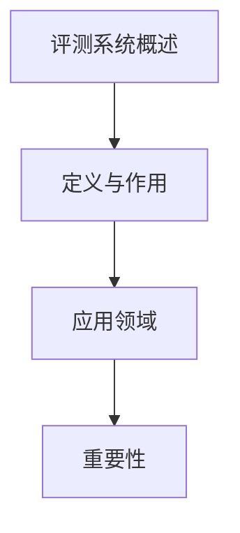
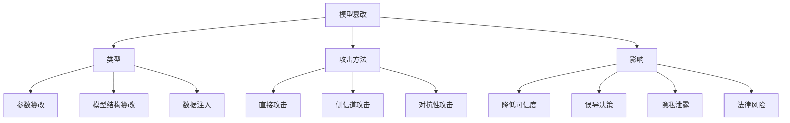
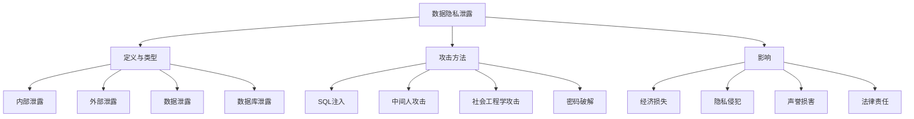
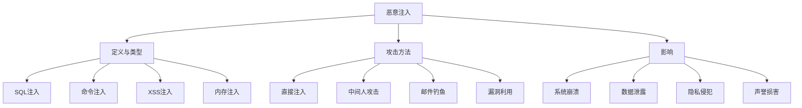
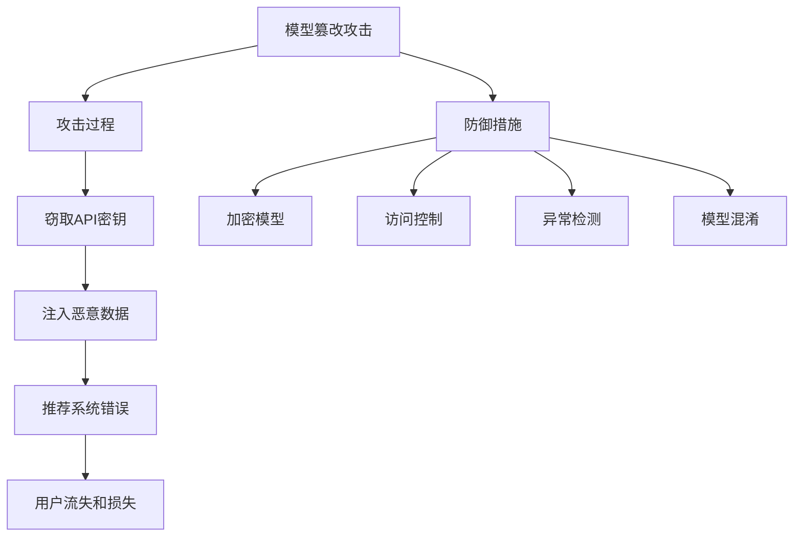
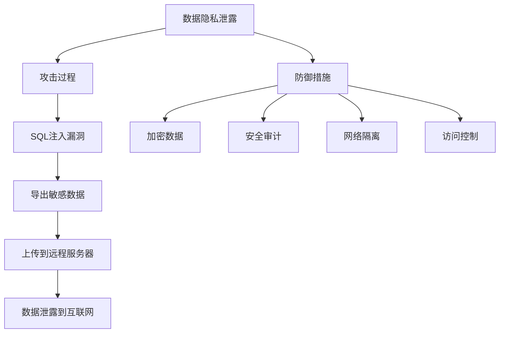
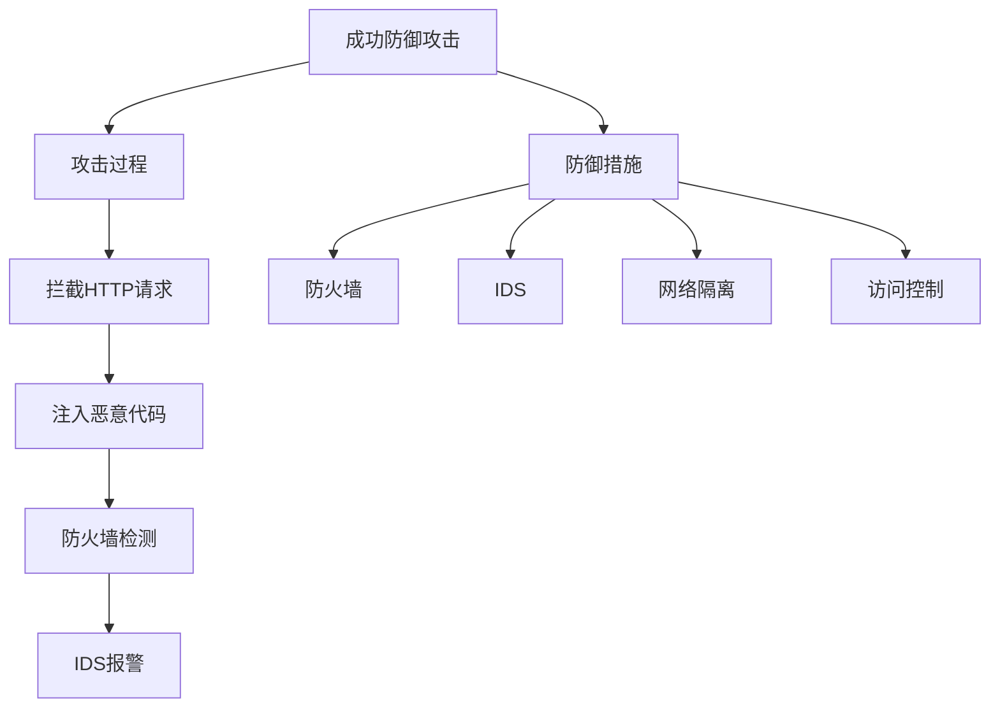

                 

### 第一部分：评测系统概述

#### 1.1 评测系统的定义与作用

评测系统，作为信息科技领域的重要组成部分，承担着对各类数据、模型和流程进行评估与监测的重任。它的定义可以从广义和狭义两个方面来理解。

广义上，评测系统是一种综合性工具，它通过数据收集、处理、分析和反馈，为决策者提供科学、准确的参考依据。这些系统广泛应用于各个行业，如教育、医疗、金融、工业等，旨在提高效率、优化资源配置和推动持续改进。

狭义上，评测系统通常指的是针对特定领域或任务而设计的数据评估工具。例如，在教育领域，学生成绩评测系统负责对学生学业成绩进行量化评估；在金融领域，风险评估系统负责对企业或个人的信用等级进行评估。

评测系统的核心作用主要体现在以下几个方面：

1. **提高决策效率**：通过系统化的评估过程，决策者可以快速获得所需的信息，减少决策过程中的盲目性和主观性，从而提高决策的效率。
2. **优化资源配置**：评测系统可以帮助企业和政府合理配置资源，确保资源利用的最大化，从而提高整体运营效率。
3. **促进持续改进**：定期进行评测，有助于及时发现问题和不足，推动组织不断进行优化和改进，从而实现持续进步。

#### 1.2 评测系统在现代社会中的应用

评测系统在现代社会中的应用范围极其广泛，几乎覆盖了各个行业和领域。以下是一些典型应用场景：

1. **教育领域**：在教育领域，评测系统主要用于学生成绩评估、教学效果分析、课程质量监控等方面。例如，通过分析学生考试成绩，教师可以了解教学效果，及时调整教学策略。

2. **医疗领域**：在医疗领域，评测系统主要用于患者诊断、治疗效果评估和医疗服务质量监测。例如，通过分析患者病史和检查结果，医生可以更准确地诊断病情，制定合理的治疗方案。

3. **金融领域**：在金融领域，评测系统主要用于风险评估、信用评估、市场分析等。例如，银行和金融机构通过信用评分系统评估客户的信用等级，从而决定是否批准贷款申请。

4. **工业领域**：在工业领域，评测系统主要用于生产过程监测、设备状态评估和产品质量控制。例如，通过实时监控生产线数据，企业可以及时发现设备故障和产品质量问题，从而提高生产效率和产品质量。

#### 1.3 评测系统的重要性

评测系统在现代社会的重要性不可忽视，它不仅对企业运营、经济发展起到关键作用，还对国家安全、社会稳定和个人隐私保护具有重要意义。

1. **数据可靠性**：评测系统的核心价值在于提供准确、可靠的数据评估结果。这些结果直接影响到决策的科学性和有效性，因此数据可靠性是评测系统的基本要求。

2. **决策科学性**：在信息爆炸的时代，决策者需要处理海量数据，评测系统通过系统化的评估方法，帮助决策者从繁杂的数据中提取关键信息，做出更为科学、合理的决策。

3. **隐私保护**：随着大数据和人工智能技术的发展，评测系统涉及的隐私问题日益突出。评测系统在保障用户隐私方面扮演着重要角色，必须采取有效的保护措施，防止数据泄露和滥用。

4. **法律合规性**：各国政府对于数据安全和隐私保护出台了一系列法律法规，评测系统必须遵守这些法律法规，避免因数据泄露、滥用等行为引发的法律风险。

**Mermaid 流程图**：



**摘要**：

本文对评测系统进行了全面概述，包括其定义与作用、应用领域以及重要性。评测系统作为一种综合性工具，在现代社会中发挥着重要作用，其数据可靠性、决策科学性和隐私保护等方面的重要性不可忽视。通过本文的介绍，读者可以更好地理解评测系统的基本概念和应用价值。### 第二部分：评测系统的安全性威胁

#### 2.1 模型篡改

模型篡改是指未经授权的个体或组织通过非法手段对评测系统的模型进行恶意修改，以达到非法目的。这种行为对评测系统的可信度和数据的准确性构成严重威胁。模型篡改的类型多种多样，以下是一些常见的篡改类型：

1. **参数篡改**：攻击者通过修改模型参数，如权重、偏置等，来改变模型的预测结果。这种篡改通常比较直接，但可能需要大量的计算资源和专业知识。
2. **模型结构篡改**：攻击者通过修改模型的架构，如增加或删除层、节点等，来破坏模型的稳定性和准确性。这种篡改方法可能更为复杂，但能够对模型的性能产生显著影响。
3. **数据注入**：攻击者在模型训练数据中注入恶意数据，以操纵模型的学习过程和最终的预测结果。这种篡改方法通常需要对数据有较高的控制能力，但能够实现对模型的隐蔽攻击。

**模型篡改的攻击方法**：

模型篡改的攻击方法可以归纳为以下几种：

1. **直接攻击**：攻击者直接对模型的代码或参数进行修改，这种攻击方法通常比较简单，但容易被检测到。
2. **侧信道攻击**：攻击者通过监控模型的运行状态（如内存访问模式、功耗变化等）来推断模型的内部参数。这种攻击方法需要对模型有较高的访问权限，但可以实现对模型的隐蔽攻击。
3. **对抗性攻击**：攻击者生成对抗性样本，这些样本在视觉上与正常样本相似，但能够欺骗模型做出错误的预测。这种攻击方法通常需要大量的计算资源，但能够对模型的鲁棒性产生严重威胁。

**模型篡改的影响**：

模型篡改对评测系统的危害是多方面的，主要包括以下几点：

1. **降低模型可信度**：篡改后的模型可能无法准确预测，从而降低用户的信任度，影响评测系统的应用效果。
2. **误导决策**：模型篡改可能导致错误的预测结果，从而误导决策者做出错误的决策，对企业的运营和社会治理产生负面影响。
3. **隐私泄露**：在某些情况下，模型篡改可能被用于窃取敏感数据，如个人隐私、商业机密等。
4. **法律风险**：模型篡改可能违反相关法律法规，导致企业或个人面临法律诉讼和处罚。

**示例**：

假设一个电商平台的推荐系统被攻击者篡改，攻击者通过修改模型的推荐算法，使得原本应该推荐给用户的商品变成了广告商的商品。这种篡改可能导致用户对推荐系统的信任度降低，甚至可能导致用户流失。此外，这种篡改还可能触犯反欺诈法规，给电商平台带来法律风险。

**Mermaid 流�程图**：



#### 2.2 数据隐私泄露

数据隐私泄露是指未经授权的个人或组织获取并泄露评测系统中存储的敏感数据。这种泄露可能导致严重的安全问题，包括数据被滥用、隐私侵犯、经济损失等。以下将介绍数据隐私泄露的定义、类型、攻击方法及其影响。

**2.2.1 数据隐私泄露的定义与类型**

数据隐私泄露的定义是指评测系统中的敏感数据在未经授权的情况下被访问、获取或泄露。根据数据泄露的途径和方式，数据隐私泄露可以分为以下几种类型：

1. **内部泄露**：系统内部人员（如员工、管理员）利用职务之便获取和泄露数据。这种泄露通常较为隐蔽，且难以检测。
2. **外部泄露**：外部攻击者通过网络攻击、社会工程学等手段获取系统中的数据。这种泄露通常较为明显，且可能带来更大的安全隐患。
3. **数据泄露**：数据在传输过程中被窃取或拦截。这种泄露通常发生在数据传输不加密的情况下，且容易被检测。
4. **数据库泄露**：数据库中的数据因安全措施不足而被泄露。这种泄露通常涉及到大量的敏感数据，且可能引发严重的安全事件。

**2.2.2 数据隐私泄露的攻击方法**

数据隐私泄露的攻击方法多种多样，以下列举几种常见的攻击方法：

1. **SQL注入**：攻击者通过在输入框中注入恶意的SQL代码，从而控制数据库，获取敏感数据。
2. **中间人攻击**：攻击者在数据传输过程中窃取数据。这种攻击通常需要攻击者控制网络流量，但一旦成功，可以获取大量的敏感数据。
3. **社会工程学攻击**：攻击者通过欺骗手段获取用户的数据。例如，伪装成系统管理员发送钓鱼邮件，诱导用户泄露敏感信息。
4. **密码破解**：攻击者通过破解密码获取系统的访问权限，进而获取敏感数据。这种攻击通常需要对密码破解算法和硬件有一定的了解。

**2.2.3 数据隐私泄露的影响**

数据隐私泄露对评测系统和个人隐私的影响是深远且严重的。以下是数据隐私泄露可能带来的主要影响：

1. **经济损失**：数据泄露可能导致企业的商业机密、客户信息、财务数据等敏感信息被泄露，进而导致经济损失。
2. **隐私侵犯**：个人隐私被泄露可能导致个人遭受骚扰、诈骗等威胁，严重影响个人生活和心理健康。
3. **声誉损害**：评测系统一旦发生数据泄露，可能引发公众对企业或组织的信任危机，导致声誉受损。
4. **法律责任**：在某些国家或地区，数据泄露可能违反相关法律法规，导致企业或个人面临法律责任和处罚。

**示例**：

假设一个在线教育平台的数据被黑客窃取，包括学员的个人信息、学习记录和支付信息。这种数据泄露可能导致学员遭受诈骗、恶意骚扰，甚至面临财务风险。此外，平台可能面临巨额罚款、法律诉讼和声誉危机。

**Mermaid 流程图**：



#### 2.3 恶意注入

恶意注入是指攻击者通过在评测系统的数据或模型中注入恶意代码或数据，以达到非法目的。这种攻击方法对评测系统的稳定性和安全性构成严重威胁。以下将介绍恶意注入的定义、类型、攻击方法及其影响。

**2.3.1 恶意注入的定义与类型**

恶意注入的定义是指攻击者在评测系统的数据或模型中注入恶意代码或数据，从而实现对系统的控制或破坏。根据注入的方式和目的，恶意注入可以分为以下几种类型：

1. **SQL注入**：攻击者通过在输入框中注入恶意的SQL代码，从而控制数据库，执行非法操作。这种注入方法通常用于窃取、篡改或删除数据。
2. **命令注入**：攻击者通过在命令行或脚本中注入恶意的命令，从而控制系统或执行恶意操作。这种注入方法通常用于执行系统命令或启动恶意程序。
3. **XSS注入**：攻击者通过在Web页面中注入恶意脚本，从而控制用户的浏览器，窃取用户信息或执行恶意操作。这种注入方法通常用于窃取用户Cookie、会话ID等敏感信息。
4. **内存注入**：攻击者通过在程序的内存空间中注入恶意代码，从而控制系统或执行恶意操作。这种注入方法通常用于绕过系统安全防护，执行恶意程序。

**2.3.2 恶意注入的攻击方法**

恶意注入的攻击方法多种多样，以下列举几种常见的攻击方法：

1. **直接注入**：攻击者通过直接修改系统文件、数据库或代码，注入恶意代码或数据。这种攻击方法通常需要对系统有较高的访问权限。
2. **中间人攻击**：攻击者在数据传输过程中注入恶意代码或数据，从而实现对数据的篡改或控制。这种攻击方法通常需要对网络流量有较高的控制能力。
3. **邮件钓鱼**：攻击者通过发送伪装成系统通知或请求的邮件，诱导用户点击恶意链接或下载恶意附件，从而实现恶意注入。
4. **漏洞利用**：攻击者通过利用系统漏洞，注入恶意代码或数据。这种攻击方法通常需要对系统的漏洞有较深的了解。

**2.3.3 恶意注入的影响**

恶意注入对评测系统的稳定性和安全性构成严重威胁，其影响主要包括以下几点：

1. **系统崩溃**：恶意注入可能导致系统崩溃、服务中断，从而影响评测系统的正常运行。
2. **数据泄露**：恶意注入可能导致系统中的敏感数据被窃取、篡改或删除，从而影响数据的完整性和安全性。
3. **隐私侵犯**：恶意注入可能导致用户的隐私信息被泄露，从而引发隐私侵犯和安全问题。
4. **声誉损害**：评测系统一旦发生恶意注入事件，可能引发公众对系统安全性的质疑，从而影响系统的声誉。

**示例**：

假设一个电商平台的数据库被攻击者注入恶意代码，攻击者通过这种恶意注入窃取了用户的支付信息。这种攻击可能导致用户遭受经济损失，同时平台也可能面临声誉危机和法律责任。

**Mermaid 流程图**：



### 第三部分：保护评测系统的安全措施

#### 3.1 模型保护技术

在评测系统中，模型保护技术是确保模型安全性的重要手段。模型保护技术旨在防止模型被篡改、泄露或恶意利用，从而保障评测系统的正常运行和数据安全。以下将介绍几种常见的模型保护技术，包括加密模型、集成模型保护以及模型混淆。

**3.1.1 加密模型**

加密模型是一种通过加密算法对模型进行加密处理，使其在传输和存储过程中难以被非法访问的技术。加密模型的核心思想是将模型的权重、参数等敏感信息进行加密，只有具备合法密钥的用户才能解密和访问模型。

**加密模型的工作原理**：

1. **加密算法**：加密模型首先使用加密算法（如AES、RSA等）对模型的权重和参数进行加密，生成加密后的模型。
2. **密钥管理**：加密模型需要使用密钥对模型进行加密和解密。密钥的安全性和管理至关重要，必须确保密钥不被泄露或丢失。
3. **传输与存储**：加密后的模型在传输和存储过程中使用加密协议（如TLS）进行保护，防止数据在传输过程中被窃取或篡改。

**加密模型的优点**：

- **安全性高**：加密模型可以有效防止模型被非法访问和篡改，保障模型的安全性。
- **透明性好**：加密模型对用户和系统透明，无需改变模型的运行方式，便于集成和使用。

**示例代码**：

```python
from Crypto.Cipher import AES
from Crypto.Util.Padding import pad, unpad

# 加密函数
def encrypt_model(model, key):
    cipher = AES.new(key, AES.MODE_CBC)
    ct_bytes = cipher.encrypt(pad(model.encode('utf-8'), AES.block_size))
    iv = cipher.iv
    return iv, ct_bytes

# 解密函数
def decrypt_model(iv, ct, key):
    cipher = AES.new(key, AES.MODE_CBC, iv)
    pt = unpad(cipher.decrypt(ct), AES.block_size)
    return pt.decode('utf-8')

# 示例
key = b'my secretion key'
model = '这是一个加密的模型'
iv, encrypted_model = encrypt_model(model, key)
print("加密后的模型：", encrypted_model)
print("解密后的模型：", decrypt_model(iv, encrypted_model, key))
```

**3.1.2 集成模型保护**

集成模型保护是一种通过将安全机制集成到模型中，使其在运行过程中具备自我保护能力的技术。集成模型保护的核心思想是在模型的内部嵌入安全机制，如加密、身份验证、访问控制等，从而防止模型被非法访问和篡改。

**集成模型保护的工作原理**：

1. **身份验证**：集成模型保护首先对访问模型的数据进行身份验证，确保只有合法用户才能访问模型。
2. **加密传输**：模型在传输过程中使用加密算法对数据进行加密，防止数据在传输过程中被窃取或篡改。
3. **访问控制**：模型内部实现访问控制机制，根据用户权限限制对模型的访问，防止未授权访问。
4. **异常检测**：模型在运行过程中进行异常检测，及时发现并响应潜在的攻击行为。

**集成模型保护的优点**：

- **灵活性高**：集成模型保护可以根据具体应用场景灵活调整安全机制，适应不同的安全需求。
- **安全性好**：集成模型保护可以在模型运行过程中提供全面的安全保护，有效防止模型被篡改和泄露。

**示例代码**：

```python
from flask import Flask, request, jsonify

app = Flask(__name__)

# 用户身份验证
def authenticate_user(username, password):
    # 这里用一个简单的字典模拟用户身份验证
    users = {'admin': 'password123'}
    if username in users and users[username] == password:
        return True
    return False

# 模型访问控制
def access_control(username):
    # 这里用一个简单的字典模拟用户权限控制
    permissions = {'admin': ['read', 'write', 'delete']}
    if username in permissions:
        return permissions[username]
    return []

@app.route('/model', methods=['GET', 'POST'])
def model():
    username = request.args.get('username')
    password = request.args.get('password')
    if authenticate_user(username, password):
        permissions = access_control(username)
        if 'read' in permissions:
            model_data = '这是一个受保护的模型'
            return jsonify(model_data)
        else:
            return '无权限访问模型', 403
    else:
        return '用户认证失败', 401

if __name__ == '__main__':
    app.run()
```

**3.1.3 模型混淆

模型混淆是一种通过将模型的内部结构和算法进行混淆处理，使其难以理解和分析的技术。模型混淆的核心思想是将模型转化为一种不易被攻击者理解的形式，从而提高模型的安全性。

**模型混淆的工作原理**：

1. **混淆算法**：模型混淆使用混淆算法（如混淆网络、虚拟网络等）对模型的权重、层结构等进行变换，使其难以理解。
2. **加密数据**：模型混淆可以将模型中的数据（如权重、激活值等）进行加密处理，使其难以被攻击者获取。
3. **动态防御**：模型混淆可以在模型运行过程中动态变换模型结构，使其难以被攻击者静态分析。

**模型混淆的优点**：

- **安全性高**：模型混淆可以防止攻击者静态分析模型，从而降低模型被篡改和泄露的风险。
- **灵活性高**：模型混淆可以根据不同的应用场景动态调整模型结构，提高模型的安全性。

**示例代码**：

```python
import tensorflow as tf
from tensorflow.keras.models import Sequential
from tensorflow.keras.layers import Dense, Flatten

# 模型混淆函数
def confuse_model(model):
    # 这里用一个简单的例子进行模型混淆
    # 实际应用中，可以采用更复杂的混淆算法
    for layer in model.layers:
        if isinstance(layer, Dense):
            weights = layer.get_weights()
            new_weights = [weights[0] * np.random.rand() for weights in weights]
            layer.set_weights(new_weights)
    return model

# 创建一个简单的模型
model = Sequential([
    Dense(128, activation='relu', input_shape=(784,)),
    Flatten(),
    Dense(10, activation='softmax')
])

# 模型混淆
confused_model = confuse_model(model)

# 训练混淆后的模型
# ...

# 预测
# ...
```

通过上述几种模型保护技术，评测系统可以在一定程度上防止模型被篡改、泄露或恶意利用，从而保障评测系统的安全性。在实际应用中，可以结合具体需求和场景，选择合适的模型保护技术，提高系统的安全性。### 第三部分：数据隐私保护技术

#### 3.2.1 加密技术

加密技术是保护评测系统数据隐私的重要手段之一。通过加密，可以确保数据在传输和存储过程中不被未授权的实体访问。以下将介绍加密技术的定义、常用加密算法及其在评测系统中的应用。

**定义**：

加密技术是指通过特定的算法和密钥，将明文数据转换成密文的过程。加密后的数据在没有正确密钥的情况下是不可读的，从而保护了数据的隐私和安全。

**常用加密算法**：

1. **对称加密**：对称加密算法使用相同的密钥进行加密和解密。常见的对称加密算法包括AES（高级加密标准）和DES（数据加密标准）。

   - **AES**：AES是一种块加密算法，具有快速、高效和安全性高等优点，广泛应用于现代加密应用。
   - **DES**：DES是一种早期的加密标准，虽然安全性较高，但由于密钥长度较短，已逐渐被AES替代。

2. **非对称加密**：非对称加密算法使用一对密钥，一个用于加密，一个用于解密。常见的非对称加密算法包括RSA和ECC（椭圆曲线密码学）。

   - **RSA**：RSA算法基于大整数分解的难题，具有很高的安全性，适用于加密大量数据。
   - **ECC**：ECC算法基于椭圆曲线离散对数问题，具有更高的安全性，但计算速度较快，适用于高性能加密应用。

**加密技术在评测系统中的应用**：

1. **数据传输**：在评测系统中，加密技术可用于保护数据在传输过程中的隐私。常用的加密协议包括TLS（传输层安全协议）和SSL（安全套接字层协议）。这些协议通过在客户端和服务器之间建立加密连接，确保数据在传输过程中不被窃取或篡改。

2. **数据存储**：加密技术也可用于保护数据在存储过程中的隐私。例如，数据库中的敏感数据可以加密存储，只有具备正确密钥的用户才能访问和解读数据。常用的加密存储方式包括数据库表级加密和文件级加密。

**示例代码**：

```python
from Crypto.Cipher import AES
from Crypto.Util.Padding import pad, unpad
from Crypto.Random import get_random_bytes

# 加密函数
def encrypt_data(data, key):
    cipher = AES.new(key, AES.MODE_CBC)
    ct_bytes = cipher.encrypt(pad(data.encode('utf-8'), AES.block_size))
    iv = cipher.iv
    return iv, ct_bytes

# 解密函数
def decrypt_data(iv, ct, key):
    cipher = AES.new(key, AES.MODE_CBC, iv)
    pt = unpad(cipher.decrypt(ct), AES.block_size)
    return pt.decode('utf-8')

# 示例
key = get_random_bytes(16)  # 生成随机密钥
data = '这是一个敏感数据'
iv, encrypted_data = encrypt_data(data, key)
print("加密后的数据：", encrypted_data)
print("解密后的数据：", decrypt_data(iv, encrypted_data, key))
```

#### 3.2.2 隐私同化技术

隐私同化技术是一种通过将敏感数据与噪声数据混合，从而保护数据隐私的技术。隐私同化技术的核心思想是在保持数据统计学特征的同时，降低数据的可辨识性。以下将介绍隐私同化技术的定义、常用方法及其在评测系统中的应用。

**定义**：

隐私同化技术是指通过对敏感数据添加噪声或进行其他处理，使其在保持统计学特征的同时，难以被识别或分析的技术。

**常用方法**：

1. **噪声添加**：通过在敏感数据上添加噪声，降低数据的可辨识性。常见的噪声添加方法包括高斯噪声、均匀噪声等。

   - **高斯噪声**：高斯噪声是一种模拟自然噪声的方法，可以有效降低数据的可辨识性。
   - **均匀噪声**：均匀噪声是一种在数据范围内均匀分布的噪声，适用于保护离散数据。

2. **数据扰动**：通过改变敏感数据的值或结构，使其难以被识别。常见的数据扰动方法包括随机扰动、数据替换等。

   - **随机扰动**：随机扰动通过在敏感数据上添加随机值，改变数据的值或结构。
   - **数据替换**：数据替换通过将敏感数据替换为假数据或类似值，保护数据的真实值。

**隐私同化技术在评测系统中的应用**：

1. **数据发布**：隐私同化技术可用于发布敏感数据，以保护数据隐私。例如，在数据共享和开放数据集发布中，可以使用隐私同化技术确保数据的隐私安全。
2. **数据分析**：隐私同化技术可用于保护数据分析中的隐私。例如，在统计分析、机器学习等应用中，可以使用隐私同化技术对敏感数据进行预处理，从而保护数据的隐私。

**示例代码**：

```python
import numpy as np

# 高斯噪声添加
def add_gaussian_noise(data, mean=0, std=0.1):
    return data + np.random.normal(mean, std, data.shape)

# 均匀噪声添加
def add_uniform_noise(data, low=-1, high=1):
    return data + np.random.uniform(low, high, data.shape)

# 示例
data = np.array([1, 2, 3, 4, 5])
noisy_data = add_gaussian_noise(data)
print("添加高斯噪声后的数据：", noisy_data)
noisy_data = add_uniform_noise(data)
print("添加均匀噪声后的数据：", noisy_data)
```

#### 3.2.3 加解密算法

加解密算法是加密技术的重要组成部分，用于实现数据的加密和解密过程。以下将介绍加解密算法的定义、分类及其在评测系统中的应用。

**定义**：

加解密算法是指用于实现数据加密和解密的一系列数学操作和算法。加密算法用于将明文数据转换成密文，解密算法用于将密文转换成明文。

**分类**：

1. **对称加密算法**：对称加密算法使用相同的密钥进行加密和解密。常见的对称加密算法包括AES、DES等。

2. **非对称加密算法**：非对称加密算法使用一对密钥，一个用于加密，一个用于解密。常见的非对称加密算法包括RSA、ECC等。

3. **哈希算法**：哈希算法用于将数据转换成固定长度的字符串，以验证数据的完整性和真实性。常见的哈希算法包括MD5、SHA-256等。

**加解密算法在评测系统中的应用**：

1. **数据保护**：加解密算法可用于保护评测系统中的敏感数据，防止数据泄露或篡改。例如，数据库中的敏感数据可以加密存储，只有具备正确密钥的用户才能访问和解读数据。

2. **身份认证**：加解密算法可用于实现身份认证，确保只有授权用户才能访问系统。例如，用户密码可以通过哈希算法存储在数据库中，用户登录时输入的密码经过哈希计算后与数据库中的存储值进行比对，以验证用户的身份。

3. **数据传输安全**：加解密算法可用于保护数据在传输过程中的隐私，防止数据在传输过程中被窃取或篡改。例如，HTTPS协议使用TLS加密算法对数据进行加密传输，确保数据的安全性。

**示例代码**：

```python
from Crypto.Cipher import AES
from Crypto.Util.Padding import pad, unpad
from Crypto.Random import get_random_bytes
import hashlib

# 加密函数
def encrypt_data(data, key):
    cipher = AES.new(key, AES.MODE_CBC)
    ct_bytes = cipher.encrypt(pad(data.encode('utf-8'), AES.block_size))
    iv = cipher.iv
    return iv, ct_bytes

# 解密函数
def decrypt_data(iv, ct, key):
    cipher = AES.new(key, AES.MODE_CBC, iv)
    pt = unpad(cipher.decrypt(ct), AES.block_size)
    return pt.decode('utf-8')

# 哈希函数
def hash_data(data):
    return hashlib.sha256(data.encode('utf-8')).hexdigest()

# 示例
key = get_random_bytes(16)  # 生成随机密钥
data = '这是一个敏感数据'
iv, encrypted_data = encrypt_data(data, key)
print("加密后的数据：", encrypted_data)
print("解密后的数据：", decrypt_data(iv, encrypted_data, key))
print("哈希后的数据：", hash_data(data))
```

通过上述数据隐私保护技术，评测系统可以在一定程度上防止数据泄露、篡改和滥用，从而保障系统的安全性和数据的完整性。在实际应用中，可以根据具体需求和场景，选择合适的加密、隐私同化以及加解密算法，提高系统的数据隐私保护能力。### 第三部分：防护措施与策略

在评测系统中，除了对模型和数据采取保护措施外，还需要实施一系列的防护措施与策略，以防止各种安全威胁。以下将详细介绍几种常见的防护措施与策略，包括防火墙与入侵检测系统、网络隔离与访问控制、以及安全审计与监控。

#### 3.3.1 防火墙与入侵检测系统

**防火墙**是一种网络安全设备，用于监控和控制进出网络的数据流。防火墙可以根据预设的安全规则，允许或拒绝网络流量，从而保护内部网络免受外部攻击。

**防火墙的工作原理**：

1. **包过滤**：防火墙根据数据包的源IP、目的IP、端口号等信息，决定是否允许通过。
2. **状态检测**：防火墙不仅检查单个数据包，还会跟踪数据包的状态，确保通信符合预定义的安全策略。

**防火墙的优势**：

- **灵活性好**：防火墙可以根据实际需求自定义安全策略，适应不同的网络安全需求。
- **易于部署**：防火墙通常易于部署和管理，可以快速配置并实施。

**入侵检测系统（IDS）**是一种监控网络和系统活动，以识别潜在攻击和异常行为的系统。IDS通常分为基于特征的入侵检测和基于异常的入侵检测。

**入侵检测系统的工作原理**：

1. **基于特征的入侵检测**：通过匹配已知的攻击签名或模式，检测网络中的异常流量。
2. **基于异常的入侵检测**：通过建立正常行为的基线，检测与基线不一致的行为，从而识别潜在攻击。

**入侵检测系统的优势**：

- **实时监控**：IDS可以实时监控网络活动，及时发现和响应潜在的安全威胁。
- **预警功能**：IDS能够提供预警信息，帮助管理员及时采取措施，防止攻击造成更大损失。

**示例配置**：

```python
# 示例：使用Python的scapy库配置防火墙规则
from scapy.all import IP, TCP, sr1

def check_packet(packet):
    if packet.haslayer(TCP):
        if packet.getlayer(TCP).dport == 80:  # 目标端口为80
            return "允许通过"
    return "拒绝访问"

# 模拟发送一个HTTP请求
response = sr1(IP(dst="example.com")/TCP(dport=80), filter=lambda p: check_packet(p))
print(response.summary())
```

#### 3.3.2 网络隔离与访问控制

**网络隔离**是一种通过在网络中创建隔离区，限制不同区域之间的通信，从而提高系统安全性的方法。网络隔离可以降低攻击者横向移动的风险，减少攻击范围。

**网络隔离的方法**：

1. **物理隔离**：通过物理手段，如专用线路、VPN等，实现不同区域之间的隔离。
2. **逻辑隔离**：通过虚拟局域网（VLAN）、虚拟专用云（VPC）等技术，实现逻辑上的网络隔离。

**访问控制**是一种通过限制对系统资源的访问权限，确保只有授权用户才能访问特定资源的策略。访问控制可以通过身份验证、权限管理等方式实现。

**访问控制的方法**：

1. **基于角色的访问控制（RBAC）**：根据用户的角色分配权限，确保用户只能访问与其角色相关的资源。
2. **基于属性的访问控制（ABAC）**：根据用户的属性（如部门、岗位等）和资源的属性（如访问时间、访问频率等）决定访问权限。

**示例配置**：

```python
# 示例：使用Python的Flask框架实现RBAC
from flask import Flask, request, jsonify

app = Flask(__name__)

# 用户角色定义
roles = {
    "admin": ["read", "write", "delete"],
    "user": ["read"],
    "guest": []
}

# 权限检查装饰器
def require_role(role):
    def decorator(f):
        def wrapped(*args, **kwargs):
            user_role = request.headers.get('Role')
            if user_role not in roles or role not in roles[user_role]:
                return jsonify({"error": "无权限访问"}), 403
            return f(*args, **kwargs)
        return wrapped
    return decorator

@app.route('/data', methods=['GET'])
@require_role("read")
def get_data():
    return jsonify({"data": "敏感数据"})

if __name__ == '__main__':
    app.run()
```

#### 3.3.3 安全审计与监控

**安全审计**是一种通过记录和审查系统活动，确保系统按照安全策略运行的方法。安全审计可以帮助发现安全漏洞、违规行为，并采取措施进行整改。

**安全审计的方法**：

1. **日志审计**：通过记录系统活动日志，如用户登录、数据访问等，定期审查日志，发现异常行为。
2. **合规审计**：根据相关法律法规和标准，对系统的安全配置、数据保护措施等进行审查，确保合规性。

**安全监控**是一种通过实时监测系统状态，及时发现和处理安全威胁的方法。安全监控可以包括入侵检测、漏洞扫描、异常行为分析等。

**安全监控的方法**：

1. **入侵检测系统（IDS）**：实时监测网络流量，识别潜在的攻击行为。
2. **漏洞扫描器**：定期扫描系统，发现和报告潜在的安全漏洞。
3. **异常行为分析**：通过分析系统日志和行为数据，识别异常行为，并及时采取措施。

**示例配置**：

```python
# 示例：使用Python的ELK（Elasticsearch、Logstash、Kibana）堆栈进行安全监控
from elasticsearch import Elasticsearch
from logstash.formats import grok

es = Elasticsearch("http://localhost:9200")

# 配置Logstash
logstash_config = """
input {
  file {
    path => "/var/log/syslog"
    type => "syslog"
  }
}

filter {
  if [type] == "syslog" {
    grok {
      match => { "message" => "%{TIMESTAMP_ISO8601:timestamp}\t%{DATA:hostname}\t%{DATA:source_ip}\t%{DATA:source_port}\t%{DATA:destination_ip}\t%{DATA:destination_port}\t%{DATA:message}" }
    }
  }
}

output {
  elasticsearch {
    hosts => ["localhost:9200"]
    index => "syslog-%{+YYYY.MM.dd}"
  }
}
```

通过实施上述防护措施与策略，评测系统可以在一定程度上防止各种安全威胁，保障系统的安全性和稳定性。在实际应用中，应根据具体需求和威胁情况，灵活调整和优化防护措施，提高系统的安全防护能力。### 第四部分：案例分析

#### 4.1 案例一：某公司评测系统遭受模型篡改攻击

某公司在2019年遭遇了一次严重的模型篡改攻击，攻击者通过恶意篡改评测系统的预测模型，使得公司的推荐系统推荐错误，导致用户流失和损失。

**攻击过程**：

1. 攻击者首先通过中间人攻击窃取了公司的API密钥。
2. 随后，攻击者利用API密钥访问评测系统，并在模型训练数据中注入了恶意数据。
3. 恶意数据使得模型预测结果产生偏差，推荐系统开始向用户推荐不相关的广告商品。
4. 用户因推荐不准确而流失，公司因此遭受了巨大的经济损失。

**防御措施**：

1. **加密模型**：公司对模型进行了加密处理，使攻击者无法直接访问模型参数。
2. **访问控制**：公司强化了API访问控制，仅允许授权用户访问模型。
3. **异常检测**：公司部署了入侵检测系统（IDS），实时监控模型访问情况，发现异常行为及时报警。
4. **模型混淆**：公司对模型进行了混淆处理，使攻击者难以理解模型的内部结构。

**案例分析**：

此案例表明，模型篡改攻击对评测系统的影响是巨大的。公司通过采取加密模型、访问控制和异常检测等防护措施，成功防御了攻击。然而，攻击者利用API密钥成功访问系统，说明在密钥管理方面还有待加强。未来，公司应继续优化安全策略，确保模型和数据的安全。

**Mermaid 流程图**：



#### 4.2 案例二：某公司数据隐私泄露事件

某公司在2020年发生了一起严重的数据隐私泄露事件，攻击者通过黑客攻击手段，窃取了公司的客户数据，包括姓名、电话、电子邮件和信用卡信息等。

**攻击过程**：

1. 攻击者通过SQL注入漏洞，成功访问了公司的数据库。
2. 攻击者利用数据库权限，导出了包含敏感数据的数据库表。
3. 攻击者将窃取的数据上传到远程服务器，随后泄露到互联网上。

**防御措施**：

1. **加密数据**：公司对敏感数据进行加密处理，使攻击者无法直接读取数据。
2. **安全审计**：公司定期进行安全审计，发现并修复了SQL注入漏洞。
3. **网络隔离**：公司实施了网络隔离策略，将数据库服务器与外部网络隔离，减少攻击面。
4. **访问控制**：公司加强了数据库访问控制，确保只有授权用户才能访问敏感数据。

**案例分析**：

此案例展示了数据隐私泄露事件对公司和社会造成的严重影响。公司通过加密数据和加强安全审计等措施，成功降低了数据泄露的风险。然而，SQL注入漏洞的存在使得攻击者能够成功入侵系统。未来，公司应继续加强网络安全防护，提高系统的安全性。

**Mermaid 流程图**：



#### 4.3 案例三：某公司成功防御评测系统攻击事件

某公司在2021年成功防御了一起评测系统攻击事件，攻击者试图通过恶意注入手段，篡改评测系统的数据。

**攻击过程**：

1. 攻击者通过中间人攻击，拦截了评测系统的HTTP请求。
2. 攻击者试图在请求中注入恶意代码，篡改系统的数据库。
3. 系统的防火墙和入侵检测系统（IDS）检测到了异常流量，并及时报警。

**防御措施**：

1. **防火墙**：公司部署了防火墙，阻止了攻击者访问系统的内部网络。
2. **入侵检测系统（IDS）**：公司部署了入侵检测系统，实时监控网络流量，发现异常行为及时报警。
3. **网络隔离**：公司实施了网络隔离策略，限制了外部访问，降低了攻击风险。
4. **访问控制**：公司加强了访问控制，确保只有授权用户才能访问敏感数据。

**案例分析**：

此案例展示了通过综合使用防火墙、入侵检测系统和访问控制等防护措施，可以成功防御评测系统攻击。公司在发现异常流量后，及时采取措施，阻止了攻击者篡改系统的数据。这表明，综合防护措施对于保障评测系统的安全性至关重要。

**Mermaid 流程图**：



通过上述案例分析，我们可以看到评测系统在面临各种安全威胁时，需要采取多种防护措施。有效的防御措施不仅能减少安全事件的发生，还能提高系统的整体安全性。未来，评测系统需持续优化防护策略，以应对不断变化的安全挑战。### 第五部分：未来展望

#### 5.1 评测系统安全性的发展趋势

随着信息技术的快速发展，评测系统的安全性也在不断演进。未来，评测系统安全性的发展趋势将主要体现在以下几个方面：

1. **人工智能与自动化安全防护**：人工智能（AI）技术的进步将使评测系统的安全防护能力大幅提升。通过利用AI技术，系统可以自动识别和响应潜在的安全威胁，提高防护效率和准确性。例如，基于深度学习的入侵检测系统能够实时分析大量数据，识别复杂攻击模式，从而提供更为精准的防护。

2. **区块链技术在数据隐私保护中的应用**：区块链技术的分布式账本和不可篡改性为数据隐私保护提供了新的解决方案。未来，评测系统可能会采用区块链技术来保护敏感数据的隐私。通过加密和分布式存储，区块链可以确保数据在传输和存储过程中的安全性和完整性。

3. **量子加密技术的普及**：量子加密技术利用量子力学原理，提供几乎无法破解的加密通信。随着量子计算技术的发展，量子加密技术有望在未来得到广泛应用，从而为评测系统的数据安全提供更强大的保障。

4. **安全多方计算（MPC）**：安全多方计算技术允许多个参与方在不需要共享原始数据的情况下，共同完成计算任务。未来，评测系统可能会采用MPC技术，以保护数据隐私和防止数据泄露。

5. **零信任架构的推广**：零信任架构强调“永不信任，始终验证”。在未来，评测系统将逐步采用零信任架构，通过严格的身份验证和访问控制，确保只有经过验证的用户和设备才能访问系统资源。

#### 5.2 面临的挑战与解决方案

尽管评测系统的安全性正在不断进步，但仍然面临诸多挑战。以下是其中一些主要挑战及其可能的解决方案：

1. **复杂攻击手段的应对**：随着攻击技术的不断发展，评测系统面临更为复杂的攻击手段，如高级持久威胁（APT）和分布式拒绝服务（DDoS）攻击。解决方案包括采用高级入侵检测系统（IDS/IPS）、分布式防御策略和实时威胁情报共享。

2. **数据隐私保护**：随着数据隐私问题的日益突出，评测系统需要更好地保护用户的隐私数据。解决方案包括采用数据脱敏技术、隐私同化技术和区块链技术，确保数据在传输和存储过程中的安全性和隐私性。

3. **系统兼容性与可扩展性**：在保证安全性的同时，评测系统还需要确保与现有系统的兼容性和可扩展性。解决方案包括采用模块化设计、微服务架构和安全中间件，以提高系统的灵活性和可维护性。

4. **人才培养与知识普及**：评测系统安全性的提升需要大量具备专业知识的人才。解决方案包括加强安全教育和培训，提高从业者的安全意识和技能水平，同时通过公众教育和宣传活动，提升社会对网络安全问题的认知。

5. **法律和合规性**：随着数据隐私和安全法规的不断完善，评测系统需要确保合规性。解决方案包括建立健全的合规管理体系，定期进行安全审计和合规性评估，以及与法律专家合作，确保系统的合法性和合规性。

#### 5.3 评测系统安全性的未来发展

未来，评测系统安全性的发展将朝着更加智能化、分布式和合规化的方向迈进。以下是一些未来的发展趋势：

1. **智能化安全防护**：评测系统将更加依赖人工智能和机器学习技术，实现自适应的安全防护。通过实时监控和分析系统行为，系统可以动态调整安全策略，提高防护效果。

2. **分布式安全架构**：评测系统将采用分布式架构，以提高系统的可靠性和安全性。分布式存储和计算技术将使系统更加灵活和可扩展，同时降低单点故障的风险。

3. **合规性驱动的发展**：随着法规的不断完善，评测系统将更加注重合规性。合规性将成为评测系统安全性的关键考量因素，推动系统设计和实施过程中的合规性管理和监督。

4. **跨领域协同**：评测系统安全性将需要跨领域协同，包括政府、企业和学术界共同参与。通过共享威胁情报、技术资源和最佳实践，实现整体安全水平的提升。

5. **持续改进与优化**：评测系统安全性将进入持续改进和优化的阶段。通过不断学习、迭代和优化，系统将能够更好地应对新的安全挑战，保障数据的安全和用户的隐私。

总之，未来评测系统安全性的发展将是一个持续迭代和优化的过程。只有不断适应新的技术发展、法规变化和用户需求，评测系统才能在复杂多变的安全环境中保持稳定和安全。### 总结

本文详细探讨了评测系统的安全性考量，包括模型篡改、数据隐私泄露和恶意注入等安全威胁，以及相应的保护措施与策略。通过案例分析，我们看到了评测系统在面临安全威胁时的脆弱性，以及通过加密模型、隐私保护技术、防火墙与入侵检测系统、网络隔离与访问控制、安全审计与监控等手段进行有效防御的实践。此外，本文还展望了评测系统安全性的发展趋势，包括人工智能与自动化安全防护、区块链技术在数据隐私保护中的应用、量子加密技术的普及、安全多方计算（MPC）的推广以及零信任架构的推广等。

为了确保评测系统的安全性，我们提出了以下最佳实践：

1. **强化加密措施**：对模型和数据采取强加密，确保在传输和存储过程中数据不被窃取或篡改。
2. **实施严格的访问控制**：通过身份验证和权限管理，确保只有授权用户才能访问敏感数据和模型。
3. **实时监控与异常检测**：部署入侵检测系统（IDS）和防火墙，实时监控网络流量，及时发现和响应潜在威胁。
4. **定期安全审计与更新**：定期进行安全审计，发现和修复系统漏洞，确保系统配置和策略的合规性。
5. **数据脱敏与隐私保护**：采用数据脱敏技术和隐私同化技术，保护用户数据的隐私和安全。
6. **培训与意识提升**：加强对员工的网络安全培训，提高全体员工的安全意识和技能。

注意事项：

1. **密钥管理**：加密密钥是保护数据和模型安全的关键，必须妥善保管和定期更换。
2. **安全策略的定制**：根据实际需求定制安全策略，确保策略的有效性和适应性。
3. **监控系统的优化**：监控系统的优化和调整是保障评测系统安全性的关键，需定期进行优化和更新。
4. **合规性要求**：遵守相关法律法规和行业规范，确保评测系统的合规性。

通过遵循这些最佳实践和注意事项，评测系统可以在复杂多变的安全环境中保持稳定和安全，为用户提供可靠、准确的评估服务。### 附录

#### 附录一：常见攻击类型及其防护方法

在评测系统的安全防护中，了解常见的攻击类型和相应的防护方法至关重要。以下列出几种常见的攻击类型及其防护方法：

**1. SQL注入**：
- **攻击原理**：攻击者通过在输入框中注入恶意的SQL代码，欺骗数据库执行非法操作。
- **防护方法**：
  - 使用预编译语句（Prepared Statements）。
  - 对输入进行验证和清理。
  - 采用参数化查询。
  - 使用Web应用防火墙（WAF）。

**2. 跨站脚本攻击（XSS）**：
- **攻击原理**：攻击者通过在Web应用程序中注入恶意脚本，欺骗用户执行未授权的操作。
- **防护方法**：
  - 对输出进行编码或转义。
  - 使用内容安全策略（CSP）。
  - 定期更新和扫描网站代码。

**3. 命令注入**：
- **攻击原理**：攻击者通过在命令行或脚本中注入恶意的命令，执行非法操作。
- **防护方法**：
  - 对输入进行严格的验证。
  - 使用安全输入验证库。
  - 限制命令执行权限。

**4. 中间人攻击（MITM）**：
- **攻击原理**：攻击者在数据传输过程中窃取或篡改数据。
- **防护方法**：
  - 使用HTTPS加密通信。
  - 部署VPN和TLS。

**5. 恶意注入**：
- **攻击原理**：攻击者在系统中注入恶意代码或数据，以破坏系统的稳定性和安全性。
- **防护方法**：
  - 实施严格的访问控制。
  - 使用入侵检测系统（IDS）和防火墙。
  - 定期进行安全审计和漏洞扫描。

**6. 拒绝服务攻击（DoS）**：
- **攻击原理**：攻击者通过大量请求或恶意流量使系统资源耗尽，导致服务不可用。
- **防护方法**：
  - 部署流量管理设备。
  - 使用防火墙和入侵检测系统限制可疑流量。
  - 实施速率限制和账户锁定策略。

#### 附录二：相关法律法规与政策

评测系统的安全性不仅需要技术手段的保障，还需要遵守相关法律法规和政策。以下列出一些与评测系统安全相关的法律法规与政策：

**1. GDPR（通用数据保护条例）**：GDPR是欧盟制定的关于数据隐私保护的法规，要求企业在处理欧盟居民的个人信息时必须遵循严格的隐私保护措施。

**2. CCPA（加州消费者隐私法）**：CCPA是美国加州制定的一项数据隐私保护法规，要求企业在收集、使用和处理加州居民的个人信息时必须遵守规定。

**3. PCI DSS（支付卡行业数据安全标准）**：PCI DSS是支付卡行业制定的一项数据安全标准，要求企业在处理信用卡支付信息时必须遵循特定的安全要求。

**4. ISO/IEC 27001**：ISO/IEC 27001是国际标准化组织制定的一项信息安全管理体系标准，为组织提供了一套全面的框架，以保护信息资产的安全。

**5. NIST SP 800-53**：NIST SP 800-53是美国国家标准与技术研究院制定的一项信息安全控制标准，为组织提供了详细的安全控制措施和实施指南。

#### 附录三：推荐阅读文献与资料

为了深入了解评测系统的安全性和相关技术，以下推荐一些具有参考价值的文献和资料：

**1. "Data Privacy: Theory, Methods, and Practice" by Paul Blumenthal and Rubin H. Landau**：本书详细介绍了数据隐私的基本理论、方法和实践。

**2. "Practical Cryptography" by Niels Ferguson and Bruce Schneier**：本书涵盖了加密技术的基础知识，包括对称加密、非对称加密和哈希算法等。

**3. "Intrusion Detection: A Survey" by Sushil Jajodia and Ravi Sandhu**：本文综述了入侵检测技术，包括入侵检测系统的原理、实现和应用。

**4. "Machine Learning for Cybersecurity" by Dino A. M. Cappello and Rodrigo Fonseca**：本书介绍了机器学习在网络安全中的应用，包括异常检测、入侵检测和恶意代码分析等。

**5. "Blockchain for Dummies" by Sarah Mitchell**：本书是区块链技术的入门书籍，介绍了区块链的基本原理和应用场景。

通过阅读这些文献和资料，可以更全面地了解评测系统的安全性和相关技术，为实际应用提供理论支持和实践指导。### 作者信息

**作者：AI天才研究院/AI Genius Institute & 禅与计算机程序设计艺术 /Zen And The Art of Computer Programming**

