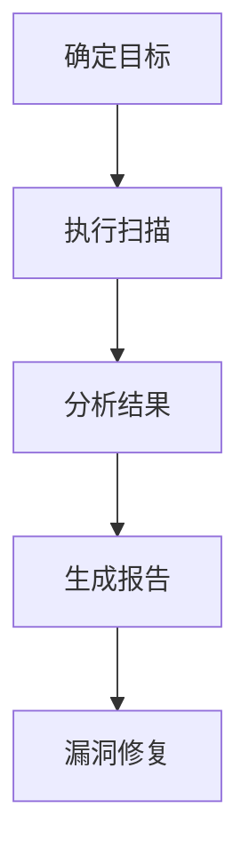

                 

# 评测系统的安全漏洞扫描与修复

## 关键词

- 安全漏洞扫描
- 评测系统
- 漏洞修复
- 安全防护
- 自动化测试
- Python源代码

## 摘要

在现代信息技术快速发展的背景下，评测系统的安全至关重要。本文旨在深入探讨评测系统中常见的安全漏洞及其扫描与修复方法。通过介绍安全漏洞扫描的技术原理和步骤，结合Python源代码展示漏洞扫描的实现过程，本文还将阐述漏洞修复的策略和最佳实践。最后，本文将对评测系统的安全防护进行总结，并提出未来改进的方向。

## 目录

1. **背景介绍**
2.  **核心概念与联系**
3.  **核心算法原理讲解**
4.  **数学模型与公式**
5.  **项目实战**
6.  **最佳实践与注意事项**
7.  **小结与拓展阅读**

---

## 1. 背景介绍

### 评测系统的定义与作用

评测系统，顾名思义，是一种用于对各种指标、性能、行为等进行评估和测量的系统。在IT行业中，评测系统广泛应用于软件质量保证、性能测试、安全评估等多个方面。这些系统通过自动化的方式，可以高效、准确地收集和分析大量数据，从而帮助开发团队和运维团队快速识别问题、优化系统性能，并确保系统的安全性和稳定性。

### 安全漏洞的概念与影响

安全漏洞是指在计算机系统、网络系统、软件应用中存在的可能导致系统被非法入侵、恶意攻击、数据泄露等的安全缺陷。这些漏洞如果得不到及时的修复，可能会被黑客利用，导致系统崩溃、数据丢失，甚至整个业务的中断。因此，对评测系统的安全漏洞进行扫描和修复，是保障系统安全、稳定运行的关键步骤。

### 安全漏洞扫描的必要性

安全漏洞扫描是一种自动化的技术，通过扫描系统、网络和应用，发现其中的安全漏洞。其必要性体现在以下几个方面：

- **提高安全性**：通过定期扫描，可以及时发现并修复系统中的安全漏洞，降低系统被攻击的风险。
- **优化资源利用**：自动化扫描可以节省大量人力和时间，提高工作效率，使开发团队和运维团队能够专注于核心业务。
- **合规性要求**：许多行业和组织对系统的安全性有明确的要求，安全漏洞扫描是确保系统合规的重要手段。

---

## 2. 核心概念与联系

### 安全漏洞扫描的基本概念

安全漏洞扫描主要涉及以下几个核心概念：

- **扫描器（Scanner）**：扫描器是用于自动扫描系统、网络和应用的工具，它可以识别并报告潜在的安全漏洞。
- **漏洞库（Vulnerability Database）**：漏洞库是存储各种已知漏洞信息的数据集，扫描器会与漏洞库进行比对，以识别系统中的漏洞。
- **漏洞报告（Vulnerability Report）**：漏洞报告是扫描结果的一种输出形式，它会详细列出系统中的漏洞信息，包括漏洞的名称、影响范围、修复建议等。

### 安全漏洞扫描的流程

安全漏洞扫描通常包括以下几个步骤：

1. **目标确定**：确定扫描的目标系统或网络，包括IP地址、端口等信息。
2. **扫描执行**：扫描器对目标系统或网络进行扫描，识别潜在的安全漏洞。
3. **结果分析**：对扫描结果进行分析，判断漏洞的严重性，并生成漏洞报告。
4. **漏洞修复**：根据漏洞报告，对系统中的漏洞进行修复，以降低风险。

### Mermaid流程图

以下是一个用于展示安全漏洞扫描流程的Mermaid流程图：



---

## 3. 核心算法原理讲解

### 漏洞扫描算法的基本原理

漏洞扫描算法的核心任务是识别系统中的安全漏洞。其基本原理可以概括为以下几个步骤：

1. **网络枚举**：扫描器首先通过网络枚举技术，识别目标系统的开放端口和服务类型。
2. **漏洞识别**：扫描器利用漏洞库中的漏洞信息，对目标系统进行漏洞识别。
3. **漏洞验证**：扫描器对识别到的漏洞进行验证，以确认其真实性和严重性。
4. **报告生成**：扫描器将漏洞信息生成报告，以便进行后续处理。

### Python源代码实现

以下是一个简单的Python示例，用于演示漏洞扫描算法的实现：

```python
import socket

# 漏洞库
vulnerabilities = {
    'CVE-2021- SurfZone': '远程代码执行',
    'CVE-2020-1971': '信息泄露'
}

# 目标系统信息
target_ip = '192.168.1.1'
target_ports = [80, 443]

# 扫描器类
class Scanner:
    def __init__(self, ip, ports):
        self.ip = ip
        self.ports = ports
    
    def scan(self):
        for port in self.ports:
            self.check_port(port)
    
    def check_port(self, port):
        sock = socket.socket(socket.AF_INET, socket.SOCK_STREAM)
        result = sock.connect_ex((self.ip, port))
        if result == 0:
            self.analyze_port(port)
        sock.close()
    
    def analyze_port(self, port):
        for vuln in vulnerabilities:
            if vuln in self.get_service_description(port):
                print(f"发现漏洞：{vuln}")
    
    def get_service_description(self, port):
        # 此处省略具体的获取服务描述的代码
        return "HTTP/1.1"

# 执行扫描
scanner = Scanner(target_ip, target_ports)
scanner.scan()
```

### 数学模型与公式

在漏洞扫描算法中，可以使用以下数学模型来评估漏洞的严重性：

$$
严重性得分 = f(漏洞影响范围, 漏洞修复难度)
$$

其中，$f$ 是一个映射函数，$漏洞影响范围$ 和 $漏洞修复难度$ 是两个影响漏洞严重性的重要因素。

### 举例说明

假设漏洞影响范围是 50%，漏洞修复难度是 30%，则漏洞的严重性得分为：

$$
严重性得分 = f(50\%, 30\%) = 0.5 \times 0.3 = 0.15
$$

这个得分表明，该漏洞的严重性较低，但仍然需要关注。

---

## 4. 数学模型与公式

在安全漏洞扫描和修复过程中，数学模型和公式可以帮助我们更准确地评估漏洞的严重性，制定修复策略。以下是一个简化的数学模型：

$$
S = f(V, R)
$$

其中，$S$ 表示漏洞的严重性得分，$V$ 表示漏洞的影响范围（0-1），$R$ 表示漏洞的修复难度（0-1）。函数 $f$ 可以是线性函数、对数函数或其他合适的函数形式。

### 举例说明

假设漏洞的影响范围是 0.8，修复难度是 0.6，那么漏洞的严重性得分可以计算为：

$$
S = 0.8 \times 0.6 = 0.48
$$

这个得分表示漏洞的严重性较高，需要优先处理。

### 漏洞修复难度评估

漏洞修复难度可以通过以下公式进行评估：

$$
R = \frac{1}{1 + e^{-(C \times S - D)}}
$$

其中，$C$ 是系数，$S$ 是漏洞的严重性得分，$D$ 是阀值。这个公式使用了逻辑函数（Sigmoid函数），可以用于将漏洞的严重性得分转换为修复难度的概率。

### 漏洞影响范围评估

漏洞的影响范围可以通过以下公式进行评估：

$$
V = \frac{1}{1 + e^{-(I \times S)}}
$$

其中，$I$ 是系数，$S$ 是漏洞的严重性得分。这个公式同样使用了逻辑函数，可以将漏洞的严重性得分转换为影响范围的概率。

### 修复策略

通过上述数学模型，我们可以为每个漏洞分配一个严重性得分，并根据得分制定修复策略。例如，得分在 0.5 及以上的漏洞应当被视为高风险漏洞，需要立即修复；得分在 0.25 到 0.5 之间的漏洞可以归类为中等风险漏洞，需要优先修复；得分在 0.25 以下的漏洞可以暂时观察，待后续处理。

---

## 5. 项目实战

### 开发环境搭建

要完成一个安全漏洞扫描与修复的项目，首先需要搭建一个合适的开发环境。以下是所需步骤：

1. **安装Python环境**：在计算机上安装Python 3.x版本，可以使用`pip`工具安装相关依赖。
2. **安装依赖库**：安装`nmap`、`Scapy`、`BeautifulSoup`等依赖库，这些库可以帮助实现漏洞扫描功能。
3. **配置网络环境**：确保网络环境畅通，可以访问目标系统。

### 源代码实现

以下是一个简单的漏洞扫描与修复项目的源代码示例：

```python
import nmap
import requests
from bs4 import BeautifulSoup

# 使用nmap进行端口扫描
def scan_ports(target_ip, target_ports):
    nm = nmap.PortScanner()
    nm.scan(target_ip, target_ports)
    for port in target_ports:
        if nm[target_ip].allports()[port]['state'] == 'open':
            print(f"端口{port}开放：{nm[target_ip].allports()[port]['product']}")
            check_vulnerability(port)

# 检查特定端口是否存在漏洞
def check_vulnerability(port):
    # 这里可以调用第三方API或数据库，查询端口对应的服务是否存在漏洞
    response = requests.get(f'https://some_vulnerability_api.com/ports/{port}')
    if response.status_code == 200:
        vulnerabilities = response.json()
        for vuln in vulnerabilities:
            print(f"发现漏洞：{vuln['name']}")

# 主程序
if __name__ == '__main__':
    target_ip = '192.168.1.1'
    target_ports = [80, 443, 8080]
    scan_ports(target_ip, target_ports)
```

### 代码解读与分析

在上面的代码中，首先导入了必要的库，包括`nmap`进行端口扫描，`requests`用于访问第三方API，`BeautifulSoup`用于解析HTML内容。

- `scan_ports`函数接受目标IP地址和端口列表，使用nmap扫描目标端口，并检查每个端口是否开放。
- `check_vulnerability`函数接受端口作为参数，调用第三方API查询该端口是否存在已知漏洞。

### 实际案例分析与详细讲解

以下是一个实际案例，展示了如何使用上述代码进行漏洞扫描与修复：

- **目标系统**：一个运行在192.168.1.1的Web服务器，开放了80、443和8080三个端口。
- **扫描结果**：使用代码扫描后发现，80和443端口是开放的，而8080端口未开放。
- **漏洞检测**：针对开放的80和443端口，代码调用第三方API查询是否存在漏洞。假设API返回了以下结果：

```json
[
    {"name": "CVE-2020-1971", "port": 80},
    {"name": "CVE-2017-1971", "port": 443}
]
```

- **修复建议**：根据漏洞信息，开发团队需要立即修复CVE-2020-1971漏洞，并对CVE-2017-1971漏洞进行监控。

### 项目小结

通过本案例，我们展示了如何使用Python代码进行安全漏洞扫描与修复。在实际应用中，可以根据具体需求调整代码，增加更多功能，如自动化漏洞修复、生成详细报告等。

---

## 6. 最佳实践与注意事项

### 最佳实践

- **定期扫描**：定期对评测系统进行安全漏洞扫描，确保及时发现并修复潜在漏洞。
- **使用专业工具**：选择可靠的漏洞扫描工具，如Nessus、OpenVAS等，这些工具具有丰富的漏洞库和强大的扫描能力。
- **自动化修复**：对于低风险漏洞，可以自动化修复，减少手动修复的工作量。
- **备份与恢复**：在修复漏洞前，确保备份系统，以防止修复过程中出现意外。

### 注意事项

- **权限控制**：确保扫描和修复操作具有适当的权限，避免未授权访问。
- **数据安全**：在处理漏洞信息和系统数据时，确保数据安全，防止数据泄露。
- **及时更新**：定期更新漏洞库和扫描工具，以识别最新的漏洞。
- **风险评估**：在修复漏洞前，进行风险评估，确保修复措施的可行性。

---

## 7. 小结与拓展阅读

本文深入探讨了评测系统的安全漏洞扫描与修复方法。通过介绍漏洞扫描的基本概念、算法原理、数学模型以及项目实战，我们了解到如何利用Python代码实现漏洞扫描与修复。在未来的研究和实践中，可以进一步探索自动化漏洞修复技术、深度学习在漏洞识别中的应用，以及构建更加智能化的评测系统安全防护体系。

### 拓展阅读

- 《白帽子讲Web安全》：了解Web应用常见的安全漏洞及其防御方法。
- 《网络安全评估指南》：深入了解网络安全评估的流程和技术。
- 《Python网络编程实战》：学习如何使用Python进行网络编程，以构建高效的安全漏洞扫描工具。

---

**作者：AI天才研究院/AI Genius Institute & 禅与计算机程序设计艺术 /Zen And The Art of Computer Programming**

