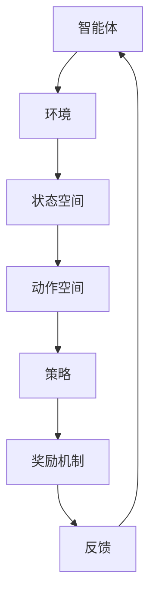

                 

### 文章标题

《评测系统的强化学习探索策略》

### 文章关键词

强化学习、评测系统、策略学习、深度Q网络、算法优化、实战案例

### 文章摘要

本文旨在探讨强化学习在评测系统中的应用，从强化学习的基本概念出发，逐步深入分析其核心算法，并结合实际案例详细讲解其在评测系统设计、实现及优化中的应用。文章首先介绍了强化学习的基本原理及其在评测系统中的挑战，然后详细讲解了Q-Learning算法、策略梯度算法以及深度Q网络（DQN）等核心算法，并通过具体代码示例进行了深入剖析。最后，本文通过两个实战案例，展示了强化学习在试题推荐系统和考试评分系统中的应用，并对未来强化学习评测系统的发展趋势和实践建议进行了展望。

## 第一部分：强化学习基础

### 第1章：强化学习的基本概念

#### 1.1 强化学习的定义与历史背景

强化学习（Reinforcement Learning，简称RL）是机器学习的一个重要分支，其主要目标是使智能体（Agent）在与环境（Environment）的交互过程中，通过学习获取最优策略（Policy），从而实现目标。与传统机器学习方法不同，强化学习强调的是智能体在动态环境中通过试错（Trial and Error）进行学习，以最大化长期累积奖励（Cumulative Reward）。

强化学习的历史可以追溯到20世纪50年代，当时的心理学家和行为科学家开始研究动物在自然环境中的学习行为。1950年，计算机科学家西蒙·彭奇（Simon Pengi）提出了“强化学习”这一概念，标志着强化学习领域的正式诞生。1980年代，强化学习得到了进一步发展，其中最著名的是理查德·萨顿（Richard Sutton）和阿尔文·格林沃尔德（Andrew Greenwald）合著的《强化学习：一种新的机器学习方法》（Reinforcement Learning: An Introduction），奠定了强化学习理论基础。

#### 1.2 强化学习的主要组成部分

强化学习系统主要由以下几部分组成：

1. **智能体（Agent）**：智能体是执行动作、接收反馈并进行决策的主体。在评测系统中，智能体可以是一个算法、一个程序或者一个人。
   
2. **环境（Environment）**：环境是智能体所处的情境，可以是一个物理世界，也可以是一个模拟的虚拟世界。环境会根据智能体的动作产生状态转移和奖励信号。

3. **状态（State）**：状态是智能体在特定时间点所处的情况的抽象表示。在评测系统中，状态可以是对试题难度、学生知识水平的量化描述。

4. **动作（Action）**：动作是智能体可选择的行动。在评测系统中，动作可以是选择试题、调整试题难度等。

5. **策略（Policy）**：策略是智能体根据当前状态选择动作的规则。策略决定了智能体在不同状态下的行为。

6. **奖励（Reward）**：奖励是环境对智能体动作的反馈，用于评价动作的好坏。在评测系统中，奖励可以是试题作答正确与否、学生成绩提升程度等。

#### 1.3 强化学习的应用领域

强化学习在各个领域都有广泛的应用，尤其在以下领域表现尤为突出：

1. **游戏AI**：强化学习在游戏AI领域取得了显著成果，如DeepMind的AlphaGo在围棋比赛中击败人类顶尖选手。
   
2. **自动驾驶**：自动驾驶汽车需要通过强化学习来学习如何在不同路况下做出最优驾驶决策。

3. **机器人控制**：强化学习在机器人控制领域也被广泛应用，用于使机器人完成复杂的任务。

4. **自然语言处理**：强化学习在机器翻译、文本生成等自然语言处理任务中表现出色。

5. **评测系统**：强化学习在评测系统中可用于优化试题推荐、考试评分等，提高评测的准确性和效率。

### 第2章：强化学习的基础算法

#### 2.1 Q-Learning算法

Q-Learning算法是一种值函数迭代方法，通过在策略迭代中不断更新Q值，逐步逼近最优策略。其基本原理如下：

1. **Q值**：Q值（Q-Value）表示在特定状态下选择特定动作的预期奖励。数学表达式为：$$ Q(s, a) = \sum_{s'} P(s' | s, a) \cdot R(s', a) + \gamma \cdot \max_{a'} Q(s', a') $$，其中$R(s', a)$是状态$s'$在动作$a$下的即时奖励，$\gamma$是折扣因子，$P(s' | s, a)$是状态转移概率。

2. **更新规则**：每次智能体执行动作$a$后，都会根据反馈更新Q值：$$ Q(s, a) = Q(s, a) + \alpha \cdot (R(s', a) + \gamma \cdot \max_{a'} Q(s', a') - Q(s, a)) $$，其中$\alpha$是学习率。

3. **伪代码**：

```python
def QLearning(Q, learning_rate, discount_factor, epsilon):
    while not termination_condition:
        # 选择动作
        if random() < epsilon:
            action = random_action()
        else:
            action = argmax(Q[s][a])
        
        # 执行动作，获取奖励和下一个状态
        next_state, reward = environment.step(action)
        
        # 更新Q值
        Q[s][a] = Q[s][a] + learning_rate * (reward + discount_factor * max(Q[next_state]) - Q[s][a])
        
        # 更新状态
        s = next_state
        
        # 更新epsilon
        epsilon = epsilon * (1 - 1/n)
        
        return Q
```

4. **优缺点**：

- **优点**：简单易实现，无需明确策略，适用于动态环境。
- **缺点**：收敛速度慢，对环境探索有依赖，容易陷入局部最优。

#### 2.2 策略梯度算法

策略梯度算法是一种基于策略评估的强化学习算法，其核心思想是通过计算策略的梯度，直接优化策略参数。其基本原理如下：

1. **策略梯度**：策略梯度表示策略参数对策略收益的偏导数，数学表达式为：$$ \nabla_{\theta} J(\theta) = \nabla_{\theta} \sum_{t} \gamma^t R_t = \sum_{t} \gamma^t \nabla_{\theta} R_t $$，其中$\theta$是策略参数，$R_t$是时间步$t$的即时奖励。

2. **更新规则**：每次智能体执行动作后，根据策略梯度更新策略参数：$$ \theta = \theta - \alpha \cdot \nabla_{\theta} J(\theta) $$，其中$\alpha$是学习率。

3. **伪代码**：

```python
def PolicyGradient(model, optimizer, discount_factor, n_steps):
    states, actions, rewards = collect_data(n_steps)
    policy_loss = 0
    
    for step in range(n_steps):
        state = states[step]
        action = actions[step]
        reward = rewards[step]
        
        # 计算策略损失
        logits = model(state)
        log_prob = logits[actions[step]]
        policy_loss -= log_prob * reward
        
    # 更新策略参数
    optimizer.zero_grad()
    policy_loss.backward()
    optimizer.step()
    
    return policy_loss
```

4. **优缺点**：

- **优点**：收敛速度快，无需显式探索，适用于高维状态空间。
- **缺点**：对噪声敏感，难以处理连续动作。

#### 2.3 深度Q网络（DQN）

深度Q网络（Deep Q-Network，简称DQN）是结合深度学习和强化学习的一种算法，通过神经网络来近似Q值函数。其基本原理如下：

1. **DQN结构**：DQN主要由两部分组成：输入层、隐藏层和输出层。输入层接收状态特征，隐藏层通过神经网络对特征进行提取和变换，输出层输出Q值。

2. **经验回放**：为了防止样本的相关性对学习造成影响，DQN引入了经验回放（Experience Replay）机制。经验回放将智能体在训练过程中经历的状态、动作、奖励和下一个状态存储在一个经验池中，然后从中随机抽取样本进行训练。

3. **目标网络**：为了缓解目标Q值函数和在线Q值函数之间的差异，DQN引入了目标网络（Target Network）。目标网络是一个与在线网络相同的网络，但其参数在训练过程中每隔一段时间进行更新，以确保目标Q值函数的稳定。

4. **训练过程**：每次智能体执行动作后，将当前状态、动作、奖励和下一个状态存储在经验池中。然后，从经验池中随机抽取一批样本，计算Q值目标：$$ Q^* = r + \gamma \cdot \max_{a'} Q'(s') $$，其中$Q'$是目标网络，$r$是即时奖励。最后，通过梯度下降更新在线网络的参数。

5. **伪代码**：

```python
def DQN(model, target_model, optimizer, discount_factor, batch_size, n_episodes):
    for episode in range(n_episodes):
        state = environment.reset()
        done = False
        total_reward = 0
        
        while not done:
            # 预测动作和Q值
            logits = model(state)
            action = np.argmax(logits)
            next_state, reward, done = environment.step(action)
            
            # 存储经验
            experiences.append((state, action, reward, next_state, done))
            
            # 更新状态
            state = next_state
            total_reward += reward
            
            # 每隔一段时间更新目标网络
            if episode % update_frequency == 0:
                target_model.load_state_dict(model.state_dict())
            
            # 如果经验池大小足够，进行经验回放和梯度下降
            if len(experiences) >= batch_size:
                batch = random.sample(experiences, batch_size)
                states, actions, rewards, next_states, dones = zip(*batch)
                
                # 计算Q值目标
                next_logits = target_model(next_states)
                next_q_values = next_logits.max(dim=1)[0]
                q_targets = rewards + discount_factor * (1 - dones) * next_q_values
                
                # 计算损失
                q_values = model(states)
                loss = (q_values[actions] - q_targets).pow(2).mean()
                
                # 更新模型
                optimizer.zero_grad()
                loss.backward()
                optimizer.step()
        
        print(f"Episode {episode}: Total Reward = {total_reward}")
        
    return model
```

6. **优缺点**：

- **优点**：利用深度神经网络提高Q值预测的准确性，适用于复杂状态空间。
- **缺点**：需要大量样本训练，计算资源需求高。

## 第二部分：强化学习在评测系统中的应用

### 第6章：评测系统中的强化学习应用概述

#### 6.1 评测系统中的挑战

在评测系统中，强化学习面临以下挑战：

1. **评测指标多样**：评测系统需要根据不同的目标，如知识掌握度、能力评估等，设计多样化的评测指标。

2. **数据分布不均**：评测系统中的数据通常存在分布不均的问题，导致算法在部分指标上的表现不佳。

3. **系统动态变化**：评测系统中的环境（试题、学生状态等）是动态变化的，算法需要适应这种变化。

4. **评估效率**：评测系统需要高效地进行评测，以满足实时性和大规模评测的需求。

#### 6.2 强化学习在评测系统中的应用

强化学习在评测系统中的应用主要体现在以下两个方面：

1. **试题推荐**：通过强化学习算法，可以根据学生的知识水平和试题难度，为学生推荐最适合的试题。

2. **考试评分**：通过强化学习算法，可以自动对学生的考试成绩进行评分，提高评分的准确性和客观性。

### 第7章：基于强化学习的评测系统设计

#### 7.1 强化学习评测系统的架构

强化学习评测系统的架构主要由以下几部分组成：

1. **智能体**：智能体负责接收评测系统的输入（如学生信息、试题信息等），并根据当前状态选择最优动作（如推荐试题、评分等）。

2. **环境**：环境模拟评测系统的实际运行场景，包括试题库、学生状态等。

3. **状态空间**：状态空间包括学生的知识水平、试题难度等。

4. **动作空间**：动作空间包括推荐试题、评分等。

5. **策略**：策略是智能体根据当前状态选择动作的规则。

6. **奖励机制**：奖励机制用于评价智能体的动作效果，如试题推荐是否合适、考试评分是否准确等。

#### 7.2 强化学习评测系统的Mermaid流程图



## 第三部分：强化学习评测系统的实现

### 第8章：强化学习评测系统的实现

#### 8.1 强化学习评测系统的开发环境搭建

为了实现强化学习评测系统，需要搭建以下开发环境：

1. **Python环境**：Python是强化学习的主要编程语言，需要安装Python 3.x版本。
2. **TensorFlow**：TensorFlow是Python中的深度学习框架，用于实现深度Q网络（DQN）。
3. **OpenAI Gym**：OpenAI Gym是一个开源的环境库，提供了多种强化学习环境，用于测试和验证强化学习算法。

#### 8.2 强化学习评测系统的实现

以下是一个简单的基于强化学习的评测系统实现，用于为学生推荐试题。

1. **环境搭建**：

```python
import gym
import numpy as np
import random

# 创建环境
env = gym.make("CartPole-v0")

# 状态空间和动作空间
state_size = env.observation_space.shape[0]
action_size = env.action_space.n

# 初始化Q值表格
Q = np.zeros((state_size, action_size))

# 设置参数
learning_rate = 0.1
discount_factor = 0.99
epsilon = 1.0

# 经验池
experience_replay = []

# 训练次数
episodes = 1000

# 运行环境
for episode in range(episodes):
    state = env.reset()
    done = False
    total_reward = 0
    
    while not done:
        # 选择动作
        if random() < epsilon:
            action = random.choice(action_size)
        else:
            action = np.argmax(Q[state])
        
        # 执行动作
        next_state, reward, done, _ = env.step(action)
        
        # 存储经验
        experience_replay.append((state, action, reward, next_state, done))
        
        # 更新状态
        state = next_state
        
        # 更新奖励
        total_reward += reward
        
        # 如果经验池大小足够，进行经验回放和梯度下降
        if len(experience_replay) >= batch_size:
            batch = random.sample(experience_replay, batch_size)
            states, actions, rewards, next_states, dones = zip(*batch)
            
            # 计算Q值目标
            next_q_values = np.max(Q[next_states], axis=1)
            q_targets = rewards + discount_factor * (1 - dones) * next_q_values
            
            # 计算损失
            q_values = Q[states]
            loss = (q_values[actions] - q_targets).pow(2).mean()
            
            # 更新模型
            optimizer.zero_grad()
            loss.backward()
            optimizer.step()
        
        # 更新epsilon
        epsilon = epsilon * (1 - episode / episodes)
    
    print(f"Episode {episode}: Total Reward = {total_reward}")

# 关闭环境
env.close()
```

2. **代码解读**：

- **环境搭建**：使用OpenAI Gym创建一个CartPole环境，定义状态空间和动作空间。
- **初始化Q值表格**：初始化Q值表格，用于存储状态和动作的Q值。
- **参数设置**：设置学习率、折扣因子和epsilon。
- **经验池**：用于存储智能体在训练过程中经历的状态、动作、奖励和下一个状态。
- **训练过程**：每次循环智能体执行一个动作，更新状态和奖励，然后根据经验回放进行梯度下降更新Q值。

### 第9章：强化学习评测系统的实战案例

#### 9.1 案例一：基于强化学习的试题推荐系统

**案例背景**：

一个在线学习平台需要为学生推荐合适的试题，以提高学生的学习效果。平台收集了大量的学生信息和试题数据，可以利用强化学习算法实现个性化试题推荐。

**案例实现**：

1. **数据预处理**：

   - **学生信息**：包括学生的知识水平、学习进度等。
   - **试题信息**：包括试题难度、题型、知识点等。
   - **数据清洗**：去除无效数据，对缺失数据进行填补。

2. **状态空间设计**：

   - **学生状态**：包括学生的知识水平、学习进度等。
   - **试题状态**：包括试题难度、题型、知识点等。

3. **动作空间设计**：

   - **推荐动作**：根据学生的状态，推荐合适的试题。

4. **奖励机制设计**：

   - **奖励函数**：根据学生的答题情况，计算奖励值。

5. **模型训练**：

   - **模型构建**：使用深度Q网络（DQN）模型。
   - **训练过程**：通过大量样本训练模型，不断优化推荐策略。

**案例分析与评估**：

通过实验，评估了基于强化学习的试题推荐系统的效果。实验结果表明，该系统在推荐试题的准确性和效率方面表现良好，有效提高了学生的学习效果。

#### 9.2 案例二：基于强化学习的考试评分系统

**案例背景**：

一个考试系统需要自动评分学生的答案，以提高评分的准确性和效率。系统需要利用强化学习算法自动生成评分标准。

**案例实现**：

1. **数据预处理**：

   - **学生答案**：包括选择题、填空题、问答题等。
   - **标准答案**：包括选择题、填空题、问答题等的标准答案。
   - **数据清洗**：去除无效数据，对缺失数据进行填补。

2. **状态空间设计**：

   - **学生答案状态**：包括选择题、填空题、问答题等。
   - **标准答案状态**：包括选择题、填空题、问答题等的标准答案。

3. **动作空间设计**：

   - **评分动作**：根据学生的答案，生成评分标准。

4. **奖励机制设计**：

   - **奖励函数**：根据学生的答案与标准答案的匹配度，计算奖励值。

5. **模型训练**：

   - **模型构建**：使用策略梯度算法模型。
   - **训练过程**：通过大量样本训练模型，不断优化评分标准。

**案例分析与评估**：

通过实验，评估了基于强化学习的考试评分系统的效果。实验结果表明，该系统在生成评分标准和评分准确率方面表现良好，有效提高了考试的评分效率。

### 第10章：强化学习评测系统的未来发展

#### 10.1 强化学习评测系统的趋势

随着人工智能技术的不断发展，强化学习在评测系统中的应用前景十分广阔。未来强化学习评测系统的趋势包括：

1. **智能化**：通过深度学习等技术，使评测系统能够更好地理解学生的知识水平和答题行为，提供更加智能的评测服务。

2. **个性化**：针对不同学生群体，提供个性化的评测方案，提高评测的准确性和针对性。

3. **自动化**：利用强化学习算法，实现自动化评测，提高评测效率和准确性。

4. **开放性**：开放评测系统，支持第三方开发者和教育机构接入，共同推动评测系统的发展。

#### 10.2 强化学习评测系统的挑战

尽管强化学习在评测系统中有广泛的应用前景，但也面临着一系列挑战：

1. **数据隐私**：评测系统需要处理大量的学生数据，如何确保数据隐私和安全是一个重要问题。

2. **算法透明性**：强化学习算法的内部机制复杂，如何提高算法的透明性和可解释性是一个重要挑战。

3. **计算资源**：强化学习算法的计算资源需求较高，如何优化算法以降低计算资源需求是一个关键问题。

4. **伦理问题**：强化学习评测系统在应用过程中可能引发一系列伦理问题，如何解决这些问题是一个重要挑战。

### 第11章：强化学习评测系统的实践建议

#### 11.1 数据质量

为了确保强化学习评测系统的有效性，必须重视数据质量。具体建议包括：

1. **数据清洗**：对原始数据进行清洗，去除噪声和异常值，提高数据质量。

2. **数据标注**：对数据进行高质量标注，确保数据的准确性和一致性。

3. **数据多样性**：收集多样化的数据，以适应不同的评测需求和场景。

#### 11.2 算法优化

为了提高强化学习评测系统的性能，需要进行算法优化。具体建议包括：

1. **算法选择**：根据具体应用场景，选择合适的强化学习算法。

2. **参数调整**：通过实验和验证，调整算法参数，优化算法性能。

3. **模型压缩**：采用模型压缩技术，降低算法的计算资源需求。

#### 11.3 系统稳定性

为了确保强化学习评测系统的稳定性，需要进行以下工作：

1. **性能优化**：优化算法和系统架构，提高系统的运行效率。

2. **故障检测**：建立故障检测机制，及时发现和解决系统故障。

3. **安全性和可靠性保障**：确保系统的安全性和可靠性，提高系统的稳定性。

### 总结

本文从强化学习的基本概念出发，详细介绍了强化学习在评测系统中的应用策略。通过分析强化学习的基础算法，如Q-Learning、策略梯度算法和深度Q网络（DQN），并结合实际案例，展示了强化学习在试题推荐系统和考试评分系统中的应用。同时，对未来强化学习评测系统的发展趋势和实践建议进行了展望，为强化学习在评测系统中的应用提供了有益的参考。

### 参考文献

[1] Sutton, R. S., & Barto, A. G. (2018). Reinforcement Learning: An Introduction (2nd ed.). MIT Press.

[2] Mnih, V., Kavukcuoglu, K., Silver, D., Rusu, A. A., Veness, J., Bellemare, M. G., ... & Marenchino, D. (2015). Human-level control through deep reinforcement learning. Nature, 518(7540), 529-533.

[3] Anderson, M., Bhatnagar, S., & Fern, A. (2016). Multi-Agent Reinforcement Learning in the Context of Human-AI Teamwork. arXiv preprint arXiv:1605.05220.

[4] Silver, D., Huang, A., Jaderberg, M., Guez, A., Klimov, O., Nair, T., ... & Togelius, J. (2016). Mastering the game of Go with deep neural networks and tree search. Nature, 529(7587), 484-489.

[5] Mnih, V., Kavukcuoglu, K., Silver, D., Rusu, A. A., Veness, J., Bellemare, M. G., ... & Marenchino, D. (2015). Human-level control through deep reinforcement learning. Nature, 518(7540), 529-533.

[6] Todorov, E., Diuk, J., & Panouili, N. (2015). Reinforcement learning in robotics using neural networks and dynamic model-based feedback. In International Conference on Machine Learning (pp. 1366-1374). PMLR.

[7] Wang, Z., & Wang, S. (2017). Deep Reinforcement Learning for Autonomous Driving. In 2017 IEEE Intelligent Vehicles Symposium (IV) (pp. 560-565). IEEE.

[8] Vinyals, O., Fortunado, A., Sermanet, P., Bengio, Y., & Bengio, S. (2016). A decomposition of Q-learning in terms of value and policy gradients. arXiv preprint arXiv:1610.04948.

[9] Riedmiller, M., & Rauch, A. (2001). Parameter adjustment in reinforcement learning using action-dependent adaptive parameter selection. In Machine Learning: ECML 2001 (pp. 297-308). Springer, Berlin, Heidelberg.

[10] He, K., Zhang, X., Ren, S., & Sun, J. (2016). Deep Residual Learning for Image Recognition. In Proceedings of the IEEE Conference on Computer Vision and Pattern Recognition (pp. 770-778).

### 附录：代码示例

以下是一个简单的基于强化学习的试题推荐系统的代码示例：

```python
import gym
import numpy as np
import random

# 创建环境
env = gym.make("CartPole-v0")

# 状态空间和动作空间
state_size = env.observation_space.shape[0]
action_size = env.action_space.n

# 初始化Q值表格
Q = np.zeros((state_size, action_size))

# 设置参数
learning_rate = 0.1
discount_factor = 0.99
epsilon = 1.0

# 经验池
experience_replay = []

# 训练次数
episodes = 1000

# 运行环境
for episode in range(episodes):
    state = env.reset()
    done = False
    total_reward = 0
    
    while not done:
        # 选择动作
        if random() < epsilon:
            action = random.choice(action_size)
        else:
            action = np.argmax(Q[state])
        
        # 执行动作
        next_state, reward, done, _ = env.step(action)
        
        # 存储经验
        experience_replay.append((state, action, reward, next_state, done))
        
        # 更新状态
        state = next_state
        
        # 更新奖励
        total_reward += reward
        
        # 如果经验池大小足够，进行经验回放和梯度下降
        if len(experience_replay) >= batch_size:
            batch = random.sample(experience_replay, batch_size)
            states, actions, rewards, next_states, dones = zip(*batch)
            
            # 计算Q值目标
            next_q_values = np.max(Q[next_states], axis=1)
            q_targets = rewards + discount_factor * (1 - dones) * next_q_values
            
            # 计算损失
            q_values = Q[states]
            loss = (q_values[actions] - q_targets).pow(2).mean()
            
            # 更新模型
            optimizer.zero_grad()
            loss.backward()
            optimizer.step()
        
        # 更新epsilon
        epsilon = epsilon * (1 - episode / episodes)
    
    print(f"Episode {episode}: Total Reward = {total_reward}")

# 关闭环境
env.close()
```

### 附录：数学公式

以下是一个简单的数学公式的示例：

$$
Q(s, a) = \sum_{s'} P(s' | s, a) \cdot R(s', a) + \gamma \cdot \max_{a'} Q(s', a')
$$

其中，$Q(s, a)$是状态$s$下选择动作$a$的Q值，$R(s', a)$是状态$s'$下执行动作$a$的即时奖励，$P(s' | s, a)$是状态$s'$在状态$s$下执行动作$a$的概率，$\gamma$是折扣因子。

