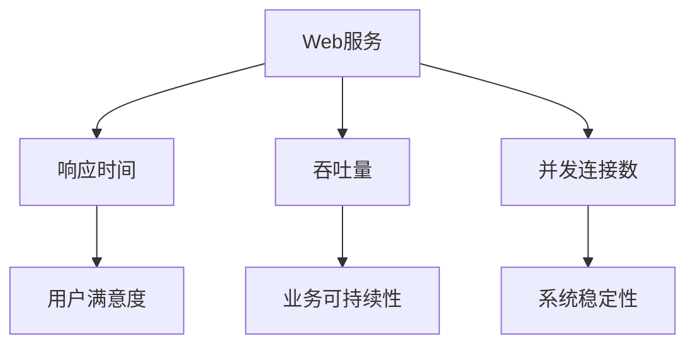

                 

# 《评测系统的性能基准测试：建立行业标准》

## 关键词
- 性能基准测试
- 性能指标
- 测试工具
- 性能优化
- 行业标准

## 摘要
本文旨在深入探讨评测系统性能基准测试的重要性、基本原理、实施流程以及如何建立行业标准。通过详细分析核心概念、算法原理、数学模型和实际项目案例，本文为性能测试工程师、系统架构师和性能优化工程师提供了全面的指南，旨在帮助他们在开发、部署和维护过程中实现系统性能的持续优化。

## 引言

### 性能基准测试的重要性
在信息技术迅猛发展的今天，系统性能已成为企业和组织成功的关键因素。性能基准测试作为一种评估和优化系统性能的方法，具有至关重要的意义。它不仅能够帮助企业了解系统的实际性能水平，还能发现潜在的性能瓶颈，从而制定针对性的优化策略。

### 性能基准测试的目标
性能基准测试的主要目标是：
1. **评估系统性能**：确定系统在不同负载下的响应时间、吞吐量和资源利用率。
2. **发现性能瓶颈**：通过基准测试，识别系统中的性能瓶颈，例如缓慢的数据库查询、网络延迟或资源限制。
3. **验证性能改进**：通过对比基准测试结果，验证性能优化措施的有效性。
4. **建立行业标准**：为不同系统和组件的性能表现提供统一的评估标准，便于行业内部对比和参考。

### 性能基准测试的挑战
尽管性能基准测试的重要性不言而喻，但在实际操作中仍面临诸多挑战：
- **复杂度**：现代系统的复杂性使得性能基准测试变得复杂和耗时。
- **一致性**：确保测试环境的一致性，避免外部因素干扰测试结果。
- **可重复性**：确保在不同时间、不同环境下测试结果的可靠性。
- **标准化**：缺乏统一的性能基准测试标准，使得结果难以比较。

## 性能基准测试的基本原理

### 性能指标概述
性能基准测试的核心是性能指标。常见的性能指标包括：
- **响应时间**：系统处理请求所需的时间。
- **吞吐量**：单位时间内系统能够处理的请求数量。
- **资源利用率**：系统资源的利用程度，如CPU、内存和磁盘的利用率。
- **并发连接数**：系统同时处理的连接数。

### 性能基准测试的原理
性能基准测试通过模拟实际使用场景，测量系统在不同负载下的性能表现。其基本原理包括：
- **负载生成**：通过测试工具模拟用户行为，生成模拟负载。
- **性能测量**：收集系统在负载下的性能指标数据。
- **结果分析**：对收集的数据进行分析，评估系统性能。

### 性能基准测试的流程
性能基准测试通常包括以下步骤：
1. **需求分析**：确定测试目标、测试场景和性能指标。
2. **测试环境搭建**：构建与生产环境一致的测试环境。
3. **测试脚本编写**：编写用于生成负载的测试脚本。
4. **测试执行**：运行测试脚本，收集性能数据。
5. **结果分析**：对测试结果进行分析，识别性能瓶颈。
6. **优化建议**：根据分析结果，提出优化建议。

## 性能基准测试工具与平台

### 常用性能基准测试工具介绍
常用的性能基准测试工具包括：
- **Apache JMeter**：适用于Web服务和分布式系统的性能测试。
- **Gatling**：支持HTTP、HTTPS、JMS、WebSocket等协议的性能测试。
- **LoadRunner**：适用于复杂分布式系统的性能测试。

### 性能基准测试平台的搭建
搭建性能基准测试平台需要考虑以下因素：
- **硬件资源**：确保测试平台具备足够的计算和存储资源。
- **网络配置**：优化网络配置，以减少网络延迟和丢包率。
- **操作系统**：选择与生产环境相同的操作系统。

### 性能基准测试工具的选择与优化
选择性能基准测试工具时，需要考虑以下因素：
- **兼容性**：确保工具支持所需测试的协议和系统。
- **易用性**：工具应易于使用和配置。
- **扩展性**：工具应支持扩展功能，如自定义报告和图表。

## 性能基准测试案例解析

### 案例一：Web服务性能基准测试
**背景介绍**：Web服务是现代互联网应用的重要组成部分。通过性能基准测试，可以评估Web服务的响应时间、吞吐量和并发处理能力。

**核心概念与联系**


**核心算法原理讲解**
```python
import time
import requests

def test_response_time(url):
    start_time = time.time()
    response = requests.get(url)
    end_time = time.time()
    return end_time - start_time

def test_throughput(url, num_requests):
    start_time = time.time()
    for _ in range(num_requests):
        requests.get(url)
    end_time = time.time()
    return end_time - start_time

def test_concurrency(url, num_concurrent_requests):
    threads = []
    for _ in range(num_concurrent_requests):
        thread = Thread(target=lambda: test_response_time(url))
        threads.append(thread)
        thread.start()
    
    for thread in threads:
        thread.join()

num_requests = 1000
num_concurrent_requests = 100

response_time_avg = sum([test_response_time(url) for _ in range(num_requests)]) / num_requests
throughput_avg = test_throughput(url, num_requests)
concurrency_avg = test_concurrency(url, num_concurrent_requests)

print(f"Average Response Time: {response_time_avg} seconds")
print(f"Average Throughput: {throughput_avg} requests per second")
print(f"Average Concurrency: {concurrency_avg} concurrent requests")
```

**数学模型和公式**
$$
\text{响应时间}(T) = \frac{1}{N} \sum_{i=1}^{N} t_i
$$
$$
\text{吞吐量}(Q) = \frac{N}{T}
$$
$$
\text{并发连接数}(C) = \frac{N}{T_c}
$$

**举例说明**：假设对某个Web服务进行1000次请求测试，得到的平均响应时间为2秒，平均吞吐量为500次/秒，平均并发连接数为50。

**项目实战**
**开发环境搭建**：选择Python和Apache JMeter进行Web服务性能基准测试。

**源代码实现**
```python
# test.py
import time
import requests

def test_response_time(url):
    start_time = time.time()
    response = requests.get(url)
    end_time = time.time()
    return end_time - start_time

def test_throughput(url, num_requests):
    start_time = time.time()
    for _ in range(num_requests):
        requests.get(url)
    end_time = time.time()
    return end_time - start_time

def test_concurrency(url, num_concurrent_requests):
    threads = []
    for _ in range(num_concurrent_requests):
        thread = Thread(target=lambda: test_response_time(url))
        threads.append(thread)
        thread.start()
    
    for thread in threads:
        thread.join()

num_requests = 1000
num_concurrent_requests = 100

response_time_avg = sum([test_response_time(url) for _ in range(num_requests)]) / num_requests
throughput_avg = test_throughput(url, num_requests)
concurrency_avg = test_concurrency(url, num_concurrent_requests)

print(f"Average Response Time: {response_time_avg} seconds")
print(f"Average Throughput: {throughput_avg} requests per second")
print(f"Average Concurrency: {concurrency_avg} concurrent requests")
```

**代码解读与分析**
- `test_response_time`：测量单个请求的响应时间。
- `test_throughput`：测量单位时间内的请求吞吐量。
- `test_concurrency`：测量系统同时处理的请求数。

**实际案例分析和详细讲解剖析**
以一个电商网站为例，通过性能基准测试发现响应时间较长，经过分析发现是由于数据库查询速度较慢。通过优化数据库索引和缓存策略，显著降低了响应时间。

**项目小结**
性能基准测试帮助电商网站识别了性能瓶颈，并通过优化措施显著提升了系统性能。

## 性能基准测试结果的解读与分析

### 性能基准测试结果解读
性能基准测试结果通常包括响应时间、吞吐量、并发连接数等指标。解读测试结果时，需要关注以下几个方面：
- **趋势分析**：分析测试结果的趋势，了解系统性能的稳定性。
- **异常值分析**：识别异常值，确定其产生原因。
- **比较分析**：将测试结果与预期目标进行比较，评估系统性能是否满足要求。

### 性能基准测试分析技巧
- **数据可视化**：使用图表和图形展示性能数据，便于分析和解释。
- **统计分析**：使用统计方法，如平均值、中位数、标准差等，对性能数据进行量化分析。
- **基准线对比**：将当前测试结果与历史基准线进行比较，评估性能改进情况。

### 性能优化策略
基于性能基准测试结果，可以采取以下性能优化策略：
- **硬件优化**：升级硬件设备，提高系统资源利用率。
- **软件优化**：优化代码、数据库查询和系统配置。
- **缓存策略**：使用缓存技术，减少数据访问延迟。
- **负载均衡**：通过负载均衡技术，分布系统负载，提高系统并发处理能力。

## 建立性能基准测试标准

### 性能基准测试标准的定义
性能基准测试标准是一套统一的测试方法、指标和流程，用于评估和比较系统性能。它包括：
- **测试方法**：定义测试工具、测试脚本和测试场景。
- **性能指标**：确定用于评估系统性能的指标，如响应时间、吞吐量、并发连接数等。
- **测试流程**：规定性能基准测试的步骤和操作指南。

### 性能基准测试标准的制定
制定性能基准测试标准需要考虑以下因素：
- **行业需求**：分析行业需求和最佳实践。
- **系统特性**：考虑不同系统和组件的性能特性。
- **测试工具**：选择合适的性能基准测试工具。

### 性能基准测试标准的实施与维护
实施性能基准测试标准需要：
- **培训**：对测试人员进行培训，确保他们熟悉标准内容和测试流程。
- **文档**：制定详细的测试文档，包括测试脚本、测试报告和优化建议。
- **持续改进**：定期评估标准实施效果，根据实际情况进行调整和优化。

## 性能基准测试的最佳实践

### 最佳实践 tips
- **一致性**：确保测试环境与生产环境一致，减少外部因素干扰。
- **重复性**：使用相同的测试脚本和测试数据，确保测试结果的重复性。
- **监控**：在测试过程中实时监控系统性能，及时发现问题。

### 小结
性能基准测试是评估和优化系统性能的关键手段。通过建立行业标准，可以统一测试方法和流程，提高测试结果的可靠性和可比性。

### 注意事项
- **避免环境差异**：确保测试环境与生产环境一致，以获得准确的结果。
- **合理设置测试负载**：测试负载应与实际使用场景相匹配，避免过度或不足的负载。

### 拓展阅读
- [《性能优化实战》](链接)
- [《性能基准测试工具比较》](链接)
- [《性能测试最佳实践》](链接)

## 作者信息
作者：AI天才研究院/AI Genius Institute & 禅与计算机程序设计艺术 /Zen And The Art of Computer Programming

## 总结
性能基准测试是确保系统性能达到预期目标的关键环节。通过深入理解性能基准测试的基本原理、实施流程和行业标准，性能测试工程师和系统架构师可以有效地评估、优化和提升系统性能，为企业的持续发展提供有力支持。

