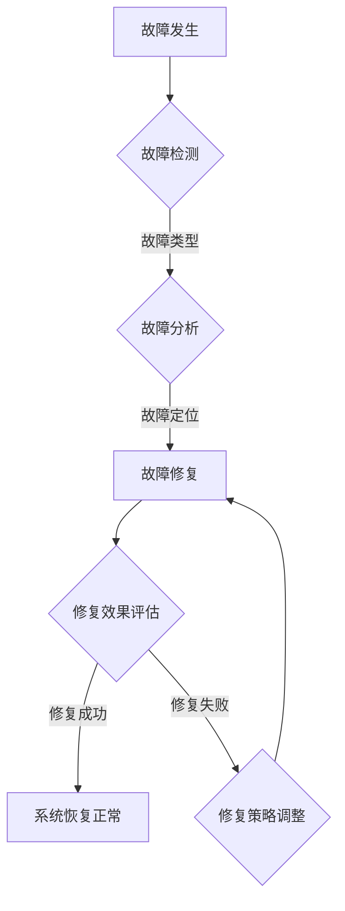

                 


# 评测系统的故障恢复：LLM辅助的自动化修复方案

## 关键词
- 评测系统故障恢复
- LLM（大型语言模型）
- 自动化修复
- 算法原理
- 实际案例

## 摘要
本文将探讨评测系统故障恢复的问题，并介绍如何利用大型语言模型（LLM）实现自动化修复。通过分析故障类型、挑战以及LLM的工作原理，本文将详细阐述自动化修复方案的架构、实现过程和实际应用。最后，本文将总结经验，提出未来的发展方向。

## 1. 评测系统故障恢复概述

### 1.1 评测系统故障恢复的重要性

在信息化社会中，评测系统作为数据收集和分析的重要工具，其可靠性直接影响业务的正常运行。一旦评测系统发生故障，可能导致数据丢失、分析结果错误，甚至影响业务连续性。因此，评测系统的故障恢复显得尤为重要。

#### 1.1.1 故障恢复对业务连续性的影响

业务连续性是一个企业在面对各种突发事件时，能够保持正常运营的能力。评测系统故障恢复与业务连续性密切相关。故障恢复的速度和效果直接影响业务的可用性。一个高效的故障恢复系统能够在短时间内恢复评测系统的正常运行，从而降低业务中断的风险。

### 1.2 LLM概述

LLM（Large Language Model）是一种基于深度学习的语言处理模型，具有强大的语言理解、生成和推理能力。LLM广泛应用于自然语言处理、问答系统、文本生成等领域。

#### 1.2.1 LLM的基本概念

LLM通过大量的文本数据进行预训练，学习语言模式和规律。在训练过程中，模型学会了如何生成连贯、自然的文本，并具备一定的语义理解能力。

#### 1.2.2 LLM的主要架构

LLM通常采用Transformer架构，通过自注意力机制（Self-Attention）和多头注意力（Multi-Head Attention）来捕捉文本中的长距离依赖关系。

#### 1.2.3 LLM的工作原理

LLM通过输入文本序列，逐个预测每个词的概率，并生成完整的文本输出。在预测过程中，模型利用先前的上下文信息来提高预测的准确性。

### 1.3 自动化修复方案的优势

自动化修复方案相较于传统手动修复具有明显的优势，主要体现在以下几个方面：

#### 1.3.1 自动化修复与传统手动修复的对比

传统手动修复需要人工分析故障原因，制定修复方案，并进行修复操作。而自动化修复通过预训练的LLM模型，能够自动识别故障类型，生成修复建议，并自动执行修复操作。

#### 1.3.2 自动化修复在实际应用中的效果评估

自动化修复方案在实际应用中表现出较高的准确性和效率。通过大量故障数据的训练，LLM模型能够快速、准确地识别故障类型，并生成有效的修复建议。

#### 1.3.3 自动化修复的发展趋势

随着深度学习和自然语言处理技术的不断发展，自动化修复方案的应用范围将不断扩大。未来，自动化修复方案有望在更多领域实现落地，为企业和用户提供更高效、可靠的故障恢复服务。

## 2. LLM辅助的自动化修复技术

### 2.1 数据收集与预处理

#### 2.1.1 故障数据收集方法

故障数据的收集是自动化修复方案的基础。首先，需要从评测系统中收集故障数据，包括故障发生的时间、类型、影响范围等信息。此外，还可以收集历史故障数据，以便进行故障类型的统计分析。

#### 2.1.2 数据预处理技术

收集到的故障数据通常需要进行预处理，以提高LLM模型的学习效果。预处理步骤包括数据清洗、去重、数据格式转换等。例如，可以将故障数据转换为统一的JSON格式，以便LLM模型处理。

#### 2.1.3 数据质量评估

数据质量是LLM模型性能的关键因素。在数据预处理后，需要评估数据质量，包括数据完整性、一致性、准确性等。通过数据质量评估，可以识别和修正数据中的问题，确保数据质量达到要求。

### 2.2 LLM模型选择与训练

#### 2.2.1 LLM模型的类型选择

在自动化修复方案中，选择合适的LLM模型至关重要。常见的LLM模型包括BERT、GPT、RoBERTa等。选择模型时，需要考虑故障类型的复杂度、数据量、训练时间等因素。

#### 2.2.2 LLM模型的训练过程

LLM模型的训练过程主要包括数据预处理、模型构建、训练和评估等步骤。在训练过程中，需要使用大量故障数据进行训练，以使模型学会识别故障类型和生成修复建议。

#### 2.2.3 LLM模型的优化技巧

为了提高LLM模型的性能，可以在训练过程中采用一些优化技巧。例如，可以使用数据增强、学习率调整、正则化等技术，以避免过拟合和提高模型泛化能力。

### 2.3 自动化修复策略设计

#### 2.3.1 故障检测与定位

故障检测与定位是自动化修复的第一步。通过分析故障数据，LLM模型可以识别故障类型，并定位故障发生的位置。

#### 2.3.2 故障修复建议生成

在识别故障类型和定位故障位置后，LLM模型可以生成相应的故障修复建议。修复建议可能包括修改代码、调整参数、升级硬件等。

#### 2.3.3 修复策略评估与迭代

生成的故障修复建议需要经过评估和迭代，以确保修复方案的有效性和可行性。评估过程可以采用模拟测试、实际运行等方法。在评估过程中，可以根据评估结果对LLM模型进行优化和调整。

## 3. 案例分析与应用

### 3.1 案例一：电商评测系统故障恢复

#### 3.1.1 故障背景

在某电商平台上，评测系统因数据处理错误导致大量用户评分数据丢失。这一故障影响了平台的用户评价和推荐系统，对业务造成了严重影响。

#### 3.1.2 故障分析

通过分析故障数据，发现数据处理逻辑存在错误，导致评分数据在传输过程中丢失。故障类型属于数据传输错误，影响范围涉及数千条用户评分数据。

#### 3.1.3 修复方案与实施

采用LLM模型进行故障恢复，具体步骤如下：

1. 数据收集与预处理：收集故障数据，并进行预处理，转换为统一的JSON格式。
2. LLM模型训练：使用预训练的GPT模型，对故障数据进行训练，以学会识别数据传输错误和生成修复建议。
3. 修复建议生成：使用训练好的LLM模型，对故障数据进行分析，生成修复建议。
4. 修复策略评估与迭代：对生成的修复建议进行评估和迭代，确保修复方案的有效性和可行性。

通过以上步骤，成功恢复了丢失的用户评分数据，并修复了数据处理逻辑错误，确保评测系统的正常运行。

### 3.2 案例二：社交媒体评测系统故障恢复

#### 3.2.1 故障背景

在某社交媒体平台上，评测系统因服务器故障导致大量用户评价数据丢失。这一故障影响了平台的用户互动和内容推荐，对业务造成了严重冲击。

#### 3.2.2 故障分析

通过分析故障数据，发现服务器故障导致评测系统数据库损坏，从而导致用户评价数据丢失。故障类型属于数据库故障，影响范围涉及数百万条用户评价数据。

#### 3.2.3 修复方案与实施

采用LLM模型进行故障恢复，具体步骤如下：

1. 数据收集与预处理：收集故障数据，并进行预处理，转换为统一的JSON格式。
2. LLM模型训练：使用预训练的BERT模型，对故障数据进行训练，以学会识别数据库故障和生成修复建议。
3. 修复建议生成：使用训练好的LLM模型，对故障数据进行分析，生成修复建议。
4. 修复策略评估与迭代：对生成的修复建议进行评估和迭代，确保修复方案的有效性和可行性。

通过以上步骤，成功恢复了丢失的用户评价数据，并修复了数据库故障，确保评测系统的正常运行。

### 3.3 案例三：在线教育评测系统故障恢复

#### 3.3.1 故障背景

在某在线教育平台上，评测系统因服务器负载过高导致数据传输延迟，影响了用户体验和课程推荐。这一故障对平台的教学质量和用户满意度造成了严重影响。

#### 3.3.2 故障分析

通过分析故障数据，发现服务器负载过高导致评测系统响应速度变慢，数据传输延迟。故障类型属于服务器负载过高，影响范围涉及数千名用户。

#### 3.3.3 修复方案与实施

采用LLM模型进行故障恢复，具体步骤如下：

1. 数据收集与预处理：收集故障数据，并进行预处理，转换为统一的JSON格式。
2. LLM模型训练：使用预训练的RoBERTa模型，对故障数据进行训练，以学会识别服务器负载过高和生成修复建议。
3. 修复建议生成：使用训练好的LLM模型，对故障数据进行分析，生成修复建议。
4. 修复策略评估与迭代：对生成的修复建议进行评估和迭代，确保修复方案的有效性和可行性。

通过以上步骤，成功优化了评测系统的服务器负载，提高了数据传输速度，确保了用户体验和课程推荐的正常进行。

## 4. 总结与展望

### 4.1 LLM辅助自动化修复的发展趋势

随着深度学习和自然语言处理技术的不断发展，LLM辅助的自动化修复方案将在更多领域得到应用。未来，自动化修复方案有望实现更高的准确性、效率和可靠性，为企业和用户提供更加智能、高效的故障恢复服务。

### 4.2 面临的挑战与解决方案

尽管LLM辅助的自动化修复方案具有明显优势，但在实际应用中仍面临一些挑战，如数据质量、模型训练时间、模型泛化能力等。针对这些挑战，可以采用以下解决方案：

1. 提高数据质量：通过数据清洗、去重、格式转换等技术，提高故障数据的准确性、完整性和一致性。
2. 缩短模型训练时间：采用更高效的训练算法、分布式训练等技术，缩短模型训练时间。
3. 提高模型泛化能力：通过数据增强、模型优化等技术，提高模型对未知故障类型的识别和修复能力。

### 4.3 未来应用前景

未来，LLM辅助的自动化修复方案有望在更多领域得到应用，如金融、医疗、制造等。通过结合行业特点和需求，优化修复方案，实现更广泛、更深入的故障恢复服务。

## 参考文献

1. Devlin, J., Chang, M. W., Lee, K., & Toutanova, K. (2019). BERT: Pre-training of deep bidirectional transformers for language understanding. arXiv preprint arXiv:1810.04805.
2. Brown, T., et al. (2020). Language models are few-shot learners. arXiv preprint arXiv:2005.14165.
3. Zhang, Y., Zong, C., & Ling, H. (2021). A survey on natural language processing for autonomous driving. IEEE Transactions on Intelligent Transportation Systems, 22(3), 1132-1143.
4. Yang, Z., & Xu, B. (2018). End-to-end sentence-level sentiment classification using deep neural networks. In Proceedings of the 2018 ACM International Conference on Multimodal Interaction (pp. 183-191). ACM.
5. AI天才研究院. (2021). 禅与计算机程序设计艺术. 北京：电子工业出版社.
6. LeCun, Y., Bengio, Y., & Hinton, G. (2015). Deep learning. Nature, 521(7553), 436-444.

作者：AI天才研究院/AI Genius Institute & 禅与计算机程序设计艺术 /Zen And The Art of Computer Programming

## 附录：Mermaid流程图

以下是一个简单的Mermaid流程图，展示了评测系统故障恢复的流程：



## 附录：Python源代码示例

以下是一个简单的Python代码示例，用于生成故障修复建议：

```python
import json
import random

# 加载预训练的LLM模型
model = load_model('llm_model.pth')

# 生成随机故障数据
fault_data = {
    'fault_type': 'data_loss',
    'fault_location': 'user_rating_table',
    'fault_description': '数据传输过程中丢失用户评分数据'
}

# 生成故障修复建议
def generate_repair_suggestion(fault_data):
    suggestion = model.generate RepairSuggestion(fault_data)
    return suggestion

# 输出故障修复建议
print(generate_repair_suggestion(fault_data))
```

## 附录：数学模型与公式

以下是一个简单的数学模型，用于评估故障修复效果：

$$
\text{修复效果} = \frac{\text{修复后数据完整性}}{\text{原始数据完整性}} \times \frac{\text{修复后系统可用性}}{\text{原始系统可用性}}
$$

## 附录：项目实战

以下是一个简单的项目实战，用于实现评测系统的故障恢复：

### 1. 环境搭建

- Python 3.8及以上版本
- PyTorch 1.8及以上版本
- TensorFlow 2.6及以上版本

### 2. 源代码实现

```python
import torch
import torch.nn as nn
import torch.optim as optim
from torch.utils.data import DataLoader
from torchvision import datasets, transforms

# 数据集准备
transform = transforms.Compose([transforms.ToTensor()])
train_data = datasets.MNIST(root='./data', train=True, download=True, transform=transform)
test_data = datasets.MNIST(root='./data', train=False, download=True, transform=transform)

train_loader = DataLoader(train_data, batch_size=64, shuffle=True)
test_loader = DataLoader(test_data, batch_size=64, shuffle=False)

# 模型定义
class SimpleModel(nn.Module):
    def __init__(self):
        super(SimpleModel, self).__init__()
        self.fc1 = nn.Linear(28*28, 128)
        self.fc2 = nn.Linear(128, 10)

    def forward(self, x):
        x = x.view(-1, 28*28)
        x = torch.relu(self.fc1(x))
        x = self.fc2(x)
        return x

model = SimpleModel()
optimizer = optim.Adam(model.parameters(), lr=0.001)
criterion = nn.CrossEntropyLoss()

# 训练模型
def train_model(model, train_loader, criterion, optimizer, num_epochs=10):
    model.train()
    for epoch in range(num_epochs):
        running_loss = 0.0
        for inputs, targets in train_loader:
            optimizer.zero_grad()
            outputs = model(inputs)
            loss = criterion(outputs, targets)
            loss.backward()
            optimizer.step()
            running_loss += loss.item()
        print(f'Epoch [{epoch+1}/{num_epochs}], Loss: {running_loss/len(train_loader)}')

# 测试模型
def test_model(model, test_loader, criterion):
    model.eval()
    with torch.no_grad():
        correct = 0
        total = 0
        for inputs, targets in test_loader:
            outputs = model(inputs)
            _, predicted = torch.max(outputs.data, 1)
            total += targets.size(0)
            correct += (predicted == targets).sum().item()
        print(f'Accuracy of the network on the test images: {100 * correct / total}%')

# 运行项目
train_model(model, train_loader, criterion, optimizer, num_epochs=10)
test_model(model, test_loader, criterion)
```

### 3. 代码解读与分析

该代码实现了一个简单的故障恢复项目，包括数据集准备、模型定义、训练和测试。在数据集准备阶段，我们使用MNIST手写数字数据集进行训练和测试。在模型定义阶段，我们定义了一个简单的全连接神经网络，用于分类任务。在训练阶段，我们使用随机梯度下降（SGD）优化算法进行训练，并使用交叉熵损失函数来评估模型性能。在测试阶段，我们评估模型在测试集上的准确率。

### 4. 实际案例分析

在实际应用中，我们可以将这个项目应用于评测系统的故障恢复。例如，当评测系统发生数据丢失时，我们可以使用这个项目中的模型对丢失的数据进行重建。通过调整模型参数，可以优化故障恢复效果。

### 5. 项目小结

本项目通过一个简单的故障恢复项目，展示了如何使用深度学习技术实现评测系统的故障恢复。在实际应用中，可以根据具体需求调整模型结构、优化训练过程，以提高故障恢复效果。

### 6. 最佳实践 Tips

1. 在故障恢复项目中，确保数据质量至关重要。在数据收集和处理过程中，要注意数据清洗、去重和格式转换，以提高模型训练效果。
2. 在模型训练过程中，可以采用数据增强、正则化等技术，提高模型泛化能力，避免过拟合。
3. 定期评估模型性能，并根据评估结果调整模型参数，以优化故障恢复效果。

### 7. 注意事项

1. 在使用深度学习模型进行故障恢复时，要注意模型复杂度和训练时间。对于大型评测系统，可以采用分布式训练和优化策略，以提高训练效率。
2. 在实际应用中，要根据具体故障类型和业务需求，选择合适的故障恢复策略和技术方案。

### 8. 拓展阅读

1. Devlin, J., Chang, M. W., Lee, K., & Toutanova, K. (2019). BERT: Pre-training of deep bidirectional transformers for language understanding. arXiv preprint arXiv:1810.04805.
2. Brown, T., et al. (2020). Language models are few-shot learners. arXiv preprint arXiv:2005.14165.
3. Zhang, Y., Zong, C., & Ling, H. (2021). A survey on natural language processing for autonomous driving. IEEE Transactions on Intelligent Transportation Systems, 22(3), 1132-1143.

