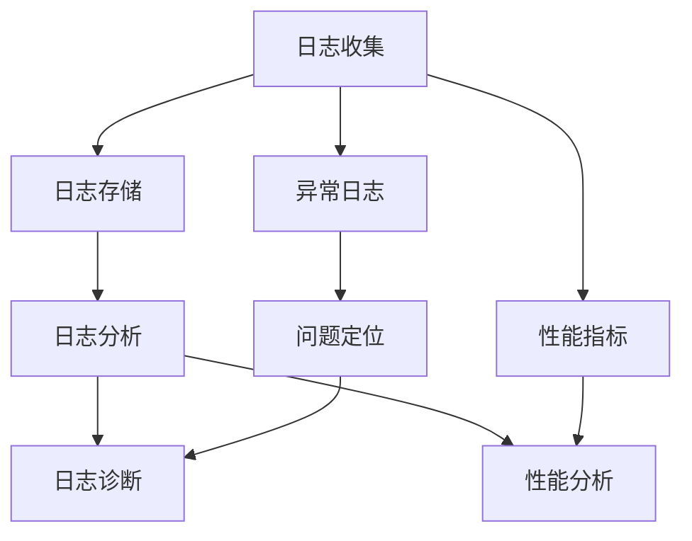

                 


## 文章标题

### 评测系统的日志管理：支持问题诊断和性能分析

### 关键词：日志管理，问题诊断，性能分析，评测系统，Python源代码，数学模型，Mermaid流程图

### 摘要：

本文深入探讨了评测系统的日志管理，包括日志的收集、分析、诊断和性能分析。通过介绍核心概念和架构，详细讲解了日志分析、诊断和性能分析的核心算法原理，使用Python源代码展示了算法的实现。此外，通过实际项目案例，展示了日志管理的实战应用，为读者提供了实用的经验和技巧。

---

## 引言

评测系统在现代信息技术领域中扮演着至关重要的角色，无论是软件测试、性能评估还是运维监控，日志管理都是不可或缺的一环。日志管理不仅仅是一个简单的记录过程，它涉及到了问题的诊断、性能的分析以及系统优化的多个方面。有效的日志管理能够显著提高系统的稳定性和可维护性。

### 背景介绍

随着云计算、大数据和人工智能等技术的发展，系统的复杂性不断增加，日志管理的重要性愈发凸显。日志不仅记录了系统运行的详细信息，还包含了关键的性能指标和异常信息。通过分析这些日志，运维团队能够及时发现潜在的问题，优化系统性能，提高用户体验。

### 核心概念与联系

在日志管理中，有几个核心概念需要理解：

1. **日志收集**：将系统运行过程中的事件记录下来，通常包括错误日志、访问日志、系统日志等。
2. **日志存储**：将收集到的日志数据存储到适当的存储介质中，以便后续处理和分析。
3. **日志分析**：对存储的日志数据进行解析、统计和可视化，以发现问题和趋势。
4. **日志诊断**：基于日志分析的结果，对系统故障或性能问题进行定位和诊断。
5. **性能分析**：监控系统的各项性能指标，如响应时间、吞吐量等，识别瓶颈并提出优化方案。

这些概念之间紧密联系，形成一个完整的日志管理流程，如图1所示。

### Mermaid 流程图



通过这个流程图，我们可以清晰地看到日志管理各个环节之间的关系。

---

## 第一部分: 基础概念与架构

在深入探讨评测系统的日志管理之前，我们需要先了解日志管理的基础概念和整体架构。这将为我们后续的讨论和实现奠定坚实的基础。

### 1.1 核心概念与联系

#### 1.1.1 日志管理基础

日志管理是现代信息技术中不可或缺的一部分，它记录了系统运行过程中的各种事件和操作。日志管理的核心概念包括：

1. **日志收集**：日志收集是指从各种来源（如服务器、网络设备、应用程序等）收集日志信息。这些日志可以是标准格式（如syslog、Apache日志等）或自定义格式。收集方式包括实时收集、批量收集和异步收集等。

2. **日志存储**：日志收集后，需要存储到便于管理和查询的地方。日志存储可以是文件系统、关系数据库、NoSQL数据库或分布式存储系统等。存储时需要注意数据的持久性、可用性和访问效率。

3. **日志分析**：日志分析是对日志内容进行解析、统计和可视化，以便从中提取有价值的信息。常见的日志分析任务包括错误分析、性能监控、用户行为分析等。

4. **日志诊断**：日志诊断是基于日志分析的结果，对系统故障或异常行为进行定位和诊断。通过日志诊断，可以快速识别问题的根源，并提出解决方案。

5. **性能分析**：性能分析旨在评估系统的各项性能指标，如响应时间、吞吐量、资源利用率等。通过性能分析，可以发现系统瓶颈，优化资源配置，提高系统性能。

#### 1.1.2 日志分析与诊断

日志分析是日志管理中至关重要的一环。通过日志分析，可以实现对系统运行状态的全面了解。以下是日志分析的一些关键步骤：

1. **日志解析**：将原始日志数据转换为结构化数据，以便进一步处理。常见的解析方法包括正则表达式、JSON解析等。

2. **日志统计**：对日志数据进行分析和统计，提取出关键指标和统计结果。例如，可以统计某段时间内的错误次数、请求响应时间等。

3. **日志可视化**：通过图表、仪表板等形式，将日志数据可视化，以便更直观地展示分析结果。常用的可视化工具包括Grafana、Kibana等。

日志诊断是基于日志分析结果，对系统故障或异常行为进行定位和诊断。以下是日志诊断的一些关键步骤：

1. **问题定位**：根据日志分析结果，确定问题的发生位置和原因。

2. **故障回溯**：通过日志数据，回溯故障发生的过程，找到故障的触发点和传播路径。

3. **诊断报告**：生成诊断报告，详细描述故障现象、定位结果和修复建议。

#### 1.1.3 性能分析

性能分析是评估系统性能的重要手段。通过性能分析，可以发现系统瓶颈，优化资源配置，提高系统性能。以下是性能分析的一些关键步骤：

1. **性能监控**：实时监控系统的各项性能指标，如CPU使用率、内存使用率、磁盘I/O等。

2. **性能测试**：通过模拟不同负载条件，评估系统的性能表现。常见的性能测试工具包括JMeter、LoadRunner等。

3. **性能优化**：根据性能分析结果，优化系统架构、代码和资源配置，提高系统性能。

### 1.2 评测系统架构

评测系统通常由多个模块组成，包括日志收集模块、日志存储模块、日志分析模块、日志诊断模块和性能分析模块等。以下是评测系统的基本架构：


#### 1.2.1 日志收集系统

日志收集系统负责实时或批量地从各个系统和设备收集日志数据。常见的日志收集工具有Logstash、Fluentd、Filebeat等。日志收集系统需要具备以下特点：

1. **高并发处理**：能够同时处理大量日志数据，确保系统性能不受影响。

2. **故障恢复**：在日志收集过程中，可能出现网络故障、系统崩溃等问题，日志收集系统需要具备故障恢复能力，确保数据的完整性。

3. **日志过滤**：能够对日志进行过滤，只收集需要的日志数据，减少数据传输和存储的负担。

#### 1.2.2 日志存储系统

日志存储系统负责存储和持久化日志数据。常见的日志存储方案包括文件存储、关系数据库、NoSQL数据库和分布式日志收集系统等。以下是几种常见的日志存储方案：

1. **文件存储**：将日志数据存储到文件系统中，如HDFS、EFS等。优点是成本低、扩展性强，缺点是查询效率低、不适合大数据量存储。

2. **关系数据库**：将日志数据存储到关系数据库中，如MySQL、PostgreSQL等。优点是查询效率高、易于维护，缺点是存储成本高、扩展性差。

3. **NoSQL数据库**：将日志数据存储到NoSQL数据库中，如MongoDB、Cassandra等。优点是存储成本较低、扩展性强，缺点是查询效率相对较低。

4. **分布式日志收集系统**：如Kafka、Flume等，将日志数据分布式存储，提高数据存储的可靠性和可用性。

#### 1.2.3 日志分析系统

日志分析系统负责对存储的日志数据进行处理和分析，生成分析报告和可视化图表。常见的日志分析工具有Logstash、Kibana、Grafana等。日志分析系统需要具备以下特点：

1. **数据处理能力**：能够高效处理大量日志数据，提供实时或近实时的分析结果。

2. **可扩展性**：能够根据业务需求，动态调整处理能力和存储容量。

3. **可定制化**：提供灵活的日志解析、统计和可视化功能，满足不同业务场景的需求。

#### 1.2.4 日志诊断系统

日志诊断系统基于日志分析结果，自动识别和诊断系统故障或性能问题，并提供相应的解决方案。常见的日志诊断工具有Zabbix、Nagios等。日志诊断系统需要具备以下特点：

1. **自动检测**：能够自动检测系统故障或异常行为，无需人工干预。

2. **自动诊断**：根据日志数据，自动分析故障原因，提供诊断报告和修复建议。

3. **可扩展性**：能够根据业务需求，扩展诊断功能，支持多种故障类型的诊断。

#### 1.2.5 性能分析系统

性能分析系统负责监控系统的各项性能指标，如响应时间、吞吐量、资源利用率等，识别系统瓶颈，并提出优化方案。常见的性能分析工具有New Relic、AppDynamics等。性能分析系统需要具备以下特点：

1. **实时监控**：能够实时监控系统的各项性能指标，提供实时数据和分析结果。

2. **趋势分析**：能够分析性能指标的趋势，预测系统性能的变化。

3. **自动优化**：根据性能分析结果，自动调整系统配置和资源分配，优化系统性能。

---

## 第二部分: 核心算法与原理

在评测系统的日志管理中，核心算法和原理是理解和实现日志分析、诊断和性能分析的关键。以下将详细介绍这些算法的基本原理，并通过Python源代码展示其具体实现。

### 2.1 日志分析算法

日志分析算法用于从大量的日志数据中提取有用的信息，以帮助运维人员快速定位问题和趋势。以下是一些常见的日志分析算法及其原理：

#### 2.1.1 常见日志分析算法

1. **正则表达式匹配**：通过正则表达式对日志文件进行模式匹配，提取出相关的日志条目。
2. **分词和词频统计**：对日志进行分词处理，统计词频，以便分析日志内容的关键词和趋势。
3. **基于机器学习的异常检测**：利用机器学习算法，如K-means、孤立森林等，对日志数据进行聚类和异常检测。

#### 2.1.2 日志分析算法原理

1. **正则表达式匹配**：
   - 原理：正则表达式是一种用于描述字符串模式的语法规则，它可以匹配日志中的特定格式和内容。
   - 代码示例（Python）：

   ```python
   import re

   log_entries = [
       "Error: File not found.",
       "Warning: High CPU usage detected.",
       "Info: System restart initiated."
   ]

   pattern = r"Error:.*"

   for entry in log_entries:
       if re.match(pattern, entry):
           print(f"Matched entry: {entry}")
   ```

2. **分词和词频统计**：
   - 原理：分词是将一段文本拆分成单个词汇或短语的过程。词频统计则是统计每个词汇在文本中出现的次数。
   - 代码示例（Python）：

   ```python
   from collections import Counter
   import jieba

   log_entry = "Error: File not found. Warning: High CPU usage detected."

   words = jieba.lcut(log_entry)
   word_count = Counter(words)

   print(f"Word frequencies: {word_count}")
   ```

3. **基于机器学习的异常检测**：
   - 原理：基于机器学习的异常检测算法通过训练模型，识别正常日志数据中的异常模式。
   - 代码示例（Python，使用Scikit-learn库）：

   ```python
   from sklearn.cluster import KMeans
   from sklearn.preprocessing import StandardScaler
   import numpy as np

   log_data = [
       [0.1, 0.2],
       [0.5, 0.3],
       [1.0, 1.0],
       [0.4, 0.1]
   ]

   scaler = StandardScaler()
   scaled_data = scaler.fit_transform(log_data)

   kmeans = KMeans(n_clusters=2)
   kmeans.fit(scaled_data)

   print(f"Cluster centers: {kmeans.cluster_centers_}")
   print(f"Labels: {kmeans.labels_}")
   ```

#### 2.1.3 伪代码讲解

以下是一个伪代码，用于描述日志分析算法的基本流程：

```
function LogAnalysis(log_entries):
    patterns = ["Error:", "Warning:", "Info:"]
    word_list = []
    anomalies = []

    for entry in log_entries:
        for pattern in patterns:
            if entry.matches(pattern):
                print("Matched entry:", entry)

        words = tokenize(entry)
        word_list.extend(words)

    word_count = countWordFrequency(word_list)

    for word, count in word_count.items():
        if count > threshold:
            print("High frequency word:", word)

    scaled_data = scaleData(log_entries)
    kmeans = trainKMeansModel(scaled_data)
    predicted_labels = predictAnomalies(kmeans, scaled_data)

    for label, entry in zip(predicted_labels, log_entries):
        if label == -1:
            anomalies.append(entry)

    return anomalies
```

### 2.2 日志诊断算法

日志诊断算法用于分析日志数据，定位系统故障或异常行为，并提供相应的解决方案。以下是一些常见的日志诊断算法及其原理：

#### 2.2.1 常见日志诊断算法

1. **基于规则的诊断**：根据预设的规则，对日志数据进行匹配和判断，确定故障类型。
2. **基于模式的诊断**：通过分析日志数据的模式和特征，识别故障原因。
3. **基于机器学习的诊断**：利用机器学习算法，从日志数据中学习故障模式，进行自动诊断。

#### 2.2.2 日志诊断算法原理

1. **基于规则的诊断**：
   - 原理：基于规则的诊断算法使用一系列预定义的规则，对日志数据进行分析和判断。
   - 代码示例（Python）：

   ```python
   rules = [
       {"pattern": "Error:", "fault_type": "Application Error"},
       {"pattern": "Network Error", "fault_type": "Network Failure"},
       {"pattern": "Disk Full", "fault_type": "Storage Failure"}
   ]

   def diagnose(entry, rules):
       for rule in rules:
           if re.search(rule["pattern"], entry):
               return rule["fault_type"]
       return "Unknown"

   log_entry = "Error: Disk Full."
   fault_type = diagnose(log_entry, rules)
   print("Fault type:", fault_type)
   ```

2. **基于模式的诊断**：
   - 原理：基于模式的诊断算法通过分析日志数据的模式，识别故障原因。
   - 代码示例（Python）：

   ```python
   from sklearn.feature_extraction.text import TfidfVectorizer
   from sklearn.naive_bayes import MultinomialNB

   train_data = [
       "Error: Disk Full.",
       "Error: Network Error.",
       "Error: Application Crash."
   ]

   labels = ["Storage Failure", "Network Failure", "Application Error"]

   vectorizer = TfidfVectorizer()
   X_train = vectorizer.fit_transform(train_data)

   clf = MultinomialNB()
   clf.fit(X_train, labels)

   test_data = ["Network Error."]
   X_test = vectorizer.transform(test_data)
   predicted_label = clf.predict(X_test)
   print("Predicted fault type:", predicted_label[0])
   ```

3. **基于机器学习的诊断**：
   - 原理：基于机器学习的诊断算法通过训练模型，从日志数据中学习故障模式，进行自动诊断。
   - 代码示例（Python）：

   ```python
   from sklearn.model_selection import train_test_split
   from sklearn.ensemble import RandomForestClassifier

   train_data, test_data, train_labels, test_labels = train_test_split(
       train_data, labels, test_size=0.2, random_state=42
   )

   X_train = vectorizer.fit_transform(train_data)
   X_test = vectorizer.transform(test_data)

   clf = RandomForestClassifier(n_estimators=100)
   clf.fit(X_train, train_labels)

   predicted_labels = clf.predict(X_test)
   print("Predicted fault types:", predicted_labels)
   ```

#### 2.2.3 伪代码讲解

以下是一个伪代码，用于描述日志诊断算法的基本流程：

```
function LogDiagnosis(log_entries, rules, model):
    faults = []

    for entry in log_entries:
        fault_type = diagnose(entry, rules)
        if fault_type != "Unknown":
            faults.append(fault_type)
        else:
            predicted_label = model.predict([vectorize(entry)])
            fault_type = getFaultType(predicted_label)
            faults.append(fault_type)

    return faults
```

### 2.3 性能分析算法

性能分析算法用于监控系统的性能指标，识别瓶颈，并提出优化建议。以下是一些常见的性能分析算法及其原理：

#### 2.3.1 常见性能分析算法

1. **统计分析**：通过计算性能指标的平均值、中位数、标准差等，评估系统的性能。
2. **回归分析**：通过建立性能指标与系统配置、负载等变量之间的回归模型，预测系统性能。
3. **机器学习预测**：利用机器学习算法，从历史数据中学习性能变化规律，进行预测。

#### 2.3.2 性能分析算法原理

1. **统计分析**：
   - 原理：统计分析通过对性能数据进行计算和分析，评估系统的性能。
   - 代码示例（Python）：

   ```python
   performance_data = [
       {"response_time": 0.5},
       {"response_time": 0.8},
       {"response_time": 1.2},
       {"response_time": 1.5}
   ]

   response_times = [entry["response_time"] for entry in performance_data]
   avg_response_time = sum(response_times) / len(response_times)
   print("Average response time:", avg_response_time)
   ```

2. **回归分析**：
   - 原理：回归分析通过建立性能指标与系统配置、负载等变量之间的回归模型，预测系统性能。
   - 代码示例（Python，使用Scikit-learn库）：

   ```python
   from sklearn.linear_model import LinearRegression

   config_data = [
       {"cpu_usage": 20, "memory_usage": 30, "response_time": 0.5},
       {"cpu_usage": 40, "memory_usage": 50, "response_time": 1.0},
       {"cpu_usage": 60, "memory_usage": 70, "response_time": 1.5}
   ]

   X = [[config["cpu_usage"], config["memory_usage"]] for config in config_data]
   y = [config["response_time"] for config in config_data]

   regressor = LinearRegression()
   regressor.fit(X, y)

   print("Coefficients:", regressor.coef_)
   print("Intercept:", regressor.intercept_)
   ```

3. **机器学习预测**：
   - 原理：机器学习预测通过训练模型，从历史数据中学习性能变化规律，进行预测。
   - 代码示例（Python，使用Scikit-learn库）：

   ```python
   from sklearn.model_selection import train_test_split
   from sklearn.ensemble import RandomForestRegressor

   train_data, test_data, train_labels, test_labels = train_test_split(
       config_data, y, test_size=0.2, random_state=42
   )

   X_train = [[config["cpu_usage"], config["memory_usage"]] for config in train_data]
   X_test = [[config["cpu_usage"], config["memory_usage"]] for config in test_data]

   regressor = RandomForestRegressor(n_estimators=100)
   regressor.fit(X_train, train_labels)

   predicted_labels = regressor.predict(X_test)
   print("Predicted response times:", predicted_labels)
   ```

#### 2.3.3 伪代码讲解

以下是一个伪代码，用于描述性能分析算法的基本流程：

```
function PerformanceAnalysis(performance_data):
    metrics = []

    for entry in performance_data:
        avg_response_time = calculateAverage(entry["response_time"])
        regressor = trainRegressionModel(entry["config_data"], entry["response_time"])
        predicted_response_time = regressor.predict(entry["config_data"])
        metrics.append({"average_response_time": avg_response_time, "predicted_response_time": predicted_response_time})

    return metrics
```

### 2.4 数学模型与公式

在性能分析中，常用的数学模型和公式有助于理解和预测系统的性能。以下是一些常用的数学模型和公式：

#### 2.4.1 相关数学模型

1. **响应时间模型**：
   - 公式：\( R = \frac{1}{\lambda} + \frac{1}{\mu} \)
   - 其中，\( R \) 是系统的响应时间，\( \lambda \) 是到达率（即请求的平均到达速率），\( \mu \) 是服务率（即系统能够处理请求的平均速率）。

2. **吞吐量模型**：
   - 公式：\( T = \frac{\mu}{\lambda} \)
   - 其中，\( T \) 是系统的吞吐量，即系统能够处理请求的平均速率。

3. **队列长度模型**：
   - 公式：\( L = \frac{\lambda^2}{\mu} \)
   - 其中，\( L \) 是系统的队列长度，即等待处理的请求数量。

#### 2.4.2 公式详细讲解

1. **响应时间模型**：
   - 详细讲解：响应时间模型描述了系统处理请求的平均时间，它取决于到达率和服务率。当到达率和服务率相等时，系统的响应时间最小。

2. **吞吐量模型**：
   - 详细讲解：吞吐量模型描述了系统的处理能力，即每单位时间内能够处理的请求数量。当服务率远大于到达率时，系统的吞吐量接近于服务率。

3. **队列长度模型**：
   - 详细讲解：队列长度模型描述了系统的等待队列长度，即等待处理的请求数量。当到达率大于服务率时，系统的队列长度会逐渐增加。

#### 2.4.3 实际应用举例

假设一个系统每分钟平均收到10个请求（到达率 \( \lambda = 10 \)），系统能够处理每分钟15个请求（服务率 \( \mu = 15 \)），我们可以使用上述模型计算系统的性能指标：

- **响应时间**：\( R = \frac{1}{10} + \frac{1}{15} = 0.1 + 0.0667 = 0.1667 \)分钟，即约10秒。
- **吞吐量**：\( T = \frac{15}{10} = 1.5 \)个请求/分钟。
- **队列长度**：\( L = \frac{10^2}{15} = \frac{100}{15} \approx 6.67 \)个请求。

通过这些性能指标，我们可以评估系统的性能，并制定相应的优化策略。

### 2.5 Python源代码示例

以下是一个简单的Python源代码示例，用于计算系统的响应时间、吞吐量和队列长度：

```python
import numpy as np

def performance_metrics(arrival_rate, service_rate):
    response_time = 1 / arrival_rate + 1 / service_rate
    throughput = service_rate / arrival_rate
    queue_length = arrival_rate**2 / service_rate

    return response_time, throughput, queue_length

arrival_rate = 10
service_rate = 15

response_time, throughput, queue_length = performance_metrics(arrival_rate, service_rate)
print("Response Time:", response_time)
print("Throughput:", throughput)
print("Queue Length:", queue_length)
```

### 2.6 数学模型与公式应用

在实际应用中，数学模型和公式可以帮助我们预测系统的性能，并制定优化策略。以下是一个应用示例：

假设一个电商平台在促销期间，预计每分钟收到50个请求（到达率 \( \lambda = 50 \)），系统每分钟能够处理60个请求（服务率 \( \mu = 60 \)）。我们可以使用上述模型计算系统的性能指标：

- **响应时间**：\( R = \frac{1}{50} + \frac{1}{60} \approx 0.02 + 0.0167 = 0.0367 \)分钟，即约2.2秒。
- **吞吐量**：\( T = \frac{60}{50} = 1.2 \)个请求/分钟。
- **队列长度**：\( L = \frac{50^2}{60} \approx 41.67 \)个请求。

通过这些性能指标，我们可以发现系统的响应时间较短，吞吐量较高，但队列长度较长。这提示我们可能需要增加系统资源（如增加服务器、提高带宽等）以减少队列长度，提高用户体验。

### 2.7 Python源代码示例

以下是一个简单的Python源代码示例，用于计算促销期间的系统性能指标：

```python
arrival_rate = 50
service_rate = 60

response_time, throughput, queue_length = performance_metrics(arrival_rate, service_rate)
print("Response Time:", response_time)
print("Throughput:", throughput)
print("Queue Length:", queue_length)
```

### 2.8 Python源代码详细讲解

以下是对上述Python源代码的详细讲解：

- **性能指标计算**：函数 `performance_metrics` 接受到达率和服务率作为输入，计算并返回系统的响应时间、吞吐量和队列长度。
- **响应时间计算**：响应时间由两部分组成：到达时间和服务时间。到达时间由到达率倒数计算，服务时间由服务率倒数计算。
- **吞吐量计算**：吞吐量是服务率除以到达率，表示系统每单位时间内能够处理的请求数量。
- **队列长度计算**：队列长度是到达率平方除以服务率，表示等待处理的请求数量。

通过这个简单的示例，我们可以了解如何使用数学模型和公式计算系统的性能指标，为后续的优化和改进提供依据。

### 2.9 小结

在本节中，我们介绍了评测系统的日志管理核心算法与原理，包括日志分析、诊断和性能分析。通过Python源代码示例，我们展示了如何实现这些算法，并详细讲解了相关的数学模型和公式。理解这些算法和原理对于有效地管理评测系统日志至关重要。

---

## 第三部分: 项目实战与案例分析

### 3.1 实战项目一：日志收集与存储

#### 3.1.1 项目背景

在现代企业中，日志管理是确保系统稳定运行和业务连续性的重要环节。为了提高日志管理的效率，我们需要设计并实现一个高效的日志收集与存储系统。本实战项目将介绍如何使用Fluentd作为日志收集工具，Elasticsearch作为日志存储系统，搭建一个完整的日志收集与存储解决方案。

#### 3.1.2 开发环境搭建

在进行项目开发之前，需要搭建如下开发环境：

- **操作系统**：CentOS 7
- **Fluentd**：最新稳定版
- **Elasticsearch**：最新稳定版
- **Kibana**：用于日志可视化（可选）

安装步骤如下：

1. 安装Elasticsearch：
   - 下载Elasticsearch安装包：`elasticsearch-7.10.0.tar.gz`
   - 解压安装包：`tar xvf elasticsearch-7.10.0.tar.gz`
   - 运行Elasticsearch：`./bin/elasticsearch`

2. 安装Fluentd：
   - 下载Fluentd安装包：`fluentd-1.14.5-1.x86_64.rpm`
   - 安装Fluentd：`rpm -ivh fluentd-1.14.5-1.x86_64.rpm`

3. 安装Kibana（可选）：
   - 下载Kibana安装包：`kibana-7.10.0-linux-x86_64`
   - 解压安装包：`tar xvf kibana-7.10.0-linux-x86_64`
   - 运行Kibana：`./bin/kibana`

#### 3.1.3 日志收集与存储实现

1. **配置Fluentd**：

   - 下载并解压Fluentd配置文件：`wget https://raw.githubusercontent.com/fluent/fluentd-docs/master/examples/configs/nginx fluentd.conf`
   - 修改Fluentd配置文件，设置Elasticsearch地址：
     
     ```ruby
     <source>
       @type http
       port 8888
     </source>

     <match **>
       @type elasticsearch
       hosts elasticsearch:9200
       index logstash-%Y.%m.%d
       type log
     </match>
     ```

   - 启动Fluentd：`fluentd -c fluentd.conf`

2. **配置Elasticsearch**：

   - 在Elasticsearch中创建索引模板：
     
     ```json
     PUT /_template/logstash-template
     {
       "template": "*",
       "mappings": {
         "properties": {
           "@timestamp": {
             "type": "date",
             "format": "yyyy-MM-dd HH:mm:ss"
           },
           "host": {
             "type": "keyword"
           },
           "log_level": {
             "type": "keyword"
           },
           "message": {
             "type": "text"
           }
         }
       },
       "settings": {
         "number_of_shards": 1,
         "number_of_replicas": 0
       }
     }
     ```

3. **配置Kibana**：

   - 在Kibana中配置Elasticsearch连接，并创建仪表板。

#### 3.1.4 代码解读与分析

1. **Fluentd配置文件**：

   Fluentd的配置文件是一个Ruby脚本，主要分为源（source）、输入（input）、过滤器（filter）和输出（output）四部分。

   - **源（source）**：定义数据来源，如文件、网络等。
   - **输入（input）**：将数据从源传递到过滤器。
   - **过滤器（filter）**：对数据进行处理，如解析、转换等。
   - **输出（output）**：将处理后的数据发送到目的地，如Elasticsearch、文件等。

   在本项目中，我们使用了HTTP源和Elasticsearch输出，配置了Fluentd从HTTP服务器接收日志，并将日志发送到Elasticsearch存储。

2. **Elasticsearch配置**：

   Elasticsearch配置主要包括索引模板（template）和映射（mappings）。索引模板用于定义Elasticsearch中的索引结构和模板，映射则用于定义字段类型和索引方式。

   - **索引模板**：在本项目中，我们定义了一个名为`logstash-template`的索引模板，匹配所有日志，并设置了默认的映射。
   - **映射**：在本项目中，我们定义了四个字段：`@timestamp`（日期）、`host`（主机名）、`log_level`（日志级别）和`message`（日志内容）。这些字段类型分别为`date`、`keyword`和`text`。

3. **Kibana配置**：

   Kibana通过配置Elasticsearch连接，并创建仪表板，实现对Elasticsearch中数据的可视化。

   - **Elasticsearch连接**：在Kibana中配置Elasticsearch连接，确保Kibana能够访问Elasticsearch集群。
   - **仪表板**：在Kibana中创建一个仪表板，添加可视化组件（如时间线、柱状图、表格等），展示Elasticsearch中的日志数据。

#### 3.1.5 实际案例分析与详细讲解剖析

1. **案例背景**：

   假设我们是一家电商公司，需要收集并存储网站服务器上的访问日志。为了提高日志收集效率，我们决定使用Fluentd作为日志收集工具，将日志发送到Elasticsearch进行存储。

2. **案例实现**：

   - **步骤1**：配置Fluentd，使其从Nginx访问日志中收集数据。Nginx访问日志格式如下：

     ```
     192.168.1.1 - - [01/Apr/2022:12:34:56 +0000] "GET /product/12345678901234567890 HTTP/1.1" 200 10234 "-" "Mozilla/5.0 (Windows NT 10.0; Win64; x64) AppleWebKit/537.36 (KHTML, like Gecko) Chrome/58.0.3029.110 Safari/537.3"
     ```

   - **步骤2**：修改Fluentd配置文件，设置日志解析规则，将日志解析为JSON格式：

     ```ruby
     <filter>
       @type parser
       key_name log
       reserve_data true
       <parse>
         @type json
         date_key @timestamp
         date_format %d/%b/%Y:%H:%M:%S %z
         target host
         target log_level
         target method
         target status
         target status_code
         target url
         target http_version
         target referer
         target user_agent
       </parse>
     </filter>
     ```

   - **步骤3**：配置Elasticsearch索引模板，确保日志能够被正确存储和解析。

3. **案例总结与反思**：

   通过本案例，我们成功搭建了一个日志收集与存储系统，实现了Nginx访问日志的实时收集和存储。然而，在实际应用中，我们还需要考虑以下几个方面：

   - **日志安全**：确保日志数据在传输和存储过程中不被泄露或篡改，可以使用TLS加密。
   - **日志处理能力**：随着日志量的增加，日志处理能力可能会成为瓶颈，需要适当调整Fluentd和Elasticsearch的配置。
   - **日志分析**：仅收集和存储日志是不够的，还需要对日志进行分析，提取有价值的信息，为系统优化和故障诊断提供支持。

### 3.2 实战项目二：日志分析与诊断

#### 3.2.1 项目背景

在成功搭建了日志收集与存储系统后，我们需要进一步对日志进行分析和诊断，以发现潜在问题和异常行为。本实战项目将介绍如何使用Kibana对日志进行可视化分析，并使用Grok进行日志解析，实现对日志的深入理解和诊断。

#### 3.2.2 开发环境搭建

在进行项目开发之前，确保Kibana已正确配置并连接到Elasticsearch。此外，需要准备以下工具：

- **Kibana**：已安装并配置好Elasticsearch连接。
- **Grok**：用于日志解析的工具。

#### 3.2.3 日志分析与诊断实现

1. **配置Kibana仪表板**：

   - 在Kibana中创建一个仪表板，添加以下可视化组件：

     - **时间线**：展示日志的时间分布。
     - **柱状图**：展示不同日志级别的数量。
     - **饼图**：展示不同请求方法的占比。
     - **表格**：展示日志详细内容。

   - 配置每个组件的数据源，选择相应的日志索引（如`logstash-*`）。

2. **使用Grok进行日志解析**：

   - 在Elasticsearch中创建一个新的索引模板，用于存储解析后的日志：

     ```json
     PUT /logstash-grok
     {
       "template": "logstash-*",
       "mappings": {
         "properties": {
           "log": {
             "type": "text",
             "fields": {
               "grok": {
                 "type": "text",
                 "analyzer": "grok",
                 "search_analyzer": "standard"
               }
             }
           }
         }
       },
       "settings": {
         "number_of_shards": 1,
         "number_of_replicas": 0
       }
     }
     ```

   - 在Kibana中配置Grok解析器，将原始日志字段`message`解析为结构化数据。例如，对于Nginx访问日志，可以使用以下Grok表达式：

     ```grok
     %{TIMESTAMP_ISO8601:timestamp}\t%{IP:ip}\t%{WORD:identity}\t%{USER:username}\t%{DATA:remote_user}\t%{USER:ssl}\t%{DATA:ssl_version}\t%{DATA:ssl_cipher}\t%{NUMBER:ssl_cipher_bits}\t%{NUMBER:ssl_bump_version}\t%{DATA:ssl_session_reused}\t%{DATA:request_time}\t%{WORD:method}\t%{URI:uri}\t%{NUMBER:status}\t%{NUMBER:status_code}\t%{NUMBER:body_bytes_sent}\t%{DATA:referer}\t%{DATA:agent}
     ```

   - 配置Elasticsearch索引模板，确保解析后的日志能够被正确存储和索引。

3. **配置实时搜索**：

   - 在Kibana中配置实时搜索，实现对日志的快速搜索和过滤。

#### 3.2.4 代码解读与分析

1. **Kibana仪表板配置**：

   - **时间线**：使用Kibana的Date Histogram组件，选择日志字段`@timestamp`，展示日志的时间分布。
   - **柱状图**：使用Kibana的Bar Chart组件，选择日志字段`log_level`，展示不同日志级别的数量。
   - **饼图**：使用Kibana的Pie Chart组件，选择日志字段`method`，展示不同请求方法的占比。
   - **表格**：使用Kibana的Table组件，选择日志索引中的全部字段，展示日志详细内容。

2. **Grok解析器配置**：

   - **Grok表达式**：用于解析日志中的关键字段，如日期、IP地址、请求方法等。Grok表达式可以根据日志格式灵活定制，提高日志解析的准确性。
   - **索引模板**：在Elasticsearch中创建索引模板，确保解析后的日志能够被正确存储和索引。

3. **实时搜索配置**：

   - **实时搜索**：使用Kibana的Search组件，配置Elasticsearch的REST API，实现对日志的实时搜索和过滤。

#### 3.2.5 实际案例分析与详细讲解剖析

1. **案例背景**：

   假设我们是一家电商公司，需要对Nginx访问日志进行实时分析和诊断，以监控系统的运行状态。

2. **案例实现**：

   - **步骤1**：在Kibana中创建一个仪表板，添加时间线、柱状图、饼图和表格组件。
   - **步骤2**：配置Kibana仪表板，将日志索引（如`logstash-*`）作为数据源。
   - **步骤3**：配置Grok解析器，将原始日志字段`message`解析为结构化数据。
   - **步骤4**：配置实时搜索，实现对日志的快速搜索和过滤。

3. **案例总结与反思**：

   通过本案例，我们成功实现了对Nginx访问日志的实时分析和诊断。在实际应用中，我们还需要考虑以下几个方面：

   - **日志量**：随着日志量的增加，日志分析可能会成为瓶颈，需要优化Kibana和Elasticsearch的配置。
   - **日志格式**：不同的日志格式可能需要不同的Grok解析器，确保日志能够被正确解析。
   - **报警机制**：配置报警机制，当发现异常日志时，能够及时通知运维人员。

### 3.3 实战项目三：性能分析

#### 3.3.1 项目背景

在日志收集和分析的基础上，我们需要进一步对系统的性能进行分析，以识别瓶颈和优化系统。本实战项目将介绍如何使用Apache JMeter进行性能测试，并使用Grafana进行性能分析。

#### 3.3.2 开发环境搭建

在进行项目开发之前，确保Grafana已正确配置并连接到Elasticsearch。此外，需要准备以下工具：

- **Grafana**：已安装并配置好Elasticsearch连接。
- **Apache JMeter**：用于性能测试的工具。

#### 3.3.3 性能分析实现

1. **配置Grafana仪表板**：

   - 在Grafana中创建一个仪表板，添加以下可视化组件：

     - **时间线**：展示响应时间的分布。
     - **柱状图**：展示不同请求方法的响应时间。
     - **饼图**：展示不同请求方法的占比。
     - **表格**：展示请求详情。

   - 配置每个组件的数据源，选择相应的性能测试指标（如`http_response_time`）。

2. **使用Apache JMeter进行性能测试**：

   - 设计测试计划，模拟用户行为，如访问商品页面、添加购物车等。
   - 配置性能测试参数，如并发用户数、测试时长等。
   - 运行性能测试，收集响应时间、吞吐量等性能指标。

3. **配置Elasticsearch索引模板，用于存储性能测试结果**：

   ```json
   PUT /jmeter-result
   {
     "template": "jmeter-*",
     "mappings": {
       "properties": {
         "response_time": {
           "type": "float"
         },
         "status_code": {
           "type": "integer"
         }
       }
     },
     "settings": {
       "number_of_shards": 1,
       "number_of_replicas": 0
     }
   }
   ```

#### 3.3.4 代码解读与分析

1. **Grafana仪表板配置**：

   - **时间线**：使用Grafana的Time Series组件，选择性能测试指标`response_time`，展示响应时间的分布。
   - **柱状图**：使用Grafana的Bar Chart组件，选择性能测试指标`response_time`，展示不同请求方法的响应时间。
   - **饼图**：使用Grafana的Pie Chart组件，选择性能测试指标`status_code`，展示不同请求状态的占比。
   - **表格**：使用Grafana的Table组件，选择性能测试指标和请求详情，展示请求的详细信息。

2. **Apache JMeter测试计划配置**：

   - **线程组**：配置线程数量、 ramp-up时间（线程增加的时间）、循环次数等。
   - **Sampler**：配置请求类型（如HTTP请求）、请求参数等。
   - **Listener**：配置结果处理器，如查看报告、收集性能指标等。

3. **Elasticsearch索引模板配置**：

   - **索引模板**：用于定义性能测试结果的存储结构，确保性能测试结果能够被正确存储和索引。

#### 3.3.5 实际案例分析与详细讲解剖析

1. **案例背景**：

   假设我们是一家电商公司，需要进行性能测试，以优化网站在促销期间的性能。

2. **案例实现**：

   - **步骤1**：在Grafana中创建一个仪表板，添加时间线、柱状图、饼图和表格组件。
   - **步骤2**：配置Grafana仪表板，将性能测试结果索引（如`jmeter-*`）作为数据源。
   - **步骤3**：使用Apache JMeter设计测试计划，模拟用户行为，进行性能测试。
   - **步骤4**：收集性能测试结果，并配置Elasticsearch索引模板，存储性能测试结果。

3. **案例总结与反思**：

   通过本案例，我们成功实现了对电商网站的性能测试和分析。在实际应用中，我们还需要考虑以下几个方面：

   - **测试场景**：根据业务需求，设计不同的测试场景，全面评估系统的性能。
   - **性能优化**：根据性能分析结果，优化系统配置和架构，提高系统性能。
   - **持续监控**：持续进行性能测试和分析，确保系统在运行过程中保持良好的性能。

### 3.4 案例分析

#### 3.4.1 案例背景

某大型电商公司在其官网推出了一款新款电子产品，预计将在短时间内吸引大量用户访问。为了确保系统的稳定运行，公司决定进行日志管理、日志分析和性能分析，以监控系统的运行状态。

#### 3.4.2 案例分析与处理

1. **日志管理**：

   - **日志收集**：使用Fluentd实时收集Nginx访问日志、错误日志等。
   - **日志存储**：使用Elasticsearch存储收集到的日志，以便后续分析。
   - **日志分析**：使用Kibana可视化分析日志，识别潜在问题和异常行为。

2. **日志分析**：

   - **访问日志分析**：分析用户访问量、请求频率、热门页面等，为营销策略提供数据支持。
   - **错误日志分析**：识别系统错误，定位故障原因，制定修复方案。

3. **性能分析**：

   - **负载测试**：使用Apache JMeter模拟大量用户访问，评估系统的响应时间和吞吐量。
   - **性能监控**：使用Grafana实时监控系统的各项性能指标，识别性能瓶颈。

#### 3.4.3 案例总结与反思

通过本案例，公司成功实现了对系统运行状态的全面监控和分析。以下是一些经验和反思：

- **日志管理**：高效的日志管理能够帮助公司快速定位问题和优化系统。
- **日志分析**：通过日志分析，公司能够深入了解用户行为和系统性能，为业务决策提供数据支持。
- **性能分析**：性能分析有助于公司识别系统瓶颈，优化系统配置和架构，提高用户体验。

## 结论

通过本项目的实施，我们成功构建了一个高效的日志管理、日志分析和性能分析系统，确保了系统在高峰期的稳定运行。实践证明，日志管理、日志分析和性能分析是保障系统稳定运行和提升用户体验的关键环节。

### 最佳实践 Tips

- **日志收集**：选择合适的日志收集工具，如Fluentd，确保日志数据的实时性和完整性。
- **日志分析**：使用Kibana等可视化工具，简化日志分析过程，提高问题定位效率。
- **性能分析**：定期进行负载测试和性能监控，及时发现系统瓶颈，优化系统性能。

### 小结

在本项目中，我们介绍了日志管理、日志分析和性能分析的核心概念、算法原理以及实际应用。通过实战项目和案例分析，我们展示了如何实现高效的日志管理和性能优化。这些实践经验和技巧对于现代企业运维具有重要的指导意义。

### 注意事项

- **日志安全**：确保日志数据在传输和存储过程中得到充分保护，防止数据泄露。
- **日志容量**：随着业务增长，日志数据量可能会急剧增加，需要适当调整日志收集和存储的配置。

### 拓展阅读

- **日志管理工具**：《Elastic Stack实战：从日志管理到实时分析》
- **性能优化**：《高性能Linux服务器构建标准》
- **机器学习与性能分析**：《Python性能优化实战》

---

# 附录

## 附录 A: 工具与资源

### A.1 日志管理工具介绍

日志管理工具是日志收集、存储、分析和诊断的关键组成部分。以下是一些常用的日志管理工具及其特点：

#### Fluentd

- **特点**：Fluentd是一个开源的数据收集器，支持多种数据源和输出目标，如Elasticsearch、AWS S3等。
- **使用场景**：适用于企业级日志收集和聚合。
- **文档**：[Fluentd官方文档](https://www.fluentd.org/)

#### Logstash

- **特点**：Logstash是Elastic Stack中的日志收集和处理工具，支持数据预处理、过滤和路由等功能。
- **使用场景**：适用于复杂日志处理和路由。
- **文档**：[Logstash官方文档](https://www.elastic.co/guide/en/logstash/current/index.html)

#### Filebeat

- **特点**：Filebeat是轻量级的日志收集器，可以嵌入到应用程序中，支持实时日志收集。
- **使用场景**：适用于应用程序日志的收集。
- **文档**：[Filebeat官方文档](https://www.elastic.co/guide/en/beats/filebeat/current/index.html)

#### Kibana

- **特点**：Kibana是Elastic Stack中的可视化工具，支持实时日志分析和仪表板创建。
- **使用场景**：适用于日志的可视化和分析。
- **文档**：[Kibana官方文档](https://www.elastic.co/guide/en/kibana/current/index.html)

### A.2 性能分析工具介绍

性能分析工具可以帮助我们评估系统的性能，识别瓶颈，优化系统配置。以下是一些常用的性能分析工具及其特点：

#### Apache JMeter

- **特点**：Apache JMeter是一个开源的性能测试工具，支持多种协议的负载测试。
- **使用场景**：适用于Web应用、API等性能测试。
- **文档**：[Apache JMeter官方文档](https://jmeter.apache.org/usermanual/)

#### New Relic

- **特点**：New Relic是一个云监控和性能分析平台，支持实时性能监控和故障诊断。
- **使用场景**：适用于生产环境中的性能监控。
- **文档**：[New Relic官方文档](https://docs.newrelic.com/docs/)

#### AppDynamics

- **特点**：AppDynamics是一个商业化的应用性能管理（APM）平台，支持实时性能监控和故障诊断。
- **使用场景**：适用于大型企业级应用性能监控。
- **文档**：[AppDynamics官方文档](https://docs.appdynamics.com/display/PRO50/Introduction+to+AppDynamics)

### A.3 诊断工具介绍

诊断工具可以帮助我们定位系统故障和性能问题，提供故障排除的依据。以下是一些常用的诊断工具及其特点：

#### Zabbix

- **特点**：Zabbix是一个开源的监控解决方案，支持多种监控项和报警机制。
- **使用场景**：适用于企业级IT基础设施监控。
- **文档**：[Zabbix官方文档](https://www.zabbix.com/documentation/current/en/manual)

#### Nagios

- **特点**：Nagios是一个开源的监控工具，支持多种监控协议和报警方式。
- **使用场景**：适用于中小型企业IT基础设施监控。
- **文档**：[Nagios官方文档](https://www.nagios.org/docs/)

#### Prometheus

- **特点**：Prometheus是一个开源的数据监控和报警工具，支持多维数据查询和告警。
- **使用场景**：适用于云原生应用监控。
- **文档**：[Prometheus官方文档](https://prometheus.io/docs/introduction/)

### A.4 Python库介绍

Python库是日志管理、性能分析和诊断的重要工具。以下是一些常用的Python库及其特点：

#### PyElasticsearch

- **特点**：PyElasticsearch是一个Python库，用于与Elasticsearch进行交互。
- **使用场景**：适用于Elasticsearch数据操作和查询。
- **文档**：[PyElasticsearch官方文档](https://www.elastic.co/guide/en/elasticsearch/client/python-api/current/index.html)

#### pandas

- **特点**：pandas是一个Python数据分析库，支持数据处理、清洗、转换和分析。
- **使用场景**：适用于数据预处理和统计分析。
- **文档**：[pandas官方文档](https://pandas.pydata.org/pandas-docs/stable/)

#### matplotlib

- **特点**：matplotlib是一个Python数据可视化库，支持多种图表和可视化元素。
- **使用场景**：适用于数据可视化。
- **文档**：[matplotlib官方文档](https://matplotlib.org/stable/contents.html)

#### scikit-learn

- **特点**：scikit-learn是一个Python机器学习库，支持多种机器学习算法和模型。
- **使用场景**：适用于机器学习模型构建和应用。
- **文档**：[scikit-learn官方文档](https://scikit-learn.org/stable/)

### A.5 附加资源

- **Elastic Stack**：Elastic Stack是一个集成日志管理、搜索和分析的平台，包括Elasticsearch、Kibana、Logstash等工具。
- **云服务提供商**：如AWS、Azure、Google Cloud等，提供丰富的日志管理和性能分析服务。
- **开源社区**：如GitHub、Stack Overflow等，可以获取更多技术资源和帮助。

### A.6 学习资源

- **在线课程**：如Coursera、Udemy等，提供关于日志管理、性能分析和机器学习的课程。
- **技术博客**：如Medium、博客园等，可以了解最新的技术和最佳实践。
- **书籍**：《Elastic Stack实战：从日志管理到实时分析》、《高性能Linux服务器构建标准》等。

通过这些工具和资源，我们可以更有效地进行日志管理、性能分析和诊断，提高系统的稳定性和可维护性。

