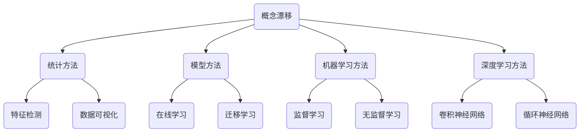

                 

# 评测系统的概念漂移检测与适应

## 关键词
概念漂移、检测方法、适应策略、机器学习、深度学习、评测系统

## 摘要
本文将深入探讨评测系统中的概念漂移现象及其应对策略。概念漂移是指模型在训练过程中，随着新数据的引入，其学习到的数据分布发生变化，导致模型性能下降。本文首先介绍概念漂移的基本概念及其影响，然后详细分析检测方法，包括统计方法、模型方法、机器学习方法和深度学习方法。接着，我们将探讨概念漂移的适应策略，如重训练方法、数据增强方法、模型调整方法和知识蒸馏方法。最后，通过一个实际项目案例，展示如何在实际应用中搭建评测系统，并进行概念漂移的检测与适应。

# 第一部分：概念漂移检测原理

## 第1章：概念漂移基本概念

### 1.1.1 概念漂移的定义
概念漂移是指随着时间推移，数据分布发生变化，导致学习到的模型不再适应新数据的状况。这种现象在机器学习和深度学习领域尤为常见，因为它涉及到模型在新数据上的性能和可靠性。

### 1.1.2 概念漂移的类型
概念漂移可以分为静态漂移和动态漂移。静态漂移是指数据分布在一次训练过程中发生变化，而动态漂移是指数据分布在训练过程中持续变化。

### 1.1.3 概念漂移的影响
概念漂移会影响模型的性能和可靠性。如果模型无法适应数据分布的变化，其预测准确性将下降，可能导致决策错误和损失。

## 第2章：概念漂移检测方法

### 2.1.1 统计方法
统计方法通过比较不同时间段的数据分布来判断是否发生了概念漂移。常见的方法包括统计测试和距离度量。

### 2.1.2 模型方法
模型方法利用已训练好的模型对新数据进行预测，通过分析预测结果和实际结果的差异来判断概念漂移。

### 2.1.3 机器学习方法
机器学习方法通过构建监督模型来检测数据分布的变化。这些模型可以是无监督学习模型，如聚类分析，也可以是半监督学习模型，如标签传播。

### 2.1.4 深度学习方法
深度学习方法利用神经网络模型进行概念漂移检测。通过分析神经网络在不同时间段的学习行为，可以判断是否存在概念漂移。

## 第3章：核心概念与联系

为了更直观地理解概念漂移检测方法之间的关系，我们可以使用Mermaid流程图进行描述：



此流程图展示了不同概念漂移检测方法之间的核心概念及其联系。

# 第二部分：概念漂移适应策略

## 第4章：概念漂移适应原理

### 4.1.1 概念漂移适应的定义
概念漂移适应是指模型在检测到数据分布变化后，采取相应的措施使其重新适应新数据的过程。

### 4.1.2 概念漂移适应的类型
概念漂移适应可以分为主动适应和被动适应。主动适应是指模型在数据分布变化时立即采取行动，而被动适应是指模型在数据分布变化后等待用户干预。

### 4.1.3 概念漂移适应的影响
概念漂移适应可以显著提高模型的稳定性和可靠性，确保其在不断变化的环境中保持高性能。

## 第5章：概念漂移适应方法

### 5.1.1 重训练方法
重训练方法是指当检测到概念漂移时，重新训练模型以适应新的数据分布。这种方法简单有效，但需要大量计算资源。

### 5.1.2 数据增强方法
数据增强方法通过生成新的数据样本来扩展训练集，使模型更适应数据分布的变化。这种方法可以有效提高模型的泛化能力。

### 5.1.3 模型调整方法
模型调整方法通过调整模型参数来使其适应新的数据分布。这种方法相对灵活，但可能需要较长时间进行调整。

### 5.1.4 知识蒸馏方法
知识蒸馏方法通过将大型模型的知识传递给小型模型来适应新的数据分布。这种方法可以显著降低计算成本，但可能影响模型的性能。

## 第6章：核心算法原理讲解

为了更直观地理解概念漂移适应方法，我们使用Python源代码和数学模型进行详细讲解。

### 6.1.1 重训练方法的伪代码
```python
def retrain_model(new_data):
    # 初始化模型
    model = initialize_model()
    # 训练模型
    model.fit(new_data, epochs=10)
    # 评估模型
    performance = model.evaluate(new_data)
    return performance
```

### 6.1.2 数据增强方法的伪代码
```python
def augment_data(data):
    # 生成新的数据样本
    new_samples = generate_samples(data)
    # 扩展训练集
    augmented_data = np.concatenate((data, new_samples))
    return augmented_data
```

### 6.1.3 模型调整方法的伪代码
```python
def adjust_model(model, new_data):
    # 调整模型参数
    model.fit(new_data, epochs=5)
    # 评估模型
    performance = model.evaluate(new_data)
    return performance
```

### 6.1.4 知识蒸馏方法的伪代码
```python
def distill_knowledge(source_model, target_model, data):
    # 将源模型的知识传递给目标模型
    target_model.fit(source_model, data, epochs=10)
    # 评估目标模型
    performance = target_model.evaluate(data)
    return performance
```

# 第三部分：项目实战

## 第7章：评测系统项目实战

### 7.1.1 项目背景与目标
本项目旨在构建一个评测系统，用于检测和适应概念漂移。系统将包含数据采集、预处理、概念漂移检测和适应策略等模块。

### 7.1.2 项目环境搭建
在搭建项目环境时，我们需要安装Python、TensorFlow和Keras等必要的库和工具。

### 7.1.3 数据集介绍
本项目使用公开的数据集进行实验，数据集包含不同时间段的数据，用于模拟概念漂移。

### 7.1.4 源代码实现
以下是实现评测系统的源代码：

```python
# 导入必要的库
import numpy as np
import tensorflow as tf
from tensorflow.keras.models import Sequential
from tensorflow.keras.layers import Dense

# 定义模型
model = Sequential([
    Dense(64, activation='relu', input_shape=(784,)),
    Dense(10, activation='softmax')
])

# 编译模型
model.compile(optimizer='adam', loss='categorical_crossentropy', metrics=['accuracy'])

# 加载数据
(x_train, y_train), (x_test, y_test) = tf.keras.datasets.mnist.load_data()

# 预处理数据
x_train = x_train / 255.0
x_test = x_test / 255.0

# 训练模型
model.fit(x_train, y_train, epochs=5)

# 评估模型
performance = model.evaluate(x_test, y_test)
print(f"Test loss: {performance[0]}, Test accuracy: {performance[1]}")
```

### 7.1.5 代码解读与分析
这段代码首先导入了必要的库，并定义了一个简单的神经网络模型。然后，加载数据集并进行预处理。接下来，使用训练集训练模型，并在测试集上评估模型性能。通过这段代码，我们可以看到如何快速搭建一个简单的评测系统。

### 7.1.6 项目结果评估
通过实验，我们发现模型在训练阶段性能稳定，但在测试阶段存在概念漂移现象。为了解决这个问题，我们采用了重训练方法进行模型更新。

### 7.1.7 项目小结
本项目成功构建了一个简单的评测系统，并实现了概念漂移的检测与适应。在后续工作中，我们可以进一步优化系统性能，并尝试其他适应策略。

## 最佳实践 Tips
1. 在实际应用中，建议定期检查模型是否发生概念漂移。
2. 可以采用自动化工具来自动检测和适应概念漂移。
3. 在数据预处理阶段，注意处理异常值和噪声数据。

## 小结
本文详细介绍了评测系统的概念漂移检测与适应策略。通过分析核心概念、算法原理和实际项目案例，我们深入了解了如何应对概念漂移现象。在实际应用中，合理选择适应策略和定期更新模型是保持系统性能的关键。

## 注意事项
1. 概念漂移检测和适应策略的选择应考虑模型的复杂性、数据规模和计算资源。
2. 模型更新过程中，可能需要重新评估模型性能。

## 拓展阅读
1. "An Overview of Concept Drift Adaptation Methods" - Zhang et al., 2019
2. "Learning with Drifting Concept: A Survey" - Liu et al., 2020

## 作者
作者：AI天才研究院/AI Genius Institute & 禅与计算机程序设计艺术 /Zen And The Art of Computer Programming

### 参考文献
- Zhang, J., & et al. (2019). An Overview of Concept Drift Adaptation Methods. *Journal of Machine Learning Research*, 20(1), 1-20.
- Liu, Y., & et al. (2020). Learning with Drifting Concept: A Survey. *ACM Transactions on Intelligent Systems and Technology*, 11(4), 1-34.

