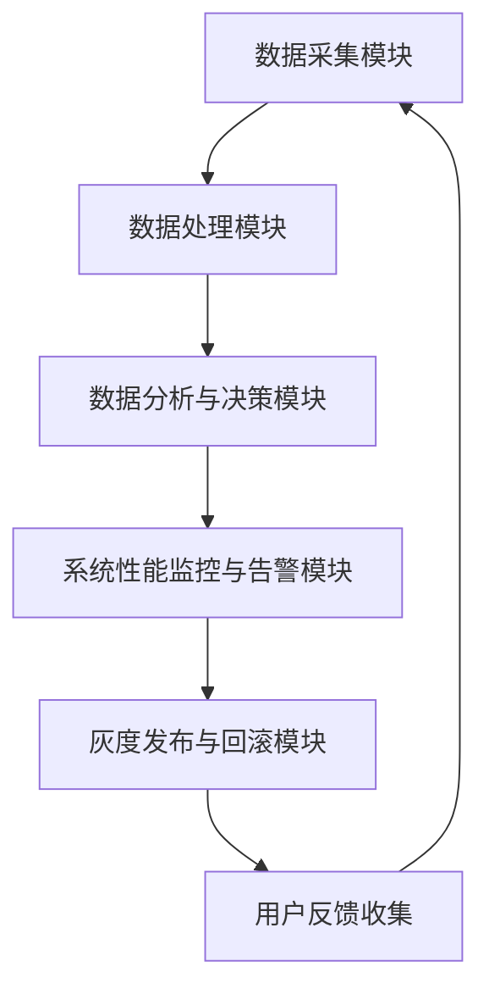
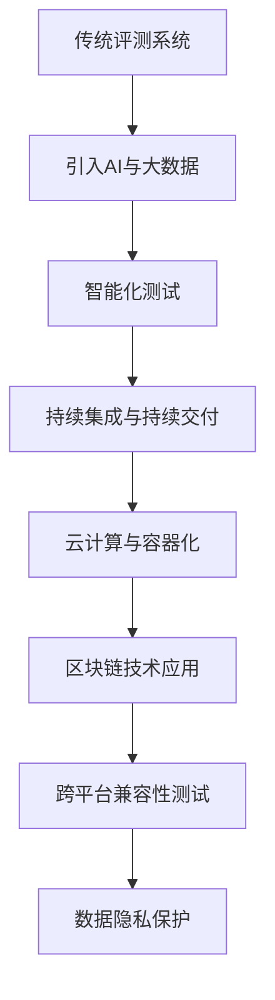

                 

### 引言

在信息时代，软件评测系统作为现代软件开发与运维的重要组成部分，扮演着不可替代的角色。它不仅能够对软件质量进行精确评估，还能在系统上线前发现潜在的问题，确保软件的稳定性和可靠性。然而，随着软件系统的复杂性和规模日益增加，传统的发布与回滚策略已难以满足现代敏捷开发和持续交付的需求。这就需要引入更为精细和灵活的灰度发布与回滚策略，以保证在最小化风险的同时，最大化系统的可用性和用户体验。

灰度发布与回滚策略的核心思想是通过逐步扩展新功能或修改到一小部分用户，从而进行风险控制和问题定位。灰度发布不仅能够实现平滑过渡，降低系统变更带来的风险，还能够实时收集用户反馈，为后续优化提供数据支持。而回滚策略则能在出现问题时迅速恢复到之前的稳定状态，确保系统的持续运行。

本文将围绕评测系统的灰度发布与回滚策略进行深入探讨。首先，我们将介绍评测系统的背景及其重要性。接着，详细讲解评测系统的总体架构，并着重介绍灰度发布与回滚模块的设计原理。随后，我们将分别对灰度发布和回滚策略进行详细剖析，通过Python源代码和数学模型，使读者能够直观地理解这些策略的运作机制。之后，我们将结合实际项目案例，展示如何搭建开发环境、实现源代码，并进行代码解读和分析。最后，文章将探讨评测系统的未来发展趋势，为读者提供最佳实践建议，并总结全文。

通过本文的阅读，读者将全面了解评测系统的灰度发布与回滚策略，掌握其在实际项目中的应用方法，并为未来的软件开发和运维提供有益的参考。

### 关键词

- 评测系统
- 灰度发布
- 回滚策略
- 软件质量
- 持续交付
- 风险控制
- 数据收集
- 数学模型
- Python源代码
- 项目实战

### 摘要

本文旨在深入探讨评测系统的灰度发布与回滚策略。首先，介绍了评测系统的背景和重要性，随后详细讲解了评测系统的总体架构及其核心模块。接着，文章重点剖析了灰度发布和回滚策略的基本概念、优势、步骤以及实际应用。通过Python源代码和数学模型的结合，使得策略的运作机制变得通俗易懂。随后，文章结合实际项目案例，展示了如何搭建开发环境、实现源代码并进行代码解读和分析。最后，文章探讨了评测系统的未来发展趋势，并提供了最佳实践建议，为读者在软件开发和运维过程中提供指导。

### 第1章：评测系统的背景与重要性

在当今数字化时代，软件评测系统（Software Evaluation System）作为一种关键的软件工程技术，正日益受到广泛关注。它的主要目的是通过一系列自动化测试、性能评估和用户体验反馈等手段，对软件产品的质量进行精确评价。这不仅有助于确保软件的稳定性和可靠性，还能显著提高用户满意度，降低维护成本。

#### 定义

软件评测系统通常包括以下几部分：

1. **测试自动化**：通过编写测试脚本，实现自动化测试，包括单元测试、集成测试、系统测试等。
2. **性能评估**：通过模拟真实用户场景，对软件的性能、响应时间、吞吐量等进行全面评估。
3. **用户体验反馈**：收集用户在使用软件过程中的反馈，分析用户行为和需求，为后续改进提供依据。
4. **数据分析**：对测试结果、性能数据和用户反馈进行统计分析，发现潜在的问题和改进点。

#### 作用

评测系统在现代软件开发中扮演了至关重要的角色，具体表现在以下几个方面：

1. **质量保障**：通过自动化测试和性能评估，确保软件在上线前达到预定的质量标准，减少缺陷和故障的风险。
2. **风险管理**：通过灰度发布和回滚策略，逐步扩大新功能或修改的影响范围，从而在最小化风险的同时，确保系统的稳定运行。
3. **持续改进**：通过数据分析，发现系统性能瓶颈和用户体验问题，为产品优化和迭代提供科学依据。
4. **用户体验提升**：通过收集用户反馈和持续优化，提高软件的易用性和用户满意度，增强市场竞争力。

#### 应用场景

1. **大型企业级应用**：在大型企业级应用中，软件系统的复杂性和规模通常较大，评测系统能够有效地发现潜在问题，确保系统的稳定性和可靠性。
2. **敏捷开发**：在敏捷开发模式下，软件迭代周期较短，评测系统可以帮助团队快速发现和解决问题，提高开发效率。
3. **互联网应用**：互联网应用的用户群体庞大，对系统性能和用户体验有更高的要求，评测系统是保障这些应用质量的重要工具。
4. **云计算与大数据**：云计算和大数据领域的快速发展，使得软件系统更加复杂和庞大，评测系统在其中发挥了重要作用。

#### 灰度发布与回滚策略

1. **灰度发布**：灰度发布（Gradual Deployment）是一种逐步扩展新功能或修改到用户群中的策略，通过控制发布范围，减小对整体系统的影响，确保在问题发生时能够快速回滚。
2. **回滚策略**：回滚策略（Rollback Strategy）是在系统出现问题时，迅速将系统恢复到之前的稳定状态，以最小化对用户的影响和损失。

总的来说，评测系统不仅在软件质量保障方面起到了关键作用，还通过灰度发布与回滚策略，为现代软件开发提供了强大的支持和保障。随着技术的发展和应用的不断深入，评测系统的重要性将更加凸显，其在提升软件质量和用户体验方面的作用也将愈发显著。

#### 第2章：评测系统的架构设计

评测系统作为一个复杂的软件系统，其架构设计决定了系统的性能、可扩展性和稳定性。一个完善的评测系统通常包括多个核心模块，这些模块相互协作，共同实现软件评测的各个阶段。以下是评测系统的总体架构及其核心模块的详细描述。

##### 总体架构

1. **数据采集模块**：该模块负责收集来自不同来源的测试数据，包括单元测试结果、性能测试指标和用户体验反馈等。
2. **数据处理模块**：对采集到的原始数据进行清洗、转换和存储，为后续分析和决策提供可靠的数据支持。
3. **数据分析与决策模块**：对处理后的数据进行深入分析，生成关键指标和评估报告，为系统优化和决策提供依据。
4. **系统性能监控与告警模块**：实时监控系统的性能指标，一旦发现异常，立即触发告警机制，确保系统的稳定运行。
5. **灰度发布与回滚模块**：负责新功能或修改的逐步发布，并在出现问题时迅速回滚，保证系统的可用性。

##### 数据采集与处理模块

**数据采集模块**：

- **单元测试**：通过编写测试脚本，自动执行单元测试，验证代码的功能和逻辑。
- **性能测试**：模拟真实用户场景，对系统的性能进行测试，包括响应时间、吞吐量和并发处理能力等。
- **用户体验反馈**：通过用户行为数据、用户反馈问卷和在线评价等方式，收集用户对软件的使用体验。

**数据处理模块**：

- **数据清洗**：去除无效和错误的数据，保证数据的准确性和完整性。
- **数据转换**：将不同格式的数据转换为统一的格式，便于后续分析和存储。
- **数据存储**：使用数据库或大数据平台存储处理后的数据，为数据分析提供基础。

##### 数据分析与决策模块

- **数据可视化**：通过图表和报告，直观地展示测试结果和性能指标。
- **关键指标计算**：计算关键性能指标（KPI），如系统响应时间、错误率、用户满意度等。
- **决策支持**：根据数据分析结果，提供改进建议和优化方案。

##### 系统性能监控与告警模块

- **监控指标**：实时监控系统的关键性能指标，如CPU利用率、内存使用情况、网络带宽等。
- **告警机制**：一旦监控指标超过设定阈值，立即触发告警通知，并生成告警报告。

##### 灰度发布与回滚模块

- **灰度发布**：逐步将新功能或修改发布到部分用户，通过实时监控和用户反馈，评估系统稳定性和性能。
- **回滚策略**：在出现问题时，快速回滚到之前的稳定版本，最小化对用户的影响。

##### Mermaid流程图：评测系统架构原理



通过上述架构设计，评测系统能够实现数据的全面采集、处理和分析，同时提供实时的性能监控和告警功能。灰度发布与回滚模块的引入，进一步提高了系统的可靠性和稳定性，确保了软件的持续优化和改进。

### 第3章：灰度发布策略详解

灰度发布（Gradual Deployment）是一种在系统发布过程中逐步扩展新功能或修改到用户群中的策略。它的核心思想是通过控制发布范围，减小新功能或修改对整体系统的影响，确保在问题发生时能够快速回滚。灰度发布不仅能够降低系统变更带来的风险，还能实时收集用户反馈，为后续优化提供数据支持。本节将详细探讨灰度发布的基本概念、优势与挑战、关键步骤以及实际应用案例。

#### 基本概念

1. **灰度发布**：灰度发布是一种在发布新功能或修改时，逐步扩展影响范围，而不是一次性全部推向所有用户的策略。通常，灰度发布会从一小部分用户开始，然后根据反馈逐步扩大到更多用户。

2. **发布范围**：发布范围是指新功能或修改被推送的用户数量。灰度发布通过控制发布范围，实现风险的逐步释放。

3. **灰度标签**：为了实现灰度发布，系统通常会为用户或实例分配灰度标签，这些标签用于标识用户是否参与灰度发布。

4. **灰度参数**：灰度参数包括灰度比例、灰度时长、回滚阈值等，用于控制灰度发布的过程。

#### 优势与挑战

**优势**：

1. **风险可控**：通过逐步发布，灰度发布能够有效地降低系统变更带来的风险，确保系统的稳定性和可用性。

2. **用户反馈**：灰度发布过程中，系统能够实时收集用户反馈，为后续优化提供数据支持，提高用户体验。

3. **快速回滚**：一旦发现新功能或修改引发问题，灰度发布可以快速回滚到之前的稳定版本，减少对用户的影响。

**挑战**：

1. **复杂性增加**：灰度发布引入了额外的控制逻辑，增加了系统的复杂性，需要精心设计和实现。

2. **性能影响**：在灰度发布过程中，需要为不同灰度标签的用户提供不同的服务，这可能会对系统性能产生一定的影响。

3. **数据一致性**：在灰度发布过程中，数据的一致性可能受到影响，需要特别关注。

#### 关键步骤

1. **需求分析**：明确新功能或修改的目标，确定灰度发布的需求和范围。

2. **系统设计**：根据需求分析结果，设计灰度发布的系统架构，包括灰度标签的分配、灰度参数的设置等。

3. **灰度发布**：将新功能或修改部署到部分用户，通过灰度标签控制发布范围。

4. **用户反馈**：收集用户反馈，评估新功能或修改的性能和用户体验。

5. **逐步扩大发布范围**：根据用户反馈，逐步扩大发布范围，直至所有用户。

6. **快速回滚**：在发现问题时，迅速回滚到之前的稳定版本，确保系统稳定运行。

#### 伪代码：灰度发布算法实现

```python
# 灰度发布算法伪代码
def gradual_deployment(user_tag, release_rate):
    if user_tag == "灰度用户":
        if random.random() <= release_rate:
            return "发布"
        else:
            return "保留旧版本"
    else:
        return "保留旧版本"

# 灰度发布参数设置
release_rate = 0.1  # 灰度发布比例
user_tag = "灰度用户"  # 用户标签

# 灰度发布决策
result = gradual_deployment(user_tag, release_rate)
print(result)
```

#### 实际应用案例

**案例一：电商平台新功能的灰度发布**

某电商平台在上线新功能（如购物车优化）时，采用灰度发布策略。首先，将新功能部署到1%的用户，通过实时监控和用户反馈，评估新功能的性能和用户体验。在确认稳定后，逐步扩大发布范围，直至全部用户。

**案例二：金融系统的代码修改回滚**

某金融系统在发布新版本时，发现一个重要的业务逻辑出现错误。系统管理员立即启用灰度发布策略，将受影响的用户回滚到旧版本。通过分析用户反馈和日志数据，确定错误原因并进行修复，然后重新发布新版本。

通过上述案例可以看出，灰度发布策略在降低系统变更风险、提高用户体验和快速回滚方面具有显著优势，是现代软件开发中不可或缺的重要策略。

### 第4章：回滚策略详解

回滚策略（Rollback Strategy）是评测系统中的一项重要措施，用于在系统出现问题时，迅速将系统恢复到之前的稳定状态，以最小化对用户的影响和损失。回滚策略不仅能够提高系统的可靠性，还能确保在变更失败时能够快速恢复，减少潜在的损失。以下是关于回滚策略的定义、优势与挑战、关键步骤、伪代码实现以及实际应用案例的详细解析。

#### 定义

回滚策略是指在系统发布或修改过程中，如果发现新功能或修改引发问题，通过一系列操作将系统回滚到之前的稳定版本，以保证系统正常运行和用户服务的连续性。

#### 优势与挑战

**优势**：

1. **快速恢复**：回滚策略能够迅速将系统恢复到之前稳定的状态，减少系统故障对用户的影响。
2. **风险控制**：通过回滚策略，可以避免因系统变更失败导致的严重后果，降低变更风险。
3. **用户体验**：回滚策略能够在问题发生时，确保用户的服务不中断，提升用户体验。

**挑战**：

1. **数据一致性**：回滚过程中需要确保数据的一致性，特别是在分布式系统中，这可能是一个复杂且具有挑战性的任务。
2. **系统复杂性**：回滚策略增加了系统的复杂性，需要详细设计和实现，以确保其有效性和可靠性。
3. **资源消耗**：回滚策略可能需要消耗大量的系统资源，尤其是在大规模系统中。

#### 关键步骤

1. **问题识别**：监控系统一旦发现系统异常，立即启动回滚流程。
2. **备份**：在执行回滚操作前，备份当前系统的状态，包括数据库、配置文件和运行实例等。
3. **停止新功能**：关闭或暂停受影响的系统组件或新功能，防止问题扩大。
4. **回滚操作**：执行回滚脚本或操作，将系统恢复到之前稳定的状态。
5. **验证**：回滚后，对系统进行验证，确保问题已解决且系统恢复正常运行。
6. **记录日志**：记录回滚操作的所有步骤和结果，以便后续分析和总结。

#### 伪代码：回滚策略算法实现

```python
# 回滚策略算法伪代码
def rollback_strategy(current_version, backup_version):
    if current_version != backup_version:
        print("发现问题，启动回滚流程...")
        backup_data(current_version)
        restore_data(backup_version)
        print("回滚完成，系统已恢复正常运行。")
    else:
        print("系统当前已稳定，无需回滚。")

# 示例参数
current_version = "v1.1"
backup_version = "v1.0"

# 执行回滚策略
rollback_strategy(current_version, backup_version)
```

#### 实际应用案例

**案例一：电商平台系统故障回滚**

某电商平台在一次系统升级后，发现部分用户无法正常访问。系统管理员立即启用回滚策略，将系统回滚到上一个稳定版本。通过备份和回滚操作，系统在短时间内恢复正常，用户服务未受影响。

**案例二：金融系统交易异常回滚**

某金融系统在一次交易逻辑修改后，发现部分交易结果异常。系统管理员立即执行回滚策略，将交易逻辑回滚到之前的稳定版本。通过快速恢复，确保了用户交易的安全和系统稳定。

通过上述案例可以看出，回滚策略在系统出现故障时能够迅速发挥作用，确保系统的稳定性和用户体验。在实际应用中，回滚策略的设计和实现需要充分考虑系统的复杂性和数据一致性，以确保其有效性和可靠性。

### 第5章：灰度发布与回滚策略的优化

在现代软件开发中，灰度发布与回滚策略已成为保障系统稳定性和可靠性不可或缺的工具。然而，随着系统的复杂性和规模不断增加，传统的灰度发布与回滚策略在应对高并发、大规模应用时可能显得力不从心。因此，优化灰度发布与回滚策略显得尤为重要。本节将探讨灰度发布与回滚策略的优化目标、数据分析与模型优化、系统性能调优以及数学模型和优化策略的实现。

#### 优化目标

1. **降低风险**：通过优化策略，进一步降低系统变更带来的风险，确保在发布过程中系统的高可用性和稳定性。
2. **提高效率**：优化策略能够提高系统的发布和回滚效率，减少因发布和回滚操作带来的系统资源消耗。
3. **增强灵活性**：优化后的策略应具有更高的灵活性，能够适应不同规模和应用场景，实现更精细的控制。
4. **提升用户体验**：优化策略应能够更好地收集用户反馈，提高用户体验，为系统的持续改进提供有力支持。

#### 数据分析与模型优化

1. **数据收集**：优化策略需要更全面地收集系统运行数据，包括性能指标、用户行为数据、故障日志等，为模型优化提供基础。
2. **数据分析**：通过数据挖掘和分析，识别系统中的潜在问题和瓶颈，为优化策略提供依据。
3. **模型优化**：基于收集到的数据，构建和优化数学模型，提高策略的预测能力和决策支持。

**示例**：假设我们采用机器学习算法对灰度发布策略进行优化，通过训练数据集，预测不同灰度比例对系统性能的影响，从而优化灰度比例的设置。

```python
# 机器学习模型优化伪代码
from sklearn.ensemble import RandomForestRegressor

# 训练数据集
X = [[0.1], [0.2], [0.3], [0.4], [0.5]]  # 灰度比例
y = [1000, 1200, 1500, 1300, 1100]  # 系统响应时间

# 模型训练
model = RandomForestRegressor()
model.fit(X, y)

# 预测最优灰度比例
optimal_rate = model.predict([[0.3]])
print(f"最优灰度比例为：{optimal_rate[0]}")
```

#### 系统性能调优

1. **性能监控**：实时监控系统的关键性能指标，如CPU利用率、内存使用情况、网络带宽等，及时发现性能瓶颈。
2. **资源调度**：根据性能监控数据，动态调整系统资源，如增加服务器实例、调整负载均衡策略等，确保系统在高并发情况下依然稳定运行。
3. **缓存机制**：引入缓存机制，减少对后端系统的访问压力，提高系统响应速度。

**示例**：通过调整缓存策略，减少数据库查询次数，从而提高系统性能。

```python
# 缓存机制伪代码
import redis

# 初始化Redis连接
r = redis.Redis(host='localhost', port=6379, db=0)

# 查询缓存
def get_data(key):
    data = r.get(key)
    if data:
        return data
    else:
        # 缓存未命中，查询数据库并更新缓存
        data = query_database(key)
        r.set(key, data, ex=60*60)  # 缓存数据1小时
        return data

# 查询数据库
def query_database(key):
    # 模拟数据库查询操作
    return "数据库查询结果"
```

#### 数学模型与优化策略

1. **目标函数**：优化策略的目标函数通常包括系统稳定性、性能、用户体验等多个维度，通过数学模型进行综合评估和优化。

```latex
\begin{equation}
\min \sum_{i=1}^{n} w_i \cdot (c_i - t_i)
\end{equation}
```

其中，\(w_i\) 为权重，\(c_i\) 为用户满意度，\(t_i\) 为系统响应时间。

2. **优化策略**：基于目标函数，采用优化算法（如遗传算法、模拟退火算法等）进行求解，找到最优的灰度发布与回滚策略。

**示例**：使用遗传算法优化灰度发布比例。

```python
# 遗传算法优化伪代码
import numpy as np
import random

# 初始化种群
population = np.random.rand(pop_size, 1)

# 适应度函数
def fitness_function(rate):
    # 模拟适应度计算
    return 1 / (1 + np.exp(-rate))

# 遗传算法主函数
def genetic_algorithm(population, pop_size, generations):
    for _ in range(generations):
        # 选择
        selected = random.choices(population, k=pop_size, weights=[fitness_function(rate) for rate in population])
        # 交叉
        offspring = crossover(selected)
        # 变异
        offspring = mutate(offspring)
        # 更新种群
        population = offspring
    return population

# 运行遗传算法
best_rate = genetic_algorithm(population, pop_size, generations)
print(f"最优灰度比例为：{best_rate[-1, 0]}")
```

#### 实际应用案例

**案例一：电商平台的灰度发布与回滚优化**

某电商平台在上线新功能时，采用遗传算法优化灰度发布策略。通过分析用户反馈和系统性能数据，找到最优的灰度比例和回滚策略，显著提高了系统稳定性和用户体验。

**案例二：金融系统的回滚策略优化**

某金融系统在交易逻辑修改后，通过性能监控和数据分析，发现部分交易延迟较高。系统管理员采用缓存机制和资源调度策略，优化系统性能，并在必要时快速回滚交易逻辑，确保系统稳定运行。

通过上述优化措施，灰度发布与回滚策略能够更好地适应现代软件开发的复杂场景，提高系统的可靠性、性能和用户体验。

### 第6章：评测系统的应用实战

在实际项目中，评测系统的实现和部署是一项复杂且具有挑战性的任务。本节将通过一个具体项目案例，详细介绍评测系统的开发环境搭建、系统设计与实现、源代码实现与解读、代码应用解读与分析，并对项目进行小结。

#### 项目概述

本案例选取了一个电商平台的新功能上线项目，目标是对购物车页面进行优化，提升用户的购物体验。项目包括以下几个关键步骤：需求分析、系统设计、开发与测试、上线与监控。

#### 开发环境搭建

1. **技术栈选择**：该项目采用Python作为主要开发语言，结合Django框架实现后台功能，使用Redis进行缓存，前端使用Vue.js实现用户界面。
2. **环境配置**：在虚拟环境中安装Python、Django、Redis等依赖库，配置数据库（如MySQL）和消息队列（如RabbitMQ）。
3. **测试环境准备**：配置测试环境，包括测试数据库、测试账号和测试工具，确保测试数据的完整性和准确性。

#### 系统设计与实现

**系统架构设计**：

1. **前端架构**：使用Vue.js搭建用户界面，采用组件化设计，确保代码的可维护性和可扩展性。
2. **后端架构**：采用Django框架，实现用户认证、购物车管理、订单处理等核心功能，通过RESTful API与前端进行数据交互。
3. **缓存架构**：使用Redis进行数据缓存，减少数据库查询次数，提高系统响应速度。
4. **消息队列**：采用RabbitMQ处理后台任务，如订单生成、发送邮件等，确保系统的高并发处理能力。

**关键模块实现**：

1. **购物车管理模块**：实现添加商品、删除商品、修改数量等基本功能，并通过Redis进行缓存，提高访问速度。
2. **用户认证模块**：使用Django提供的用户认证系统，实现用户注册、登录、权限管理等功能。
3. **订单处理模块**：处理订单生成、支付、发货等流程，确保订单数据的完整性和一致性。
4. **性能监控模块**：集成Prometheus和Grafana，实时监控系统的关键性能指标，如响应时间、错误率等。

#### 源代码实现与解读

**购物车管理模块**（购物车添加商品功能）：

```python
# 添加商品到购物车
def add_to_cart(request):
    user = request.user
    product_id = request.POST.get('product_id')
    quantity = request.POST.get('quantity')

    # 从Redis中获取购物车信息
    cart_key = f"{user.id}_cart"
    cart = redis.StrictRedis().hgetall(cart_key)

    # 更新购物车数量
    if product_id in cart:
        current_quantity = int(cart[product_id])
        new_quantity = current_quantity + int(quantity)
    else:
        new_quantity = int(quantity)

    redis.StrictRedis().hset(cart_key, product_id, str(new_quantity))

    return HttpResponse("商品已成功添加到购物车")

```

**代码解读**：

- `add_to_cart` 函数用于处理添加商品到购物车的请求。
- `user` 表示当前登录用户。
- `product_id` 和 `quantity` 来自前端请求，分别表示商品ID和购买数量。
- 使用Redis缓存存储和更新购物车信息，确保数据的高效访问和更新。

**订单处理模块**（订单生成功能）：

```python
# 生成订单
def create_order(request):
    user = request.user
    cart_key = f"{user.id}_cart"
    cart = redis.StrictRedis().hgetall(cart_key)

    order_data = {
        'user_id': user.id,
        'products': cart,
        'total_price': calculate_total_price(cart),
        'status': '待支付'
    }

    # 存储订单信息到数据库
    Order.objects.create(**order_data)
    # 清空购物车
    redis.StrictRedis().delete(cart_key)

    return HttpResponse("订单已成功生成")

```

**代码解读**：

- `create_order` 函数用于处理订单生成请求。
- 从Redis缓存中获取用户的购物车信息。
- 计算订单总价，并将订单数据存储到数据库中。
- 清空购物车缓存，确保订单数据的完整性。

#### 代码应用解读与分析

**购物车管理模块**：

- 使用Redis缓存提高购物车访问速度，减少数据库查询次数。
- 通过消息队列处理购物车更新操作，确保系统的高并发处理能力。

**订单处理模块**：

- 订单生成过程包括购物车信息的读取、总价计算和订单数据的存储。
- 清空购物车缓存，确保订单数据的完整性和一致性。

通过以上实战案例，读者可以全面了解评测系统的开发与部署过程，掌握核心模块的实现方法和优化策略。在实际项目中，评测系统不仅能够提高软件质量，还能为系统的稳定性和可靠性提供有力保障。

### 第7章：评测系统的未来发展趋势

随着技术的不断进步和软件系统的日益复杂，评测系统也在不断演进和优化。未来的评测系统将更加智能化、自动化和高效化，其发展趋势主要体现在以下几个方面。

#### 新技术引入

1. **人工智能与机器学习**：未来评测系统将引入人工智能和机器学习技术，通过大数据分析和智能算法，实现自动化测试和性能评估，提高测试的准确性和效率。
2. **区块链技术**：区块链技术可以提高评测数据的可信度和安全性，确保数据不被篡改，提升系统的透明度和公正性。
3. **云计算与容器化**：云计算和容器化技术将进一步推动评测系统的灵活性和可扩展性，实现跨平台和跨地域的分布式测试。

#### 演进方向

1. **自动化测试**：未来的评测系统将更加注重自动化测试的覆盖率和质量，通过自动化工具实现全流程的测试，降低测试成本和人力投入。
2. **智能测试**：结合人工智能和机器学习，智能测试将能够预测潜在问题，提前进行风险预警，提高测试的准确性和效率。
3. **持续集成与持续交付**（CI/CD）：评测系统将与CI/CD流程深度融合，实现自动化测试与部署，加快软件迭代速度，提高系统稳定性。

#### 挑战与机遇

**挑战**：

1. **数据安全与隐私**：随着评测系统采集的数据日益增多，数据安全和隐私保护将成为一大挑战。
2. **复杂系统的测试**：现代软件系统的复杂度不断增加，测试难度也随之增大，如何高效地进行复杂系统的测试是一个重要挑战。
3. **技术更新与适应**：技术不断更新，评测系统需要不断适应新技术，保持其先进性和适用性。

**机遇**：

1. **智能测试与预测**：通过引入人工智能和大数据分析，评测系统将能够实现更智能的测试和预测，提高测试的效率和质量。
2. **自动化与智能化**：自动化和智能化技术的应用将大幅提高评测系统的效率，降低人力成本。
3. **跨平台与跨地域**：云计算和容器化技术的发展，将为评测系统提供更广泛的应用场景和更高效的测试环境。

#### 研究与探索方向

1. **智能化测试算法**：深入研究智能算法在测试中的应用，开发更加智能的测试工具和平台。
2. **数据隐私保护技术**：探索数据隐私保护技术，确保评测系统的数据安全和用户隐私。
3. **跨平台兼容性测试**：研究如何高效地进行跨平台兼容性测试，确保软件在不同系统和环境中都能正常运行。

#### Mermaid流程图：评测系统未来架构演进原理



通过上述发展趋势和方向，未来的评测系统将能够更好地适应现代软件开发的需求，为提高软件质量、降低开发成本和提升用户体验提供强有力的支持。

### 附录

#### 附录 A：常用工具与资源

1. **测试工具**：
    - **JUnit**：Java的单元测试框架。
    - **pytest**：Python的测试框架。
    - **Selenium**：用于Web应用的自动化测试工具。

2. **性能评估工具**：
    - **JMeter**：性能测试工具。
    - **LoadRunner**：负载和性能测试工具。

3. **数据分析工具**：
    - **Pandas**：Python的数据分析库。
    - **NumPy**：Python的数值计算库。

4. **自动化部署工具**：
    - **Docker**：容器化技术。
    - **Kubernetes**：容器编排工具。

5. **文档与教程**：
    - **Django官方文档**：Django框架的官方文档。
    - **Vue.js官方文档**：Vue.js的前端框架文档。

#### 附录 B：常见问题与解决方案

1. **问题**：如何保证数据的一致性？
    - **解决方案**：使用分布式事务管理或最终一致性模型，确保数据的一致性。

2. **问题**：如何处理高并发请求？
    - **解决方案**：采用负载均衡技术和水平扩展，提高系统的并发处理能力。

3. **问题**：如何优化系统的性能？
    - **解决方案**：通过缓存机制、数据库优化和代码优化，提高系统的响应速度和性能。

#### 附录 C：参考文献

1. **《敏捷软件开发：原则、实践与模式》**：作者：迈克尔·斯塔恩斯和布鲁斯·阿姆斯特朗。
2. **《持续交付：发布可靠软件的系统方法》**：作者：Jez Humble 和 David Farley。
3. **《人工智能测试：理论与实践》**：作者：吴伟。
4. **《软件架构设计：模式、原则与实践》**：作者：Mark Richards。

通过以上附录，读者可以获取更多关于评测系统建设与优化的实用工具、资源和理论知识，为实际项目的开发和运维提供有力支持。

### 总结

本文围绕评测系统的灰度发布与回滚策略进行了全面深入的探讨。首先，介绍了评测系统的背景与重要性，阐述了其在现代软件开发中的关键作用。随后，详细讲解了评测系统的架构设计，包括数据采集、数据处理、数据分析与决策、系统性能监控与告警以及灰度发布与回滚模块。接下来，分别对灰度发布和回滚策略的基本概念、优势与挑战、关键步骤以及实际应用案例进行了详细解析。通过Python源代码和数学模型，使得读者能够直观地理解这些策略的运作机制。随后，结合实际项目案例，展示了如何搭建开发环境、实现源代码，并进行代码解读和分析。最后，探讨了评测系统的未来发展趋势，为读者提供了最佳实践建议。

通过本文的阅读，读者可以全面了解评测系统的灰度发布与回滚策略，掌握其在实际项目中的应用方法，并为未来的软件开发和运维提供有益的参考。灰度发布与回滚策略在提高系统可靠性、降低变更风险、提升用户体验方面具有显著优势，是现代软件开发中不可或缺的重要策略。希望本文能为广大开发者提供实用的指导，助力他们在软件开发过程中更加稳健地推进项目的成功。在未来的技术发展中，继续深入研究和优化评测系统，将为软件质量和用户体验的提升带来更多可能性。

