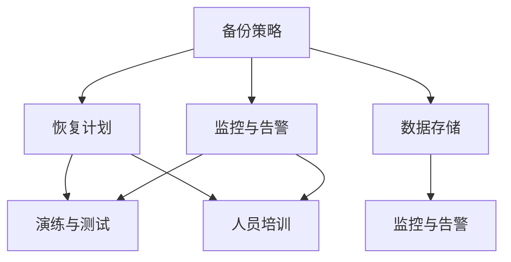

                 

### 概述篇

#### 评测系统灾备与数据恢复的概念

**评测系统**，顾名思义，是一种用于评估测试的工具或平台，广泛应用于软件开发、性能测试、安全测试等多个领域。无论是针对单一应用系统的功能测试，还是针对整个IT基础设施的性能测试，评测系统都扮演着至关重要的角色。而**灾备**（Disaster Recovery），则是指为了应对各种灾难（如硬件故障、网络中断、系统崩溃等）而制定的一系列措施和策略，确保评测系统能够迅速恢复，减少或避免因灾难造成的数据丢失和业务中断。

**数据恢复**，则是在评测系统遭受灾难性故障后，通过一系列技术手段和数据备份策略，将系统恢复到之前的状态，确保数据的完整性和可用性。

在当前高度信息化和数字化的时代，评测系统的稳定性和可靠性直接关系到企业的运营效率和业务连续性。因此，灾备与数据恢复已经成为评测系统设计和运维中不可或缺的一部分。

#### 灾备与数据恢复的重要性

1. **确保业务连续性**：评测系统作为企业关键业务的一部分，一旦发生故障，将会导致整个业务的停滞。通过有效的灾备措施，可以迅速恢复系统，确保业务的连续运行。

2. **减少经济损失**：系统故障带来的直接经济损失往往巨大，包括硬件采购、人力成本、客户流失等。而灾备与数据恢复方案可以在灾难发生后迅速恢复系统，减少经济损失。

3. **保障数据安全**：随着数据量的急剧增加，数据的完整性和安全性变得越来越重要。灾备与数据恢复方案能够确保数据在灾难中不被损坏，确保数据的持久性和可靠性。

4. **增强企业信誉**：高效的灾备与数据恢复方案能够提高企业在客户和合作伙伴眼中的信誉度，增强市场竞争力。

#### 评测系统的灾备与数据恢复架构

一个完整的评测系统灾备与数据恢复架构通常包括以下几个方面：

1. **备份策略**：确定数据的备份频率、备份方式和备份存储介质。

2. **恢复计划**：制定详细的系统恢复流程和步骤，包括数据恢复、系统重建、应用恢复等。

3. **数据存储**：选择合适的数据存储方案，包括本地存储、云存储等。

4. **监控与告警**：实时监控系统状态，一旦发现异常立即触发告警机制。

5. **演练与测试**：定期进行灾备与数据恢复演练，确保恢复计划的有效性。

6. **人员培训**：对相关人员进行灾备与数据恢复的培训，确保在灾难发生时能够迅速有效地应对。

通过以上架构，评测系统可以在遭遇各种灾难时保持高度的稳定性和可靠性，确保业务的连续运行和数据的安全。

#### 核心概念与联系

灾备与数据恢复的核心概念包括备份策略、恢复计划、数据存储、监控与告警、演练与测试和人员培训等。这些概念之间存在着密切的联系和相互影响。

1. **备份策略**：备份策略是灾备与数据恢复的基础，决定了数据的备份频率、备份方式和备份存储介质。合理的备份策略可以确保数据在灾难中不被丢失。

2. **恢复计划**：恢复计划详细描述了在灾难发生后如何恢复系统，包括数据恢复、系统重建、应用恢复等。恢复计划的有效性直接关系到灾备与数据恢复的成功。

3. **数据存储**：数据存储方案的选择对灾备与数据恢复的效果有着重要影响。本地存储和云存储各有优缺点，需要根据实际情况进行选择。

4. **监控与告警**：监控与告警机制可以实时监控系统状态，一旦发现异常立即触发告警，确保及时发现并处理问题。

5. **演练与测试**：定期的演练与测试可以检验灾备与数据恢复计划的可行性，确保在灾难发生时能够迅速有效地执行。

6. **人员培训**：相关人员的培训是确保灾备与数据恢复计划成功实施的关键。只有经过培训的人员才能在灾难发生时有效地执行恢复计划。

为了更好地理解这些核心概念之间的联系，我们可以使用Mermaid流程图进行展示。

通过这个Mermaid流程图，我们可以清晰地看到各个核心概念之间的相互关系和影响，为后续章节的详细讲解奠定了基础。

#### 总结

本章节对评测系统灾备与数据恢复的概念、重要性以及基本架构进行了概述。通过介绍，我们了解到灾备与数据恢复对于确保评测系统的稳定性和可靠性至关重要。接下来，我们将进一步探讨灾备与数据恢复的核心概念及其相互关系，并通过Mermaid流程图进行详细展示。

关键词：评测系统，灾备，数据恢复，业务连续性，备份策略，恢复计划

摘要：本文概述了评测系统灾备与数据恢复的概念、重要性及其基本架构。通过介绍核心概念和相互关系，为后续详细讲解奠定了基础。

---

在下一章节中，我们将深入探讨评测系统灾备与数据恢复的核心概念，并通过Mermaid流程图进行展示，以便更清晰地理解各个概念之间的联系。敬请期待。

