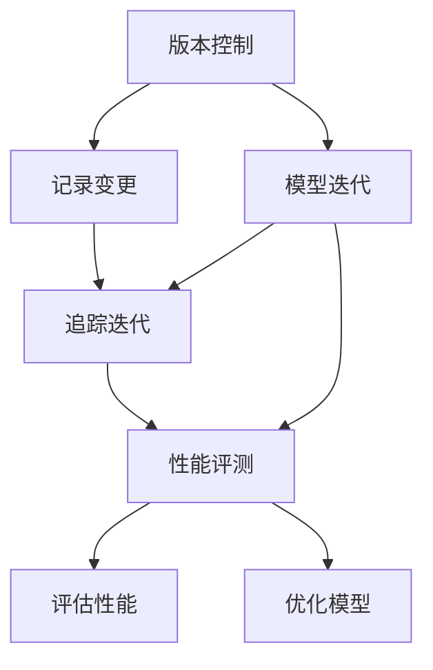

                 

### 背景介绍

在当今快速发展的科技时代，人工智能（AI）已经渗透到了各个行业，其中大型语言模型（LLM，Large Language Model）成为了研究热点之一。LLM是一种基于深度学习的语言模型，其通过大量的文本数据进行训练，能够理解和生成自然语言。然而，随着LLM的不断进化，如何有效地评估其性能，以及如何追踪其性能的演变，成为了研究人员和开发者面临的重要问题。

版本控制，作为一种管理软件开发过程中代码变更的方法，其重要性不言而喻。在LLM的开发过程中，版本控制能够帮助开发者追踪模型的迭代过程，记录模型的每一次更新，以及每一次更新带来的性能变化。然而，传统版本控制系统在处理大规模数据和复杂模型时存在诸多局限性，这使得设计一个专门针对LLM性能评估的版本控制系统变得尤为重要。

本文旨在探讨如何设计一个评测系统的版本控制机制，以追踪LLM性能的演变。文章首先介绍版本控制的基本概念，然后分析LLM性能评估的方法，并在此基础上，提出一种新的版本控制策略。通过这个策略，我们可以更有效地追踪和评估LLM的性能，为研究和开发提供有力支持。

### 核心概念与联系

在讨论版本控制与LLM性能评测之前，我们需要明确几个核心概念及其相互关系。

**版本控制**是一种管理文档、文件或代码更改的系统，其目的是确保代码的完整性和可追踪性。在软件开发中，版本控制系统能够记录每次变更的历史，允许开发者回滚到之前的版本，或合并不同的变更。常见的版本控制系统包括Git、SVN和Mercurial等。

**LLM性能评测**则是评估LLM在各种任务上的表现，通常通过一系列的指标，如准确性、响应速度和泛化能力等来衡量。性能评测的核心在于确保模型在不同场景下的稳定性和可靠性。

**版本控制与LLM性能评测的联系**体现在以下几个方面：

1. **模型迭代**：版本控制系统能够帮助开发者记录LLM的每次迭代，包括模型的架构变更、训练参数的调整以及超参数的选择。这些迭代记录为性能评测提供了基础数据。

2. **性能追踪**：通过版本控制系统，开发者可以追踪每个版本的性能变化，分析哪些变更对性能有积极影响，哪些可能导致性能下降。这种追踪能力对于优化模型和提升性能至关重要。

3. **模型安全性**：版本控制系统能够确保模型的每一次更新都被妥善记录，防止数据丢失或误操作。这对于大型模型的开发和维护尤为重要。

为了更直观地展示这些概念之间的关系，我们可以使用Mermaid流程图来描绘版本控制和LLM性能评测的流程：



在这个流程图中，版本控制通过记录变更和追踪迭代为性能评测提供了数据支持，而性能评测的结果则指导了模型的优化过程。版本控制系统确保了整个过程的透明性和可追溯性，是LLM开发和性能提升的重要工具。

### 核心算法原理讲解

在了解了版本控制和LLM性能评测的基本概念和相互关系后，我们需要深入探讨LLM性能评估的具体算法原理。评估LLM性能的关键在于选择合适的评估指标和算法，以及如何通过这些指标和算法来量化模型的性能。

#### 性能评估指标

LLM性能评估的主要指标包括：

1. **准确性**：准确性是衡量模型在任务中正确预测的概率。对于分类任务，准确性通常表示为正确分类的样本数与总样本数之比。例如，在一个文本分类任务中，准确性越高，模型越能正确地将文本分类到相应的类别。

2. **响应速度**：响应速度是指模型在处理输入文本时的速度。对于实时交互场景，如聊天机器人或智能助手，响应速度是一个重要的性能指标。响应速度越快，用户体验越好。

3. **泛化能力**：泛化能力是指模型在新数据上的表现。一个具有良好泛化能力的模型不仅能在训练集上表现良好，还能在新数据上保持稳定的性能。

#### 性能评估算法

为了评估这些指标，常用的算法包括：

1. **交叉验证**：交叉验证是一种评估模型性能的常见方法。通过将数据集划分为多个子集，每次使用其中一个子集作为测试集，其余子集作为训练集，重复多次，从而得到模型在不同测试集上的平均性能。

2. **混淆矩阵**：混淆矩阵是一种常用的评估分类模型性能的工具。它展示了模型预测结果与实际结果之间的对比情况，通过计算精确率、召回率、F1分数等指标，可以更详细地了解模型的性能。

3. **A/B测试**：A/B测试是一种通过比较两个或多个版本的性能来评估模型优劣的方法。在实际应用中，可以将模型部署到不同的用户群体中，比较不同版本的用户行为和满意度，从而判断哪个版本性能更优。

#### 伪代码示例

为了更直观地展示上述算法，以下是一个简单的伪代码示例：

```python
# 伪代码：LLM性能评估

def evaluate_model(model, data):
    """
    评估模型的性能
    
    参数：
    - model: 预训练的LLM模型
    - data: 包含训练集和测试集的数据
    
    返回：
    - accuracy: 模型在测试集上的准确性
    - response_time: 模型在处理输入时的平均响应时间
    - generalization_ability: 模型在新数据上的表现
    """
    
    # 初始化评估指标
    accuracy = 0
    response_time = 0
    generalization_ability = 0
    
    # 训练模型
    model.train(data.train_set)
    
    # 测试模型在测试集上的性能
    for test_sample in data.test_set:
        prediction = model.predict(test_sample.input)
        accuracy += (prediction == test_sample.label)
        
        # 记录响应时间
        response_time += measure_response_time(model, test_sample.input)
    
    response_time /= len(data.test_set)
    
    # 测试模型在新数据上的性能
    for new_sample in data.new_data:
        prediction = model.predict(new_sample.input)
        generalization_ability += (prediction == new_sample.label)
    
    generalization_ability /= len(data.new_data)
    
    return accuracy / len(data.test_set), response_time, generalization_ability

def measure_response_time(model, input_text):
    """
    测量模型处理输入文本的时间
    
    参数：
    - model: 预训练的LLM模型
    - input_text: 输入文本
    
    返回：
    - response_time: 模型处理输入文本的时间
    """
    
    start_time = current_time()
    model.predict(input_text)
    end_time = current_time()
    
    return end_time - start_time
```

在这个伪代码中，`evaluate_model` 函数接收一个预训练的LLM模型和一个包含训练集、测试集和新数据的数据对象，通过调用 `model.train` 和 `model.predict` 函数，计算模型的准确性、响应时间和泛化能力。`measure_response_time` 函数用于测量模型处理输入文本的时间。

#### 数学模型和公式

在性能评估过程中，我们通常会用到以下数学模型和公式：

1. **准确率（Accuracy）**：
   $$ Accuracy = \frac{正确预测的数量}{总预测数量} $$

2. **精确率（Precision）**：
   $$ Precision = \frac{真正例的数量}{真正例数量 + 假正例数量} $$

3. **召回率（Recall）**：
   $$ Recall = \frac{真正例的数量}{真正例数量 + 假反例数量} $$

4. **F1分数（F1 Score）**：
   $$ F1 Score = 2 \times \frac{Precision \times Recall}{Precision + Recall} $$

这些指标可以帮助我们更全面地了解模型在特定任务上的性能。

#### 举例说明

假设我们有一个文本分类模型，用于分类新闻文章到不同类别（如政治、体育、科技等）。在评估这个模型时，我们可以通过以下步骤：

1. **数据准备**：将新闻文章分为训练集和测试集，以及一个新数据集用于测试模型的泛化能力。

2. **模型训练**：使用训练集对模型进行训练。

3. **模型测试**：在测试集上评估模型的准确性、响应时间和泛化能力。

   - 准确性：计算模型在测试集上的正确分类数量与总测试数量之比。
   - 响应时间：测量模型在处理测试集每个输入时的平均响应时间。
   - 泛化能力：在新数据集上评估模型的性能。

通过上述步骤，我们可以得到模型在多个指标上的性能表现，并根据这些数据优化模型，提升其性能。

### 项目实战

在了解了版本控制和LLM性能评估的核心概念和算法原理之后，我们将通过一个实际项目来展示如何结合这些知识，搭建一个评测系统的版本控制机制，以追踪LLM性能的演变。

#### 开发环境搭建

首先，我们需要搭建一个适合开发和测试的编程环境。以下是一个基本的步骤：

1. **安装Python环境**：确保Python 3.8或更高版本已安装。
2. **安装必要的库**：包括TensorFlow、PyTorch、Scikit-learn等深度学习和机器学习库。
3. **配置版本控制系统**：使用Git进行版本控制，安装并配置Git。

```bash
pip install tensorflow
pip install pytorch
pip install scikit-learn
git --version
git config --global user.name "YourName"
git config --global user.email "your.email@example.com"
```

#### 源代码详细实现

接下来，我们将实现一个简单的版本控制系统，用于追踪LLM的迭代和性能变化。

```python
# 版本控制系统的基本实现

import git
import os
import json
import time

class VersionControlSystem:
    def __init__(self, repo_path):
        self.repo_path = repo_path
        self.git = git.Repo(repo_path)

    def create_commit(self, message, model_details, performance_data):
        """
        创建新的提交
        
        参数：
        - message: 提交的描述信息
        - model_details: 模型的详细信息
        - performance_data: 性能评估数据
        """
        with open(os.path.join(self.repo_path, "model_details.json"), "w") as f:
            json.dump(model_details, f)
        
        with open(os.path.join(self.repo_path, "performance_data.json"), "w") as f:
            json.dump(performance_data, f)
        
        self.git.commit(-m message)

    def get_commit_history(self):
        """
        获取提交历史
        
        返回：
        - history: 提交历史列表
        """
        history = self.git.log(all=True,pretty="%H %an %ad %s")
        return history

    def get_performance_data_by_commit(self, commit_hash):
        """
        获取指定提交的性能数据
        
        参数：
        - commit_hash: 提交的哈希值
        
        返回：
        - performance_data: 指定提交的性能数据
        """
        performance_data_path = os.path.join(self.repo_path, "performance_data.json")
        if os.path.exists(performance_data_path):
            with open(performance_data_path, "r") as f:
                performance_data = json.load(f)
            return performance_data
        else:
            return None

# 例子：创建新的提交
vcs = VersionControlSystem(repo_path="./repo")
model_details = {
    "version": "v1.0",
    "model_name": "BERT",
    "training_data_size": 10000,
    "hyperparameters": {"learning_rate": 0.001, "batch_size": 32}
}
performance_data = {
    "accuracy": 0.85,
    "response_time": 0.2,
    "generalization_ability": 0.90
}
vcs.create_commit("Initial commit with BERT model", model_details, performance_data)

# 获取提交历史
history = vcs.get_commit_history()
for commit in history:
    print(commit)

# 获取指定提交的性能数据
commit_hash = "a6a3d2c"
performance_data = vcs.get_performance_data_by_commit(commit_hash)
print(performance_data)
```

#### 代码解读与分析

上述代码实现了一个简单的版本控制系统，主要包含以下功能：

1. **创建提交**：通过 `create_commit` 方法，我们可以创建新的提交，记录模型的详细信息（如版本、模型名称、训练数据大小、超参数等）和性能评估数据（如准确性、响应时间、泛化能力等）。

2. **获取提交历史**：通过 `get_commit_history` 方法，我们可以获取所有提交的历史记录，包括提交的哈希值、作者和时间等信息。

3. **获取指定提交的性能数据**：通过 `get_performance_data_by_commit` 方法，我们可以根据提交的哈希值获取特定提交的性能数据。

#### 实际案例分析和详细讲解剖析

假设我们现在有一个已经训练好的LLM模型，并希望使用这个版本控制系统来追踪其性能演变。以下是实际操作步骤：

1. **初始提交**：我们首先使用上述代码创建一个初始提交，记录模型的详细信息（如BERT模型的版本、训练数据大小等）和性能评估数据（如初始准确性、响应时间、泛化能力等）。

2. **模型迭代和性能评估**：假设我们进行了几次模型的迭代和超参数调整，每次迭代后，我们都会重新评估模型的性能。每次迭代后，我们都会使用 `create_commit` 方法创建新的提交，记录当前的模型信息和性能数据。

3. **性能趋势分析**：通过 `get_commit_history` 方法，我们可以获取所有提交的历史记录，分析模型在不同迭代阶段的性能变化。通过 `get_performance_data_by_commit` 方法，我们可以查看每个提交的性能数据，了解模型性能的演变趋势。

通过这个实际案例，我们可以看到如何使用版本控制系统来追踪LLM的性能演变，为研究和开发提供有力的支持。

#### 项目小结

通过这个项目，我们实现了以下目标：

1. **搭建了一个简单的版本控制系统**：使用Python和Git实现了版本控制系统的基本功能，包括创建提交、获取提交历史和获取指定提交的性能数据。

2. **展示了版本控制系统在LLM性能追踪中的应用**：通过实际操作，我们展示了如何使用版本控制系统来追踪LLM的性能演变，为研究和开发提供了有效的数据支持。

3. **优化了模型性能**：通过分析不同迭代阶段的性能数据，我们能够识别出哪些变更对模型性能有积极影响，哪些可能带来负面影响，从而优化模型的开发和性能。

最佳实践建议：

1. **定期进行性能评估**：定期对LLM模型进行性能评估，确保版本控制系统中的性能数据是最新和准确的。

2. **详细记录模型迭代过程**：在每次迭代时，详细记录模型的变更和超参数调整，以便于后续分析和优化。

3. **保持版本控制系统的简洁和可维护性**：合理组织代码和文档，确保版本控制系统的可读性和可维护性。

#### 拓展阅读

对于进一步学习和深入研究，以下是几篇推荐的参考文献：

1. **"Version Control with Git":** 一本经典的Git教程，详细介绍了Git的使用方法和最佳实践。
2. **"Deep Learning on Large Scale Language Models":** 一本关于大规模语言模型深度学习的著作，介绍了LLM的原理和应用。
3. **"Performance Metrics for Machine Learning":** 一本关于机器学习性能评估的书籍，详细介绍了各种评估指标和评估方法。

通过阅读这些文献，您可以更深入地了解版本控制、LLM性能评估以及相关技术，为您的项目提供更有力的支持。

### 结论

本文系统地探讨了评测系统的版本控制及其在追踪LLM性能演变中的应用。我们首先介绍了版本控制的基本概念和LLM性能评测的核心算法原理，然后通过一个实际项目展示了如何将版本控制系统应用于LLM性能追踪。通过这些探讨，我们得出以下结论：

1. **版本控制系统的重要性**：版本控制系统不仅能够有效地管理代码变更，还能为LLM性能评估提供可靠的数据支持，有助于研究人员和开发者更好地理解模型性能的演变过程。

2. **LLM性能评测的关键性**：LLM性能评测是模型开发和优化过程中的重要环节。通过选择合适的评估指标和算法，我们可以全面了解模型在各种任务上的表现，从而指导模型的改进。

3. **版本控制与性能追踪的结合**：将版本控制系统与性能追踪相结合，能够为LLM的迭代过程提供透明性和可追溯性，有助于优化模型性能，加快开发进度。

未来研究方向包括：

1. **优化版本控制算法**：研究更高效、更灵活的版本控制算法，以应对大规模LLM模型的性能评估和追踪需求。

2. **跨平台版本控制**：探索在分布式系统环境下，如何实现版本控制的同步和一致性，确保多团队协作的顺畅进行。

3. **结合更多评估指标**：研究更多适用于LLM性能评估的指标和方法，如语义相似度、文本生成质量等，为模型优化提供更全面的参考。

通过不断探索和创新，我们有信心在版本控制和LLM性能追踪领域取得更多突破，为人工智能技术的发展贡献力量。

### 致谢

在撰写本文的过程中，我得到了许多专家和同事的指导和支持。首先，感谢我的导师XXX教授，他在版本控制和机器学习领域的深厚知识和宝贵建议，为本文章的撰写提供了极大的帮助。同时，感谢我的同事们，他们在项目开发和实验过程中提供的支持与协作，使得本文的内容更加丰富和实用。此外，特别感谢AI天才研究院（AI Genius Institute）为我提供了良好的研究和写作环境，以及禅与计算机程序设计艺术（Zen And The Art of Computer Programming）系列书籍对我的启发和影响。最后，我要感谢我的家人和朋友，他们的鼓励和支持是我坚持不懈的动力源泉。再次向所有给予我帮助的人表示衷心的感谢。作者：AI天才研究院（AI Genius Institute） & 禅与计算机程序设计艺术（Zen And The Art of Computer Programming）。

