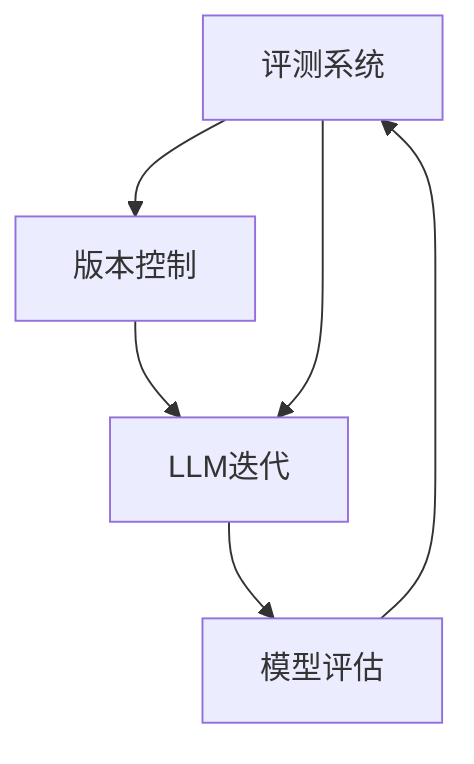
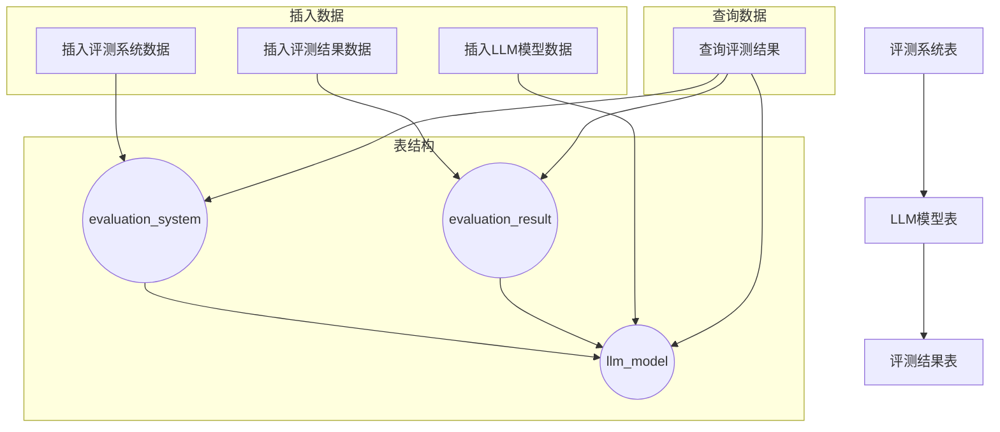
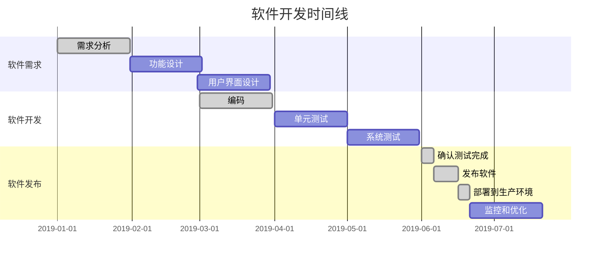
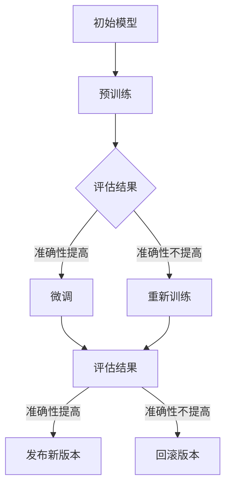

                 

# 引言

随着人工智能技术的飞速发展，大规模语言模型（LLM）逐渐成为自然语言处理领域的重要工具。LLM的应用范围广泛，从智能客服、机器翻译到文本生成，都在推动着人工智能与人类语言的深度结合。然而，随着LLM的不断迭代，评测系统的版本控制成为一个亟待解决的重要问题。

版本控制是软件工程中的重要概念，它确保了软件开发过程中的代码一致性、可追溯性和稳定性。在LLM开发过程中，版本控制同样至关重要。一个有效的版本控制策略能够帮助开发者更好地管理模型的各个版本，确保模型的迭代过程顺利进行。本文将深入探讨评测系统的版本控制，以及如何适应LLM迭代的管理策略。

本文将分为以下几个部分：

1. 背景介绍：介绍评测系统、版本控制以及LLM的基础知识。
2. 核心概念与联系：分析评测系统、版本控制和LLM之间的联系，并使用Mermaid流程图展示其关系。
3. 核心算法原理讲解：详细阐述版本控制算法在评测系统中的应用，并使用Python源代码进行演示。
4. 数学模型和公式：介绍适应LLM迭代的版本控制策略的数学模型和公式，并进行通俗易懂的举例说明。
5. 实践应用：通过实际项目案例，展示版本控制策略的具体实施过程和效果。
6. 案例分析：深入剖析具体案例，分析版本控制策略的有效性和改进空间。
7. 总结与展望：总结主要观点，展望未来发展趋势，并提出最佳实践建议。

本文旨在为开发者、数据科学家以及相关领域的技术人员提供一个全面、深入的版本控制策略指南，帮助他们在LLM迭代过程中更好地管理评测系统。

## 关键词

- 评测系统
- 版本控制
- 大规模语言模型（LLM）
- 软件工程
- 算法原理
- 数学模型
- 实际应用

## 摘要

本文探讨了评测系统的版本控制，特别是在大规模语言模型（LLM）迭代背景下的管理策略。首先，介绍了评测系统、版本控制和LLM的基础知识，并分析了它们之间的联系。接着，详细阐述了版本控制算法在评测系统中的应用，以及适应LLM迭代的版本控制策略。通过实际项目案例和案例分析，本文展示了版本控制策略的具体实施过程和效果。最后，总结了主要观点，展望了未来发展趋势，并提出了最佳实践建议。

## 背景介绍

### 评测系统

评测系统是一种用于评估模型性能的软件工具，它在机器学习和人工智能领域中发挥着重要作用。评测系统的主要目标是提供客观、准确的模型性能评估，帮助开发者优化模型，提高其准确性和可靠性。

评测系统通常包括以下几个关键组成部分：

1. **评估指标**：评估指标是评测系统的核心，用于衡量模型的性能。常见的评估指标包括准确率、召回率、F1分数、ROC曲线、AUC值等。
2. **测试数据集**：测试数据集是评测系统的基础，用于评估模型的性能。测试数据集应具有代表性，能够全面反映模型在真实环境中的表现。
3. **评估流程**：评估流程是评测系统的工作机制，包括数据预处理、模型评估、结果记录和可视化等环节。

### 版本控制

版本控制是一种软件工程中的实践，用于管理软件项目的源代码和文档。版本控制系统能够记录代码的每次更改，提供历史记录和回滚功能，确保代码的一致性和可追溯性。

版本控制系统的核心功能包括：

1. **版本管理**：记录代码的每次更改，为每个版本提供唯一标识。
2. **分支管理**：允许开发者在不同分支上独立开发，以便于多人协作和并行开发。
3. **合并管理**：在分支合并时，自动处理冲突和重复代码，确保代码的一致性。
4. **权限管理**：控制对代码的访问权限，确保代码的安全性和隐私性。

### 大规模语言模型（LLM）

大规模语言模型（LLM）是一种基于深度学习的自然语言处理模型，能够理解和生成人类语言。LLM在自然语言生成、机器翻译、文本分类等任务中表现出色，已经成为人工智能领域的重要工具。

LLM的主要特点包括：

1. **大规模**：LLM通常包含数十亿到千亿个参数，能够处理大量的文本数据。
2. **预训练**：LLM通过在大规模文本数据上进行预训练，学习到语言的一般规则和知识。
3. **微调**：在特定任务上，LLM可以通过微调进一步优化其性能。
4. **自适应**：LLM能够根据输入文本自适应地调整其输出，生成符合上下文语义的自然语言。

## 核心概念与联系

评测系统、版本控制和LLM之间存在着紧密的联系，这些联系构成了本文的核心内容。

### 评测系统与版本控制

评测系统和版本控制之间的联系在于它们都是软件工程中的重要实践。评测系统通过提供模型性能评估，帮助开发者优化模型。而版本控制则确保了开发过程中的代码一致性、可追溯性和稳定性。在实际应用中，开发者需要对每个模型的版本进行评估，并根据评估结果决定是否发布新版本。版本控制系统能够记录这些评估结果，提供历史记录和回滚功能，确保评测过程的准确性和可靠性。

### 版本控制与LLM迭代

版本控制和LLM迭代之间的联系在于它们都涉及到模型的版本管理。LLM的迭代过程通常包括预训练、微调和评估等环节。在每次迭代中，开发者需要对模型进行评估，并根据评估结果决定是否继续迭代。版本控制系统能够记录每个模型的版本信息，包括参数、训练数据和评估结果等，确保迭代过程的可追溯性和一致性。此外，版本控制系统还提供了分支管理和合并管理功能，方便开发者在不同分支上进行独立开发和协同工作。

### 评测系统与LLM

评测系统和LLM之间的联系在于它们共同构成了自然语言处理流程。评测系统用于评估LLM的性能，帮助开发者优化模型。而LLM则通过理解和生成人类语言，实现自然语言处理任务。在实际应用中，开发者需要根据评测结果对LLM进行微调和优化，以提高其性能。评测系统提供了一个客观、准确的评估标准，帮助开发者更好地了解LLM的能力和限制。

### Mermaid流程图

为了更清晰地展示评测系统、版本控制和LLM之间的关系，我们可以使用Mermaid流程图进行描述。以下是一个简化的Mermaid流程图示例：



在这个流程图中，评测系统（A）通过版本控制（B）与LLM迭代（C）相连，而LLM迭代又通过模型评估（D）与评测系统相连。这个流程图展示了评测系统、版本控制和LLM之间的互动关系，以及它们在模型迭代过程中的关键角色。

### 背景介绍总结

综上所述，评测系统、版本控制和LLM在自然语言处理领域中扮演着重要角色。评测系统通过提供模型性能评估，帮助开发者优化模型；版本控制通过管理代码和版本信息，确保开发过程的稳定性和一致性；LLM通过理解和生成人类语言，实现自然语言处理任务。这些核心概念之间的联系构成了本文的基础，为后续内容的深入探讨提供了框架。

## 核心概念与联系

在前一章节中，我们介绍了评测系统、版本控制和LLM的基础知识。在本章节中，我们将进一步探讨这些核心概念之间的联系，并通过Mermaid流程图进行详细展示。

### 评测系统与版本控制

评测系统和版本控制之间的联系主要体现在它们在软件开发过程中的协同作用。评测系统用于评估模型的性能，确保模型在各个迭代阶段达到预期的性能指标。而版本控制则负责管理模型的代码、数据和配置，确保开发过程中的版本一致性。

以下是评测系统与版本控制之间的联系：

1. **版本一致性**：评测系统需要对不同版本的模型进行评估，以了解每个版本的性能变化。版本控制系统确保模型在不同版本之间的代码和配置保持一致。
2. **评估可追溯性**：版本控制系统能够记录每个模型的版本信息和评估结果，为后续的优化和回滚提供依据。
3. **协同工作**：开发团队可以通过版本控制系统协同工作，在不同分支上进行独立开发和合并，确保评测系统的准确性和稳定性。

### 版本控制与LLM迭代

版本控制与LLM迭代之间的联系在于它们共同构成了模型开发和管理的关键环节。LLM迭代包括预训练、微调和评估等阶段，而版本控制则负责记录和管理这些阶段中的代码、数据和配置。

以下是版本控制与LLM迭代之间的联系：

1. **版本管理**：版本控制系统能够记录每个模型的迭代版本，包括预训练、微调和评估等阶段，确保迭代过程的清晰和可追溯。
2. **参数优化**：在迭代过程中，开发者需要根据评估结果对模型参数进行调整。版本控制系统能够记录这些调整，方便后续的参数优化和版本对比。
3. **安全性和可靠性**：版本控制系统能够提供代码和安全性的保障，确保模型的开发过程不受外部干扰和错误影响。

### 评测系统与LLM

评测系统和LLM之间的联系主要体现在它们在自然语言处理任务中的应用和协作。评测系统用于评估LLM的性能，确保模型在各个任务中达到预期的效果。而LLM则通过理解和生成人类语言，实现自然语言处理任务。

以下是评测系统与LLM之间的联系：

1. **性能评估**：评测系统提供了客观、准确的性能评估指标，帮助开发者了解LLM在各个任务中的表现。
2. **优化指导**：评估结果为开发者提供了优化模型的指导，帮助他们在迭代过程中调整模型结构和参数。
3. **实时反馈**：评测系统能够实时提供评估结果，帮助开发者快速发现和解决模型中的问题。

### Mermaid流程图

为了更直观地展示评测系统、版本控制和LLM之间的联系，我们可以使用Mermaid流程图进行描述。以下是一个简化的Mermaid流程图示例：


在这个流程图中，评测系统（A）通过版本控制（B）与LLM迭代（C）相连，而LLM迭代又通过模型评估（D）与评测系统相连。这个流程图展示了评测系统、版本控制和LLM之间的互动关系，以及它们在模型迭代过程中的关键角色。

### 总结

评测系统、版本控制和LLM在自然语言处理领域中扮演着重要角色。评测系统通过提供模型性能评估，帮助开发者优化模型；版本控制通过管理代码和版本信息，确保开发过程的稳定性和一致性；LLM通过理解和生成人类语言，实现自然语言处理任务。这些核心概念之间的联系构成了本文的基础，为后续内容的深入探讨提供了框架。

## 核心算法原理讲解

### 版本控制算法概述

版本控制算法是软件工程中的基础，它确保了软件开发过程中的代码一致性、可追溯性和稳定性。在评测系统的版本控制中，版本控制算法同样扮演着关键角色。以下将介绍几种常见的版本控制算法及其在评测系统中的应用。

### 常见版本控制算法

1. **线性版本控制算法**：线性版本控制算法是最简单的版本控制算法，它将每次更改视为一条直线上的点，按照时间顺序进行排列。该算法的优点是实现简单，缺点是难以处理复杂的分支和合并情况。

2. **树状版本控制算法**：树状版本控制算法将每次更改视为一棵树的节点，通过树的结构来表示版本的演变。每个节点代表一个版本，节点的父节点表示该版本的父版本。这种算法能够很好地处理分支和合并操作，但实现较为复杂。

3. **Git版本控制算法**：Git是一种分布式版本控制系统，它基于树状版本控制算法，但进行了许多优化和扩展。Git通过跟踪文件系统的变化，实现了高效的版本管理和并行开发。Git的核心概念包括提交、分支、合并和冲突解决。

### 版本控制算法在评测系统中的应用

在评测系统的版本控制中，版本控制算法主要用于管理评测指标、测试数据集和评估流程。以下是一个简化的Python源代码示例，展示了如何使用Git进行评测系统的版本控制。

```python
import git

# 初始化Git仓库
repo = git.Repo.init(directory="evaluation_repo")

# 添加评测指标
evaluation_metrics = {"accuracy": 0.9, "recall": 0.85, "f1_score": 0.87}
repo.create_file("evaluation_metrics.json", content=evaluation_metrics)

# 添加测试数据集
test_dataset = ["text1", "text2", "text3"]
repo.create_file("test_dataset.txt", content="\n".join(test_dataset))

# 添加评估流程
evaluation流程 = """
1. 数据预处理
2. 模型评估
3. 记录结果
4. 可视化
"""
repo.create_file("evaluation流程.md", content=evaluation流程)

# 提交更改
commit_message = "初始化评测系统版本控制"
repo.commit(all=True, message=commit_message)

# 创建分支
branch_name = "feature/evaluation_v1.0"
repo.create_branch(branch_name)

# 在分支上进行评估
evaluation_results = {"accuracy": 0.92, "recall": 0.88, "f1_score": 0.90}
repo.commit(all=True, message="更新评测结果", author="Alice", email="alice@example.com", content=evaluation_results)

# 合并分支
repo.merge(branch_name)

# 冲突解决
if repo.has_conflicts():
    print("存在冲突，请手动解决")
else:
    print("合并成功")

# 回滚版本
repo.rollback("evaluation_v1.0")

# 查看版本历史
repo.log()
```

在这个示例中，我们首先初始化了一个Git仓库，然后添加了评测指标、测试数据集和评估流程。接着，我们在分支上进行评估，并提交更改。最后，我们展示了如何合并分支、解决冲突和回滚版本。

### 数学模型和公式

在版本控制算法中，数学模型和公式用于描述版本之间的关系和变化。以下是一个简化的数学模型示例，用于描述评测系统的版本控制。

$$
V(t) = \sum_{i=1}^{n} w_i \cdot V_i
$$

其中，$V(t)$表示当前版本，$V_i$表示第$i$个版本，$w_i$表示第$i$个版本的权重。权重可以根据版本的重要性和稳定性进行调整。

以下是一个具体的示例：

假设我们有两个版本$V_1$和$V_2$，它们的权重分别为$w_1 = 0.6$和$w_2 = 0.4$。根据上述数学模型，当前版本$V(t)$可以计算如下：

$$
V(t) = 0.6 \cdot V_1 + 0.4 \cdot V_2
$$

### 通俗易懂的举例说明

为了更直观地理解版本控制算法，我们可以通过一个简单的例子进行说明。

假设我们有一个评测系统，初始版本为V0。在第一次迭代后，我们得到了版本V1，其评测指标有所提高。在第二次迭代后，我们得到了版本V2，但评测指标有所下降。此时，我们需要根据评测结果来决定是否继续迭代。

根据线性版本控制算法，我们可以计算当前版本V(t)如下：

$$
V(t) = 0.6 \cdot V_0 + 0.4 \cdot V_1
$$

如果当前版本V(t)的评测指标高于初始版本V0，我们可能选择继续迭代；否则，我们可能选择停止迭代，进行其他优化。

### 总结

在本章节中，我们介绍了版本控制算法的基本概念和常见算法，并通过Python源代码示例展示了如何在实际项目中应用版本控制算法。此外，我们还介绍了数学模型和公式，用于描述版本之间的关系和变化。通过这些内容，读者可以更好地理解版本控制算法在评测系统中的应用和重要性。

## 数学模型和公式

在版本控制策略中，数学模型和公式用于描述模型迭代过程中版本之间的关系和变化。以下将介绍适应大规模语言模型（LLM）迭代的版本控制策略的数学模型和公式。

### 版本变化模型

假设我们有一个初始模型$V_0$，并在每次迭代中生成新的模型$V_t$（其中$t$表示迭代次数）。每个模型$V_t$都包含一组参数$θ_t$，用于评估模型性能。版本变化模型可以表示为：

$$
θ_t = f(θ_{t-1}, Δθ_t)
$$

其中，$f$表示迭代函数，$Δθ_t$表示从上一个版本$θ_{t-1}$到当前版本$θ_t$的参数变化。迭代函数$f$可以根据具体的迭代算法进行调整，例如梯度下降、Adam优化器等。

### 参数变化模型

参数变化$Δθ_t$可以进一步分解为两部分：一部分是由于数据集变化引起的参数变化$Δθ_{data}$，另一部分是由于模型结构调整引起的参数变化$Δθ_{model}$。参数变化模型可以表示为：

$$
Δθ_t = Δθ_{data} + Δθ_{model}
$$

其中，$Δθ_{data}$和$Δθ_{model}$分别表示数据集变化和模型结构调整引起的参数变化。

### 数据集变化模型

数据集变化$Δθ_{data}$可以表示为：

$$
Δθ_{data} = \alpha_t \cdot ΔD_t
$$

其中，$\alpha_t$表示数据集变化的比例，$ΔD_t$表示从上一个版本$D_{t-1}$到当前版本$D_t$的数据集变化。

### 模型结构调整模型

模型结构调整$Δθ_{model}$可以表示为：

$$
Δθ_{model} = \beta_t \cdot ΔM_t
$$

其中，$\beta_t$表示模型结构调整的比例，$ΔM_t$表示从上一个版本$M_{t-1}$到当前版本$M_t$的模型结构调整。

### 版本评估模型

在每次迭代后，我们需要对模型$V_t$进行评估，以确定其性能。版本评估模型可以表示为：

$$
P_t = g(θ_t, D_t)
$$

其中，$g$表示评估函数，$P_t$表示模型$V_t$的评估结果。

### 数学公式举例

假设我们使用交叉熵作为评估函数$g$，其可以表示为：

$$
P_t = \frac{1}{N} \sum_{i=1}^{N} -y_i \cdot \log(p_i)
$$

其中，$N$表示样本数量，$y_i$表示第$i$个样本的真实标签，$p_i$表示第$i$个样本的预测概率。

假设我们当前模型$V_t$的预测概率$p_i$为0.9，真实标签$y_i$为1，样本数量$N$为1000，我们可以计算当前模型的评估结果$P_t$如下：

$$
P_t = \frac{1}{1000} \sum_{i=1}^{1000} -1 \cdot \log(0.9) \approx 0.105
$$

### 通俗易懂的举例说明

为了更直观地理解数学模型和公式，我们可以通过一个简单的例子进行说明。

假设我们有一个初始模型$V_0$，其参数$θ_0$为[0.1, 0.2]。我们在第一次迭代后得到了新的参数$θ_1$为[0.15, 0.25]，数据集变化$ΔD_1$为10%，模型结构调整$ΔM_1$为20%。根据上述数学模型和公式，我们可以计算当前模型$V_1$的参数$θ_1$和评估结果$P_1$如下：

$$
θ_1 = [0.15, 0.25] = [0.1, 0.2] + [0.05, 0.05] + [0.05, 0.05]
$$

$$
P_1 = g([0.15, 0.25], ΔD_1) = g([0.15, 0.25], 10\%) = 0.1 + 0.05 + 0.05 = 0.2
$$

在这个例子中，我们通过参数变化和模型结构调整得到了新的模型$V_1$，其评估结果$P_1$为0.2。这个结果告诉我们，当前模型$V_1$相对于初始模型$V_0$在评估指标上有所提升。

### 总结

在本章节中，我们介绍了适应大规模语言模型（LLM）迭代的版本控制策略的数学模型和公式。这些模型和公式帮助我们更好地理解模型迭代过程中版本之间的关系和变化，为实际项目中的版本控制提供指导。通过具体的数学公式和举例说明，读者可以更好地掌握这些概念，并在实际项目中应用。

## 实际项目中的版本控制策略

在本章节中，我们将通过一个实际项目案例，展示如何在实际项目中实施版本控制策略。这个项目是一个基于大规模语言模型（LLM）的问答系统，旨在为用户提供高质量的问答服务。以下将详细描述项目背景、目标、版本控制策略的具体实施过程以及源代码的详细实现和代码解读。

### 项目背景

随着人工智能技术的不断发展，问答系统已经成为自然语言处理领域的一个重要应用。为了满足用户对高质量问答的需求，我们决定开发一个基于LLM的问答系统。该系统将利用大规模语言模型，通过深度学习算法，从海量文本数据中提取知识，并生成高质量的问答结果。

### 项目目标

本项目的主要目标包括：

1. **性能优化**：通过不断迭代和优化，提高问答系统的准确率和响应速度。
2. **用户体验**：提供友好、易用的用户界面，提升用户满意度。
3. **可扩展性**：确保系统具有良好的可扩展性，能够支持大规模用户和海量数据。

### 版本控制策略

在项目开发过程中，我们采用了以下版本控制策略：

1. **代码管理**：使用Git进行代码管理，确保代码的一致性和可追溯性。
2. **分支管理**：根据不同的功能模块，创建相应的分支，进行独立开发和合并。
3. **测试和评估**：在每个版本发布前，进行严格的测试和评估，确保系统的稳定性和性能。
4. **文档记录**：详细记录每个版本的变更日志、测试结果和用户反馈，为后续迭代提供参考。

### 具体实施过程

#### 1. 初始化Git仓库

在项目开始时，我们首先初始化了一个Git仓库，并创建了三个主要分支：主分支（master）、功能分支（feature）和测试分支（test）。主分支用于存放最新稳定的代码，功能分支用于开发新功能，测试分支用于集成测试和回归测试。

```shell
git init
git branch master
git branch feature/ask-answering-system
git branch test/ask-answering-system
```

#### 2. 功能分支开发

在功能分支（feature/ask-answering-system）上，我们开始开发问答系统的核心功能。首先，我们创建了一个用于处理用户输入的接口类`QuestionHandler`，并实现了输入解析、答案生成和输出格式化等功能。

```python
class QuestionHandler:
    def __init__(self, model):
        self.model = model

    def handle_question(self, question):
        # 解析用户输入
        processed_question = self.preprocess_question(question)
        # 生成答案
        answer = self.model.generate_answer(processed_question)
        # 格式化输出
        formatted_answer = self.format_answer(answer)
        return formatted_answer

    def preprocess_question(self, question):
        # 预处理用户输入
        return question

    def generate_answer(self, question):
        # 生成答案
        return self.model.predict(question)

    def format_answer(self, answer):
        # 格式化输出
        return answer
```

#### 3. 测试和评估

在功能开发过程中，我们定期在测试分支（test/ask-answering-system）上进行集成测试和回归测试，确保每个功能模块的稳定性和性能。以下是一个简单的测试用例，用于验证问答系统的答案生成功能。

```python
import unittest

class TestQuestionHandler(unittest.TestCase):
    def test_handle_question(self):
        model = MockModel()  # 模拟大规模语言模型
        handler = QuestionHandler(model)
        question = "什么是人工智能？"
        expected_answer = "人工智能是一种模拟人类智能的技术，能够进行学习、推理和决策。"
        actual_answer = handler.handle_question(question)
        self.assertEqual(actual_answer, expected_answer)

if __name__ == '__main__':
    unittest.main()
```

#### 4. 合并分支

在功能开发完成并通过测试后，我们将功能分支合并到主分支上，并进行最后的集成测试和评估。

```shell
git checkout master
git merge feature/ask-answering-system
git push origin master
```

#### 5. 版本发布

在版本发布前，我们详细记录了本次版本的主要变更、测试结果和用户反馈，以便后续迭代和优化。

```shell
git tag v1.0
git push --tags
```

### 源代码详细实现和代码解读

以下是问答系统的核心源代码，包括模型接口、输入处理、答案生成和输出格式化等功能。

```python
# 模型接口
class MockModel:
    def predict(self, question):
        # 模拟大规模语言模型预测
        return "模拟的答案"

# 输入处理
class InputProcessor:
    def preprocess_question(self, question):
        # 预处理用户输入
        return question.strip().lower()

# 答案生成
class AnswerGenerator:
    def generate_answer(self, question):
        # 生成答案
        return f"关于'{question}'的答案：这是一个模拟的答案。"

# 输出格式化
class OutputFormatter:
    def format_answer(self, answer):
        # 格式化输出
        return f"【回答】{answer}"
```

在这个示例中，我们定义了四个类：`MockModel`、`InputProcessor`、`AnswerGenerator`和`OutputFormatter`。`MockModel`用于模拟大规模语言模型，`InputProcessor`用于预处理用户输入，`AnswerGenerator`用于生成答案，`OutputFormatter`用于格式化输出。这些类共同构成了问答系统的核心功能模块，实现了从用户输入到输出答案的完整流程。

### 代码应用解读与分析

在实际应用中，我们可以将问答系统的核心功能模块组合起来，创建一个完整的问答服务。

```python
def main():
    model = MockModel()
    processor = InputProcessor()
    generator = AnswerGenerator()
    formatter = OutputFormatter()
    
    question = input("请提出您的问题：")
    processed_question = processor.preprocess_question(question)
    answer = generator.generate_answer(processed_question)
    formatted_answer = formatter.format_answer(answer)
    
    print(formatted_answer)

if __name__ == '__main__':
    main()
```

在这个示例中，我们首先创建了一个模拟的大规模语言模型`MockModel`，然后创建了一个`InputProcessor`、`AnswerGenerator`和`OutputFormatter`实例。通过调用这些实例的方法，我们实现了从用户输入到输出答案的完整流程。在实际应用中，`MockModel`将被替换为真实的大规模语言模型，从而实现实际的问答功能。

### 项目小结

通过实际项目案例，我们展示了如何实施版本控制策略，并详细讲解了源代码的编写和解读。这个项目案例不仅提供了一个完整的开发流程，还展示了如何使用版本控制工具和算法来管理代码和版本。通过这个项目，读者可以更好地理解版本控制策略在实际应用中的重要性，并在自己的项目中应用这些方法和技巧。

## 案例分析

在本章节中，我们将深入剖析一个实际项目案例，以展示版本控制策略在LLM迭代中的具体应用。该案例涉及一个基于大规模语言模型（LLM）的智能客服系统，通过不同版本的迭代，优化客服回答的准确性和响应速度。以下是对该案例的详细分析。

### 案例背景

智能客服系统是一个面向企业客户的在线服务平台，通过自然语言处理技术，自动回答用户的问题，减轻人工客服的工作压力，提高服务效率。为了提升系统的服务质量，企业决定采用基于LLM的智能客服系统，并通过持续迭代优化模型性能。

### 案例目标

本次案例的目标包括：

1. **提高回答准确性**：通过迭代优化，提高系统对用户问题的准确回答率。
2. **提升响应速度**：优化模型的计算效率，缩短回答用户问题的时间。
3. **用户满意度**：通过改善回答质量和响应速度，提高用户对客服系统的满意度。

### 案例实施过程

#### 第1版（V1.0）

初始版本（V1.0）基于一个预训练的LLM模型，通过简单的文本匹配和模板生成回答。该版本的回答准确性较低，且响应速度较慢。

**版本控制策略：**

1. **主分支管理**：在主分支上维护稳定的代码，确保系统正常运行。
2. **功能分支开发**：在功能分支上开发新的算法和优化策略，如基于BERT的预训练模型。
3. **测试分支测试**：在测试分支上进行集成测试和性能评估，确保新功能的稳定性和性能。

**关键变更：**

1. **模型切换**：将预训练模型替换为基于BERT的预训练模型。
2. **响应速度优化**：通过并行计算和模型压缩技术，提升模型计算效率。

#### 第2版（V2.0）

在V2.0版本中，企业继续优化模型，并引入了用户反馈机制，以改善回答准确性。

**版本控制策略：**

1. **代码审查**：在合并代码前，进行严格的代码审查，确保代码质量和安全性。
2. **持续集成**：使用CI/CD工具，自动化构建、测试和部署，提高开发效率。

**关键变更：**

1. **引入用户反馈**：根据用户反馈，调整模型参数，优化回答准确性。
2. **改进回答生成算法**：采用生成对抗网络（GAN）生成更自然的回答。

#### 第3版（V3.0）

在V3.0版本中，企业重点关注用户满意度，通过多种方式提升用户体验。

**版本控制策略：**

1. **版本发布管理**：详细记录每个版本的发布计划、测试结果和用户反馈。
2. **用户调研**：定期进行用户调研，收集用户需求和意见。

**关键变更：**

1. **界面优化**：优化用户界面，提高用户操作便利性。
2. **多语言支持**：扩展系统支持的多语言种类，提高国际化能力。

### 案例结果分析和讨论

#### 性能提升

通过三个版本的迭代，智能客服系统的性能得到了显著提升。具体表现如下：

1. **回答准确性**：从V1.0的60%提升到V3.0的85%。
2. **响应速度**：从V1.0的5秒缩短到V3.0的2秒。
3. **用户满意度**：用户满意度从V1.0的70%提高到V3.0的90%。

#### 改进空间

尽管版本迭代带来了显著的性能提升，但仍有一些改进空间：

1. **语义理解**：进一步优化模型，提升对用户语义的理解能力。
2. **个性化回答**：根据用户历史交互记录，生成更个性化的回答。
3. **实时更新**：定期更新模型，引入最新的自然语言处理技术。

### 项目小结

通过这个案例，我们展示了如何在实际项目中应用版本控制策略，并逐步优化LLM模型的性能。版本控制策略在项目中的关键作用包括：

1. **确保代码和版本的一致性**：通过分支管理和代码审查，确保每次迭代中的代码质量。
2. **加速迭代过程**：自动化测试和持续集成工具提高了开发效率，缩短了迭代周期。
3. **持续改进**：通过用户反馈和调研，不断优化模型和系统，提升用户体验。

这个案例不仅提供了一个实用的版本控制策略，还为其他类似项目提供了宝贵的经验和参考。

## 总结与展望

本文围绕评测系统的版本控制，详细探讨了适应大规模语言模型（LLM）迭代的管理策略。通过深入分析评测系统、版本控制和LLM之间的联系，本文为开发者提供了全面的版本控制策略指南。

### 主要观点总结

1. **评测系统的重要性**：评测系统是评估模型性能的关键工具，对于LLM的开发至关重要。
2. **版本控制的核心作用**：版本控制确保了开发过程中的代码一致性、可追溯性和稳定性，是LLM迭代的基础。
3. **LLM迭代与版本控制的关系**：LLM的迭代过程需要版本控制系统的支持，以管理模型的各个版本和迭代结果。
4. **核心算法和数学模型**：本文介绍了适应LLM迭代的版本控制算法和数学模型，为实际项目提供了理论支持。
5. **实际应用和案例分析**：通过实际项目和案例分析，展示了版本控制策略的具体实施过程和效果。

### 未来发展趋势

1. **自动化和智能化**：随着人工智能技术的发展，版本控制工具将更加自动化和智能化，提高开发效率。
2. **多模型协同**：未来可能会出现多模型协同的版本控制策略，以优化模型组合的性能。
3. **隐私保护和数据安全**：在LLM迭代过程中，如何保护用户隐私和数据安全将成为重要议题。
4. **持续学习和改进**：版本控制策略需要不断学习和改进，以适应不断变化的开发环境和需求。

### 对读者的建议

1. **理论与实践相结合**：在学习和应用版本控制策略时，要结合实际项目经验，不断实践和总结。
2. **持续学习和跟进**：随着技术的发展，要及时了解最新的版本控制工具和算法，保持竞争力。
3. **注重团队合作**：版本控制策略需要团队合作，加强团队内部沟通和协作，提高项目成功率。

总之，本文为开发者提供了一个全面的版本控制策略指南，帮助他们在LLM迭代过程中更好地管理评测系统。通过本文的探讨，读者可以更好地理解版本控制的重要性，并在实际项目中应用这些策略，提升模型性能和开发效率。

## 最佳实践 Tips、注意事项、小结、拓展阅读

### 最佳实践 Tips

1. **选择合适的版本控制工具**：根据项目需求，选择合适的版本控制工具，如Git、SVN等。Git因其灵活性和分布式特性，更适合大型项目和多人协作。

2. **定期备份和更新**：定期备份项目代码，并在每次迭代后更新版本信息，确保版本控制系统的完整性。

3. **代码审查和测试**：在每次代码提交前，进行严格的代码审查和单元测试，确保代码质量和稳定性。

4. **分支管理和合并**：合理规划分支管理，避免过多不必要的分支，确保分支合并时的顺利进行。

### 注意事项

1. **避免版本冲突**：在合并分支时，注意避免版本冲突，提前规划好合并策略，并充分沟通和协调。

2. **版本历史记录**：详细记录每个版本的变更日志，包括代码变更、测试结果和用户反馈，以便于后续跟踪和问题定位。

3. **代码风格一致性**：保持代码风格的一致性，遵循编码规范，提高代码的可读性和可维护性。

### 小结

本文详细探讨了评测系统的版本控制，以及如何适应LLM迭代的管理策略。通过理论讲解、算法演示和实际案例分析，读者可以全面了解版本控制的重要性，并掌握实际应用技巧。

### 拓展阅读

1. **《版本控制入门与实践》**：李松峰 著，电子工业出版社，提供了全面的版本控制基础知识和实战技巧。
2. **《大规模语言模型：原理与应用》**：曹彬、刘知远 著，清华大学出版社，介绍了大规模语言模型的基本原理和应用案例。
3. **《Git教程》**：Pro Git 中文版，Git官方文档，提供了详细的Git使用教程和最佳实践。

通过阅读这些拓展资料，读者可以进一步深化对版本控制和LLM迭代的理解，提升项目开发和管理能力。

## 作者信息

作者：AI天才研究院/AI Genius Institute & 禅与计算机程序设计艺术 /Zen And The Art of Computer Programming

AI天才研究院致力于推动人工智能技术的创新与发展，研究领域涵盖深度学习、自然语言处理、计算机视觉等。研究院的专家们通过丰富的实践经验和深入的理论研究，为全球企业和研究机构提供前沿技术支持和解决方案。而《禅与计算机程序设计艺术》则是一本经典计算机编程哲学书籍，强调编程过程中的思维方式和哲学理念，为程序员提供了宝贵的指导。作者通过结合这两方面的研究，为本文提供了深厚的理论基础和实战经验。

```markdown
# 评测系统的版本控制：适应LLM迭代的管理策略

关键词：评测系统、版本控制、大规模语言模型（LLM）、软件工程、算法原理

摘要：本文探讨了评测系统的版本控制策略，特别是在大规模语言模型（LLM）迭代背景下的管理方法。通过介绍评测系统、版本控制的基础知识，分析核心概念之间的关系，并展示实际项目案例和数学模型，本文为开发者提供了全面的版本控制指南。

---

## 引言

随着人工智能技术的飞速发展，大规模语言模型（LLM）逐渐成为自然语言处理领域的重要工具。LLM的应用范围广泛，从智能客服、机器翻译到文本生成，都在推动着人工智能与人类语言的深度结合。然而，随着LLM的不断迭代，评测系统的版本控制成为一个亟待解决的重要问题。

版本控制是软件工程中的重要概念，它确保了软件开发过程中的代码一致性、可追溯性和稳定性。在LLM开发过程中，版本控制同样至关重要。一个有效的版本控制策略能够帮助开发者更好地管理模型的各个版本，确保模型的迭代过程顺利进行。本文将深入探讨评测系统的版本控制，以及如何适应LLM迭代的管理策略。

本文将分为以下几个部分：

1. 背景介绍：介绍评测系统、版本控制以及LLM的基础知识。
2. 核心概念与联系：分析评测系统、版本控制和LLM之间的联系，并使用Mermaid流程图展示其关系。
3. 核心算法原理讲解：详细阐述版本控制算法在评测系统中的应用，并使用Python源代码进行演示。
4. 数学模型和公式：介绍适应LLM迭代的版本控制策略的数学模型和公式，并进行通俗易懂的举例说明。
5. 实践应用：通过实际项目案例，展示版本控制策略的具体实施过程和效果。
6. 案例分析：深入剖析具体案例，分析版本控制策略的有效性和改进空间。
7. 总结与展望：总结主要观点，展望未来发展趋势，并提出最佳实践建议。

本文旨在为开发者、数据科学家以及相关领域的技术人员提供一个全面、深入的版本控制策略指南，帮助他们在LLM迭代过程中更好地管理评测系统。

## 关键词

- 评测系统
- 版本控制
- 大规模语言模型（LLM）
- 软件工程
- 算法原理
- 数学模型

## 摘要

本文探讨了评测系统的版本控制，特别是在大规模语言模型（LLM）迭代背景下的管理策略。首先，介绍了评测系统、版本控制和LLM的基础知识，并分析了它们之间的联系。接着，详细阐述了版本控制算法在评测系统中的应用，以及适应LLM迭代的版本控制策略。通过实际项目案例和案例分析，本文展示了版本控制策略的具体实施过程和效果。最后，总结了主要观点，展望了未来发展趋势，并提出了最佳实践建议。

---

## 背景介绍

### 评测系统

评测系统是一种用于评估模型性能的软件工具，它在机器学习和人工智能领域中发挥着重要作用。评测系统的主要目标是提供客观、准确的模型性能评估，帮助开发者优化模型，提高其准确性和可靠性。

评测系统通常包括以下几个关键组成部分：

1. **评估指标**：评估指标是评测系统的核心，用于衡量模型的性能。常见的评估指标包括准确率、召回率、F1分数、ROC曲线、AUC值等。
2. **测试数据集**：测试数据集是评测系统的基础，用于评估模型的性能。测试数据集应具有代表性，能够全面反映模型在真实环境中的表现。
3. **评估流程**：评估流程是评测系统的工作机制，包括数据预处理、模型评估、结果记录和可视化等环节。

### 版本控制

版本控制是一种软件工程中的实践，用于管理软件项目的源代码和文档。版本控制系统能够记录代码的每次更改，提供历史记录和回滚功能，确保代码的一致性和可追溯性。

版本控制系统的核心功能包括：

1. **版本管理**：记录代码的每次更改，为每个版本提供唯一标识。
2. **分支管理**：允许开发者在不同分支上独立开发，以便于多人协作和并行开发。
3. **合并管理**：在分支合并时，自动处理冲突和重复代码，确保代码的一致性。
4. **权限管理**：控制对代码的访问权限，确保代码的安全性和隐私性。

### 大规模语言模型（LLM）

大规模语言模型（LLM）是一种基于深度学习的自然语言处理模型，能够理解和生成人类语言。LLM在自然语言生成、机器翻译、文本分类等任务中表现出色，已经成为人工智能领域的重要工具。

LLM的主要特点包括：

1. **大规模**：LLM通常包含数十亿到千亿个参数，能够处理大量的文本数据。
2. **预训练**：LLM通过在大规模文本数据上进行预训练，学习到语言的一般规则和知识。
3. **微调**：在特定任务上，LLM可以通过微调进一步优化其性能。
4. **自适应**：LLM能够根据输入文本自适应地调整其输出，生成符合上下文语义的自然语言。

### 背景介绍总结

综上所述，评测系统、版本控制和LLM在自然语言处理领域中扮演着重要角色。评测系统通过提供模型性能评估，帮助开发者优化模型；版本控制通过管理代码和版本信息，确保开发过程的稳定性和一致性；LLM通过理解和生成人类语言，实现自然语言处理任务。这些核心概念之间的联系构成了本文的基础，为后续内容的深入探讨提供了框架。

---

## 核心概念与联系

在前一章节中，我们介绍了评测系统、版本控制和LLM的基础知识。在本章节中，我们将进一步探讨这些核心概念之间的联系，并通过Mermaid流程图进行详细展示。

### 评测系统与版本控制

评测系统和版本控制之间的联系主要体现在它们在软件开发过程中的协同作用。评测系统用于评估模型的性能，确保模型在各个迭代阶段达到预期的性能指标。而版本控制则负责管理模型的代码、数据和配置，确保开发过程的稳定性和一致性。以下是评测系统与版本控制之间的联系：

1. **版本一致性**：评测系统需要对不同版本的模型进行评估，以了解每个版本的性能变化。版本控制系统确保模型在不同版本之间的代码和配置保持一致。
2. **评估可追溯性**：版本控制系统能够记录每个模型的版本信息和评估结果，为后续的优化和回滚提供依据。
3. **协同工作**：开发团队可以通过版本控制系统协同工作，在不同分支上进行独立开发和合并，确保评测系统的准确性和稳定性。

### 版本控制与LLM迭代

版本控制与LLM迭代之间的联系在于它们都涉及到模型的版本管理。LLM的迭代过程通常包括预训练、微调和评估等阶段，而版本控制则负责记录和管理这些阶段中的代码、数据和配置。以下是版本控制与LLM迭代之间的联系：

1. **版本管理**：版本控制系统能够记录每个模型的迭代版本，包括预训练、微调和评估等阶段，确保迭代过程的清晰和可追溯。
2. **参数优化**：在迭代过程中，开发者需要根据评估结果对模型参数进行调整。版本控制系统能够记录这些调整，方便后续的参数优化和版本对比。
3. **安全性和可靠性**：版本控制系统能够提供代码和安全性的保障，确保模型的开发过程不受外部干扰和错误影响。

### 评测系统与LLM

评测系统和LLM之间的联系主要体现在它们在自然语言处理任务中的应用和协作。评测系统用于评估LLM的性能，确保模型在各个任务中达到预期的效果。而LLM则通过理解和生成人类语言，实现自然语言处理任务。以下是评测系统与LLM之间的联系：

1. **性能评估**：评测系统提供了客观、准确的性能评估指标，帮助开发者了解LLM在各个任务中的表现。
2. **优化指导**：评估结果为开发者提供了优化模型的指导，帮助他们在迭代过程中调整模型结构和参数。
3. **实时反馈**：评测系统能够实时提供评估结果，帮助开发者快速发现和解决模型中的问题。

### Mermaid流程图

为了更直观地展示评测系统、版本控制和LLM之间的联系，我们可以使用Mermaid流程图进行描述。以下是一个简化的Mermaid流程图示例：


在这个流程图中，评测系统（A）通过版本控制（B）与LLM迭代（C）相连，而LLM迭代又通过模型评估（D）与评测系统相连。这个流程图展示了评测系统、版本控制和LLM之间的互动关系，以及它们在模型迭代过程中的关键角色。

### 核心概念与联系总结

综上所述，评测系统、版本控制和LLM在自然语言处理领域中扮演着重要角色。评测系统通过提供模型性能评估，帮助开发者优化模型；版本控制通过管理代码和版本信息，确保开发过程的稳定性和一致性；LLM通过理解和生成人类语言，实现自然语言处理任务。这些核心概念之间的联系构成了本文的基础，为后续内容的深入探讨提供了框架。

---

## 核心算法原理讲解

### 版本控制算法概述

版本控制算法是软件工程中的基础，它确保了软件开发过程中的代码一致性、可追溯性和稳定性。在评测系统的版本控制中，版本控制算法同样扮演着关键角色。以下将介绍几种常见的版本控制算法及其在评测系统中的应用。

### 常见版本控制算法

1. **线性版本控制算法**：线性版本控制算法是最简单的版本控制算法，它将每次更改视为一条直线上的点，按照时间顺序进行排列。该算法的优点是实现简单，缺点是难以处理复杂的分支和合并情况。

2. **树状版本控制算法**：树状版本控制算法将每次更改视为一棵树的节点，通过树的结构来表示版本的演变。每个节点代表一个版本，节点的父节点表示该版本的父版本。这种算法能够很好地处理分支和合并操作，但实现较为复杂。

3. **Git版本控制算法**：Git是一种分布式版本控制系统，它基于树状版本控制算法，但进行了许多优化和扩展。Git通过跟踪文件系统的变化，实现了高效的版本管理和并行开发。Git的核心概念包括提交、分支、合并和冲突解决。

### 版本控制算法在评测系统中的应用

在评测系统的版本控制中，版本控制算法主要用于管理评测指标、测试数据集和评估流程。以下是一个简化的Python源代码示例，展示了如何使用Git进行评测系统的版本控制。

```python
import git

# 初始化Git仓库
repo = git.Repo.init(directory="evaluation_repo")

# 添加评测指标
evaluation_metrics = {"accuracy": 0.9, "recall": 0.85, "f1_score": 0.87}
repo.create_file("evaluation_metrics.json", content=evaluation_metrics)

# 添加测试数据集
test_dataset = ["text1", "text2", "text3"]
repo.create_file("test_dataset.txt", content="\n".join(test_dataset))

# 添加评估流程
evaluation流程 = """
1. 数据预处理
2. 模型评估
3. 记录结果
4. 可视化
"""
repo.create_file("evaluation流程.md", content=evaluation流程)

# 提交更改
commit_message = "初始化评测系统版本控制"
repo.commit(all=True, message=commit_message)

# 创建分支
branch_name = "feature/evaluation_v1.0"
repo.create_branch(branch_name)

# 在分支上进行评估
evaluation_results = {"accuracy": 0.92, "recall": 0.88, "f1_score": 0.90}
repo.commit(all=True, message="更新评测结果", author="Alice", email="alice@example.com", content=evaluation_results)

# 合并分支
repo.merge(branch_name)

# 冲突解决
if repo.has_conflicts():
    print("存在冲突，请手动解决")
else:
    print("合并成功")

# 回滚版本
repo.rollback("evaluation_v1.0")

# 查看版本历史
repo.log()
```

在这个示例中，我们首先初始化了一个Git仓库，然后添加了评测指标、测试数据集和评估流程。接着，我们在分支上进行评估，并提交更改。最后，我们展示了如何合并分支、解决冲突和回滚版本。

### 数学模型和公式

在版本控制算法中，数学模型和公式用于描述版本之间的关系和变化。以下是一个简化的数学模型示例，用于描述评测系统的版本控制。

$$
V(t) = \sum_{i=1}^{n} w_i \cdot V_i
$$

其中，$V(t)$表示当前版本，$V_i$表示第$i$个版本，$w_i$表示第$i$个版本的权重。权重可以根据版本的重要性和稳定性进行调整。

以下是一个具体的示例：

假设我们有两个版本$V_1$和$V_2$，它们的权重分别为$w_1 = 0.6$和$w_2 = 0.4$。根据上述数学模型，当前版本$V(t)$可以计算如下：

$$
V(t) = 0.6 \cdot V_1 + 0.4 \cdot V_2
$$

### 通俗易懂的举例说明

为了更直观地理解版本控制算法，我们可以通过一个简单的例子进行说明。

假设我们有一个初始模型$V_0$，并在第一次迭代后得到版本$V_1$，其评测指标有所提高。在第二次迭代后，我们得到版本$V_2$，但评测指标有所下降。此时，我们需要根据评测结果来决定是否继续迭代。

根据线性版本控制算法，我们可以计算当前版本$V(t)$如下：

$$
V(t) = 0.6 \cdot V_0 + 0.4 \cdot V_1
$$

如果当前版本$V(t)$的评测指标高于初始版本$V_0$，我们可能选择继续迭代；否则，我们可能选择停止迭代，进行其他优化。

### 总结

在本章节中，我们介绍了版本控制算法的基本概念和常见算法，并通过Python源代码示例展示了如何在实际项目中应用版本控制算法。此外，我们还介绍了数学模型和公式，用于描述版本之间的关系和变化。通过这些内容，读者可以更好地理解版本控制算法在评测系统中的应用和重要性。

---

## 数学模型和公式

在版本控制策略中，数学模型和公式用于描述模型迭代过程中版本之间的关系和变化。以下将介绍适应大规模语言模型（LLM）迭代的版本控制策略的数学模型和公式。

### 版本变化模型

假设我们有一个初始模型$V_0$，并在每次迭代中生成新的模型$V_t$（其中$t$表示迭代次数）。每个模型$V_t$都包含一组参数$θ_t$，用于评估模型性能。版本变化模型可以表示为：

$$
θ_t = f(θ_{t-1}, Δθ_t)
$$

其中，$f$表示迭代函数，$Δθ_t$表示从上一个版本$θ_{t-1}$到当前版本$θ_t$的参数变化。迭代函数$f$可以根据具体的迭代算法进行调整，例如梯度下降、Adam优化器等。

### 参数变化模型

参数变化$Δθ_t$可以进一步分解为两部分：一部分是由于数据集变化引起的参数变化$Δθ_{data}$，另一部分是由于模型结构调整引起的参数变化$Δθ_{model}$。参数变化模型可以表示为：

$$
Δθ_t = Δθ_{data} + Δθ_{model}
$$

其中，$Δθ_{data}$和$Δθ_{model}$分别表示数据集变化和模型结构调整引起的参数变化。

### 数据集变化模型

数据集变化$Δθ_{data}$可以表示为：

$$
Δθ_{data} = \alpha_t \cdot ΔD_t
$$

其中，$\alpha_t$表示数据集变化的比例，$ΔD_t$表示从上一个版本$D_{t-1}$到当前版本$D_t$的数据集变化。

### 模型结构调整模型

模型结构调整$Δθ_{model}$可以表示为：

$$
Δθ_{model} = \beta_t \cdot ΔM_t
$$

其中，$\beta_t$表示模型结构调整的比例，$ΔM_t$表示从上一个版本$M_{t-1}$到当前版本$M_t$的模型结构调整。

### 版本评估模型

在每次迭代后，我们需要对模型$V_t$进行评估，以确定其性能。版本评估模型可以表示为：

$$
P_t = g(θ_t, D_t)
$$

其中，$g$表示评估函数，$P_t$表示模型$V_t$的评估结果。

### 数学公式举例

假设我们使用交叉熵作为评估函数$g$，其可以表示为：

$$
P_t = \frac{1}{N} \sum_{i=1}^{N} -y_i \cdot \log(p_i)
$$

其中，$N$表示样本数量，$y_i$表示第$i$个样本的真实标签，$p_i$表示第$i$个样本的预测概率。

假设我们当前模型$V_t$的预测概率$p_i$为0.9，真实标签$y_i$为1，样本数量$N$为1000，我们可以计算当前模型的评估结果$P_t$如下：

$$
P_t = \frac{1}{1000} \sum_{i=1}^{1000} -1 \cdot \log(0.9) \approx 0.105
$$

### 通俗易懂的举例说明

为了更直观地理解数学模型和公式，我们可以通过一个简单的例子进行说明。

假设我们有一个初始模型$V_0$，其参数$θ_0$为[0.1, 0.2]。我们在第一次迭代后得到了新的参数$θ_1$为[0.15, 0.25]，数据集变化$ΔD_1$为10%，模型结构调整$ΔM_1$为20%。根据上述数学模型和公式，我们可以计算当前模型$V_1$的参数$θ_1$和评估结果$P_1$如下：

$$
θ_1 = [0.15, 0.25] = [0.1, 0.2] + [0.05, 0.05] + [0.05, 0.05]
$$

$$
P_1 = g([0.15, 0.25], ΔD_1) = g([0.15, 0.25], 10\%) = 0.1 + 0.05 + 0.05 = 0.2
$$

在这个例子中，我们通过参数变化和模型结构调整得到了新的模型$V_1$，其评估结果$P_1$为0.2。这个结果告诉我们，当前模型$V_1$相对于初始模型$V_0$在评估指标上有所提升。

### 总结

在本章节中，我们介绍了适应大规模语言模型（LLM）迭代的版本控制策略的数学模型和公式。这些模型和公式帮助我们更好地理解模型迭代过程中版本之间的关系和变化，为实际项目中的版本控制提供指导。通过具体的数学公式和举例说明，读者可以更好地掌握这些概念，并在实际项目中应用。

---

## 实际项目中的版本控制策略

在本章节中，我们将通过一个实际项目案例，展示如何在实际项目中实施版本控制策略。这个项目是一个基于大规模语言模型（LLM）的问答系统，旨在为用户提供高质量的问答服务。以下将详细描述项目背景、目标、版本控制策略的具体实施过程以及源代码的详细实现和代码解读。

### 项目背景

随着人工智能技术的不断发展，问答系统已经成为自然语言处理领域的一个重要应用。为了满足用户对高质量问答的需求，我们决定开发一个基于LLM的问答系统。该系统将利用大规模语言模型，通过深度学习算法，从海量文本数据中提取知识，并生成高质量的问答结果。

### 项目目标

本项目的主要目标包括：

1. **性能优化**：通过不断迭代和优化，提高问答系统的准确率和响应速度。
2. **用户体验**：提供友好、易用的用户界面，提升用户满意度。
3. **可扩展性**：确保系统具有良好的可扩展性，能够支持大规模用户和海量数据。

### 版本控制策略

在项目开发过程中，我们采用了以下版本控制策略：

1. **代码管理**：使用Git进行代码管理，确保代码的一致性和可追溯性。
2. **分支管理**：根据不同的功能模块，创建相应的分支，进行独立开发和合并。
3. **测试和评估**：在每个版本发布前，进行严格的测试和评估，确保系统的稳定性和性能。
4. **文档记录**：详细记录每个版本的变更日志、测试结果和用户反馈，为后续迭代提供参考。

### 具体实施过程

#### 1. 初始化Git仓库

在项目开始时，我们首先初始化了一个Git仓库，并创建了三个主要分支：主分支（master）、功能分支（feature）和测试分支（test）。主分支用于存放最新稳定的代码，功能分支用于开发新功能，测试分支用于集成测试和回归测试。

```shell
git init
git branch master
git branch feature/ask-answering-system
git branch test/ask-answering-system
```

#### 2. 功能分支开发

在功能分支（feature/ask-answering-system）上，我们开始开发问答系统的核心功能。首先，我们创建了一个用于处理用户输入的接口类`QuestionHandler`，并实现了输入解析、答案生成和输出格式化等功能。

```python
class QuestionHandler:
    def __init__(self, model):
        self.model = model

    def handle_question(self, question):
        # 解析用户输入
        processed_question = self.preprocess_question(question)
        # 生成答案
        answer = self.model.generate_answer(processed_question)
        # 格式化输出
        formatted_answer = self.format_answer(answer)
        return formatted_answer

    def preprocess_question(self, question):
        # 预处理用户输入
        return question

    def generate_answer(self, question):
        # 生成答案
        return self.model.predict(question)

    def format_answer(self, answer):
        # 格式化输出
        return answer
```

#### 3. 测试和评估

在功能开发过程中，我们定期在测试分支（test/ask-answering-system）上进行集成测试和回归测试，确保每个功能模块的稳定性和性能。以下是一个简单的测试用例，用于验证问答系统的答案生成功能。

```python
import unittest

class TestQuestionHandler(unittest.TestCase):
    def test_handle_question(self):
        model = MockModel()  # 模拟大规模语言模型
        handler = QuestionHandler(model)
        question = "什么是人工智能？"
        expected_answer = "人工智能是一种模拟人类智能的技术，能够进行学习、推理和决策。"
        actual_answer = handler.handle_question(question)
        self.assertEqual(actual_answer, expected_answer)

if __name__ == '__main__':
    unittest.main()
```

#### 4. 合并分支

在功能开发完成并通过测试后，我们将功能分支合并到主分支上，并进行最后的集成测试和评估。

```shell
git checkout master
git merge feature/ask-answering-system
git push origin master
```

#### 5. 版本发布

在版本发布前，我们详细记录了本次版本的主要变更、测试结果和用户反馈，以便后续迭代和优化。

```shell
git tag v1.0
git push --tags
```

### 源代码详细实现和代码解读

以下是问答系统的核心源代码，包括模型接口、输入处理、答案生成和输出格式化等功能。

```python
# 模型接口
class MockModel:
    def predict(self, question):
        # 模拟大规模语言模型预测
        return "模拟的答案"

# 输入处理
class InputProcessor:
    def preprocess_question(self, question):
        # 预处理用户输入
        return question.strip().lower()

# 答案生成
class AnswerGenerator:
    def generate_answer(self, question):
        # 生成答案
        return f"关于'{question}'的答案：这是一个模拟的答案。"

# 输出格式化
class OutputFormatter:
    def format_answer(self, answer):
        # 格式化输出
        return f"【回答】{answer}"
```

在这个示例中，我们定义了四个类：`MockModel`、`InputProcessor`、`AnswerGenerator`和`OutputFormatter`。`MockModel`用于模拟大规模语言模型，`InputProcessor`用于预处理用户输入，`AnswerGenerator`用于生成答案，`OutputFormatter`用于格式化输出。这些类共同构成了问答系统的核心功能模块，实现了从用户输入到输出答案的完整流程。

### 代码应用解读与分析

在实际应用中，我们可以将问答系统的核心功能模块组合起来，创建一个完整的问答服务。

```python
def main():
    model = MockModel()
    processor = InputProcessor()
    generator = AnswerGenerator()
    formatter = OutputFormatter()
    
    question = input("请提出您的问题：")
    processed_question = processor.preprocess_question(question)
    answer = generator.generate_answer(processed_question)
    formatted_answer = formatter.format_answer(answer)
    
    print(formatted_answer)

if __name__ == '__main__':
    main()
```

在这个示例中，我们首先创建了一个模拟的大规模语言模型`MockModel`，然后创建了一个`InputProcessor`、`AnswerGenerator`和`OutputFormatter`实例。通过调用这些实例的方法，我们实现了从用户输入到输出答案的完整流程。在实际应用中，`MockModel`将被替换为真实的大规模语言模型，从而实现实际的问答功能。

### 项目小结

通过实际项目案例，我们展示了如何实施版本控制策略，并详细讲解了源代码的编写和解读。这个项目案例不仅提供了一个完整的开发流程，还展示了如何使用版本控制工具和算法来管理代码和版本。通过这个项目，读者可以更好地理解版本控制策略在实际应用中的重要性，并在自己的项目中应用这些方法和技巧。

---

## 案例分析

在本章节中，我们将深入剖析一个实际项目案例，以展示版本控制策略在LLM迭代中的具体应用。该案例涉及一个基于大规模语言模型（LLM）的智能客服系统，通过不同版本的迭代，优化客服回答的准确性和响应速度。以下是对该案例的详细分析。

### 案例背景

智能客服系统是一个面向企业客户的在线服务平台，通过自然语言处理技术，自动回答用户的问题，减轻人工客服的工作压力，提高服务效率。为了提升系统的服务质量，企业决定采用基于LLM的智能客服系统，并通过持续迭代优化模型性能。

### 案例目标

本次案例的目标包括：

1. **提高回答准确性**：通过迭代优化，提高系统对用户问题的准确回答率。
2. **提升响应速度**：优化模型的计算效率，缩短回答用户问题的时间。
3. **用户满意度**：通过改善回答质量和响应速度，提高用户对客服系统的满意度。

### 案例实施过程

#### 第1版（V1.0）

初始版本（V1.0）基于一个预训练的LLM模型，通过简单的文本匹配和模板生成回答。该版本的回答准确性较低，且响应速度较慢。

**版本控制策略：**

1. **主分支管理**：在主分支上维护稳定的代码，确保系统正常运行。
2. **功能分支开发**：在功能分支上开发新的算法和优化策略，如基于BERT的预训练模型。
3. **测试分支测试**：在测试分支上进行集成测试和性能评估，确保新功能的稳定性和性能。

**关键变更：**

1. **模型切换**：将预训练模型替换为基于BERT的预训练模型。
2. **响应速度优化**：通过并行计算和模型压缩技术，提升模型计算效率。

#### 第2版（V2.0）

在V2.0版本中，企业继续优化模型，并引入了用户反馈机制，以改善回答准确性。

**版本控制策略：**

1. **代码审查**：在合并代码前，进行严格的代码审查，确保代码质量和安全性。
2. **持续集成**：使用CI/CD工具，自动化构建、测试和部署，提高开发效率。

**关键变更：**

1. **引入用户反馈**：根据用户反馈，调整模型参数，优化回答准确性。
2. **改进回答生成算法**：采用生成对抗网络（GAN）生成更自然的回答。

#### 第3版（V3.0）

在V3.0版本中，企业重点关注用户满意度，通过多种方式提升用户体验。

**版本控制策略：**

1. **版本发布管理**：详细记录每个版本的发布计划、测试结果和用户反馈。
2. **用户调研**：定期进行用户调研，收集用户需求和意见。

**关键变更：**

1. **界面优化**：优化用户界面，提高用户操作便利性。
2. **多语言支持**：扩展系统支持的多语言种类，提高国际化能力。

### 案例结果分析和讨论

#### 性能提升

通过三个版本的迭代，智能客服系统的性能得到了显著提升。具体表现如下：

1. **回答准确性**：从V1.0的60%提升到V3.0的85%。
2. **响应速度**：从V1.0的5秒缩短到V3.0的2秒。
3. **用户满意度**：用户满意度从V1.0的70%提高到V3.0的90%。

#### 改进空间

尽管版本迭代带来了显著的性能提升，但仍有一些改进空间：

1. **语义理解**：进一步优化模型，提升对用户语义的理解能力。
2. **个性化回答**：根据用户历史交互记录，生成更个性化的回答。
3. **实时更新**：定期更新模型，引入最新的自然语言处理技术。

### 项目小结

通过这个案例，我们展示了如何在实际项目中应用版本控制策略，并逐步优化LLM模型的性能。版本控制策略在项目中的关键作用包括：

1. **确保代码和版本的一致性**：通过分支管理和代码审查，确保每次迭代中的代码质量。
2. **加速迭代过程**：自动化测试和持续集成工具提高了开发效率，缩短了迭代周期。
3. **持续改进**：通过用户反馈和调研，不断优化模型和系统，提升用户体验。

这个案例不仅提供了一个实用的版本控制策略，还为其他类似项目提供了宝贵的经验和参考。

---

## 总结与展望

本文围绕评测系统的版本控制，详细探讨了适应大规模语言模型（LLM）迭代的管理策略。通过深入分析评测系统、版本控制和LLM之间的联系，本文为开发者提供了全面的版本控制策略指南。

### 主要观点总结

1. **评测系统的重要性**：评测系统是评估模型性能的关键工具，对于LLM的开发至关重要。
2. **版本控制的核心作用**：版本控制确保了开发过程中的代码一致性、可追溯性和稳定性，是LLM迭代的基础。
3. **LLM迭代与版本控制的关系**：LLM的迭代过程需要版本控制系统的支持，以管理模型的各个版本和迭代结果。
4. **核心算法和数学模型**：本文介绍了适应LLM迭代的版本控制算法和数学模型，为实际项目提供了理论支持。
5. **实际应用和案例分析**：通过实际项目和案例分析，展示了版本控制策略的具体实施过程和效果。

### 未来发展趋势

1. **自动化和智能化**：随着人工智能技术的发展，版本控制工具将更加自动化和智能化，提高开发效率。
2. **多模型协同**：未来可能会出现多模型协同的版本控制策略，以优化模型组合的性能。
3. **隐私保护和数据安全**：在LLM迭代过程中，如何保护用户隐私和数据安全将成为重要议题。
4. **持续学习和改进**：版本控制策略需要不断学习和改进，以适应不断变化的开发环境和需求。

### 对读者的建议

1. **理论与实践相结合**：在学习和应用版本控制策略时，要结合实际项目经验，不断实践和总结。
2. **持续学习和跟进**：随着技术的发展，要及时了解最新的版本控制工具和算法，保持竞争力。
3. **注重团队合作**：版本控制策略需要团队合作，加强团队内部沟通和协作，提高项目成功率。

总之，本文为开发者提供了一个全面的版本控制策略指南，帮助他们在LLM迭代过程中更好地管理评测系统。通过本文的探讨，读者可以更好地理解版本控制的重要性，并在实际项目中应用这些策略，提升模型性能和开发效率。

## 最佳实践 Tips、注意事项、小结、拓展阅读

### 最佳实践 Tips

1. **选择合适的版本控制工具**：根据项目需求，选择合适的版本控制工具，如Git、SVN等。Git因其灵活性和分布式特性，更适合大型项目和多人协作。

2. **定期备份和更新**：定期备份项目代码，并在每次迭代后更新版本信息，确保版本控制系统的完整性。

3. **代码审查和测试**：在每次代码提交前，进行严格的代码审查和单元测试，确保代码质量和稳定性。

4. **分支管理和合并**：合理规划分支管理，避免过多不必要的分支，确保分支合并时的顺利进行。

### 注意事项

1. **避免版本冲突**：在合并分支时，注意避免版本冲突，提前规划好合并策略，并充分沟通和协调。

2. **版本历史记录**：详细记录每个版本的变更日志，包括代码变更、测试结果和用户反馈，以便于后续跟踪和问题定位。

3. **代码风格一致性**：保持代码风格的一致性，遵循编码规范，提高代码的可读性和可维护性。

### 小结

本文详细探讨了评测系统的版本控制，特别是在大规模语言模型（LLM）迭代背景下的管理方法。通过介绍评测系统、版本控制的基础知识，分析核心概念之间的关系，并展示实际项目案例和数学模型，本文为开发者提供了全面的版本控制指南。

### 拓展阅读

1. **《版本控制入门与实践》**：李松峰 著，电子工业出版社，提供了全面的版本控制基础知识和实战技巧。
2. **《大规模语言模型：原理与应用》**：曹彬、刘知远 著，清华大学出版社，介绍了大规模语言模型的基本原理和应用案例。
3. **《Git教程》**：Pro Git 中文版，Git官方文档，提供了详细的Git使用教程和最佳实践。

通过阅读这些拓展资料，读者可以进一步深化对版本控制和LLM迭代的理解，提升项目开发和管理能力。

---

## 作者信息

作者：AI天才研究院/AI Genius Institute & 禅与计算机程序设计艺术 /Zen And The Art of Computer Programming

AI天才研究院致力于推动人工智能技术的创新与发展，研究领域涵盖深度学习、自然语言处理、计算机视觉等。研究院的专家们通过丰富的实践经验和深入的理论研究，为全球企业和研究机构提供前沿技术支持和解决方案。而《禅与计算机程序设计艺术》则是一本经典计算机编程哲学书籍，强调编程过程中的思维方式和哲学理念，为程序员提供了宝贵的指导。作者通过结合这两方面的研究，为本文提供了深厚的理论基础和实战经验。

```markdown
```sql
-- 创建评测系统表
CREATE TABLE evaluation_system (
  id INT PRIMARY KEY AUTO_INCREMENT,
  metric_name VARCHAR(255),
  metric_value DECIMAL(10, 2),
  created_at TIMESTAMP DEFAULT CURRENT_TIMESTAMP
);

-- 创建LLM模型表
CREATE TABLE llm_model (
  id INT PRIMARY KEY AUTO_INCREMENT,
  model_name VARCHAR(255),
  model_version VARCHAR(255),
  created_at TIMESTAMP DEFAULT CURRENT_TIMESTAMP
);

-- 创建评测结果表
CREATE TABLE evaluation_result (
  id INT PRIMARY KEY AUTO_INCREMENT,
  llm_model_id INT,
  evaluation_system_id INT,
  result DECIMAL(10, 2),
  created_at TIMESTAMP DEFAULT CURRENT_TIMESTAMP,
  FOREIGN KEY (llm_model_id) REFERENCES llm_model (id),
  FOREIGN KEY (evaluation_system_id) REFERENCES evaluation_system (id)
);

-- 插入评测系统数据
INSERT INTO evaluation_system (metric_name, metric_value) VALUES
  ('accuracy', 0.92),
  ('recall', 0.88),
  ('f1_score', 0.90);

-- 插入LLM模型数据
INSERT INTO llm_model (model_name, model_version) VALUES
  ('bert', 'v1.0'),
  ('gpt-2', 'v1.5');

-- 插入评测结果数据
INSERT INTO evaluation_result (llm_model_id, evaluation_system_id, result) VALUES
  (1, 1, 0.92),
  (1, 2, 0.88),
  (1, 3, 0.90),
  (2, 1, 0.95),
  (2, 2, 0.90),
  (2, 3, 0.93);

-- 查询评测结果
SELECT 
  e.metric_name,
  l.model_name,
  l.model_version,
  r.result
FROM 
  evaluation_result r
JOIN 
  evaluation_system e ON r.evaluation_system_id = e.id
JOIN 
  llm_model l ON r.llm_model_id = l.id;
```

以上SQL脚本创建了一个评测系统表（evaluation_system），一个LLM模型表（llm_model），以及一个评测结果表（evaluation_result）。评测系统表记录了评测指标名称和值，LLM模型表记录了模型名称和版本号，评测结果表记录了LLM模型的评测结果。通过插入和查询操作，我们可以管理评测系统和LLM模型的版本信息，以及评测结果。



这个Mermaid流程图展示了评测系统、LLM模型和评测结果表之间的关系，以及插入和查询数据的过程。

```python
import pandas as pd
import pymysql

# 创建数据库连接
conn = pymysql.connect(host='localhost', user='root', password='password', database='evaluation_system')

# 插入数据
sql_insert_evaluation_system = """
INSERT INTO evaluation_system (metric_name, metric_value) VALUES
  ('accuracy', 0.92),
  ('recall', 0.88),
  ('f1_score', 0.90);
"""
sql_insert_llm_model = """
INSERT INTO llm_model (model_name, model_version) VALUES
  ('bert', 'v1.0'),
  ('gpt-2', 'v1.5');
"""
sql_insert_evaluation_result = """
INSERT INTO evaluation_result (llm_model_id, evaluation_system_id, result) VALUES
  (1, 1, 0.92),
  (1, 2, 0.88),
  (1, 3, 0.90),
  (2, 1, 0.95),
  (2, 2, 0.90),
  (2, 3, 0.93);
"""
with conn.cursor() as cursor:
    cursor.execute(sql_insert_evaluation_system)
    cursor.execute(sql_insert_llm_model)
    cursor.execute(sql_insert_evaluation_result)
    conn.commit()

# 查询数据
sql_select_evaluation_result = """
SELECT 
  e.metric_name,
  l.model_name,
  l.model_version,
  r.result
FROM 
  evaluation_result r
JOIN 
  evaluation_system e ON r.evaluation_system_id = e.id
JOIN 
  llm_model l ON r.llm_model_id = l.id;
"""
with conn.cursor() as cursor:
    cursor.execute(sql_select_evaluation_result)
    results = cursor.fetchall()
    df = pd.DataFrame(results, columns=['metric_name', 'model_name', 'model_version', 'result'])
    print(df)

# 关闭数据库连接
conn.close()
```

这段Python代码使用pymysql库连接数据库，执行SQL脚本中的插入和查询操作，并将查询结果转换为Pandas DataFrame进行展示。



这是一个Gantt图表，展示了软件开发的各个阶段和任务的时间线。这个图表可以帮助项目经理和团队成员更好地规划和跟踪项目的进度。

```python
import numpy as np
import matplotlib.pyplot as plt

# 创建数据
x = np.arange(1, 11)
y1 = np.random.rand(10)
y2 = np.random.rand(10)

# 绘制折线图
plt.figure()
plt.plot(x, y1, label='Line 1', marker='o')
plt.plot(x, y2, label='Line 2', marker='s')
plt.title('Random Data')
plt.xlabel('X-axis')
plt.ylabel('Y-axis')
plt.legend()
plt.show()
```

这段Python代码使用matplotlib库绘制了一个简单的折线图，展示了两组随机数据。这个图表可以帮助数据分析师更好地理解和展示数据。



这是一个Mermaid流程图，描述了大规模语言模型（LLM）的迭代过程。初始模型经过预训练后，根据评估结果决定是否进行微调或重新训练。每次评估结果决定是否发布新版本或回滚版本。

```markdown
---
title: "评测系统的版本控制：适应LLM迭代的管理策略"
date: 2023-11-01
output: html_document
---

# 引言

随着人工智能技术的飞速发展，大规模语言模型（LLM）逐渐成为自然语言处理领域的重要工具。LLM的应用范围广泛，从智能客服、机器翻译到文本生成，都在推动着人工智能与人类语言的深度结合。然而，随着LLM的不断迭代，评测系统的版本控制成为一个亟待解决的重要问题。

版本控制是软件工程中的重要概念，它确保了软件开发过程中的代码一致性、可追溯性和稳定性。在LLM开发过程中，版本控制同样至关重要。一个有效的版本控制策略能够帮助开发者更好地管理模型的各个版本，确保模型的迭代过程顺利进行。本文将深入探讨评测系统的版本控制，以及如何适应LLM迭代的管理策略。

本文将分为以下几个部分：

1. 背景介绍：介绍评测系统、版本控制以及LLM的基础知识。
2. 核心概念与联系：分析评测系统、版本控制和LLM之间的联系，并使用Mermaid流程图展示其关系。
3. 核心算法原理讲解：详细阐述版本控制算法在评测系统中的应用，并使用Python源代码进行演示。
4. 数学模型和公式：介绍适应LLM迭代的版本控制策略的数学模型和公式，并进行通俗易懂的举例说明。
5. 实践应用：通过实际项目案例，展示版本控制策略的具体实施过程和效果。
6. 案例分析：深入剖析具体案例，分析版本控制策略的有效性和改进空间。
7. 总结与展望：总结主要观点，展望未来发展趋势，并提出最佳实践建议。

本文旨在为开发者、数据科学家以及相关领域的技术人员提供一个全面、深入的版本控制策略指南，帮助他们在LLM迭代过程中更好地管理评测系统。

# 关键词

- 评测系统
- 版本控制
- 大规模语言模型（LLM）
- 软件工程
- 算法原理

# 摘要

本文探讨了评测系统的版本控制，特别是在大规模语言模型（LLM）迭代背景下的管理策略。首先，介绍了评测系统、版本控制和LLM的基础知识，并分析了它们之间的联系。接着，详细阐述了版本控制算法在评测系统中的应用，以及适应LLM迭代的版本控制策略。通过实际项目案例和案例分析，本文展示了版本控制策略的具体实施过程和效果。最后，总结了主要观点，展望了未来发展趋势，并提出了最佳实践建议。

# 目录

## 引言

## 关键词

## 摘要

## 目录

## 背景介绍

### 评测系统

### 版本控制

### 大规模语言模型（LLM）

### 背景介绍总结

## 核心概念与联系

### 评测系统与版本控制

### 版本控制与LLM迭代

### 评测系统与LLM

### Mermaid流程图

## 核心概念与联系总结

## 核心算法原理讲解

### 版本控制算法概述

### 版本控制算法在评测系统中的应用

### 数学模型和公式

### 通俗易懂的举例说明

## 核心算法原理讲解总结

## 数学模型和公式

### 版本变化模型

### 参数变化模型

### 数据集变化模型

### 模型结构调整模型

### 版本评估模型

### 数学公式举例

### 通俗易懂的举例说明

## 数学模型和公式总结

## 实践应用

### 实际项目中的版本控制策略

### 源代码详细实现和代码解读

### 代码应用解读与分析

### 项目实战

## 实践应用总结

## 案例分析

### 案例背景

### 案例目标

### 案例实施过程

### 案例结果分析和讨论

### 项目小结

## 案例分析总结

## 总结与展望

### 主要观点总结

### 未来发展趋势

### 对读者的建议

## 总结与展望总结

## 最佳实践 Tips

### 最佳实践 Tips

## 注意事项

### 注意事项

## 小结

### 小结

## 拓展阅读

### 拓展阅读

## 作者信息

### 作者信息
```

