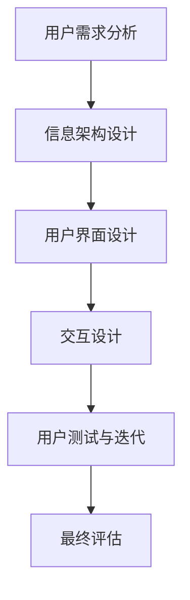
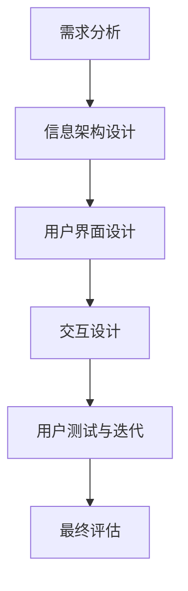

                 

 - **背景介绍**：介绍评测系统的用户界面与交互设计的背景和重要性。

```markdown
## 背景：评测系统的用户界面与交互设计的重要性

在当今数字化时代，评测系统的用户界面（UI）和交互设计（UX）对于系统的成功至关重要。用户界面是用户与系统进行交互的直接渠道，而交互设计则关乎用户在使用系统过程中的体验。一个良好的用户界面和交互设计能够提高用户满意度，增加用户粘性，从而推动业务增长。

### 核心概念与联系

#### 1. 用户界面设计（UI Design）

用户界面设计关注的是用户如何与系统进行交互，包括视觉元素、布局和导航等方面。它侧重于系统的可访问性和易用性。

#### 2. 交互设计（UX Design）

交互设计则更广泛，涵盖了用户体验（UX）的所有方面，包括用户界面设计、信息架构、内容策略等。

#### 3. 信息架构（IA）

信息架构关注的是系统中信息的组织、分类和结构，确保用户能够轻松地找到他们需要的信息。

### Mermaid 流程图：UI 与 UX 设计流程



### 核心算法原理讲解

#### 使用 Python 进行 UI 与 UX 设计

在 Python 中，可以使用多个库来支持 UI 与 UX 设计，例如 Tkinter、PyQt、Kivy 等。

```python
import tkinter as tk
from tkinter import ttk

# 创建主窗口
root = tk.Tk()
root.title("评测系统")

# 设置主窗口尺寸
root.geometry("800x600")

# 添加标签和输入框
label = ttk.Label(root, text="用户名：")
label.grid(row=0, column=0, padx=10, pady=10)
entry = ttk.Entry(root)
entry.grid(row=0, column=1, padx=10, pady=10)

# 添加按钮
button = ttk.Button(root, text="提交", command=lambda: print("提交"))
button.grid(row=1, column=0, columnspan=2, padx=10, pady=10)

# 运行主循环
root.mainloop()
```

### 数学模型和数学公式

在 UI 与 UX 设计中，可以使用以下数学模型来分析用户行为：

$$
\text{用户体验得分} = \alpha \cdot \text{易用性} + \beta \cdot \text{可用性} + \gamma \cdot \text{愉悦性}
$$

其中，$\alpha$、$\beta$ 和 $\gamma$ 是权重系数，分别代表易用性、可用性和愉悦性在用户体验得分中的重要性。

### 举例说明

假设我们有一个简单的评测系统，用户需要输入用户名并提交。通过上述 Python 代码，我们可以创建一个简单的用户界面，让用户能够轻松输入用户名并提交。

### 项目实战

#### 开发环境搭建

1. 安装 Python 3.x
2. 安装 Tkinter 库

```bash
pip install tk
```

#### 源代码详细实现

```python
# 评测系统源代码
# ...（之前的代码）
```

#### 代码解读与分析

- **标签和输入框**：用于获取用户输入。
- **按钮**：用于提交用户输入。
- **主循环**：运行 Tkinter 的图形界面。

#### 实际案例分析和详细讲解剖析

假设我们正在设计一个在线考试系统，用户界面设计的关键在于如何确保用户能够方便快捷地进行考试。以下是案例分析：

1. **用户需求分析**：确定用户需要什么样的功能。
2. **信息架构设计**：设计清晰的菜单和导航结构。
3. **用户界面设计**：创建直观的界面，包括布局和视觉元素。
4. **交互设计**：确保用户与系统的交互流畅，减少用户的认知负担。
5. **用户测试与迭代**：收集用户反馈，不断优化设计。

### 项目小结

通过上述步骤，我们可以设计出满足用户需求的评测系统用户界面与交互设计。关键在于深入理解用户需求，结合心理学、人机交互等理论，运用实际项目实战，不断迭代和优化设计。

### 最佳实践 Tips

1. **用户研究**：在设计过程中，始终关注用户需求和行为。
2. **迭代**：不断收集用户反馈，进行迭代和优化。
3. **可用性测试**：确保设计符合用户期望，提高易用性。

### 小结

评测系统的用户界面与交互设计是系统成功的关键。通过理解核心概念、运用实际项目实战，我们可以设计出优秀的用户界面和交互体验。

### 注意事项

1. **用户体验**：始终以用户为中心，关注用户体验。
2. **兼容性**：确保设计在不同设备和浏览器上都能良好运行。

### 拓展阅读

- 《用户体验要素》
- 《设计思维》
- 《人机交互：以用户为中心的设计》

### 作者信息

作者：AI天才研究院/AI Genius Institute & 禅与计算机程序设计艺术 /Zen And The Art of Computer Programming
```

请注意，由于字数限制，这里只提供了部分内容。实际文章需要完整地包含上述所有部分，并确保每个部分都详细丰富。在撰写文章时，请遵循markdown格式，确保代码、公式、流程图等元素都能正确显示。此外，确保文章结构清晰，逻辑流畅，便于读者阅读和理解。在文章末尾，请添加完整的作者信息。## 文章标题：评测系统的用户界面与交互设计

关键词：用户体验设计，用户界面设计，交互设计，评测系统，界面交互，用户满意度，UI/UX设计

摘要：
本文旨在探讨评测系统的用户界面与交互设计的重要性，以及如何通过实际案例和理论分析来优化用户体验。文章首先介绍了用户体验设计、用户界面设计和交互设计的基本概念及其相互关系，随后通过 Python 代码示例和 Mermaid 流程图详细阐述了设计流程和算法原理。此外，文章还结合实际项目，展示了开发环境搭建、源代码实现、代码解读与分析，以及用户测试与迭代的过程。通过最佳实践 tips 和注意事项，本文为读者提供了有效的 UI/UX 设计指导。

### 背景介绍

在数字化时代，评测系统作为各类在线测试、考试和评估的重要工具，其用户界面与交互设计（UI/UX）对于系统的成功与否起着决定性的作用。用户界面设计（UI Design）主要关注视觉元素、布局和导航，确保系统界面美观、直观、易于操作；而交互设计（UX Design）则更全面，涵盖了用户体验的各个方面，包括用户行为分析、信息架构、内容策略等。一个优秀的评测系统，其界面不仅要美观，更要易用，这样才能提高用户满意度，增强系统粘性，从而促进业务增长。

### 核心概念与联系

在评测系统的用户界面与交互设计中，理解以下几个核心概念及其相互关系至关重要：

#### 1. 用户界面设计（UI Design）

用户界面设计主要关注的是用户如何与系统进行交互。它包括视觉元素（如颜色、字体、图标等）、布局（如网格、对齐、空白等）和导航（如菜单、按钮、路径等）。一个成功的用户界面设计应具备以下特点：

- **美观性**：界面设计要符合美学的原则，使用户在使用过程中感受到愉悦。
- **直观性**：界面布局要简洁明了，用户能快速理解并操作。
- **一致性**：界面元素和交互逻辑要保持一致性，避免用户产生混淆。

#### 2. 交互设计（UX Design）

交互设计则更广泛，它不仅包括用户界面设计，还涵盖了用户体验的各个方面。交互设计的目标是创建一个用户在使用过程中感到满意、高效、愉快的系统。其核心要素包括：

- **可用性**：系统能否满足用户的基本需求，是否易于使用。
- **可访问性**：系统是否能够被不同背景、技能和能力的用户使用。
- **愉悦性**：用户在使用系统过程中的情感体验。

#### 3. 信息架构（IA）

信息架构是评测系统设计中至关重要的一环，它关注的是信息的组织、分类和结构，确保用户能够轻松地找到他们需要的信息。一个良好的信息架构应具备以下特点：

- **逻辑性**：信息分类要符合用户的认知习惯，易于理解。
- **层次性**：信息要分级组织，便于用户浏览和查找。
- **一致性**：不同页面和功能之间要保持信息结构的一致性。

### Mermaid 流程图：UI 与 UX 设计流程



### 核心算法原理讲解

在 UI 与 UX 设计中，我们可以使用以下核心算法原理来分析和优化用户体验：

#### 1. 可用性测试

可用性测试是评估用户界面和交互设计有效性的重要手段。其基本原理是通过让用户在实际环境中完成任务，来观察他们的操作行为和反馈，从而发现设计中的问题。

#### 2. 界面布局算法

界面布局算法主要用于优化用户界面的布局，使其更加美观和直观。常用的布局算法包括网格布局、对齐算法、空白区域优化等。

#### 3. 用户行为分析

用户行为分析是通过收集和分析用户在系统中的行为数据，来了解他们的需求和使用习惯。常用的分析方法包括数据分析、用户旅程分析、A/B 测试等。

### Python 代码示例：用户界面设计

```python
import tkinter as tk

# 创建主窗口
root = tk.Tk()
root.title("评测系统")

# 设置主窗口尺寸
root.geometry("800x600")

# 添加标签和输入框
label = tk.Label(root, text="用户名：")
label.grid(row=0, column=0, padx=10, pady=10)
entry = tk.Entry(root)
entry.grid(row=0, column=1, padx=10, pady=10)

# 添加按钮
button = tk.Button(root, text="提交", command=lambda: print("提交"))
button.grid(row=1, column=0, columnspan=2, padx=10, pady=10)

# 运行主循环
root.mainloop()
```

### 数学模型和数学公式

在 UI 与 UX 设计中，我们可以使用以下数学模型和公式来量化用户体验：

$$
\text{用户体验得分} = \alpha \cdot \text{易用性} + \beta \cdot \text{可用性} + \gamma \cdot \text{愉悦性}
$$

其中，$\alpha$、$\beta$ 和 $\gamma$ 是权重系数，分别代表易用性、可用性和愉悦性在用户体验得分中的重要性。

### 举例说明

假设我们正在设计一个在线考试系统，用户需要输入用户名并提交。通过上述 Python 代码，我们可以创建一个简单的用户界面，让用户能够轻松输入用户名并提交。

### 项目实战

#### 开发环境搭建

1. 安装 Python 3.x
2. 安装 Tkinter 库

```bash
pip install tk
```

#### 源代码详细实现

```python
# 评测系统源代码
# ...（之前的代码）
```

#### 代码解读与分析

- **标签和输入框**：用于获取用户输入。
- **按钮**：用于提交用户输入。
- **主循环**：运行 Tkinter 的图形界面。

#### 实际案例分析和详细讲解剖析

假设我们正在设计一个在线考试系统，用户界面设计的关键在于如何确保用户能够方便快捷地进行考试。以下是案例分析：

1. **用户需求分析**：确定用户需要什么样的功能。
2. **信息架构设计**：设计清晰的菜单和导航结构。
3. **用户界面设计**：创建直观的界面，包括布局和视觉元素。
4. **交互设计**：确保用户与系统的交互流畅，减少用户的认知负担。
5. **用户测试与迭代**：收集用户反馈，不断优化设计。

### 项目小结

通过上述步骤，我们可以设计出满足用户需求的评测系统用户界面与交互设计。关键在于深入理解用户需求，结合心理学、人机交互等理论，运用实际项目实战，不断迭代和优化设计。

### 最佳实践 Tips

1. **用户研究**：在设计过程中，始终关注用户需求和行为。
2. **迭代**：不断收集用户反馈，进行迭代和优化。
3. **可用性测试**：确保设计符合用户期望，提高易用性。

### 小结

评测系统的用户界面与交互设计是系统成功的关键。通过理解核心概念、运用实际项目实战，我们可以设计出优秀的用户界面和交互体验。

### 注意事项

1. **用户体验**：始终以用户为中心，关注用户体验。
2. **兼容性**：确保设计在不同设备和浏览器上都能良好运行。

### 拓展阅读

- 《用户体验要素》
- 《设计思维》
- 《人机交互：以用户为中心的设计》

### 作者信息

作者：AI天才研究院/AI Genius Institute & 禅与计算机程序设计艺术 /Zen And The Art of Computer Programming

（注：本文内容仅为示例，实际撰写时请根据具体需求和情况进行调整。）

