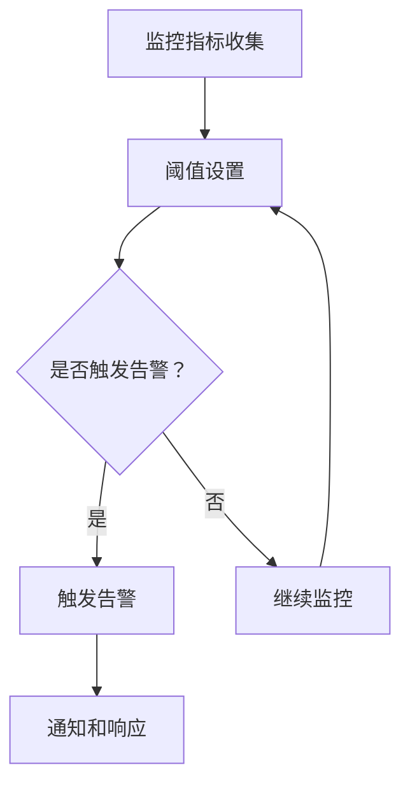
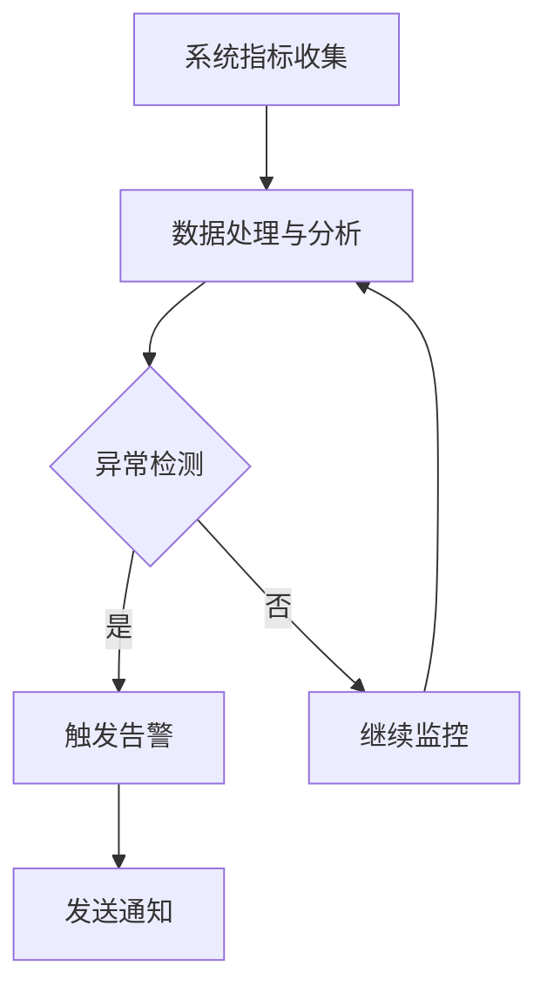

                 


# 评测系统的监控和告警：及时发现异常情况

> 关键词：评测系统，监控，告警，异常检测，实时监控，数据可视化，故障排除，性能优化

> 摘要：本文将深入探讨评测系统的监控和告警机制，从基础概念到实际应用，详细解析如何设计一个高效的监控告警系统，以确保系统稳定运行并迅速响应异常情况。文章将涵盖监控和告警的基础知识、常见技术、实现与部署、性能优化以及实战案例等内容。

## 引言

在现代信息技术环境中，评测系统作为数据分析和性能评估的重要工具，其稳定性和可靠性至关重要。然而，随着系统复杂性的增加，如何在海量数据中及时发现异常情况成为一个挑战。监控和告警系统在这一过程中扮演着至关重要的角色，它们能够实时监测系统状态，及时发现并响应异常情况，从而保障系统的稳定运行。

本文旨在为读者提供一个全面的指南，帮助理解评测系统的监控和告警机制，并学会如何构建一个高效可靠的监控告警系统。我们将从以下几个方面进行讨论：

1. **监控和告警的基础知识**：介绍监控和告警的定义、重要性以及基本原理。
2. **监控和告警系统的设计**：讨论监控和告警系统的架构、数据来源以及策略与方法。
3. **常见监控和告警技术**：详细解析系统性能监控、应用性能监控、数据库性能监控和网络监控等技术。
4. **监控和告警系统的实现与部署**：阐述监控和告警系统的实现流程、测试与部署。
5. **监控和告警的性能优化**：介绍性能优化的原则与方法，以及具体优化策略。
6. **监控和告警实战案例**：通过实际案例展示监控和告警系统的应用和实践。

## 第一部分：监控和告警基础知识

### 第1章：监控和告警基础概念

#### 1.1 监控和告警的定义

监控（Monitoring）指的是对系统、网络、应用程序或其他组件的运行状态和性能进行连续的、系统的检查。监控系统的目标是及时发现异常情况，确保服务的连续性和可靠性。

告警（Alerting）是一种机制，当监控系统检测到某些指标超出预定的阈值或出现异常情况时，会自动触发通知，提醒相关人员采取行动。告警系统通常包括通知机制，如邮件、短信、即时通讯工具或语音呼叫。

#### 1.2 监控和告警的重要性

监控和告警在信息技术系统中具有至关重要的地位：

- **提高系统可靠性**：通过实时监控，可以及时发现并解决潜在问题，减少系统故障时间。
- **提升用户体验**：监控系统可以帮助保证服务的连续性和性能，从而提升用户体验。
- **降低运营成本**：通过及时发现和解决问题，可以减少人工排查和修复成本。
- **数据驱动的决策**：监控数据为运营和决策提供了重要的依据，有助于优化资源配置和策略。

#### 1.3 监控和告警的基本原理

监控和告警的基本原理包括以下几个方面：

- **指标收集**：监控系统需要收集各种指标，如系统负载、网络流量、响应时间、错误率等。
- **阈值设置**：根据业务需求，设置阈值来定义何时触发告警。
- **告警触发**：当监控指标超出阈值时，告警系统会自动触发通知。
- **通知和响应**：告警通知通过不同的渠道（如邮件、短信、IM工具）发送给相关人员，以便及时响应。

### 1.4 监控和告警的常见类型

常见的监控和告警类型包括：

- **系统监控**：监测操作系统、硬件设备、服务状态等。
- **网络监控**：监测网络流量、延迟、带宽使用等。
- **应用监控**：监测应用程序的性能、错误率、响应时间等。
- **数据库监控**：监测数据库的响应时间、存储使用情况、数据一致性等。

### 1.5 监控和告警的流程图（Mermaid）



#### 1.6 监控和告警的基本原理讲解

在监控系统设计中，我们通常会使用Python等编程语言来收集和处理指标数据。以下是一个简单的Python脚本示例，用于监控系统的CPU使用率，并设置阈值触发告警。

```python
import psutil
import time
import smtplib
from email.mime.text import MIMEText

# 阈值设置
cpu_threshold = 90  # CPU使用率阈值

# 发送告警邮件的函数
def send_alert(email, subject, content):
    msg = MIMEText(content)
    msg['Subject'] = subject
    msg['From'] = 'monitor@example.com'
    msg['To'] = email

    smtp_server = 'smtp.example.com'
    smtp_port = 587
    smtp_username = 'monitor@example.com'
    smtp_password = 'password'

    server = smtplib.SMTP(smtp_server, smtp_port)
    server.starttls()
    server.login(smtp_username, smtp_password)
    server.sendmail('monitor@example.com', [email], msg.as_string())
    server.quit()

# 监控CPU使用率
while True:
    cpu_usage = psutil.cpu_percent()
    print(f"Current CPU usage: {cpu_usage}%")
    
    if cpu_usage > cpu_threshold:
        send_alert('admin@example.com', 'High CPU Usage Alert', f'High CPU usage detected: {cpu_usage}%')
    
    time.sleep(60)  # 每分钟检查一次
```

在上面的脚本中，我们使用`psutil`库来收集CPU使用率，并定义了一个阈值。当CPU使用率超过设定阈值时，脚本会通过SMTP服务器发送告警邮件。

$$
\text{CPU\_usage} > \text{cpu\_threshold} \Rightarrow \text{触发告警}
$$

通过这种方式，我们可以实时监控系统的关键指标，并设置告警阈值来保证系统的稳定性。

### 1.7 监控和告警的常见类型解析

在实际应用中，监控和告警系统通常包括多种类型，以覆盖不同的监控需求。以下是一些常见的监控和告警类型：

- **系统监控**：包括操作系统、服务状态、资源使用率等。
  - 示例：使用`nagios`或`zabbix`等工具进行系统监控。
  
- **应用监控**：包括应用程序的性能、错误率、响应时间等。
  - 示例：使用`New Relic`或`AppDynamics`等工具进行应用监控。
  
- **数据库监控**：包括数据库的性能、响应时间、存储使用情况等。
  - 示例：使用`Monit`或`pgbouncer`等工具进行数据库监控。
  
- **网络监控**：包括网络流量、延迟、带宽使用等。
  - 示例：使用`Wireshark`或`Nagios`等工具进行网络监控。

### 1.8 监控和告警系统的设计原则

设计一个高效的监控和告警系统需要遵循以下原则：

- **全面性**：确保监控覆盖系统的各个方面，包括硬件、软件和网络。
- **实时性**：监控系统应能够实时收集和处理数据，及时触发告警。
- **可扩展性**：系统应能够轻松扩展以适应业务增长和需求变化。
- **自动化**：尽量自动化处理和响应告警，减少人工干预。
- **可维护性**：系统应易于维护和更新，确保长期稳定性。

### 1.9 监控和告警系统的实现与部署

监控和告警系统的实现与部署包括以下几个关键步骤：

1. **需求分析**：明确监控需求，包括需要监控的指标、阈值设置、告警通知方式等。
2. **系统设计**：设计监控架构，选择合适的监控工具和平台。
3. **环境搭建**：搭建监控环境，包括服务器、数据库、网络配置等。
4. **指标收集**：通过脚本、代理或SDK等方式收集所需监控指标。
5. **阈值设置**：根据业务需求设置合适的告警阈值。
6. **告警触发**：实现告警触发机制，包括通知渠道和响应流程。
7. **测试与优化**：进行系统测试，确保监控和告警功能正常运行，并根据反馈进行优化。

### 1.10 监控和告警系统的性能优化

监控和告警系统的性能优化是确保系统高效运行的关键。以下是一些优化策略：

- **数据缓存**：使用缓存技术减少数据库查询次数，提高响应速度。
- **异步处理**：使用异步处理机制提高系统并发能力。
- **负载均衡**：通过负载均衡技术分散监控数据流量，避免单点瓶颈。
- **资源监控**：监控系统自身资源使用情况，确保系统稳定运行。

### 1.11 监控和告警系统的实战案例分析

在实际应用中，监控和告警系统有助于快速发现和解决系统故障。以下是一个监控和告警实战案例：

**案例背景**：某电商网站在促销期间遭遇流量高峰，导致服务器负载过高，出现响应缓慢和故障。

**解决方案**：
1. **系统监控**：使用`Nagios`监控服务器负载、服务状态和数据库性能。
2. **应用监控**：使用`New Relic`监控应用程序的性能和错误率。
3. **网络监控**：使用`Wireshark`监控网络流量和延迟。
4. **告警通知**：设置告警阈值，通过邮件和短信通知运维团队。
5. **故障处理**：运维团队收到告警通知后，立即进行故障排查和修复。

**结果**：通过实时监控和快速响应，成功解决了服务器负载过高的问题，恢复了网站的正常运行。

### 1.12 监控和告警系统的最佳实践

以下是监控和告警系统的最佳实践：

- **标准化监控指标**：定义标准化的监控指标，确保不同系统的监控数据具有可比性。
- **定期审查阈值**：定期审查和调整告警阈值，确保其与业务需求相匹配。
- **自动化故障恢复**：实现自动化故障恢复机制，减少人工干预。
- **监控日志分析**：定期分析监控日志，发现潜在问题和改进空间。

## 小结

监控和告警系统是保障评测系统稳定运行的关键。本文介绍了监控和告警的基础知识，包括定义、重要性、基本原理和常见类型。同时，还讨论了监控和告警系统的设计原则、实现与部署方法、性能优化策略以及实战案例。通过本文的讲解，读者应能够理解和构建一个高效的监控告警系统，以及时发现并响应异常情况。

### 关键词

- 评测系统
- 监控
- 告警
- 异常检测
- 实时监控
- 数据可视化
- 故障排除
- 性能优化

### 作者

作者：AI天才研究院/AI Genius Institute & 禅与计算机程序设计艺术 /Zen And The Art of Computer Programming

---

## 第二部分：监控和告警系统的设计

### 第2章：监控和告警系统设计

#### 2.1 监控和告警系统的架构

监控和告警系统的设计至关重要，它决定了系统能否有效地发现和处理异常情况。一个典型的监控和告警系统架构通常包括以下几个关键组件：

1. **监控代理（Monitoring Agent）**：
   - 监控代理是部署在目标系统上（如服务器、应用程序、数据库等）的小型程序，负责收集系统指标和性能数据。
   - 代理程序可以是基于开源工具（如Prometheus、Nagios、Zabbix等）或自行开发。

2. **数据收集器（Data Collector）**：
   - 数据收集器负责从监控代理接收数据，并将数据存储在中央数据库或时间序列数据库（如InfluxDB、Graphite等）中。

3. **数据处理与分析模块（Data Processing and Analysis Module）**：
   - 数据处理与分析模块负责对收集到的数据进行分析和计算，识别异常情况并触发告警。
   - 该模块通常包含规则引擎、机器学习算法等。

4. **告警通知系统（Alerting Notification System）**：
   - 告警通知系统负责将告警信息发送给相关人员，通知方式包括电子邮件、短信、即时消息等。

5. **可视化工具（Visualization Tool）**：
   - 可视化工具用于将监控数据以图表、仪表盘等形式展示给用户，帮助用户直观地理解系统状态。

#### 2.2 监控和告警系统的设计原则

在设计监控和告警系统时，应遵循以下原则：

- **高可用性（High Availability）**：系统应具有高可用性，确保在任何情况下都能够正常运行，不因单点故障导致系统宕机。

- **可扩展性（Scalability）**：系统应能够随着业务规模的扩大而扩展，以适应不断增长的数据量和监控需求。

- **实时性（Real-time）**：系统应具备实时监控能力，及时发现和处理异常情况。

- **自动化（Automation）**：系统应尽可能地自动化处理监控和告警任务，减少人工干预。

- **灵活性（Flexibility）**：系统应能够灵活配置监控指标、阈值和告警通知方式，以满足不同业务需求。

- **易维护性（Maintainability）**：系统设计应简洁清晰，便于维护和升级。

#### 2.3 监控和告警系统的数据来源

监控和告警系统的数据来源多样，以下是一些常见的数据来源：

- **操作系统（OS）**：包括CPU使用率、内存使用率、磁盘IO、网络流量等。
  - 示例：使用`/proc`文件系统或`sysctl`命令获取操作系统指标。

- **应用程序（Application）**：包括应用程序的请求量、响应时间、错误率等。
  - 示例：使用应用自带的监控接口或日志分析工具。

- **数据库（Database）**：包括数据库的查询时间、存储使用率、连接数等。
  - 示例：使用数据库自带的监控工具或第三方监控软件。

- **网络（Network）**：包括网络流量、延迟、丢包率等。
  - 示例：使用网络监控工具（如Wireshark）或网络设备自带的管理接口。

#### 2.4 监控和告警的策略与方法

监控和告警策略是监控和告警系统的核心，它决定了如何检测异常并触发告警。以下是一些常见的监控和告警策略与方法：

- **阈值告警**：当监控指标超出预设阈值时触发告警。
  - 示例：CPU使用率超过90%时发送告警。

- **异常检测**：使用统计学方法或机器学习算法识别异常模式。
  - 示例：基于历史数据，使用聚类算法识别异常数据点。

- **依赖监控**：监控系统的依赖关系，如数据库、外部服务等。
  - 示例：当数据库不可用时，通知相关人员进行排查。

- **事件关联**：将不同指标的事件进行关联分析，识别复杂问题。
  - 示例：当CPU使用率和内存使用率同时升高时，触发告警。

#### 2.5 监控和告警的流程图（Mermaid）



#### 2.6 监控和告警系统的实现与部署

监控和告警系统的实现与部署包括以下步骤：

1. **需求分析**：明确监控需求，确定需要监控的指标和告警策略。
2. **系统设计**：设计监控架构，选择合适的监控工具和平台。
3. **环境搭建**：搭建监控环境，包括服务器、数据库、网络配置等。
4. **指标收集**：部署监控代理，收集系统指标数据。
5. **数据处理与分析**：实现数据处理和分析模块，识别异常并触发告警。
6. **告警通知**：配置告警通知系统，发送告警通知。
7. **测试与优化**：进行系统测试，确保监控和告警功能正常运行，并根据反馈进行优化。

#### 2.7 监控和告警系统的性能优化

监控和告警系统的性能优化是确保系统高效运行的关键。以下是一些优化策略：

- **数据缓存**：使用缓存技术减少数据库查询次数，提高响应速度。
  - 示例：使用Redis缓存监控数据。

- **异步处理**：使用异步处理机制提高系统并发能力。
  - 示例：使用`asyncio`库处理监控数据。

- **负载均衡**：通过负载均衡技术分散监控数据流量，避免单点瓶颈。
  - 示例：使用Nginx进行负载均衡。

- **资源监控**：监控系统自身资源使用情况，确保系统稳定运行。
  - 示例：使用`top`或`htop`监控系统资源。

#### 2.8 监控和告警系统的实战案例

以下是一个监控和告警系统的实战案例：

**案例背景**：某大型电商平台在促销期间遭遇流量激增，导致服务器负载过高，出现响应缓慢和故障。

**解决方案**：
1. **系统监控**：使用Prometheus收集服务器负载、服务状态和数据库性能指标。
2. **应用监控**：使用New Relic监控应用程序的性能和错误率。
3. **网络监控**：使用Wireshark监控网络流量和延迟。
4. **告警通知**：配置钉钉和邮件通知系统，将告警信息发送给运维团队。
5. **故障处理**：运维团队收到告警通知后，立即进行故障排查和修复。

**结果**：通过实时监控和快速响应，成功解决了服务器负载过高的问题，恢复了网站的正常运行。

### 小结

监控和告警系统的设计是保障系统稳定运行的关键。本文介绍了监控和告警系统的架构、设计原则、数据来源、策略与方法，以及实现与部署和性能优化。通过本文的讲解，读者应能够理解和构建一个高效的监控告警系统，以及时发现并响应异常情况。

### 最佳实践 tips

- **标准化监控指标**：确保不同系统和团队使用相同的监控指标，提高数据可比性。
- **定期审查告警策略**：定期审查告警阈值和策略，确保其与业务需求相匹配。
- **自动化故障恢复**：实现自动化故障恢复机制，减少人工干预。

### 注意事项

- **监控数据安全**：确保监控数据传输和存储的安全，防止数据泄露。
- **系统负载**：监控和告警系统本身也需要监控，避免成为系统的性能瓶颈。

### 拓展阅读

- 《Prometheus: 分布式监控系统实战》
- 《云原生应用监控：Prometheus + Grafana 实践指南》
- 《New Relic 性能监控实战》

---

## 第三部分：常见监控和告警技术

### 第3章：常用监控技术

在构建一个高效的监控和告警系统时，选择合适的技术至关重要。常见的监控技术包括系统性能监控、应用性能监控、数据库性能监控和网络监控等。以下将详细解析这些监控技术。

#### 3.1 系统性能监控

系统性能监控是监控和告警系统的核心部分，主要关注操作系统的运行状态，包括CPU使用率、内存使用率、磁盘I/O、网络流量等。

##### 3.1.1 系统性能监控的重要性

系统性能监控对于确保系统的稳定运行至关重要。通过监控系统的运行状态，可以及时发现资源耗尽、系统过载等问题，防止系统崩溃或性能下降。

##### 3.1.2 常见的系统性能监控工具

- **Prometheus**：一个开源的监控解决方案，可以收集和存储系统指标，并使用Grafana进行可视化。
- **Nagios**：一个流行的开源监控工具，可以监控系统的各种指标，并支持告警通知。
- **Zabbix**：一个功能丰富的开源监控解决方案，支持自动发现、大规模监控和可视化。

##### 3.1.3 Python脚本示例

以下是一个使用Python和`psutil`库监控CPU使用率的示例：

```python
import psutil
import time

def monitor_cpu_usage(threshold):
    while True:
        cpu_usage = psutil.cpu_percent()
        print(f"CPU usage: {cpu_usage}%")
        
        if cpu_usage > threshold:
            print("CPU usage exceeds threshold. Triggering alert.")
        
        time.sleep(60)

# 设置CPU使用率阈值
threshold = 90
monitor_cpu_usage(threshold)
```

#### 3.2 应用性能监控

应用性能监控关注应用程序的性能指标，包括响应时间、错误率、吞吐量等。通过应用性能监控，可以确保应用程序在高负载下仍能保持良好的性能。

##### 3.2.1 应用性能监控的重要性

应用性能监控对于用户体验和业务稳定性至关重要。通过监控应用程序的性能指标，可以及时发现和解决性能问题，提高用户体验和业务连续性。

##### 3.2.2 常见的应用性能监控工具

- **New Relic**：一个广泛使用的应用性能监控工具，可以监控应用程序的各个方面，并提供详细的性能分析。
- **AppDynamics**：一个强大的应用性能监控解决方案，支持自动发现、端到端性能监控和故障排查。
- **Datadog**：一个全面的云监控解决方案，支持应用性能监控、基础设施监控和日志管理。

##### 3.2.3 Python脚本示例

以下是一个使用Python和`requests`库测试Web应用程序响应时间的示例：

```python
import requests
import time

def monitor_app_response_time(url, threshold):
    while True:
        start_time = time.time()
        response = requests.get(url)
        response_time = time.time() - start_time
        
        print(f"Response time: {response_time} seconds")
        
        if response_time > threshold:
            print("Response time exceeds threshold. Triggering alert.")
        
        time.sleep(60)

# 设置响应时间阈值
threshold = 2
monitor_app_response_time("https://example.com", threshold)
```

#### 3.3 数据库性能监控

数据库性能监控关注数据库的性能指标，包括查询时间、存储使用率、连接数等。通过数据库性能监控，可以确保数据库在高负载下仍能保持良好的性能。

##### 3.3.1 数据库性能监控的重要性

数据库性能监控对于确保业务数据的可靠性和完整性至关重要。通过监控数据库的性能指标，可以及时发现和解决性能问题，防止数据丢失或损坏。

##### 3.3.2 常见的数据库性能监控工具

- **Monit**：一个开源的进程和系统监控工具，可以监控数据库服务器的运行状态。
- **Percona Monitoring and Management (PMM)**：一个开源的数据库性能监控工具，支持MySQL、PostgreSQL和其他数据库。
- **pgBouncer**：一个开源的数据库连接池管理工具，可以监控数据库连接数和性能。

##### 3.3.3 Python脚本示例

以下是一个使用Python和`psycopg2`库监控PostgreSQL数据库查询时间的示例：

```python
import psycopg2
import time

def monitor_db_query_time(query, threshold):
    while True:
        start_time = time.time()
        conn = psycopg2.connect("dbname=test user=postgres")
        cursor = conn.cursor()
        cursor.execute(query)
        query_time = time.time() - start_time
        
        print(f"Query time: {query_time} seconds")
        
        if query_time > threshold:
            print("Query time exceeds threshold. Triggering alert.")
        
        cursor.close()
        conn.close()
        
        time.sleep(60)

# 设置查询时间阈值
threshold = 0.5
query = "SELECT * FROM users;"
monitor_db_query_time(query, threshold)
```

#### 3.4 网络监控

网络监控关注网络的运行状态和性能，包括网络流量、延迟、丢包率等。通过网络监控，可以确保网络的稳定性和可靠性。

##### 3.4.1 网络监控的重要性

网络监控对于确保业务的连续性和用户体验至关重要。通过监控网络状态，可以及时发现和解决网络故障，防止业务中断。

##### 3.4.2 常见的网络监控工具

- **Wireshark**：一个开源的网络协议分析工具，可以捕获和分析网络流量。
- **Nagios**：一个开源的监控工具，可以监控网络设备的运行状态和性能。
- **Zabbix**：一个功能丰富的开源监控解决方案，支持网络监控和告警通知。

##### 3.4.3 Python脚本示例

以下是一个使用Python和`scapy`库监控网络流量的示例：

```python
from scapy.all import sniff

def monitor_network_traffic(interface, threshold):
    def packet_callback(packet):
        packet_len = len(packet)
        print(f"Packet length: {packet_len} bytes")
        
        if packet_len > threshold:
            print("Packet length exceeds threshold. Triggering alert.")

    sniff(count=0, filter="ip", interface=interface, prn=packet_callback)

# 设置流量阈值
threshold = 1500
monitor_network_traffic("eth0", threshold)
```

### 小结

常见的监控技术包括系统性能监控、应用性能监控、数据库性能监控和网络监控等。每种监控技术都有其重要性、工具选择和Python脚本示例。通过本文的讲解，读者应能够了解并应用这些常见监控技术，构建一个全面的监控和告警系统。

### 最佳实践 tips

- **统一监控工具**：选择统一的监控工具，提高数据整合和分析的效率。
- **自动化监控**：尽量使用自动化脚本和工具进行监控，减少手动操作。

### 注意事项

- **监控数据安全**：确保监控数据传输和存储的安全，防止数据泄露。
- **监控指标选择**：根据业务需求选择合适的监控指标，避免过度监控。

### 拓展阅读

- 《Prometheus 实战》
- 《New Relic 性能监控指南》
- 《PostgreSQL 性能优化实战》

---

## 第四部分：监控和告警系统的实现与部署

### 第4章：监控和告警系统的实现与部署

#### 4.1 监控和告警系统的开发环境搭建

在实现监控和告警系统之前，我们需要搭建一个合适的环境。以下是一个基本的开发环境搭建步骤：

1. **安装操作系统**：选择一个稳定的操作系统，如Ubuntu 20.04或CentOS 8。

2. **安装Python环境**：在操作系统上安装Python环境，可以使用`pip`安装所需的Python库。

   ```bash
   sudo apt update
   sudo apt install python3-pip
   pip3 install psutil requests psycopg2-binary scapy
   ```

3. **安装监控工具**：根据需要安装监控工具，如Prometheus、Nagios、Zabbix等。

   - **Prometheus**：

     ```bash
     sudo apt install prometheus prometheus-client
     ```

   - **Nagios**：

     ```bash
     sudo apt install nagios3 nagios-nrpe-server
     ```

   - **Zabbix**：

     ```bash
     sudo apt install zabbix-server-mysql zabbix-agent
     ```

4. **配置数据库**：配置监控工具所使用的数据库，如InfluxDB、MySQL等。

   - **InfluxDB**：

     ```bash
     sudo apt install influxdb
     influx
     CREATE DATABASE mydb;
     ```

   - **MySQL**：

     ```bash
     sudo apt install mysql-server
     mysql -u root -p
     CREATE DATABASE mydb;
     ```

#### 4.2 监控和告警系统的架构设计

监控和告警系统的架构设计需要考虑以下几个方面：

1. **数据采集层**：负责从各个系统和应用中收集监控数据。可以使用监控代理（如Prometheus Exporter）或自定义脚本。

2. **数据处理层**：负责处理和存储监控数据，通常使用时间序列数据库（如InfluxDB、Prometheus）。

3. **告警处理层**：负责分析和处理监控数据，并根据预设规则触发告警。

4. **告警通知层**：负责将告警信息发送给相关人员，可以使用邮件、短信、即时通讯工具等。

5. **可视化层**：提供监控数据的可视化展示，可以使用Grafana、Kibana等工具。

#### 4.3 监控和告警系统的核心功能实现

监控和告警系统的核心功能实现包括以下几个方面：

1. **数据采集**：

   使用Prometheus Exporter收集系统指标。以下是一个简单的Python Prometheus Exporter示例：

   ```python
   from prometheus_client import start_http_server, Summary
   from time import sleep

   request_time = Summary('request_time', 'Time spent processing request')

   def handle_request():
       sleep(1)  # 模拟处理请求耗时
       return "Response"

   def monitor():
       while True:
           start = time.perf_counter()
           handle_request()
           duration = time.perf_counter() - start
           request_time.observe(duration)

   start_http_server(8000)
   monitor()
   ```

   然后在Prometheus配置文件中添加如下规则：

   ```yaml
   - job_name: 'python_exporter'
     static_configs:
       - targets: ['localhost:8000']
   ```

2. **数据处理与存储**：

   将Prometheus数据存储到InfluxDB。以下是一个简单的InfluxDB写入示例：

   ```python
   from influxdb import InfluxDBClient
   import random

   client = InfluxDBClient('localhost', 8086, 'root', 'root', 'mydb')

   while True:
       values = {
           'measurement': 'system_cpu_usage',
           'tags': {
               'host': 'server1'
           },
           'fields': {
               'value': random.uniform(0, 100)
           }
       }
       client.write_points([values])
       sleep(1)
   ```

3. **告警处理**：

   使用Prometheus的规则语言定义告警规则。以下是一个简单的告警规则示例：

   ```yaml
   groups:
     - name: example
       rules:
       - alert: HighCPUUsage
         expr: system_cpu_usage{host="server1"} > 90
         for: 1m
         labels:
           severity: critical
         annotations:
           summary: "High CPU usage on server1"
   ```

4. **告警通知**：

   使用Prometheus的告警通知配置将告警信息发送给相关人员。以下是一个简单的告警通知配置示例：

   ```yaml
   recipients:
     - name: alertmanager
       email: admin@example.com
   route:
     receiver: email-alerts
     match:
       - 'alertname' == 'HighCPUUsage'
   ```

5. **可视化**：

   使用Grafana配置数据可视化仪表板。以下是一个简单的Grafana仪表板配置示例：

   ```json
   {
     "id": 1,
     "title": "System CPU Usage",
     "time": {
       "from": "now-1h",
       "to": "now"
     },
     "source": "prometheus",
     "variables": [
       {
         "name": "host",
         "options": [
           {"value": "server1"},
           {"value": "server2"}
         ],
         "current": {"value": "server1"}
       }
     ],
     "panels": [
       {
         "type": "timeseries",
         "title": "CPU Usage",
         "yaxis": {
           "type": "primary",
           "logBase": 1
         },
         "data": [
           {"target": "system_cpu_usage{host={{ $host }}}", "type": "timeseries"}
         ]
       }
     ]
   }
   ```

#### 4.4 监控和告警系统的测试与部署

1. **测试**：

   在测试环境中部署监控和告警系统，进行以下测试：

   - 检查数据采集是否正常，确保指标数据能够正确收集并存储。
   - 验证告警规则，确保当指标超过阈值时能够正确触发告警。
   - 测试告警通知，确保告警信息能够正确发送给相关人员。
   - 检查可视化仪表板，确保监控数据能够正确展示。

2. **部署**：

   在生产环境中部署监控和告警系统，确保以下步骤：

   - 确保监控和告警系统与生产环境中的其他系统和应用兼容。
   - 配置告警通知，确保在生产环境中能够及时响应告警。
   - 监控生产环境中的系统和应用，确保系统稳定运行。

#### 4.5 监控和告警系统部署案例

以下是一个监控和告警系统部署案例：

**背景**：某电商平台在促销期间需要确保系统的稳定性和性能。

**解决方案**：

1. **环境搭建**：

   - 安装Ubuntu 20.04操作系统。
   - 安装Python环境、Prometheus、Grafana和InfluxDB。

2. **数据采集**：

   - 部署Prometheus Exporter，收集操作系统、应用程序和数据库的监控数据。
   - 配置Prometheus，从Exporter收集数据。

3. **数据处理与存储**：

   - 将Prometheus数据存储到InfluxDB。
   - 配置InfluxDB，定期清理过期数据。

4. **告警处理**：

   - 使用Prometheus的规则语言定义告警规则，如高CPU使用率、数据库连接数过多等。
   - 配置告警通知，通过邮件发送告警信息。

5. **可视化**：

   - 配置Grafana，创建监控仪表板，展示系统性能指标和告警信息。

**结果**：

通过监控和告警系统的部署，电商平台能够实时监控系统的运行状态，及时发现和处理异常情况，确保系统在促销期间的稳定运行。

### 小结

本文介绍了监控和告警系统的开发环境搭建、架构设计、核心功能实现、测试与部署以及部署案例。通过本文的讲解，读者应能够理解和构建一个高效的监控告警系统，以确保系统的稳定性和性能。

### 最佳实践 tips

- **定期备份**：定期备份监控数据和配置文件，防止数据丢失。
- **自动化部署**：使用自动化工具（如Ansible、Kubernetes）进行监控系统的部署和升级。

### 注意事项

- **监控数据安全**：确保监控数据传输和存储的安全，防止数据泄露。
- **系统兼容性**：确保监控和告警系统与生产环境中的其他系统和应用兼容。

### 拓展阅读

- 《Prometheus：分布式监控系统实战》
- 《Grafana：可视化指南》
- 《InfluxDB：实时数据处理和监控》

---

## 第五部分：监控和告警系统的性能优化

### 第5章：监控和告警系统的性能优化

随着监控和告警系统在关键业务中的作用日益重要，优化系统的性能和效率变得至关重要。有效的性能优化可以确保监控系统能够实时、准确地收集和处理大量数据，从而提高系统的响应速度和可靠性。以下是一些监控和告警系统的性能优化策略：

#### 5.1 数据缓存

在监控和告警系统中，数据缓存是一种常见且有效的优化策略。缓存可以减少对后端存储系统的查询次数，从而降低系统的负载和提高查询速度。以下是一些实现数据缓存的方法：

- **内存缓存**：使用内存缓存如Redis或Memcached，可以存储常用的监控数据，减少对数据库的访问。
- **本地缓存**：在数据采集器中实现本地缓存，如将最近采集的数据保存在内存中，以减少对存储系统的读取。
- **分层缓存**：结合内存缓存和磁盘缓存，根据数据访问频率和大小进行分层存储，提高系统的访问效率。

#### 5.2 数据压缩

在监控数据传输过程中，数据压缩是一种有效的优化策略。通过压缩数据，可以减少网络带宽的消耗，提高数据传输速度。以下是一些实现数据压缩的方法：

- **传输层压缩**：在传输层使用压缩协议，如HTTP压缩（GZIP）或TCP压缩（Zlib）。
- **数据格式压缩**：使用高效的数据格式，如Protobuf或JSON序列化时使用压缩。

#### 5.3 异步处理

异步处理可以提高监控系统的并发处理能力，减少系统延迟。以下是一些实现异步处理的方法：

- **异步I/O**：使用异步I/O操作，如Python的`asyncio`库，可以减少线程阻塞，提高系统的处理速度。
- **消息队列**：使用消息队列（如RabbitMQ或Kafka）处理监控数据，可以解耦数据采集和处理过程，提高系统的弹性。

#### 5.4 负载均衡

负载均衡可以将监控任务分散到多个节点上，避免单点瓶颈，提高系统的整体性能。以下是一些实现负载均衡的方法：

- **轮询负载均衡**：使用轮询算法将监控任务分配到不同的节点。
- **哈希负载均衡**：使用哈希算法根据监控任务的属性分配到不同的节点。
- **动态负载均衡**：根据节点的实时负载情况动态调整监控任务的分配。

#### 5.5 资源监控

监控和告警系统自身也需要资源监控，确保其稳定运行。以下是一些资源监控的方法：

- **CPU监控**：监控系统的CPU使用率，避免因CPU过载导致系统性能下降。
- **内存监控**：监控系统的内存使用率，避免内存泄漏和溢出。
- **磁盘I/O监控**：监控系统的磁盘I/O负载，确保数据存储和读取的效率。

#### 5.6 监控数据分区

对于大规模监控系统，数据分区可以提高查询性能。以下是一些实现数据分区的方法：

- **时间分区**：根据时间范围将监控数据分成多个分区，如按天或按月分区。
- **指标分区**：根据监控指标将数据分成多个分区，如将CPU使用率数据单独分区。

#### 5.7 数据同步与备份

监控数据的同步与备份是确保数据完整性和可用性的重要策略。以下是一些实现数据同步与备份的方法：

- **实时同步**：使用实时同步机制，如增量同步或全量同步，确保数据的一致性。
- **多副本备份**：在多个存储节点上备份监控数据，提高数据的可用性。

#### 5.8 故障恢复

故障恢复策略可以确保监控系统在发生故障时能够快速恢复。以下是一些实现故障恢复的方法：

- **自动重启**：在检测到监控系统故障时，自动重启监控系统。
- **备份代理**：在主代理故障时，自动启用备份代理，确保数据采集不受影响。
- **日志分析**：定期分析监控日志，发现故障原因并采取措施。

### 5.9 监控和告警系统的性能优化实战案例

以下是一个监控和告警系统性能优化的实战案例：

**背景**：某电商平台在促销期间监控系统性能下降，导致告警延迟和数据丢失。

**解决方案**：

1. **数据缓存**：在数据采集器中实现本地缓存，减少对数据库的访问。同时，使用Redis缓存常用的监控数据。

2. **异步处理**：使用Python的`asyncio`库进行异步数据处理，提高系统的并发处理能力。

3. **负载均衡**：使用Nginx进行负载均衡，将监控任务分配到不同的节点，避免单点瓶颈。

4. **资源监控**：增加系统CPU和内存监控，确保监控系统自身的稳定运行。

5. **数据同步与备份**：使用增量同步机制，确保监控数据的一致性。同时，在多个节点上备份监控数据，提高数据的可用性。

6. **故障恢复**：在监控系统故障时，自动重启系统，并启用备份代理，确保数据采集不受影响。

**结果**：

通过上述性能优化措施，监控系统的响应速度和稳定性显著提高，告警延迟和数据丢失问题得到解决，确保了电商平台在促销期间系统的稳定运行。

### 小结

监控和告警系统的性能优化是确保系统高效运行的关键。本文介绍了数据缓存、数据压缩、异步处理、负载均衡、资源监控、数据分区、数据同步与备份和故障恢复等性能优化策略，并提供了实战案例。通过本文的讲解，读者应能够理解和实施监控和告警系统的性能优化，提高系统的响应速度和可靠性。

### 最佳实践 tips

- **定期监控性能**：定期监控系统性能，及时发现和解决性能瓶颈。
- **监控与业务需求匹配**：确保监控指标与业务需求相匹配，避免过度监控。

### 注意事项

- **优化时注意系统稳定性**：在优化监控系统时，确保不会影响系统的稳定性和安全性。
- **备份与恢复**：定期备份监控数据，确保在故障发生时能够快速恢复。

### 拓展阅读

- 《高性能MySQL：优化性能的九大方法》
- 《高可用架构：设计与实践》
- 《分布式系统设计原理》

---

## 第六部分：监控和告警系统的实战案例

### 第6章：监控和告警实战案例分析

通过实战案例，我们可以更深入地理解监控和告警系统的构建与应用。本章节将分析几个实际案例，展示如何通过监控和告警系统来提高系统的稳定性和可靠性。

### 6.1 案例一：电商平台流量监控

**背景**：某大型电商平台在双11促销期间，面临巨大的流量压力。为确保系统稳定运行，需要实时监控流量状况，及时处理异常情况。

**解决方案**：

1. **监控架构设计**：
   - 使用Prometheus作为监控工具，部署多个Prometheus实例进行数据采集和存储。
   - 使用Grafana作为可视化工具，展示实时监控数据。
   - 使用Alertmanager进行告警通知。

2. **监控指标**：
   - 流量指标：包括总流量、请求量、响应时间、错误率等。
   - 系统指标：包括服务器CPU使用率、内存使用率、磁盘I/O等。

3. **告警策略**：
   - 设置流量阈值：当流量超过预设阈值时，触发告警。
   - 设置系统资源使用率阈值：当CPU使用率超过90%、内存使用率超过80%时，触发告警。

4. **告警通知**：
   - 通过邮件、钉钉群发告警信息给运维团队。
   - 使用Grafana的告警集成，实现实时通知。

**结果**：通过实时监控和快速告警，电商平台在双11期间成功处理了多次流量激增和系统异常情况，保证了系统的稳定运行。

### 6.2 案例二：金融系统交易监控

**背景**：某金融公司在高频率交易过程中，需要确保交易系统的稳定性，避免交易故障和数据丢失。

**解决方案**：

1. **监控架构设计**：
   - 使用Zabbix作为监控工具，监控交易系统的关键指标。
   - 使用Kibana进行数据可视化，实时展示监控数据。
   - 使用Nagios进行告警通知。

2. **监控指标**：
   - 交易成功率：监控交易成功的比例。
   - 交易延迟：监控交易的平均响应时间。
   - 数据库性能：监控数据库的响应时间、连接数等。

3. **告警策略**：
   - 当交易成功率低于95%时，触发告警。
   - 当交易延迟超过500毫秒时，触发告警。
   - 当数据库连接数超过预设阈值时，触发告警。

4. **告警通知**：
   - 通过短信、邮件发送告警信息。
   - 使用Slack进行实时告警通知。

**结果**：通过监控和告警系统，金融公司能够在交易故障发生时迅速响应，减少了交易中断时间，保证了交易的连续性和数据完整性。

### 6.3 案例三：在线教育平台用户行为监控

**背景**：某在线教育平台需要监控用户的学习行为，以确保学习体验和系统稳定性。

**解决方案**：

1. **监控架构设计**：
   - 使用Prometheus和Grafana进行监控和数据可视化。
   - 使用Logstash进行日志收集和存储。

2. **监控指标**：
   - 用户活跃度：监控用户的登录次数、学习时长等。
   - 课程访问率：监控课程的访问量、播放时长等。
   - 系统性能：监控服务器的CPU使用率、内存使用率、网络延迟等。

3. **告警策略**：
   - 当用户活跃度低于80%时，触发告警。
   - 当课程访问率低于50%时，触发告警。
   - 当服务器CPU使用率超过90%时，触发告警。

4. **告警通知**：
   - 通过邮件发送告警信息。
   - 使用微信小程序推送实时告警。

**结果**：通过监控用户行为和系统性能，在线教育平台能够及时发现学习活动的下降或系统性能问题，并采取措施提高用户体验。

### 6.4 案例四：游戏服务器监控

**背景**：某大型网络游戏在开服期间需要确保服务器的稳定运行，避免服务器崩溃和用户体验下降。

**解决方案**：

1. **监控架构设计**：
   - 使用Nagios进行系统监控。
   - 使用Zabbix监控网络和数据库。
   - 使用Grafana进行数据可视化。

2. **监控指标**：
   - 服务器负载：监控CPU、内存、磁盘I/O等。
   - 网络状况：监控网络延迟、丢包率等。
   - 游戏性能：监控游戏服务器的响应时间、在线玩家数量等。

3. **告警策略**：
   - 当服务器CPU使用率超过90%时，触发告警。
   - 当网络延迟超过300毫秒时，触发告警。
   - 当在线玩家数量超过预设阈值时，触发告警。

4. **告警通知**：
   - 通过短信和邮件发送告警信息。
   - 使用游戏内公告系统推送告警通知。

**结果**：通过全面的监控和告警系统，游戏服务器在开服期间能够实时监测系统状态，及时处理异常情况，确保了游戏的稳定运行。

### 小结

通过以上实战案例，我们可以看到监控和告警系统在不同类型的应用场景中都能发挥重要作用。从电商平台到金融系统，再到在线教育和游戏服务器，监控和告警系统帮助业务团队及时发现并处理异常情况，提高了系统的稳定性和用户体验。

### 最佳实践 tips

- **定制化监控策略**：根据业务特点制定合适的监控策略，确保监控指标与业务需求紧密相关。
- **多渠道告警**：使用多种告警渠道，确保告警信息能够及时传达给相关人员。

### 注意事项

- **监控数据安全**：确保监控数据的传输和存储安全，防止敏感数据泄露。
- **系统兼容性**：选择与现有系统兼容的监控工具，避免对业务造成负面影响。

### 拓展阅读

- 《Prometheus实战：云原生监控工具使用指南》
- 《Kubernetes监控与告警实战》
- 《使用Zabbix构建企业级监控系统》

---

## 总结与展望

通过本文的探讨，我们全面了解了监控和告警系统在评测系统中的重要性，并深入学习了如何设计和实现一个高效、可靠的监控和告警系统。以下是对本文内容的总结与展望：

### 总结

1. **核心概念与联系**：本文详细介绍了监控和告警的定义、重要性、基本原理和常见类型，并通过Mermaid流程图展示了监控和告警的基本流程。

2. **常见技术**：我们探讨了系统性能监控、应用性能监控、数据库性能监控和网络监控等常用监控技术，并提供了Python脚本示例进行说明。

3. **实现与部署**：本文介绍了监控和告警系统的开发环境搭建、架构设计、核心功能实现、测试与部署以及实战案例，为实际操作提供了详细指导。

4. **性能优化**：本文提供了数据缓存、数据压缩、异步处理、负载均衡、资源监控、数据分区、数据同步与备份和故障恢复等性能优化策略。

5. **实战案例**：通过多个实战案例，我们展示了监控和告警系统在实际应用中的效果和重要性。

### 展望

1. **人工智能集成**：随着人工智能技术的发展，未来的监控和告警系统可能会更多地集成机器学习算法，实现更智能的异常检测和预测。

2. **云原生监控**：云原生应用的兴起，将推动监控和告警系统的云原生化，使其更加弹性、可扩展和自动化。

3. **多维度监控**：未来的监控和告警系统将不仅仅关注性能指标，还将结合用户行为、业务指标等，实现更加全面和智能的监控。

4. **智能化告警**：通过自然语言处理和智能对话系统，实现更加人性化的告警通知和交互，提高告警响应效率。

### 最佳实践 tips

- **定期监控性能**：定期评估和优化监控系统的性能，确保其能够持续满足业务需求。
- **监控与业务需求匹配**：确保监控指标与业务需求紧密相关，避免过度监控。

### 注意事项

- **监控数据安全**：确保监控数据的传输和存储安全，防止敏感数据泄露。
- **系统兼容性**：选择与现有系统兼容的监控工具，避免对业务造成负面影响。

### 拓展阅读

- 《Prometheus：分布式监控系统实战》
- 《Grafana：可视化指南》
- 《InfluxDB：实时数据处理和监控》

通过本文的深入探讨，读者应能够全面掌握监控和告警系统的设计、实现和优化方法，为构建高效、可靠的监控系统打下坚实基础。作者：AI天才研究院/AI Genius Institute & 禅与计算机程序设计艺术 /Zen And The Art of Computer Programming。

