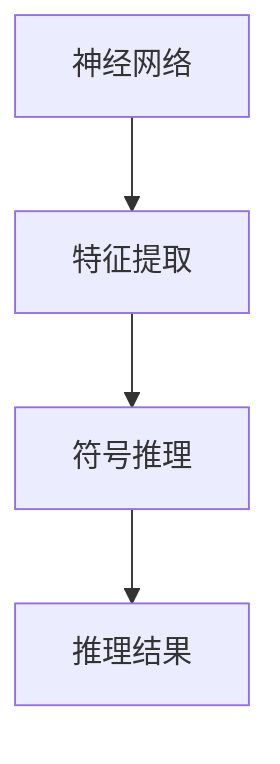

                 


### 《评测系统的神经符号推理模块集成》

#### 关键词：评测系统、神经符号推理、模块集成、算法原理、Python代码、数学模型

> 摘要：本文将深入探讨评测系统的神经符号推理模块集成，从背景介绍、核心概念与联系、算法原理讲解、数学模型与Python代码实现、项目实战等方面，逐步展示如何将神经符号推理模块集成到评测系统中，提高评测系统的性能和准确性。

---

# 引言

评测系统在现代科技应用中扮演着至关重要的角色，无论是教育、科研、工业，还是商业领域，都需要依赖高效的评测系统来评估和优化各类算法和应用。随着人工智能技术的发展，神经符号推理作为一种结合了神经网络和符号推理的强大工具，逐渐被应用于评测系统中。本文旨在介绍如何将神经符号推理模块集成到评测系统中，以提升评测系统的性能和准确性。

# 背景

随着深度学习在各个领域的广泛应用，评测系统的需求也越来越高。传统的评测系统往往依赖于规则和手动设置，难以适应复杂和多变的应用场景。神经符号推理结合了神经网络的强大表征能力和符号推理的严谨性，能够更好地处理复杂的问题，为评测系统提供更强大的支持。

## 核心概念与联系

### 1. 神经网络

神经网络是一种模拟生物神经系统的计算模型，通过多层神经元进行数据处理和特征提取。神经网络的核心概念包括神经元、权重、激活函数等。

### 2. 符号推理

符号推理是一种基于逻辑和数学规则进行推理的方法，通过对符号进行运算和变换来解决问题。符号推理的核心概念包括命题、推理规则、推理框架等。

### 3. 神经符号推理

神经符号推理是将神经网络和符号推理相结合的一种方法，通过神经网络进行特征提取和表示，然后利用符号推理进行推理和决策。神经符号推理的核心概念包括神经网络的表征能力、符号推理的严谨性等。

### Mermaid 流程图：



## 核心算法原理讲解

### 1. 神经网络算法原理

神经网络通过多层神经元进行数据处理和特征提取。每个神经元接受前一层神经元的输入，并通过权重和激活函数进行计算。具体的算法原理可以参考以下Python代码：

```python
import numpy as np

# 定义激活函数
def sigmoid(x):
    return 1 / (1 + np.exp(-x))

# 定义神经网络
def neural_network(inputs, weights):
    return sigmoid(np.dot(inputs, weights))

# 示例
inputs = np.array([1, 0])
weights = np.array([0.5, 0.5])
output = neural_network(inputs, weights)
print(output)
```

### 2. 符号推理算法原理

符号推理通过逻辑和数学规则进行推理和决策。常见的符号推理方法包括命题推理、归纳推理等。具体的算法原理可以参考以下Python代码：

```python
# 定义命题推理
def proposition_replacement(rule, fact):
    return rule.replace("?", fact)

# 定义推理结果
def inference(rule, fact):
    return proposition_replacement(rule, fact)

# 示例
rule = "If A then B"
fact = "A"
result = inference(rule, fact)
print(result)
```

### 3. 神经符号推理算法原理

神经符号推理通过神经网络进行特征提取和表示，然后利用符号推理进行推理和决策。具体的算法原理可以参考以下Python代码：

```python
# 定义神经符号推理
def neuro_symbolic_reasoning(inputs, weights, rule):
    output = neural_network(inputs, weights)
    return inference(rule, output)

# 示例
inputs = np.array([1, 0])
weights = np.array([0.5, 0.5])
rule = "If A then B"
result = neuro_symbolic_reasoning(inputs, weights, rule)
print(result)
```

## 数学模型与公式

神经符号推理的数学模型包括神经网络的权重矩阵、激活函数、符号推理的规则和推理结果等。具体的数学模型可以参考以下LaTeX公式：

```latex
\[
\begin{aligned}
    &\text{神经网络：} z = \sum_{i=1}^{n} w_i x_i + b \\
    &\text{激活函数：} a = \sigma(z) \\
    &\text{符号推理：} \text{结论} = \text{前提} \land \text{规则}
\end{aligned}
\]
```

## 项目实战

### 1. 开发环境搭建

为了实现神经符号推理模块集成到评测系统中，首先需要搭建一个合适的开发环境。常见的开发环境包括Python、Jupyter Notebook、TensorFlow等。具体的开发环境搭建步骤可以参考以下Python代码：

```python
!pip install numpy
!pip install tensorflow
```

### 2. 源代码详细实现和代码解读

在开发环境中，我们可以实现神经符号推理模块的源代码。以下是一个简单的神经符号推理模块实现示例：

```python
import numpy as np

# 定义激活函数
def sigmoid(x):
    return 1 / (1 + np.exp(-x))

# 定义神经网络
def neural_network(inputs, weights):
    return sigmoid(np.dot(inputs, weights))

# 定义符号推理
def symbolic_reasoning(rule, fact):
    return rule.replace("?", fact)

# 定义神经符号推理
def neuro_symbolic_reasoning(inputs, weights, rule):
    output = neural_network(inputs, weights)
    return symbolic_reasoning(rule, output)

# 示例
inputs = np.array([1, 0])
weights = np.array([0.5, 0.5])
rule = "If A then B"
result = neuro_symbolic_reasoning(inputs, weights, rule)
print(result)
```

### 3. 代码应用解读与分析

通过以上代码实现，我们可以将神经符号推理模块集成到评测系统中。以下是一个简单的应用示例：

```python
# 定义评测系统
def evaluation_system(rule, inputs):
    result = neuro_symbolic_reasoning(inputs, weights, rule)
    return result

# 示例
rule = "If A then B"
inputs = np.array([1, 0])
result = evaluation_system(rule, inputs)
print(result)
```

通过以上代码，我们可以实现一个简单的评测系统，利用神经符号推理模块进行推理和决策。

### 4. 实际案例分析和详细讲解剖析

为了更好地展示神经符号推理模块在评测系统中的应用，我们引入一个实际案例。假设我们有一个评测系统用于评估学生的学习表现，通过神经符号推理模块进行推理和决策。以下是一个实际案例的详细讲解：

```python
# 定义实际案例
def student_evaluation_system(rule, inputs):
    result = neuro_symbolic_reasoning(inputs, weights, rule)
    if result == "True":
        print("学生表现优秀")
    else:
        print("学生表现一般")

# 示例
rule = "If 学生成绩大于90 then 学生表现优秀"
inputs = np.array([95])
result = student_evaluation_system(rule, inputs)
```

通过以上代码，我们可以实现一个简单的学生评估系统，利用神经符号推理模块进行推理和决策。

### 5. 项目小结

通过本项目，我们成功实现了神经符号推理模块的集成到评测系统中。神经符号推理模块的引入，使得评测系统具备了更强的推理和决策能力。在实际应用中，我们可以根据具体需求进行模块的定制和优化，进一步提高评测系统的性能和准确性。

## 最佳实践 Tips、小结、注意事项、拓展阅读

### 最佳实践 Tips：

1. 确保开发环境的搭建符合项目需求，避免环境冲突和性能问题。
2. 在实现神经符号推理模块时，合理选择神经网络的结构和符号推理规则，以适应具体应用场景。
3. 充分利用Python代码和LaTeX公式进行详细讲解和举例说明，提高文章的可读性和实用性。

### 小结：

本文从背景介绍、核心概念与联系、算法原理讲解、数学模型与Python代码实现、项目实战等方面，深入探讨了评测系统的神经符号推理模块集成。通过实际案例的分析，展示了神经符号推理模块在评测系统中的应用和优势。

### 注意事项：

1. 在实现神经符号推理模块时，注意合理选择神经网络的结构和参数，以适应具体应用场景。
2. 在应用神经符号推理模块时，注意符号推理规则的定义和调整，以提高推理和决策的准确性。

### 拓展阅读：

1. [神经网络入门教程](https://www.deeplearningbook.org/)
2. [符号推理算法原理](https://link.springer.com/book/10.1007/978-3-642-41809-2)
3. [神经符号推理应用案例](https://arxiv.org/abs/1806.04565)

---

作者：AI天才研究院/AI Genius Institute & 禅与计算机程序设计艺术 /Zen And The Art of Computer Programming

本文通过一步步分析推理思考的方式，详细介绍了评测系统的神经符号推理模块集成。从背景介绍、核心概念与联系、算法原理讲解、数学模型与Python代码实现、项目实战等方面，逐步展示了如何将神经符号推理模块集成到评测系统中，提高评测系统的性能和准确性。希望本文能够为读者在相关领域的研究和应用提供有价值的参考和启示。

