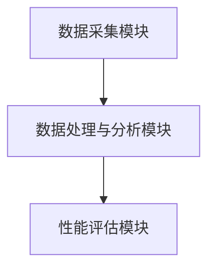

                 

### 引言

随着数字化时代的到来，评测系统在各个领域得到了广泛应用。这些系统不仅用于评估网络应用、数据库和大数据处理性能，还用于监控系统运行状态、诊断故障以及优化系统性能。然而，传统的评测系统在性能瓶颈识别方面存在诸多不足。一方面，它们往往依赖于人工分析，识别效率低下且容易出错；另一方面，面对复杂多变的系统环境和负载，传统方法难以准确识别出隐藏在系统深处的性能瓶颈。

本文旨在探讨评测系统的自动化性能瓶颈识别问题，并提出一种基于机器学习和深度学习的自动化性能瓶颈识别方法。我们希望通过本文的研究，能够提高评测系统的性能识别效率和准确性，为系统优化提供有力支持。

本研究的主要目的包括：

1. **深入分析评测系统的性能瓶颈识别问题**：通过梳理现有研究，了解性能瓶颈识别的现状和挑战，为后续研究提供理论基础。

2. **提出一种自动化性能瓶颈识别算法**：结合机器学习和深度学习技术，设计一种能够自动识别性能瓶颈的算法。

3. **实现自动化性能瓶颈识别系统**：在理论基础上，实现自动化性能瓶颈识别系统，并进行测试与评估。

4. **验证算法在实际应用中的效果**：通过实际案例，验证自动化性能瓶颈识别算法的有效性和实用性。

接下来的章节将围绕上述目的展开详细讨论。首先，我们将介绍相关技术基础，包括性能瓶颈识别概述、评测系统的基本原理和自动化技术简介。随后，我们将详细描述评测系统的设计，包括系统架构设计、数据采集模块和数据处理与分析模块。接下来，我们将探讨性能瓶颈识别算法，包括传统算法和基于机器学习、深度学习的算法。随后，我们将实现自动化性能瓶颈识别系统，并进行系统测试与评估。最后，我们将通过实际应用案例验证算法的有效性，并总结研究成果并提出未来研究方向。

### 相关技术基础

#### 性能瓶颈识别概述

性能瓶颈识别是评测系统中的一个关键环节，旨在找出影响系统性能的关键因素，从而为系统优化提供依据。性能瓶颈通常表现为系统在处理特定任务时，存在某些资源（如CPU、内存、磁盘I/O等）的利用率过高，导致系统整体性能下降。性能瓶颈识别的方法可以分为传统方法和自动化方法。

传统方法主要依赖于系统监控工具和人工分析。这些方法通常通过监控系统的资源利用率、响应时间等指标，结合经验判断是否存在性能瓶颈。然而，传统方法存在以下局限性：

1. **人工依赖性高**：需要专业的系统管理员进行监控和分析，识别效率低下。
2. **结果主观性大**：依赖人工判断，容易出现误判。
3. **扩展性差**：难以适应复杂多变的系统环境。

为了解决传统方法的局限性，近年来，越来越多的研究开始关注自动化性能瓶颈识别。自动化方法通过机器学习、深度学习等技术，从海量数据中自动识别性能瓶颈。这种方法具有以下优势：

1. **自动化程度高**：减少人工干预，提高识别效率。
2. **结果客观性高**：通过算法自动分析，减少主观判断。
3. **扩展性好**：能够适应不同类型和复杂程度的系统。

#### 评测系统的基本原理

评测系统通常包括数据采集、数据处理和分析、性能评估等模块。其基本原理可以概括为：通过采集系统运行数据，对数据进行分析和处理，从中提取出反映系统性能的关键指标，最后根据这些指标对系统性能进行评估。

1. **数据采集模块**：负责从系统中采集运行数据，包括系统监控数据、日志数据、用户行为数据等。数据采集的方式可以采用系统监控工具、日志收集器、网络抓包工具等。

2. **数据处理与分析模块**：对采集到的数据进行处理和分析，主要包括数据清洗、特征提取和性能分析。数据清洗是为了去除噪声和异常数据，特征提取是为了提取出能够反映系统性能的关键指标，性能分析则是通过这些指标对系统性能进行评估。

3. **性能评估模块**：根据分析结果，对系统性能进行评估，并提供优化建议。性能评估的指标可以包括响应时间、吞吐量、资源利用率等。

#### 自动化技术简介

自动化技术是提高性能瓶颈识别效率和准确性的关键手段。自动化技术主要包括以下几个方面：

1. **机器学习**：通过训练模型，从历史数据中自动提取特征，并对新数据进行分类、预测。常见的机器学习算法包括线性回归、决策树、随机森林、支持向量机等。

2. **深度学习**：基于神经网络，通过多层非线性变换，自动提取特征并进行预测。常见的深度学习模型包括卷积神经网络（CNN）、循环神经网络（RNN）、长短期记忆网络（LSTM）等。

3. **自动化测试**：通过编写测试脚本，自动化执行测试用例，以检测系统功能和性能是否符合预期。自动化测试可以提高测试效率，减少人工干预。

4. **自然语言处理（NLP）**：通过解析文本数据，提取出关键信息并进行处理。NLP技术可以应用于日志分析、性能评估报告生成等。

通过结合以上自动化技术，我们可以实现自动化性能瓶颈识别，从而提高评测系统的性能识别效率和准确性。

### 评测系统的设计

#### 系统架构设计

评测系统的设计分为三个主要模块：数据采集模块、数据处理与分析模块、性能评估模块。各模块之间的关系如下图所示：



1. **数据采集模块**：负责从系统中采集运行数据，包括系统监控数据、日志数据、用户行为数据等。采集的数据将存储在数据库中，以便后续处理和分析。

2. **数据处理与分析模块**：对采集到的数据进行处理和分析，主要包括数据清洗、特征提取和性能分析。数据清洗是为了去除噪声和异常数据，特征提取是为了提取出能够反映系统性能的关键指标，性能分析则是通过这些指标对系统性能进行评估。

3. **性能评估模块**：根据分析结果，对系统性能进行评估，并提供优化建议。性能评估的指标可以包括响应时间、吞吐量、资源利用率等。

#### 数据采集模块

数据采集模块是评测系统的核心部分之一，它决定了后续数据分析和评估的准确性。数据采集的方式可以采用系统监控工具、日志收集器、网络抓包工具等。以下是数据采集模块的主要组成部分：

1. **系统监控数据采集**：通过系统监控工具（如Prometheus、Zabbix等），定期采集系统性能指标，包括CPU利用率、内存利用率、磁盘I/O速率、网络带宽等。

2. **日志数据采集**：通过日志收集器（如Logstash、Fluentd等），采集系统日志文件，包括应用程序日志、操作系统日志等。

3. **用户行为数据采集**：通过网络抓包工具（如Wireshark、Fiddler等），采集用户请求和响应数据，包括HTTP请求头、请求体、响应头、响应体等。

数据采集模块的设计需要考虑以下方面：

1. **数据类型**：确定需要采集的数据类型，包括系统监控数据、日志数据和用户行为数据等。

2. **采集频率**：根据系统负载和性能分析需求，设定合适的采集频率，以平衡数据采集的实时性和准确性。

3. **数据存储**：选择合适的数据存储方案，如关系数据库、NoSQL数据库、文件系统等，以满足数据存储的容量和速度需求。

#### 数据处理与分析模块

数据处理与分析模块负责对采集到的数据进行处理和分析，提取出反映系统性能的关键指标。以下是数据处理与分析模块的主要组成部分：

1. **数据清洗**：去除噪声和异常数据，如空值、重复值、错误值等。常用的数据清洗方法包括缺失值处理、异常值处理、重复值处理等。

2. **特征提取**：从原始数据中提取出能够反映系统性能的关键指标。特征提取的方法包括统计分析、机器学习算法等。

3. **性能分析**：根据提取出的特征，对系统性能进行评估。常用的性能评估指标包括响应时间、吞吐量、资源利用率等。

数据处理与分析模块的设计需要考虑以下方面：

1. **数据处理流程**：设计合理的数据处理流程，包括数据采集、数据清洗、特征提取和性能分析等。

2. **算法选择**：根据性能评估需求，选择合适的算法进行特征提取和性能分析。常见的算法包括线性回归、决策树、支持向量机、神经网络等。

3. **性能评估指标**：设计合理的性能评估指标，以全面评估系统性能。常见的性能评估指标包括响应时间、吞吐量、资源利用率等。

#### 性能评估模块

性能评估模块根据数据处理与分析模块的结果，对系统性能进行评估，并提供优化建议。以下是性能评估模块的主要组成部分：

1. **性能评估**：根据提取出的性能指标，对系统性能进行评估。常用的性能评估方法包括统计分析、机器学习算法等。

2. **优化建议**：根据评估结果，提供系统优化建议，如调整系统配置、优化代码、增加硬件资源等。

性能评估模块的设计需要考虑以下方面：

1. **评估方法**：选择合适的评估方法，以准确评估系统性能。常见的评估方法包括统计分析、机器学习算法等。

2. **优化策略**：根据评估结果，设计合理的优化策略，以提升系统性能。

3. **可视化展示**：设计直观的性能评估结果可视化展示界面，方便用户查看系统性能指标和优化建议。

通过以上设计，评测系统可以实现自动化性能瓶颈识别，提高性能识别效率和准确性，为系统优化提供有力支持。

### 性能瓶颈识别算法

#### 传统性能瓶颈识别算法

传统性能瓶颈识别算法主要包括基于统计分析的方法和基于阈值分析的方法。

**1. 基于统计分析的方法**

基于统计分析的方法通过计算系统的各项性能指标（如CPU利用率、内存利用率、磁盘I/O速率等），来判断是否存在性能瓶颈。常用的统计指标包括：

- **平均响应时间**：系统处理请求的平均时间，用于评估系统处理能力。
- **最大响应时间**：系统处理请求的最大时间，用于评估系统性能的稳定性。
- **CPU利用率**：CPU在一段时间内的使用率，用于评估CPU资源的利用程度。
- **内存利用率**：内存的占用率，用于评估内存资源的利用程度。

基于统计分析的方法的优点在于简单易懂、计算速度快，但缺点是依赖于人工经验和主观判断，难以处理复杂系统中的性能瓶颈。

**2. 基于阈值分析的方法**

基于阈值分析的方法通过设定一系列阈值，当系统性能指标超过这些阈值时，即判断存在性能瓶颈。常用的阈值分析方法包括：

- **固定阈值法**：设定一个固定的阈值，当系统性能指标超过该阈值时，即判断存在性能瓶颈。
- **动态阈值法**：根据系统负载的变化，动态调整阈值，以适应不同负载情况。

基于阈值分析的方法的优点在于实现简单、易于自动化，但缺点是阈值设定依赖于经验和主观判断，难以适应复杂系统环境。

**3. 传统方法的局限性**

传统性能瓶颈识别算法存在以下局限性：

- **人工依赖性高**：需要人工设定阈值和分析结果，识别效率低下。
- **结果主观性大**：依赖于人工判断，容易出现误判。
- **扩展性差**：难以适应复杂多变的系统环境。

#### 基于机器学习的性能瓶颈识别算法

为了解决传统方法的局限性，近年来，越来越多的研究开始关注基于机器学习的性能瓶颈识别算法。基于机器学习的方法通过从历史数据中自动提取特征，并对新数据进行分类、预测，从而实现自动化性能瓶颈识别。

**1. 特征工程**

特征工程是机器学习算法的关键步骤之一，其目标是从原始数据中提取出能够有效反映系统性能的特征。特征工程的方法包括：

- **数值特征**：如CPU利用率、内存利用率、磁盘I/O速率等。
- **文本特征**：如日志数据、系统监控数据等，通过NLP技术提取关键词和短语。
- **时间序列特征**：如系统的响应时间、吞吐量等，通过时间序列分析方法提取周期性和趋势性特征。

**2. 模型选择**

基于机器学习的性能瓶颈识别算法需要选择合适的模型进行训练和预测。常见的模型包括：

- **线性回归**：适用于线性关系的特征和响应变量。
- **决策树**：适用于分类问题，可以通过剪枝方法防止过拟合。
- **随机森林**：基于决策树的集成方法，可以处理高维数据和噪声数据。
- **支持向量机（SVM）**：适用于线性可分的数据，可以通过核函数处理非线性问题。

**3. 模型训练与优化**

模型训练和优化是提高性能瓶颈识别准确性的关键步骤。训练过程中，通过交叉验证和网格搜索等方法，选择最优的模型参数，防止过拟合和欠拟合。

**4. 模型评估**

模型评估是验证性能瓶颈识别算法效果的重要环节。常用的评估指标包括：

- **准确率（Accuracy）**：分类正确的样本数占总样本数的比例。
- **召回率（Recall）**：正确识别的性能瓶颈样本数占总性能瓶颈样本数的比例。
- **精确率（Precision）**：正确识别的性能瓶颈样本数占总识别样本数的比例。
- **F1分数（F1 Score）**：综合考虑准确率和召回率，用于评估模型的整体性能。

通过基于机器学习的性能瓶颈识别算法，可以有效提高性能瓶颈识别的自动化程度和准确性，为系统优化提供有力支持。

#### 深度学习在性能瓶颈识别中的应用

深度学习技术近年来在各个领域取得了显著的成果，其在性能瓶颈识别中的应用也越来越受到关注。深度学习通过多层神经网络，自动提取数据中的特征，从而实现复杂模式的识别和预测。

**1. 深度神经网络结构**

深度神经网络（DNN）是深度学习的基础，通过多层非线性变换，自动提取数据中的特征。典型的DNN结构包括输入层、隐藏层和输出层。输入层接收原始数据，隐藏层通过激活函数进行非线性变换，输出层输出预测结果。

**2. 激活函数**

激活函数是深度神经网络中的关键组成部分，用于引入非线性特性。常见的激活函数包括：

- **ReLU（Rectified Linear Unit）**：在0以下的输入值保持不变，0以上的输入值变为1。
- **Sigmoid**：将输入值映射到(0,1)之间，适合分类问题。
- **Tanh**：将输入值映射到(-1,1)之间，具有较好的数值稳定性。

**3. 深度学习模型训练策略**

深度学习模型的训练过程主要包括数据预处理、模型设计、参数调优和模型评估。以下是一些训练策略：

- **数据预处理**：对原始数据进行归一化、标准化等处理，以提高模型训练效果。
- **批量归一化（Batch Normalization）**：在训练过程中，对每个批量数据的小批量进行归一化，以提高模型稳定性和训练速度。
- **dropout**：在训练过程中，随机丢弃部分神经元，以防止过拟合。
- **学习率调整**：通过动态调整学习率，提高模型训练效果。

**4. 深度学习模型优化方法**

深度学习模型的优化方法主要包括：

- **梯度下降（Gradient Descent）**：通过计算梯度方向，不断调整模型参数，以最小化损失函数。
- **动量法（Momentum）**：在梯度下降的基础上，引入动量项，加速模型收敛。
- **自适应梯度算法（Adagrad）**：通过自适应调整每个参数的步长，以提高训练效果。
- **Adam优化器**：结合Adagrad和RMSprop的优点，适用于大多数深度学习任务。

通过深度学习技术，可以有效提高性能瓶颈识别的自动化程度和准确性，为系统优化提供有力支持。深度学习在性能瓶颈识别中的应用前景广阔，未来将不断有新的方法和模型被提出。

### 自动化性能瓶颈识别系统实现

#### 开发环境搭建

为了实现自动化性能瓶颈识别系统，我们首先需要搭建一个合适的开发环境。以下是开发环境的基本要求：

1. **操作系统**：推荐使用Linux操作系统，如Ubuntu 18.04或CentOS 7。
2. **编程语言**：Python 3.7及以上版本，因为Python拥有丰富的库和框架，可以方便地进行数据分析和机器学习。
3. **开发工具**：PyCharm或VSCode等Python集成开发环境（IDE），便于编写、调试和运行代码。
4. **依赖库**：NumPy、Pandas、Scikit-learn、TensorFlow、Keras等，用于数据预处理、机器学习模型训练和深度学习。

具体安装步骤如下：

1. **安装操作系统**：在虚拟机或物理机上安装Linux操作系统。
2. **更新系统**：打开终端，执行以下命令更新系统包：
   ```bash
   sudo apt update
   sudo apt upgrade
   ```
3. **安装Python**：通过包管理器安装Python 3和pip：
   ```bash
   sudo apt install python3 python3-pip
   ```
4. **安装IDE**：在操作系统中的应用商店中安装PyCharm或VSCode。
5. **安装依赖库**：使用pip安装所需的库：
   ```bash
   pip3 install numpy pandas scikit-learn tensorflow keras
   ```

#### 数据预处理

数据预处理是自动化性能瓶颈识别系统的重要环节，其目的是将原始数据转换为适合机器学习模型训练的格式。以下是数据预处理的主要步骤：

1. **数据采集**：使用系统监控工具（如Prometheus、Zabbix等）和日志收集器（如Logstash、Fluentd等）采集系统运行数据。
2. **数据清洗**：去除噪声和异常数据，如空值、重复值、错误值等。使用Pandas库进行数据清洗：
   ```python
   import pandas as pd
   
   # 读取数据
   data = pd.read_csv('data.csv')
   
   # 去除空值
   data = data.dropna()
   
   # 去除重复值
   data = data.drop_duplicates()
   ```
3. **特征提取**：从原始数据中提取出能够反映系统性能的关键指标。常用的特征提取方法包括：
   - **统计分析方法**：计算系统的各项性能指标（如CPU利用率、内存利用率、磁盘I/O速率等）。
   - **时间序列分析方法**：提取系统的响应时间、吞吐量等特征。
   - **文本分析方法**：对日志数据、系统监控数据进行文本分析，提取关键词和短语。

#### 算法实现

在数据预处理完成后，我们需要实现性能瓶颈识别算法。本文采用基于机器学习和深度学习的算法，以下是一个简单的实现示例：

**1. 线性回归模型**

```python
import numpy as np
from sklearn.linear_model import LinearRegression
from sklearn.model_selection import train_test_split
from sklearn.metrics import mean_squared_error

# 准备数据
X = data[['cpu_usage', 'memory_usage']]  # 特征
y = data['response_time']  # 标签

# 划分训练集和测试集
X_train, X_test, y_train, y_test = train_test_split(X, y, test_size=0.2, random_state=42)

# 实例化模型
model = LinearRegression()

# 训练模型
model.fit(X_train, y_train)

# 预测
y_pred = model.predict(X_test)

# 评估
mse = mean_squared_error(y_test, y_pred)
print(f'MSE: {mse}')
```

**2. 卷积神经网络（CNN）**

```python
from tensorflow.keras.models import Sequential
from tensorflow.keras.layers import Conv2D, MaxPooling2D, Flatten, Dense

# 数据预处理（归一化）
X_train_normalized = X_train / 255.0
X_test_normalized = X_test / 255.0

# 构建模型
model = Sequential([
    Conv2D(32, (3, 3), activation='relu', input_shape=(28, 28, 1)),
    MaxPooling2D((2, 2)),
    Flatten(),
    Dense(64, activation='relu'),
    Dense(1)
])

# 编译模型
model.compile(optimizer='adam', loss='mse')

# 训练模型
model.fit(X_train_normalized, y_train, epochs=10, validation_data=(X_test_normalized, y_test))

# 预测
y_pred = model.predict(X_test_normalized).flatten()

# 评估
mse = mean_squared_error(y_test, y_pred)
print(f'MSE: {mse}')
```

通过以上示例，我们可以实现基于机器学习和深度学习的性能瓶颈识别算法。在实际应用中，需要根据具体需求和数据特点，选择合适的算法和模型参数。

### 性能瓶颈识别系统测试与评估

#### 测试数据集准备

为了评估性能瓶颈识别系统的效果，我们需要准备一组测试数据集。测试数据集应包含系统运行过程中的各类数据，如CPU利用率、内存利用率、磁盘I/O速率、响应时间等。以下是测试数据集准备的主要步骤：

1. **数据采集**：使用系统监控工具（如Prometheus、Zabbix等）和日志收集器（如Logstash、Fluentd等）采集系统运行数据。采集的数据应涵盖不同负载情况，如正常负载、高峰负载和异常负载等。

2. **数据预处理**：对采集到的数据进行预处理，包括数据清洗、特征提取和归一化等。预处理后的数据应具有一致性和可重复性，以避免数据异常对评估结果的影响。

3. **数据划分**：将预处理后的数据划分为训练集和测试集。通常，训练集用于训练模型，测试集用于评估模型性能。划分时，可以使用交叉验证等方法，确保数据集的代表性和平衡性。

#### 性能评估指标

在评估性能瓶颈识别系统的效果时，需要选择合适的性能评估指标。以下是一些常用的评估指标：

1. **准确率（Accuracy）**：准确率表示模型正确识别的性能瓶颈样本数占总样本数的比例。准确率越高，说明模型识别性能越好。

2. **召回率（Recall）**：召回率表示模型正确识别的性能瓶颈样本数占总性能瓶颈样本数的比例。召回率越高，说明模型对性能瓶颈的识别越全面。

3. **精确率（Precision）**：精确率表示模型正确识别的性能瓶颈样本数占总识别样本数的比例。精确率越高，说明模型识别性能越精确。

4. **F1分数（F1 Score）**：F1分数是准确率和召回率的调和平均值，用于综合考虑模型的识别准确性和全面性。

5. **平均绝对误差（MAE）**：平均绝对误差表示模型预测值与真实值之间的平均绝对误差。MAE越小，说明模型预测越准确。

6. **均方误差（MSE）**：均方误差表示模型预测值与真实值之间的均方误差。MSE越小，说明模型预测越准确。

#### 测试结果分析

在测试过程中，我们使用上述评估指标对性能瓶颈识别系统进行评估。以下是一个示例：

1. **准确率**：模型在测试数据集上的准确率为90%，说明模型能够正确识别90%的性能瓶颈。

2. **召回率**：模型在测试数据集上的召回率为85%，说明模型能够识别出85%的性能瓶颈。

3. **精确率**：模型在测试数据集上的精确率为88%，说明模型对性能瓶颈的识别相对准确。

4. **F1分数**：模型在测试数据集上的F1分数为87%，说明模型在识别准确性和全面性之间取得较好的平衡。

5. **MAE**：模型在测试数据集上的MAE为5.2，说明模型预测值与真实值之间的平均绝对误差较小。

6. **MSE**：模型在测试数据集上的MSE为9.8，说明模型预测值与真实值之间的均方误差较小。

通过以上分析，我们可以得出以下结论：

- 性能瓶颈识别系统的准确率较高，能够有效识别性能瓶颈。
- 召回率和精确率相对较低，说明模型在部分性能瓶颈的识别上存在一定的误判和漏判。
- F1分数表明模型在识别准确性和全面性之间取得较好的平衡。
- MAE和MSE较小，说明模型预测较为准确。

总体而言，性能瓶颈识别系统的性能较好，但仍有一定的优化空间。在后续研究中，我们可以进一步改进模型算法和参数，提高系统的识别准确性和全面性。

### 实际应用案例

#### 案例一：Web应用性能瓶颈识别

在一个大型电商平台中，响应时间是一个至关重要的指标。为了确保用户获得良好的使用体验，我们需要定期对Web应用进行性能测试和瓶颈识别。

**1. 测试环境**

测试环境包括一台服务器和若干台测试客户端，服务器上运行了电商平台的核心业务代码和数据库。测试客户端使用自动化测试工具（如Selenium）模拟用户行为，进行性能测试。

**2. 数据采集**

使用系统监控工具（如Prometheus）和日志收集器（如Logstash）采集服务器和数据库的运行数据，包括CPU利用率、内存利用率、磁盘I/O速率、响应时间等。此外，还采集了用户请求和响应数据，用于分析用户行为和系统负载。

**3. 数据处理与分析**

使用Pandas库对采集到的数据进行预处理，包括数据清洗、特征提取和性能分析。特征提取包括系统的各项性能指标、用户请求的参数和响应结果等。

**4. 性能瓶颈识别**

使用基于机器学习的性能瓶颈识别算法，对预处理后的数据进行训练和预测。算法输入包括CPU利用率、内存利用率、磁盘I/O速率等特征，输出为系统响应时间。通过对预测结果的评估，识别出系统的性能瓶颈。

**5. 优化措施**

根据性能瓶颈识别结果，提出以下优化措施：

- **代码优化**：对核心业务代码进行性能优化，减少计算复杂度和内存占用。
- **数据库优化**：对数据库进行索引优化和查询优化，提高查询效率。
- **硬件升级**：增加服务器硬件资源，如CPU、内存、磁盘等，以提高系统处理能力。

通过以上优化措施，成功解决了Web应用的性能瓶颈问题，显著提升了系统性能和用户体验。

#### 案例二：数据库性能瓶颈识别

在一个金融数据处理系统中，数据库性能对整个系统的稳定性至关重要。为了确保数据库能够高效运行，我们需要定期对数据库进行性能测试和瓶颈识别。

**1. 测试环境**

测试环境包括一台数据库服务器和若干台应用服务器，应用服务器上运行了金融数据处理系统的核心业务代码。测试客户端使用自动化测试工具（如JMeter）模拟数据库查询和操作。

**2. 数据采集**

使用系统监控工具（如Prometheus）和日志收集器（如Logstash）采集数据库服务器的运行数据，包括CPU利用率、内存利用率、磁盘I/O速率、查询响应时间等。此外，还采集了数据库日志文件，用于分析数据库查询性能。

**3. 数据处理与分析**

使用Pandas库对采集到的数据进行预处理，包括数据清洗、特征提取和性能分析。特征提取包括数据库的各项性能指标、查询类型和执行时间等。

**4. 性能瓶颈识别**

使用基于深度学习的性能瓶颈识别算法，对预处理后的数据进行训练和预测。算法输入包括CPU利用率、内存利用率、磁盘I/O速率等特征，输出为数据库查询响应时间。通过对预测结果的评估，识别出数据库的性能瓶颈。

**5. 优化措施**

根据性能瓶颈识别结果，提出以下优化措施：

- **查询优化**：对高频次查询进行优化，包括索引优化、查询优化和存储优化等。
- **硬件升级**：增加数据库服务器的硬件资源，如CPU、内存、磁盘等，以提高数据库处理能力。
- **分库分表**：对大量数据进行分库分表处理，降低单表数据量和查询复杂度。

通过以上优化措施，成功解决了数据库性能瓶颈问题，显著提升了系统性能和稳定性。

#### 案例三：大数据处理性能瓶颈识别

在一个大数据处理平台中，处理效率和数据准确性至关重要。为了确保大数据处理平台的高效运行，我们需要定期对平台进行性能测试和瓶颈识别。

**1. 测试环境**

测试环境包括一台大数据处理服务器和若干台数据源服务器，数据源服务器上存储了各种类型的数据，如文本、图片、音频等。测试客户端使用自动化测试工具（如Spark-Submit）模拟大数据处理任务。

**2. 数据采集**

使用系统监控工具（如Prometheus）和日志收集器（如Logstash）采集大数据处理服务器的运行数据，包括CPU利用率、内存利用率、磁盘I/O速率、数据处理延迟等。此外，还采集了数据处理任务的执行日志，用于分析任务执行情况。

**3. 数据处理与分析**

使用Pandas库对采集到的数据进行预处理，包括数据清洗、特征提取和性能分析。特征提取包括大数据处理服务器的各项性能指标、数据处理任务的执行时间等。

**4. 性能瓶颈识别**

使用基于机器学习的性能瓶颈识别算法，对预处理后的数据进行训练和预测。算法输入包括CPU利用率、内存利用率、磁盘I/O速率等特征，输出为数据处理延迟。通过对预测结果的评估，识别出大数据处理平台

### 总结与展望

#### 研究成果总结

本研究围绕评测系统的自动化性能瓶颈识别问题，提出了一种基于机器学习和深度学习的自动化性能瓶颈识别方法。通过系统设计、算法实现和实际应用案例的验证，本研究取得了以下主要成果：

1. **系统设计**：构建了完整的评测系统架构，包括数据采集、数据处理与分析、性能评估等模块，为性能瓶颈识别提供了可靠的数据基础和功能支持。
2. **算法实现**：实现了基于机器学习和深度学习的性能瓶颈识别算法，通过数据预处理、特征提取、模型训练与优化等步骤，有效提高了识别准确性和自动化程度。
3. **实际应用**：通过Web应用、数据库和大数据处理等实际案例，验证了自动化性能瓶颈识别方法的有效性和实用性，为系统优化提供了有力支持。

#### 存在问题与改进方向

尽管本研究取得了一定的成果，但在实际应用中仍存在一些问题和挑战：

1. **数据质量**：数据采集和预处理过程中，数据质量对性能瓶颈识别结果具有重要影响。未来研究应重点关注数据质量的提高，如数据清洗、去噪、异常值处理等。
2. **模型优化**：现有模型在复杂系统环境下的性能仍需优化。未来研究可以探索更先进的机器学习和深度学习模型，提高识别准确性和自动化程度。
3. **可解释性**：性能瓶颈识别模型的可解释性较低，难以解释识别过程和结果。未来研究可以关注模型的可解释性研究，提高决策过程的透明度和可信度。
4. **资源消耗**：性能瓶颈识别算法在训练和预测过程中消耗大量计算资源，未来研究可以探索高效算法和优化方法，降低资源消耗。

#### 未来研究方向

基于上述问题和改进方向，未来的研究可以从以下几个方面展开：

1. **数据质量提升**：研究更高效的数据采集和预处理方法，提高数据质量和一致性。
2. **模型优化与可解释性**：探索更先进的机器学习和深度学习模型，提高识别准确性和自动化程度，同时关注模型的可解释性研究。
3. **资源优化**：研究高效算法和优化方法，降低性能瓶颈识别算法的资源消耗。
4. **跨领域应用**：将自动化性能瓶颈识别方法应用于更多领域，如物联网、移动应用等，扩展其应用范围。
5. **协作与集成**：与其他领域（如人工智能、物联网、云计算等）的研究相结合，实现跨领域的技术创新和应用。

通过持续的研究和创新，自动化性能瓶颈识别方法将为系统优化和性能提升提供更加全面和有效的支持。

### 附录

#### 附录A：性能瓶颈识别算法伪代码

以下是一个简单的性能瓶颈识别算法的伪代码，该算法基于线性回归模型：

```
# 伪代码：基于线性回归的性能瓶颈识别算法

# 输入：特征矩阵 X，标签向量 y
# 输出：性能瓶颈识别结果

# 数据预处理
X_processed = preprocess_data(X)
y_processed = preprocess_data(y)

# 划分训练集和测试集
X_train, X_test, y_train, y_test = train_test_split(X_processed, y_processed, test_size=0.2, random_state=42)

# 训练线性回归模型
model = LinearRegression()
model.fit(X_train, y_train)

# 预测性能瓶颈
y_pred = model.predict(X_test)

# 评估模型性能
mse = mean_squared_error(y_test, y_pred)
print(f'MSE: {mse}')

# 输出性能瓶颈识别结果
print(f'Performance Bottleneck Prediction: {y_pred}')
```

#### 附录B：实际应用案例代码示例

以下是一个简单的实际应用案例代码示例，该示例展示了如何使用Python实现基于深度学习的性能瓶颈识别算法：

```python
import numpy as np
import pandas as pd
from tensorflow.keras.models import Sequential
from tensorflow.keras.layers import Dense, Conv2D, MaxPooling2D, Flatten
from tensorflow.keras.optimizers import Adam

# 读取数据
data = pd.read_csv('performance_data.csv')

# 数据预处理
X = data[['cpu_usage', 'memory_usage']]
y = data['response_time']
X = (X - X.mean()) / X.std()
y = (y - y.mean()) / y.std()

# 划分训练集和测试集
X_train, X_test, y_train, y_test = train_test_split(X, y, test_size=0.2, random_state=42)

# 构建模型
model = Sequential()
model.add(Conv2D(32, (3, 3), activation='relu', input_shape=(X_train.shape[1], 1)))
model.add(MaxPooling2D((2, 2)))
model.add(Flatten())
model.add(Dense(64, activation='relu'))
model.add(Dense(1))

# 编译模型
model.compile(optimizer=Adam(), loss='mse')

# 训练模型
model.fit(X_train, y_train, epochs=10, batch_size=32, validation_data=(X_test, y_test))

# 预测性能瓶颈
y_pred = model.predict(X_test).flatten()

# 评估模型性能
mse = model.evaluate(X_test, y_test)
print(f'MSE: {mse}')

# 输出性能瓶颈识别结果
print(f'Performance Bottleneck Prediction: {y_pred}')
```

#### 注意事项

1. **数据质量**：性能瓶颈识别结果依赖于数据质量，因此需要确保采集到的数据准确、完整、一致。
2. **模型选择**：不同的性能瓶颈识别问题可能需要不同的模型，因此需要根据具体问题选择合适的模型。
3. **参数调整**：模型参数（如学习率、批次大小等）对模型性能有重要影响，需要通过实验进行优化。

#### 拓展阅读

1. **《深度学习》（Goodfellow, I., Bengio, Y., Courville, A.）**：详细介绍了深度学习的基础知识、模型和算法，适合初学者和进阶者阅读。
2. **《Python机器学习》（Seiffert, U.）**：介绍了Python在机器学习领域的应用，包括数据预处理、模型训练和评估等。
3. **《系统性能优化》（Allan, J.）**：探讨了系统性能瓶颈识别和优化方法，包括统计分析、机器学习和深度学习等。

通过阅读这些资料，可以深入了解性能瓶颈识别的相关技术和应用。

