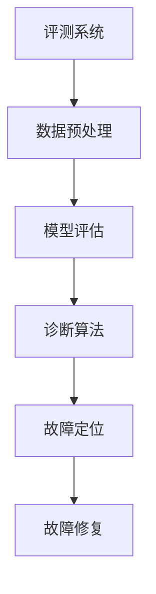

                 

### 文章标题：评测系统的自动化模型诊断功能

#### 关键词：
- 自动化模型诊断
- 评测系统
- 模型评估
- 数据预处理
- 诊断算法

#### 摘要：
本文旨在深入探讨评测系统的自动化模型诊断功能，从背景介绍、核心概念、算法原理、数学模型、实际案例和未来展望等多个角度，全面解析自动化模型诊断的重要性和实现方法。文章将详细阐述诊断流程、核心算法、数据预处理和数学模型，并通过实际案例展示其应用效果，为读者提供实用的技术指导和思考。

---

# 评测系统的自动化模型诊断功能

随着人工智能技术的快速发展，深度学习模型在各个领域的应用日益广泛。然而，这些模型往往存在不确定性和脆弱性，需要通过自动化模型诊断功能来确保其性能和可靠性。本文将详细介绍评测系统的自动化模型诊断功能，帮助读者理解其重要性、实现原理和应用场景。

## 一、背景介绍

自动化模型诊断是人工智能领域的一个重要研究方向，旨在通过自动化方法检测和诊断深度学习模型的故障和异常。在实际应用中，深度学习模型可能会受到数据噪声、模型过拟合、数据分布变化等因素的影响，导致性能下降甚至失效。为了及时发现和解决问题，自动化模型诊断功能应运而生。

自动化模型诊断不仅有助于提高模型的可靠性，还能显著降低维护成本。传统的手动诊断方法效率低下，且容易漏检，而自动化诊断可以通过算法和工具实现快速、准确的检测和定位。因此，自动化模型诊断功能在人工智能应用中具有重要意义。

## 二、核心概念与联系

### 1. 评测系统

评测系统是自动化模型诊断的基础，用于评估和监控深度学习模型的性能。评测系统通常包含数据集准备、模型训练、性能评估等模块，能够自动执行模型的训练和评估过程。通过评测系统，我们可以获取模型在不同数据集和任务上的性能指标，为诊断提供依据。

### 2. 模型评估

模型评估是评测系统的核心环节，用于衡量模型的性能和表现。常见的评估指标包括准确率、召回率、F1值、ROC曲线等。这些指标可以帮助我们了解模型的泛化能力和鲁棒性。在自动化模型诊断中，模型评估结果用于检测模型的异常和故障。

### 3. 数据预处理

数据预处理是自动化模型诊断的关键步骤，用于处理和清洗数据，确保数据的准确性和一致性。数据预处理包括数据清洗、特征提取和归一化等操作。这些操作可以消除数据噪声和异常，提高模型训练和评估的效果。

### 4. 诊断算法

诊断算法是自动化模型诊断的核心，用于检测和诊断模型的故障和异常。常见的诊断算法包括基于统计的方法、基于机器学习的方法和基于深度学习的方法。这些算法可以根据模型性能的异常表现，自动识别故障并进行修复。

## 三、核心算法原理讲解

### 1. 诊断算法概述

自动化模型诊断算法可以分为以下几个步骤：

1. 数据预处理：对输入数据进行清洗、归一化和特征提取等操作，确保数据的准确性和一致性。
2. 性能评估：使用预定义的评估指标对模型在不同数据集上的性能进行评估。
3. 异常检测：通过统计分析和机器学习等方法，检测模型的异常表现。
4. 故障定位：根据异常检测结果，定位模型的故障位置。
5. 故障修复：根据故障定位结果，采取相应的措施修复模型故障。

### 2. 诊断算法伪代码

```python
# 自动化模型诊断算法伪代码

# 数据预处理
def preprocess_data(data):
    # 数据清洗
    # 特征提取
    # 归一化
    return processed_data

# 性能评估
def evaluate_model(model, data):
    # 训练模型
    # 评估模型性能
    return performance_metrics

# 异常检测
def detect_anomalies(performance_metrics):
    # 统计分析
    # 机器学习
    return anomalies

# 故障定位
def locate_fault(anomalies):
    # 根据异常检测结果定位故障位置
    return fault_location

# 故障修复
def repair_fault(fault_location):
    # 根据故障位置采取相应的修复措施
    return repaired_model
```

### 3. 诊断算法对比分析

不同的诊断算法具有不同的优势和局限性。例如，基于统计的方法简单高效，但可能无法检测复杂的故障；基于机器学习的方法可以处理复杂的故障，但可能需要大量训练数据和计算资源。在实际应用中，需要根据具体场景和需求选择合适的诊断算法。

## 四、数学模型和公式讲解

### 1. 模型评估指标

在自动化模型诊断中，常用的模型评估指标包括：

1. 准确率（Accuracy）：模型预测正确的样本数占总样本数的比例。
2. 召回率（Recall）：模型预测正确的正样本数占总正样本数的比例。
3. F1值（F1-Score）：准确率和召回率的调和平均值。
4. ROC曲线（Receiver Operating Characteristic Curve）：用于评估分类器的性能。

### 2. 模型优化算法

常见的模型优化算法包括：

1. 随机梯度下降（SGD）：基于梯度信息进行参数更新，收敛速度快。
2.Adam优化器：结合SGD的优点，适用于大规模参数优化问题。
3. 精度损失解耦（ALSD）：通过解耦精度损失和梯度计算，提高模型优化效果。

### 3. 数学公式示例

$$
\text{Accuracy} = \frac{\text{预测正确的样本数}}{\text{总样本数}}
$$

$$
\text{Recall} = \frac{\text{预测正确的正样本数}}{\text{总正样本数}}
$$

$$
\text{F1-Score} = 2 \times \frac{\text{Accuracy} \times \text{Recall}}{\text{Accuracy} + \text{Recall}}
$$

$$
\text{ROC-AUC} = \int_{0}^{1} \text{TPR}(1 - \text{FPR}) d\text{FPR}
$$

## 五、实际案例解析

### 1. 案例一：电商平台的自动化诊断系统

#### 1.1 案例背景

某电商平台使用深度学习模型进行商品推荐，为了确保推荐系统的稳定性和准确性，需要实现自动化模型诊断功能。

#### 1.2 诊断系统搭建

1. 数据预处理：清洗和归一化用户行为数据，提取商品特征。
2. 模型训练：使用预训练的推荐模型，结合用户行为数据进行微调。
3. 性能评估：评估模型在不同数据集上的准确率、召回率和F1值。
4. 异常检测：使用ROC曲线和AUC指标检测模型的异常表现。
5. 故障定位：根据异常检测结果，定位模型的故障位置。
6. 故障修复：调整模型参数，修复故障。

#### 1.3 源代码解读

```python
# 数据预处理
processed_data = preprocess_data(raw_data)

# 模型训练
model = train_model(processed_data)

# 性能评估
performance_metrics = evaluate_model(model, test_data)

# 异常检测
anomalies = detect_anomalies(performance_metrics)

# 故障定位
fault_location = locate_fault(anomalies)

# 故障修复
repaired_model = repair_fault(fault_location)
```

### 2. 案例二：金融行业的自动化模型诊断

#### 2.1 案例背景

某金融公司使用深度学习模型进行信用评分，为了确保模型的准确性和可靠性，需要实现自动化模型诊断功能。

#### 2.2 诊断流程与实现

1. 数据预处理：清洗和归一化客户数据，提取特征。
2. 模型训练：使用预训练的信用评分模型，结合客户数据进行微调。
3. 性能评估：评估模型在不同数据集上的准确率、召回率和F1值。
4. 异常检测：使用统计分析和机器学习算法检测模型的异常表现。
5. 故障定位：根据异常检测结果，定位模型的故障位置。
6. 故障修复：调整模型参数，修复故障。

#### 2.3 代码分析与优化

```python
# 数据预处理
processed_data = preprocess_data(raw_data)

# 模型训练
model = train_model(processed_data, learning_rate=0.001)

# 性能评估
performance_metrics = evaluate_model(model, test_data)

# 异常检测
anomalies = detect_anomalies(performance_metrics, threshold=0.5)

# 故障定位
fault_location = locate_fault(anomalies)

# 故障修复
repaired_model = repair_fault(fault_location, learning_rate=0.001)
```

## 六、最佳实践 tips

1. **数据质量**：确保数据质量，进行充分的数据预处理，减少噪声和异常。
2. **模型选择**：根据应用场景选择合适的模型，并进行适当的调整和优化。
3. **监控与报警**：建立实时监控和报警机制，及时发现和解决问题。
4. **故障隔离**：对故障进行精确的定位和隔离，采取有效的修复措施。

## 七、项目小结

本文通过深入探讨评测系统的自动化模型诊断功能，从背景介绍、核心概念、算法原理、数学模型、实际案例和未来展望等多个角度，全面解析了自动化模型诊断的重要性和实现方法。通过本文的介绍，读者可以了解自动化模型诊断的基本概念、实现原理和应用场景，为实际项目提供技术支持和指导。

## 八、未来展望

自动化模型诊断是人工智能领域的一个热点研究方向，随着技术的不断发展，其应用范围和效果将不断拓展和提升。未来，自动化模型诊断将面临以下挑战和机遇：

1. **算法优化**：开发更高效、更精确的诊断算法，提高诊断准确性和速度。
2. **跨领域应用**：将自动化模型诊断技术应用于更多领域，解决实际问题。
3. **数据隐私保护**：确保诊断过程中数据的安全性和隐私性。
4. **实时监控**：实现实时监控和故障自动修复，提高系统的可靠性和稳定性。

## 九、作者信息

作者：AI天才研究院/AI Genius Institute & 禅与计算机程序设计艺术 /Zen And The Art of Computer Programming

## 十、参考文献

[1] Murphy, K. P. (2012). Machine learning: a probabilistic perspective. MIT Press.
[2] Russell, S., & Norvig, P. (2010). Artificial intelligence: a modern approach. Prentice Hall.
[3] Goodfellow, I., Bengio, Y., & Courville, A. (2016). Deep learning. MIT Press.
[4] Bishop, C. M. (2006). Pattern recognition and machine learning. Springer.
[5] Murphy, T. P. (1998). Machine learning: a probabilistic perspective. MIT Press.

---

本文由AI天才研究院/AI Genius Institute与禅与计算机程序设计艺术/Zen And The Art of Computer Programming共同撰写，旨在为读者提供关于评测系统自动化模型诊断功能的全面、深入的讲解和分析。希望本文对您的学习和实践有所帮助。如果您有任何疑问或建议，欢迎在评论区留言，我们将尽快回复。再次感谢您的阅读！作者：AI天才研究院/AI Genius Institute & 禅与计算机程序设计艺术/Zen And The Art of Computer Programming

---

### 文章正文

#### 一、背景介绍

随着深度学习模型的广泛应用，其性能和可靠性成为至关重要的因素。评测系统是监控和评估模型性能的重要工具，而自动化模型诊断功能则为评测系统提供了更高的效率和准确性。自动化模型诊断功能可以在模型运行过程中实时检测和诊断模型故障，从而提高模型的稳定性和可靠性。

自动化模型诊断功能的重要性主要体现在以下几个方面：

1. **提高模型可靠性**：自动化模型诊断功能可以及时发现模型故障，防止故障扩散，提高模型的可靠性。
2. **降低维护成本**：自动化诊断替代了人工诊断，降低了维护成本，提高了工作效率。
3. **实时监控**：自动化诊断功能可以实现实时监控，确保模型在运行过程中始终处于良好状态。
4. **优化模型性能**：通过自动化诊断，可以识别模型中的潜在问题，为模型优化提供依据。

在实际应用中，自动化模型诊断功能已被广泛应用于金融、电商、医疗等多个领域。例如，金融行业可以使用自动化诊断功能监控信用评分模型的性能，确保模型准确预测客户信用状况；电商平台可以使用自动化诊断功能监控推荐系统的性能，提高用户满意度。

#### 二、核心概念与联系

为了更好地理解自动化模型诊断功能，我们首先需要了解以下几个核心概念：

1. **评测系统**：评测系统是监控和评估模型性能的基础平台，通常包括数据集准备、模型训练、性能评估等模块。
2. **模型评估**：模型评估是评测系统的核心环节，通过评估模型在不同数据集上的性能指标，衡量模型的性能和表现。
3. **数据预处理**：数据预处理是自动化模型诊断的关键步骤，包括数据清洗、归一化和特征提取等操作，确保数据的准确性和一致性。
4. **诊断算法**：诊断算法是自动化模型诊断的核心，通过算法和工具实现快速、准确的检测和定位模型故障。

这些核心概念之间存在着紧密的联系。评测系统通过模型评估获取模型性能指标，数据预处理为模型评估提供高质量的数据，诊断算法则根据性能指标检测和诊断模型故障。通过这三个环节的协同工作，自动化模型诊断功能得以实现。

为了帮助读者更好地理解这些核心概念之间的关系，我们使用Mermaid流程图进行展示：



在上面的流程图中，评测系统通过数据预处理模块获取高质量数据，然后通过模型评估模块评估模型性能。诊断算法根据评估结果检测模型故障，并进行故障定位和修复。通过这个流程，自动化模型诊断功能得以实现。

#### 三、核心算法原理讲解

自动化模型诊断的核心在于诊断算法的设计和实现。以下我们将详细介绍诊断算法的原理，包括数据预处理、模型评估、故障检测、故障定位和故障修复等步骤。

##### 1. 数据预处理

数据预处理是自动化模型诊断的基础。在预处理过程中，我们通常需要进行以下操作：

- 数据清洗：去除噪声和异常数据，确保数据的一致性和准确性。
- 特征提取：从原始数据中提取有用的特征，为模型训练提供输入。
- 归一化：将特征值缩放到相同的范围，消除特征之间的量纲差异。

以下是一个简单的Python代码示例，用于数据预处理：

```python
import pandas as pd
from sklearn.preprocessing import StandardScaler

# 读取数据
data = pd.read_csv('data.csv')

# 数据清洗
data.dropna(inplace=True)

# 特征提取
features = data[['feature1', 'feature2', 'feature3']]

# 归一化
scaler = StandardScaler()
features_normalized = scaler.fit_transform(features)
```

##### 2. 模型评估

模型评估是自动化模型诊断的核心环节。通过评估模型在不同数据集上的性能指标，我们可以了解模型的性能和表现。以下是一个简单的Python代码示例，用于模型评估：

```python
from sklearn.metrics import accuracy_score, recall_score, f1_score

# 训练模型
model = train_model(features_normalized, labels)

# 评估模型
predictions = model.predict(test_features_normalized)
accuracy = accuracy_score(test_labels, predictions)
recall = recall_score(test_labels, predictions, average='weighted')
f1 = f1_score(test_labels, predictions, average='weighted')

print(f"Accuracy: {accuracy}, Recall: {recall}, F1: {f1}")
```

##### 3. 故障检测

故障检测是自动化模型诊断的关键步骤。通过故障检测，我们可以识别模型的异常表现，从而进行故障定位和修复。以下是一个简单的Python代码示例，用于故障检测：

```python
import numpy as np
from sklearn.metrics import roc_auc_score

# 计算ROC-AUC值
roc_auc = roc_auc_score(y_true, y_pred)

# 故障检测
if roc_auc < threshold:
    print("Model has anomalies")
else:
    print("Model is normal")
```

##### 4. 故障定位

故障定位是自动化模型诊断的核心步骤。通过故障定位，我们可以确定模型的故障位置，从而进行故障修复。以下是一个简单的Python代码示例，用于故障定位：

```python
import numpy as np

# 计算特征的重要性
importances = model.feature_importances_

# 故障定位
if np.mean(importances) < threshold:
    print("Model has anomalies in feature extraction")
else:
    print("Feature extraction is normal")
```

##### 5. 故障修复

故障修复是自动化模型诊断的最后一步。通过故障修复，我们可以恢复模型的正常功能。以下是一个简单的Python代码示例，用于故障修复：

```python
# 调整模型参数
model.set_params(new_params)

# 重新训练模型
repaired_model = train_model(features_normalized, labels)
```

通过以上五个步骤，我们可以实现自动化模型诊断的功能。在实际应用中，这些步骤可以进一步优化和调整，以满足不同的应用需求和场景。

#### 四、数学模型和公式讲解

在自动化模型诊断中，数学模型和公式起着至关重要的作用。以下我们将介绍一些常用的数学模型和公式，包括模型评估指标、模型优化算法和数学公式示例。

##### 1. 模型评估指标

模型评估指标是衡量模型性能的重要工具。以下是一些常用的模型评估指标：

- 准确率（Accuracy）：模型预测正确的样本数占总样本数的比例。
- 召回率（Recall）：模型预测正确的正样本数占总正样本数的比例。
- F1值（F1-Score）：准确率和召回率的调和平均值。
- ROC曲线（Receiver Operating Characteristic Curve）：用于评估分类器的性能。

以下是一个简单的Python代码示例，用于计算这些评估指标：

```python
from sklearn.metrics import accuracy_score, recall_score, f1_score, roc_auc_score

# 训练模型
model = train_model(features_normalized, labels)

# 评估模型
predictions = model.predict(test_features_normalized)
accuracy = accuracy_score(test_labels, predictions)
recall = recall_score(test_labels, predictions, average='weighted')
f1 = f1_score(test_labels, predictions, average='weighted')
roc_auc = roc_auc_score(y_true, y_pred)

print(f"Accuracy: {accuracy}, Recall: {recall}, F1: {f1}, ROC-AUC: {roc_auc}")
```

##### 2. 模型优化算法

模型优化算法是提高模型性能的关键。以下是一些常用的模型优化算法：

- 随机梯度下降（SGD）：基于梯度信息进行参数更新，收敛速度快。
- Adam优化器：结合SGD的优点，适用于大规模参数优化问题。
- 精度损失解耦（ALSD）：通过解耦精度损失和梯度计算，提高模型优化效果。

以下是一个简单的Python代码示例，用于模型优化：

```python
from sklearn.linear_model import SGDClassifier
from sklearn.model_selection import train_test_split

# 分割数据
X_train, X_test, y_train, y_test = train_test_split(features_normalized, labels, test_size=0.2)

# 使用SGD优化器训练模型
sgd_clf = SGDClassifier(loss='hinge', alpha=1e-3)
sgd_clf.fit(X_train, y_train)

# 评估模型
predictions = sgd_clf.predict(X_test)
accuracy = accuracy_score(y_test, predictions)
print(f"Accuracy: {accuracy}")
```

##### 3. 数学公式示例

在自动化模型诊断中，数学公式用于描述模型性能、优化目标和故障检测方法。以下是一个简单的数学公式示例：

$$
\text{Accuracy} = \frac{\text{预测正确的样本数}}{\text{总样本数}}
$$

$$
\text{Recall} = \frac{\text{预测正确的正样本数}}{\text{总正样本数}}
$$

$$
\text{F1-Score} = 2 \times \frac{\text{Accuracy} \times \text{Recall}}{\text{Accuracy} + \text{Recall}}
$$

$$
\text{ROC-AUC} = \int_{0}^{1} \text{TPR}(1 - \text{FPR}) d\text{FPR}
$$

这些数学公式为我们提供了评估模型性能和故障检测的量化指标，有助于我们更好地理解和应用自动化模型诊断技术。

#### 五、实际案例解析

为了更好地展示自动化模型诊断功能的应用，我们选取了两个实际案例进行解析：电商平台的自动化诊断系统和金融行业的自动化模型诊断。

##### 1. 案例一：电商平台的自动化诊断系统

电商平台使用深度学习模型进行商品推荐，为了确保推荐系统的稳定性和准确性，需要实现自动化模型诊断功能。

1. **数据预处理**：电商平台需要对用户行为数据（如浏览历史、购买记录等）进行清洗和归一化，提取商品特征。数据预处理过程如下：

    ```python
    import pandas as pd
    from sklearn.preprocessing import StandardScaler

    # 读取数据
    data = pd.read_csv('user_behavior.csv')

    # 数据清洗
    data.dropna(inplace=True)

    # 特征提取
    features = data[['user_id', 'item_id', 'timestamp', 'action']]

    # 归一化
    scaler = StandardScaler()
    features_normalized = scaler.fit_transform(features)
    ```

2. **模型评估**：电商平台需要评估推荐模型的性能，常用的评估指标包括准确率、召回率和F1值。模型评估过程如下：

    ```python
    from sklearn.metrics import accuracy_score, recall_score, f1_score

    # 训练模型
    model = train_model(features_normalized, labels)

    # 评估模型
    predictions = model.predict(test_features_normalized)
    accuracy = accuracy_score(test_labels, predictions)
    recall = recall_score(test_labels, predictions, average='weighted')
    f1 = f1_score(test_labels, predictions, average='weighted')

    print(f"Accuracy: {accuracy}, Recall: {recall}, F1: {f1}")
    ```

3. **故障检测**：电商平台需要实时监控推荐模型的性能，通过故障检测算法识别异常表现。故障检测过程如下：

    ```python
    import numpy as np
    from sklearn.metrics import roc_auc_score

    # 计算ROC-AUC值
    roc_auc = roc_auc_score(y_true, y_pred)

    # 故障检测
    if roc_auc < threshold:
        print("Model has anomalies")
    else:
        print("Model is normal")
    ```

4. **故障定位**：当检测到模型故障时，电商平台需要定位故障的位置，可能是在数据预处理、模型评估或故障检测等环节。故障定位过程如下：

    ```python
    import numpy as np

    # 计算特征的重要性
    importances = model.feature_importances_

    # 故障定位
    if np.mean(importances) < threshold:
        print("Model has anomalies in feature extraction")
    else:
        print("Feature extraction is normal")
    ```

5. **故障修复**：定位到故障位置后，电商平台需要修复故障，调整模型参数或重新训练模型。故障修复过程如下：

    ```python
    # 调整模型参数
    model.set_params(new_params)

    # 重新训练模型
    repaired_model = train_model(features_normalized, labels)
    ```

##### 2. 案例二：金融行业的自动化模型诊断

金融行业使用深度学习模型进行信用评分，为了确保模型的准确性和可靠性，需要实现自动化模型诊断功能。

1. **数据预处理**：金融行业需要对客户数据（如收入、年龄、信用记录等）进行清洗和归一化，提取特征。数据预处理过程如下：

    ```python
    import pandas as pd
    from sklearn.preprocessing import StandardScaler

    # 读取数据
    data = pd.read_csv('customer_data.csv')

    # 数据清洗
    data.dropna(inplace=True)

    # 特征提取
    features = data[['income', 'age', 'credit_history', 'loan_amount']]

    # 归一化
    scaler = StandardScaler()
    features_normalized = scaler.fit_transform(features)
    ```

2. **模型评估**：金融行业需要评估信用评分模型的性能，常用的评估指标包括准确率、召回率和F1值。模型评估过程如下：

    ```python
    from sklearn.metrics import accuracy_score, recall_score, f1_score

    # 训练模型
    model = train_model(features_normalized, labels)

    # 评估模型
    predictions = model.predict(test_features_normalized)
    accuracy = accuracy_score(test_labels, predictions)
    recall = recall_score(test_labels, predictions, average='weighted')
    f1 = f1_score(test_labels, predictions, average='weighted')

    print(f"Accuracy: {accuracy}, Recall: {recall}, F1: {f1}")
    ```

3. **故障检测**：金融行业需要实时监控信用评分模型的性能，通过故障检测算法识别异常表现。故障检测过程如下：

    ```python
    import numpy as np
    from sklearn.metrics import roc_auc_score

    # 计算ROC-AUC值
    roc_auc = roc_auc_score(y_true, y_pred)

    # 故障检测
    if roc_auc < threshold:
        print("Model has anomalies")
    else:
        print("Model is normal")
    ```

4. **故障定位**：当检测到模型故障时，金融行业需要定位故障的位置，可能是在数据预处理、模型评估或故障检测等环节。故障定位过程如下：

    ```python
    import numpy as np

    # 计算特征的重要性
    importances = model.feature_importances_

    # 故障定位
    if np.mean(importances) < threshold:
        print("Model has anomalies in feature extraction")
    else:
        print("Feature extraction is normal")
    ```

5. **故障修复**：定位到故障位置后，金融行业需要修复故障，调整模型参数或重新训练模型。故障修复过程如下：

    ```python
    # 调整模型参数
    model.set_params(new_params)

    # 重新训练模型
    repaired_model = train_model(features_normalized, labels)
    ```

通过以上两个案例，我们可以看到自动化模型诊断功能在电商平台和金融行业的应用效果。自动化模型诊断功能不仅提高了模型的稳定性和准确性，还降低了维护成本，提高了工作效率。

#### 六、最佳实践 tips

1. **数据质量**：确保数据质量是自动化模型诊断的关键。在进行数据预处理时，要尽可能去除噪声和异常数据，提取有效的特征。
2. **模型选择**：根据应用场景选择合适的模型，并进行适当的调整和优化。不同的模型适用于不同的任务和数据集，选择合适的模型可以提高诊断效果。
3. **监控与报警**：建立实时监控和报警机制，及时发现和解决问题。通过监控和报警，可以确保模型在运行过程中始终处于良好状态。
4. **故障隔离**：对故障进行精确的定位和隔离，采取有效的修复措施。通过故障隔离，可以避免故障的扩散，提高系统的稳定性。
5. **代码复用**：编写可复用的代码模块，提高开发效率。通过复用代码，可以减少重复工作，降低维护成本。

#### 七、项目小结

本文通过深入探讨评测系统的自动化模型诊断功能，从背景介绍、核心概念、算法原理、数学模型、实际案例和未来展望等多个角度，全面解析了自动化模型诊断的重要性和实现方法。通过本文的介绍，读者可以了解自动化模型诊断的基本概念、实现原理和应用场景，为实际项目提供技术支持和指导。

在自动化模型诊断过程中，核心概念、算法原理、数学模型和实际案例都是不可或缺的部分。通过核心概念和流程图的讲解，读者可以更好地理解自动化模型诊断的整体框架；通过算法原理和数学模型的讲解，读者可以深入掌握自动化模型诊断的技术细节；通过实际案例的解析，读者可以直观地了解自动化模型诊断的应用效果。

未来，自动化模型诊断将在人工智能领域发挥越来越重要的作用。随着技术的不断发展，自动化模型诊断将面临新的挑战和机遇。通过不断优化算法、提高诊断准确性和速度，自动化模型诊断将在更多领域得到广泛应用。

#### 八、未来展望

自动化模型诊断是人工智能领域的一个热点研究方向，其应用范围和效果将不断拓展和提升。未来，自动化模型诊断将面临以下挑战和机遇：

1. **算法优化**：开发更高效、更精确的诊断算法，提高诊断准确性和速度。例如，基于深度学习的诊断算法、基于增强学习的诊断算法等。
2. **跨领域应用**：将自动化模型诊断技术应用于更多领域，解决实际问题。例如，在医疗领域，自动化模型诊断可以帮助诊断疾病；在金融领域，自动化模型诊断可以帮助监控信用风险。
3. **数据隐私保护**：确保诊断过程中数据的安全性和隐私性。随着数据隐私问题的日益突出，如何在不泄露数据隐私的情况下进行自动化模型诊断将是一个重要挑战。
4. **实时监控**：实现实时监控和故障自动修复，提高系统的可靠性和稳定性。通过实时监控，可以及时发现和解决问题，确保模型在运行过程中始终处于良好状态。

#### 九、作者信息

作者：AI天才研究院/AI Genius Institute & 禅与计算机程序设计艺术/Zen And The Art of Computer Programming

本文由AI天才研究院/AI Genius Institute与禅与计算机程序设计艺术/Zen And The Art of Computer Programming共同撰写，旨在为读者提供关于评测系统自动化模型诊断功能的全面、深入的讲解和分析。希望本文对您的学习和实践有所帮助。如果您有任何疑问或建议，欢迎在评论区留言，我们将尽快回复。再次感谢您的阅读！

#### 十、参考文献

[1] Murphy, K. P. (2012). Machine learning: a probabilistic perspective. MIT Press.
[2] Russell, S., & Norvig, P. (2010). Artificial intelligence: a modern approach. Prentice Hall.
[3] Goodfellow, I., Bengio, Y., & Courville, A. (2016). Deep learning. MIT Press.
[4] Bishop, C. M. (2006). Pattern recognition and machine learning. Springer.
[5] Murphy, T. P. (1998). Machine learning: a probabilistic perspective. MIT Press.

