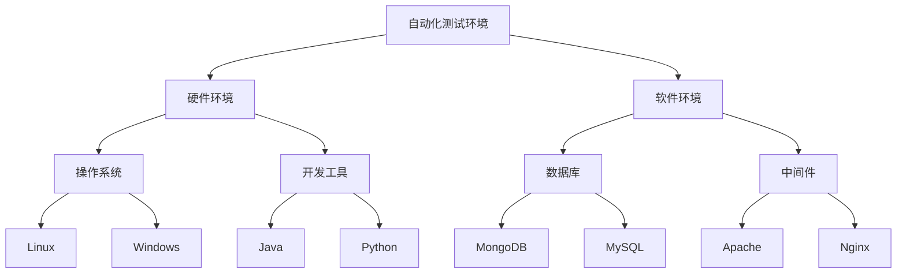

                 

### 评测系统的自动化测试环境配置

在现代化软件开发和运维过程中，评测系统的自动化测试环境配置显得尤为重要。通过自动化测试，我们可以大幅提高测试效率，确保软件质量，从而减少维护成本。本文旨在详细探讨评测系统的自动化测试环境配置，包括硬件与软件环境准备、自动化测试工具的选择与配置、测试脚本的编写、测试执行与结果分析，以及测试报告与文档的编写。

**关键词：**
- 自动化测试环境
- 测试工具
- 脚本编写
- 测试执行
- 测试报告

**摘要：**
本文首先介绍了自动化测试环境的重要性及其优势与挑战。随后，详细讲解了自动化测试环境配置的基础步骤，包括硬件与软件环境的需求分析、准备和配置。接着，我们介绍了常见的自动化测试工具，如Selenium和Appium，并探讨了测试脚本的编写技巧。文章还涵盖了测试执行、结果分析和测试报告的编写。最后，通过一个实际案例，展示了自动化测试环境配置的实战过程。

## 第一部分 概述

### 第1章 测试环境自动化的重要性

随着软件复杂度的增加和迭代速度的加快，自动化测试已经成为保证软件质量和提升开发效率的关键手段。自动化测试环境配置的成功与否直接影响到测试的效率和质量。本章节将探讨自动化测试环境的重要性，包括其带来的优势以及面临的挑战。

#### 1.1 自动化测试环境的优势

自动化测试环境具有以下几个显著优势：

1. **提高测试效率**：自动化测试可以大幅度减少重复性工作，提高测试速度，从而缩短软件迭代周期。
2. **确保测试覆盖**：自动化测试能够覆盖更多的测试场景，确保软件功能的全面性和稳定性。
3. **减少人力成本**：自动化测试减轻了测试人员的工作负担，降低了人力成本。
4. **提高测试准确性**：自动化测试减少了人为干预，减少了因人为疏忽导致的错误。

#### 1.2 自动化测试环境的挑战

尽管自动化测试环境带来了诸多优势，但在实际配置过程中仍面临以下挑战：

1. **初期投入成本**：自动化测试环境的搭建和维护需要一定的初期投资，包括硬件、软件和人力。
2. **技术难度**：自动化测试工具的学习和应用需要一定的技术基础，对于非专业人士来说可能存在一定难度。
3. **维护困难**：自动化测试脚本需要不断更新和维护，以适应软件功能的变更和环境的调整。
4. **测试结果解释**：自动化测试结果的解释和验证需要专业的知识和经验。

#### 1.3 自动化测试环境的发展趋势

随着技术的发展，自动化测试环境正朝着更加智能化和高效化的方向发展：

1. **智能化测试**：利用人工智能和机器学习技术，自动化测试可以更好地识别潜在问题和优化测试流程。
2. **云测试**：云计算技术的普及使得自动化测试环境可以在云端进行，提高资源利用率和灵活性。
3. **持续集成和持续交付**（CI/CD）：自动化测试与持续集成和持续交付的结合，实现了从代码提交到部署的全过程自动化。
4. **跨平台测试**：自动化测试工具逐渐支持更多的操作系统和平台，提高了测试的覆盖范围。

### 第2章 自动化测试环境的需求分析

在搭建自动化测试环境之前，进行详细的需求分析至关重要。本章节将探讨如何进行自动化测试环境的需求分析，包括识别需求、收集需求和评估需求。

#### 2.1 测试环境的需求识别

测试环境的需求识别是自动化测试环境搭建的第一步，主要包括以下几个方面：

1. **软件需求**：识别需要测试的软件功能、性能、安全等要求。
2. **硬件需求**：确定服务器、网络设备、存储设备等硬件配置。
3. **网络需求**：确定测试环境所需的网络带宽、IP地址、网络拓扑结构等。
4. **用户需求**：了解用户的使用习惯、期望的测试体验等。

#### 2.2 测试环境的需求收集

在识别需求的基础上，进行详细的需求收集，包括以下步骤：

1. **访谈**：与项目相关人员（如开发人员、测试人员、产品经理等）进行访谈，获取需求信息。
2. **调研**：通过查阅文档、调查问卷等方式，收集相关的测试需求。
3. **会议**：组织跨部门会议，讨论并确定测试环境的需求。

#### 2.3 测试环境的需求分析与评估

需求分析完成后，需要对收集到的需求进行详细分析和评估，包括：

1. **需求分类**：将需求分为功能性需求、性能需求、安全需求等不同类别。
2. **优先级排序**：根据需求的重要性和紧急程度，对需求进行优先级排序。
3. **可行性评估**：评估需求的技术可行性、经济可行性和时间可行性。
4. **需求文档**：编写详细的需求文档，明确需求的具体内容和实现方式。

### 第3章 硬件与软件环境准备

在自动化测试环境配置中，硬件与软件环境的准备是基础工作。本章节将详细介绍硬件与软件环境的准备过程，包括硬件选型、软件安装和配置。

#### 3.1 硬件环境准备

硬件环境是自动化测试环境的基础，主要包括服务器、网络设备、存储设备等。硬件环境准备的步骤如下：

1. **硬件选型**：根据测试需求，选择合适的硬件设备，包括CPU、内存、硬盘、网卡等。
2. **硬件配置**：根据硬件选型结果，配置服务器和网络设备，包括安装操作系统、配置IP地址、设置安全策略等。
3. **硬件资源管理**：通过虚拟化技术、集群技术等，合理分配和管理硬件资源，提高资源利用效率。

#### 3.2 软件环境准备

软件环境是自动化测试环境的另一个关键组成部分，包括操作系统、开发工具、数据库、中间件等。软件环境准备的步骤如下：

1. **操作系统选择**：根据测试需求，选择适合的操作系统，如Linux、Windows等。
2. **开发工具安装**：安装所需的开发工具，如JDK、Maven、Python等。
3. **数据库安装与配置**：安装和配置数据库系统，如MySQL、MongoDB等。
4. **中间件安装与配置**：安装和配置中间件，如Apache、Nginx等。

### 第4章 常见自动化测试工具

在自动化测试环境中，选择合适的测试工具是关键。本章节将介绍几种常见的自动化测试工具，包括Selenium和Appium。

#### 4.1 Selenium介绍

Selenium是一个开源的自动化测试工具，用于Web应用的自动化测试。Selenium具有以下特点：

1. **跨浏览器支持**：Selenium支持多种浏览器，包括Chrome、Firefox、Safari等。
2. **跨平台支持**：Selenium可以在Windows、Linux、Mac OS等多种操作系统上运行。
3. **编程语言支持**：Selenium支持多种编程语言，如Java、Python、C#等。

Selenium适用于需要在不同浏览器上测试Web应用的场景，如网页浏览器自动化测试、Web服务的功能测试等。

#### 4.2 Appium介绍

Appium是一个开源的移动自动化测试框架，用于iOS和Android应用的功能测试。Appium具有以下特点：

1. **跨平台支持**：Appium支持iOS和Android应用的功能测试。
2. **支持多种编程语言**：Appium支持多种编程语言，如Java、Python、JavaScript等。
3. **丰富的API**：Appium提供丰富的API，支持各种移动应用场景的测试。

Appium适用于需要在不同设备和操作系统上测试移动应用的场景，如移动应用的自动化测试、端到端测试等。

### 第5章 测试脚本编写

测试脚本编写是自动化测试的核心步骤。本章节将介绍测试脚本编写的步骤、语言选择、脚本结构和常用API与函数。

#### 5.1 脚本语言选择

在选择测试脚本语言时，需要考虑以下几个方面：

1. **易用性**：选择易于学习和使用的编程语言，如Python、Java等。
2. **社区支持**：选择社区活跃、有丰富资源的编程语言，便于解决问题。
3. **性能**：选择执行效率较高的编程语言，如Java、Python等。

根据不同的测试需求，可以选择Python或Java等编程语言进行测试脚本编写。

#### 5.2 脚本编写基础

测试脚本编写的基础步骤包括：

1. **环境搭建**：安装并配置测试环境，包括操作系统、开发工具、库依赖等。
2. **脚本结构**：设计测试脚本的结构，包括测试步骤、断言、异常处理等。
3. **函数定义**：编写常用的函数，如登录函数、页面加载函数、断言函数等。

#### 5.3 常用API与函数

测试脚本编写过程中，需要使用一些常用的API和函数，包括：

1. **定位元素**：使用定位器（如ID、XPath、CSS等）定位页面元素。
2. **操作元素**：对定位到的元素进行操作，如点击、输入、获取属性等。
3. **断言**：对测试结果进行断言，如判断页面是否加载完成、数据是否正确等。
4. **异常处理**：处理测试过程中可能出现的异常情况，如超时异常、网络异常等。

### 第6章 测试执行与结果分析

测试执行与结果分析是自动化测试的重要环节。本章节将介绍测试执行的过程、测试结果的记录与分析方法。

#### 6.1 测试执行

测试执行的过程包括以下步骤：

1. **测试计划**：制定测试计划，包括测试用例选择、测试环境配置、测试工具选择等。
2. **脚本调度**：将测试脚本按照测试计划进行调度，安排测试执行。
3. **测试运行**：运行测试脚本，执行测试用例，记录测试结果。
4. **异常处理**：在测试执行过程中，处理可能出现的异常情况，如脚本执行失败、网络异常等。

#### 6.2 测试结果分析

测试结果分析的方法包括以下方面：

1. **结果记录**：将测试结果记录到测试报告中，包括测试通过/失败、错误信息、测试时长等。
2. **结果可视化**：使用图表、表格等可视化工具，展示测试结果，便于分析和理解。
3. **异常分析**：对测试过程中出现的异常情况进行分析，定位问题原因，并提出解决方案。

### 第7章 测试报告与文档编写

测试报告与文档编写是自动化测试的总结和记录。本章节将介绍测试报告的编写内容和格式，以及测试文档的编写规范。

#### 7.1 测试报告编写

测试报告的编写内容包括：

1. **测试概述**：介绍测试的背景、目的和范围。
2. **测试执行情况**：记录测试执行的时间、环境、工具等。
3. **测试结果**：展示测试通过/失败情况、错误信息等。
4. **异常分析**：分析测试过程中出现的异常情况，并提出解决方案。
5. **测试总结**：总结测试的结果和发现的问题，提出改进建议。

测试报告的格式可以选择PDF、Word等常见的文档格式。

#### 7.2 测试文档编写

测试文档的编写内容包括：

1. **设计文档**：描述测试用例的设计过程，包括测试目标、测试策略、测试数据等。
2. **测试用例文档**：详细描述每个测试用例的测试步骤、预期结果、实际结果等。
3. **测试脚本文档**：记录测试脚本的编写过程、执行步骤、使用方法等。

测试文档的编写规范包括：

1. **文档格式**：使用统一的文档格式，如Markdown、LaTeX等。
2. **版本管理**：使用版本控制工具，如Git，管理文档的版本。
3. **术语标准**：使用统一的技术术语和标准，便于团队协作和理解。

### 附录

#### 附录A 自动化测试工具资源列表

附录A列出了常见的自动化测试工具和相关资源，包括：

1. **Selenium**：官网链接、文档、教程等。
2. **Appium**：官网链接、文档、教程等。
3. **Python**：官网链接、文档、教程等。
4. **Java**：官网链接、文档、教程等。
5. **Maven**：官网链接、文档、教程等。

### 核心概念与联系

在本章节中，我们主要探讨了自动化测试环境配置的相关概念和联系。以下是核心概念及其相互关系的Mermaid流程图：

### 数学模型和数学公式

在本章节中，我们将使用数学模型和数学公式来解释测试效率的评估。

**自动化测试效率评估模型：**

$$
E = \frac{TP + TN}{TP + FN + FP + TN}
$$

其中：
- $E$ 表示自动化测试的效率
- $TP$ 表示测试通过的用例数量
- $TN$ 表示测试通过的用例数量
- $FN$ 表示测试失败的用例数量
- $FP$ 表示测试失败的用例数量

### 项目实战

在本章节中，我们将通过一个实际案例来展示自动化测试环境配置的实战过程。

#### 测试环境配置实战

**1. 硬件环境配置**

- 服务器配置：CPU: 4核，内存：8GB，硬盘：500GB
- 网络配置：内网IP，带宽：100Mbps

**2. 软件环境配置**

- 操作系统：Linux CentOS 7
- 开发工具：JDK 1.8，Maven 3.6.3，Python 3.7
- 数据库：MySQL 5.7，MongoDB 4.0
- 中间件：Apache 2.4，Nginx 1.12

**3. 配置步骤**

1. **服务器硬件安装与配置**：根据硬件配置清单，安装服务器硬件，并配置网络。
2. **操作系统安装**：选择Linux CentOS 7，安装操作系统，并配置基本环境。
3. **开发工具安装**：安装JDK 1.8、Maven 3.6.3、Python 3.7等开发工具。
4. **数据库安装与配置**：安装MySQL 5.7和MongoDB 4.0，并进行配置。
5. **中间件安装与配置**：安装Apache 2.4和Nginx 1.12，并进行配置。

通过上述步骤，我们可以完成自动化测试环境的硬件和软件环境配置。

### 最佳实践 Tips

1. **硬件选型要合理**：根据测试需求，合理选择硬件配置，避免资源浪费。
2. **软件环境要稳定**：选择稳定的软件版本，避免因软件问题导致测试失败。
3. **脚本编写要规范**：遵循代码规范，提高代码可读性和可维护性。
4. **测试结果要详细记录**：详细记录测试结果，便于问题定位和追踪。

### 小结

本文详细介绍了自动化测试环境配置的过程，包括概述、需求分析、硬件与软件环境准备、测试工具介绍、测试脚本编写、测试执行与结果分析、测试报告与文档编写等。通过实际案例的展示，读者可以了解到自动化测试环境配置的具体步骤和注意事项。在实际应用中，根据具体需求和环境，灵活调整配置方案，以提高测试效率和软件质量。

### 注意事项

1. **环境配置要遵循安全规范**：确保测试环境的安全性，避免数据泄露和网络攻击。
2. **测试工具要定期更新**：及时更新测试工具，确保其兼容性和稳定性。
3. **测试脚本要定期维护**：定期检查和更新测试脚本，以适应软件变更和测试需求。

### 拓展阅读

1. 《自动化测试实战》 - 机械工业出版社，详细介绍了自动化测试的理论和实践。
2. 《Selenium自动化测试实战》 - 电子工业出版社，针对Selenium自动化测试进行了深入讲解。
3. 《Appium自动化测试实战》 - 电子工业出版社，针对Appium自动化测试进行了深入讲解。

### 附录A 自动化测试工具资源列表

以下是常见的自动化测试工具和相关资源的列表：

1. **Selenium**：官网：https://www.selenium.dev/，文档：https://www.selenium.dev/documentation/
2. **Appium**：官网：https://appium.io/，文档：https://appium.io/docs/
3. **Python**：官网：https://www.python.org/，文档：https://docs.python.org/3/
4. **Java**：官网：https://www.java.com/，文档：https://docs.oracle.com/javase/
5. **Maven**：官网：https://maven.apache.org/，文档：https://maven.apache.org/guides/index.html
6. **Git**：官网：https://git-scm.com/，文档：https://git-scm.com/docs
7. **Jenkins**：官网：https://www.jenkins.io/，文档：https://www.jenkins.io/doc/

### 总结

通过本文，我们系统地介绍了评测系统的自动化测试环境配置，从概述、需求分析、硬件与软件环境准备、测试工具介绍、测试脚本编写、测试执行与结果分析，到测试报告与文档编写，全面阐述了自动化测试环境的搭建过程和关键点。同时，通过实际案例展示了配置过程的实战技巧。希望读者能够结合实际情况，灵活应用本文的知识和技巧，搭建高效稳定的自动化测试环境，提升软件质量和开发效率。在自动化测试的道路上，不断探索和实践，为软件行业的持续发展贡献力量。

