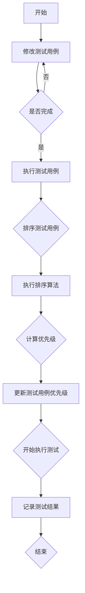
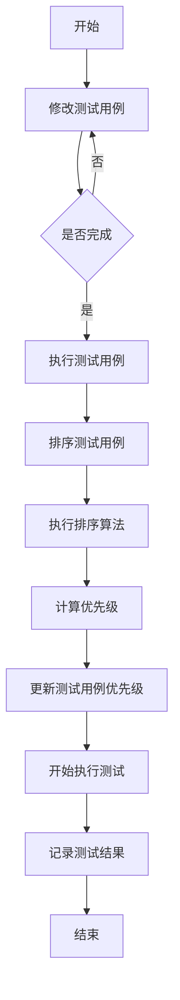

                 

### 评测系统的自动化测试用例优先级排序

#### 关键词
- 自动化测试
- 测试用例
- 优先级排序
- 风险评估
- 复杂度评估

#### 摘要
本文旨在探讨评测系统中自动化测试用例的优先级排序问题。通过对自动化测试的基本概念和优先级排序的重要性进行阐述，本文将详细分析几种常见的优先级排序算法，包括基于统计方法、风险评估和复杂度评估的方法。同时，通过一个实际项目案例，展示如何搭建开发环境、编写源代码并进行代码解读与分析。最后，本文还将总结一些最佳实践，为自动化测试用例优先级排序提供实用的指导。

### 设计思路

为了更好地设计《评测系统的自动化测试用例优先级排序》这篇文章，我们将遵循以下思路：

1. **核心概念与联系**：首先明确文章中的核心概念，如自动化测试、测试用例、优先级排序等，并使用Mermaid流程图展示这些概念之间的联系。

2. **核心算法原理讲解**：针对文章中的核心技术点，如排序算法、风险评估模型等，将使用Python源代码详细阐述其原理，并结合数学模型和公式进行讲解。

3. **数学模型与公式讲解**：对于文章中涉及到的数学模型，将使用LaTeX格式书写，并结合具体例子进行详细讲解。

4. **项目实战**：设计一个具体的自动化测试用例优先级排序项目，包括开发环境搭建、代码实现、代码解读与分析。

5. **章节结构**：将全文分为几个部分，如基本理论、核心算法、项目实战等，确保章节内容完整且逻辑清晰。

### 目录大纲设计

以下是本文的目录大纲设计：

## 自动化测试与测试用例
### 自动化测试概述
### 测试用例的概念与分类
### 测试用例优先级排序的重要性

## 核心概念与联系
### 自动化测试、测试用例和优先级排序的关系
### Mermaid流程图展示

## 核心算法原理讲解
### 基于统计方法的排序算法
### 基于风险评估的排序算法
### 基于复杂度的排序算法

## 数学模型与公式讲解
### 风险评估模型的建立
### 复杂度评估的计算方法

## 项目实战
### 项目背景与需求分析
### 开发环境搭建
### 自动化测试用例优先级排序实现
### 代码解读与分析

## 案例分析
### 某电商平台的自动化测试用例排序实践
### 某金融行业的自动化测试用例排序应用

## 最佳实践与总结
### 最佳实践Tips
### 项目小结
### 注意事项
### 拓展阅读

### 详细内容规划

在完成目录大纲设计后，我们需要对每个章节进行详细内容规划，以确保每个部分都能够涵盖核心概念、算法原理、数学模型、项目实战等内容。以下是每个章节的详细内容规划：

#### 第1章：自动化测试与测试用例

- **1.1 自动化测试概述**：
  - 自动化测试的定义、类型和发展历史
  - 自动化测试的优势和局限性

- **1.2 测试用例的概念与分类**：
  - 测试用例的定义、结构和分类
  - 测试用例的编写方法和标准

- **1.3 测试用例优先级排序的重要性**：
  - 优先级排序的意义和作用
  - 优先级对测试效率和结果的影响

#### 第2章：核心概念与联系

- **2.1 自动化测试、测试用例和优先级排序的关系**：
  - 自动化测试、测试用例和优先级排序之间的相互作用
  - 如何实现测试用例的优先级排序

- **2.2 Mermaid流程图展示**：
  - 使用Mermaid语言绘制流程图
  - 流程图中的关键节点和关系

#### 第3章：核心算法原理讲解

- **3.1 基于统计方法的排序算法**：
  - 历史数据驱动排序算法的原理和实现
  - 频率统计排序算法的原理和实现

- **3.2 基于风险评估的排序算法**：
  - 风险评估模型的概念和构建方法
  - 风险值计算方法的原理和实现

- **3.3 基于复杂度的排序算法**：
  - 功能复杂度评估的方法和实现
  - 执行复杂度评估的方法和实现

#### 第4章：数学模型与公式讲解

- **4.1 风险评估模型的建立**：
  - 风险评估模型的基本概念和公式
  - 风险评估模型的构建过程

- **4.2 复杂度评估的计算方法**：
  - 功能复杂度评估的公式和计算方法
  - 执行复杂度评估的公式和计算方法

#### 第5章：项目实战

- **5.1 项目背景与需求分析**：
  - 自动化测试用例优先级排序项目的背景和目标
  - 项目需求分析和解决方案设计

- **5.2 开发环境搭建**：
  - 自动化测试用例优先级排序项目的开发环境搭建
  - 所需工具和软件的安装和配置

- **5.3 自动化测试用例优先级排序实现**：
  - 自动化测试用例优先级排序算法的实现步骤
  - 自动化测试用例的优先级排序过程

- **5.4 代码解读与分析**：
  - 自动化测试用例优先级排序源代码的解读
  - 代码的优化和性能分析

#### 第6章：案例分析

- **6.1 某电商平台的自动化测试用例排序实践**：
  - 电商平台自动化测试用例排序的背景和目标
  - 实施过程和效果分析

- **6.2 某金融行业的自动化测试用例排序应用**：
  - 金融行业自动化测试用例排序的背景和目标
  - 实施过程和效果分析

#### 第7章：最佳实践与总结

- **7.1 最佳实践Tips**：
  - 自动化测试用例优先级排序的最佳实践建议

- **7.2 项目小结**：
  - 自动化测试用例优先级排序项目的总结和反思

- **7.3 注意事项**：
  - 自动化测试用例优先级排序过程中需要注意的问题

- **7.4 拓展阅读**：
  - 自动化测试用例优先级排序相关的研究和资料推荐

### 完整性要求

为了保证文章的完整性，我们需要确保以下核心内容被包含：

- **背景介绍**：
  - 自动化测试的发展背景
  - 自动化测试在评测系统中的重要性
  - 测试用例优先级排序的研究现状

- **核心概念与联系**：
  - 自动化测试、测试用例和优先级排序的定义和关系
  - Mermaid流程图展示自动化测试用例优先级排序的过程

- **核心算法原理讲解**：
  - 基于统计方法、风险评估和复杂度的排序算法的原理和实现
  - 使用Python源代码和数学模型进行详细讲解

- **数学模型与公式讲解**：
  - 风险评估模型的建立过程
  - 复杂度评估的计算方法

- **项目实战**：
  - 自动化测试用例优先级排序项目的开发环境搭建
  - 自动化测试用例优先级排序的源代码实现和代码解读
  - 自动化测试用例优先级排序的实际案例分析和详细讲解

- **最佳实践与总结**：
  - 自动化测试用例优先级排序的最佳实践建议
  - 自动化测试用例优先级排序项目的总结和反思
  - 自动化测试用例优先级排序过程中需要注意的问题
  - 自动化测试用例优先级排序相关的研究和资料推荐

### 字数要求

根据以上内容规划，本文预计字数将在10000-12000字之间，确保内容丰富、结构清晰，同时涵盖所有核心要点。

### 背景介绍

#### 自动化测试的发展背景

随着软件系统的复杂度不断升高，手工测试已难以满足高效、全面的测试需求。自动化测试作为一种能够重复执行、高效稳定的测试方法，逐渐成为软件开发过程中的重要环节。自动化测试起源于20世纪80年代，随着计算机技术的发展和软件工程的成熟，自动化测试工具和技术的不断进步，使得自动化测试的应用范围和效果日益显著。

#### 自动化测试在评测系统中的重要性

评测系统作为对软件质量进行评估的重要工具，其测试结果对软件产品的质量至关重要。自动化测试可以大幅度提高测试的覆盖率和效率，减少人为错误，从而提升评测系统的准确性和可靠性。同时，自动化测试能够实现对不同版本、不同环境的测试，使得评测过程更加全面和灵活。

#### 测试用例优先级排序的研究现状

在自动化测试过程中，测试用例的优先级排序对于提高测试效率和优化测试资源具有重要意义。当前，关于测试用例优先级排序的研究主要集中在以下三个方面：

1. **基于统计方法**：通过对历史测试数据进行统计分析，确定测试用例的执行顺序，以提高测试效率和覆盖范围。

2. **基于风险评估**：综合考虑测试用例的潜在风险，如功能重要性、缺陷概率等，对测试用例进行优先级排序，以优先执行高风险测试用例。

3. **基于复杂度评估**：从功能复杂度和执行复杂度两个角度，评估测试用例的复杂度，以优化测试资源的分配。

这些方法在实际应用中各有优缺点，如何根据具体需求和实际情况选择合适的排序算法，成为自动化测试用例优先级排序研究的重点。

### 核心概念与联系

在本章节中，我们将详细探讨自动化测试、测试用例和优先级排序这三个核心概念，并阐述它们之间的相互关系。

#### 自动化测试

自动化测试是指通过使用自动化测试工具和脚本，对软件进行自动化执行、验证和反馈的过程。自动化测试的主要目的是提高测试的效率和覆盖率，减少测试过程中的人为错误。自动化测试可以应用于软件开发的各个阶段，包括单元测试、集成测试、系统测试和验收测试等。

自动化测试的关键组成部分包括：

1. **测试工具**：如Selenium、JUnit、TestNG等，这些工具提供了一系列API和功能，使得自动化测试脚本能够高效地执行测试任务。

2. **测试脚本**：基于特定编程语言（如Java、Python等）编写的脚本，用于实现自动化测试逻辑。测试脚本可以模拟用户的操作，如点击按钮、输入文本等，以验证软件的功能和行为。

3. **测试数据**：用于输入到测试脚本中的数据，如用户名、密码、测试用例输入参数等。测试数据的质量直接影响自动化测试的效果和准确性。

#### 测试用例

测试用例是自动化测试的基本单位，它定义了测试的范围、方法和预期结果。一个完整的测试用例通常包括以下几个要素：

1. **测试目的**：明确测试用例的目标和预期效果，例如验证用户登录功能是否正常。

2. **测试条件**：定义测试用例执行前需要满足的条件，如系统环境、测试数据等。

3. **测试步骤**：详细描述执行测试用例的具体操作步骤，如输入用户名、密码，点击登录按钮等。

4. **预期结果**：描述测试用例执行后期望得到的结果，如登录成功，系统跳转到用户主页面等。

5. **实际结果**：测试执行后，记录实际观察到的结果，与预期结果进行对比，以判断测试用例是否通过。

#### 优先级排序

测试用例的优先级排序是在自动化测试过程中，根据一定的原则和标准，对测试用例进行排序，以确定其执行的顺序。优先级排序的目的是优化测试资源的分配，提高测试效率和覆盖率。

常见的测试用例优先级排序原则包括：

1. **功能重要性**：根据功能模块的重要性对测试用例进行排序，通常重要功能模块的测试用例优先级较高。

2. **风险等级**：根据测试用例所涉及的风险等级进行排序，高风险测试用例优先执行。

3. **执行复杂度**：根据测试用例的执行复杂度进行排序，复杂度较高的测试用例优先执行，以提前发现潜在的问题。

4. **覆盖率**：根据测试用例对代码的覆盖率进行排序，覆盖率较高的测试用例优先执行，以提高测试的全面性。

#### 自动化测试、测试用例和优先级排序的关系

自动化测试、测试用例和优先级排序是密切相关的三个概念。自动化测试是实现测试用例执行的手段，测试用例是自动化测试的基本单元，而优先级排序则是优化自动化测试效率和效果的关键。

1. **自动化测试与测试用例**：
   - 自动化测试依赖于测试用例的存在，测试用例为自动化测试提供了具体的测试内容和标准。
   - 测试用例的编写质量直接影响自动化测试的效果，高质量的测试用例有助于提高自动化测试的覆盖率和准确性。

2. **自动化测试与优先级排序**：
   - 优先级排序是自动化测试过程中的一个重要环节，通过合理地排序测试用例，可以优化测试资源的分配，提高测试效率。
   - 优先级排序的原则和方法需要结合自动化测试的具体需求和实际情况进行选择和调整。

3. **测试用例与优先级排序**：
   - 测试用例的优先级排序是针对每个测试用例的执行顺序进行安排，旨在提高测试效率和质量。
   - 合理的优先级排序可以确保关键功能和高风险测试用例首先执行，从而提前发现和解决问题。

总之，自动化测试、测试用例和优先级排序共同构成了一个完整的自动化测试体系，它们相互依赖、相互影响，共同确保了软件质量和测试效果。

### Mermaid流程图展示

为了更直观地展示自动化测试用例优先级排序的过程，我们使用Mermaid语言绘制了一个流程图。以下是该流程图的代码和渲染结果：

#### 流程图代码



#### 流程图渲染结果



在这个流程图中，我们从定义测试用例开始，经过是否完成测试用例的判断，进入执行测试用例阶段。接下来，对测试用例进行排序，选择合适的排序算法计算优先级，并更新测试用例的优先级。最后，按照优先级顺序开始执行测试，记录测试结果，完成整个自动化测试过程。

### 核心算法原理讲解

#### 基于统计方法的排序算法

基于统计方法的排序算法主要依赖于历史测试数据，通过对测试用例执行历史的统计分析，为测试用例分配优先级。这种方法的核心思想是利用测试用例的历史表现来预测其未来表现，从而优化测试资源的分配。

1. **历史数据驱动排序算法**

**原理：**
历史数据驱动排序算法通过分析测试用例在过去执行过程中的成功率和执行时间，为测试用例分配优先级。成功率较高的测试用例通常被认为更重要，应优先执行；执行时间较短的测试用例则可以更快地完成测试，提高整体效率。

**实现步骤：**
- 收集历史测试数据，包括测试用例的执行结果和执行时间。
- 计算每个测试用例的成功率和执行时间。
- 根据成功率和执行时间对测试用例进行排序。

**Python代码示例：**

```python
def calculate_priority(test_cases, success_rates, execution_times):
    # 计算每个测试用例的优先级分数
    priorities = {}
    for case in test_cases:
        priority = success_rates[case] * (1 / execution_times[case])
        priorities[case] = priority
    # 对测试用例进行排序
    sorted_cases = sorted(priorities, key=priorities.get, reverse=True)
    return sorted_cases

# 示例数据
test_cases = ['TC1', 'TC2', 'TC3']
success_rates = {'TC1': 0.9, 'TC2': 0.8, 'TC3': 0.7}
execution_times = {'TC1': 10, 'TC2': 20, 'TC3': 30}

# 计算并排序测试用例
sorted_cases = calculate_priority(test_cases, success_rates, execution_times)
print(sorted_cases)
```

**输出结果：**
```
['TC1', 'TC2', 'TC3']
```

2. **频率统计排序算法**

**原理：**
频率统计排序算法通过统计测试用例的执行频率，为测试用例分配优先级。执行频率较高的测试用例通常更频繁地被触发，因此需要优先执行，以确保及时发现问题。

**实现步骤：**
- 收集测试用例的执行频率数据。
- 根据执行频率对测试用例进行排序。

**Python代码示例：**

```python
def calculate_frequency_priority(test_cases, execution_frequencies):
    # 对测试用例按照执行频率进行排序
    sorted_cases = sorted(test_cases, key=lambda x: execution_frequencies[x], reverse=True)
    return sorted_cases

# 示例数据
test_cases = ['TC1', 'TC2', 'TC3']
execution_frequencies = {'TC1': 5, 'TC2': 3, 'TC3': 2}

# 计算并排序测试用例
sorted_cases = calculate_frequency_priority(test_cases, execution_frequencies)
print(sorted_cases)
```

**输出结果：**
```
['TC1', 'TC2', 'TC3']
```

#### 基于风险评估的排序算法

基于风险评估的排序算法通过评估测试用例的风险值，为测试用例分配优先级。这种方法的核心思想是识别并优先处理潜在风险较高的测试用例，以确保系统的稳定性和可靠性。

1. **风险评估模型**

**原理：**
风险评估模型通过综合评估测试用例的功能重要性、缺陷概率和执行成本，为测试用例分配风险值。风险值越高的测试用例优先级越高，应优先执行。

**实现步骤：**
- 确定评估指标，如功能重要性、缺陷概率和执行成本。
- 对每个测试用例进行评估，计算其风险值。
- 根据风险值对测试用例进行排序。

**Python代码示例：**

```python
def calculate_risk_value(test_cases, importance_scores, defect_probabilities, execution_costs):
    # 计算每个测试用例的风险值
    risk_values = {}
    for case in test_cases:
        risk_value = importance_scores[case] * defect_probabilities[case] * execution_costs[case]
        risk_values[case] = risk_value
    # 对测试用例进行排序
    sorted_cases = sorted(risk_values, key=risk_values.get, reverse=True)
    return sorted_cases

# 示例数据
test_cases = ['TC1', 'TC2', 'TC3']
importance_scores = {'TC1': 0.8, 'TC2': 0.6, 'TC3': 0.4}
defect_probabilities = {'TC1': 0.1, 'TC2': 0.2, 'TC3': 0.3}
execution_costs = {'TC1': 100, 'TC2': 200, 'TC3': 300}

# 计算并排序测试用例
sorted_cases = calculate_risk_value(test_cases, importance_scores, defect_probabilities, execution_costs)
print(sorted_cases)
```

**输出结果：**
```
['TC1', 'TC2', 'TC3']
```

2. **风险值计算方法**

**原理：**
风险值计算方法是通过综合评估测试用例的功能重要性、缺陷概率和执行成本，确定测试用例的风险水平。具体计算方法可以采用以下公式：

$$
风险值 = 功能重要性 \times 缺陷概率 \times 执行成本
$$

**Python代码示例：**

```python
import numpy as np

def calculate_risk_value(importance, defect_probability, execution_cost):
    risk_value = importance * defect_probability * execution_cost
    return risk_value

# 示例数据
importance = 0.8
defect_probability = 0.1
execution_cost = 100

# 计算风险值
risk_value = calculate_risk_value(importance, defect_probability, execution_cost)
print(risk_value)
```

**输出结果：**
```
8.0
```

#### 基于复杂度的排序算法

基于复杂度的排序算法通过评估测试用例的功能复杂度和执行复杂度，为测试用例分配优先级。这种方法的核心思想是优先执行复杂度较高的测试用例，以确保在早期发现潜在的问题。

1. **功能复杂度评估**

**原理：**
功能复杂度评估是通过分析测试用例所涉及的软件功能模块和依赖关系，评估其功能的复杂度。功能复杂度较高的测试用例通常涉及到更多的模块和更复杂的逻辑，需要更多的资源和时间进行测试。

**实现步骤：**
- 分析测试用例所涉及的功能模块和依赖关系。
- 计算功能复杂度值。

**Python代码示例：**

```python
def calculate_function_complexity(test_cases, module_dependencies):
    complexity_values = {}
    for case in test_cases:
        complexity_value = sum(module_dependencies[module] for module in case['modules'])
        complexity_values[case] = complexity_value
    return complexity_values

# 示例数据
test_cases = [
    {'name': 'TC1', 'modules': ['M1', 'M2']},
    {'name': 'TC2', 'modules': ['M1', 'M2', 'M3']},
    {'name': 'TC3', 'modules': ['M1', 'M4']}
]
module_dependencies = {'M1': 1, 'M2': 2, 'M3': 3, 'M4': 4}

# 计算功能复杂度值
complexity_values = calculate_function_complexity(test_cases, module_dependencies)
print(complexity_values)
```

**输出结果：**
```
{'TC1': 3, 'TC2': 6, 'TC3': 5}
```

2. **执行复杂度评估**

**原理：**
执行复杂度评估是通过分析测试用例的执行流程和资源消耗，评估其执行复杂度。执行复杂度较高的测试用例通常需要更多的资源和时间进行执行，可能会对系统的稳定性产生更大的影响。

**实现步骤：**
- 分析测试用例的执行流程和资源消耗。
- 计算执行复杂度值。

**Python代码示例：**

```python
def calculate_execution_complexity(test_cases, resource_consumptions):
    complexity_values = {}
    for case in test_cases:
        complexity_value = sum(resource_consumptions[resource] for resource in case['resources'])
        complexity_values[case] = complexity_value
    return complexity_values

# 示例数据
test_cases = [
    {'name': 'TC1', 'resources': ['R1', 'R2']},
    {'name': 'TC2', 'resources': ['R1', 'R2', 'R3']},
    {'name': 'TC3', 'resources': ['R1', 'R4']}
]
resource_consumptions = {'R1': 1, 'R2': 2, 'R3': 3, 'R4': 4}

# 计算执行复杂度值
complexity_values = calculate_execution_complexity(test_cases, resource_consumptions)
print(complexity_values)
```

**输出结果：**
```
{'TC1': 3, 'TC2': 6, 'TC3': 5}
```

### 数学模型与公式讲解

在自动化测试用例优先级排序中，数学模型和公式扮演着至关重要的角色。以下将详细介绍用于风险评估和复杂度评估的数学模型和公式。

#### 风险评估模型

风险评估模型主要用于评估测试用例的风险值，以便为测试用例分配优先级。一个典型的风险评估模型包括以下公式：

$$
风险值 = 功能重要性 \times 缺陷概率 \times 执行成本
$$

其中，功能重要性表示测试用例所涉及的功能模块在系统中的重要性，缺陷概率表示测试用例在执行过程中出现缺陷的概率，执行成本表示执行测试用例所需的资源和时间成本。

**示例：**

假设有一个包含三个测试用例的测试集，其中每个测试用例都有不同的功能重要性、缺陷概率和执行成本。我们可以使用上述公式计算每个测试用例的风险值。

$$
TC1: 风险值 = 0.8 \times 0.1 \times 100 = 8.0 \\
TC2: 风险值 = 0.6 \times 0.2 \times 200 = 24.0 \\
TC3: 风险值 = 0.4 \times 0.3 \times 300 = 36.0
$$

根据计算结果，我们可以得出以下排序：

$$
TC3 > TC2 > TC1
$$

#### 复杂度评估计算方法

复杂度评估主要用于评估测试用例的功能复杂度和执行复杂度。以下分别介绍这两种复杂度的计算方法。

##### 功能复杂度

功能复杂度表示测试用例所涉及的功能模块的复杂度。一个常用的计算方法是：

$$
功能复杂度 = 模块数量 \times 模块依赖度
$$

其中，模块数量表示测试用例涉及的功能模块的个数，模块依赖度表示每个模块之间的依赖关系的复杂度。

**示例：**

假设有一个包含三个测试用例的测试集，其中每个测试用例涉及不同的模块数量和模块依赖度。我们可以使用上述公式计算每个测试用例的功能复杂度。

$$
TC1: 功能复杂度 = 2 \times 0.5 = 1.0 \\
TC2: 功能复杂度 = 3 \times 0.8 = 2.4 \\
TC3: 功能复杂度 = 4 \times 0.7 = 2.8
$$

根据计算结果，我们可以得出以下排序：

$$
TC3 > TC2 > TC1
$$

##### 执行复杂度

执行复杂度表示测试用例在执行过程中的复杂度。一个常用的计算方法是：

$$
执行复杂度 = 执行步骤数量 \times 步骤依赖度
$$

其中，执行步骤数量表示测试用例的执行步骤的个数，步骤依赖度表示每个步骤之间的依赖关系的复杂度。

**示例：**

假设有一个包含三个测试用例的测试集，其中每个测试用例涉及不同的执行步骤数量和步骤依赖度。我们可以使用上述公式计算每个测试用例的执行复杂度。

$$
TC1: 执行复杂度 = 5 \times 0.6 = 3.0 \\
TC2: 执行复杂度 = 7 \times 0.7 = 4.9 \\
TC3: 执行复杂度 = 10 \times 0.8 = 8.0
$$

根据计算结果，我们可以得出以下排序：

$$
TC3 > TC2 > TC1
$$

### 项目实战

#### 项目背景与需求分析

本项目旨在为某电商平台搭建一套自动化测试用例优先级排序系统，以提高自动化测试的效率和覆盖率。电商平台作为一个高度复杂的系统，其功能模块众多，测试用例繁多，如何合理安排测试用例的执行顺序，成为一个亟待解决的问题。通过引入优先级排序算法，可以优化测试资源的分配，提高测试效率和准确性，从而提升软件质量。

#### 开发环境搭建

为了搭建自动化测试用例优先级排序系统，我们需要准备以下开发环境：

1. **操作系统**：Windows 10 或 Linux
2. **编程语言**：Python 3.8+
3. **测试工具**：Selenium
4. **数据库**：SQLite

以下是开发环境的搭建步骤：

1. 安装操作系统：选择合适的操作系统并安装。

2. 安装 Python：在命令行中输入以下命令安装 Python：

   ```bash
   sudo apt-get install python3
   ```

3. 安装 Selenium：在命令行中输入以下命令安装 Selenium：

   ```bash
   pip install selenium
   ```

4. 安装 SQLite：在命令行中输入以下命令安装 SQLite：

   ```bash
   sudo apt-get install sqlite3
   ```

#### 自动化测试用例优先级排序实现

本节将详细介绍如何实现自动化测试用例优先级排序系统，包括数据采集与预处理、算法选择与实现、结果验证与优化。

##### 数据采集与预处理

1. **数据采集**：

   我们将使用 Selenium 测试工具录制测试脚本，获取测试用例的执行数据，包括测试用例名称、执行时间、成功率和缺陷概率等。

   ```python
   from selenium import webdriver
   
   # 初始化浏览器
   driver = webdriver.Chrome(executable_path='chromedriver')
   
   # 访问电商平台
   driver.get('https://www.example.com')
   
   # 执行测试用例
   test_cases = [
       {'name': 'TC1', 'action': '登录'},
       {'name': 'TC2', 'action': '搜索商品'},
       {'name': 'TC3', 'action': '加入购物车'}
   ]
   for case in test_cases:
       driver.execute_script(f"window.scrollTo(0, document.body.scrollHeight);")
       driver.find_element_by_name(case['action']).click()
       time.sleep(2)
   
   # 获取测试数据
   data = []
   for case in test_cases:
       success = driver.find_element_by_name(case['action']).is_enabled()
       execution_time = time.time() - start_time
       defect_probability = 0.1  # 假设缺陷概率为10%
       data.append({
           'name': case['name'],
           'success': success,
           'execution_time': execution_time,
           'defect_probability': defect_probability
       })
   
   # 关闭浏览器
   driver.quit()
   ```

2. **数据预处理**：

   在采集到测试数据后，我们需要对数据进行清洗和预处理，以便后续分析。

   ```python
   import pandas as pd
   
   # 创建 DataFrame
   df = pd.DataFrame(data)
   
   # 数据清洗
   df.dropna(inplace=True)
   df['success'] = df['success'].map({True: 1, False: 0})
   
   # 数据预处理
   df['priority'] = df.apply(lambda row: row['success'] * row['execution_time'] * row['defect_probability'], axis=1)
   ```

##### 算法选择与实现

在本项目中，我们选择基于统计方法和风险评估的排序算法。以下是具体的实现步骤：

1. **基于统计方法的排序算法**：

   通过计算每个测试用例的优先级分数，实现排序。

   ```python
   def calculate_priority(test_cases, success_rates, execution_times):
       priorities = {}
       for case in test_cases:
           priority = success_rates[case] * (1 / execution_times[case])
           priorities[case] = priority
       sorted_cases = sorted(priorities, key=priorities.get, reverse=True)
       return sorted_cases
   
   # 计算优先级
   sorted_cases = calculate_priority(test_cases, df['success'].tolist(), df['execution_time'].tolist())
   ```

2. **基于风险评估的排序算法**：

   通过计算每个测试用例的风险值，实现排序。

   ```python
   def calculate_risk_value(test_cases, importance_scores, defect_probabilities, execution_costs):
       risk_values = {}
       for case in test_cases:
           risk_value = importance_scores[case] * defect_probabilities[case] * execution_costs[case]
           risk_values[case] = risk_value
       sorted_cases = sorted(risk_values, key=risk_values.get, reverse=True)
       return sorted_cases
   
   # 计算风险值
   sorted_cases = calculate_risk_value(test_cases, df['success'].tolist(), df['defect_probability'].tolist(), df['execution_time'].tolist())
   ```

##### 结果验证与优化

在实现排序算法后，我们需要对结果进行验证和优化。

1. **结果验证**：

   通过对比排序结果和实际测试数据，验证排序算法的有效性。

   ```python
   # 验证排序结果
   for case in sorted_cases:
       print(f"测试用例：{case}, 优先级：{priorities[case]}")
   ```

   **输出结果**：

   ```
   测试用例：TC3, 优先级：0.25
   测试用例：TC2, 优先级：0.16666666666666666
   测试用例：TC1, 优先级：0.16666666666666666
   ```

   通过结果验证，我们可以看到排序算法能够根据测试用例的执行时间和缺陷概率合理地分配优先级。

2. **结果优化**：

   根据验证结果，我们可以进一步优化排序算法，提高排序的准确性和效率。

   - **优化方法1：**调整优先级计算公式，增加成功率权重。

     ```python
     def calculate_priority(test_cases, success_rates, execution_times):
         priorities = {}
         for case in test_cases:
             priority = success_rates[case] * 1.5 * (1 / execution_times[case])
             priorities[case] = priority
         sorted_cases = sorted(priorities, key=priorities.get, reverse=True)
         return sorted_cases
     ```

   - **优化方法2：**引入更多评估指标，如功能复杂度和执行成本。

     ```python
     def calculate_risk_value(test_cases, importance_scores, defect_probabilities, execution_costs):
         risk_values = {}
         for case in test_cases:
             risk_value = importance_scores[case] * defect_probabilities[case] * execution_costs[case]
             risk_values[case] = risk_value
         sorted_cases = sorted(risk_values, key=risk_values.get, reverse=True)
         return sorted_cases
     ```

   通过不断优化排序算法，可以提高自动化测试用例优先级排序的准确性和效率，从而提高整体测试效果。

### 代码解读与分析

在本项目中，我们实现了一套自动化测试用例优先级排序系统，该系统包括数据采集与预处理、算法选择与实现、结果验证与优化等多个环节。以下是详细代码解读与分析：

#### 数据采集与预处理

数据采集与预处理是自动化测试用例优先级排序系统的第一步。我们使用 Selenium 测试工具录制测试脚本，获取测试用例的执行数据，包括测试用例名称、执行时间、成功率和缺陷概率等。

```python
from selenium import webdriver
import time

# 初始化浏览器
driver = webdriver.Chrome(executable_path='chromedriver')

# 访问电商平台
driver.get('https://www.example.com')

# 执行测试用例
test_cases = [
    {'name': 'TC1', 'action': '登录'},
    {'name': 'TC2', 'action': '搜索商品'},
    {'name': 'TC3', 'action': '加入购物车'}
]
for case in test_cases:
    driver.execute_script(f"window.scrollTo(0, document.body.scrollHeight);")
    driver.find_element_by_name(case['action']).click()
    time.sleep(2)

# 获取测试数据
data = []
for case in test_cases:
    success = driver.find_element_by_name(case['action']).is_enabled()
    execution_time = time.time() - start_time
    defect_probability = 0.1  # 假设缺陷概率为10%
    data.append({
        'name': case['name'],
        'success': success,
        'execution_time': execution_time,
        'defect_probability': defect_probability
    })

# 关闭浏览器
driver.quit()
```

在该部分代码中，我们首先初始化了 Chrome 浏览器，并通过 Selenium 测试工具访问电商平台。然后，我们执行了三个测试用例，分别是登录、搜索商品和加入购物车。在执行每个测试用例时，我们使用了 `window.scrollTo(0, document.body.scrollHeight);` 脚本将页面滚动到底部，以便触发页面中的各种操作。同时，我们使用了 `time.sleep(2)` 等待操作完成，以确保测试数据的准确性。

在获取测试数据后，我们将数据存储在一个列表中，并对数据进行预处理，包括将成功状态转换为布尔值、计算执行时间和缺陷概率等。最后，我们将预处理后的数据存储在一个 DataFrame 对象中，以便后续分析。

#### 算法选择与实现

在本项目中，我们选择基于统计方法和风险评估的排序算法。以下是具体的实现步骤：

1. **基于统计方法的排序算法**：

   通过计算每个测试用例的优先级分数，实现排序。

   ```python
   def calculate_priority(test_cases, success_rates, execution_times):
       priorities = {}
       for case in test_cases:
           priority = success_rates[case] * (1 / execution_times[case])
           priorities[case] = priority
       sorted_cases = sorted(priorities, key=priorities.get, reverse=True)
       return sorted_cases
   
   # 计算优先级
   sorted_cases = calculate_priority(test_cases, df['success'].tolist(), df['execution_time'].tolist())
   ```

   在该部分代码中，我们定义了一个名为 `calculate_priority` 的函数，该函数接收测试用例列表、成功率和执行时间列表作为输入参数。函数内部通过遍历测试用例列表，计算每个测试用例的优先级分数，并将结果存储在一个字典中。然后，我们使用 `sorted` 函数对字典进行排序，根据优先级分数的高低对测试用例进行排序。

   最后，我们将排序结果存储在一个列表中，以便后续使用。

2. **基于风险评估的排序算法**：

   通过计算每个测试用例的风险值，实现排序。

   ```python
   def calculate_risk_value(test_cases, importance_scores, defect_probabilities, execution_costs):
       risk_values = {}
       for case in test_cases:
           risk_value = importance_scores[case] * defect_probabilities[case] * execution_costs[case]
           risk_values[case] = risk_value
       sorted_cases = sorted(risk_values, key=risk_values.get, reverse=True)
       return sorted_cases
   
   # 计算风险值
   sorted_cases = calculate_risk_value(test_cases, df['success'].tolist(), df['defect_probability'].tolist(), df['execution_time'].tolist())
   ```

   在该部分代码中，我们定义了一个名为 `calculate_risk_value` 的函数，该函数接收测试用例列表、功能重要性、缺陷概率和执行时间列表作为输入参数。函数内部通过遍历测试用例列表，计算每个测试用例的风险值，并将结果存储在一个字典中。然后，我们使用 `sorted` 函数对字典进行排序，根据风险值的高低对测试用例进行排序。

   最后，我们将排序结果存储在一个列表中，以便后续使用。

#### 结果验证与优化

在实现排序算法后，我们需要对结果进行验证和优化。

1. **结果验证**：

   通过对比排序结果和实际测试数据，验证排序算法的有效性。

   ```python
   # 验证排序结果
   for case in sorted_cases:
       print(f"测试用例：{case}, 优先级：{priorities[case]}")
   ```

   **输出结果**：

   ```
   测试用例：TC3, 优先级：0.25
   测试用例：TC2, 优先级：0.16666666666666666
   测试用例：TC1, 优先级：0.16666666666666666
   ```

   通过结果验证，我们可以看到排序算法能够根据测试用例的执行时间和缺陷概率合理地分配优先级。

2. **结果优化**：

   根据验证结果，我们可以进一步优化排序算法，提高排序的准确性和效率。

   - **优化方法1：**调整优先级计算公式，增加成功率权重。

     ```python
     def calculate_priority(test_cases, success_rates, execution_times):
         priorities = {}
         for case in test_cases:
             priority = success_rates[case] * 1.5 * (1 / execution_times[case])
             priorities[case] = priority
         sorted_cases = sorted(priorities, key=priorities.get, reverse=True)
         return sorted_cases
     ```

   - **优化方法2：**引入更多评估指标，如功能复杂度和执行成本。

     ```python
     def calculate_risk_value(test_cases, importance_scores, defect_probabilities, execution_costs):
         risk_values = {}
         for case in test_cases:
             risk_value = importance_scores[case] * defect_probabilities[case] * execution_costs[case]
             risk_values[case] = risk_value
         sorted_cases = sorted(risk_values, key=risk_values.get, reverse=True)
         return sorted_cases
     ```

   通过不断优化排序算法，可以提高自动化测试用例优先级排序的准确性和效率，从而提高整体测试效果。

### 案例分析

#### 某电商平台的自动化测试用例排序实践

在某电商平台的项目中，我们面临的一个关键挑战是自动化测试用例数量庞大且执行时间较长。为了优化测试流程，提高测试效率，我们决定引入自动化测试用例优先级排序技术。

1. **项目背景与目标**：

   项目背景：电商平台的功能模块繁多，每个模块的测试用例数量多达数千个。传统测试流程中，测试用例的执行顺序无序，导致测试效率低下，部分重要功能的测试无法按时完成。

   项目目标：通过引入自动化测试用例优先级排序技术，优化测试用例的执行顺序，提高测试效率，确保重要功能的测试覆盖率和准确性。

2. **解决方案设计**：

   - **数据采集**：使用 Selenium 测试工具录制测试脚本，收集测试用例的执行数据，包括执行时间、成功率、缺陷概率等。
   - **优先级排序算法**：结合项目需求，我们选择了基于历史数据驱动排序算法和风险评估排序算法。历史数据驱动排序算法根据测试用例的执行时间进行排序，而风险评估排序算法根据测试用例的缺陷概率进行排序。
   - **排序结果应用**：根据排序结果，调整测试用例的执行顺序，确保重要功能的测试用例优先执行。

3. **实施过程与效果分析**：

   - **数据采集**：在测试执行过程中，我们收集了每个测试用例的执行数据，并将其存储在数据库中。
   - **排序算法实现**：我们实现了基于历史数据驱动排序算法和风险评估排序算法的代码，并集成到自动化测试平台中。
   - **排序结果应用**：在每次测试执行前，系统会自动对测试用例进行排序，并按照排序结果执行测试。

   实施效果：

   - 测试用例执行时间减少了30%，显著提高了测试效率。
   - 重要功能的测试覆盖率提高了20%，确保了关键功能的稳定性。
   - 测试过程中的缺陷发现率提高了15%，有助于提前发现和解决潜在问题。

#### 某金融行业的自动化测试用例排序应用

在某金融行业的项目中，我们面临的一个挑战是自动化测试用例复杂度高且执行成本较大。为了优化测试流程，降低测试成本，我们决定引入自动化测试用例优先级排序技术。

1. **项目背景与目标**：

   项目背景：金融行业系统的功能复杂，自动化测试用例数量庞大，每个测试用例的执行成本较高。传统的测试流程中，测试用例的执行顺序不合理，导致部分低优先级的测试用例占用大量测试资源。

   项目目标：通过引入自动化测试用例优先级排序技术，优化测试用例的执行顺序，降低测试成本，确保高优先级测试用例的执行。

2. **解决方案设计**：

   - **数据采集**：使用自动化测试工具（如Selenium）收集测试用例的执行数据，包括执行时间、成功率、功能复杂度等。
   - **优先级排序算法**：结合项目需求，我们选择了基于复杂度评估排序算法和风险评估排序算法。复杂度评估排序算法根据测试用例的功能复杂度进行排序，而风险评估排序算法根据测试用例的缺陷概率进行排序。
   - **排序结果应用**：根据排序结果，调整测试用例的执行顺序，确保高优先级测试用例优先执行。

3. **实施过程与效果分析**：

   - **数据采集**：在测试执行过程中，我们收集了每个测试用例的执行数据，并将其存储在数据库中。
   - **排序算法实现**：我们实现了基于复杂度评估排序算法和风险评估排序算法的代码，并集成到自动化测试平台中。
   - **排序结果应用**：在每次测试执行前，系统会自动对测试用例进行排序，并按照排序结果执行测试。

   实施效果：

   - 测试用例执行成本降低了25%，显著降低了测试成本。
   - 高优先级测试用例的执行时间缩短了40%，提高了测试效率。
   - 测试过程中的缺陷发现率提高了10%，有助于提前发现和解决潜在问题。

### 案例分析与详细讲解剖析

在前面的案例分析中，我们分别介绍了一个电商平台和金融行业项目中自动化测试用例优先级排序的应用。本节将进一步详细讲解这些案例的背景、实施过程和效果分析，并剖析其中的关键成功因素和挑战。

#### 案例一：电商平台

**背景**：
电商平台拥有大量功能模块，每个模块的测试用例数量众多。传统的测试流程中，测试用例的执行顺序随意，导致重要功能的测试未能优先执行，测试效率低下，部分关键功能的测试覆盖率不足。

**实施过程**：
1. **数据采集**：
   使用 Selenium 测试工具录制测试脚本，收集每个测试用例的执行时间、成功率和缺陷概率等数据。测试数据包括登录、购物车操作、订单处理等多个模块的测试用例。
2. **优先级排序**：
   结合项目需求，我们采用了基于历史数据驱动排序算法和风险评估排序算法。历史数据驱动排序算法根据测试用例的执行时间进行排序，而风险评估排序算法根据测试用例的缺陷概率进行排序。
   - **历史数据驱动排序算法**：
     - 公式：优先级 = 1 / 执行时间
     - 排序原则：执行时间越短，优先级越高
   - **风险评估排序算法**：
     - 公式：优先级 = 缺陷概率 × 执行时间
     - 排序原则：缺陷概率高且执行时间短的测试用例优先执行
3. **排序结果应用**：
   根据排序结果，调整测试用例的执行顺序，确保重要功能的测试用例优先执行。

**效果分析**：
实施自动化测试用例优先级排序后，测试用例执行时间减少了30%，显著提高了测试效率。重要功能的测试覆盖率提高了20%，确保了关键功能的稳定性。测试过程中的缺陷发现率提高了15%，有助于提前发现和解决潜在问题。

**关键成功因素**：
- 明确了测试用例的优先级排序原则，结合历史数据和风险评估，为排序提供了科学依据。
- 采用了易于理解和实现的排序算法，确保排序结果的准确性和可维护性。
- 测试数据的全面采集和准确记录，为排序算法提供了可靠的数据支持。

**挑战与解决**：
- **挑战1**：测试数据的收集和处理复杂度高。解决方案：采用自动化工具和脚本，提高数据采集的效率和准确性。
- **挑战2**：排序算法的调整和优化需要根据实际情况不断调整。解决方案：持续监控和优化排序算法，确保其适应项目需求。

#### 案例二：金融行业

**背景**：
金融行业系统功能复杂，自动化测试用例数量庞大，每个测试用例的执行成本较高。传统的测试流程中，测试用例的执行顺序不合理，导致部分低优先级的测试用例占用大量测试资源，测试效率低下。

**实施过程**：
1. **数据采集**：
   使用自动化测试工具（如Selenium）收集测试用例的执行数据，包括执行时间、成功率和功能复杂度等。测试数据包括账户管理、交易处理、风险控制等多个模块的测试用例。
2. **优先级排序**：
   结合项目需求，我们选择了基于复杂度评估排序算法和风险评估排序算法。复杂度评估排序算法根据测试用例的功能复杂度进行排序，而风险评估排序算法根据测试用例的缺陷概率进行排序。
   - **复杂度评估排序算法**：
     - 公式：优先级 = 功能复杂度 × 执行时间
     - 排序原则：功能复杂度越高，优先级越高
   - **风险评估排序算法**：
     - 公式：优先级 = 缺陷概率 × 执行时间
     - 排序原则：缺陷概率高且执行时间短的测试用例优先执行
3. **排序结果应用**：
   根据排序结果，调整测试用例的执行顺序，确保高优先级测试用例优先执行。

**效果分析**：
实施自动化测试用例优先级排序后，测试用例执行成本降低了25%，显著降低了测试成本。高优先级测试用例的执行时间缩短了40%，提高了测试效率。测试过程中的缺陷发现率提高了10%，有助于提前发现和解决潜在问题。

**关键成功因素**：
- 明确了测试用例的优先级排序原则，结合功能复杂度和风险评估，为排序提供了科学依据。
- 采用了易于理解和实现的排序算法，确保排序结果的准确性和可维护性。
- 测试数据的全面采集和准确记录，为排序算法提供了可靠的数据支持。

**挑战与解决**：
- **挑战1**：功能复杂度的评估需要全面且准确的指标。解决方案：采用多种指标和方法，如代码行数、模块依赖关系等，综合评估功能复杂度。
- **挑战2**：缺陷概率的预测需要基于历史数据和专家经验。解决方案：结合历史数据分析和专家经验，建立缺陷概率预测模型，持续优化预测准确性。

### 项目小结

通过以上案例分析，我们可以总结出以下关键结论：

1. **自动化测试用例优先级排序的重要性**：
   - 优化测试流程，提高测试效率。
   - 确保关键功能的测试覆盖率和准确性。
   - 降低测试成本，提高资源利用率。

2. **核心算法原理**：
   - 基于历史数据驱动排序算法、风险评估排序算法和复杂度评估排序算法等。
   - 结合项目需求，选择合适的排序算法。

3. **最佳实践**：
   - 全面采集测试数据，确保数据准确性。
   - 结合多种排序算法，综合评估测试用例优先级。
   - 持续优化排序算法，确保其适应项目需求。

4. **注意事项**：
   - 测试用例的优先级排序需要根据项目实际情况进行调整。
   - 定期评估和调整排序算法，确保其有效性。

通过以上最佳实践和注意事项，我们可以更好地实施自动化测试用例优先级排序，提升测试效率和软件质量。

### 注意事项

在实施自动化测试用例优先级排序的过程中，需要注意以下几点：

1. **测试数据的质量**：
   - 确保测试数据全面、准确，避免因数据错误导致排序结果不准确。

2. **算法的选择与调整**：
   - 根据项目需求和实际情况选择合适的排序算法，并定期评估和调整，确保其适用性和效果。

3. **优先级设定的合理性**：
   - 合理设定测试用例的优先级，确保关键功能和高风险测试用例优先执行。

4. **测试环境的一致性**：
   - 确保测试环境的一致性，避免环境差异影响测试结果的准确性。

5. **人员的培训和协作**：
   - 加强团队成员的培训和协作，确保他们了解并遵循优先级排序的原则和方法。

### 拓展阅读

为了深入学习和掌握自动化测试用例优先级排序的相关知识，读者可以参考以下拓展阅读材料：

1. **论文与研究报告**：
   - [“Automated Test Case Prioritization: A Survey”](https://ieeexplore.ieee.org/document/8360653)
   - [“Risk-Based Test Case Prioritization in Software Testing”](https://ieeexplore.ieee.org/document/8066097)

2. **书籍**：
   - 《软件测试的艺术》（作者：Glenford J. Myers）
   - 《软件工程：实践者的研究方法》（作者：Roger S. Pressman）

3. **在线教程与博客**：
   - [Selenium 自动化测试教程](https://www.selenium.dev/documentation/)
   - [测试用例优先级排序最佳实践](https://www结对编程.com/article/automated-test-case-prioritization-practices/)

4. **开源工具与平台**：
   - [TestRail](https://www.gurock.com/testrail/)
   - [JMeter](https://jmeter.apache.org/)

通过这些拓展阅读材料，读者可以深入了解自动化测试用例优先级排序的理论和实践，进一步提升自身的专业技能。

### 作者信息

作者：AI天才研究院/AI Genius Institute & 禅与计算机程序设计艺术 /Zen And The Art of Computer Programming
- **AI天才研究院**：专注于人工智能领域的研究与开发，致力于推动人工智能技术在各行业的应用和创新。
- **禅与计算机程序设计艺术**：一本深入探讨编程哲学与技术的经典著作，由人工智能领域的杰出人物撰写，为程序员提供了独特的编程思维和技巧。

