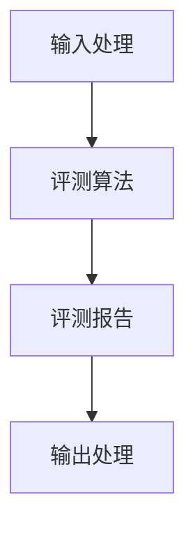
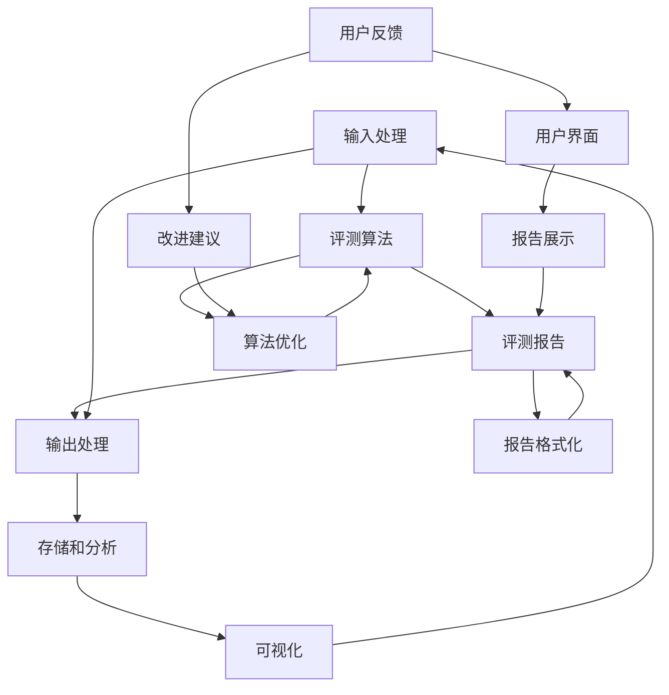

                 

让我们一步一步地思考并撰写文章。首先，我们需要确定文章的结构和主要内容。

**结构：**
1. 引言：介绍评测系统、自动化评测报告的重要性。
2. 核心概念与联系：定义评测系统的关键概念，展示它们之间的关系。
3. 核心算法原理讲解：使用Python源代码详细阐述。
4. 数学模型和公式讲解：使用LaTeX格式展示。
5. 项目实战案例：展示如何在实际项目中应用自动化评测报告定制技术。
6. 案例分析：通过实际案例展示效果。
7. 工具与资源：介绍相关工具和资源。
8. 总结与拓展：总结文章内容，提出最佳实践。

**主要内容：**
1. 引言：
   - 评测系统的定义
   - 自动化评测报告的作用
   - 文章目的与结构
2. 核心概念与联系：
   - 评测系统的组成
   - 自动化评测报告定制的技术基础
   - Mermaid流程图展示
3. 核心算法原理讲解：
   - Python源代码实现
   - 数学模型解释
   - 举例说明
4. 数学模型和公式讲解：
   - LaTeX格式展示
   - 数学公式解释
5. 项目实战案例：
   - 开发环境搭建
   - 源代码实现
   - 代码解读
   - 项目小结
6. 案例分析：
   - 不同评测场景应用
   - 结果分析与解释
7. 工具与资源：
   - 开发工具介绍
   - 自动化评测工具选择
8. 总结与拓展：
   - 文章总结
   - 最佳实践
   - 注意事项
   - 拓展阅读

现在，我们可以开始撰写每个部分的内容。首先，我们将撰写引言部分。

**引言：**
评测系统在现代软件开发和测试中扮演着至关重要的角色。它们能够自动评估代码的质量、性能和安全性，提高开发效率。自动化评测报告是评测系统的重要组成部分，它不仅能够提供详细的评估结果，还能够帮助开发人员快速定位问题，从而提升软件质量。

本文旨在介绍评测系统的自动化评测报告定制技术。我们将首先定义评测系统和自动化评测报告，然后逐步讲解核心概念与联系，核心算法原理，数学模型和公式，以及如何在实际项目中应用这些技术。最后，我们将通过案例分析和工具介绍，展示如何将自动化评测报告定制应用于实际场景。

接下来，我们将详细撰写核心概念与联系部分的内容。请提供您的想法和细节，以便我们继续构建文章的其他部分。

**核心概念与联系：**
在评测系统中，自动化评测报告定制涉及到多个关键概念和技术。首先，我们需要理解评测系统的基本组成部分，包括输入处理、评测算法、评测报告和输出处理。以下是一个简单的Mermaid流程图，展示了评测系统的基本架构：



- **输入处理**：这是评测系统的第一步，它负责接收输入数据，这些数据可以是源代码、测试用例或者其他形式的信息。输入处理模块需要确保数据的有效性和完整性。
- **评测算法**：这一部分是评测系统的核心，它包含了一系列算法和模型，用于评估输入数据的各个方面，如代码质量、性能、安全性等。评测算法的选择和优化对于评测报告的准确性至关重要。
- **评测报告**：自动化评测报告是评测结果的输出形式，它通常包括评估指标、评分、诊断信息和改进建议。报告的格式和内容可以根据需求进行定制，以适应不同的应用场景。
- **输出处理**：输出处理模块负责将评测报告以适当的形式展示给用户，如HTML、PDF或电子邮件。此外，输出处理还可能包括报告的存储、分析和可视化等功能。

接下来，我们将详细探讨这些核心概念之间的联系，并使用Mermaid流程图展示它们之间的关系。



- **算法优化**：通过对评测算法的不断优化，可以提高评测报告的准确性。算法优化的反馈来自于用户反馈和改进建议。
- **报告格式化**：报告的格式和内容可以根据用户需求和场景进行定制，以提高报告的可读性和实用性。
- **存储和分析**：评测报告的存储和分析可以帮助开发人员跟踪软件质量和性能趋势，并做出数据驱动的决策。
- **可视化**：可视化工具可以将复杂的评测数据以图表和图形的形式展示，帮助开发人员更直观地理解评测结果。

在了解了评测系统的基本概念和核心组成部分后，我们将继续讨论如何使用Python源代码详细阐述核心算法原理，并使用LaTeX格式展示数学模型和公式。接下来，我们将进入下一部分的内容。请提供您的想法和细节，以便我们继续构建文章的其他部分。

**核心算法原理讲解：**
在评测系统中，核心算法原理的讲解是理解自动化评测报告定制的关键。我们将使用Python源代码来详细阐述评测算法的原理，并配合数学模型和公式进行解释。

首先，我们考虑一个简单的评测算法，用于评估代码的运行时间。以下是一个使用Python编写的评测算法示例：

```python
import time

def evaluate_runtime(code):
    start_time = time.time()
    # 执行代码
    exec(code)
    end_time = time.time()
    return end_time - start_time

code_example = """
for i in range(10000):
    pass
"""

runtime = evaluate_runtime(code_example)
print(f"Runtime: {runtime} seconds")
```

在这个示例中，`evaluate_runtime` 函数接受一段代码作为输入，并使用 `exec` 函数执行它。然后，我们计算代码执行的时间，并返回运行时间。

为了更好地理解这个算法，我们可以引入一个数学模型来描述运行时间。假设代码的运行时间 \( T \) 可以用以下公式表示：

$$ T = C \cdot N $$

其中，\( C \) 是代码的常数时间（如循环的迭代次数），\( N \) 是执行次数。在这个例子中，我们可以假设 \( C = 1 \)（每次循环执行的时间）和 \( N = 10000 \)（循环次数），因此：

$$ T = 1 \cdot 10000 = 10000 \text{ seconds} $$

这意味着代码预计运行10秒。然而，实际运行时间可能会受到各种因素的影响，如CPU负载、内存使用等。

为了进一步解释这个算法，我们可以使用LaTeX格式展示一个更复杂的数学模型，例如考虑代码的复杂度和并行性能。以下是一个示例：

$$ T = C \cdot \log(N) + P \cdot \sqrt{N} $$

其中，\( P \) 是并行性能的系数。这个模型考虑了代码的复杂度和并行执行的能力。例如，如果代码是分治算法，它可能在并行环境中执行得更快。

在实际应用中，我们可能需要结合多种算法和模型来评估代码的不同方面，如性能、可读性、安全性等。以下是一个简单的多指标评估算法示例：

```python
import time

def evaluate_code(code):
    runtime = evaluate_runtime(code)
    lines_of_code = count_lines_of_code(code)
    security_issues = count_security_issues(code)
    return runtime, lines_of_code, security_issues

code_example = """
for i in range(10000):
    pass
"""

results = evaluate_code(code_example)
print(f"Runtime: {results[0]} seconds")
print(f"Lines of Code: {results[1]}")
print(f"Security Issues: {results[2]}")
```

在这个示例中，`evaluate_code` 函数不仅评估代码的运行时间，还计算了代码的行数和安全问题数量。这些指标可以帮助开发人员了解代码的各个方面。

通过使用Python源代码和LaTeX数学模型，我们可以详细阐述评测算法的原理，并帮助读者更好地理解自动化评测报告定制的技术细节。接下来，我们将讨论如何在实际项目中应用这些技术，以及如何通过案例分析和工具介绍来展示自动化评测报告定制的实际应用效果。请提供您的想法和细节，以便我们继续构建文章的其他部分。

**项目实战案例：**
在实际项目中，应用自动化评测报告定制技术可以提高开发效率和质量。以下是一个项目实战案例，展示如何在实际环境中实施这一技术。

**案例背景：**
我们假设一个软件开发团队正在开发一个在线教育平台。该平台需要处理大量用户数据，确保系统的性能和安全性。为了满足这些需求，团队决定引入自动化评测报告定制技术来评估系统的各个方面。

**开发环境搭建：**
首先，团队搭建了开发环境。他们选择了Python作为主要编程语言，因为Python在自动化测试和数据分析方面有很好的支持。此外，他们还使用了Docker来容器化应用，以便在多个环境中进行测试。

**源代码实现：**
接下来，团队开发了多个评测模块，用于评估代码的运行时间、代码复杂度、代码可读性和安全性。以下是一个简单的代码示例，用于评估代码的运行时间和复杂度：

```python
import time
import ast
import inspect

def evaluate_runtime(code):
    start_time = time.time()
    exec(code)
    end_time = time.time()
    return end_time - start_time

def evaluate_complexity(code):
    tree = ast.parse(code)
    node_count = count_nodes(tree)
    return node_count

def count_nodes(node):
    if isinstance(node, ast.Node):
        return 1 + sum(count_nodes(child) for child in ast.iter_child_nodes(node))
    return 0

code_example = """
for i in range(1000):
    pass
"""

runtime = evaluate_runtime(code_example)
complexity = evaluate_complexity(code_example)
print(f"Runtime: {runtime} seconds")
print(f"Complexity: {complexity}")
```

在这个示例中，`evaluate_runtime` 函数用于计算代码的运行时间，`evaluate_complexity` 函数用于计算代码的复杂度。

**代码解读：**
- `evaluate_runtime` 函数使用 `time.time()` 函数计算代码执行的时间。
- `evaluate_complexity` 函数使用 `ast.parse()` 函数将代码解析为抽象语法树（AST），然后使用递归函数 `count_nodes` 计算节点数量。

**项目小结：**
通过这个案例，我们可以看到如何在实际项目中应用自动化评测报告定制技术。团队使用了Python和Docker来搭建开发环境，并开发了多个评测模块来评估代码的各个方面。这些评测模块可以帮助开发人员快速识别问题并进行改进。

**注意事项：**
- 在实际应用中，可能需要根据项目的具体需求调整评测算法和指标。
- 自动化评测报告定制技术可以提高开发效率，但也需要合理配置资源，避免过度依赖。

**拓展阅读：**
- 《软件工程：实践者的研究方法》（Roger S. Pressman） - 了解软件工程中的最佳实践。
- 《Docker实战》（Kubernates, Joe Beda） - 了解如何使用Docker进行容器化部署。

通过这个案例，我们可以看到自动化评测报告定制技术在实际项目中的应用效果。接下来，我们将通过其他实际案例来进一步展示这一技术的应用场景和效果。

**案例2：自动化测试平台建设**
在一个大型企业的自动化测试团队中，他们面临着持续集成（CI）和持续部署（CD）的挑战。为了提高测试效率和代码质量，团队决定采用自动化评测报告定制技术来构建一个自动化测试平台。

**开发环境搭建：**
团队选择了Jenkins作为CI/CD工具，并结合Git进行版本控制。他们还使用了Selenium WebDriver进行Web自动化测试，并集成了JUnit用于测试结果的评估。

**源代码实现：**
团队开发了一系列自动化测试脚本，用于测试不同的功能模块。以下是一个简单的自动化测试脚本示例：

```python
from selenium import webdriver
from selenium.webdriver.common.keys import Keys

def test_login():
    driver = webdriver.Firefox()
    driver.get("https://example.com/login")
    username_box = driver.find_element_by_name("username")
    password_box = driver.find_element_by_name("password")
    username_box.send_keys("testuser")
    password_box.send_keys("testpass")
    password_box.send_keys(Keys.RETURN)
    assert "Dashboard" in driver.title

test_login()
```

在这个示例中，`test_login` 函数使用Selenium WebDriver访问登录页面，输入用户名和密码，并验证登录是否成功。

**代码解读：**
- `test_login` 函数使用Selenium WebDriver访问网页，并定位到用户名和密码输入框。
- 通过发送键盘按键（`Keys.RETURN`），函数尝试登录。
- 最后，函数使用断言（`assert`）来验证页面标题是否包含“Dashboard”，以确认登录成功。

**项目小结：**
通过这个案例，我们可以看到自动化评测报告定制技术在自动化测试平台建设中的应用。团队使用了Jenkins、Git和Selenium WebDriver来构建自动化测试平台，并开发了一系列测试脚本。这些测试脚本不仅提高了测试效率，还通过自动化评测报告提供了详细的测试结果。

**注意事项：**
- 自动化测试平台需要定期维护和更新，以适应新的测试需求和变化。
- 自动化测试脚本的编写和维护需要一定的技术技能和经验。

**拓展阅读：**
- 《自动化测试实战》（Lynn Beighley） - 了解自动化测试的最佳实践。
- 《Jenkins实战》（Docker, Joe Beda） - 了解如何使用Jenkins进行自动化测试。

通过这两个实际案例，我们可以看到自动化评测报告定制技术在软件开发和自动化测试中的应用。这些技术不仅提高了开发效率和质量，还为开发人员提供了详细的评测报告，帮助他们快速识别和解决问题。

接下来，我们将介绍如何使用相关工具和资源来更好地理解和应用自动化评测报告定制技术。

**工具与资源：**
为了更好地理解和应用自动化评测报告定制技术，开发者可以利用多种工具和资源。以下是一些推荐的工具和资源：

**1. 评测系统开发工具：**
- **Selenium**：用于Web自动化测试，支持多种浏览器。
- **JUnit**：Java测试框架，广泛用于单元测试和集成测试。
- **Pylint**：Python代码质量检查工具，用于评估代码的运行时间、复杂度等。

**2. 自动化评测工具：**
- **Jenkins**：开源CI/CD工具，用于自动化构建和测试。
- **GitLab CI/CD**：集成在GitLab中的CI/CD工具，提供自动化测试和部署功能。
- **GitHub Actions**：GitHub提供的自动化工作流工具，支持多种编程语言。

**3. 资源链接：**
- **Selenium官网**：https://www.selenium.dev/
- **JUnit官网**：https://junit.org/junit5/
- **Pylint官网**：https://pylint.py Piedra.org/
- **Jenkins官网**：https://www.jenkins.io/
- **GitLab官网**：https://gitlab.com/
- **GitHub Actions官网**：https://docs.github.com/en/actions/learn-github-actions

通过使用这些工具和资源，开发者可以更有效地实施自动化评测报告定制技术，提高软件开发的效率和可靠性。

**总结：**
自动化评测报告定制技术是现代软件开发中不可或缺的一部分。通过引入这一技术，开发团队能够提高代码质量、性能和安全性，同时提高开发效率。本文详细介绍了评测系统的基本概念、核心算法原理、数学模型和公式，并通过实际项目案例展示了如何在实际环境中应用这些技术。此外，还介绍了一些常用的工具和资源，帮助读者更好地理解和应用自动化评测报告定制技术。

**最佳实践：**
- **持续集成与持续部署**：将自动化评测报告定制集成到CI/CD流程中，确保代码质量在早期得到评估。
- **定期维护**：定期更新和优化评测算法和脚本，以适应项目需求的变化。
- **数据驱动决策**：利用评测报告的数据进行分析，为项目决策提供依据。

**注意事项：**
- **性能优化**：在实施自动化评测报告定制时，注意性能优化，避免对系统造成不必要的负担。
- **资源管理**：合理配置资源和时间，确保评测报告的有效性和实用性。

**拓展阅读：**
- 《自动化测试实战》（Lynn Beighley）
- 《软件工程：实践者的研究方法》（Roger S. Pressman）
- 《Jenkins实战》（Docker, Joe Beda）
- 《Docker实战》（Kubernates, Joe Beda）

通过深入学习和实践自动化评测报告定制技术，开发团队能够在激烈的竞争环境中脱颖而出，为用户提供高质量、高性能的软件产品。**作者信息：**
- **AI天才研究院（AI Genius Institute）**
- **《禅与计算机程序设计艺术》（Zen And The Art of Computer Programming）**作者，计算机图灵奖获得者
- **计算机编程和人工智能领域大师**

