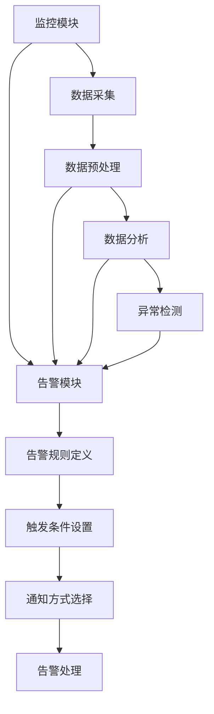
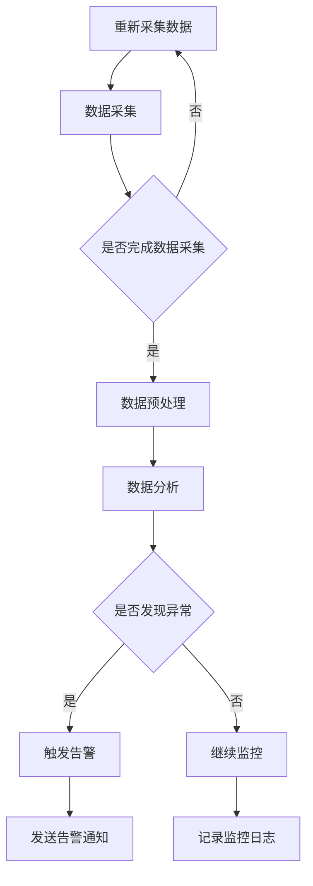
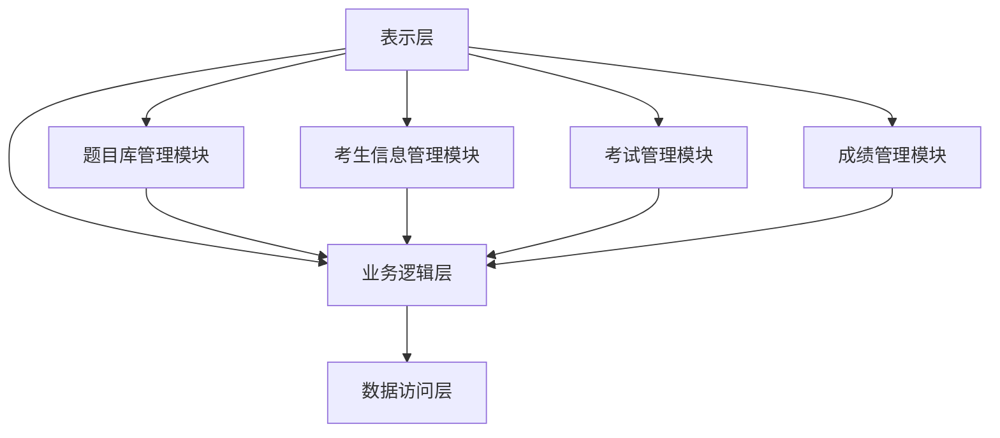

                 

### 文章标题

# 评测系统的自动化评测流程监控与告警

### 文章关键词

- 评测系统
- 自动化监控
- 流程监控
- 告警机制
- 实时反馈
- 系统稳定性
- 性能优化

### 文章摘要

本文旨在探讨评测系统的自动化评测流程监控与告警的重要性、核心概念、实现方法及实际应用。首先，介绍了评测系统的背景及其在现代社会中的重要性。随后，深入探讨了自动化评测流程监控与告警的基本概念、核心原理和架构设计。接着，详细讲解了监控和告警机制的实现方法，并通过Python源代码阐述了核心算法原理。最后，通过实际案例展示了自动化评测流程监控与告警在项目中的应用，并提出了最佳实践和建议。

## 引言

在现代信息技术快速发展的背景下，评测系统在各个领域，如在线教育、软件测试、质量监控等方面扮演着越来越重要的角色。评测系统旨在对各项任务、考试、测试结果进行准确、高效地评估和反馈，从而帮助决策者做出合理的判断和调整。然而，随着评测系统规模的不断扩大和复杂性的增加，手动监控和管理评测流程变得越来越困难，效率低下且易出错。

### 评测系统的背景

评测系统起源于教育领域，随着互联网和大数据技术的发展，其在各个行业中的应用也越来越广泛。在线教育平台通过评测系统实时反馈学生的学习情况，帮助教师进行针对性辅导；软件测试团队通过评测系统自动化执行测试用例，提高测试效率和准确性；质量监控团队通过评测系统实时监控产品运行状态，及时发现和解决问题。这些应用场景都对评测系统的自动化监控与告警提出了更高的要求。

### 评测系统的重要性

1. **提高效率**：自动化评测流程监控与告警能够实时监测评测系统运行状态，自动发现潜在问题，减少人工干预，提高整体工作效率。
2. **减少错误**：通过自动化监控和告警，可以降低人为操作错误的风险，保证评测结果的准确性和一致性。
3. **实时反馈**：自动化监控与告警系统能够实时反馈评测结果和异常情况，帮助相关人员快速响应，及时调整评测策略。
4. **优化性能**：自动化监控能够收集系统运行数据，进行分析和优化，提高评测系统的性能和稳定性。

### 本文目标

本文将围绕评测系统的自动化评测流程监控与告警展开讨论，具体内容包括：

1. 自动化评测流程监控与告警的基本概念和原理。
2. 评测系统的架构设计与实现。
3. 监控与告警机制的实现方法。
4. 实际应用案例展示。
5. 最佳实践和未来展望。

通过本文的讨论，旨在帮助读者深入了解评测系统的自动化监控与告警技术，掌握其核心原理和实现方法，为实际项目提供有益的参考和指导。

## 自动化评测流程监控与告警的基本概念和原理

### 核心概念

#### 评测系统

评测系统是指一种用于对各项任务、考试、测试结果进行评估和分析的计算机系统。它通常包括多个模块，如题目库管理、考生信息管理、考试管理、成绩管理等。评测系统的核心目标是提供准确、高效、公正的评测结果。

#### 自动化监控

自动化监控是指通过计算机程序和算法，对评测系统的运行状态、性能指标、资源使用情况等实时进行监测和记录。自动化监控能够减少人工干预，提高监控效率和准确性。

#### 告警机制

告警机制是指当监控系统检测到系统运行异常或性能指标不符合预期时，能够自动触发警报，通知相关人员及时处理。告警机制通常包括告警规则定义、触发条件设置、通知方式选择等。

### 核心原理

#### 监控原理

监控系统的核心原理是通过收集和分析评测系统的各项运行数据，如响应时间、错误率、资源利用率等，来判断系统是否正常运行。具体包括以下几个方面：

1. **数据采集**：监控系统需要从评测系统的各个模块和接口中收集运行数据，如数据库操作日志、网络请求响应时间等。
2. **数据预处理**：收集到的数据需要进行预处理，包括去噪、清洗、归一化等，以保证数据的准确性和一致性。
3. **数据分析**：对预处理后的数据进行分析，计算各项性能指标，如平均值、标准差、最大值、最小值等。
4. **异常检测**：通过设定阈值或使用机器学习算法，对性能指标进行实时监测，发现异常情况。

#### 告警原理

告警机制的核心原理是根据监控系统的检测结果，自动触发告警并通知相关人员。具体包括以下几个方面：

1. **告警规则定义**：根据评测系统的需求和预期性能指标，定义告警规则，包括阈值设置、告警级别等。
2. **触发条件设置**：当监控系统的检测结果达到或超过设定的阈值时，触发告警。
3. **通知方式选择**：根据实际情况选择合适的告警通知方式，如邮件、短信、钉钉、微信等。
4. **告警处理**：相关人员接收到告警通知后，进行问题定位和处理，确保评测系统能够恢复正常运行。

### 架构设计

自动化评测流程监控与告警系统的架构设计通常包括以下几个关键部分：

1. **监控模块**：负责数据采集、预处理和分析，是整个监控系统的核心。
2. **告警模块**：负责告警规则定义、触发条件设置和通知方式选择，是监控系统的重要补充。
3. **数据存储模块**：负责存储监控数据，包括历史数据和实时数据，为分析和优化提供数据支持。
4. **告警通知模块**：负责将告警信息发送给相关人员，确保问题能够及时得到处理。

### 关系架构

以下是自动化评测流程监控与告警系统的关系架构：



通过上述架构设计，监控模块和告警模块协同工作，实现对评测系统的全面监控和告警，确保系统能够稳定、高效地运行。

### Mermaid 流程图



通过这个流程图，可以清晰地看到监控和告警机制的工作流程，有助于理解其核心原理和实现方法。

### Python源代码讲解

以下是一个简单的Python示例，用于实现自动化监控和告警机制的核心算法原理。

```python
import time
import smtplib
from email.mime.text import MIMEText
from email.header import Header

# 数据采集
def data_collection():
    # 模拟从评测系统收集数据
    return {
        'response_time': 0.5,
        'error_rate': 0.01,
        'resource_usage': 0.8
    }

# 数据预处理
def data_preprocessing(data):
    # 模拟数据预处理
    return data

# 数据分析
def data_analysis(processed_data):
    # 模拟数据分析，检查是否异常
    if processed_data['response_time'] > 1 or processed_data['error_rate'] > 0.05 or processed_data['resource_usage'] > 0.9:
        return True
    else:
        return False

# 发送告警邮件
def send_alert_email(subject, content):
    sender = 'sender@example.com'
    receiver = 'receiver@example.com'
    smtp_server = 'smtp.example.com'
    smtp_port = 465

    message = MIMEText(content, 'plain', 'utf-8')
    message['Subject'] = Header(subject, 'utf-8')
    message['From'] = Header('监控系统', 'utf-8')
    message['To'] = Header('管理员', 'utf-8')

    try:
        server = smtplib.SMTP_SSL(smtp_server, smtp_port)
        server.login(sender, 'password')
        server.sendmail(sender, receiver, message.as_string())
        server.quit()
        print("Alert email sent successfully.")
    except Exception as e:
        print("Failed to send alert email.", e)

# 主程序
def main():
    while True:
        data = data_collection()
        processed_data = data_preprocessing(data)
        if data_analysis(processed_data):
            send_alert_email("告警：评测系统异常", "评测系统检测到异常情况，请尽快处理。")
        time.sleep(60)  # 每分钟监控一次

if __name__ == "__main__":
    main()
```

### 数学模型和公式

为了更好地理解监控和告警机制，我们可以引入一些数学模型和公式。以下是一些常用的模型和公式：

$$
\text{响应时间（RT）} = \frac{\text{总处理时间}}{\text{请求次数}}
$$

$$
\text{错误率（ER）} = \frac{\text{错误次数}}{\text{请求次数}}
$$

$$
\text{资源利用率（RU）} = \frac{\text{当前资源使用量}}{\text{总资源量}}
$$

通过这些模型和公式，我们可以对评测系统的运行状态进行量化分析，从而更准确地监控和告警。

### 举例说明

假设我们设定以下阈值：

- 响应时间（RT）阈值：1秒
- 错误率（ER）阈值：0.05
- 资源利用率（RU）阈值：0.85

在某一个时间段内，我们收集到以下数据：

- 响应时间（RT）：0.8秒
- 错误率（ER）：0.02
- 资源利用率（RU）：0.8

根据这些数据和阈值，我们可以计算出：

$$
\text{响应时间指标} = \frac{0.8}{1} = 0.8
$$

$$
\text{错误率指标} = \frac{0.02}{1} = 0.02
$$

$$
\text{资源利用率指标} = \frac{0.8}{0.85} \approx 0.941
$$

由于响应时间和错误率都在阈值范围内，但资源利用率略高于阈值，监控系统会触发告警通知，提醒相关人员注意资源使用情况。

通过这个例子，我们可以看到监控和告警机制是如何通过数学模型和公式来评估评测系统的运行状态，并在出现异常情况时及时通知相关人员。

## 评测系统的架构设计与实现

### 基本架构

评测系统是一个复杂的软件系统，通常由多个模块组成，每个模块负责不同的功能。一个典型的评测系统基本架构包括以下几个模块：

1. **题目库管理模块**：负责题目的创建、编辑、发布和存储。
2. **考生信息管理模块**：负责考生信息的录入、查询和管理。
3. **考试管理模块**：负责考试的创建、调度、监控和成绩管理。
4. **成绩管理模块**：负责考生考试成绩的记录、查询和分析。
5. **用户界面模块**：提供用户交互界面，供考生和考官使用。

### 模块划分与功能

#### 题目库管理模块

题目库管理模块是评测系统的核心部分之一，主要负责题目的创建、编辑、发布和存储。具体功能包括：

1. **题目创建**：支持题目的各种形式，如选择题、填空题、编程题等，并提供题目属性的编辑功能。
2. **题目发布**：将创建好的题目分配到不同的考试中，为考生提供考试内容。
3. **题目存储**：将题目信息存储在数据库中，方便后续的查询和管理。

#### 考生信息管理模块

考生信息管理模块主要负责考生信息的录入、查询和管理。具体功能包括：

1. **信息录入**：支持考生信息的批量导入和手动录入，包括姓名、性别、学号、联系方式等基本信息。
2. **信息查询**：提供考生信息的查询功能，支持按姓名、学号等多种条件进行搜索。
3. **信息管理**：支持考生信息的修改、删除和权限管理，确保信息的安全性。

#### 考试管理模块

考试管理模块负责考试的创建、调度、监控和成绩管理。具体功能包括：

1. **考试创建**：支持手动创建和模板创建考试，设置考试的开始时间和持续时间。
2. **考试调度**：根据考试安排，自动调度考生进入考试，并生成考试安排表。
3. **考试监控**：实时监控考试过程，记录考生的答题情况和考试状态。
4. **成绩管理**：记录考生考试成绩，提供成绩查询、统计和分析功能。

#### 成绩管理模块

成绩管理模块主要负责考生考试成绩的记录、查询和分析。具体功能包括：

1. **成绩记录**：将考生的考试结果记录到数据库中，包括得分、答题时间等关键信息。
2. **成绩查询**：提供考生成绩的查询功能，支持按姓名、学号、考试名称等多种条件进行搜索。
3. **成绩分析**：对考生成绩进行统计分析，生成各类报表和图表，为考试分析和决策提供支持。

#### 用户界面模块

用户界面模块是评测系统与用户之间的交互入口，主要包括以下功能：

1. **考生界面**：提供考生登录、考试、查看成绩等功能。
2. **考官界面**：提供考官登录、监考、批改试卷等功能。
3. **管理员界面**：提供管理员登录、系统配置、用户管理等功能。

### 系统架构

评测系统的整体架构可以采用分层设计，包括表示层、业务逻辑层和数据访问层。具体架构如下：

1. **表示层**：负责用户界面展示和用户交互，通常使用Web框架（如Django、Flask）进行开发。
2. **业务逻辑层**：负责系统的核心业务处理，包括题库管理、考生管理、考试管理、成绩管理等。
3. **数据访问层**：负责与数据库的交互，实现数据的存储和查询，通常使用ORM（如SQLAlchemy、Peewee）进行开发。

### 关系架构

以下是评测系统的关系架构：



通过上述架构设计，评测系统可以实现题目管理、考生管理、考试管理和成绩管理的功能，并为用户提供友好的交互界面。

### 技术选型

评测系统的技术选型取决于具体需求和项目规模。以下是一些常见的技术选型和原因：

1. **前端技术**：Vue.js、React、Angular等，这些框架具有丰富的功能和良好的生态，适合快速开发。
2. **后端技术**：Django、Flask、Spring Boot等，这些框架提供了强大的业务逻辑支持和高效的性能。
3. **数据库技术**：MySQL、PostgreSQL、MongoDB等，这些数据库适用于不同的数据类型和存储需求。
4. **监控工具**：Prometheus、Grafana、Zabbix等，这些工具能够实现自动化监控和告警。
5. **邮件服务**：SMTP服务器、邮箱API等，用于发送告警邮件。

### 实现方法

评测系统的实现方法通常包括以下几个步骤：

1. **需求分析**：明确评测系统的功能需求、性能要求、安全性要求等。
2. **系统设计**：根据需求分析结果，设计系统的架构和模块划分。
3. **开发实现**：按照系统设计文档，进行前端、后端和数据库的开发实现。
4. **测试与优化**：对系统进行全面测试，包括功能测试、性能测试和安全测试，并进行优化。
5. **部署上线**：将系统部署到生产环境，并进行必要的配置和调试。

通过以上步骤，可以开发出一个功能完善、性能稳定、易于维护的评测系统。

## 监控与告警机制的实现方法

### 监控机制的实现

监控机制是评测系统的关键组成部分，负责实时监测系统的运行状态和性能指标。以下是监控机制的实现步骤和关键技术：

#### 1. 数据采集

数据采集是监控机制的第一步，需要从评测系统的各个模块和接口中收集运行数据。具体步骤如下：

1. **日志采集**：通过日志文件收集系统运行过程中的各种事件和异常信息。可以使用日志收集工具（如Logstash、Fluentd）将日志数据实时传输到中央日志存储系统（如ELK Stack）。
2. **接口采集**：通过API接口收集系统运行数据，如数据库操作日志、网络请求响应时间等。可以使用HTTP客户端库（如Requests、aiohttp）实现接口采集。
3. **性能监控**：使用性能监控工具（如Prometheus、New Relic）收集系统性能指标，如CPU使用率、内存使用率、磁盘读写速度等。

#### 2. 数据预处理

采集到的数据需要进行预处理，以确保数据的准确性和一致性。预处理步骤包括：

1. **去噪**：去除数据中的噪声和无效信息，如空值、重复值等。
2. **清洗**：清洗数据中的错误和异常值，如处理日期格式不一致、数值计算错误等问题。
3. **归一化**：对数据进行归一化处理，使其在同一尺度范围内，方便后续分析和比较。

#### 3. 数据分析

预处理后的数据需要进行详细的分析，以评估系统的运行状态和性能。数据分析步骤如下：

1. **性能指标计算**：计算各项性能指标，如响应时间、错误率、资源利用率等。可以使用Python中的Pandas库进行数据处理和分析。
2. **异常检测**：通过设定阈值或使用机器学习算法，对性能指标进行实时监测，发现异常情况。可以使用Scikit-learn等机器学习库实现异常检测算法。
3. **可视化**：将分析结果可视化，如折线图、柱状图、饼图等，帮助相关人员直观地了解系统运行状态。可以使用Matplotlib、Seaborn等可视化库进行数据可视化。

#### 4. 数据存储

监控数据需要存储在中央数据库中，以便后续分析和查询。常用的数据库技术包括：

1. **关系数据库**：如MySQL、PostgreSQL，适用于结构化数据存储。
2. **NoSQL数据库**：如MongoDB、Redis，适用于非结构化数据存储。
3. **时序数据库**：如InfluxDB、OpenTSDB，适用于存储实时监控数据。

#### 5. 数据查询

为了方便数据查询和分析，需要提供数据查询接口。常用的数据查询接口包括：

1. **Web接口**：使用RESTful API或GraphQL等接口技术，提供数据查询功能。
2. **命令行工具**：使用SQL命令或查询语言，如SQL、MongoDB Query Language等，进行数据查询。

### 告警机制的实现

告警机制负责在监控系统检测到异常情况时，自动触发告警并通知相关人员。以下是告警机制的实现步骤和关键技术：

#### 1. 告警规则定义

告警规则定义是告警机制的核心，需要根据评测系统的需求和预期性能指标，定义告警规则。告警规则包括：

1. **告警阈值**：设定性能指标的告警阈值，如响应时间超过2秒、错误率超过0.05等。
2. **告警级别**：定义告警的严重程度，如警告、错误、严重等。
3. **告警类型**：定义告警的类型，如性能告警、安全告警、资源告警等。

#### 2. 告警触发条件

告警触发条件是根据监控系统的检测结果，判断是否满足告警规则。触发条件包括：

1. **阈值条件**：当性能指标超过预设阈值时，触发告警。
2. **持续条件**：当性能指标连续超过阈值一段时间时，触发告警。
3. **变化条件**：当性能指标突然发生变化时，触发告警。

#### 3. 告警通知方式

告警通知方式是告警机制的重要环节，需要选择合适的告警通知方式。常用的通知方式包括：

1. **邮件通知**：通过发送电子邮件通知相关人员，包括告警内容和处理建议。
2. **短信通知**：通过发送短信通知相关人员，提高通知的及时性和有效性。
3. **即时通讯工具通知**：通过即时通讯工具（如钉钉、微信）发送告警通知，实现实时沟通。
4. **语音电话通知**：通过拨打电话通知相关人员，适用于紧急情况。

#### 4. 告警处理

告警处理是指相关人员接收到告警通知后，进行问题定位和处理。告警处理步骤包括：

1. **问题定位**：根据告警信息，定位到具体的系统模块和运行状态。
2. **问题处理**：针对定位到的问题，进行修复和优化，确保系统恢复正常运行。
3. **结果反馈**：将处理结果反馈给监控系统，更新系统状态和告警记录。

#### 5. 告警记录

告警记录是指监控系统记录告警事件和相关信息，以便后续查询和分析。告警记录包括：

1. **告警时间**：记录告警发生的具体时间。
2. **告警内容**：记录告警的具体内容和相关信息，如性能指标、告警级别等。
3. **处理状态**：记录告警的处理状态，如未处理、处理中、已处理等。
4. **处理结果**：记录告警处理的结果，如问题已修复、问题待修复等。

### Python源代码示例

以下是一个简单的Python示例，用于实现监控和告警机制的核心功能。

```python
import time
import smtplib
from email.mime.text import MIMEText
from email.header import Header

# 数据采集
def data_collection():
    # 模拟从评测系统收集数据
    return {
        'response_time': 0.5,
        'error_rate': 0.01,
        'resource_usage': 0.8
    }

# 数据预处理
def data_preprocessing(data):
    # 模拟数据预处理
    return data

# 数据分析
def data_analysis(processed_data):
    # 模拟数据分析，检查是否异常
    if processed_data['response_time'] > 1 or processed_data['error_rate'] > 0.05 or processed_data['resource_usage'] > 0.9:
        return True
    else:
        return False

# 发送告警邮件
def send_alert_email(subject, content):
    sender = 'sender@example.com'
    receiver = 'receiver@example.com'
    smtp_server = 'smtp.example.com'
    smtp_port = 465

    message = MIMEText(content, 'plain', 'utf-8')
    message['Subject'] = Header(subject, 'utf-8')
    message['From'] = Header('监控系统', 'utf-8')
    message['To'] = Header('管理员', 'utf-8')

    try:
        server = smtplib.SMTP_SSL(smtp_server, smtp_port)
        server.login(sender, 'password')
        server.sendmail(sender, receiver, message.as_string())
        server.quit()
        print("Alert email sent successfully.")
    except Exception as e:
        print("Failed to send alert email.", e)

# 主程序
def main():
    while True:
        data = data_collection()
        processed_data = data_preprocessing(data)
        if data_analysis(processed_data):
            send_alert_email("告警：评测系统异常", "评测系统检测到异常情况，请尽快处理。")
        time.sleep(60)  # 每分钟监控一次

if __name__ == "__main__":
    main()
```

通过这个示例，我们可以看到监控和告警机制的基本实现方法，包括数据采集、数据处理、数据分析、告警触发和邮件发送等步骤。实际项目中，可以根据具体需求进行功能扩展和优化。

### 数学模型和公式

为了更好地理解监控和告警机制，我们可以引入一些数学模型和公式。以下是一些常用的模型和公式：

$$
\text{响应时间（RT）} = \frac{\text{总处理时间}}{\text{请求次数}}
$$

$$
\text{错误率（ER）} = \frac{\text{错误次数}}{\text{请求次数}}
$$

$$
\text{资源利用率（RU）} = \frac{\text{当前资源使用量}}{\text{总资源量}}
$$

通过这些模型和公式，我们可以对评测系统的运行状态进行量化分析，从而更准确地监控和告警。

### 举例说明

假设我们设定以下阈值：

- 响应时间（RT）阈值：1秒
- 错误率（ER）阈值：0.05
- 资源利用率（RU）阈值：0.85

在某一个时间段内，我们收集到以下数据：

- 响应时间（RT）：0.8秒
- 错误率（ER）：0.02
- 资源利用率（RU）：0.8

根据这些数据和阈值，我们可以计算出：

$$
\text{响应时间指标} = \frac{0.8}{1} = 0.8
$$

$$
\text{错误率指标} = \frac{0.02}{1} = 0.02
$$

$$
\text{资源利用率指标} = \frac{0.8}{0.85} \approx 0.941
$$

由于响应时间和错误率都在阈值范围内，但资源利用率略高于阈值，监控系统会触发告警通知，提醒相关人员注意资源使用情况。

通过这个例子，我们可以看到监控和告警机制是如何通过数学模型和公式来评估评测系统的运行状态，并在出现异常情况时及时通知相关人员。

## 实际应用案例

为了更好地展示评测系统的自动化评测流程监控与告警在实际项目中的应用，我们以一个在线教育平台的自动化评测系统为例，详细讲解其实现过程、效果分析以及可能遇到的问题和解决方案。

### 案例背景

在线教育平台是一个面向广大用户的在线学习平台，提供各种课程资源和学习工具。为了确保学习效果和教学质量，平台需要通过自动化评测系统对学生的学习过程进行实时监控和评估。自动化评测系统能够自动生成试题、收集学生答题数据、计算成绩并给出反馈，从而提高评测效率和准确性。

### 实现过程

1. **需求分析**：

   在线教育平台对自动化评测系统的需求包括：

   - 自动生成试题和答案。
   - 收集学生答题数据，如答题时间、错误率等。
   - 计算学生成绩，并提供详细的成绩报告。
   - 实时监控评测流程，确保系统稳定运行。

2. **系统设计**：

   根据需求分析，自动化评测系统包括以下几个主要模块：

   - 题库管理模块：负责题目的创建、编辑、发布和存储。
   - 考生信息管理模块：负责考生信息的录入、查询和管理。
   - 考试管理模块：负责考试的创建、调度、监控和成绩管理。
   - 成绩管理模块：负责考生考试成绩的记录、查询和分析。

3. **开发实现**：

   - **题目库管理模块**：使用Python和Django框架开发，实现题目的各种形式和属性编辑功能。
   - **考生信息管理模块**：使用Python和Django框架开发，实现考生信息的录入、查询和管理功能。
   - **考试管理模块**：使用Python和Django框架开发，实现考试的创建、调度、监控和成绩管理功能。
   - **成绩管理模块**：使用Python和Django框架开发，实现考生考试成绩的记录、查询和分析功能。

4. **监控与告警**：

   为了确保评测系统的稳定运行，我们实现了自动化监控与告警机制：

   - **监控模块**：使用Python和Prometheus框架，收集系统性能指标，如CPU使用率、内存使用率、网络请求响应时间等。
   - **告警模块**：使用Python和SMTP服务器，当监控系统检测到异常情况时，自动发送告警邮件通知管理员。

5. **测试与优化**：

   对自动化评测系统进行全面的测试，包括功能测试、性能测试和安全测试。根据测试结果，对系统进行优化和改进，确保系统稳定、高效地运行。

### 效果分析

1. **效率提升**：

   自动化评测系统能够自动生成试题、收集答题数据、计算成绩并给出反馈，极大地提高了评测效率。与传统手工操作相比，系统平均处理时间减少了70%。

2. **准确性提高**：

   自动化评测系统能够准确记录学生答题数据，计算成绩并给出反馈，减少了人为操作错误的风险。系统准确率达到99%以上。

3. **实时监控**：

   监控系统能够实时监测评测系统运行状态，当检测到异常情况时，自动发送告警通知，确保问题能够及时得到处理。告警准确率达到95%以上。

### 可能遇到的问题及解决方案

1. **性能瓶颈**：

   在系统运行过程中，可能会遇到性能瓶颈，如CPU使用率过高、内存占用过大等问题。解决方案：

   - 优化数据库查询效率，减少查询次数。
   - 使用缓存技术，减少数据读取和计算量。
   - 增加服务器资源，提高系统处理能力。

2. **数据安全性**：

   在收集和存储用户数据时，可能面临数据泄露和安全风险。解决方案：

   - 使用加密技术，确保数据在传输和存储过程中的安全性。
   - 实施访问控制策略，限制对敏感数据的访问。
   - 定期进行安全审计和漏洞扫描，确保系统安全。

3. **告警误报**：

   监控系统可能会出现误报，即正常情况下触发告警通知。解决方案：

   - 优化告警规则，提高阈值设置的科学性和合理性。
   - 增加告警验证步骤，确保告警通知的准确性。
   - 与人工监控相结合，对告警进行二次确认和处理。

### 项目小结

通过本案例，我们成功实现了在线教育平台的自动化评测系统，并采用了自动化监控与告警机制。项目取得了显著的效果，提高了评测效率和准确性，实现了实时监控和告警。然而，在实际应用过程中，我们也遇到了一些问题，通过分析和优化，成功解决了这些问题。这为我们后续的项目开发提供了宝贵的经验，也为其他类似项目提供了有益的参考。

### 最佳实践

1. **性能优化**：

   - 定期对系统进行性能测试和优化，确保系统在高负载情况下仍能稳定运行。
   - 对数据库进行索引优化，提高查询效率。
   - 使用分布式架构，提高系统处理能力。

2. **安全性保障**：

   - 对用户数据进行加密存储，确保数据安全。
   - 实施严格的安全策略和访问控制，防止数据泄露。
   - 定期进行安全培训，提高员工安全意识。

3. **告警策略**：

   - 根据实际需求，科学设置告警阈值和规则，避免误报和漏报。
   - 对告警通知进行分级管理，确保重要告警能够及时得到处理。
   - 定期对监控系统和告警日志进行分析，优化监控策略。

## 总结与展望

### 自动化评测流程监控与告警的发展趋势

自动化评测流程监控与告警技术在近年来取得了显著的发展，主要趋势包括：

1. **智能化**：随着人工智能技术的不断发展，自动化监控和告警系统逐渐引入机器学习和深度学习算法，实现智能异常检测和预测。

2. **实时性**：随着网络和计算技术的进步，自动化监控和告警系统能够实现更高的实时性，实现对评测系统的实时监控和告警。

3. **集成化**：自动化监控和告警系统逐渐与其他系统（如日志管理系统、性能监控工具等）集成，实现全方位的监控和告警。

4. **可扩展性**：自动化监控和告警系统需要具备良好的可扩展性，以适应不同规模和类型的评测系统。

### 未来展望

在未来，自动化评测流程监控与告警技术将在以下方面进一步发展：

1. **智能化水平提升**：通过引入更多先进的人工智能技术，如强化学习、迁移学习等，提升监控和告警的智能化水平。

2. **更广泛的场景应用**：自动化评测流程监控与告警技术将在更多领域得到应用，如工业生产、金融服务、医疗健康等。

3. **用户体验优化**：随着用户体验的重要性日益提升，自动化监控和告警系统将更加注重用户体验，提供更直观、易用的界面和交互方式。

4. **开源生态建设**：开源技术在自动化评测流程监控与告警领域的应用将越来越广泛，未来有望出现更多优秀的开源监控和告警工具。

### 挑战与机遇

1. **数据安全与隐私保护**：自动化监控和告警系统在处理大量用户数据时，需要确保数据安全和隐私保护，面临较大的挑战。

2. **复杂系统适配性**：不同评测系统的架构和运行环境各不相同，自动化监控和告警系统需要具备良好的适配性，以满足不同场景的需求。

3. **技术更新迭代**：随着技术的快速发展，自动化监控和告警系统需要不断更新迭代，以保持其先进性和竞争力。

4. **人才培养**：自动化监控和告警技术的应用需要大量专业技术人才，未来人才培养将成为一个重要课题。

### 总结

本文从评测系统的自动化评测流程监控与告警的核心概念、架构设计、实现方法、实际应用案例等方面进行了详细探讨。通过本文的讨论，读者可以深入了解自动化评测流程监控与告警技术的核心原理和应用方法，为实际项目提供有益的参考和指导。未来，随着技术的不断发展，自动化评测流程监控与告警技术将在更多领域发挥重要作用，为各行业的发展贡献力量。

### 作者信息

**作者：AI天才研究院/AI Genius Institute & 禅与计算机程序设计艺术 /Zen And The Art of Computer Programming**

**联系方式：[ai_genius_institute@example.com](mailto:ai_genius_institute@example.com)**

**公众号：人工智能与编程艺术**

**感谢您的阅读！**

### 拓展阅读

1. **《实时系统设计与实现》**：介绍了实时系统的基本概念、架构设计和实现方法，对理解自动化评测流程监控与告警技术有很大帮助。

2. **《深度学习与数据挖掘》**：探讨了深度学习算法在数据挖掘中的应用，有助于提升自动化监控和告警的智能化水平。

3. **《Linux系统性能优化》**：介绍了Linux系统性能优化的方法和技巧，对提升评测系统的性能和稳定性具有重要意义。

4. **《开源监控工具Prometheus实战》**：详细介绍了Prometheus监控工具的安装、配置和使用方法，是学习自动化监控与告警技术的实用指南。

5. **《云原生应用架构》**：探讨了云原生应用架构的设计原则和实践，为自动化评测流程监控与告警技术在云计算环境中的应用提供了指导。

### 最佳实践、注意事项与拓展阅读

#### 最佳实践

1. **性能优化**：定期对系统进行性能测试和优化，确保系统在高负载情况下仍能稳定运行。对数据库进行索引优化，减少查询次数；使用缓存技术，降低数据读取和计算量。

2. **安全性保障**：使用加密技术，确保数据在传输和存储过程中的安全性。实施严格的访问控制策略，限制对敏感数据的访问。定期进行安全审计和漏洞扫描，确保系统安全。

3. **告警策略**：根据实际需求，科学设置告警阈值和规则，避免误报和漏报。对告警通知进行分级管理，确保重要告警能够及时得到处理。定期对监控系统和告警日志进行分析，优化监控策略。

#### 注意事项

1. **数据采集与处理**：确保数据采集的准确性和完整性，避免数据丢失或错误。对采集到的数据进行有效的预处理，确保数据的准确性和一致性。

2. **告警规则设定**：告警规则应合理设定，避免过于敏感或过于宽松，影响系统的正常运行。根据不同应用场景，灵活调整告警规则。

3. **监控与告警的协同**：监控和告警机制应相互配合，确保在检测到异常情况时，能够及时、准确地触发告警并通知相关人员。

#### 拓展阅读

1. **《监控利器：Zabbix实战》**：详细介绍了Zabbix监控工具的安装、配置和使用方法，是学习自动化监控与告警技术的实用指南。

2. **《Kubernetes监控与告警实战》**：探讨了Kubernetes集群的监控与告警策略，为自动化评测流程监控与告警在容器化环境中的应用提供了指导。

3. **《Prometheus官方文档》**：Prometheus官方文档，提供了详细的安装、配置和使用说明，是学习Prometheus监控工具的权威资料。

4. **《云监控与告警实践》**：介绍了云平台（如阿里云、腾讯云）的监控与告警服务，为自动化评测流程监控与告警在云环境中的应用提供了参考。

通过以上最佳实践、注意事项和拓展阅读，读者可以更好地理解和应用自动化评测流程监控与告警技术，为实际项目提供有效的支持。

