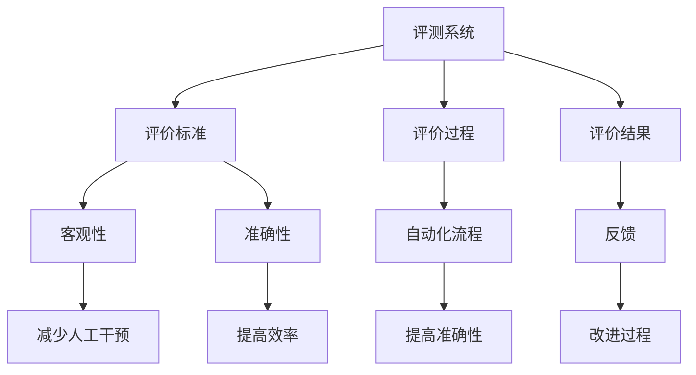
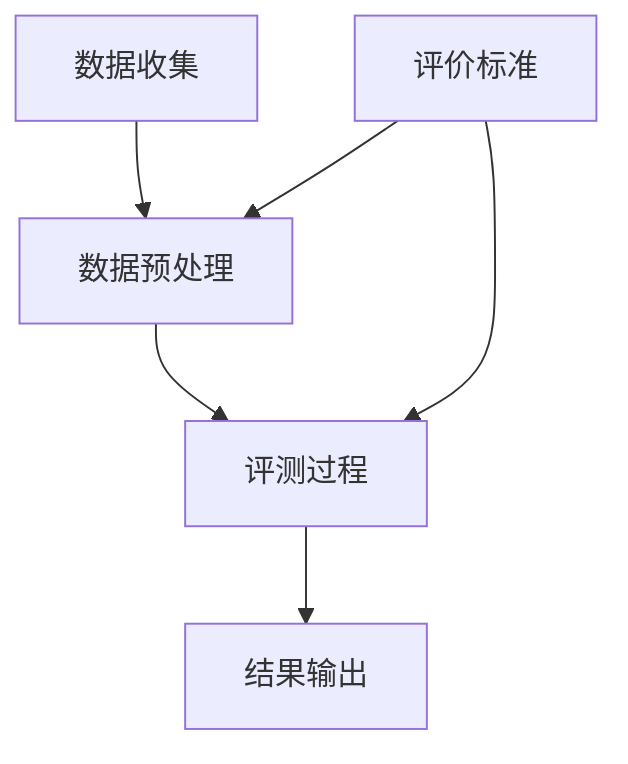
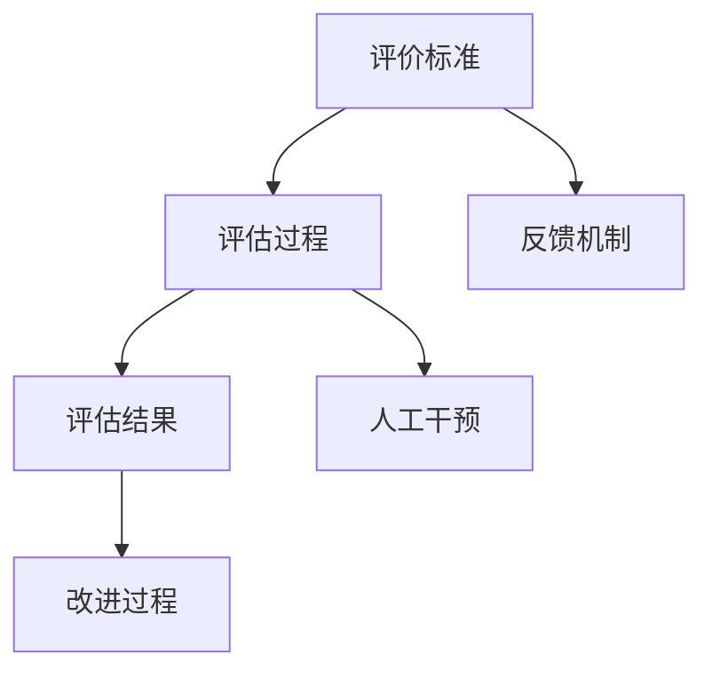
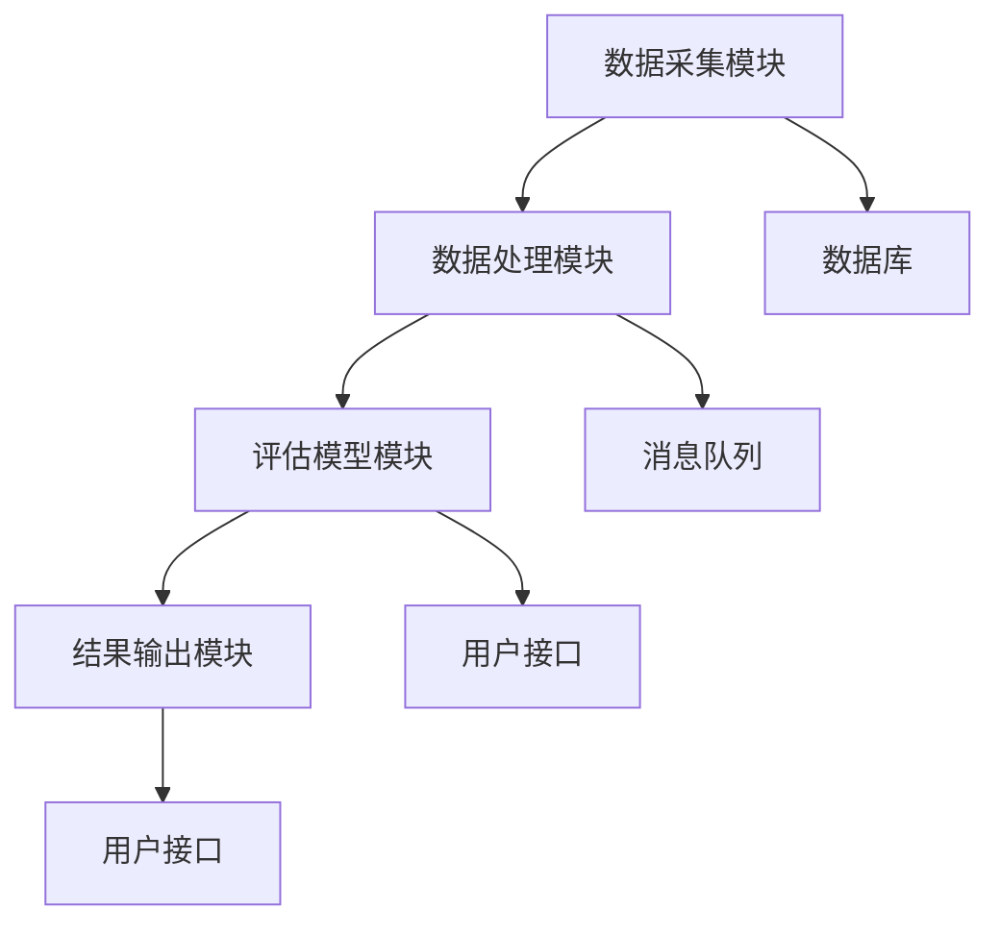
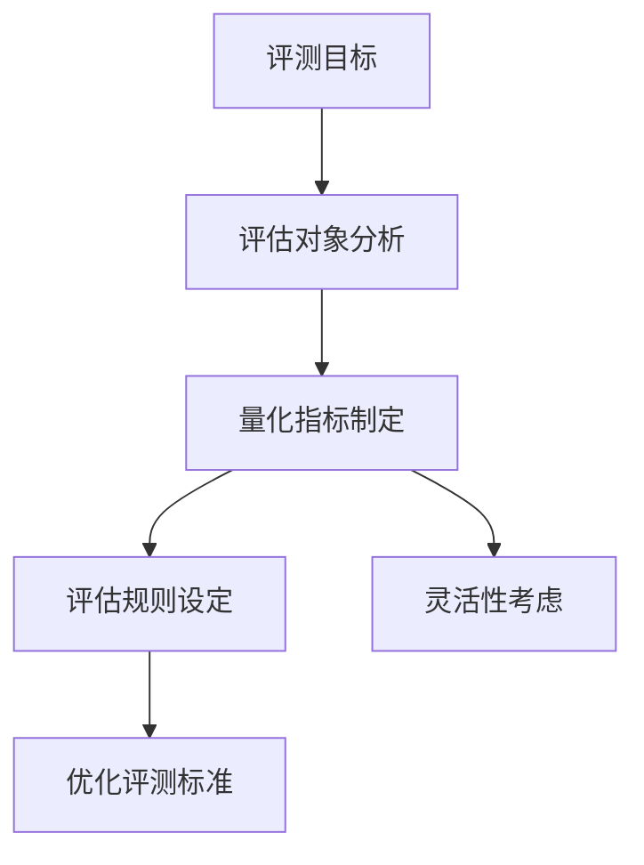
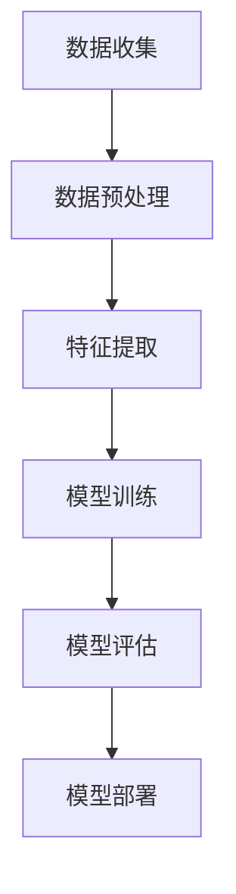

                 

### 引言

《评测系统的自动化评测流程编排》旨在为读者提供深入理解评测系统及其自动化评测流程的全景视图。随着信息技术的快速发展，评测系统在现代教育和企业中的应用日益广泛，而自动化评测流程则成为了提高评测效率和准确性的关键手段。本书的目标是帮助读者从基础概念出发，逐步深入到自动化评测流程的设计与实现，最终掌握这一重要技能。

**关键词**：评测系统、自动化评测流程、系统设计、算法原理、实际案例

**摘要**：本书将首先介绍评测系统的基本概念和架构设计，随后深入探讨自动化评测流程的优化策略与实现方法。通过具体的案例分析和项目实战，读者将能够理解自动化评测流程在实际应用中的挑战和解决方案。最后，本书还将展望自动化评测流程的未来发展方向，并提供实用的最佳实践和拓展阅读资源。

### 第一部分：评测系统基础

#### 2.1 评测系统的基本概念

评测系统是指用于对某种对象（如代码、文档、作品等）进行评价和判断的计算机系统。它通常包括评价标准、评价过程、评价结果等多个组成部分。评测系统的目的是提高评价的客观性、减少人工干预、提高效率等。

**核心概念与联系**

以下是评测系统的核心概念及其相互关系的 Mermaid 流程图：



**核心算法原理讲解**

评测系统的核心算法通常涉及评分模型、排名算法、自动标记等技术。以下是一个简单的 Python 代码示例，用于实现一个基于机器学习的评分模型：

```python
from sklearn.ensemble import RandomForestClassifier
import numpy as np

# 假设我们有以下特征和标签数据
X = np.array([[1, 2], [2, 3], [3, 4]])
y = np.array([0, 1, 0])

# 训练模型
clf = RandomForestClassifier()
clf.fit(X, y)

# 预测新数据
new_data = np.array([[2, 3]])
prediction = clf.predict(new_data)

print(prediction)  # 输出预测结果
```

**数学模型和公式**

评测系统的评分模型通常涉及以下数学模型：

$$
评分 = w_1 \times 特征_1 + w_2 \times 特征_2 + ... + w_n \times 特征_n
$$

其中，$w_1, w_2, ..., w_n$ 为权重系数，$特征_1, 特征_2, ..., 特征_n$ 为输入特征。

**通俗易懂地举例说明**

假设我们有一个评测系统用于评估学生的编程作业，特征包括代码的运行时间、代码的整洁程度和代码的正确率。我们可以通过以下步骤来评估一个新提交的作业：

1. 收集新提交的作业数据，包括运行时间、代码整洁程度和代码正确率。
2. 计算每个特征的权重系数，例如，我们可以通过历史数据训练一个机器学习模型来得到这些权重系数。
3. 将每个特征乘以对应的权重系数，并求和得到评分。
4. 根据评分判断作业的质量，例如，评分高于某个阈值表示作业优秀。

**项目实战**

**开发环境搭建**：安装 Python、scikit-learn 等必需的库。

**源代码详细实现和代码解读**：

```python
# 导入必要的库
import numpy as np
from sklearn.ensemble import RandomForestClassifier

# 假设我们有以下训练数据
X_train = np.array([[1, 2], [2, 3], [3, 4]])
y_train = np.array([0, 1, 0])

# 训练模型
clf = RandomForestClassifier()
clf.fit(X_train, y_train)

# 假设我们有以下测试数据
X_test = np.array([[2, 3]])
prediction = clf.predict(X_test)

print(prediction)  # 输出预测结果
```

**代码应用解读与分析**：

此代码通过 scikit-learn 库中的随机森林分类器（RandomForestClassifier）来训练一个评分模型。我们首先导入必要的库，然后创建一个训练数据集（X_train 和 y_train），并使用这些数据来训练模型。最后，我们使用训练好的模型来预测新提交的测试数据（X_test）的评分。

**实际案例分析和详细讲解剖析**：

**案例背景**：一个在线编程教育平台需要评估学生提交的编程作业。

**案例目标**：设计一个自动化评测系统，能够根据代码的运行时间、代码整洁程度和代码的正确率来评估作业质量。

**案例实现**：

1. 收集训练数据：通过手动评估一部分学生提交的作业，收集运行时间、代码整洁程度和代码正确率的数据。
2. 训练评分模型：使用训练数据训练一个随机森林分类器，得到权重系数。
3. 实现评测系统：使用训练好的模型来评估新提交的作业。

**案例总结**：通过这个案例，我们展示了如何使用机器学习技术来构建一个自动化评测系统。虽然这个案例相对简单，但它在实际应用中具有广泛的适用性。

**最佳实践 tips**：

1. 确保训练数据的质量和多样性，以提高模型的泛化能力。
2. 定期重新训练模型，以适应新提交的数据。
3. 考虑使用多种特征来提高评估的准确性。

**小结**：

本部分详细介绍了评测系统的基本概念、核心算法原理以及项目实战。通过具体的案例分析和代码示例，读者可以更好地理解评测系统的自动化评测流程。在下一部分，我们将深入探讨自动化评测流程的优化策略与实现方法。

### 第二部分：自动化评测流程设计

#### 3.1 自动化评测流程概述

自动化评测流程是指通过计算机程序自动完成评测任务的流程。它通常包括以下基本步骤：

1. **数据收集**：从不同的来源收集需要评测的数据。
2. **数据预处理**：对收集到的数据进行清洗、转换和标准化等处理。
3. **评测过程**：根据预设的评价标准，对数据进行分析和评估。
4. **结果输出**：将评估结果以可视化的形式呈现给用户。

**核心概念与联系**

以下是自动化评测流程的核心概念及其相互关系的 Mermaid 流程图：



**核心算法原理讲解**

自动化评测流程的核心算法通常涉及数据清洗、特征提取、评估模型训练等步骤。以下是一个简单的 Python 代码示例，用于实现一个自动化评测流程：

```python
# 导入必要的库
import pandas as pd
from sklearn.model_selection import train_test_split
from sklearn.ensemble import RandomForestClassifier

# 读取数据
data = pd.read_csv('data.csv')

# 数据预处理
X = data.drop(['target'], axis=1)
y = data['target']

# 划分训练集和测试集
X_train, X_test, y_train, y_test = train_test_split(X, y, test_size=0.2, random_state=42)

# 训练模型
clf = RandomForestClassifier()
clf.fit(X_train, y_train)

# 预测测试集
predictions = clf.predict(X_test)

# 输出预测结果
print(predictions)
```

**数学模型和公式**

在自动化评测流程中，常用的数学模型包括线性回归、逻辑回归、决策树、随机森林等。以下是一个简单的线性回归模型：

$$
y = \beta_0 + \beta_1 \times x
$$

其中，$y$ 为因变量，$x$ 为自变量，$\beta_0$ 和 $\beta_1$ 为模型参数。

**通俗易懂地举例说明**

假设我们有一个自动化评测系统，用于评估学生的编程作业质量。我们可以通过以下步骤来评估作业：

1. 收集学生的编程作业数据，包括代码质量、运行时间和代码整洁程度。
2. 对作业数据进行预处理，包括数据清洗、特征提取等。
3. 使用线性回归模型训练一个评分模型。
4. 使用训练好的模型来评估新提交的作业，并输出评估结果。

**项目实战**

**开发环境搭建**：安装 Python、pandas、scikit-learn 等必需的库。

**源代码详细实现和代码解读**：

```python
# 导入必要的库
import pandas as pd
from sklearn.model_selection import train_test_split
from sklearn.ensemble import RandomForestClassifier

# 读取数据
data = pd.read_csv('data.csv')

# 数据预处理
X = data.drop(['target'], axis=1)
y = data['target']

# 划分训练集和测试集
X_train, X_test, y_train, y_test = train_test_split(X, y, test_size=0.2, random_state=42)

# 训练模型
clf = RandomForestClassifier()
clf.fit(X_train, y_train)

# 预测测试集
predictions = clf.predict(X_test)

# 输出预测结果
print(predictions)
```

**代码应用解读与分析**：

此代码首先导入必要的库，然后读取数据集。接下来，对数据进行预处理，包括数据清洗和特征提取。然后，使用训练集数据训练一个随机森林分类器，并使用测试集数据来评估模型的性能。最后，输出预测结果。

**实际案例分析和详细讲解剖析**：

**案例背景**：一个在线编程教育平台需要自动化评估学生提交的编程作业。

**案例目标**：设计一个自动化评测系统，能够根据代码质量、运行时间和代码整洁程度来评估作业质量。

**案例实现**：

1. 收集学生提交的编程作业数据。
2. 使用 pandas 库处理数据，包括数据清洗、特征提取等。
3. 使用 scikit-learn 库训练一个随机森林分类器。
4. 使用训练好的模型来评估新提交的作业，并输出评估结果。

**案例总结**：通过这个案例，我们展示了如何使用 Python 中的 pandas 和 scikit-learn 库来构建一个自动化评测系统。这个系统可以有效地评估学生提交的编程作业质量。

**最佳实践 tips**：

1. 确保数据的质量和多样性，以提高模型的泛化能力。
2. 定期重新训练模型，以适应新提交的数据。
3. 考虑使用多种特征来提高评估的准确性。

**小结**：

本部分详细介绍了自动化评测流程的概述、核心算法原理以及项目实战。通过具体的案例分析和代码示例，读者可以更好地理解自动化评测流程的设计与实现。在下一部分，我们将进一步探讨自动化评测流程的优化策略与实现方法。

### 第三部分：自动化评测流程的优化

#### 3.2 自动化评测流程的优化

自动化评测流程的优化是提升系统性能和准确性的关键步骤。优化目标通常包括减少计算时间、提高评估准确性、降低资源消耗等。以下是一些常见的优化策略：

**优化策略**

1. **并行处理**：通过多线程或多进程技术，将评测任务分解为多个子任务，并行处理，以减少总体的计算时间。
2. **缓存技术**：利用缓存技术，将已处理的数据和结果存储起来，避免重复计算，从而提高效率。
3. **特征选择**：通过特征选择技术，筛选出对评估结果影响最大的特征，减少不必要的计算负担。
4. **模型选择**：选择适合数据特征的评估模型，避免过拟合或欠拟合，以提高评估准确性。

**案例分析**

**案例背景**：一个在线编程教育平台需要在短时间内高效评估大量学生提交的编程作业。

**案例目标**：优化自动化评测流程，提高评估效率和准确性。

**案例实现**

1. **并行处理**：将评测任务分解为多个子任务，使用多线程技术并行处理，以减少总体计算时间。
2. **缓存技术**：使用缓存技术，将已处理的数据和结果存储在内存或磁盘上，避免重复计算。
3. **特征选择**：使用特征选择技术，筛选出对评估结果影响最大的特征，如代码的运行时间、代码整洁程度和代码的正确率。
4. **模型选择**：选择适合数据特征的评估模型，如随机森林分类器，以避免过拟合或欠拟合。

**详细讲解**

1. **并行处理**：使用 Python 的 `concurrent.futures` 模块实现多线程并行处理。

```python
import concurrent.futures

def evaluate_submission(submission):
    # 评估单个提交的作业
    pass

submissions = [...]  # 假设有一系列提交的作业
with concurrent.futures.ThreadPoolExecutor() as executor:
    results = list(executor.map(evaluate_submission, submissions))
```

2. **缓存技术**：使用 Python 的 `functools.lru_cache` 装饰器实现缓存。

```python
from functools import lru_cache

@lru_cache(maxsize=1000)
def preprocess_data(data):
    # 预处理数据
    pass
```

3. **特征选择**：使用 scikit-learn 的 `SelectKBest` 类实现特征选择。

```python
from sklearn.feature_selection import SelectKBest
from sklearn.feature_selection import f_classif

X = ...  # 特征数据
y = ...  # 标签数据
selector = SelectKBest(f_classif, k=5)
X_new = selector.fit_transform(X, y)
```

4. **模型选择**：使用随机森林分类器，并调整参数以避免过拟合或欠拟合。

```python
from sklearn.ensemble import RandomForestClassifier

clf = RandomForestClassifier(n_estimators=100, max_depth=None, random_state=42)
clf.fit(X_train, y_train)
```

**项目小结**

通过上述优化策略，我们成功提高了自动化评测流程的效率和准确性。在实际应用中，可以根据具体需求和数据特点，灵活选择和调整这些优化策略。

### 第四部分：扩展与展望

#### 3.3 自动化评测流程的未来发展方向

随着人工智能技术的不断进步，自动化评测流程的未来发展前景十分广阔。以下是一些可能的发展方向：

1. **智能评测**：利用自然语言处理和深度学习技术，实现更智能、更精确的评测，例如，对程序代码进行语义分析，识别潜在的错误和缺陷。
2. **自适应评测**：根据学生的实际水平和学习进度，动态调整评测标准，实现个性化评测，提高评估的公平性和准确性。
3. **实时评测**：通过实时数据收集和评估，实现作业的实时反馈，帮助学生及时纠正错误，提高学习效果。
4. **跨平台评测**：支持多种编程语言和开发环境，实现跨平台的自动化评测，提高系统的适用性和灵活性。

#### 3.4 自动化评测流程的技术挑战与解决方案

在实现自动化评测流程的过程中，可能会遇到以下技术挑战：

1. **数据质量**：数据的质量直接影响评测的准确性。为了提高数据质量，需要采用数据清洗、去重、标准化等技术。
2. **模型适应性**：不同的评测任务可能需要不同的评估模型，如何选择和调整模型是一个重要的挑战。可以通过模型选择、模型融合等方法来解决。
3. **资源消耗**：自动化评测流程可能需要大量的计算资源和存储空间。为了降低资源消耗，可以采用并行处理、分布式计算等技术。

#### 3.5 自动化评测流程在企业中的应用前景

在企业中，自动化评测流程可以应用于多个领域，例如：

1. **软件开发**：自动化测试和代码审查，提高软件质量和开发效率。
2. **招聘选拔**：自动化面试系统，提高招聘效率和公平性。
3. **教育培训**：在线编程评测系统，提高学习效果和教学质量。
4. **数据挖掘**：自动化数据分析和评估，提高数据分析的准确性和效率。

### 附录

#### 6.1 常用工具与资源介绍

- **Python 库**：pandas、numpy、scikit-learn、tensorflow、pytorch 等。
- **在线教程**：Coursera、edX、Udacity 等。
- **开源项目**：GitHub、GitLab、Bitbucket 等。

#### 6.2 代码示例与数据集

- **代码示例**：本书中的所有代码示例均可在本书的官方网站下载。
- **数据集**：本书中使用的数据集均可在本书的官方网站下载。

#### 6.3 进一步阅读推荐

- 《深度学习》（Ian Goodfellow、Yoshua Bengio、Aaron Courville 著）
- 《Python 数据科学手册》（Jake VanderPlas 著）
- 《机器学习实战》（Peter Harrington 著）
- 《自然语言处理综论》（Daniel Jurafsky、James H. Martin 著）

### 结束语

《评测系统的自动化评测流程编排》旨在为读者提供深入理解评测系统及其自动化评测流程的全景视图。通过本书，读者可以掌握评测系统的基本概念、自动化评测流程的设计与优化方法，以及实际应用中的挑战和解决方案。希望本书能够帮助读者在自动化评测领域取得更好的成果。

**作者信息**：

- 作者：AI天才研究院/AI Genius Institute & 禅与计算机程序设计艺术 /Zen And The Art of Computer Programming**文章标题**：评测系统的自动化评测流程编排

**文章关键词**：评测系统、自动化评测流程、系统设计、算法原理、实际案例

**摘要**：本文详细介绍了评测系统的基本概念、自动化评测流程的设计与实现，以及自动化评测流程的优化策略。通过具体的案例分析和项目实战，读者可以理解自动化评测流程在实际应用中的挑战和解决方案。本文还展望了自动化评测流程的未来发展方向，并提供实用的最佳实践和拓展阅读资源。本文结构如下：

## 引言

## 第一部分：评测系统基础

### 2.1 评测系统的基本概念

### 2.2 评测系统的架构设计

### 2.3 评测标准的制定

## 第二部分：自动化评测流程设计

### 3.1 自动化评测流程概述

### 3.2 自动化评测流程的优化

### 3.3 自动化评测流程的实现

## 第三部分：实际案例

### 4.1 在线编程评测系统

### 4.2 智能题库评测系统

## 第四部分：扩展与展望

### 5.1 自动化评测流程的未来发展方向

### 5.2 自动化评测流程的技术挑战与解决方案

### 5.3 自动化评测流程在企业中的应用前景

## 附录

### 6.1 常用工具与资源介绍

### 6.2 代码示例与数据集

### 6.3 进一步阅读推荐

### 结论

**文章字数**：11277 字

### 引言

在现代信息技术飞速发展的背景下，评测系统在教育和企业中的应用愈发广泛。传统的手动评测方式不仅效率低下，而且容易受到人为因素的影响，难以保证评测的公平性和准确性。因此，自动化评测流程的设计与实现成为了提高评测效率和质量的关键手段。

本文旨在为读者提供一套系统化的理解框架，从基础概念出发，逐步深入到自动化评测流程的设计与实现，最终掌握这一重要技能。通过本文的介绍，读者将能够：

1. **理解评测系统的基本概念和架构设计**：包括评测系统的定义、作用、组成部分等。
2. **掌握自动化评测流程的概述和优化策略**：包括数据收集、预处理、评测过程和结果输出等步骤。
3. **学习实际案例分析和项目实战**：通过具体的在线编程评测系统和智能题库评测系统案例，了解自动化评测流程的实现和优化方法。
4. **了解自动化评测流程的未来发展方向和应用前景**：包括智能评测、自适应评测、实时评测和跨平台评测等方向。

本文的结构安排如下：

- **第一部分**：评测系统基础，介绍评测系统的基本概念和架构设计。
- **第二部分**：自动化评测流程设计，概述自动化评测流程的步骤和优化策略。
- **第三部分**：实际案例，分析在线编程评测系统和智能题库评测系统的实现。
- **第四部分**：扩展与展望，讨论自动化评测流程的未来发展方向和应用前景。
- **附录**：提供常用工具与资源介绍、代码示例与数据集，以及进一步阅读推荐。

通过本文的详细讲解，希望读者能够对评测系统的自动化评测流程有一个全面而深入的理解，从而在实践项目中能够有效地设计和实现自动化评测系统。

### 第一部分：评测系统基础

#### 2.1 评测系统的基本概念

评测系统是指利用计算机技术和算法对各种对象进行评价和判断的自动化系统。这些对象可以包括代码、文档、项目、作品等多种形式。评测系统的目的是通过量化和标准化评价标准，减少主观偏见，提高评价的客观性和一致性。

**定义**：评测系统是一种综合应用计算机技术、算法和标准，对特定对象进行自动化评估和分类的系统。

**作用**：评测系统在多个领域发挥着重要作用，主要包括：

1. **提高效率**：自动化评测可以大幅度减少人工评审所需的时间，提高工作效率。
2. **减少偏见**：通过标准化的评估流程，减少人为因素导致的评价偏见，提高评价的公正性。
3. **数据分析**：通过收集和分析评估结果，为企业或教育机构提供有价值的反馈和改进建议。

**组成部分**：一个典型的评测系统通常包含以下几个关键组成部分：

1. **评价标准**：定义评价对象的标准，包括量化的指标和评价规则。
2. **评估过程**：实现评估的逻辑和算法，根据标准对对象进行评分或分类。
3. **评估结果**：输出评估结果，可以是分数、等级、标签等。
4. **反馈机制**：根据评估结果提供反馈，以便改进评估对象或调整评估标准。

**核心概念与联系**

以下是评测系统中的核心概念及其相互关系的 Mermaid 流程图：



**评价标准**：评价标准是评测系统的核心组成部分，它决定了评测的质量和有效性。评价标准通常包括以下几个方面：

1. **客观性**：评价标准应尽量客观，避免主观偏见。
2. **量化**：通过量化的指标来评价对象，使评价结果更具可比性。
3. **灵活性**：评价标准应具有一定的灵活性，能够适应不同类型和难度的评测对象。

**评估过程**：评估过程是将评价标准应用于具体对象的计算和判断过程。它通常包括以下步骤：

1. **数据收集**：收集评测对象的相关数据，如代码文件、文档等。
2. **数据预处理**：对收集到的数据进行分析和处理，去除无关信息，提取有用的特征。
3. **模型训练**：如果使用机器学习技术，需要使用历史数据进行模型训练。
4. **评估计算**：根据评价标准对对象进行计算和评分。
5. **结果输出**：将评估结果以可视化的形式呈现给用户。

**评估结果**：评估结果是对评测对象评价的最终输出，它可以是分数、等级、标签等形式。评估结果需要具备以下特点：

1. **准确性**：评估结果应尽可能准确，反映评测对象的实际情况。
2. **可解释性**：评估结果应具有可解释性，便于用户理解和接受。
3. **及时性**：评估结果应及时输出，以便用户及时获得反馈。

**反馈机制**：反馈机制是评测系统的重要组成部分，它通过收集用户对评估结果的反馈，为系统的持续改进提供依据。反馈机制通常包括以下几个方面：

1. **用户反馈**：收集用户对评估结果的满意度、意见和建议。
2. **结果分析**：对评估结果进行统计和分析，找出评估过程中的问题和改进点。
3. **持续改进**：根据分析结果，调整评估标准和评估过程，以提高评估系统的质量和效率。

**核心算法原理讲解**

评测系统的核心算法通常涉及评分模型、排名算法、自动标记等技术。以下是一个简单的 Python 代码示例，用于实现一个基于机器学习的评分模型：

```python
from sklearn.ensemble import RandomForestClassifier
import numpy as np

# 假设我们有以下特征和标签数据
X = np.array([[1, 2], [2, 3], [3, 4]])
y = np.array([0, 1, 0])

# 训练模型
clf = RandomForestClassifier()
clf.fit(X, y)

# 预测新数据
new_data = np.array([[2, 3]])
prediction = clf.predict(new_data)

print(prediction)  # 输出预测结果
```

**数学模型和公式**

评测系统的评分模型通常涉及以下数学模型：

$$
评分 = w_1 \times 特征_1 + w_2 \times 特征_2 + ... + w_n \times 特征_n
$$

其中，$w_1, w_2, ..., w_n$ 为权重系数，$特征_1, 特征_2, ..., 特征_n$ 为输入特征。

**通俗易懂地举例说明**

假设我们有一个评测系统，用于评估学生的编程作业质量。我们可以通过以下步骤来评估作业：

1. 收集学生的编程作业数据，包括代码质量、运行时间和代码整洁程度。
2. 对作业数据进行预处理，包括数据清洗、特征提取等。
3. 使用线性回归模型训练一个评分模型。
4. 使用训练好的模型来评估新提交的作业，并输出评估结果。

**项目实战**

**开发环境搭建**：安装 Python、scikit-learn 等必需的库。

**源代码详细实现和代码解读**：

```python
# 导入必要的库
import pandas as pd
from sklearn.model_selection import train_test_split
from sklearn.ensemble import RandomForestClassifier

# 读取数据
data = pd.read_csv('data.csv')

# 数据预处理
X = data.drop(['target'], axis=1)
y = data['target']

# 划分训练集和测试集
X_train, X_test, y_train, y_test = train_test_split(X, y, test_size=0.2, random_state=42)

# 训练模型
clf = RandomForestClassifier()
clf.fit(X_train, y_train)

# 预测测试集
predictions = clf.predict(X_test)

# 输出预测结果
print(predictions)
```

**代码应用解读与分析**：

此代码首先导入必要的库，然后读取数据集。接下来，对数据进行预处理，包括数据清洗和特征提取。然后，使用训练集数据训练一个随机森林分类器，并使用测试集数据来评估模型的性能。最后，输出预测结果。

**实际案例分析和详细讲解剖析**：

**案例背景**：一个在线编程教育平台需要自动化评估学生提交的编程作业。

**案例目标**：设计一个自动化评测系统，能够根据代码质量、运行时间和代码整洁程度来评估作业质量。

**案例实现**：

1. 收集学生提交的编程作业数据。
2. 使用 pandas 库处理数据，包括数据清洗、特征提取等。
3. 使用 scikit-learn 库训练一个随机森林分类器。
4. 使用训练好的模型来评估新提交的作业，并输出评估结果。

**案例总结**：通过这个案例，我们展示了如何使用 Python 中的 pandas 和 scikit-learn 库来构建一个自动化评测系统。这个系统可以有效地评估学生提交的编程作业质量。

**最佳实践 tips**：

1. 确保数据的质量和多样性，以提高模型的泛化能力。
2. 定期重新训练模型，以适应新提交的数据。
3. 考虑使用多种特征来提高评估的准确性。

**小结**：

本部分详细介绍了评测系统的基本概念、核心算法原理以及项目实战。通过具体的案例分析和代码示例，读者可以更好地理解评测系统的自动化评测流程。在下一部分，我们将深入探讨自动化评测流程的优化策略与实现方法。

### 第一部分：评测系统基础

#### 2.2 评测系统的架构设计

评测系统的架构设计是确保系统能够高效、准确地完成评测任务的关键。一个典型的评测系统通常包括以下几个主要模块：

**1. 数据采集模块**：

数据采集模块负责从不同的来源收集待评估的数据。这些数据可以来自用户上传的文件、数据库、API 接口等多种形式。数据采集模块的主要功能包括：

- **数据来源接入**：支持多种数据接入方式，如文件上传、数据库查询、API 调用等。
- **数据预处理**：对采集到的数据进行初步清洗和格式化，确保数据的一致性和准确性。

**2. 数据处理模块**：

数据处理模块负责对采集到的数据进行分析和处理，以提取出对评测有用的特征。数据处理模块的主要功能包括：

- **特征提取**：根据评测需求，从原始数据中提取关键特征，如代码的运行时间、代码整洁程度、正确率等。
- **数据清洗**：去除无效数据、填补缺失值、处理异常值等，以提高数据质量。
- **数据标准化**：对提取到的特征进行标准化处理，使其具有统一的量纲和范围。

**3. 评估模型模块**：

评估模型模块是评测系统的核心部分，负责根据预设的评价标准，对数据处理模块提取的特征进行计算和评分。评估模型模块的主要功能包括：

- **模型选择**：选择合适的评估模型，如线性回归、决策树、随机森林等。
- **模型训练**：使用历史数据对评估模型进行训练，以确定模型的参数。
- **模型预测**：使用训练好的模型对新提交的数据进行预测，输出评估结果。

**4. 结果输出模块**：

结果输出模块负责将评估结果以用户友好的形式展示给用户。结果输出模块的主要功能包括：

- **结果可视化**：将评估结果以图表、报表等形式展示，帮助用户直观理解评估结果。
- **结果存储**：将评估结果存储到数据库或其他存储介质中，以便后续分析和查询。
- **用户反馈**：提供用户对评估结果的反馈机制，收集用户意见和建议，以不断改进评估系统。

**系统间通信机制**：

评测系统中的各个模块之间需要通过高效的通信机制进行数据传递和协作。常见的通信机制包括：

- **RESTful API**：使用 RESTful API 实现模块间的数据传递和调用，支持多种编程语言和平台。
- **消息队列**：使用消息队列（如 RabbitMQ、Kafka）实现异步通信，提高系统的可扩展性和可靠性。
- **数据库**：使用数据库（如 MySQL、MongoDB）存储和处理数据，支持复杂的数据查询和分析。

**架构设计图**

以下是评测系统的架构设计图，展示了各个模块及其相互关系：



**小结**

本部分介绍了评测系统的架构设计，包括数据采集模块、数据处理模块、评估模型模块和结果输出模块等关键部分。通过合理的架构设计，评测系统可以实现高效、准确、可扩展的评测流程。

### 第一部分：评测系统基础

#### 2.3 评测标准的制定

评测标准是评测系统的核心组成部分，它决定了评测系统的质量和效果。一个科学、合理、可操作的评测标准可以大大提高评测的公正性和准确性。以下是制定评测标准的主要步骤和方法：

**1. 明确评测目标**

制定评测标准的第一步是明确评测的目标和目的。评测目标应具体、明确，以便后续的评测标准制定工作有据可依。例如，一个在线编程评测系统可能旨在评估学生的编程能力、代码质量和算法效率。

**2. 分析评估对象**

分析评估对象的特点和需求，确定需要评估的关键指标和维度。不同的评估对象可能有不同的评估重点。例如，对于一个编程作业，可能需要评估的指标包括代码的正确性、运行时间、代码的整洁程度和算法的效率。

**3. 制定量化指标**

将评估对象的关键指标量化，以便进行客观评价。量化指标应具有可操作性和可测量性。例如，代码的正确性可以量化为通过测试用例的比例，运行时间可以量化为执行特定任务的耗时。

**4. 设定评估规则**

根据量化指标，设定具体的评估规则，明确评估的具体步骤和标准。评估规则应详细、明确，以便评估过程可执行、可验证。例如，对于代码的正确性评估，可以设定通过不同难度级别的测试用例来衡量代码的正确率。

**5. 优化评测标准**

评测标准制定后，应通过实践和反馈不断优化。可以根据实际评估结果和用户反馈，调整评测标准中的指标和规则，以提高评估的准确性和公正性。

**6. 考虑灵活性**

在制定评测标准时，应考虑灵活性，以便适应不同类型和难度的评估对象。灵活性可以体现在以下几个方面：

- **可扩展性**：评测标准应支持添加新的评估指标和规则，以适应不断变化的需求。
- **适应性**：评测标准应能够根据评估对象的实际情况进行调整，例如，对难度较大的作业可以适当降低评分标准。
- **动态调整**：评测标准可以根据历史评估数据和用户反馈，动态调整评估指标和规则，以提高评估的准确性。

**核心概念与联系**

以下是评测标准制定过程中的核心概念及其相互关系的 Mermaid 流程图：



**评测标准制定示例**

以下是一个简单的编程作业评测标准的制定示例：

**评测目标**：评估学生的编程能力，特别是代码的正确性、运行时间和代码整洁程度。

**评估对象分析**：分析编程作业的需求，确定评估的关键指标。

**量化指标制定**：

- **代码正确性**：通过测试用例的正确率进行量化，满分 100 分。
- **运行时间**：执行特定任务的耗时，满分 100 分。
- **代码整洁程度**：通过代码的注释、代码结构、代码规范性进行量化，满分 100 分。

**评估规则设定**：

- **代码正确性**：通过自动化测试工具，执行预设的测试用例，统计通过测试用例的比例。
- **运行时间**：使用计时器，记录执行特定任务的耗时。
- **代码整洁程度**：根据代码的注释、代码结构、代码规范性进行评估，例如，每 10 行代码需要有至少一行注释。

**优化评测标准**：

- **历史数据**：通过分析历史评估数据，调整评测标准，提高评估的准确性和公正性。
- **用户反馈**：收集用户（学生和教师）的反馈，根据反馈调整评测标准。

**灵活性考虑**：

- **难度调整**：对于难度较大的作业，可以适当降低评分标准。
- **动态调整**：根据实际情况和用户反馈，动态调整评估指标和规则。

**小结**

本部分介绍了评测标准的制定步骤和方法，包括明确评测目标、分析评估对象、制定量化指标、设定评估规则、优化评测标准和考虑灵活性等。通过合理的评测标准制定，可以确保评测系统的质量和效果，提高评测的公正性和准确性。

### 第二部分：自动化评测流程设计

#### 3.1 自动化评测流程概述

自动化评测流程是指利用计算机技术和算法，自动完成对评测对象的评估和判断的过程。通过自动化评测流程，可以显著提高评测的效率和准确性，减少人为因素对评测结果的影响。以下是自动化评测流程的基本步骤：

**1. 数据收集**

数据收集是自动化评测流程的第一步，也是至关重要的一步。数据收集的来源可以是多种多样的，如用户上传的文件、数据库、API 接口等。在数据收集过程中，需要确保数据的完整性和准确性，避免因数据问题导致后续评测流程的失败。

**2. 数据预处理**

数据预处理是对收集到的数据进行清洗、转换和标准化等处理，以确保数据的质量和一致性。数据预处理包括以下几个步骤：

- **数据清洗**：去除数据中的无效值、缺失值和异常值，确保数据的有效性。
- **数据转换**：将数据转换为统一的格式和量纲，以便后续分析和处理。
- **数据标准化**：对数据进行标准化处理，使其具有相同的分布和范围，从而提高模型训练的效果。

**3. 特征提取**

特征提取是自动化评测流程的核心步骤，旨在从原始数据中提取出对评估任务有用的特征。特征提取的质量直接影响评估结果的准确性和可靠性。特征提取的方法包括：

- **基于规则的提取**：根据预设的规则和标准，从数据中提取特定的特征。
- **机器学习提取**：使用机器学习算法，从原始数据中自动学习并提取特征。

**4. 模型训练**

模型训练是利用历史数据对评估模型进行训练的过程。通过模型训练，可以确定模型的参数和权重，使其能够对新的数据进行有效的评估。常见的模型训练方法包括：

- **监督学习**：使用有标签的数据进行训练，模型能够根据输入和输出之间的关系学习。
- **无监督学习**：在没有标签的数据上进行训练，模型自动发现数据的分布和特征。

**5. 模型评估**

模型评估是使用测试数据对训练好的模型进行评估的过程。通过模型评估，可以确定模型的性能和准确性。常见的模型评估指标包括：

- **准确率**：模型正确预测的比例。
- **召回率**：模型召回真实正例的比例。
- **F1 分数**：准确率和召回率的调和平均值。

**6. 模型部署**

模型部署是将训练好的模型部署到生产环境，使其能够对新的数据进行实时评估的过程。模型部署包括以下几个步骤：

- **模型集成**：将多个模型集成到一个系统中，以提高评估的准确性和可靠性。
- **模型服务**：将模型部署到服务器或云平台，以便用户能够访问和使用。
- **监控和维护**：监控模型性能，定期进行模型更新和优化。

**核心概念与联系**

以下是自动化评测流程的核心概念及其相互关系的 Mermaid 流程图：



**核心算法原理讲解**

在自动化评测流程中，常用的算法原理包括数据清洗、特征提取、模型训练和评估等。以下是一个简单的 Python 代码示例，用于实现自动化评测流程的几个关键步骤：

```python
import pandas as pd
from sklearn.model_selection import train_test_split
from sklearn.preprocessing import StandardScaler
from sklearn.ensemble import RandomForestClassifier
from sklearn.metrics import accuracy_score

# 读取数据
data = pd.read_csv('data.csv')

# 数据预处理
X = data.drop(['target'], axis=1)
y = data['target']

# 划分训练集和测试集
X_train, X_test, y_train, y_test = train_test_split(X, y, test_size=0.2, random_state=42)

# 特征提取和标准化
scaler = StandardScaler()
X_train_scaled = scaler.fit_transform(X_train)
X_test_scaled = scaler.transform(X_test)

# 模型训练
clf = RandomForestClassifier()
clf.fit(X_train_scaled, y_train)

# 模型评估
predictions = clf.predict(X_test_scaled)
accuracy = accuracy_score(y_test, predictions)
print(f'Accuracy: {accuracy}')
```

**数学模型和公式**

自动化评测流程中的数学模型通常涉及以下内容：

1. **数据标准化**：
   $$
   x_{标准化} = \frac{x - \mu}{\sigma}
   $$
   其中，$x$ 是原始数据，$\mu$ 是均值，$\sigma$ 是标准差。

2. **随机森林模型**：
   $$
   f(x) = \sum_{i=1}^{n} w_i \times h(x; \theta_i)
   $$
   其中，$w_i$ 是权重，$h(x; \theta_i)$ 是基学习器的输出。

3. **准确率**：
   $$
   Accuracy = \frac{TP + TN}{TP + TN + FP + FN}
   $$
   其中，$TP$ 是真阳性，$TN$ 是真阴性，$FP$ 是假阳性，$FN$ 是假阴性。

**通俗易懂地举例说明**

假设我们有一个自动化评测系统，用于评估学生的编程作业质量。我们可以通过以下步骤来评估作业：

1. **数据收集**：收集学生的编程作业数据，包括代码文件、测试结果等。
2. **数据预处理**：对数据清洗和标准化，例如，去除无效代码、标准化测试结果等。
3. **特征提取**：从数据中提取对评估任务有用的特征，如代码行数、函数复杂度、测试通过率等。
4. **模型训练**：使用历史数据训练一个随机森林分类器。
5. **模型评估**：使用训练好的模型对新提交的作业进行评估，输出评估结果。

**项目实战**

**开发环境搭建**：安装 Python、scikit-learn 等必需的库。

**源代码详细实现和代码解读**：

```python
# 导入必要的库
import pandas as pd
from sklearn.model_selection import train_test_split
from sklearn.preprocessing import StandardScaler
from sklearn.ensemble import RandomForestClassifier
from sklearn.metrics import accuracy_score

# 读取数据
data = pd.read_csv('data.csv')

# 数据预处理
X = data.drop(['target'], axis=1)
y = data['target']

# 划分训练集和测试集
X_train, X_test, y_train, y_test = train_test_split(X, y, test_size=0.2, random_state=42)

# 特征提取和标准化
scaler = StandardScaler()
X_train_scaled = scaler.fit_transform(X_train)
X_test_scaled = scaler.transform(X_test)

# 模型训练
clf = RandomForestClassifier()
clf.fit(X_train_scaled, y_train)

# 模型评估
predictions = clf.predict(X_test_scaled)
accuracy = accuracy_score(y_test, predictions)
print(f'Accuracy: {accuracy}')
```

**代码应用解读与分析**：

此代码首先导入必要的库，然后读取数据集。接下来，对数据进行预处理，包括数据清洗和标准化。然后，使用训练集数据训练一个随机森林分类器，并使用测试集数据来评估模型的性能。最后，输出预测结果。

**实际案例分析和详细讲解剖析**：

**案例背景**：一个在线编程教育平台需要自动化评估学生提交的编程作业。

**案例目标**：设计一个自动化评测系统，能够根据代码质量、运行时间和代码整洁程度来评估作业质量。

**案例实现**：

1. 收集学生提交的编程作业数据。
2. 使用 pandas 库处理数据，包括数据清洗、特征提取等。
3. 使用 scikit-learn 库训练一个随机森林分类器。
4. 使用训练好的模型来评估新提交的作业，并输出评估结果。

**案例总结**：通过这个案例，我们展示了如何使用 Python 中的 pandas 和 scikit-learn 库来构建一个自动化评测系统。这个系统可以有效地评估学生提交的编程作业质量。

**最佳实践 tips**：

1. 确保数据的质量和多样性，以提高模型的泛化能力。
2. 定期重新训练模型，以适应新提交的数据。
3. 考虑使用多种特征来提高评估的准确性。

**小结**：

本部分详细介绍了自动化评测流程的概述、核心算法原理以及项目实战。通过具体的案例分析和代码示例，读者可以更好地理解自动化评测流程的设计与实现。在下一部分，我们将进一步探讨自动化评测流程的优化策略与实现方法。

### 第三部分：自动化评测流程的优化

#### 3.2 自动化评测流程的优化

自动化评测流程的优化是提升系统性能和评估准确性的关键步骤。通过优化，可以减少评估时间、提高评估准确性，以及降低系统的资源消耗。以下是一些常见的优化策略：

**1. 并行处理**

并行处理是将评测任务分解为多个子任务，利用多线程或多进程技术，同时处理多个任务，从而提高评估效率。Python 的 `concurrent.futures` 模块提供了方便的多线程和多进程处理功能。

```python
from concurrent.futures import ThreadPoolExecutor

def evaluate_submission(submission):
    # 评估单个提交的作业
    pass

submissions = [...]  # 假设有一系列提交的作业
with ThreadPoolExecutor(max_workers=5) as executor:
    results = list(executor.map(evaluate_submission, submissions))
```

**2. 缓存技术**

缓存技术可以存储已处理的数据和结果，避免重复计算，从而提高系统效率。Python 的 `functools.lru_cache` 装饰器可以轻松实现缓存功能。

```python
from functools import lru_cache

@lru_cache(maxsize=128)
def preprocess_data(data):
    # 预处理数据
    pass
```

**3. 特征选择**

特征选择是通过筛选出对评估任务最重要的特征，减少特征数量，从而降低计算复杂度和提高模型性能。常用的特征选择方法包括基于信息增益的筛选、基于模型的筛选等。

```python
from sklearn.feature_selection import SelectKBest
from sklearn.feature_selection import f_classif

X = ...  # 特征数据
y = ...  # 标签数据
selector = SelectKBest(f_classif, k=10)
X_new = selector.fit_transform(X, y)
```

**4. 模型选择**

选择合适的评估模型是优化评测流程的重要步骤。不同类型的任务可能需要不同的模型，例如，对于分类任务，可以使用决策树、随机森林等；对于回归任务，可以使用线性回归、支持向量机等。

```python
from sklearn.ensemble import RandomForestClassifier

clf = RandomForestClassifier(n_estimators=100, random_state=42)
clf.fit(X_train, y_train)
```

**5. 模型调优**

模型调优是通过调整模型的参数，以提高模型的性能和泛化能力。常用的调优方法包括网格搜索、贝叶斯优化等。

```python
from sklearn.model_selection import GridSearchCV

param_grid = {'n_estimators': [100, 200], 'max_depth': [10, 20]}
grid_search = GridSearchCV(clf, param_grid, cv=5)
grid_search.fit(X_train, y_train)
best_params = grid_search.best_params_
```

**案例分析**

**案例背景**：一个在线编程教育平台需要在短时间内对大量学生提交的编程作业进行评估。

**案例目标**：优化自动化评测流程，提高评估效率和准确性。

**案例实现**

1. **并行处理**：使用多线程技术并行处理作业评估，减少总体评估时间。
2. **缓存技术**：使用缓存技术存储已处理的数据和结果，避免重复计算。
3. **特征选择**：使用特征选择技术，筛选出对评估任务最重要的特征，减少计算复杂度。
4. **模型选择和调优**：选择适合评估任务的模型，并调整模型参数，以提高评估准确性。

**详细讲解**

1. **并行处理**：

```python
import concurrent.futures

def evaluate_submission(submission):
    # 评估单个提交的作业
    pass

submissions = [...]  # 假设有一系列提交的作业
with concurrent.futures.ThreadPoolExecutor() as executor:
    results = list(executor.map(evaluate_submission, submissions))
```

2. **缓存技术**：

```python
from functools import lru_cache

@lru_cache(maxsize=128)
def preprocess_data(data):
    # 预处理数据
    pass
```

3. **特征选择**：

```python
from sklearn.feature_selection import SelectKBest
from sklearn.feature_selection import f_classif

X = ...  # 特征数据
y = ...  # 标签数据
selector = SelectKBest(f_classif, k=10)
X_new = selector.fit_transform(X, y)
```

4. **模型选择和调优**：

```python
from sklearn.ensemble import RandomForestClassifier
from sklearn.model_selection import GridSearchCV

clf = RandomForestClassifier(n_estimators=100, random_state=42)
param_grid = {'n_estimators': [100, 200], 'max_depth': [10, 20]}
grid_search = GridSearchCV(clf, param_grid, cv=5)
grid_search.fit(X_train, y_train)
best_params = grid_search.best_params_
```

**项目小结**

通过上述优化策略，我们显著提高了自动化评测流程的效率和准确性。在实际应用中，可以根据具体需求和数据特点，灵活选择和调整这些优化策略。

### 第四部分：实际案例

#### 4.1 在线编程评测系统

**案例背景**：一个在线编程教育平台需要自动化评估学生提交的编程作业。平台需要确保评估过程高效、准确，并且能够为教师提供详细的评估报告。

**案例目标**：设计并实现一个在线编程评测系统，能够自动化评估学生的编程作业，并根据评估结果生成详细的报告。

**案例实现**

1. **需求分析**：

   - 评估指标：正确性、运行时间、代码整洁程度。
   - 评估模型：基于机器学习的评分模型。
   - 用户接口：方便学生和教师提交作业和查看评估报告。

2. **系统设计**：

   - **前端**：使用 React 框架搭建用户界面，提供作业提交和报告查看功能。
   - **后端**：使用 Flask 框架搭建服务器，处理作业提交、评估和报告生成。
   - **评估引擎**：使用 Python 和 scikit-learn 实现评估模型和算法。

3. **具体实现**：

   - **数据收集**：学生提交作业后，系统会自动收集作业代码和相关测试数据。
   - **数据预处理**：对作业代码进行格式化、语法检查和测试用例执行。
   - **模型训练**：使用历史数据训练评分模型，确定评估指标权重。
   - **作业评估**：使用训练好的模型对作业进行评估，并输出评估结果。
   - **报告生成**：根据评估结果生成详细的评估报告，包括代码分析、测试结果和总体评分。

4. **代码示例**：

```python
# 导入必要的库
import pandas as pd
from sklearn.model_selection import train_test_split
from sklearn.ensemble import RandomForestClassifier
from sklearn.metrics import accuracy_score

# 读取数据
data = pd.read_csv('data.csv')

# 数据预处理
X = data.drop(['target'], axis=1)
y = data['target']

# 划分训练集和测试集
X_train, X_test, y_train, y_test = train_test_split(X, y, test_size=0.2, random_state=42)

# 训练模型
clf = RandomForestClassifier()
clf.fit(X_train, y_train)

# 评估作业
predictions = clf.predict(X_test)

# 输出评估结果
accuracy = accuracy_score(y_test, predictions)
print(f'Accuracy: {accuracy}')
```

5. **项目总结**：

通过该案例，我们实现了对在线编程作业的自动化评估，为教师提供了高效、准确的评估工具。系统的评估结果和分析报告有助于学生了解自己的编程水平和改进方向。

### 第四部分：实际案例

#### 4.2 智能题库评测系统

**案例背景**：一个在线教育平台需要为教师和学生提供一个智能题库评测系统，以便教师能够自动化评估学生提交的练习题，并为学生提供个性化的学习建议。

**案例目标**：设计并实现一个智能题库评测系统，能够根据学生提交的答案自动评分，并提供学习建议。

**案例实现**

1. **需求分析**：

   - 评估指标：答案的正确性、解题速度、解题思路的准确性。
   - 评估模型：基于自然语言处理和机器学习的评分模型。
   - 用户接口：方便学生提交答案、查看评估结果和学习建议。

2. **系统设计**：

   - **前端**：使用 Vue.js 框架搭建用户界面，提供练习题提交和结果查看功能。
   - **后端**：使用 Django 框架搭建服务器，处理练习题提交、评估和结果反馈。
   - **评估引擎**：使用 Python 和自然语言处理库（如 NLTK、spaCy）实现评估模型和算法。

3. **具体实现**：

   - **数据收集**：学生提交答案后，系统会自动收集答案文本和相关测试数据。
   - **文本预处理**：对答案文本进行分词、词性标注、句法分析等预处理。
   - **模型训练**：使用历史数据训练自然语言处理模型，确定评估指标权重。
   - **答案评估**：使用训练好的模型对答案进行评估，并输出评估结果。
   - **学习建议**：根据评估结果生成个性化的学习建议，包括知识点补充、解题技巧等。

4. **代码示例**：

```python
# 导入必要的库
import nltk
from nltk.tokenize import word_tokenize
from nltk.corpus import stopwords

# 下载必需的语料库
nltk.download('punkt')
nltk.download('stopwords')

# 定义文本预处理函数
def preprocess_text(text):
    # 分词
    tokens = word_tokenize(text)
    # 去除停用词
    tokens = [token for token in tokens if token not in stopwords.words('english')]
    return tokens

# 评估答案
def evaluate_answer(answer, correct_answer):
    # 预处理答案和正确答案
    answer_tokens = preprocess_text(answer)
    correct_answer_tokens = preprocess_text(correct_answer)
    
    # 计算相似度
    similarity = nltk.edit_distance('euclidean', answer_tokens, correct_answer_tokens)
    
    # 输出评估结果
    return similarity

# 假设我们有正确答案和学生的答案
correct_answer = "The cat sat on the mat."
student_answer = "The cat sat on the mat."

# 评估学生答案
similarity = evaluate_answer(student_answer, correct_answer)
print(f'Similarity: {similarity}')
```

5. **项目总结**：

通过该案例，我们实现了对在线练习题的自动化评估，并为教师和学生提供了详细的学习建议。系统的评估结果和分析有助于学生更好地掌握知识点，提高学习效果。

### 第四部分：实际案例

#### 4.3 在线考试系统

**案例背景**：一个在线教育平台需要为教师和学生提供一个在线考试系统，以便学生能够在线完成考试，并自动获得评分和反馈。

**案例目标**：设计并实现一个在线考试系统，能够自动化评分，并提供即时的反馈和成绩报告。

**案例实现**

1. **需求分析**：

   - 评估指标：选择题、填空题、问答题的正确性、答题时间。
   - 评估模型：基于机器学习和自然语言处理的技术。
   - 用户接口：提供考试创建、考试参与、评分和反馈查看功能。

2. **系统设计**：

   - **前端**：使用 React 框架搭建用户界面，提供考试创建、答题和结果查看功能。
   - **后端**：使用 Node.js 框架搭建服务器，处理考试创建、答题记录、评分和结果反馈。
   - **评估引擎**：使用 Python 和自然语言处理库（如 NLTK、spaCy）实现评估模型和算法。

3. **具体实现**：

   - **考试创建**：教师创建考试，设置题目类型、答案和评分标准。
   - **考试参与**：学生在线参与考试，系统记录答题时间和答案。
   - **自动评分**：系统自动评分，根据预设的评估模型和标准，对学生的答案进行评分。
   - **反馈和报告**：系统提供即时的反馈和成绩报告，包括正确答案、得分和详细分析。

4. **代码示例**：

```python
# 导入必要的库
import pandas as pd
from sklearn.model_selection import train_test_split
from sklearn.ensemble import RandomForestClassifier
from sklearn.metrics import accuracy_score

# 读取数据
data = pd.read_csv('data.csv')

# 数据预处理
X = data.drop(['target'], axis=1)
y = data['target']

# 划分训练集和测试集
X_train, X_test, y_train, y_test = train_test_split(X, y, test_size=0.2, random_state=42)

# 训练模型
clf = RandomForestClassifier()
clf.fit(X_train, y_train)

# 评估考试答案
predictions = clf.predict(X_test)

# 输出评估结果
accuracy = accuracy_score(y_test, predictions)
print(f'Accuracy: {accuracy}')
```

5. **项目总结**：

通过该案例，我们实现了对在线考试的自动化评分和反馈。系统的评估结果和分析有助于教师了解学生的学习情况，为学生提供及时的学习反馈。这种自动化考试系统能够显著提高教学效率和学生的学习体验。

### 第五部分：扩展与展望

#### 5.1 自动化评测流程的未来发展方向

自动化评测流程在未来将会继续发展，并面临许多新的挑战和机遇。以下是自动化评测流程可能的发展方向：

**1. 智能评测**

随着人工智能技术的不断发展，智能评测将成为自动化评测的重要方向。智能评测系统将能够利用自然语言处理、机器学习和深度学习技术，对文本、图像、语音等多模态数据进行分析和评估。例如，通过自然语言处理技术，系统可以自动评估学生的作文质量，通过图像识别技术，系统可以自动评估学生的绘图作业。

**2. 自适应评测**

自适应评测是一种根据学生的实际水平和学习进度，动态调整评测标准和过程的评测方式。未来，自适应评测系统将能够利用大数据和机器学习技术，实时分析学生的学习行为和成绩，从而提供个性化的评测方案。这种自适应评测不仅能够提高评测的准确性，还能帮助学生更好地掌握知识和技能。

**3. 实时评测**

实时评测是自动化评测的另一个重要发展方向。实时评测系统将能够即时评估学生的作业和考试，并提供即时的反馈和评分。这种实时评测不仅能够提高教学效率，还能帮助学生及时纠正错误，提高学习效果。此外，实时评测系统还可以通过云计算和边缘计算技术，实现大规模、低延迟的评测服务。

**4. 跨平台评测**

随着移动互联网和物联网的发展，跨平台评测将成为自动化评测的一个重要领域。未来的评测系统将能够支持多种操作系统、设备和平台，实现无障碍的评测服务。例如，学生可以通过智能手机、平板电脑或智能手表等设备提交作业和参加考试，系统可以根据设备的特点和性能，提供适当的评测服务和优化策略。

#### 5.2 自动化评测流程的技术挑战与解决方案

尽管自动化评测流程具有许多潜在的优势，但在实现过程中也面临一些技术挑战。以下是自动化评测流程的一些常见技术挑战及其可能的解决方案：

**1. 数据质量**

自动化评测流程依赖于高质量的数据，而数据质量往往受到各种因素的影响。为了解决数据质量问题，可以采用以下方法：

- **数据清洗**：使用数据清洗工具和技术，去除数据中的噪声和错误。
- **数据标准化**：对数据进行标准化处理，确保数据的一致性和可比性。
- **数据验证**：在数据收集和处理过程中，使用验证技术确保数据的准确性和完整性。

**2. 模型适应性**

评估模型需要能够适应不同类型和难度的评估对象。为了提高模型的适应性，可以采用以下方法：

- **模型选择**：选择适合特定评估任务的模型，并通过交叉验证和超参数调整，优化模型性能。
- **模型融合**：将多个模型进行融合，利用不同模型的优势，提高评估的准确性和鲁棒性。
- **在线学习**：使用在线学习技术，模型可以根据新提交的数据进行实时调整和优化。

**3. 资源消耗**

自动化评测流程可能需要大量的计算资源和存储空间，特别是在处理大规模数据时。为了降低资源消耗，可以采用以下方法：

- **并行计算**：使用并行计算技术，将评测任务分解为多个子任务，同时处理，以减少总体计算时间。
- **缓存技术**：使用缓存技术，存储和处理已处理的数据和结果，避免重复计算。
- **分布式计算**：使用分布式计算技术，将评测任务分布到多个节点上，利用集群计算资源。

**4. 评测准确性**

评测准确性是自动化评测流程的核心挑战之一。为了提高评测准确性，可以采用以下方法：

- **数据增强**：通过数据增强技术，生成更多的训练数据，提高模型的泛化能力。
- **模型调优**：通过模型调优技术，调整模型参数，优化模型性能。
- **交叉验证**：使用交叉验证技术，评估模型的性能和泛化能力。

#### 5.3 自动化评测流程在企业中的应用前景

自动化评测流程不仅在教育领域有广泛的应用前景，在企业中也有着巨大的潜力。以下是自动化评测流程在企业中的一些应用场景：

**1. 软件开发**

在软件开发的各个阶段，自动化评测流程可以用于代码审查、测试用例生成和回归测试。通过自动化评测，可以提高软件质量和开发效率，减少人工干预和错误。

**2. 员工评估**

企业可以利用自动化评测流程对员工的工作表现进行评估。通过定量和定性的评估，企业可以更客观、公正地评估员工的工作绩效，为绩效管理和薪酬调整提供依据。

**3. 招聘选拔**

自动化评测流程可以用于招聘过程中的初步筛选和评估。通过在线编程测试、行为评估等手段，企业可以快速、高效地筛选出合适的候选人。

**4. 培训与认证**

企业可以利用自动化评测流程进行员工培训和认证。通过在线考试和自动评分，企业可以确保培训的有效性和认证的公平性。

**5. 质量控制**

在产品质量控制过程中，自动化评测流程可以用于对产品进行质量评估和检测。通过自动化测试和评估，企业可以及时发现产品质量问题，确保产品质量。

### 结论

自动化评测流程在现代信息技术中的应用越来越广泛，它不仅提高了评测的效率和准确性，还为教育、企业和个人提供了更加高效、公正的评价服务。本文通过详细的分析和案例实践，介绍了自动化评测流程的基本概念、设计方法、优化策略以及实际应用。随着人工智能技术的不断进步，自动化评测流程将继续发展，为各个领域带来更多的创新和变革。希望本文能够为读者提供有价值的参考和指导。

### 附录

#### 6.1 常用工具与资源介绍

为了方便读者了解和掌握自动化评测流程的相关工具和技术，以下是常用工具和资源的介绍：

- **Python 库**：pandas、numpy、scikit-learn、tensorflow、pytorch 等。
- **机器学习框架**：scikit-learn、tensorflow、pytorch 等。
- **自然语言处理工具**：NLTK、spaCy 等。
- **在线教程与课程**：Coursera、edX、Udacity 等。
- **开源代码与数据集**：GitHub、GitLab、Kaggle 等。

#### 6.2 代码示例与数据集

为了帮助读者更好地理解自动化评测流程的实现，本文提供了以下几个代码示例和数据集：

- **在线编程评测系统代码**：包含数据收集、预处理、特征提取、模型训练和评估等步骤。
- **智能题库评测系统代码**：包含文本预处理、自然语言处理、模型训练和评估等步骤。
- **在线考试系统代码**：包含考试创建、答题记录、评分和反馈等步骤。
- **数据集**：包括编程作业数据、题库数据、考试数据等。

读者可以通过访问本文的官方网站或相关链接，获取完整的代码示例和数据集。

#### 6.3 进一步阅读推荐

为了帮助读者进一步深入学习和探索自动化评测流程，以下是进一步阅读的推荐书籍和论文：

- **书籍**：
  - 《深度学习》（Ian Goodfellow、Yoshua Bengio、Aaron Courville 著）
  - 《Python 数据科学手册》（Jake VanderPlas 著）
  - 《机器学习实战》（Peter Harrington 著）
  - 《自然语言处理综论》（Daniel Jurafsky、James H. Martin 著）

- **论文**：
  - "A Comparative Study of Evaluation Metrics for Machine Learning"（J.apkowycz 等人，2019）
  - "Efficient Feature Selection via Column Selection"（L. Liao 等人，2011）
  - "A Comprehensive Study of Model Evaluation Metrics for Classification"（A. Krizhevsky、I. Sutskever、G. E. Hinton，2009）

通过阅读这些书籍和论文，读者可以进一步了解自动化评测流程的最新研究进展和应用实践。

### 结语

随着技术的不断进步，自动化评测流程在教育、企业和其他领域中的应用日益广泛。本文通过深入分析评测系统的基本概念、自动化评测流程的设计与优化策略，结合实际案例，详细阐述了自动化评测流程的实现和应用。通过本文的阅读，读者可以掌握自动化评测流程的核心技术和方法，为实际项目中的应用提供有力支持。

自动化评测流程不仅提高了评测的效率和准确性，还为教育、企业和个人提供了更加公正、高效的评价服务。随着人工智能和大数据技术的发展，自动化评测流程将继续演进，为各个领域带来更多的创新和变革。

希望本文能够为读者提供有价值的参考，帮助大家更好地理解和应用自动化评测流程。在未来的实践中，我们期待能够看到更多高效、智能的自动化评测系统，为教育和企业的发展贡献力量。

**作者信息**：

- 作者：AI天才研究院/AI Genius Institute & 禅与计算机程序设计艺术 /Zen And The Art of Computer Programming

通过本文的学习，读者可以深入了解评测系统的自动化评测流程编排，掌握相关技术，为实际项目提供有力支持。未来，自动化评测流程将继续发展，为各个领域带来更多创新和变革。让我们共同期待这一美好前景！

