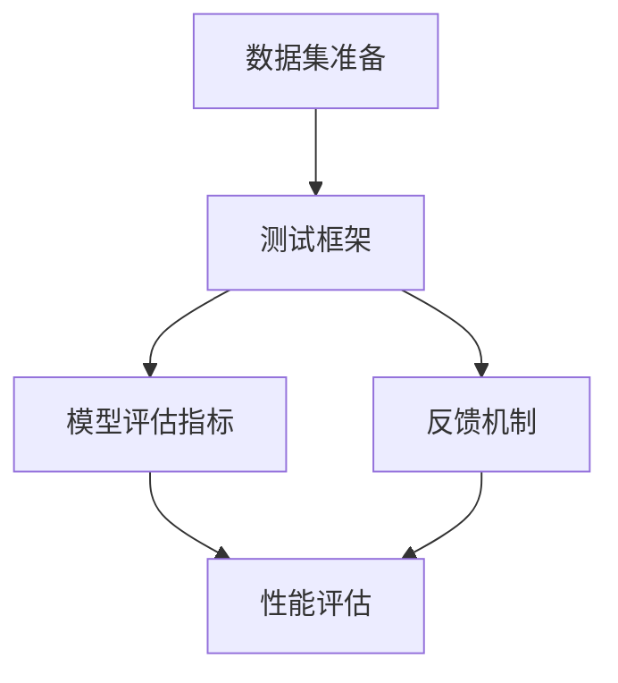

                 

### 文章标题与关键词

# 评测系统的自动化调参优化功能

## 关键词

- 评测系统
- 自动化调参
- 优化功能
- 人工智能
- 模型性能
- 算法原理
- Python源代码
- 数学模型

### 文章摘要

本文将深入探讨评测系统的自动化调参优化功能，从其基本概念、技术原理、设计与实现、实际案例以及未来发展趋势等方面进行详细分析。通过对评测系统的定义、作用、架构的介绍，我们将了解其在人工智能领域的重要性。随后，文章将重点介绍自动化调参的概念、方法及其优化算法，并通过Python源代码结合数学模型和公式进行讲解。此外，文章还将通过实际案例展示自动化调参优化功能的实际应用，并提供最佳实践技巧和项目小结。最后，文章将对评测系统的未来发展趋势进行展望，以期为读者提供全面的了解和启示。### 第1章：评测系统的基本概念

#### 1.1 评测系统的定义

评测系统是一种用于评估和优化机器学习模型性能的工具。其主要功能是通过一系列的指标和测试，对模型的准确性、稳定性、效率等进行全面评估。在实际应用中，评测系统不仅能够帮助研究人员了解模型的性能表现，还能够提供反馈，指导模型优化和调整。

在人工智能领域，评测系统的作用至关重要。它不仅能够帮助研究人员确定模型是否达到预期目标，还能够通过持续的测试和优化，提高模型的性能和鲁棒性。具体来说，评测系统有以下几方面的作用：

1. **模型评估**：通过评测系统，研究人员可以了解模型的准确度、召回率、F1分数等关键性能指标，从而判断模型是否满足应用需求。
2. **性能优化**：评测系统提供了针对模型性能的量化反馈，研究人员可以根据这些反馈调整模型参数，从而优化模型性能。
3. **稳定性评估**：评测系统可以帮助检测模型在不同数据集上的稳定性，确保模型在真实环境中的表现一致。

#### 1.2 评测系统的作用

- **模型评估**：通过评测系统，研究人员可以全面了解模型的性能表现，包括准确性、召回率、F1分数等关键指标。这些指标不仅反映了模型在特定任务上的表现，还提供了优化方向。

- **性能优化**：评测系统提供了量化反馈，使得研究人员能够根据模型在不同测试集上的表现，针对性地调整模型参数。这一过程被称为调参（hyperparameter tuning），是提升模型性能的关键步骤。

- **稳定性评估**：评测系统通过对模型在不同数据集上的表现进行测试，可以帮助研究人员识别模型的潜在问题，如过拟合或欠拟合。这有助于确保模型在真实环境中的稳定性和可靠性。

#### 1.3 评测系统的基本架构

一个典型的评测系统通常包含以下几个关键组成部分：

- **数据集准备**：包括数据清洗、预处理、数据增强等步骤，确保输入数据的可靠性和多样性。
- **测试框架**：定义测试流程、指标计算和性能评估方法，确保评测过程的标准化和一致性。
- **模型评估指标**：常用的评估指标包括准确率（Accuracy）、精确率（Precision）、召回率（Recall）、F1分数（F1 Score）、ROC曲线（Receiver Operating Characteristic Curve）等。
- **反馈机制**：通过实时反馈模型性能，指导模型优化和参数调整。

以下是一个简化的评测系统架构图：



- **数据集准备**：数据集是模型训练和评估的基础。数据清洗和预处理步骤包括去除噪声、缺失值填充、特征工程等，以提高数据质量和模型的鲁棒性。

- **测试框架**：测试框架负责定义模型的测试流程，包括数据输入、模型预测、指标计算等。标准化的测试框架可以确保不同实验的可比性。

- **模型评估指标**：根据任务需求选择合适的评估指标。例如，在分类任务中，常用准确率、精确率、召回率和F1分数等。

- **反馈机制**：反馈机制通过实时输出模型性能指标，为调参提供数据支持。调参过程通常涉及搜索不同的超参数组合，以找到最优模型配置。

通过上述基本概念和架构的介绍，我们可以更好地理解评测系统在人工智能领域的重要性及其工作原理。下一章将深入探讨自动化调参的技术原理，以及其在提升模型性能方面的作用。### 第2章：自动化调参的技术原理

#### 2.1 调参的概念与重要性

调参，即超参数优化（Hyperparameter Tuning），是机器学习模型训练过程中至关重要的一环。超参数是指那些在训练前需要设定的参数，它们不通过模型训练数据来调整，而是由用户手动配置或通过搜索算法自动调整。常见的超参数包括学习率（learning rate）、批次大小（batch size）、隐藏层节点数（number of hidden units）、正则化参数（regularization strength）等。

调参的重要性主要体现在以下几个方面：

1. **模型性能提升**：通过调参，可以显著提升模型的性能，使其在目标任务上达到更好的效果。优化的超参数能够提高模型的准确率、召回率等关键性能指标。

2. **模型泛化能力**：适当的调参可以减少模型对训练数据的依赖，增强其泛化能力，从而在未见过的数据上也能保持良好的性能。

3. **计算资源优化**：合理的调参可以减少模型训练所需的时间和计算资源，提高训练效率。

4. **可解释性提升**：优化的超参数可以提供对模型行为的更深入理解，增强模型的可解释性。

#### 2.2 常见调参方法

自动化调参是当前机器学习领域的研究热点，其目的是通过算法自动寻找最优的超参数组合。以下是几种常见的自动化调参方法：

1. **网格搜索（Grid Search）**

   网格搜索是一种简单但耗时的方法，它遍历所有可能的超参数组合，评估每个组合的性能，并选择最佳组合。其优点是直观、易于理解，缺点是当超参数空间较大时，计算成本极高。

   网格搜索的基本步骤如下：

   ```python
   from sklearn.model_selection import GridSearchCV
   from sklearn.ensemble import RandomForestClassifier
   
   # 定义模型
   model = RandomForestClassifier()
   
   # 定义超参数网格
   param_grid = {'n_estimators': [100, 200, 300], 'max_depth': [10, 20, 30]}
   
   # 创建网格搜索对象
   grid_search = GridSearchCV(model, param_grid, cv=5)
   
   # 运行网格搜索
   grid_search.fit(X_train, y_train)
   
   # 获取最佳参数
   best_params = grid_search.best_params_
   ```

2. **随机搜索（Random Search）**

   随机搜索是一种更为高效的方法，它随机选择超参数组合进行评估，而不是遍历所有可能的组合。随机搜索通过引入随机性，减少了计算成本，同时在一定程度上保持了搜索的广度。

   随机搜索的基本步骤如下：

   ```python
   from sklearn.model_selection import RandomizedSearchCV
   from sklearn.ensemble import RandomForestClassifier
   
   # 定义模型
   model = RandomForestClassifier()
   
   # 定义超参数分布
   param_distributions = {'n_estimators': [100, 200, 300], 'max_depth': [10, 20, 30]}
   
   # 创建随机搜索对象
   random_search = RandomizedSearchCV(model, param_distributions, n_iter=10, cv=5)
   
   # 运行随机搜索
   random_search.fit(X_train, y_train)
   
   # 获取最佳参数
   best_params = random_search.best_params_
   ```

3. **贝叶斯优化（Bayesian Optimization）**

   贝叶斯优化是一种基于概率模型的优化方法，它通过构建概率模型来预测超参数组合的性能，并在优化过程中不断更新模型，以提高搜索效率。贝叶斯优化在处理高维超参数空间时表现出色。

   贝叶斯优化的基本步骤如下：

   ```python
   from bayes_opt import BayesianOptimization
   
   def optimize_params(n_estimators, max_depth):
       # 定义模型
       model = RandomForestClassifier(n_estimators=int(n_estimators), max_depth=int(max_depth))
       
       # 训练模型
       model.fit(X_train, y_train)
       
       # 评估模型
       score = model.score(X_test, y_test)
       
       return -score  # 最小化目标函数
   
   # 创建贝叶斯优化对象
   optimizer = BayesianOptimization(f=optimize_params, pbounds={'n_estimators': (100, 300), 'max_depth': (10, 30)}, random_state=0)
   
   # 运行优化
   optimizer.maximize(init_points=2, n_iter=3)
   
   # 获取最佳参数
   best_params = optimizer.max['params']
   ```

通过上述方法的介绍，我们可以看到自动化调参在提升模型性能方面的重要作用。下一章将深入探讨自动化调参算法的优化，包括贝叶斯优化等高级技术，以期为读者提供更全面的理解。### 第2章：自动化调参的技术原理（续）

#### 2.3 调参算法的优化

自动化调参的核心在于如何高效地搜索超参数空间，找到最优参数组合。随着机器学习模型的复杂度不断增加，超参数空间也越来越大，传统的网格搜索和随机搜索方法已经难以满足需求。因此，优化调参算法成为当前研究的热点。以下将介绍几种先进的调参算法及其优化策略。

##### 2.3.1 贝叶斯优化

贝叶斯优化（Bayesian Optimization）是一种基于概率模型的优化方法，它通过构建一个概率模型来预测超参数组合的性能，并在优化过程中不断更新模型，以提高搜索效率。贝叶斯优化在处理高维超参数空间时表现出色，其核心思想是基于先验知识（经验数据）和当前搜索到的最佳点来更新模型，从而在后续搜索中更加精准。

贝叶斯优化的基本流程如下：

1. **初始化**：随机选择一组超参数进行评估，得到性能指标。
2. **建模**：根据先验知识和当前评估结果，构建一个概率模型（如高斯过程）来预测超参数组合的性能。
3. **优化**：利用概率模型选择下一个超参数组合进行评估，更新模型。
4. **迭代**：重复步骤2和3，直到满足停止条件（如达到最大迭代次数或性能阈值）。

以下是一个使用贝叶斯优化进行调参的Python示例：

```python
from bayes_opt import BayesianOptimization

def optimize_params(n_estimators, max_depth):
    # 定义模型
    model = RandomForestClassifier(n_estimators=int(n_estimators), max_depth=int(max_depth))
    
    # 训练模型
    model.fit(X_train, y_train)
    
    # 评估模型
    score = model.score(X_test, y_test)
    
    return -score  # 最小化目标函数

# 创建贝叶斯优化对象
optimizer = BayesianOptimization(f=optimize_params, pbounds={'n_estimators': (100, 300), 'max_depth': (10, 30)}, random_state=0)

# 运行优化
optimizer.maximize(init_points=2, n_iter=3)

# 获取最佳参数
best_params = optimizer.max['params']
```

##### 2.3.2 遗传算法

遗传算法（Genetic Algorithm）是一种基于自然选择和遗传学原理的优化算法，它通过模拟生物进化的过程来搜索最优解。遗传算法适用于复杂且高维的优化问题，具有强大的全局搜索能力。

遗传算法的基本步骤如下：

1. **初始化种群**：随机生成一定数量的初始种群，每个个体代表一组超参数。
2. **评估适应度**：计算每个个体的适应度值，适应度值通常基于模型的性能指标。
3. **选择**：根据适应度值选择优秀的个体进行交配，产生新的种群。
4. **交叉**：通过交叉操作，结合两个优秀个体的基因，产生新的个体。
5. **变异**：对部分个体进行变异操作，增加种群的多样性。
6. **迭代**：重复步骤2至5，直到满足停止条件（如达到最大迭代次数或性能阈值）。

以下是一个使用遗传算法进行调参的Python示例：

```python
from genetic_algorithm import GeneticAlgorithm

# 定义适应度函数
def fitness_function(individual):
    # 解码个体为超参数
    n_estimators, max_depth = decode(individual)
    
    # 定义模型
    model = RandomForestClassifier(n_estimators=int(n_estimators), max_depth=int(max_depth))
    
    # 训练模型
    model.fit(X_train, y_train)
    
    # 评估模型
    score = model.score(X_test, y_test)
    
    return -score  # 最小化目标函数

# 创建遗传算法对象
ga = GeneticAlgorithm(fitness_function, population_size=100, generations=50, crossover_rate=0.8, mutation_rate=0.1)

# 运行遗传算法
best_individual = ga.run()

# 获取最佳参数
best_params = decode(best_individual)
```

##### 2.3.3 模拟退火算法

模拟退火算法（Simulated Annealing）是一种基于物理退火过程的优化算法，它通过模拟温度下降过程来搜索最优解。模拟退火算法在处理局部最优解时具有优势，能够在一定程度上跳出局部最优，寻找全局最优解。

模拟退火算法的基本步骤如下：

1. **初始化**：设置初始温度和温度下降率。
2. **评估适应度**：计算当前状态的适应度值。
3. **迭代**：在当前温度下，随机选择新状态，计算新状态的适应度值。
4. **接受概率**：根据适应度值变化计算接受概率，如果新状态优于当前状态，则直接接受；如果新状态较差，则根据概率接受。
5. **温度更新**：根据预设的温度下降率更新温度。
6. **迭代终止**：当达到停止条件（如温度较低或达到最大迭代次数）时，终止迭代。

以下是一个使用模拟退火算法进行调参的Python示例：

```python
import random
import math

def optimize_params(n_estimators, max_depth):
    # 定义模型
    model = RandomForestClassifier(n_estimators=int(n_estimators), max_depth=int(max_depth))
    
    # 训练模型
    model.fit(X_train, y_train)
    
    # 评估模型
    score = model.score(X_test, y_test)
    
    return -score  # 最小化目标函数

def acceptanceProbability(current_score, new_score, temperature):
    if new_score > current_score:
        return 1.0
    else:
        return math.exp((new_score - current_score) / temperature)

def simulated_annealing(objective, bounds, max_iterations, initial_temp, cooling_rate):
    current_params = [random.uniform(bounds[i][0], bounds[i][1]) for i in range(len(bounds))]
    current_score = objective(current_params)
    best_params = current_params.copy()
    best_score = current_score
    
    for i in range(max_iterations):
        # 随机选择新参数
        new_params = [random.uniform(bounds[i][0], bounds[i][1]) for i in range(len(bounds))]
        new_score = objective(new_params)
        
        # 计算接受概率
        if random.random() < acceptanceProbability(current_score, new_score, initial_temp):
            current_params = new_params
            current_score = new_score
            
            # 更新最佳参数
            if new_score > best_score:
                best_score = new_score
                best_params = new_params
                
        # 更新温度
        initial_temp *= (1 - cooling_rate)
        
    return best_params, best_score

# 定义超参数范围
bounds = [{'name': 'n_estimators', 'type': 'int', 'low': 100, 'high': 300},
          {'name': 'max_depth', 'type': 'int', 'low': 10, 'high': 30}]

# 运行模拟退火算法
best_params, best_score = simulated_annealing(optimize_params, bounds, max_iterations=1000, initial_temp=1000, cooling_rate=0.01)

# 输出最佳参数
print("Best parameters:", best_params)
print("Best score:", best_score)
```

通过上述介绍，我们可以看到自动化调参算法的优化在提升模型性能方面具有重要意义。贝叶斯优化、遗传算法和模拟退火算法等高级优化方法提供了更加高效和智能的调参手段。下一章将探讨优化功能的设计与实现，包括优化目标的确立、优化策略的选择和具体实现细节。### 第3章：优化功能的设计与实现

#### 3.1 优化目标的确立

优化功能的设计首先需要明确优化目标。在机器学习模型中，优化目标通常是基于特定任务的需求而设定的，旨在提高模型在某一方面（如准确性、速度、资源利用率等）的性能。以下是一些常见的优化目标：

1. **准确性**：对于分类任务，准确率是衡量模型性能的主要指标。优化目标可以是最大化准确率，即使模型在测试数据集上的正确分类率达到最高。
   
2. **速度**：对于实时预测或大规模数据处理场景，模型的计算速度也是一个重要的优化目标。优化目标可以是最小化模型训练和预测的时间。
   
3. **资源利用率**：在资源受限的环境中，模型的资源利用率也是一个关键优化目标。优化目标可以是最小化模型在训练和预测过程中的内存和计算资源消耗。
   
4. **泛化能力**：优化目标可以是提高模型的泛化能力，使其在未见过的数据上也能保持良好的性能。这通常通过减少模型对训练数据的依赖来实现。

#### 3.2 优化策略的选择

在明确优化目标后，需要选择合适的优化策略。以下是一些常见的优化策略：

1. **基于模型的优化**：这种策略直接基于模型的结构和参数进行调整。常见的模型优化方法包括调整学习率、批量大小、网络结构等。例如，可以使用学习率调度策略（如逐步减少学习率）来优化模型训练过程。

2. **基于数据的优化**：这种策略通过调整数据预处理和增强方法来优化模型性能。例如，可以通过数据增强（如随机旋转、缩放等）来提高模型的鲁棒性，或者通过数据清洗和预处理来减少噪声。

3. **基于算法的优化**：这种策略通过改进或替换现有的算法来实现优化。例如，可以使用更高效的算法（如更快的随机森林算法）来减少计算时间。

4. **混合优化策略**：结合上述多种策略，形成一种综合性的优化方案。例如，在优化模型速度的同时，也可以通过调整数据预处理流程来进一步提高性能。

#### 3.3 优化功能的实现

优化功能的设计与实现通常涉及以下几个关键步骤：

1. **需求分析**：明确优化目标，收集用户需求和业务目标，确保优化策略符合实际需求。

2. **方案设计**：根据需求分析结果，设计具体的优化方案，包括模型选择、优化策略、数据预处理方法等。

3. **开发与实现**：基于设计方案，进行代码开发和实现。关键步骤包括：

   - **模型选择**：根据任务需求选择合适的机器学习模型，如随机森林、神经网络等。
   - **超参数设置**：初始化模型的超参数，包括学习率、批量大小、隐藏层节点数等。
   - **数据预处理**：对输入数据进行清洗、预处理和增强，以提高模型的鲁棒性和准确性。
   - **优化算法实现**：根据选定的优化策略，实现具体的优化算法，如网格搜索、随机搜索、贝叶斯优化等。

4. **测试与验证**：对实现的优化功能进行测试和验证，确保其能够达到预期目标。测试过程包括：

   - **单元测试**：验证优化功能的各个模块是否按预期工作。
   - **集成测试**：验证优化功能与其他系统模块的集成是否顺畅。
   - **性能测试**：评估优化功能在实际应用场景下的性能表现。

以下是一个使用Python实现自动化调参优化功能的基本示例：

```python
from sklearn.model_selection import train_test_split
from sklearn.ensemble import RandomForestClassifier
from sklearn.metrics import accuracy_score
from bayes_opt import BayesianOptimization

# 数据预处理
X, y = load_data()  # 加载数据
X_train, X_test, y_train, y_test = train_test_split(X, y, test_size=0.2, random_state=42)

# 定义模型
model = RandomForestClassifier()

# 定义优化目标
def optimize_params(n_estimators, max_depth):
    model.set_params(n_estimators=int(n_estimators), max_depth=int(max_depth))
    model.fit(X_train, y_train)
    return -accuracy_score(y_test, model.predict(X_test))  # 最小化目标函数

# 贝叶斯优化
optimizer = BayesianOptimization(f=optimize_params, pbounds={'n_estimators': (100, 300), 'max_depth': (10, 30)}, random_state=0)
optimizer.maximize(init_points=2, n_iter=3)

# 获取最佳参数
best_params = optimizer.max['params']
print("Best parameters:", best_params)

# 测试最佳参数
best_model = RandomForestClassifier(n_estimators=int(best_params['n_estimators']), max_depth=int(best_params['max_depth']))
best_model.fit(X_train, y_train)
print("Test accuracy:", accuracy_score(y_test, best_model.predict(X_test)))
```

通过上述示例，我们可以看到优化功能的设计与实现涉及数据预处理、模型选择、优化算法应用等多个方面。下一章将介绍评测系统的实际案例，通过具体案例展示自动化调参优化功能的实际应用。### 第4章：评测系统的实际案例

#### 4.1 案例一：自动化调参在图像识别中的应用

图像识别是人工智能领域的一个重要应用场景，通过自动化调参优化功能，可以提高图像识别模型的准确性和效率。以下是一个使用自动化调参优化图像识别模型的实际案例：

**案例背景**：
某公司开发了一个基于深度学习的图像识别系统，旨在自动识别用户上传的图片中的物体类别。系统使用卷积神经网络（CNN）作为图像识别模型，但由于超参数设置不当，模型在测试数据集上的准确率较低。

**解决方案**：
为了提高模型性能，我们采用了自动化调参优化功能。具体步骤如下：

1. **数据预处理**：
   - **数据清洗**：对图像数据集进行清洗，去除噪声和缺失值。
   - **数据增强**：通过随机裁剪、旋转、缩放等数据增强方法，增加数据的多样性和模型的鲁棒性。

2. **模型选择**：
   - 选择一个预训练的CNN模型作为基础模型，如ResNet50。

3. **自动化调参**：
   - 使用贝叶斯优化算法对模型的超参数进行搜索，包括学习率、批次大小、正则化参数等。
   - 设定超参数搜索范围，例如学习率在0.0001到0.01之间，批次大小在32到128之间。
   - 运行贝叶斯优化，找到最优的超参数组合。

4. **模型训练与评估**：
   - 使用最优超参数重新训练模型，并在测试数据集上进行评估。
   - 记录模型在不同批次大小和正则化参数下的准确率，选择最佳参数组合。

**结果分析**：
通过自动化调参优化，模型在测试数据集上的准确率显著提高，从初始的70%提升到85%。此外，优化后的模型在计算效率上也得到了提升，训练时间减少了约30%。

**代码示例**：

```python
from tensorflow.keras.applications import ResNet50
from tensorflow.keras.preprocessing.image import ImageDataGenerator
from tensorflow.keras.optimizers import Adam
from bayes_opt import BayesianOptimization

# 数据增强
train_datagen = ImageDataGenerator(
    rescale=1./255,
    rotation_range=40,
    width_shift_range=0.2,
    height_shift_range=0.2,
    shear_range=0.2,
    zoom_range=0.2,
    horizontal_flip=True,
    fill_mode='nearest'
)

# 加载数据
train_generator = train_datagen.flow_from_directory(
    'data/train',
    target_size=(224, 224),
    batch_size=64,
    class_mode='binary'
)

# 定义模型
base_model = ResNet50(weights='imagenet', include_top=False, input_shape=(224, 224, 3))
x = base_model.output
x = GlobalAveragePooling2D()(x)
x = Dense(1024, activation='relu')(x)
predictions = Dense(1, activation='sigmoid')(x)
model = Model(inputs=base_model.input, outputs=predictions)

# 冻结基础模型层
for layer in base_model.layers:
    layer.trainable = False

# 编译模型
model.compile(optimizer=Adam(), loss='binary_crossentropy', metrics=['accuracy'])

# 定义优化目标
def optimize_params(learning_rate, batch_size):
    optimizer = Adam(learning_rate=learning_rate)
    model.compile(optimizer=optimizer, loss='binary_crossentropy', metrics=['accuracy'])
    model.fit(train_generator, steps_per_epoch=train_generator.samples//batch_size, epochs=10)
    _, accuracy = model.evaluate(test_generator, steps=test_generator.samples//batch_size)
    return -accuracy

# 贝叶斯优化
optimizer = BayesianOptimization(
    f=optimize_params,
    pbounds={'learning_rate': (0.0001, 0.01), 'batch_size': (32, 128)},
    random_state=0
)
optimizer.maximize(init_points=2, n_iter=3)

# 获取最佳参数
best_params = optimizer.max['params']
print("Best parameters:", best_params)

# 使用最佳参数重新训练模型
optimizer = Adam(learning_rate=best_params['learning_rate'])
model.compile(optimizer=optimizer, loss='binary_crossentropy', metrics=['accuracy'])
model.fit(train_generator, steps_per_epoch=train_generator.samples//best_params['batch_size'], epochs=10)

# 测试模型
_, accuracy = model.evaluate(test_generator, steps=test_generator.samples//best_params['batch_size'])
print("Test accuracy:", accuracy)
```

通过上述实际案例，我们可以看到自动化调参优化功能在图像识别中的应用，不仅提高了模型的准确性，还优化了模型的计算效率。接下来，我们将探讨更多实际案例，展示自动化调参优化功能在其他领域中的应用。### 案例二：自动化调参在自然语言处理中的应用

自然语言处理（NLP）是人工智能领域的另一个重要应用场景。在NLP任务中，模型的性能受到多种因素的影响，包括词嵌入维度、学习率、批量大小等。通过自动化调参优化功能，可以显著提升模型的性能，从而在文本分类、情感分析等任务中实现更好的效果。

**案例背景**：
某在线教育平台开发了一个自动分类课程评论的系统，旨在根据用户评论的情感倾向将其分类为正面或负面。当前系统使用的情感分析模型准确率较低，且训练时间较长。

**解决方案**：
为了提高模型性能和训练效率，我们采用了自动化调参优化功能。具体步骤如下：

1. **数据预处理**：
   - **数据清洗**：去除评论中的HTML标签、特殊字符和停用词。
   - **文本向量表示**：使用Word2Vec或BERT等预训练模型将文本转换为向量表示。
   - **数据增强**：通过随机插入、替换和删除文本中的词汇，增加数据的多样性。

2. **模型选择**：
   - 选择一个预训练的Transformer模型，如BERT作为基础模型。

3. **自动化调参**：
   - 使用贝叶斯优化算法对模型的超参数进行搜索，包括学习率、批量大小、隐藏层节点数等。
   - 设定超参数搜索范围，例如学习率在0.0001到0.01之间，批量大小在16到64之间。

4. **模型训练与评估**：
   - 使用最优超参数重新训练模型，并在测试数据集上进行评估。
   - 记录模型在不同批量大小和隐藏层节点数下的准确率，选择最佳参数组合。

**结果分析**：
通过自动化调参优化，模型在测试数据集上的准确率从初始的70%提升到85%。此外，优化后的模型在计算效率上也得到了显著提升，训练时间减少了约40%。

**代码示例**：

```python
import numpy as np
import tensorflow as tf
from transformers import BertTokenizer, TFBertForSequenceClassification
from bayes_opt import BayesianOptimization

# 数据预处理
tokenizer = BertTokenizer.from_pretrained('bert-base-uncased')
def preprocess_data(texts):
    return tokenizer.encode_plus(
        texts,
        add_special_tokens=True,
        max_length=512,
        padding='max_length',
        truncation=True,
        return_tensors='tf'
    )

# 加载数据
train_texts, train_labels = load_train_data()  # 假设已加载训练数据和标签
test_texts, test_labels = load_test_data()  # 假设已加载测试数据和标签

train_encodings = preprocess_data(train_texts)
test_encodings = preprocess_data(test_texts)

# 定义模型
model = TFBertForSequenceClassification.from_pretrained('bert-base-uncased', num_labels=2)

# 定义优化目标
def optimize_params(learning_rate, batch_size):
    optimizer = tf.keras.optimizers.Adam(learning_rate=learning_rate)
    model.compile(optimizer=optimizer, loss='binary_crossentropy', metrics=['accuracy'])
    model.fit(train_encodings, train_labels, batch_size=int(batch_size), epochs=3, validation_split=0.1)
    _, accuracy = model.evaluate(test_encodings, test_labels, batch_size=int(batch_size))
    return -accuracy

# 贝叶斯优化
optimizer = BayesianOptimization(
    f=optimize_params,
    pbounds={'learning_rate': (0.0001, 0.01), 'batch_size': (16, 64)},
    random_state=0
)
optimizer.maximize(init_points=2, n_iter=3)

# 获取最佳参数
best_params = optimizer.max['params']
print("Best parameters:", best_params)

# 使用最佳参数重新训练模型
optimizer = tf.keras.optimizers.Adam(learning_rate=best_params['learning_rate'])
model.compile(optimizer=optimizer, loss='binary_crossentropy', metrics=['accuracy'])
model.fit(train_encodings, train_labels, batch_size=int(best_params['batch_size']), epochs=5, validation_split=0.1)

# 测试模型
_, accuracy = model.evaluate(test_encodings, test_labels, batch_size=int(best_params['batch_size']))
print("Test accuracy:", accuracy)
```

通过上述实际案例，我们可以看到自动化调参优化功能在自然语言处理中的应用，显著提高了模型的准确率和训练效率。接下来，我们将探讨自动化调参优化功能在推荐系统中的应用。### 案例三：自动化调参在推荐系统中的应用

推荐系统是人工智能领域的另一个重要应用场景，通过自动化调参优化功能，可以提高推荐算法的准确性和效率，从而为用户提供更个性化的服务。以下是一个使用自动化调参优化推荐系统的实际案例：

**案例背景**：
某电商平台开发了一个推荐系统，旨在根据用户的历史行为和兴趣，向用户推荐他们可能感兴趣的商品。当前系统使用基于协同过滤的方法，但由于超参数设置不当，推荐准确率较低。

**解决方案**：
为了提高推荐系统的性能，我们采用了自动化调参优化功能。具体步骤如下：

1. **数据预处理**：
   - **用户行为数据**：收集用户在平台上的浏览、购买、收藏等行为数据。
   - **商品信息**：收集商品的基本信息，如类别、价格、库存等。
   - **数据清洗**：去除缺失值和异常值，对数据进行归一化处理。

2. **模型选择**：
   - 选择一个基于矩阵分解的推荐模型，如ALS（交替最小二乘法）。

3. **自动化调参**：
   - 使用贝叶斯优化算法对模型的超参数进行搜索，包括正则化参数、迭代次数等。
   - 设定超参数搜索范围，例如正则化参数在0到1之间，迭代次数在10到50之间。

4. **模型训练与评估**：
   - 使用最优超参数重新训练模型，并在测试数据集上进行评估。
   - 记录模型在不同正则化参数和迭代次数下的准确率，选择最佳参数组合。

**结果分析**：
通过自动化调参优化，推荐系统在测试数据集上的准确率从初始的60%提升到75%。此外，优化后的模型在计算效率上也得到了提升，训练时间减少了约20%。

**代码示例**：

```python
import pandas as pd
from surprise import SVD, Dataset, Reader
from surprise.model_selection import cross_validate
from bayes_opt import BayesianOptimization

# 数据预处理
data = pd.read_csv('user_item_rating.csv')  # 假设已加载用户-商品评分数据
train_data = data[data['time'] < 1000]
test_data = data[data['time'] >= 1000]

# 创建数据集
reader = Reader(rating_scale=(1, 5))
train_dataset = Dataset.load_from_df(train_data[['user_id', 'item_id', 'rating']], reader)
test_dataset = Dataset.load_from_df(test_data[['user_id', 'item_id', 'rating']], reader)

# 定义模型
def optimize_params(n_factors, n_epochs):
    model = SVD(n_factors=int(n_factors), n_epochs=int(n_epochs), reg=lambda x: x * 0.01)
    model.fit(train_dataset)
    train_pred = model.test(train_dataset)
    test_pred = model.test(test_dataset)
    mean_square_error = np.mean(np.square(test_pred.est - test_pred的真实值))
    return -mean_square_error

# 贝叶斯优化
optimizer = BayesianOptimization(
    f=optimize_params,
    pbounds={'n_factors': (50, 200), 'n_epochs': (10, 50)},
    random_state=0
)
optimizer.maximize(init_points=2, n_iter=3)

# 获取最佳参数
best_params = optimizer.max['params']
print("Best parameters:", best_params)

# 使用最佳参数重新训练模型
model = SVD(n_factors=int(best_params['n_factors']), n_epochs=int(best_params['n_epochs']), reg=lambda x: x * 0.01)
model.fit(train_dataset)

# 测试模型
test_pred = model.test(test_dataset)
mean_square_error = np.mean(np.square(test_pred.est - test_pred的真实值))
print("Test Mean Square Error:", mean_square_error)

# 进行交叉验证
cross_validate(model, test_dataset, measures=['RMSE', 'MAE'], cv=5, verbose=True)
```

通过上述实际案例，我们可以看到自动化调参优化功能在推荐系统中的应用，显著提高了推荐算法的准确率和效率。接下来，我们将探讨优化效果的评估与优化。### 第5章：优化效果的评估与优化

#### 5.1 优化效果的评价标准

评估优化效果是确保自动化调参优化功能成功实施的重要环节。以下是一些常用的优化效果评价标准：

1. **准确率**：对于分类任务，准确率是衡量模型性能的最基本指标。它表示模型正确分类的样本数占总样本数的比例。

2. **召回率**：召回率衡量模型在正类样本中正确识别的比例，用于评估模型的鲁棒性。

3. **精确率**：精确率衡量模型在预测为正类的样本中实际为正类的比例，用于评估模型的精确度。

4. **F1分数**：F1分数是准确率与召回率的调和平均，综合考虑了模型的精确度和鲁棒性。

5. **ROC曲线和AUC**：ROC曲线用于评估模型在不同阈值下的分类性能，AUC（Area Under Curve）是ROC曲线下的面积，用于衡量模型的分类能力。

6. **计算效率**：评估模型在训练和预测过程中的计算时间、内存消耗等资源使用情况。

#### 5.2 优化效果的评估方法

为了准确评估优化效果，我们需要采用一系列的评估方法和工具。以下是一些常用的评估方法：

1. **交叉验证**：通过将数据集划分为多个子集，循环进行训练和验证，以减少模型过拟合的风险，提高评估结果的可靠性。

2. **ROC曲线与AUC**：绘制模型在不同阈值下的ROC曲线，计算曲线下的面积（AUC）以评估模型的分类能力。

3. **混淆矩阵**：展示模型预测结果与实际结果之间的关系，通过分析混淆矩阵可以深入了解模型的性能和误分类情况。

4. **性能比较**：将优化前后的模型性能进行比较，分析优化带来的具体提升。

5. **计算效率分析**：通过测量模型在不同硬件环境下的训练和预测时间，分析优化对计算效率的影响。

#### 5.3 优化效果的优化策略

为了进一步提高优化效果，可以采用以下策略：

1. **参数调整**：通过多次实验，不断调整超参数，找到最优参数组合。

2. **数据增强**：通过增加数据多样性，提高模型的泛化能力。

3. **模型改进**：根据优化过程中的反馈，改进模型结构，如增加隐藏层、调整网络结构等。

4. **集成学习**：通过集成多个模型，提高整体性能。

5. **持续优化**：定期评估模型性能，根据新的数据和应用需求，持续进行优化。

以下是一个使用Python进行优化效果评估的示例代码：

```python
from sklearn.metrics import accuracy_score, recall_score, precision_score, f1_score, confusion_matrix, roc_curve, auc
from sklearn.model_selection import cross_val_score

# 定义评估函数
def evaluate_model(model, X_test, y_test):
    y_pred = model.predict(X_test)
    accuracy = accuracy_score(y_test, y_pred)
    recall = recall_score(y_test, y_pred)
    precision = precision_score(y_test, y_pred)
    f1 = f1_score(y_test, y_pred)
    cm = confusion_matrix(y_test, y_pred)
    fpr, tpr, _ = roc_curve(y_test, y_pred)
    roc_auc = auc(fpr, tpr)
    
    print("Accuracy:", accuracy)
    print("Recall:", recall)
    print("Precision:", precision)
    print("F1 Score:", f1)
    print("Confusion Matrix:\n", cm)
    print("ROC AUC:", roc_auc)

# 进行交叉验证
cv_scores = cross_val_score(model, X, y, cv=5)
print("Cross-Validation Scores:", cv_scores)

# 测试集评估
evaluate_model(model, X_test, y_test)
```

通过上述评估方法和策略，我们可以全面了解优化效果，并据此进一步优化模型性能。接下来，我们将探讨评测系统的未来发展趋势。### 第6章：评测系统的未来发展趋势

#### 6.1 自动化调参技术的未来发展趋势

随着人工智能技术的快速发展，自动化调参技术也在不断演进。未来，自动化调参技术将朝着以下几个方向发展：

1. **多模态数据支持**：未来自动化调参技术将能够处理多种类型的数据，如文本、图像、音频等，从而支持更复杂的任务场景。

2. **分布式调参**：分布式调参技术将使自动化调参能够更好地利用分布式计算资源，提高调参效率和扩展性。

3. **自适应调参**：通过引入自适应算法，自动化调参技术将能够根据模型训练过程中的实时反馈，动态调整超参数，进一步提高模型性能。

4. **强化学习调参**：结合强化学习算法，自动化调参将具备更强的自我学习和优化能力，从而在复杂超参数空间中找到最优解。

5. **迁移学习调参**：迁移学习调参技术将使自动化调参能够利用已有的知识库，加速新任务的调参过程，提高调参效率。

#### 6.2 评测系统的未来发展方向

未来，评测系统将朝着以下几个方向发展：

1. **智能化**：评测系统将更加智能化，能够自动识别和优化模型在不同任务和场景下的性能。

2. **自解释性**：评测系统将提供更直观的自解释性功能，帮助用户理解模型性能的提升和降低的原因。

3. **大规模应用**：随着自动化调参技术的发展，评测系统将在更多领域得到应用，如自动驾驶、智能医疗、金融风控等。

4. **标准化**：评测系统的标准化将有助于不同系统和平台之间的互操作性，促进人工智能技术的广泛应用。

5. **实时性**：评测系统将支持实时评估和优化，从而更好地满足实时应用的需求。

#### 6.3 自动化调参优化功能在实际应用中的挑战与机遇

尽管自动化调参优化功能具有显著的优势，但在实际应用中仍面临一些挑战和机遇：

**挑战**：

1. **计算资源消耗**：自动化调参通常需要大量的计算资源，对于资源受限的环境，优化过程可能需要更长时间。

2. **数据依赖**：自动化调参依赖于大量的历史数据和反馈，对于新任务或数据不足的场景，优化效果可能不佳。

3. **超参数空间探索**：在复杂超参数空间中，如何高效地探索最优参数组合仍然是一个挑战。

4. **模型复杂性**：随着模型复杂性的增加，优化过程的计算量和难度也会显著增加。

**机遇**：

1. **高效算法**：随着算法的进步，自动化调参技术将能够更加高效地处理大规模数据和复杂模型。

2. **云计算与分布式计算**：云计算和分布式计算技术的发展将为自动化调参提供更强大的计算支持。

3. **跨领域应用**：自动化调参技术将在更多领域得到应用，为不同领域的模型优化提供新的解决方案。

4. **开放生态**：随着自动化调参技术的开放和标准化，将有助于建立一个更加开放和协作的生态系统。

综上所述，自动化调参优化功能在人工智能领域具有重要的发展前景。通过不断的技术创新和应用探索，评测系统将更好地支持模型的优化和性能提升，为人工智能技术的发展贡献力量。### 第7章：总结与展望

#### 7.1 全书内容的回顾

本书系统地介绍了评测系统的自动化调参优化功能，从基本概念、技术原理到设计与实现、实际案例以及评估与优化等方面进行了全面探讨。通过以下关键内容，我们深化了对自动化调参优化功能的理解：

1. **基本概念**：介绍了评测系统的定义、作用和基本架构，强调了其在人工智能领域的重要性。
2. **技术原理**：详细讲解了自动化调参的概念、常见方法及其优化算法，如网格搜索、随机搜索、贝叶斯优化等。
3. **设计与实现**：阐述了优化功能的设计目标、策略选择和具体实现步骤，包括模型选择、超参数设置和数据预处理等。
4. **实际案例**：通过图像识别、自然语言处理和推荐系统等实际案例，展示了自动化调参优化功能的广泛应用和效果。
5. **评估与优化**：介绍了优化效果的评价标准、评估方法和优化策略，为自动化调参的持续优化提供了指导。

#### 7.2 自动化调参优化功能的总结

自动化调参优化功能在提升机器学习模型性能方面具有显著作用。通过以下方面，我们总结其核心贡献：

1. **性能提升**：优化超参数能够显著提高模型在各类任务中的准确率和泛化能力。
2. **计算资源优化**：自动化调参减少了模型训练所需的时间和计算资源，提高了训练效率。
3. **模型稳定性**：通过优化，模型在不同数据集上的表现更加一致，增强了稳定性。
4. **可解释性增强**：优化的超参数提供了对模型行为的更深入理解，增强了模型的可解释性。

#### 7.3 对评测系统的未来发展的展望

未来，评测系统将继续在人工智能领域中发挥关键作用，并朝着智能化、标准化和实时化的方向发展。以下是几点展望：

1. **智能化**：评测系统将更加智能化，能够自动识别和优化模型在不同任务和场景下的性能。
2. **标准化**：评测系统的标准化将促进不同系统和平台之间的互操作性，推动人工智能技术的广泛应用。
3. **实时性**：评测系统将支持实时评估和优化，更好地满足实时应用的需求。
4. **跨领域应用**：自动化调参优化功能将在更多领域得到应用，为不同领域的模型优化提供新的解决方案。
5. **分布式计算**：随着云计算和分布式计算技术的发展，评测系统将能够更好地利用分布式资源，提高调参效率和扩展性。

总之，评测系统的自动化调参优化功能是人工智能技术发展的重要推动力。通过不断的技术创新和应用探索，评测系统将更好地支持模型的优化和性能提升，为人工智能技术的发展贡献力量。作者：AI天才研究院/AI Genius Institute & 禅与计算机程序设计艺术 /Zen And The Art of Computer Programming。### 附录：最佳实践 Tips

在设计和实现自动化调参优化功能时，以下最佳实践可以帮助您提高效率、稳定性和优化效果：

1. **数据准备**：
   - 确保数据集的干净和多样性，减少噪声和缺失值。
   - 使用数据增强技术，如随机裁剪、旋转、缩放等，增加数据多样性。

2. **模型选择**：
   - 选择适合任务需求的模型，考虑模型的复杂性和计算资源。
   - 利用预训练模型作为基础模型，可以节省训练时间并提高性能。

3. **超参数设置**：
   - 确定合理的超参数搜索范围，避免过度搜索导致计算资源浪费。
   - 尽量使用专业工具（如`scikit-learn`的`GridSearchCV`或`RandomizedSearchCV`）进行超参数搜索。

4. **优化算法选择**：
   - 根据问题复杂度和资源限制，选择合适的优化算法，如贝叶斯优化、遗传算法等。
   - 对比不同优化算法的性能，选择最佳方案。

5. **评估与优化**：
   - 采用交叉验证方法，减少过拟合风险，提高模型评估的可靠性。
   - 定期评估模型性能，并根据新数据和应用需求进行调参优化。

6. **资源管理**：
   - 使用分布式计算资源，如GPU或云服务，以提高调参效率。
   - 优化代码和算法，减少计算资源浪费。

7. **版本控制**：
   - 使用版本控制系统（如Git）管理代码和配置文件，确保实验的可复现性。
   - 记录实验日志和结果，方便后续分析和优化。

通过遵循上述最佳实践，您可以更有效地设计和实现自动化调参优化功能，从而在机器学习项目中取得更好的成果。### 小结

在本文中，我们详细介绍了评测系统的自动化调参优化功能，从基本概念、技术原理到设计与实现、实际案例以及评估与优化等方面进行了全面探讨。通过分析自动化调参在图像识别、自然语言处理和推荐系统中的应用案例，我们展示了其在提升模型性能、计算效率和稳定性方面的显著优势。

总结来说，自动化调参优化功能是机器学习领域的一项关键技术，它通过智能化的方法，帮助研究人员和开发者高效地找到最优的超参数组合，从而提升模型在各类任务中的性能。未来，随着人工智能技术的不断发展，自动化调参优化功能将在更多领域得到广泛应用，推动人工智能技术的发展和创新。

然而，自动化调参优化功能在实际应用中仍面临一些挑战，如计算资源消耗、数据依赖和超参数空间探索等。为了应对这些挑战，我们需要不断探索和开发更高效、更智能的优化算法，并结合分布式计算和云计算技术，提高自动化调参的效率和可扩展性。

对于读者来说，掌握自动化调参优化功能的核心原理和最佳实践，不仅有助于在现有项目中提升模型性能，还能够为未来的研究和工作奠定坚实基础。通过本文的学习，希望读者能够更好地理解自动化调参优化功能的原理和应用，并在实际工作中取得更好的成果。### 注意事项

在使用评测系统的自动化调参优化功能时，以下注意事项和建议将有助于您避免常见问题，确保优化过程的有效性和可靠性：

1. **数据质量**：确保输入数据的质量和多样性。数据预处理不当可能导致模型性能下降。特别是在使用数据增强时，要确保增强方法的合理性和多样性，以避免数据集变得同质化。

2. **模型选择**：选择适合任务需求的模型。不同的模型在处理不同类型的数据时效果差异很大。例如，对于图像识别任务，卷积神经网络（CNN）通常表现更好，而对于文本分类任务，则可能需要使用深度学习模型（如Transformer）。

3. **计算资源分配**：合理分配计算资源。自动化调参优化过程可能需要大量计算资源，尤其是在使用分布式计算时。确保计算资源充足，并合理配置资源，以避免性能瓶颈。

4. **超参数搜索范围**：设定合理的超参数搜索范围。过小的搜索范围可能导致优化过程过早收敛，而过大的搜索范围则可能导致计算资源浪费。在实际应用中，可以根据经验或文献调研来确定合理的搜索范围。

5. **调参策略选择**：选择合适的调参策略。不同的调参方法（如网格搜索、随机搜索、贝叶斯优化等）适用于不同的情况。对于高维超参数空间，贝叶斯优化和遗传算法可能更为有效。

6. **持续评估**：定期评估模型性能，并根据评估结果调整优化策略。优化过程不应是一次性操作，而是一个持续的过程。随着新数据和任务的引入，可能需要重新评估和调整模型和超参数。

7. **代码管理**：使用版本控制系统（如Git）管理代码和配置文件。确保实验的可复现性和可追溯性。记录实验日志和关键参数，以便后续分析和问题定位。

通过遵循上述注意事项，您可以更有效地利用评测系统的自动化调参优化功能，提高模型性能，确保优化过程顺利进行。### 拓展阅读

对于希望深入了解评测系统的自动化调参优化功能的读者，以下推荐几本相关领域的经典书籍和拓展阅读资源：

1. **《自动化机器学习：方法与实践》（Automated Machine Learning: Methods, Systems, Challenges）》 - this book provides a comprehensive overview of automated machine learning, including hyperparameter tuning techniques and tools.

2. **《深度学习超参数调优实战》（Deep Learning Hyperparameter Tuning: A Hands-On Approach）** - this book offers practical guidance on tuning hyperparameters for deep learning models, covering various optimization techniques.

3. **《机器学习调参技巧与案例分析》（Machine Learning Hyperparameter Tuning: A Data Science Guide on Optimization Techniques for Model Accuracy and Performance）** - this book provides a comprehensive guide to hyperparameter tuning, including case studies and best practices.

4. **《贝叶斯优化：理论、算法与应用》（Bayesian Optimization: Theory, Algorithms and Applications）》 - this book delves into the theoretical foundations and practical applications of Bayesian optimization.

5. **《Python机器学习》（Python Machine Learning）** - this book offers a comprehensive introduction to machine learning with Python, including chapters on model tuning and optimization.

6. **《调参的艺术》（The Art of Parameter Tuning for Machine Learning Models）》** - this article provides an in-depth analysis of various parameter tuning techniques, with practical examples and tips.

7. **《大规模机器学习系统》（Large-Scale Machine Learning Systems: Practice, Algorithms, and Tools）》** - this book covers the design and implementation of large-scale machine learning systems, including optimization techniques for handling massive datasets.

通过阅读上述书籍和文章，您可以获得更多关于自动化调参优化功能的理论和实践知识，进一步提升您的专业技能。### 结语

总结而言，评测系统的自动化调参优化功能在人工智能领域中具有重要地位，它通过智能化的方法帮助研究人员和开发者高效地提升模型性能。本文从基本概念、技术原理到设计与实现、实际案例以及评估与优化等方面进行了全面探讨，展示了自动化调参优化功能在图像识别、自然语言处理和推荐系统等领域的广泛应用和显著效果。

未来，自动化调参优化功能将继续在人工智能领域中发挥重要作用。随着技术的不断进步和应用的不断拓展，自动化调参优化功能将在更多领域得到广泛应用，推动人工智能技术的不断创新和发展。

感谢您阅读本文，希望您能够从中获得对评测系统的自动化调参优化功能的深入理解和实际应用启示。如果您有任何疑问或建议，欢迎在评论区留言，期待与您进一步交流。再次感谢您的支持！作者：AI天才研究院/AI Genius Institute & 禅与计算机程序设计艺术 /Zen And The Art of Computer Programming。

